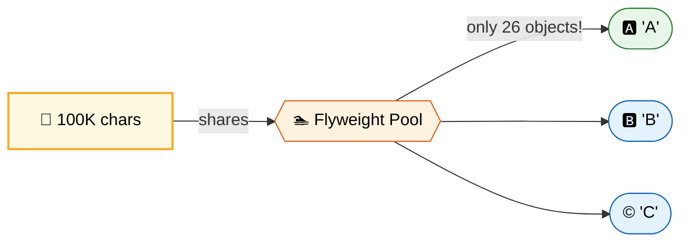
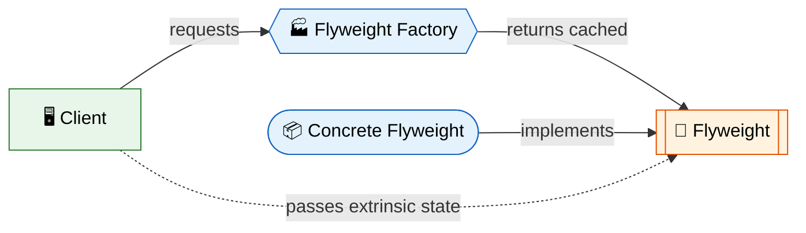
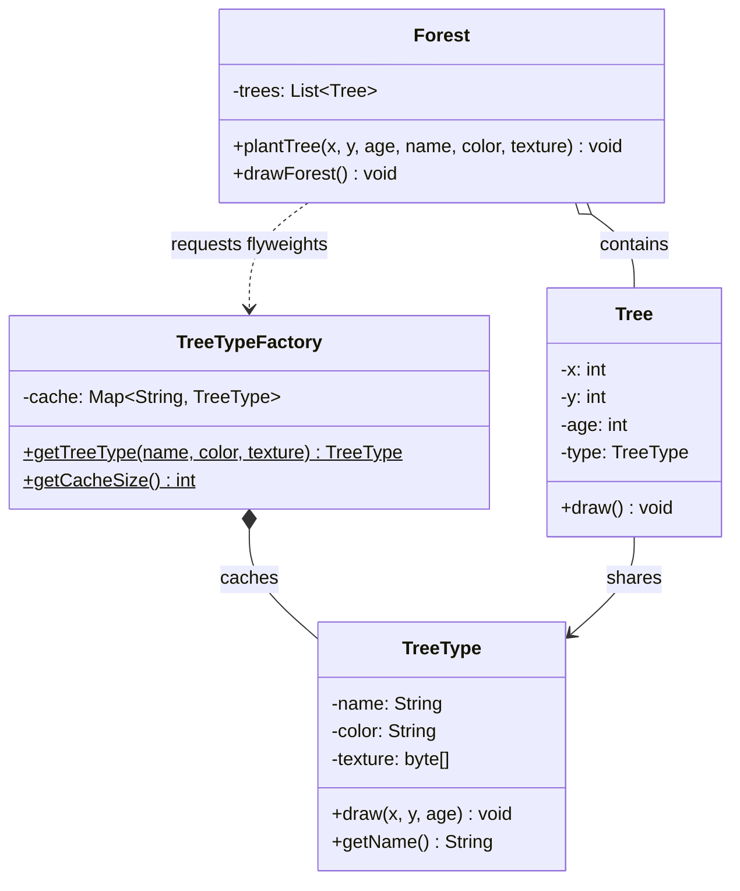
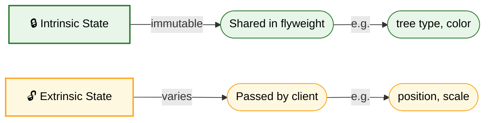

# :feather: Flyweight Design Pattern

> **Use sharing to support large numbers of fine-grained objects efficiently by separating intrinsic (shared) state from extrinsic (unique) state.**

---

## :bulb: Real-World Analogy

!!! abstract "Think of Characters in a Word Processor"
    A document has 100,000 characters. Each character has a glyph (shape), font, and size (intrinsic state — shared) plus a position on the page (extrinsic state — unique). Instead of creating 100,000 separate objects with all data duplicated, the word processor shares character glyph objects. The letter 'A' object is reused for every 'A' in the document — only the position changes.


```mermaid
flowchart LR
    Doc["📄 100K chars"] -->|"shares"| Pool{{"🏊 Flyweight Pool"}}
    Pool -->|"only 26 objects!"| A(["🅰️ 'A'"])
    Pool --> B(["🅱️ 'B'"])
    Pool --> C(["©️ 'C'"])

    style Doc fill:#FFF8E1,stroke:#F9A825,stroke-width:2px,color:#000
    style Pool fill:#FFF3E0,stroke:#E65100,color:#000
    style A fill:#E8F5E9,stroke:#2E7D32,color:#000
    style B fill:#E3F2FD,stroke:#1565C0,color:#000
    style C fill:#E3F2FD,stroke:#1565C0,color:#000
```

---

## :triangular_ruler: Pattern Structure


```mermaid
flowchart LR
    Client["🖥️ Client"] -->|"requests"| Factory{{"🏭 Flyweight Factory"}}
    Factory -->|"returns cached"| FW[["🎯 Flyweight"]]
    ConcreteFW(["📦 Concrete Flyweight"]) -->|"implements"| FW
    Client -.->|"passes extrinsic state"| FW

    style Client fill:#E8F5E9,stroke:#2E7D32,color:#000
    style Factory fill:#E3F2FD,stroke:#1565C0,color:#000
    style FW fill:#FFF3E0,stroke:#E65100,color:#000
    style ConcreteFW fill:#E3F2FD,stroke:#1565C0,color:#000
```

## UML Class Diagram


```mermaid
classDiagram
    class TreeType {
        -name: String
        -color: String
        -texture: byte[]
        +draw(x, y, age) void
        +getName() String
    }
    class TreeTypeFactory {
        -cache: Map~String, TreeType~
        +getTreeType(name, color, texture)$ TreeType
        +getCacheSize()$ int
    }
    class Tree {
        -x: int
        -y: int
        -age: int
        -type: TreeType
        +draw() void
    }
    class Forest {
        -trees: List~Tree~
        +plantTree(x, y, age, name, color, texture) void
        +drawForest() void
    }

    TreeTypeFactory *-- TreeType : caches
    Tree --> TreeType : shares
    Forest o-- Tree : contains
    Forest ..> TreeTypeFactory : requests flyweights
```

### Intrinsic vs Extrinsic State


```mermaid
flowchart LR
    Int["🔒 Intrinsic State"] -->|"immutable"| Shared(["Shared in flyweight"])
    Shared -->|"e.g."| Ex1(["tree type, color"])
    Ext["🔓 Extrinsic State"] -->|"varies"| Unique(["Passed by client"])
    Unique -->|"e.g."| Ex2(["position, scale"])

    style Int fill:#E8F5E9,stroke:#2E7D32,stroke-width:2px,color:#000
    style Shared fill:#E8F5E9,stroke:#2E7D32,color:#000
    style Ex1 fill:#E8F5E9,stroke:#2E7D32,color:#000
    style Ext fill:#FFF8E1,stroke:#F9A825,stroke-width:2px,color:#000
    style Unique fill:#FFF8E1,stroke:#F9A825,color:#000
    style Ex2 fill:#FFF8E1,stroke:#F9A825,color:#000
```

---

## :x: The Problem

You're building a game with a forest of **1,000,000 trees**. Each tree has:

- Tree type name (Oak, Pine, Birch)
- Color
- Texture (large bitmap data)
- X, Y position on map
- Age

Without Flyweight, each tree object stores **everything** — including the massive texture data. 1 million trees x 5MB texture = **5 TB of RAM**! Clearly impossible.

---

## Without This Pattern

```java
// BAD: Every tree stores its own copy of the massive texture data
public class Tree {
    private int x, y, age;
    private String name;
    private String color;
    private byte[] texture; // 5MB per tree!

    public Tree(int x, int y, int age, String name, String color, byte[] texture) {
        this.x = x;
        this.y = y;
        this.age = age;
        this.name = name;
        this.color = color;
        this.texture = texture.clone(); // Each tree gets its OWN copy
    }
}

// Planting a forest
public class Forest {
    private List<Tree> trees = new ArrayList<>();

    public void plantForest() {
        byte[] oakTexture = loadTexture("oak.png"); // 5MB
        for (int i = 0; i < 1_000_000; i++) {
            // 1,000,000 trees x 5MB = 5 TERABYTES of RAM!
            trees.add(new Tree(randX(), randY(), randAge(),
                "Oak", "Green", oakTexture));
        }
        // OutOfMemoryError long before we finish
    }
}
```

**Problems:**

- **Catastrophic memory waste**: 1 million trees each storing a 5MB texture = ~5 TB of RAM needed, when only 3 unique textures actually exist (Oak, Pine, Birch)
- **OutOfMemoryError in production**: The application crashes because it allocates millions of duplicate objects that share identical intrinsic data
- **Object creation overhead**: Allocating and garbage-collecting millions of heavyweight objects slows the JVM to a crawl with GC pauses
- **No sharing awareness**: The code treats each tree as fully independent even though 333,000 Oak trees are byte-for-byte identical in name, color, and texture
- **Pain point**: Your game runs fine in testing with 100 trees but crashes in production with realistic forest sizes — and "just buy more RAM" is not a viable solution for a 5TB working set

---

## :white_check_mark: The Solution

The Flyweight pattern separates the object's data into:

| State Type | Description | Storage |
|------------|-------------|---------|
| **Intrinsic** | Shared across instances, immutable | Inside the flyweight (cached) |
| **Extrinsic** | Unique per instance, context-dependent | Passed by client at runtime |

For our forest:
- **Intrinsic** (shared): type name, color, texture → stored in `TreeType` flyweight
- **Extrinsic** (unique): x, y position, age → stored/passed by client

Now 1 million trees share just 3 TreeType objects (Oak, Pine, Birch). RAM usage drops from TBs to MBs!

---

## :hammer_and_wrench: Implementation

=== "Forest/Tree Example"

    ```java
    // Flyweight — shared tree type data
    public class TreeType {
        private final String name;
        private final String color;
        private final byte[] texture; // Large data — shared!

        public TreeType(String name, String color, byte[] texture) {
            this.name = name;
            this.color = color;
            this.texture = texture;
            System.out.println("Created TreeType: " + name + " (texture: " + texture.length + " bytes)");
        }

        // Operation uses both intrinsic (this) and extrinsic (params) state
        public void draw(int x, int y, int age) {
            System.out.printf("Drawing %s tree at (%d,%d), age=%d, color=%s%n",
                              name, x, y, age, color);
        }

        public String getName() { return name; }
    }

    // Flyweight Factory — ensures sharing
    public class TreeTypeFactory {
        private static final Map<String, TreeType> cache = new HashMap<>();

        public static TreeType getTreeType(String name, String color, byte[] texture) {
            String key = name + "_" + color;

            return cache.computeIfAbsent(key, k -> new TreeType(name, color, texture));
        }

        public static int getCacheSize() {
            return cache.size();
        }
    }

    // Context — stores extrinsic state + reference to flyweight
    public class Tree {
        private final int x;        // extrinsic
        private final int y;        // extrinsic
        private final int age;      // extrinsic
        private final TreeType type; // flyweight reference (intrinsic state)

        public Tree(int x, int y, int age, TreeType type) {
            this.x = x;
            this.y = y;
            this.age = age;
            this.type = type;
        }

        public void draw() {
            type.draw(x, y, age); // Pass extrinsic state to flyweight
        }
    }

    // Client — the forest
    public class Forest {
        private final List<Tree> trees = new ArrayList<>();

        public void plantTree(int x, int y, int age, String name, String color, byte[] texture) {
            TreeType type = TreeTypeFactory.getTreeType(name, color, texture);
            trees.add(new Tree(x, y, age, type));
        }

        public void drawForest() {
            trees.forEach(Tree::draw);
        }

        public static void main(String[] args) {
            Forest forest = new Forest();
            Random random = new Random();

            byte[] oakTexture = new byte[5_000_000];   // 5MB texture
            byte[] pineTexture = new byte[4_000_000];  // 4MB texture
            byte[] birchTexture = new byte[3_000_000]; // 3MB texture

            // Plant 1 million trees — only 3 TreeType objects created!
            for (int i = 0; i < 1_000_000; i++) {
                int x = random.nextInt(10000);
                int y = random.nextInt(10000);
                int age = random.nextInt(100);

                switch (random.nextInt(3)) {
                    case 0 -> forest.plantTree(x, y, age, "Oak", "Green", oakTexture);
                    case 1 -> forest.plantTree(x, y, age, "Pine", "DarkGreen", pineTexture);
                    case 2 -> forest.plantTree(x, y, age, "Birch", "White", birchTexture);
                }
            }

            System.out.println("Trees planted: " + 1_000_000);
            System.out.println("Unique TreeType objects: " + TreeTypeFactory.getCacheSize());
            // Output: Trees planted: 1000000
            // Output: Unique TreeType objects: 3
        }
    }
    ```

=== "Text Editor Characters"

    ```java
    // Flyweight — character glyph
    public class CharacterGlyph {
        private final char character;
        private final String font;
        private final int size;
        private final boolean bold;

        public CharacterGlyph(char character, String font, int size, boolean bold) {
            this.character = character;
            this.font = font;
            this.size = size;
            this.bold = bold;
        }

        // Extrinsic state (row, col) passed at render time
        public void render(int row, int col) {
            System.out.printf("'%c' [%s %dpx %s] at (%d,%d)%n",
                character, font, size, bold ? "bold" : "normal", row, col);
        }

        public String getKey() {
            return character + "_" + font + "_" + size + "_" + bold;
        }
    }

    // Flyweight Factory
    public class GlyphFactory {
        private final Map<String, CharacterGlyph> glyphs = new HashMap<>();
        private int creationCount = 0;

        public CharacterGlyph getGlyph(char c, String font, int size, boolean bold) {
            String key = c + "_" + font + "_" + size + "_" + bold;

            if (!glyphs.containsKey(key)) {
                glyphs.put(key, new CharacterGlyph(c, font, size, bold));
                creationCount++;
            }

            return glyphs.get(key);
        }

        public void printStats(int totalCharacters) {
            System.out.println("Total characters in document: " + totalCharacters);
            System.out.println("Unique glyph objects created: " + creationCount);
            System.out.printf("Memory saved: %.1f%%%n",
                (1.0 - (double) creationCount / totalCharacters) * 100);
        }
    }

    // Usage
    public class TextEditor {
        public static void main(String[] args) {
            GlyphFactory factory = new GlyphFactory();
            String document = "Hello World! This is a flyweight demo. Hello again!";
            int totalChars = 0;

            for (int i = 0; i < document.length(); i++) {
                char c = document.charAt(i);
                CharacterGlyph glyph = factory.getGlyph(c, "Arial", 12, false);
                glyph.render(0, i); // row=0, col=i (extrinsic state)
                totalChars++;
            }

            factory.printStats(totalChars);
            // Unique glyph objects: ~20 (unique chars)
            // vs 51 objects without flyweight
        }
    }
    ```

=== "Connection Pool (Practical)"

    ```java
    // Flyweight — database connection wrapper
    public class DatabaseConnection {
        private final String url;
        private final String driver;
        private boolean inUse;

        public DatabaseConnection(String url, String driver) {
            this.url = url;
            this.driver = driver;
            this.inUse = false;
            System.out.println("Creating expensive DB connection to: " + url);
            // Simulate expensive connection setup
        }

        public void executeQuery(String query) {
            System.out.println("[" + url + "] Executing: " + query);
        }

        public boolean isInUse() { return inUse; }
        public void acquire() { this.inUse = true; }
        public void release() { this.inUse = false; }
    }

    // Flyweight Factory — Connection Pool
    public class ConnectionPool {
        private final List<DatabaseConnection> pool;
        private final int maxSize;

        public ConnectionPool(String url, String driver, int maxSize) {
            this.maxSize = maxSize;
            this.pool = new ArrayList<>();
            // Pre-create connections (flyweight objects)
            for (int i = 0; i < maxSize; i++) {
                pool.add(new DatabaseConnection(url, driver));
            }
        }

        public synchronized DatabaseConnection acquire() {
            for (DatabaseConnection conn : pool) {
                if (!conn.isInUse()) {
                    conn.acquire();
                    return conn;
                }
            }
            throw new RuntimeException("Connection pool exhausted! Max: " + maxSize);
        }

        public synchronized void release(DatabaseConnection conn) {
            conn.release();
        }

        public int getActiveCount() {
            return (int) pool.stream().filter(DatabaseConnection::isInUse).count();
        }
    }

    // Usage
    public class App {
        public static void main(String[] args) {
            ConnectionPool pool = new ConnectionPool("jdbc:mysql://localhost/db", "mysql", 5);

            // 1000 queries, only 5 connection objects!
            DatabaseConnection conn = pool.acquire();
            conn.executeQuery("SELECT * FROM users");
            pool.release(conn);

            System.out.println("Active connections: " + pool.getActiveCount());
        }
    }
    ```

---

## :dart: When to Use

- Your application uses a **large number of objects** that consume significant memory
- Most object state can be made **extrinsic** (moved outside the object)
- Many groups of objects can be replaced by **fewer shared objects** once extrinsic state is removed
- The application doesn't depend on **object identity** (shared objects are interchangeable)
- You need to optimize for **memory over CPU** (slight computational overhead for huge memory savings)

---

## :globe_with_meridians: Real-World Examples

| Where | Example |
|-------|---------|
| **JDK** | `Integer.valueOf()` — caches Integer objects for -128 to 127 |
| **JDK** | `String.intern()` — shares String objects in the string pool |
| **JDK** | `Boolean.valueOf()` — only two Boolean objects ever exist |
| **JDK** | `java.util.regex.Pattern` — compiled patterns are cached |
| **Connection Pools** | HikariCP, Apache DBCP — reuse connection objects |
| **Thread Pools** | `ExecutorService` — reuses thread objects |
| **Game Engines** | Particle systems, tile maps, sprite sharing |
| **Browsers** | DOM element type metadata shared across instances |

---

## :warning: Pitfalls

!!! warning "Common Mistakes"
    - **Mutable intrinsic state**: Flyweight intrinsic state MUST be immutable — otherwise sharing breaks (one client's change affects all others)
    - **Thread safety**: The flyweight factory (cache) must be thread-safe if accessed concurrently — use `ConcurrentHashMap` or synchronization
    - **Over-optimization**: Don't apply Flyweight when you have few objects — the indirection overhead isn't worth it
    - **Complex extrinsic state management**: If extrinsic state is complex, clients bear the burden of managing and passing it
    - **Identity confusion**: `flyweight1 == flyweight2` may be true for "different" logical objects — don't rely on identity for flyweights

---

## :memo: Key Takeaways

!!! tip "Summary"
    | Aspect | Detail |
    |--------|--------|
    | **Intent** | Share objects to reduce memory footprint dramatically |
    | **Mechanism** | Separate intrinsic (shared) from extrinsic (unique) state |
    | **Key Requirement** | Intrinsic state must be **immutable** |
    | **Key Benefit** | Reduces memory from O(n) to O(k) where k << n |
    | **Trade-off** | Saves memory at the cost of CPU (looking up shared objects, passing extrinsic state) |
    | **Interview Tip** | "`Integer.valueOf(42)` returns a cached flyweight — that's why `==` works for small integers in Java" |
