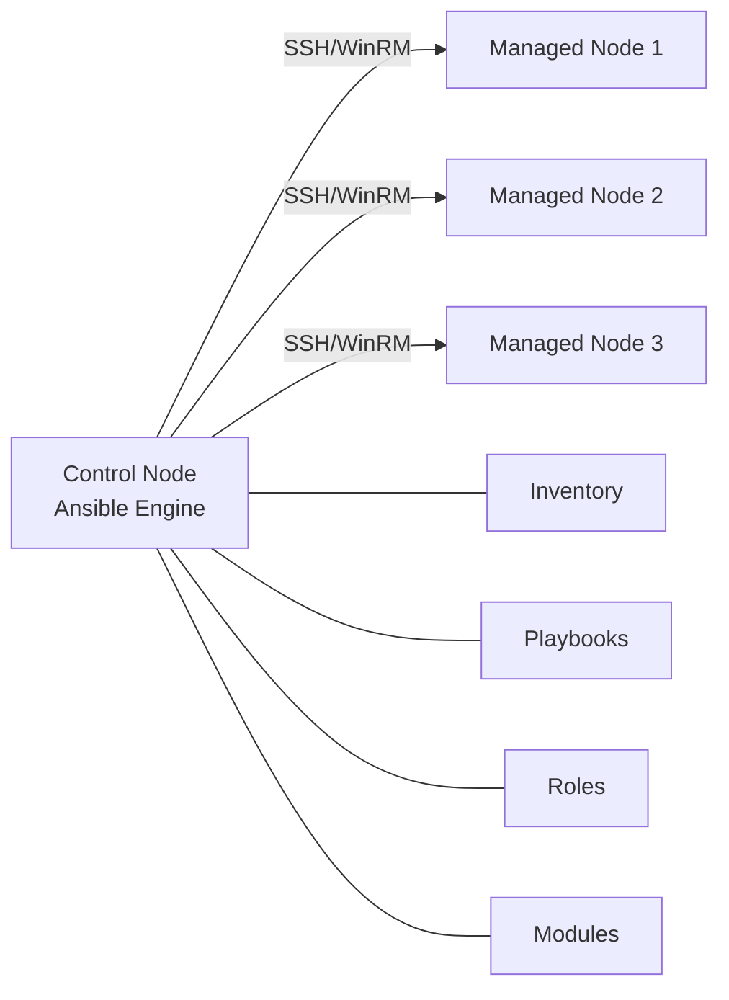

# Ansible

## Why Ansible Matters

Ansible is the most widely adopted configuration management and automation tool in the DevOps ecosystem. It uses a simple, human-readable YAML syntax, requires no agents on managed nodes, and works over standard SSH. For infrastructure and DevOps interview roles, Ansible knowledge is frequently tested because it bridges the gap between development and operations — enabling Infrastructure as Code (IaC), repeatable deployments, and environment consistency.

Key reasons teams choose Ansible:

- **Agentless** — no software to install on managed nodes
- **Idempotent** — running the same playbook multiple times produces the same result
- **Declarative + Procedural** — describe desired state; Ansible figures out how to get there
- **Massive module library** — 3,000+ modules for cloud, network, containers, and OS tasks
- **Low learning curve** — YAML-based, no custom DSL

---

## Architecture

Ansible follows a **push-based, agentless** model. The control node pushes configuration to managed nodes over SSH (Linux) or WinRM (Windows).



| Component | Description |
|-----------|-------------|
| **Control Node** | Machine where Ansible is installed and playbooks are executed |
| **Managed Nodes** | Target servers managed by Ansible (no agent required) |
| **Inventory** | List of managed nodes (static file or dynamic script) |
| **Modules** | Units of work Ansible ships to managed nodes |
| **Plugins** | Extend Ansible core (connection, callback, lookup, filter) |

---

## Core Concepts

### Inventory

The inventory defines which hosts Ansible manages.

**Static Inventory** (`hosts.ini`):

```ini
[webservers]
web1.example.com
web2.example.com

[dbservers]
db1.example.com ansible_user=admin ansible_port=2222

[all:vars]
ansible_python_interpreter=/usr/bin/python3
```

**Dynamic Inventory** — scripts or plugins that query cloud providers (AWS, GCP, Azure) at runtime:

```bash
ansible-inventory -i aws_ec2.yml --graph
```

### Playbooks

Playbooks are YAML files that define automation workflows.

```yaml
---
- name: Configure web servers
  hosts: webservers
  become: yes
  vars:
    http_port: 80

  tasks:
    - name: Install nginx
      apt:
        name: nginx
        state: present
        update_cache: yes

    - name: Start nginx service
      service:
        name: nginx
        state: started
        enabled: yes
```

**Structure breakdown:**

- `hosts` — target group from inventory
- `become` — privilege escalation (sudo)
- `vars` — variables scoped to the play
- `tasks` — ordered list of actions

### Tasks

A task is a single unit of action that calls a module:

```yaml
- name: Create application directory
  file:
    path: /opt/myapp
    state: directory
    owner: deploy
    mode: '0755'
```

### Handlers

Handlers are tasks triggered only when notified by other tasks — used to avoid unnecessary restarts:

```yaml
tasks:
  - name: Update nginx config
    template:
      src: nginx.conf.j2
      dest: /etc/nginx/nginx.conf
    notify: restart nginx

handlers:
  - name: restart nginx
    service:
      name: nginx
      state: restarted
```

### Roles

Roles provide a structured way to organize playbooks into reusable components (covered in detail below).

### Modules

Commonly used modules for interviews:

| Module | Purpose | Example |
|--------|---------|---------|
| `command` | Run shell commands | `command: uptime` |
| `shell` | Run commands through shell | `shell: cat /etc/passwd | grep root` |
| `copy` | Copy files to remote | `copy: src=app.conf dest=/etc/` |
| `file` | Manage files/directories | `file: path=/tmp/dir state=directory` |
| `template` | Deploy Jinja2 templates | `template: src=nginx.j2 dest=/etc/nginx/nginx.conf` |
| `service` | Manage services | `service: name=nginx state=started` |
| `apt` | Manage Debian packages | `apt: name=nginx state=present` |
| `yum` | Manage RHEL packages | `yum: name=httpd state=latest` |
| `docker_container` | Manage Docker containers | `docker_container: name=app image=myapp:latest` |
| `git` | Clone repositories | `git: repo=https://github.com/... dest=/opt/app` |
| `lineinfile` | Manage lines in files | `lineinfile: path=/etc/hosts line="..."` |

### Variables, Facts, and Templates

**Variables** can be defined at multiple levels (precedence low to high):

1. Role defaults
2. Inventory vars
3. Playbook vars
4. Role vars
5. Extra vars (`-e` on CLI — highest precedence)

**Facts** are system information auto-gathered:

```yaml
- name: Print OS family
  debug:
    msg: "OS is {{ ansible_os_family }}"
```

**Jinja2 Templates** (`nginx.conf.j2`):

```jinja2
server {
    listen {{ http_port }};
    server_name {{ server_name }};

    location / {
        proxy_pass http://127.0.0.1:{{ app_port }};
    }
}
```

---

## Playbook Examples

### Install and Configure Nginx

```yaml
---
- name: Install and configure Nginx
  hosts: webservers
  become: yes
  vars:
    server_name: myapp.example.com
    http_port: 80
    app_port: 8080

  tasks:
    - name: Install Nginx
      apt:
        name: nginx
        state: present
        update_cache: yes

    - name: Deploy Nginx configuration
      template:
        src: templates/nginx.conf.j2
        dest: /etc/nginx/sites-available/default
      notify: reload nginx

    - name: Ensure Nginx is running
      service:
        name: nginx
        state: started
        enabled: yes

  handlers:
    - name: reload nginx
      service:
        name: nginx
        state: reloaded
```

### Deploy a Java Spring Boot Application

```yaml
---
- name: Deploy Spring Boot application
  hosts: appservers
  become: yes
  vars:
    app_name: myservice
    app_version: "1.2.0"
    app_user: springapp
    app_port: 8080
    jar_url: "https://artifacts.example.com/{{ app_name }}-{{ app_version }}.jar"

  tasks:
    - name: Create application user
      user:
        name: "{{ app_user }}"
        shell: /usr/sbin/nologin
        system: yes

    - name: Create app directory
      file:
        path: "/opt/{{ app_name }}"
        state: directory
        owner: "{{ app_user }}"
        mode: '0755'

    - name: Install Java 17
      apt:
        name: openjdk-17-jre-headless
        state: present

    - name: Download application JAR
      get_url:
        url: "{{ jar_url }}"
        dest: "/opt/{{ app_name }}/{{ app_name }}.jar"
        owner: "{{ app_user }}"
        mode: '0644'
      notify: restart app

    - name: Deploy systemd service file
      template:
        src: templates/springboot.service.j2
        dest: "/etc/systemd/system/{{ app_name }}.service"
      notify: restart app

    - name: Enable and start application
      systemd:
        name: "{{ app_name }}"
        enabled: yes
        state: started
        daemon_reload: yes

  handlers:
    - name: restart app
      systemd:
        name: "{{ app_name }}"
        state: restarted
        daemon_reload: yes
```

### Docker Container Management

```yaml
---
- name: Manage Docker containers
  hosts: docker_hosts
  become: yes

  tasks:
    - name: Install Docker dependencies
      apt:
        name:
          - apt-transport-https
          - ca-certificates
          - curl
          - gnupg
        state: present

    - name: Install Docker
      apt:
        name: docker-ce
        state: present

    - name: Install Docker Python SDK
      pip:
        name: docker
        state: present

    - name: Pull application image
      docker_image:
        name: myapp
        tag: latest
        source: pull

    - name: Run application container
      docker_container:
        name: myapp
        image: myapp:latest
        state: started
        restart_policy: always
        ports:
          - "8080:8080"
        env:
          SPRING_PROFILES_ACTIVE: production
          DB_HOST: "{{ db_host }}"
        volumes:
          - /var/log/myapp:/app/logs

    - name: Remove old containers
      docker_prune:
        containers: yes
        images: yes
        images_filters:
          dangling: true
```

---

## Roles

Roles provide a standardized directory structure for reusable automation.

### Directory Structure

```
roles/
  webserver/
    defaults/       # Default variables (lowest precedence)
      main.yml
    files/          # Static files to copy
    handlers/       # Handler definitions
      main.yml
    meta/           # Role metadata and dependencies
      main.yml
    tasks/          # Main task list
      main.yml
    templates/      # Jinja2 templates
    vars/           # Role variables (high precedence)
      main.yml
```

### Using Roles in a Playbook

```yaml
---
- name: Setup web infrastructure
  hosts: webservers
  become: yes
  roles:
    - common
    - webserver
    - { role: monitoring, tags: ['monitoring'] }
```

### Ansible Galaxy

Galaxy is the community hub for sharing roles:

```bash
# Install a role from Galaxy
ansible-galaxy install geerlingguy.docker

# Initialize a new role skeleton
ansible-galaxy init my_custom_role

# Install roles from requirements file
ansible-galaxy install -r requirements.yml
```

---

## Ansible vs Terraform vs Chef vs Puppet

| Feature | Ansible | Terraform | Chef | Puppet |
|---------|---------|-----------|------|--------|
| **Type** | Config Management + Orchestration | Infrastructure Provisioning | Config Management | Config Management |
| **Language** | YAML (Playbooks) | HCL | Ruby DSL (Recipes) | Puppet DSL (Manifests) |
| **Architecture** | Agentless (push) | Agentless (API calls) | Agent-based (pull) | Agent-based (pull) |
| **State Management** | Stateless | Stateful (tfstate) | Chef Server | PuppetDB |
| **Learning Curve** | Low | Medium | High | High |
| **Idempotent** | Yes | Yes | Yes | Yes |
| **Best For** | App deployment, config | Cloud infra provisioning | Complex infra config | Large-scale compliance |
| **Community** | Very large | Very large | Medium | Medium |
| **Cloud Support** | Good | Excellent | Good | Good |
| **Mutable vs Immutable** | Mutable infra | Immutable infra | Mutable infra | Mutable infra |

**When to use what:**

- **Ansible** — application deployment, configuration management, ad-hoc tasks
- **Terraform** — provisioning cloud infrastructure (VPCs, VMs, databases)
- **Together** — Terraform provisions infra, Ansible configures it

---

## Best Practices

### Idempotency

Always use modules instead of raw `command`/`shell` where possible. Modules ensure idempotency:

```yaml
# GOOD - idempotent
- apt:
    name: nginx
    state: present

# BAD - not idempotent
- command: apt-get install -y nginx
```

### Tags

Use tags to run specific parts of playbooks:

```yaml
tasks:
  - name: Install packages
    apt:
      name: nginx
    tags: [install, packages]

  - name: Configure app
    template:
      src: app.conf.j2
      dest: /etc/app/config
    tags: [configure]
```

```bash
ansible-playbook site.yml --tags "configure"
ansible-playbook site.yml --skip-tags "install"
```

### Ansible Vault for Secrets

Encrypt sensitive data:

```bash
# Create encrypted file
ansible-vault create secrets.yml

# Encrypt existing file
ansible-vault encrypt vars/credentials.yml

# Run playbook with vault
ansible-playbook site.yml --ask-vault-pass
ansible-playbook site.yml --vault-password-file ~/.vault_pass
```

```yaml
# In playbook, include encrypted vars
vars_files:
  - vars/credentials.yml
```

### Handlers for Service Restarts

Only restart services when configuration actually changes:

```yaml
tasks:
  - name: Update config
    template:
      src: app.conf.j2
      dest: /etc/app/app.conf
    notify: restart app

handlers:
  - name: restart app
    service:
      name: myapp
      state: restarted
```

### Other Best Practices

- Use `ansible-lint` to check playbooks for issues
- Keep playbooks in version control (Git)
- Use `--check` (dry run) and `--diff` before applying changes
- Group variables logically: `group_vars/`, `host_vars/`
- Prefer `state: present` over `state: latest` for stability
- Use `block/rescue/always` for error handling

---

## Interview Questions

??? question "What is Ansible and how does it differ from other configuration management tools?"

    Ansible is an open-source automation tool for configuration management, application deployment, and orchestration. Key differences:

    - **Agentless**: Unlike Chef/Puppet, no agent software on managed nodes — uses SSH
    - **Push-based**: Control node pushes config (vs pull model in Chef/Puppet)
    - **YAML syntax**: Simpler than Ruby DSL (Chef) or Puppet DSL
    - **No central server required**: Can run from any machine with Ansible installed
    - **Procedural + Declarative**: Tasks execute in order but modules are declarative

??? question "Explain idempotency in Ansible. Why is it important?"

    Idempotency means running a playbook multiple times produces the same end state without unintended side effects. For example, `apt: name=nginx state=present` will install nginx only if it is not already installed.

    **Why it matters:**

    - Safe to re-run playbooks after failures (resume from any point)
    - No duplicate resources or conflicting state
    - Enables "desired state" configuration
    - Critical for CI/CD pipelines that run playbooks on every deploy

    **Caveat:** `command` and `shell` modules are NOT idempotent by default. Use `creates`, `removes`, or `when` conditions to make them safe.

??? question "What is the difference between `vars`, `defaults`, and `extra vars` in Ansible?"

    Ansible has a 22-level variable precedence hierarchy. The key levels:

    - **Role defaults** (`defaults/main.yml`): Lowest precedence; meant to be overridden
    - **Inventory vars** (`group_vars/`, `host_vars/`): Per-group or per-host values
    - **Play vars** (`vars:` in playbook): Scoped to the play
    - **Role vars** (`vars/main.yml`): High precedence; hard to override
    - **Extra vars** (`-e` on CLI): Highest precedence; overrides everything

    Best practice: Put defaults in `defaults/`, environment-specific values in `group_vars/`, and use extra vars only for one-off overrides.

??? question "How do you handle secrets in Ansible?"

    **Ansible Vault** is the built-in solution for encrypting sensitive data:

    - Encrypt entire files: `ansible-vault encrypt secrets.yml`
    - Encrypt single variables: `ansible-vault encrypt_string 'mysecret' --name 'db_password'`
    - Decrypt at runtime: `--ask-vault-pass` or `--vault-password-file`
    - Multiple vault IDs for different environments

    **Best practices:**

    - Never commit unencrypted secrets to version control
    - Use separate vault files per environment
    - Store vault password in a secure secret manager (not in repo)
    - Consider integrating with HashiCorp Vault or AWS Secrets Manager via lookup plugins

??? question "Explain Ansible Roles and when you would use them."

    Roles are a way to organize playbooks into reusable, shareable components with a standardized directory structure (`tasks/`, `handlers/`, `templates/`, `defaults/`, `vars/`, `files/`, `meta/`).

    **When to use roles:**

    - When the same configuration applies to multiple projects
    - When a playbook grows beyond 100+ lines
    - When you want to share automation with the team or community (Galaxy)
    - To separate concerns (e.g., `common`, `webserver`, `database`, `monitoring`)

    **Role dependencies** are declared in `meta/main.yml`, ensuring prerequisite roles run first. Ansible Galaxy provides thousands of community roles for common tasks.

??? question "How would you deploy a zero-downtime application update with Ansible?"

    A rolling update strategy using Ansible:

    ```yaml
    - name: Rolling deployment
      hosts: appservers
      serial: 1              # Deploy one server at a time
      max_fail_percentage: 0 # Stop if any server fails

      pre_tasks:
        - name: Remove from load balancer
          uri:
            url: "http://lb.example.com/api/deregister/{{ inventory_hostname }}"
            method: POST

      tasks:
        - name: Deploy new version
          copy:
            src: "app-{{ version }}.jar"
            dest: /opt/app/app.jar
          notify: restart app

        - name: Wait for app to be healthy
          uri:
            url: "http://localhost:8080/actuator/health"
            status_code: 200
          retries: 30
          delay: 5

      post_tasks:
        - name: Re-register with load balancer
          uri:
            url: "http://lb.example.com/api/register/{{ inventory_hostname }}"
            method: POST

      handlers:
        - name: restart app
          service:
            name: myapp
            state: restarted
    ```

    Key elements: `serial: 1` for rolling updates, load balancer integration, health checks, and `max_fail_percentage` for safety.
