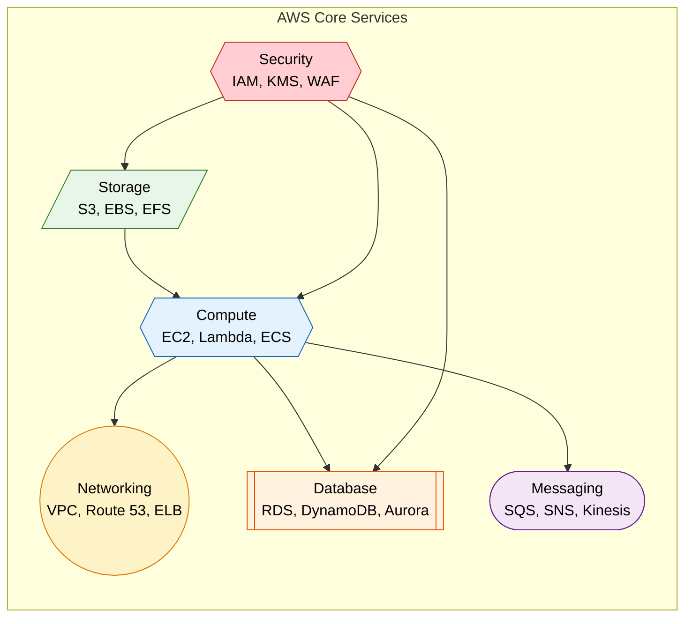
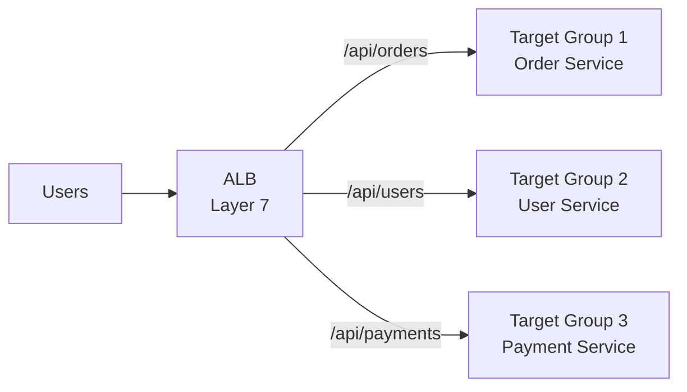
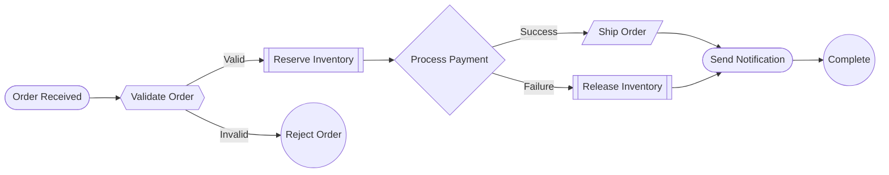
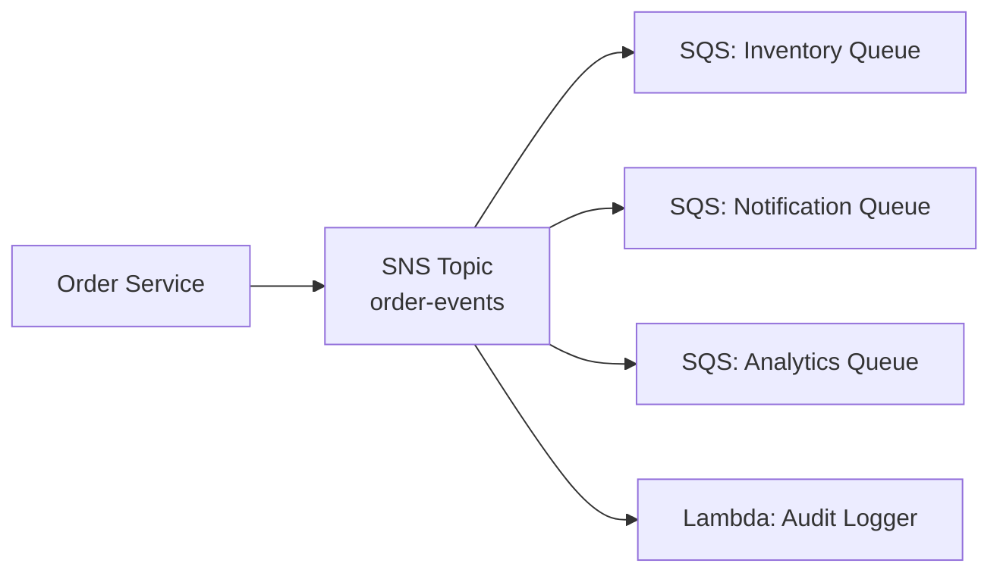
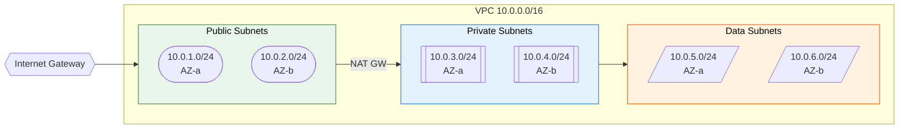

# AWS (Amazon Web Services) for Backend Engineers

> **A comprehensive reference of core AWS services, architecture patterns, and interview-ready knowledge for Java/backend engineers targeting FAANG roles.**

---

!!! abstract "Why AWS Matters in Interviews"
    Most FAANG system design interviews assume cloud deployment. You are expected to pick appropriate AWS services, reason about trade-offs (cost, latency, durability), and sketch architectures using real service names rather than generic "cloud storage" boxes.



---

## Compute

### EC2 (Elastic Compute Cloud)

Virtual servers in the cloud. You pick instance type, OS, and networking.

| Instance Family | Use Case | Example |
|---|---|---|
| **t3/t4g** | Burstable, dev/test, small apps | t3.medium |
| **m6i/m7g** | General purpose, web servers | m6i.xlarge |
| **c6i/c7g** | Compute-intensive, batch processing | c6i.2xlarge |
| **r6i/r7g** | Memory-intensive, in-memory caches | r6i.4xlarge |
| **i3/i4i** | Storage-optimized, data warehouses | i3.large |

```bash
# Launch an EC2 instance
aws ec2 run-instances \
  --image-id ami-0abcdef1234567890 \
  --instance-type t3.medium \
  --key-name my-key-pair \
  --security-group-ids sg-0123456789abcdef0 \
  --subnet-id subnet-0bb1c79de3EXAMPLE \
  --count 1
```

### Auto Scaling

Automatically adjusts the number of EC2 instances based on demand.

- **Target Tracking** - Keep average CPU at 60%
- **Step Scaling** - Add 2 instances when CPU > 80%, remove 1 when CPU < 30%
- **Scheduled Scaling** - Scale up at 9 AM, scale down at 6 PM

!!! tip "Interview Insight"
    Always mention Auto Scaling Groups (ASG) with health checks. The ASG replaces unhealthy instances automatically, providing self-healing. Combine with ELB for zero-downtime deployments.

### Elastic Load Balancing (ELB)

| Type | Layer | Use Case |
|---|---|---|
| **ALB** (Application) | Layer 7 | HTTP/HTTPS, path-based routing, WebSocket |
| **NLB** (Network) | Layer 4 | TCP/UDP, ultra-low latency, static IP |
| **GWLB** (Gateway) | Layer 3 | Third-party virtual appliances |



---

## Storage

### S3 (Simple Storage Service)

Object storage with 11 9s of durability (99.999999999%).

| Storage Class | Use Case | Retrieval |
|---|---|---|
| **S3 Standard** | Frequently accessed data | Immediate |
| **S3 Intelligent-Tiering** | Unknown access patterns | Immediate |
| **S3 Standard-IA** | Infrequent access, but needs fast retrieval | Immediate |
| **S3 One Zone-IA** | Reproducible, infrequent data | Immediate |
| **S3 Glacier Instant** | Archive with instant access | Immediate |
| **S3 Glacier Flexible** | Archive, minutes-to-hours retrieval | 1-12 hours |
| **S3 Glacier Deep Archive** | Long-term archive | 12-48 hours |

**Lifecycle Policy Example (CloudFormation):**

```yaml
Resources:
  MyBucket:
    Type: AWS::S3::Bucket
    Properties:
      BucketName: my-app-data
      LifecycleConfiguration:
        Rules:
          - Id: TransitionToIA
            Status: Enabled
            Transitions:
              - StorageClass: STANDARD_IA
                TransitionInDays: 30
              - StorageClass: GLACIER
                TransitionInDays: 90
            ExpirationInDays: 365
```

### EBS vs EFS

| Feature | EBS (Elastic Block Store) | EFS (Elastic File System) |
|---|---|---|
| Type | Block storage | File storage (NFS) |
| Attachment | Single EC2 instance (one AZ) | Multiple instances (cross-AZ) |
| Performance | Up to 256,000 IOPS (io2) | Throughput scales with size |
| Use Case | Databases, boot volumes | Shared content, CMS, ML training |
| Pricing | Pay for provisioned size | Pay for what you use |

!!! note "EBS Multi-Attach"
    io2 volumes support multi-attach (up to 16 instances), but only within a single AZ. For true shared file systems across AZs, use EFS.

---

## Serverless

### Lambda

Run code without provisioning servers. Pay per invocation and duration.

- **Max execution**: 15 minutes
- **Memory**: 128 MB to 10 GB
- **Concurrency**: 1000 concurrent executions (soft limit)
- **Cold start**: Typically 100-500ms (Java can be 1-3s)

```bash
# Create a Lambda function
aws lambda create-function \
  --function-name OrderProcessor \
  --runtime java17 \
  --handler com.example.OrderHandler::handleRequest \
  --role arn:aws:iam::123456789:role/lambda-exec-role \
  --zip-file fileb://function.zip \
  --memory-size 512 \
  --timeout 30
```

!!! warning "Java Cold Starts"
    Java Lambdas have notoriously high cold starts due to JVM initialization. Mitigations: use **SnapStart** (checkpoint/restore), GraalVM native image, or provisioned concurrency for latency-sensitive workloads.

### API Gateway

Fully managed API front door. Handles throttling, auth, caching, and request transformation.

- **REST API** - Full featured, request validation, WAF integration
- **HTTP API** - Lower latency, lower cost, simpler (use this for most cases)
- **WebSocket API** - Real-time two-way communication

### Step Functions

Orchestrate multiple Lambda functions and AWS services into serverless workflows.



---

## Containers

### ECS (Elastic Container Service)

AWS-native container orchestration. Two launch types:

| Feature | EC2 Launch Type | Fargate Launch Type |
|---|---|---|
| Infrastructure | You manage EC2 instances | AWS manages infrastructure |
| Pricing | Pay for EC2 instances | Pay per vCPU/memory per second |
| Control | Full access to host OS | No host access |
| Best For | Persistent workloads, GPU | Variable workloads, simplicity |

### EKS (Elastic Kubernetes Service)

Managed Kubernetes control plane. Use when you need Kubernetes-specific features or portability across clouds.

!!! tip "ECS vs EKS - Interview Answer"
    Choose **ECS** if you are all-in on AWS and want simpler operations. Choose **EKS** if you need Kubernetes ecosystem tools (Helm, Istio, ArgoCD), multi-cloud portability, or your team already knows Kubernetes.

### Fargate

Serverless compute engine for containers (works with both ECS and EKS). No need to manage underlying EC2 instances.

```yaml
# ECS Task Definition (CloudFormation)
Resources:
  TaskDefinition:
    Type: AWS::ECS::TaskDefinition
    Properties:
      Family: order-service
      Cpu: "512"
      Memory: "1024"
      NetworkMode: awsvpc
      RequiresCompatibilities:
        - FARGATE
      ContainerDefinitions:
        - Name: order-service
          Image: 123456789.dkr.ecr.us-east-1.amazonaws.com/order-service:latest
          PortMappings:
            - ContainerPort: 8080
          LogConfiguration:
            LogDriver: awslogs
            Options:
              awslogs-group: /ecs/order-service
              awslogs-region: us-east-1
              awslogs-stream-prefix: ecs
```

---

## Databases

### RDS (Relational Database Service)

Managed relational databases (MySQL, PostgreSQL, Oracle, SQL Server).

- Automated backups, Multi-AZ failover, read replicas
- **Multi-AZ**: Synchronous replication to standby for HA (automatic failover ~60s)
- **Read Replicas**: Asynchronous replication for read scaling (up to 15 for Aurora)

### Amazon Aurora

MySQL/PostgreSQL-compatible, 5x throughput of standard MySQL.

- Storage auto-scales from 10 GB to 128 TB
- 6 copies of data across 3 AZs
- **Aurora Serverless v2** - Auto-scales compute capacity

### DynamoDB

Fully managed NoSQL (key-value + document). Single-digit millisecond latency at any scale.

| Feature | Description |
|---|---|
| **Partition Key** | Required. Determines data distribution |
| **Sort Key** | Optional. Enables range queries within a partition |
| **GSI** | Global Secondary Index - query on non-key attributes |
| **LSI** | Local Secondary Index - alternate sort key, same partition key |
| **DynamoDB Streams** | Change data capture (CDC), triggers Lambda |
| **DAX** | In-memory cache for DynamoDB (microsecond reads) |

!!! tip "DynamoDB Design"
    Design your table for your access patterns first. Unlike RDS, you cannot add arbitrary queries later. Think: "What questions will I ask?" before defining keys and indexes.

```bash
# Create a DynamoDB table
aws dynamodb create-table \
  --table-name Orders \
  --attribute-definitions \
    AttributeName=customerId,AttributeType=S \
    AttributeName=orderId,AttributeType=S \
  --key-schema \
    AttributeName=customerId,KeyType=HASH \
    AttributeName=orderId,KeyType=RANGE \
  --billing-mode PAY_PER_REQUEST
```

---

## Messaging

### SQS (Simple Queue Service)

Fully managed message queue. Decouples producers from consumers.

| Feature | Standard Queue | FIFO Queue |
|---|---|---|
| Throughput | Unlimited | 3,000 msg/s (with batching) |
| Ordering | Best-effort | Strict FIFO |
| Delivery | At-least-once | Exactly-once processing |
| Use Case | High throughput, order not critical | Financial transactions, commands |

### SNS (Simple Notification Service)

Pub/sub messaging. Fan-out to multiple subscribers (SQS, Lambda, HTTP, email).



### EventBridge

Serverless event bus for building event-driven architectures. Richer filtering, schema registry, and integration with 3rd-party SaaS.

### Kinesis

Real-time data streaming for high-volume, continuous data.

| Service | Use Case |
|---|---|
| **Kinesis Data Streams** | Real-time processing with custom consumers |
| **Kinesis Data Firehose** | Load streaming data into S3, Redshift, Elasticsearch |
| **Kinesis Data Analytics** | Real-time analytics with SQL or Apache Flink |

!!! note "SQS vs Kinesis"
    **SQS**: Message queue, messages deleted after consumption, simpler. **Kinesis**: Stream, data retained (1-365 days), multiple consumers read same data independently, ordering within shard. Choose Kinesis when you need replay, multiple independent consumers, or real-time analytics.

---

## Networking

### VPC (Virtual Private Cloud)

Isolated network within AWS. You control IP ranges, subnets, route tables, and gateways.



| Component | Purpose |
|---|---|
| **Public Subnet** | Resources with direct internet access (ALB, NAT GW) |
| **Private Subnet** | Application tier (EC2, ECS tasks), no direct internet |
| **Data Subnet** | Databases, ElastiCache (most restricted) |
| **Internet Gateway** | Allows VPC to communicate with the internet |
| **NAT Gateway** | Allows private subnet instances to reach internet (outbound only) |
| **Route Table** | Rules that determine where traffic is directed |

### Security Groups vs NACLs

| Feature | Security Group | NACL |
|---|---|---|
| Level | Instance (ENI) level | Subnet level |
| Rules | Allow only | Allow and Deny |
| State | Stateful (return traffic auto-allowed) | Stateless (must define inbound and outbound) |
| Evaluation | All rules evaluated together | Rules evaluated in order (lowest number first) |

### Route 53

DNS service with routing policies:

- **Simple** - Single resource
- **Weighted** - Split traffic by percentage (A/B testing)
- **Latency-based** - Route to lowest-latency region
- **Failover** - Active-passive DR
- **Geolocation** - Route based on user location

---

## IAM (Identity and Access Management)

### Core Concepts

| Concept | Description |
|---|---|
| **User** | Person or application (long-term credentials) |
| **Group** | Collection of users with shared permissions |
| **Role** | Temporary credentials assumed by services or users |
| **Policy** | JSON document defining permissions |

### Policy Structure

```json
{
  "Version": "2012-10-17",
  "Statement": [
    {
      "Effect": "Allow",
      "Action": [
        "s3:GetObject",
        "s3:PutObject"
      ],
      "Resource": "arn:aws:s3:::my-bucket/*",
      "Condition": {
        "IpAddress": {
          "aws:SourceIp": "10.0.0.0/16"
        }
      }
    }
  ]
}
```

### Best Practices

1. **Least Privilege** - Grant only permissions required for the task
2. **Use Roles, Not Users** - EC2 instances, Lambda, ECS tasks should assume roles
3. **No Root Account for Daily Use** - Enable MFA on root, create IAM users
4. **Policy Conditions** - Restrict by IP, time, MFA status, tags
5. **Service Control Policies (SCPs)** - Guardrails across AWS Organization accounts

!!! warning "Common Mistake"
    Never embed AWS access keys in application code or config files. Use IAM roles for EC2/ECS/Lambda. For local development, use AWS SSO or named profiles with `~/.aws/credentials`.

---

## CloudFormation (Infrastructure as Code)

Declare your entire infrastructure in YAML/JSON templates. Supports drift detection, change sets, and rollback.

```yaml
AWSTemplateFormatVersion: "2010-09-09"
Description: Microservice infrastructure

Parameters:
  Environment:
    Type: String
    AllowedValues: [dev, staging, prod]

Resources:
  OrderQueue:
    Type: AWS::SQS::Queue
    Properties:
      QueueName: !Sub "${Environment}-order-queue"
      VisibilityTimeout: 60
      RedrivePolicy:
        deadLetterTargetArn: !GetAtt OrderDLQ.Arn
        maxReceiveCount: 3

  OrderDLQ:
    Type: AWS::SQS::Queue
    Properties:
      QueueName: !Sub "${Environment}-order-dlq"
      MessageRetentionPeriod: 1209600  # 14 days

Outputs:
  QueueUrl:
    Value: !Ref OrderQueue
    Export:
      Name: !Sub "${Environment}-order-queue-url"
```

!!! tip "CloudFormation vs Terraform"
    CloudFormation is AWS-native with deep integration (drift detection, stack sets). Terraform is cloud-agnostic with a larger provider ecosystem. In interviews, mention you are comfortable with both but pick one based on whether the system is multi-cloud.

---

## Common Interview Questions

**Q: How would you design a highly available web application on AWS?**

> Multi-AZ deployment with ALB, Auto Scaling Group across 2+ AZs, RDS Multi-AZ for database, S3 for static assets with CloudFront CDN, Route 53 for DNS failover.

**Q: How does S3 achieve 11 9s of durability?**

> S3 automatically replicates objects across a minimum of 3 Availability Zones. It uses checksums to detect corruption and self-heals automatically. Cross-Region Replication (CRR) adds another layer for DR.

**Q: SQS vs Kafka - when do you choose which?**

> SQS: Fully managed, zero ops, per-message pricing, ideal for decoupling microservices. Kafka (MSK): Higher throughput, message replay, ordering guarantees, event sourcing, stream processing. If you need a simple task queue, use SQS. If you need an event log, choose Kafka/Kinesis.

**Q: How do you handle secrets in AWS?**

> Use **AWS Secrets Manager** (auto-rotation, RDS integration) or **SSM Parameter Store** (simpler, free for standard parameters). Never store secrets in environment variables baked into container images or CloudFormation templates.

**Q: Explain the shared responsibility model.**

> AWS is responsible for security **of** the cloud (physical infrastructure, hypervisor, managed services). You are responsible for security **in** the cloud (data encryption, IAM policies, network configuration, OS patching for EC2).

**Q: How would you reduce Lambda cold starts for a Java service?**

> (1) Enable **SnapStart** (checkpoints JVM state). (2) Use **provisioned concurrency** for latency-critical paths. (3) Keep deployment package small. (4) Consider GraalVM native image. (5) Use tiered compilation flags.

**Q: Design a fan-out notification system.**

> SNS topic receives the event. Multiple SQS queues subscribe (email service, push notification service, analytics pipeline). Each consumer processes independently. DLQs catch failures. This provides decoupling, independent scaling, and retry isolation.

---

!!! abstract "Key Takeaways for Interviews"
    - Always design for **multi-AZ** availability (at minimum) and discuss **multi-region** for DR.
    - Use **managed services** over self-hosted when possible (RDS over self-managed MySQL on EC2).
    - Apply **least privilege** IAM policies and prefer **roles** over access keys.
    - Decouple services with **SQS/SNS** to improve resilience and independent scaling.
    - For serverless: Lambda + API Gateway + DynamoDB is the canonical stack.
    - Cost optimization: right-size instances, use Savings Plans, lifecycle S3 to cheaper tiers.
