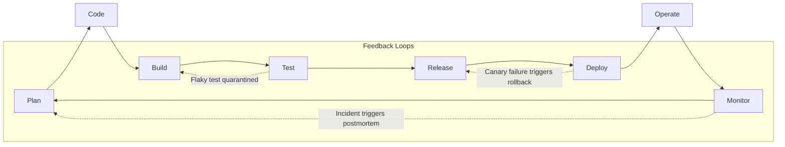
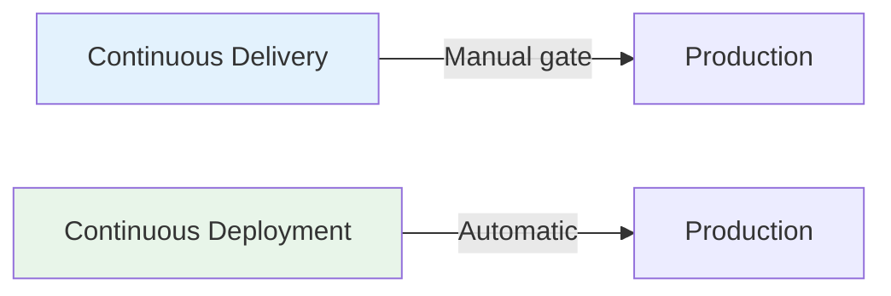
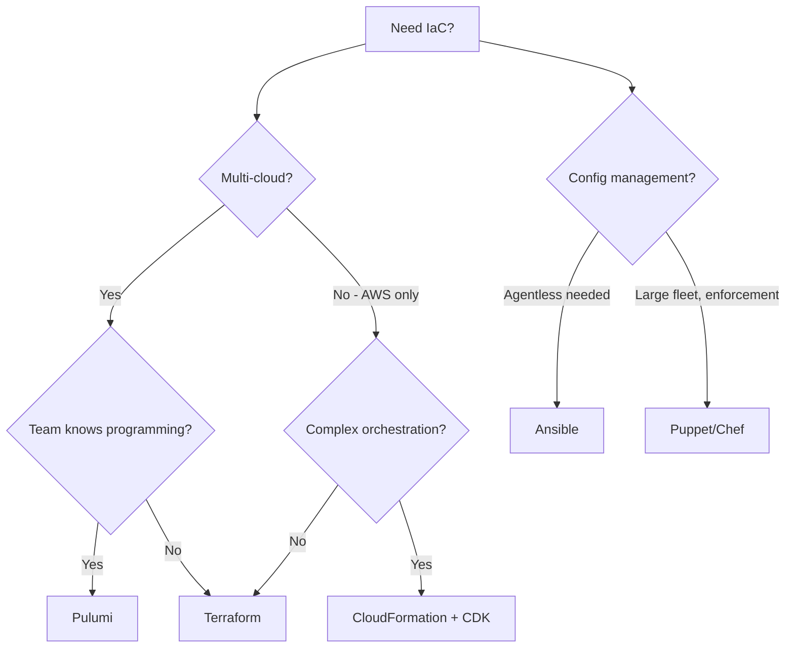
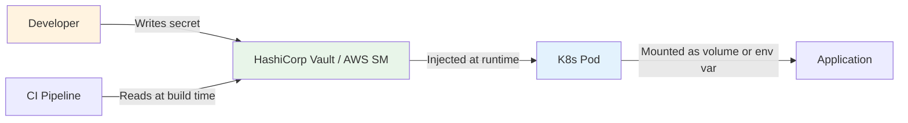
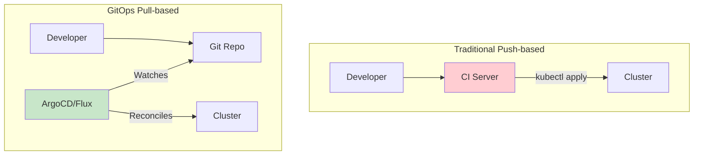
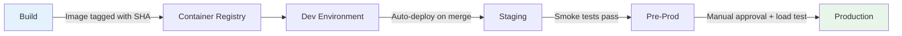

# DevOps

!!! tip "Why DevOps Matters in Interviews"
    Interviewers assess whether you understand DevOps as a **culture shift**, not just a toolchain. Demonstrating knowledge of collaboration, automation principles, and measurable outcomes (DORA metrics) sets you apart from candidates who only list tools.

!!! abstract "Prerequisites & Learning Path"
    **Before diving in:** Linux basics, networking fundamentals (DNS, HTTP, TCP), and at least one cloud provider (AWS/GCP/Azure).

    **Recommended study order:**

    1. Linux & shell scripting → 2. Containers (Docker) → 3. CI/CD pipelines → 4. IaC (Terraform) → 5. Orchestration (Kubernetes) → 6. Observability → 7. GitOps & platform engineering

---

## What is DevOps?

DevOps is a **culture, set of practices, and collection of tools** that increases an organization's ability to deliver applications and services at high velocity.

| Pillar | Description |
|--------|-------------|
| **Culture** | Breaking silos between Dev and Ops; shared responsibility for the full software lifecycle |
| **Practices** | CI/CD, IaC, automated testing, observability, incident management |
| **Tools** | Enablers that implement the practices — not the goal themselves |

> "You build it, you run it." — Werner Vogels, Amazon CTO

---

## DevOps Lifecycle



Each phase feeds back into the next, creating a **continuous loop** of improvement. The feedback loops are where real DevOps maturity shows — it's not just a linear pipeline, it's a system that self-corrects.

---

## Key Practices

### CI/CD (Continuous Integration / Continuous Delivery)

**Continuous Integration** — Developers merge code to a shared branch frequently (multiple times a day). Each merge triggers an automated build and test suite.

**Continuous Delivery** — Every change that passes the pipeline is automatically deployable to production. Continuous *Deployment* takes this further by deploying automatically without manual approval.



**Why it matters:**

- Catches bugs early when they are cheap to fix
- Reduces integration hell
- Enables rapid, reliable releases

#### Testing Strategy in CI Pipelines

Not all tests belong in every pipeline stage. Structure them as a pyramid:

| Stage | Test Type | Speed | Scope | Runs When |
|-------|-----------|-------|-------|-----------|
| Pre-commit | Linting, formatting | < 10s | Single file | Every save / commit hook |
| Build | Unit tests | < 2 min | Single class/function | Every push |
| Integration | API contract tests, DB tests | 5-15 min | Service boundaries | Every PR |
| Staging | E2E / smoke tests | 15-30 min | Full system | Pre-deploy to staging |
| Production | Synthetic monitoring | Continuous | User journeys | Post-deploy canary |

**Pipeline optimization patterns:**

- **Caching** — Cache dependencies (`~/.m2`, `node_modules`) between runs
- **Parallelization** — Run independent test suites concurrently
- **Flaky test quarantine** — Isolate unreliable tests so they don't block deploys
- **Matrix builds** — Test across multiple OS/runtime versions simultaneously

#### Example: GitHub Actions Pipeline for a Java App

```yaml
name: CI/CD Pipeline
on:
  push:
    branches: [main]
  pull_request:
    branches: [main]

jobs:
  build:
    runs-on: ubuntu-latest
    steps:
      - uses: actions/checkout@v4

      - uses: actions/setup-java@v4
        with:
          java-version: '21'
          distribution: 'temurin'
          cache: 'maven'

      - name: Unit Tests
        run: mvn test -pl '!integration-tests'

      - name: Integration Tests
        run: mvn verify -pl integration-tests
        env:
          DB_URL: jdbc:postgresql://localhost:5432/testdb

      - name: Login to Container Registry
        uses: docker/login-action@v3
        with:
          registry: ${{ secrets.REGISTRY_URL }}
          username: ${{ secrets.REGISTRY_USER }}
          password: ${{ secrets.REGISTRY_PASSWORD }}

      - name: Build & Push Image
        run: |
          docker build -t ${{ secrets.REGISTRY_URL }}/myapp:${{ github.sha }} .
          docker push ${{ secrets.REGISTRY_URL }}/myapp:${{ github.sha }}

  deploy-staging:
    needs: build
    if: github.ref == 'refs/heads/main'
    runs-on: ubuntu-latest
    steps:
      - uses: actions/checkout@v4

      - name: Configure kubectl
        uses: azure/k8s-set-context@v4
        with:
          kubeconfig: ${{ secrets.KUBE_CONFIG_STAGING }}

      - name: Deploy to Staging
        run: |
          helm upgrade myapp ./chart \
            --set image.repository=${{ secrets.REGISTRY_URL }}/myapp \
            --set image.tag=${{ github.sha }} \
            --namespace staging \
            --wait --timeout 5m

      - name: Smoke Tests
        run: ./scripts/smoke-test.sh https://staging.example.com

  deploy-prod:
    needs: deploy-staging
    runs-on: ubuntu-latest
    environment: production  # Requires manual approval
    steps:
      - name: Canary Deploy (10%)
        run: |
          kubectl set image deployment/myapp \
            myapp=registry.example.com/myapp:${{ github.sha }} \
            --namespace production
          kubectl rollout status deployment/myapp -n production
```

---

### Infrastructure as Code (IaC)

Managing and provisioning infrastructure through machine-readable definition files rather than manual processes.

| Approach | Tools | Use Case | When to Choose |
|----------|-------|----------|----------------|
| Declarative | Terraform, CloudFormation, Pulumi | Define desired end state | Multi-cloud, team collaboration, complex infra |
| Imperative | Ansible (procedural mode), scripts | Define step-by-step instructions | One-off migrations, bootstrapping, config management |

**Benefits:** Version control, reproducibility, auditability, drift detection.

#### Decision Framework: Choosing an IaC Tool



#### Terraform in Practice

```hcl
# modules/vpc/main.tf — Reusable module
resource "aws_vpc" "main" {
  cidr_block           = var.cidr
  enable_dns_hostnames = true

  tags = {
    Environment = var.environment
    ManagedBy   = "terraform"
  }
}

# environments/prod/main.tf — Environment composition
module "vpc" {
  source      = "../../modules/vpc"
  cidr        = "10.0.0.0/16"
  environment = "production"
}
```

**Scaling IaC:**

- **State isolation** — Separate state files per environment (never share prod/dev state)
- **Module composition** — Reusable modules for VPC, EKS, RDS, etc.
- **Workspaces vs directories** — Prefer directory-per-environment over workspaces for clarity
- **Drift detection** — Run `terraform plan` in CI on a schedule; alert on unexpected changes

---

### Configuration Management

Ensures systems are in a desired, consistent state. Manages application configs, packages, and services across fleets of servers.

| Tool | Model | Language | Best For |
|------|-------|----------|----------|
| **Ansible** | Agentless, push-based | YAML | Ad-hoc tasks, app deployment, smaller fleets |
| **Chef** | Agent-based, pull-based | Ruby DSL | Complex enterprise environments |
| **Puppet** | Agent-based, pull-based | Declarative DSL | Compliance enforcement at scale |
| **SaltStack** | Event-driven | YAML/Python | Highly scalable, real-time orchestration |

**Why not just bash scripts?** Scripts don't have: idempotency (run 10 times, same result), state convergence (detect and fix drift), inventory management (target 500 servers by role), or secrets handling.

---

### Containerization & Orchestration

**Containers** package an application with all its dependencies into a standardized unit (OCI image).

**Orchestration** automates deployment, scaling, networking, and availability of containers.

| Layer | Tools | When to Use |
|-------|-------|-------------|
| Container Runtime | Docker, containerd, CRI-O | Always — baseline for containerized apps |
| Orchestration | Kubernetes, Docker Swarm, Nomad | 5+ services, need auto-scaling/self-healing |
| Package Management | Helm, Kustomize | K8s environments — Helm for shared charts, Kustomize for overlays |
| Service Mesh | Istio, Linkerd, Consul Connect | 20+ services, need mTLS/traffic shaping/observability without code changes |

**When Kubernetes is overkill:**

- Single service, < 3 instances → Use ECS/Cloud Run/App Runner
- Batch jobs → Use AWS Batch or Cloud Dataflow
- Monolith with simple scaling → Use auto-scaling groups behind a load balancer

---

### Deployment Strategies

| Strategy | How It Works | Rollback Speed | Resource Cost | Best For |
|----------|-------------|----------------|---------------|----------|
| **Blue-Green** | Two identical envs; swap traffic | Instant (switch back) | 2x resources during deploy | Strict rollback requirements |
| **Canary** | Gradually shift traffic (1% → 10% → 100%) | Fast (route back to old) | 1x + canary instances | Data-driven validation |
| **Rolling** | Replace pods one at a time | Slow (must roll forward or back) | 1x + surge buffer | K8s default, stateless services |
| **Feature Flags** | Deploy code dark, enable at runtime | Instant (toggle flag) | Minimal | Decoupling deploy from release |

#### What Actually Goes Wrong During Deploys

| Failure Mode | Symptom | Prevention |
|-------------|---------|------------|
| DB schema incompatibility | New code + old schema = crashes | Expand-contract migrations (see below) |
| In-flight request drops | 502s during pod termination | Graceful shutdown + preStop hooks |
| Config mismatch | New code reads env var that doesn't exist | Config validation in startup |
| Canary false positive | 0.5% p99 increase but no errors | Define rollback criteria BEFORE deploy |
| Rollback cascades | Rolling back breaks dependent services | API versioning + backward compatibility |

#### Expand-Contract Migrations (Database Changes in CD)

You can't just `ALTER TABLE DROP COLUMN` in a CD pipeline. Use three phases:

```
Phase 1 (Expand):  Add new column, deploy code that writes to BOTH columns
Phase 2 (Migrate): Backfill old rows, deploy code that reads from NEW column
Phase 3 (Contract): Drop old column once all code uses the new one
```

Each phase is a separate deploy. If anything fails, the previous state still works.

---

### Secrets Management

Listing "Vault" in an interview isn't enough. Here's how secrets actually flow:



**Key principles:**

- **Never bake secrets into images** — inject at runtime via sidecar or init container
- **Rotate without downtime** — apps should re-read secrets on a TTL or watch for changes
- **Least privilege** — each service gets only the secrets it needs
- **Audit trail** — every secret access is logged

**What to do when secrets leak to Git:**

1. Immediately rotate the credential (assume compromised)
2. Use `git filter-branch` or BFG Repo-Cleaner to scrub history
3. Add to `.gitignore` and set up pre-commit hooks (e.g., `detect-secrets`)
4. Post-incident: enforce secret scanning in CI (GitHub secret scanning, TruffleHog)

---

### Monitoring & Observability

Monitoring tells you **when** something is wrong. Observability helps you understand **why**.

#### Three Pillars of Observability

| Pillar | What It Is | Example | Tool |
|--------|-----------|---------|------|
| **Metrics** | Numeric measurements over time | `http_requests_total{status="500"}` | Prometheus, Datadog |
| **Logs** | Discrete event records with context | `{"level":"ERROR","msg":"connection refused","service":"payment"}` | ELK, Loki |
| **Traces** | End-to-end request path | Request → API Gateway → Auth → Order → Payment (240ms) | Jaeger, OpenTelemetry |

#### SLI / SLO / SLA Explained

| Concept | Definition | Example |
|---------|-----------|---------|
| **SLI** (Indicator) | A measurable metric that reflects user experience | `% of requests < 200ms` |
| **SLO** (Objective) | The target value for an SLI | `99.9% of requests complete in < 200ms` |
| **SLA** (Agreement) | A contract with consequences if SLO is breached | `If availability < 99.9%, customer gets credit` |
| **Error Budget** | The allowed amount of failure: `100% - SLO` | `0.1% = ~43 min downtime/month` |

**Error budgets in practice:** If your error budget is nearly exhausted, freeze feature releases and focus on reliability. If you have budget remaining, you can take risks (deploy more aggressively, run experiments). This creates a data-driven negotiation between velocity and reliability.

#### Alerting Philosophy

```
❌ BAD:  Alert on CPU > 80%  (cause, not symptom)
✅ GOOD: Alert on error budget burn rate > 14.4x for 5 min (user impact)
```

**Multi-window burn-rate alerting:**

| Window | Burn Rate | Meaning | Action |
|--------|-----------|---------|--------|
| 5 min | 14.4x | Budget exhausted in 1 hour | Page immediately |
| 30 min | 6x | Budget exhausted in 6 hours | Page |
| 6 hours | 1x | Budget exhausted in 30 days | Ticket |

**Toil** = repetitive, manual, automatable operational work that scales with service size. Google SRE mandates < 50% of an SRE's time goes to toil — the rest goes to engineering that eliminates future toil.

---

### GitOps

An operational framework where Git is the single source of truth for declarative infrastructure and applications.

**Principles:**

1. Declarative configuration stored in Git
2. Desired state versioned and immutable
3. Approved changes auto-applied to the system
4. Software agents ensure correctness and alert on divergence

#### GitOps vs Traditional CI/CD



| Dimension | Push-based (Traditional) | Pull-based (GitOps) |
|-----------|-------------------------|---------------------|
| **Who deploys** | CI server pushes to cluster | Agent in cluster pulls from Git |
| **Cluster credentials** | CI needs write access | Only agent has access |
| **Drift handling** | Manual — no one notices | Auto-detected and corrected |
| **Rollback** | Re-run old pipeline or `kubectl rollout undo` | `git revert` |
| **Audit** | CI logs (often ephemeral) | Git history (permanent) |

**When to choose GitOps:** Multi-cluster environments, strict audit requirements, teams that want Git-native workflows. **When to skip it:** Single environment, rapid prototyping, teams unfamiliar with Git workflows.

---

## DevOps vs SRE vs Platform Engineering

| Dimension | DevOps | SRE | Platform Engineering |
|-----------|--------|-----|---------------------|
| **Origin** | Agile movement (~2009) | Google (~2003) | Internal tooling teams (~2018) |
| **Focus** | Culture + delivery speed | Reliability + engineering approach | Self-service developer platforms |
| **Key metric** | Deployment frequency | Error budgets, SLOs | Developer productivity / MTTU |
| **Ownership** | Shared across teams | Dedicated SRE team | Platform team |
| **Philosophy** | "Break down silos" | "Software engineering approach to ops" | "Paved roads for developers" |
| **Automation** | CI/CD pipelines | Toil elimination (< 50% ops work) | Golden paths, internal developer portals |

#### When to Staff Each Model

| Scenario | Recommendation |
|----------|---------------|
| Startup, < 20 engineers | DevOps culture embedded in every team; no dedicated ops |
| Growing, 20-100 engineers, reliability pain | Hire 1-2 SREs to set SLOs, build incident response |
| Scale, 100+ engineers, onboarding friction | Platform team builds golden paths (templates, CLIs, portals) |
| Enterprise, multi-BU, compliance-heavy | All three: DevOps culture + SRE reliability + Platform self-service |

**They are complementary, not competing.** Platform engineering builds the paved road. SRE sets the guardrails. DevOps is the culture that makes teams want to use both.

---

## DORA Metrics

The **DevOps Research and Assessment** (DORA) team identified four key metrics that predict software delivery performance.

| Metric | Elite | High | Medium | Low |
|--------|-------|------|--------|-----|
| **Deployment Frequency** | On-demand (multiple/day) | Daily to weekly | Weekly to monthly | Monthly to semi-annually |
| **Lead Time for Changes** | < 1 hour | 1 day – 1 week | 1 week – 1 month | 1 – 6 months |
| **Mean Time to Restore** | < 1 hour | < 1 day | 1 day – 1 week | > 6 months |
| **Change Failure Rate** | 0-15% | 16-30% | 16-30% | 46-60% |

!!! info "Fifth Metric — Reliability"
    DORA added **reliability** as a fifth metric, measuring how well a team meets its reliability targets (SLOs).

#### Measuring DORA in Practice

| Metric | How to Actually Measure It | Gotchas |
|--------|---------------------------|---------|
| Deployment Frequency | Count production deploys per day (from CI/CD events) | In monorepos, measure per-service, not per-commit |
| Lead Time | Timestamp of first commit → timestamp of production deploy | Don't include time waiting for code review — that's a process metric |
| MTTR | Incident start (alert fired) → incident resolved (SLO restored) | Don't confuse with MTTD (time to detect) |
| Change Failure Rate | Deploys causing incidents / total deploys | Define "incident" clearly — p99 spike? Customer-reported? Rollback? |

---

## Incident Response

### Beyond Blameless Postmortems

A mature incident response process has clear structure:

#### Severity Levels

| Severity | Definition | Response | Example |
|----------|-----------|----------|---------|
| **SEV1** | Total outage, revenue impact | All hands, exec communication, 15-min updates | Payment processing down |
| **SEV2** | Major feature degraded | On-call team + backup, 30-min updates | Search returning stale results |
| **SEV3** | Minor feature impacted, workaround exists | On-call investigates, next business day | CSV export timing out for large files |
| **SEV4** | Cosmetic / no user impact | Ticket created, normal sprint work | Dashboard graph misaligned |

#### Incident Lifecycle

```
Detect → Triage → Mitigate → Resolve → Postmortem
   ↓         ↓         ↓          ↓          ↓
 Alert    Severity   Stop the   Fix root   Prevent
 fires    assigned   bleeding   cause      recurrence
```

**Key roles during an incident:**

- **Incident Commander (IC)** — Coordinates response, makes decisions, communicates status
- **Technical Lead** — Drives debugging and mitigation
- **Communications Lead** — Updates stakeholders, status pages, customers

#### Blameless Postmortem Structure

1. **Timeline of events** (with timestamps)
2. **Contributing factors** (not root "cause" — systems are complex)
3. **What went well** (don't skip this — it prevents over-correction)
4. **Action items with owners and deadlines**
5. **Lessons learned** — what would we tell our past selves?

---

## Multi-Environment Promotion

How an artifact flows from development to production:



**Rules:**

- **Same artifact everywhere** — never rebuild for production; promote the exact image
- **Environment-specific config** — injected at deploy time (env vars, ConfigMaps, Vault)
- **Gate criteria per stage:**
    - Dev → Staging: All tests pass, no critical vulnerabilities
    - Staging → Pre-Prod: Smoke tests pass, performance baseline met
    - Pre-Prod → Prod: Load test passes, change advisory board (CAB) for SOC2

---

## Culture & Mindset

### Shared Ownership

- Developers carry pagers for services they build
- Operations engineers contribute to application code
- Security shifts left (DevSecOps)

### What On-Call Actually Looks Like

| Time | Activity |
|------|----------|
| Start of rotation | Review open incidents, check dashboards, verify pager works |
| During shift | Respond to pages within SLA (5 min for SEV1), triage and mitigate |
| Handoff | Write up any ongoing issues, brief next on-call |
| After rotation | File tickets for automation opportunities, update runbooks |

**Healthy on-call:**
- No more than 2 pages per 12-hour shift on average
- Compensatory time off after overnight pages
- Runbooks for every alert (if you can't write a runbook, the alert isn't actionable)

### Automation-First

> If you do it twice, automate it.

- Automate builds, tests, deployments, rollbacks
- Automate infrastructure provisioning and compliance checks
- Automate incident response runbooks where possible (auto-restart, auto-scale, auto-rollback)

---

## Tool Landscape

| Category | Tools | When to Choose |
|----------|-------|----------------|
| **CI/CD** | Jenkins, GitHub Actions, GitLab CI, CircleCI, ArgoCD, Tekton | GHA for GitHub-native; Jenkins for legacy/complex; ArgoCD for GitOps |
| **IaC** | Terraform, Pulumi, CloudFormation, Crossplane | Terraform for multi-cloud; CDK/Pulumi if team prefers real code; Crossplane for K8s-native |
| **Containers** | Docker, Podman, containerd, Buildah | Docker for dev; Podman for rootless/daemonless; Buildah for CI image builds |
| **Orchestration** | Kubernetes, Nomad, ECS, Cloud Run | K8s for complex multi-service; ECS for AWS-native simplicity; Cloud Run for stateless HTTP |
| **Config Management** | Ansible, Chef, Puppet, SaltStack | Ansible for most teams; Puppet for compliance at scale |
| **Monitoring** | Prometheus, Grafana, Datadog, New Relic | Prometheus+Grafana for OSS/cost control; Datadog for all-in-one SaaS |
| **Logging** | ELK Stack, Loki, Splunk, Fluentd | Loki for K8s-native + Grafana stack; Splunk for enterprise search; ELK for flexibility |
| **Tracing** | Jaeger, Zipkin, OpenTelemetry | OpenTelemetry as the standard; Jaeger for OSS backend; vendor agents for SaaS |
| **Secrets** | Vault, AWS Secrets Manager, SOPS | Vault for multi-cloud/on-prem; AWS SM for AWS-native; SOPS for Git-encrypted secrets |
| **Artifacts** | Artifactory, Nexus, Harbor, ECR, GHCR | Harbor for K8s-native; ECR for AWS; GHCR for GitHub-native |

---

## Interview Questions

### Foundational (Fresher / 0-2 YOE)

??? question "What is the difference between Continuous Delivery and Continuous Deployment?"
    **Continuous Delivery** ensures every change is *deployable* — it passes all stages of the pipeline and is ready for production at any time, but a **manual approval gate** exists before the actual release.

    **Continuous Deployment** removes the manual gate entirely — every change that passes automated tests is deployed to production **automatically**.

    Both require a robust automated test suite and pipeline, but Continuous Deployment demands higher confidence in test coverage and observability.

??? question "Explain Infrastructure as Code and its benefits over manual provisioning."
    IaC treats infrastructure definitions as source code — stored in version control, reviewed via pull requests, tested with linters and plan outputs, and applied through automation.

    **Benefits over manual provisioning:**

    - **Reproducibility** — Spin up identical environments (dev, staging, prod)
    - **Version history** — Track every change with Git
    - **Drift detection** — Compare actual state vs desired state
    - **Speed** — Provision in minutes, not days
    - **Collaboration** — Code reviews catch misconfigurations before apply

??? question "What are DORA metrics and why do they matter?"
    DORA metrics are four (now five) key indicators that measure software delivery performance:

    1. **Deployment Frequency** — How often you release to production
    2. **Lead Time for Changes** — Time from commit to production
    3. **Mean Time to Restore** — How quickly you recover from failures
    4. **Change Failure Rate** — Percentage of deployments causing incidents

    They matter because research (Accelerate book, State of DevOps reports) shows these metrics **correlate with organizational performance** — elite performers deploy faster AND more reliably. They provide an objective way to measure DevOps transformation progress.

### Intermediate (2-5 YOE)

??? question "How would you implement a zero-downtime deployment strategy?"
    Common strategies with tradeoffs:

    - **Blue-Green Deployment** — Run two identical environments; route traffic to the new one after validation, keep the old one for instant rollback. **Tradeoff:** 2x resource cost, database must be backward-compatible with both versions simultaneously.
    - **Canary Releases** — Gradually shift traffic (1% → 5% → 25% → 100%) while monitoring error rates and latency. **Tradeoff:** Requires sophisticated traffic routing and observability to detect issues at low traffic percentages.
    - **Rolling Updates** — Replace instances one at a time (Kubernetes default); ensures minimum available replicas. **Tradeoff:** During rollout, both old and new versions serve traffic simultaneously — APIs must be backward-compatible.

    **Critical requirements:** Health checks, readiness probes, graceful shutdown (drain connections before SIGKILL), database backward compatibility (expand-contract migrations), and pre-defined rollback criteria.

??? question "How does GitOps differ from traditional CI/CD?"
    In traditional CI/CD, the pipeline **pushes** changes to the cluster (CI tool has write access to production).

    In GitOps, an **agent inside the cluster pulls** the desired state from Git and reconciles it. This provides:

    - **Audit trail** — Git history is the deployment log
    - **Security** — CI system does not need cluster credentials
    - **Self-healing** — Agent detects and corrects drift automatically
    - **Rollback** — `git revert` is your rollback mechanism

    **When GitOps adds complexity without value:** Single environment, < 5 services, team unfamiliar with Git workflows, or when you need imperative deploy-time logic (DB migrations, feature flag coordination).

??? question "Describe how you would design a monitoring and alerting strategy for a microservices architecture."
    A comprehensive strategy covers:

    **1. Instrumentation (RED method per service):**

    - **R**ate — requests per second
    - **E**rrors — error rate by type (4xx, 5xx, timeout)
    - **D**uration — latency percentiles (p50, p95, p99)

    Plus structured logging with correlation IDs and distributed tracing via OpenTelemetry.

    **2. Alerting philosophy:**

    - Alert on **symptoms** (user-facing impact), not causes
    - Define SLOs per service; alert when error budget burn rate is high
    - Use multi-window, multi-burn-rate alerts to reduce noise
    - Every alert must have a runbook — if you can't write one, the alert isn't actionable

    **3. Dashboards (layered):**

    - Top-level: business KPIs and overall system health
    - Service-level: per-service golden signals
    - Debugging: detailed views pulled up during incident response

    **4. Tooling:** Prometheus + Grafana for metrics, Loki/ELK for logs, Jaeger + OpenTelemetry for traces, PagerDuty for on-call routing.

### Senior / Scenario-Based (5+ YOE)

??? question "Your canary shows 0.5% elevated p99 latency but no error rate increase. Do you roll back?"
    **It depends.** This is a judgment call that requires context:

    **Roll back if:**

    - The p99 increase correlates with a specific endpoint that's on the critical path (checkout, login)
    - The latency increase is growing over time (indicates resource leak or connection pool exhaustion)
    - You're deploying on a Friday or during peak traffic
    - Your pre-defined rollback criteria specified a p99 threshold and it's breached

    **Don't roll back if:**

    - The increase is within noise range for your traffic patterns
    - It correlates with a non-critical endpoint (analytics, batch jobs)
    - The canary has been stable for 30+ minutes without degradation
    - You can identify the cause (e.g., new logging added latency, acceptable tradeoff)

    **The right answer:** You should have defined rollback criteria BEFORE the deploy. "We'll roll back if p99 > 200ms OR error rate > 0.1% for > 5 minutes." This removes emotional decision-making during incidents.

??? question "Your Terraform state is locked and the CI runner died mid-apply. What do you do?"
    **Do NOT just force-unlock blindly.** Walk through this:

    1. **Verify the lock holder is actually dead** — check CI runner status, process list, cloud console for running operations
    2. **Check what was being applied** — `terraform plan` against current state to see what's pending
    3. **Force-unlock only if confirmed dead** — `terraform force-unlock <LOCK_ID>`
    4. **Run `terraform plan` immediately after** — to see if the state is consistent with reality
    5. **If state is corrupted** — `terraform import` missing resources, or restore from state backup

    **Prevention:** Store state in a backend with locking (S3 + DynamoDB, GCS, Terraform Cloud). Set CI runner timeouts shorter than the lock TTL. Use `-lock-timeout` to handle transient issues.

??? question "CI takes 45 minutes. How do you cut it to under 10?"
    **Systematic approach:**

    1. **Profile the pipeline** — which stages are slowest? (usually: dependency install, integration tests, Docker build)
    2. **Cache aggressively** — dependencies, Docker layers, compiled artifacts, test databases
    3. **Parallelize** — split test suites by module, run independent stages concurrently
    4. **Reduce test scope per PR** — only run tests for affected modules (use `git diff` to detect changes)
    5. **Optimize Docker builds** — multi-stage builds, layer ordering (dependencies before code), BuildKit cache mounts
    6. **Move slow tests out of the critical path** — nightly full E2E suite; PR pipeline runs unit + affected integration tests only
    7. **Use faster runners** — larger instances, ARM-based runners, self-hosted with local caches
    8. **Trim the test suite** — delete redundant tests, replace slow E2E tests with contract tests where possible

    **Typical wins:** Caching saves 5-10 min, parallelization saves 10-20 min, scoping tests saves 5-15 min.

??? question "A developer pushed AWS credentials to a public GitHub repo. Walk me through your response."
    **Immediate (within minutes):**

    1. Rotate the exposed credentials immediately (AWS console → IAM → deactivate key, create new one)
    2. Check CloudTrail for unauthorized usage of the key since the commit timestamp
    3. If usage detected: escalate to SEV1 incident, engage security team

    **Short-term (within hours):**

    4. Remove the secret from Git history using BFG Repo-Cleaner (faster than `git filter-branch`)
    5. Force-push the cleaned history
    6. Notify GitHub support to clear cached views
    7. Audit all other secrets in the repo for similar exposure

    **Prevention (within days):**

    8. Enable GitHub secret scanning (free for public repos)
    9. Add `pre-commit` hook with `detect-secrets` or `trufflehog`
    10. Move secrets to Vault/AWS Secrets Manager with short-lived credentials (IAM roles, OIDC federation)
    11. Implement CI-side scanning (e.g., `gitleaks` in the pipeline)
    12. Blameless postmortem: why was a long-lived access key used instead of IAM roles?

??? question "You're designing the deployment pipeline for a 50-service microservices system. What's your architecture?"
    **Key design decisions:**

    **1. Mono-repo vs multi-repo:**

    - Multi-repo with shared CI templates (easier ownership boundaries)
    - Or mono-repo with path-based triggers (easier cross-service refactoring)

    **2. Pipeline structure:**

    ```
    PR Pipeline (fast): lint → unit test → build → security scan → contract test
    Main Pipeline (thorough): full build → integration test → deploy staging → E2E → promote
    Release Pipeline: deploy prod canary → observe → promote → verify
    ```

    **3. Environment promotion:**

    - GitOps with ArgoCD for declarative deployments
    - Separate Git repo for environment configs (app repo vs config repo)
    - Progressive delivery: Flagger or Argo Rollouts for automated canary analysis

    **4. Cross-cutting concerns:**

    - Shared CI templates (DRY pipeline definitions)
    - Central secret management (Vault with per-service policies)
    - Service catalog (Backstage) for discoverability
    - Dependency graph awareness — if Service A depends on Service B, test B's changes against A's contract tests

    **5. Observability of the pipeline itself:**

    - Track DORA metrics per team
    - Alert on pipeline duration regressions
    - Dashboard showing deploy status across all 50 services
