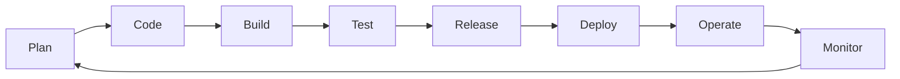

# DevOps

!!! tip "Why DevOps Matters in Interviews"
    Interviewers assess whether you understand DevOps as a **culture shift**, not just a toolchain. Demonstrating knowledge of collaboration, automation principles, and measurable outcomes (DORA metrics) sets you apart from candidates who only list tools.

---

## What is DevOps?

DevOps is a **culture, set of practices, and collection of tools** that increases an organization's ability to deliver applications and services at high velocity.

| Pillar | Description |
|--------|-------------|
| **Culture** | Breaking silos between Dev and Ops; shared responsibility for the full software lifecycle |
| **Practices** | CI/CD, IaC, automated testing, observability, incident management |
| **Tools** | Enablers that implement the practices — not the goal themselves |

> "You build it, you run it." — Werner Vogels, Amazon CTO

---

## DevOps Lifecycle

Each phase feeds back into the next, creating a **continuous loop** of improvement. The goal is to shorten cycle time while maintaining quality and reliability.

---

## Key Practices

### CI/CD (Continuous Integration / Continuous Delivery)

**Continuous Integration** — Developers merge code to a shared branch frequently (multiple times a day). Each merge triggers an automated build and test suite.

**Continuous Delivery** — Every change that passes the pipeline is automatically deployable to production. Continuous *Deployment* takes this further by deploying automatically without manual approval.

**Why it matters:**

- Catches bugs early when they are cheap to fix
- Reduces integration hell
- Enables rapid, reliable releases

---

### Infrastructure as Code (IaC)

Managing and provisioning infrastructure through machine-readable definition files rather than manual processes.

| Approach | Tools | Use Case |
|----------|-------|----------|
| Declarative | Terraform, CloudFormation, Pulumi | Define desired end state |
| Imperative | Ansible (procedural mode), scripts | Define step-by-step instructions |

**Benefits:** Version control, reproducibility, auditability, drift detection.

---

### Configuration Management

Ensures systems are in a desired, consistent state. Manages application configs, packages, and services across fleets of servers.

- **Ansible** — Agentless, YAML playbooks, push-based
- **Chef** — Ruby DSL, agent-based, pull-based
- **Puppet** — Declarative, agent-based, pull-based
- **SaltStack** — Event-driven, highly scalable

---

### Containerization & Orchestration

**Containers** package an application with all its dependencies into a standardized unit (OCI image).

**Orchestration** automates deployment, scaling, networking, and availability of containers.

| Layer | Tools |
|-------|-------|
| Container Runtime | Docker, containerd, CRI-O |
| Orchestration | Kubernetes, Docker Swarm, Nomad |
| Package Management | Helm, Kustomize |
| Service Mesh | Istio, Linkerd, Consul Connect |

---

### Monitoring & Observability

Monitoring tells you **when** something is wrong. Observability helps you understand **why**.

**Three Pillars of Observability:**

1. **Metrics** — Numeric measurements over time (CPU, latency, error rate)
2. **Logs** — Discrete event records with context
3. **Traces** — End-to-end request path across distributed services

**Key concepts:** SLIs (indicators), SLOs (objectives), SLAs (agreements), error budgets.

---

### GitOps

An operational framework where Git is the single source of truth for declarative infrastructure and applications.

**Principles:**

1. Declarative configuration stored in Git
2. Desired state versioned and immutable
3. Approved changes auto-applied to the system
4. Software agents ensure correctness and alert on divergence

**Tools:** ArgoCD, Flux, Jenkins X

---

## DevOps vs SRE vs Platform Engineering

| Dimension | DevOps | SRE | Platform Engineering |
|-----------|--------|-----|---------------------|
| **Origin** | Agile movement (~2009) | Google (~2003) | Internal tooling teams (~2018) |
| **Focus** | Culture + delivery speed | Reliability + engineering approach | Self-service developer platforms |
| **Key metric** | Deployment frequency | Error budgets, SLOs | Developer productivity / MTTU |
| **Ownership** | Shared across teams | Dedicated SRE team | Platform team |
| **Philosophy** | "Break down silos" | "Software engineering approach to ops" | "Paved roads for developers" |
| **Automation** | CI/CD pipelines | Toil elimination (< 50% ops work) | Golden paths, internal developer portals |

They are **complementary**, not competing. Many organizations blend all three.

---

## DORA Metrics

The **DevOps Research and Assessment** (DORA) team identified four key metrics that predict software delivery performance.

| Metric | Elite | High | Medium | Low |
|--------|-------|------|--------|-----|
| **Deployment Frequency** | On-demand (multiple deploys/day) | Between once/day and once/week | Between once/week and once/month | Between once/month and once/6 months |
| **Lead Time for Changes** | Less than one hour | Between one day and one week | Between one week and one month | Between one month and six months |
| **Mean Time to Restore (MTTR)** | Less than one hour | Less than one day | Between one day and one week | More than six months |
| **Change Failure Rate** | 0-15% | 16-30% | 16-30% | 46-60% |

!!! info "Fifth Metric — Reliability"
    DORA added **reliability** as a fifth metric, measuring how well a team meets its reliability targets (SLOs).

---

## Culture & Mindset

### Blameless Postmortems

After an incident, teams conduct a **blameless review** focused on systemic improvements rather than individual fault.

**Structure:**

1. Timeline of events
2. Contributing factors (not root "cause" — systems are complex)
3. What went well
4. Action items with owners and deadlines

---

### Shared Ownership

- Developers carry pagers for services they build
- Operations engineers contribute to application code
- Security shifts left (DevSecOps)

---

### Automation-First

> If you do it twice, automate it.

- Automate builds, tests, deployments, rollbacks
- Automate infrastructure provisioning and compliance checks
- Automate incident response runbooks where possible

---

## Tool Landscape

| Category | Popular Tools |
|----------|--------------|
| **CI/CD** | Jenkins, GitHub Actions, GitLab CI, CircleCI, ArgoCD, Tekton |
| **IaC** | Terraform, Pulumi, AWS CloudFormation, Crossplane |
| **Containers** | Docker, Podman, containerd, Buildah |
| **Orchestration** | Kubernetes, Nomad, ECS, Docker Swarm |
| **Config Management** | Ansible, Chef, Puppet, SaltStack |
| **Monitoring** | Prometheus, Grafana, Datadog, New Relic, Nagios |
| **Logging** | ELK Stack, Loki, Splunk, Fluentd |
| **Tracing** | Jaeger, Zipkin, OpenTelemetry, AWS X-Ray |
| **Secret Management** | HashiCorp Vault, AWS Secrets Manager, SOPS |
| **Artifact Registries** | Artifactory, Nexus, Harbor, ECR, GHCR |
| **Collaboration** | Slack, PagerDuty, Opsgenie, Statuspage |

---

## Interview Questions

??? question "What is the difference between Continuous Delivery and Continuous Deployment?"
    **Continuous Delivery** ensures every change is *deployable* — it passes all stages of the pipeline and is ready for production at any time, but a **manual approval gate** exists before the actual release.

    **Continuous Deployment** removes the manual gate entirely — every change that passes automated tests is deployed to production **automatically**.

    Both require a robust automated test suite and pipeline, but Continuous Deployment demands higher confidence in test coverage and observability.

??? question "How would you implement a zero-downtime deployment strategy?"
    Common strategies include:

    - **Blue-Green Deployment** — Run two identical environments; route traffic to the new one after validation, keep the old one for instant rollback.
    - **Canary Releases** — Gradually shift traffic (1% → 5% → 25% → 100%) while monitoring error rates and latency.
    - **Rolling Updates** — Replace instances one at a time (Kubernetes default); ensures minimum available replicas.

    Key requirements: health checks, readiness probes, database backward compatibility (expand-contract migrations), and feature flags for application-level rollback.

??? question "Explain Infrastructure as Code and its benefits over manual provisioning."
    IaC treats infrastructure definitions as source code — stored in version control, reviewed via pull requests, tested with linters and plan outputs, and applied through automation.

    **Benefits over manual provisioning:**

    - **Reproducibility** — Spin up identical environments (dev, staging, prod)
    - **Version history** — Track every change with Git
    - **Drift detection** — Compare actual state vs desired state
    - **Speed** — Provision in minutes, not days
    - **Collaboration** — Code reviews catch misconfigurations before apply

??? question "What are DORA metrics and why do they matter?"
    DORA metrics are four (now five) key indicators that measure software delivery performance:

    1. **Deployment Frequency** — How often you release to production
    2. **Lead Time for Changes** — Time from commit to production
    3. **Mean Time to Restore** — How quickly you recover from failures
    4. **Change Failure Rate** — Percentage of deployments causing incidents

    They matter because research (Accelerate book, State of DevOps reports) shows these metrics **correlate with organizational performance** — elite performers deploy faster AND more reliably. They provide an objective way to measure DevOps transformation progress.

??? question "How does GitOps differ from traditional CI/CD?"
    In traditional CI/CD, the pipeline **pushes** changes to the cluster (CI tool has write access to production).

    In GitOps, an **agent inside the cluster pulls** the desired state from Git and reconciles it. This provides:

    - **Audit trail** — Git history is the deployment log
    - **Security** — CI system does not need cluster credentials
    - **Self-healing** — Agent detects and corrects drift automatically
    - **Rollback** — `git revert` is your rollback mechanism

    Tools like ArgoCD and Flux implement the GitOps pattern for Kubernetes.

??? question "Describe how you would design a monitoring and alerting strategy for a microservices architecture."
    A comprehensive strategy covers:

    **1. Instrumentation:**

    - Emit metrics (RED method: Rate, Errors, Duration) from every service
    - Structured logging with correlation IDs for tracing requests across services
    - Distributed tracing (OpenTelemetry) to visualize request paths

    **2. Alerting philosophy:**

    - Alert on **symptoms** (user-facing impact), not causes
    - Define SLOs per service; alert when error budget burn rate is high
    - Use multi-window, multi-burn-rate alerts to reduce noise

    **3. Dashboards:**

    - Top-level: business KPIs and overall system health
    - Service-level: per-service golden signals
    - Debugging: detailed views for incident response

    **4. Tooling:** Prometheus + Grafana for metrics, Loki/ELK for logs, Jaeger for traces, PagerDuty for on-call routing.
