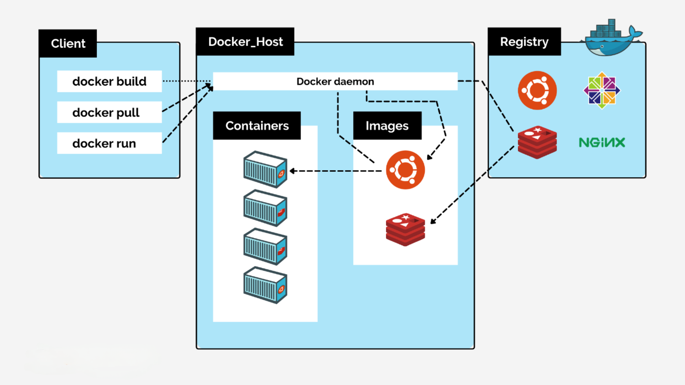

  

**Docker**

* To create, deploy and run applications easily by using containers.

**Problem Statement 1**

* Dev, QA
* Required Depenedecies and the app need to be run in qa. 
* For example the java version is changed from java 8 to java 17 in dev env. then the version in qa should also be changed. otherwise the application will not run.
* Problems : Time Consuming
             Compatibility issues
             Error Prone
* Need to ship all the dependencies along the error-prone.
* Docker packages the application and the dependencies required to run in a single bundle and ship it to the Target env.
* In docker, we call this bundle as Image.
* When we run this image in other env this creates an isolated env.for the application to run by installing all the required packages and we call this isolation env as container.

**Problem Statement 2**

* Consider 3 applications running on the same host, and now we want to isolate these 3 applications due to security reasons.
* The immediate solution we get is to deploy these 3 applications on 3 different hosts and this works. 
* But this is not the cost-efficient solution and increases the maintenance overhead.
* The second thought that we get is, what if we install 3 different VM's on a single host.This solution also works. But this is also not an effective solution and VM's take a lot of resources from the host
* With docker, we can package these 3 applications into 3 different images and run them on a single host.
* Now, 3 different containers are created on the same host.
* Containers are lightweight and smaller whereas vm takes a lot of space.

**Docker Architecture**

   
**Docker Engine:** 

* It is a client server application and used to build and containerize the applications. 
* This is where we run the docker images to create containers.
* It includes docker servers which is a type of long-running program called daemon process and used to create and manage docker objects like images,containers,networks and volumes.
* Docker server pulls and pushes the image to docker registry.
* Docker Registry is a place where we store docker images.
* Docker client, with which the user can interact with the docker. It includes the Rest Api that includes the interface to takl to daemon.
* A cli which uses the docker rest api internally to control or interact with the docker daemon through scripting or commands.

* **Advantages of Using Docker**

* Portability
* High Performance
* Isolation
* Scalability
* Rapid Development


## Container

   

| VM                   | Container                 |
|----------------------|---------------------------|
| Virtualizes Hardware | Virtualizes OS            |
| Has Guest OS         | Shared Host OS            |
| Huge in Size(GB)     | Smaller in Size(MB)       |
| Takes time to create | Can be created in seconds |
| Takes time to bootup | Can be started in seconds |  
  

## Install Docker


## Basic Docker Commands

* Before running the commands make sure docker is running in local machine.

* docker --help - to get the different commands available in docker. 
  ex: docker run --help

1. docker pull nginx
      * To pull the image from the docker registry.
      * It pulls the latest image if the version is not specified.
   
2. docker pull nginx:1.20  

3. docker images 
    * To check the images available in the machine.

4. docker run nginx

5. docker ps
    * To get the containers list which are running.

6. docker ps -a
    * To get the containers which are running and stopped.

7. docker run -d nginx
    * To run the container in background (-d)

8. docker run -p 80:80 nginx
    * mapping the host port to container port.

9. docker rm containerId
    * To delete a container which is not required.
    * Before deleting the container stop the container.
   
10. docker stop containerId
    * To stop a container which is running.
    
11. docker rename "new name" "old name"
    * To rename the container.

12. docker start containerId
    * To start a container.
    
13. docker rmi imageId
    * To remove a image which is not required.
    * Before removing the image, stop the container which is using the image and remove the container.

14. docker stop $(docker ps -a)
    * To stop all containers at once.
    

## Container Communication

    docker run --name neo4j --publish=7474:7474 --publish=7687:7687 --env NEO4J_AUTH=neo4j/password --detach neo4j:latest

*  docker inspect containerId | grep IpAddress
* docker network ls
   * none
   * host
   * bridge
**none network**: If the container is in the none-network you will not be able to access anything outside this container.
       
       docker run -d --network none alpine

* This will automatically will terminate, because the purpose of container is not to host any operating system.
* The purpose of container is to run some service or to run some computation in the container.

       docker run -d --network name alphine sleep 500

* To get to into any container

       docker exec -it containerId sh

* now, if you try to ping google.com, you will not be access it. as the container is in none network.
* This network is not suitable for most of the situation as we consume different apis or database.


**bridge network**: Bridge networks can access external resources and containers in the same network.
            
      docker run -d --network bridge alphine sleep 500

* By default, the network is bridge.
* If 3 containers are in bridge network, they can communicate with each other.
* We can access other container resources using the ipAddress of the other container.
* But our goal was to access the container with the name of the container. This is not possible with default bridge network. 
* We should create custom bridge network for access through container name.

      docker network  create mongo-net --driver bridge

      docker run --name neo4j --publish=7474:7474 --publish=7687:7687 --env NEO4J_AUTH=neo4j/password --detach --network mongo-net neo4j:latest

      docker run --name lenskart-app --publish=8080:8080 --env NEO4J_URI=bolt://neo4j1:7687 --env NEO4J_USER=neo4j --env NEO4J_PASSWORD=password --detach --network mongo-net lenskart-image:latest

**host**: when you create a container in a host network, we can access anything from the container.

## Building Custom Image & Deploying Spring Boot


* Creating image without docker file:

       mvn spring-boot:build-image

**Docker File**: It is having list of instructions to build an image.

* we will run docker build command to build an image.
* we can push this image to docker hub to share it with the community or pulling it in a different environment.
* we can create the container by running the image.

* All the instructions will be in the form of instruction followed by arguments
* For ex: if you want to copy something from your local to the image all you do is:
           
         COPY source  destination     COPY  target/app.jar  app.jar

## Dockerfile

      # Download Java
      ARG JAVA_VERSION="18-jdk"
      FROM openjdk:${JAVA_VERSION}

      LABEL versioin="1.0.0"

      ENV PROJECT_NAME="todo-api"

      ARG APP_HOME="/opt/deployment/"

      # Copy the jar from local to image
      RUN mkdir ${APP_HOME}
      COPY target/todo-1.0.0.jar ${APP_HOME}/todo-1.0.0.jar

      WORKDIR ${APP_HOME}

      EXPOSE 8080

      # Run application with java -jar
      ENTRYPOINT ["java", "-jar", "todo-1.0.0.jar"]

* we need to build the image from the docker file.

       docker build -t todo-api .

* run the image.

       docker run -p 8080:8080 --network=your-docker-network --name your-spring-app 
      -e SPRING_DATASOURCE_URL=jdbc:postgresql://postgres-container:5432/your_database_name \
      -e SPRING_DATASOURCE_USERNAME=your_username 
      -e SPRING_DATASOURCE_PASSWORD=your_password 
       todo-api


## Docker Instructions

**FROM** : The FROM instruction initializes a new build stage and sets the Base Image for subsequent instructions.

`FROM <image>[:<tag>|@<digest>]`

`FROM ubuntu:latest`

**COPY**: The COPY instruction copies new files or directories from `<src>` and adds them to the filesystem of the container at the path `<dest>`.

`COPY <src> ... <dst>`

`COPY html /var/www/html`

`COPY httpd.conf magic /etc/httpd/conf/`

**ADD**: The ADD instruction copies new files, directories or remote file URLs from `<src>` and adds them to the filesystem of the image at the path `<dest>`.

`ADD <src> ... <dst>`

`ADD web-page-config.tar /`

**ENV**: The ENV instruction sets the environment variable `<key>` to the value `<value>`.

`ENV <key> <value>`

`ENV DEBUG_LVL 3`

`ENV APACHE_LOG_DIR /var/log/apache`

**WORKDIR** : The WORKDIR instruction sets the working directory for any RUN, CMD, ENTRYPOINT, COPY and ADD instructions that follow it in the Dockerfile. If the WORKDIR doesn’t exist, it will be created even if it’s not used in any subsequent Dockerfile instruction.

`WORKDIR <dirpath>`

`WORKDIR /var/log`

**EXPOSE**: The EXPOSE instruction informs Docker that the container listens on the specified network ports at runtime.

`EXPOSE <port>[/<proto>] [<port>[/<proto>]...]`

`EXPOSE 8080 8787`

**LABEL**: The LABEL instruction adds metadata to an image. A LABEL is a key-value pair.

`LABEL <key-1>=<val-1> <key-2>=<val-2> ... <key-n>=<val-n>`

`LABEL version="2.0" release-date="2016-08-05"`

**RUN** The `RUN` command executes during build time.

`RUN <command>` (or) `RUN ["<exec>", "<arg-1>", ..., "<arg-n>"]`

* `RUN echo "echo Welcome to Docker!" >> /root/.bashrc`
* `RUN ["bash", "-c", "rm", "-rf", "/tmp/abc"]`

**CMD**: The CMD is to provide defaults for an executing container and runs when container starts. There can only be one CMD instruction in a Dockerfile. If you list more than one CMD then only the last CMD will take effect.

`CMD <command>` (or) `CMD ["<exec>", "<arg-1>", ..., "<arg-n>"]` (or) `CMD ["<arg-1>", ..., "<arg-n>"]`

//Dockerfile to demonstrate the behavior of CMD
```
FROM busybox:latest
MAINTAINER Vamsi <krishnavamsikaruturi@gmail.com>
CMD ["echo", "Dockerfile CMD demo"]
```

`> docker build -t cmd-demo .`

`> sudo docker run cmd-demo`

**Output** : Dockerfile CMD demo

`> sudo docker run cmd-demo echo Override CMD demo`

**Output** : Override CMD demo

**ENTRYPOINT**: An ENTRYPOINT allows you to configure a container that will run as an executable.

`ENTRYPOINT <command>` (or) `ENTRYPOINT ["<exec>", "<arg-1>", ..., "<arg-n>"]`

Only the last ENTRYPOINT instruction will be effective.

//Dockerfile to demonstrate the behavior of ENTRYPOINT
```
FROM busybox:latest
ENTRYPOINT ["echo", "Dockerfile ENTRYPOINT demo"]
```

`> sudo docker build -t entrypoint-demo .`

`> sudo docker run entrypoint-demo`

**Output** : Dockerfile ENTRYPOINT demo

`> sudo docker run entrypoint-demo with additional arguments`

**Output** : Dockerfile ENTRYPOINT demo with additional arguments

`> sudo docker run -it --entrypoint="/bin/sh" entrypoint-demo`

**Output** : /#

**HEALTHCHECK**: The `HEALTHCHECK` instruction tells Docker how to test a container to check that it is still working.

`HEALTHCHECK [<options>] CMD <command>`

Only the last HEALTHCHECK instruction will take effect.

`HEALTHCHECK --interval=5m --timeout=3s CMD curl -f http://localhost/ || exit 1`

**Push image to DockerHub**

`$ docker images -a`

`$ docker login`

Username: vamsi

Password: my_password

* `docker push vamsikaruturi/myapp`

Delete Image

* `docker rmi vamsikaruturi/myapp`

## Docker cleanup

Delete volumes

* `docker volume rm $(docker volume ls -qf dangling=true)`
* `docker volume ls -qf dangling=true | xargs -r docker volume rm`

Delete networks

* `docker network ls`
* `docker network ls | grep "bridge"`
* `docker network rm $(docker network ls | grep "bridge" | awk '/ / { print $1 }')`
* `docker network prune`

Remove docker images

* `docker images`
* `docker rmi $(docker images -q)` //delete all images
* `docker rmi $(docker images --filter "dangling=true" -q --no-trunc)`
* `docker images | grep "none"`
* `docker rmi $(docker images | grep "none" | awk '/ / { print $3 }')`

Remove docker containers

* `docker ps -a`
* `docker kill $(docker ps -q)`
* `docker rm $(docker ps -qa --no-trunc --filter "status=exited")`

Docker System Prune

```
$ docker system prune -a

WARNING! This will remove:
	- all stopped containers
	- all volumes not used by at least one container
	- all networks not used by at least one container
	- all images without at least one container associated to them
Are you sure you want to continue? [y/N] y
```

Resize disk space for docker vm

* `docker-machine create --driver virtualbox --virtualbox-disk-size "40000" default`


## Docker Volumes:

* Containers are ephemeral i.e. when a container is created from an image, it can be destroyed and new containers can be created from the same image and put in place with a minimum of configuration.
* When a container is deleted any data written to that container will be lost.
* What if we want to persist the data of a container ? like database containers.
* This can be achieved with docker volumes.