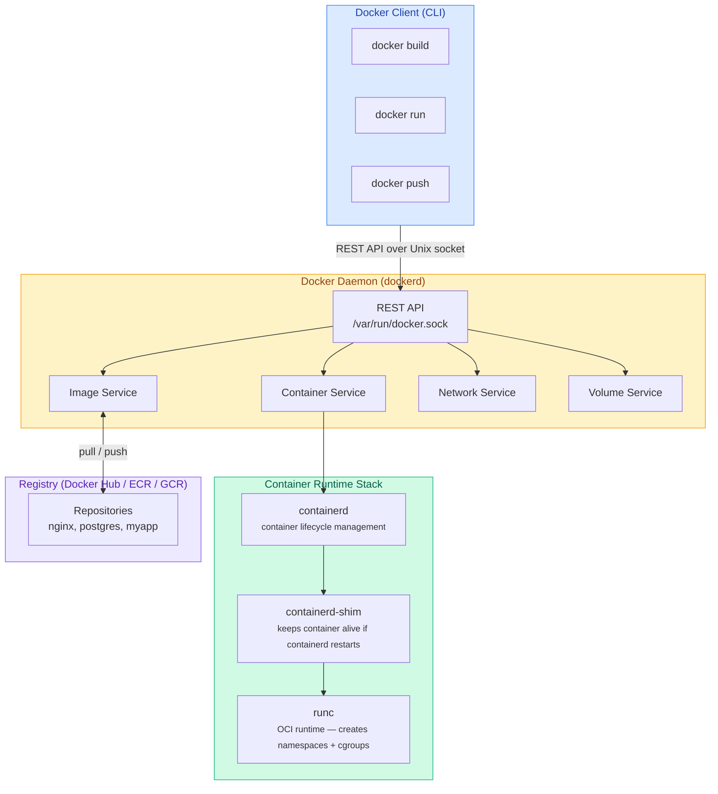
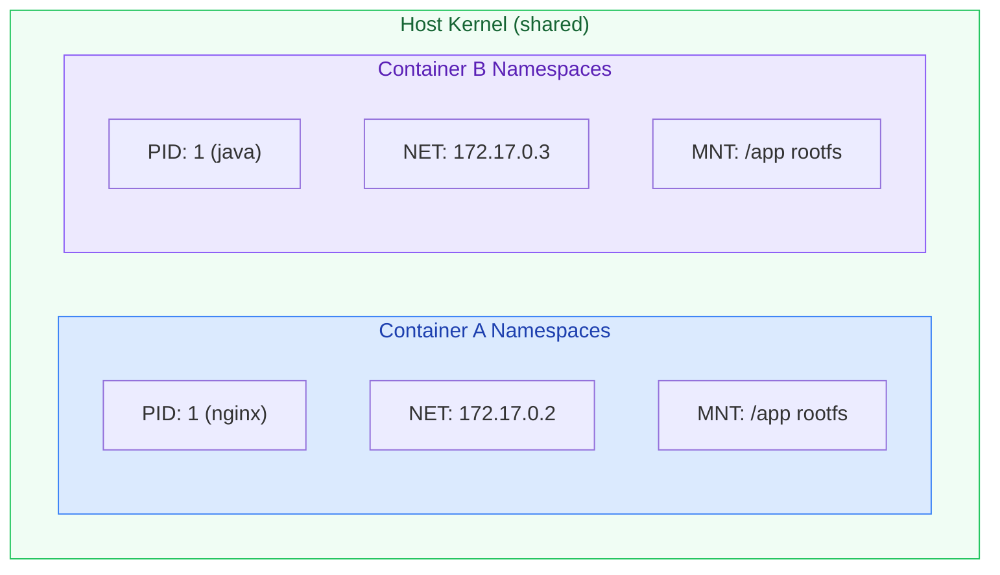
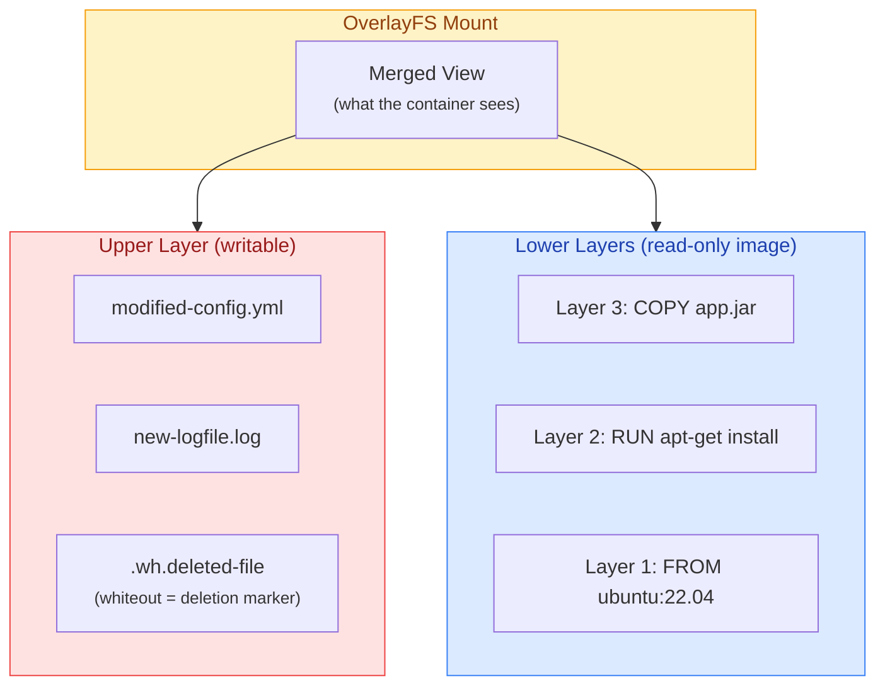
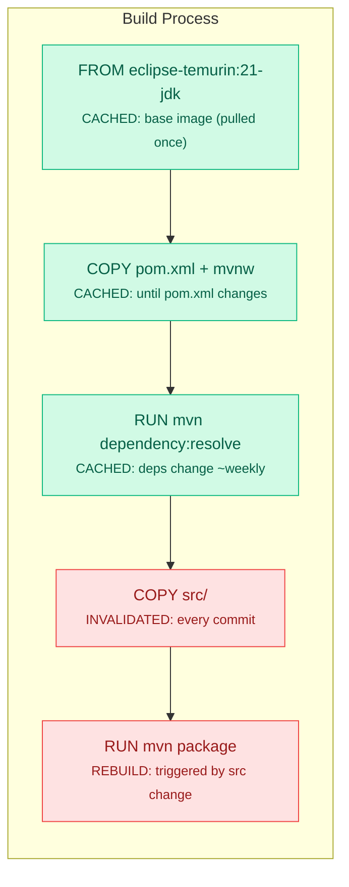
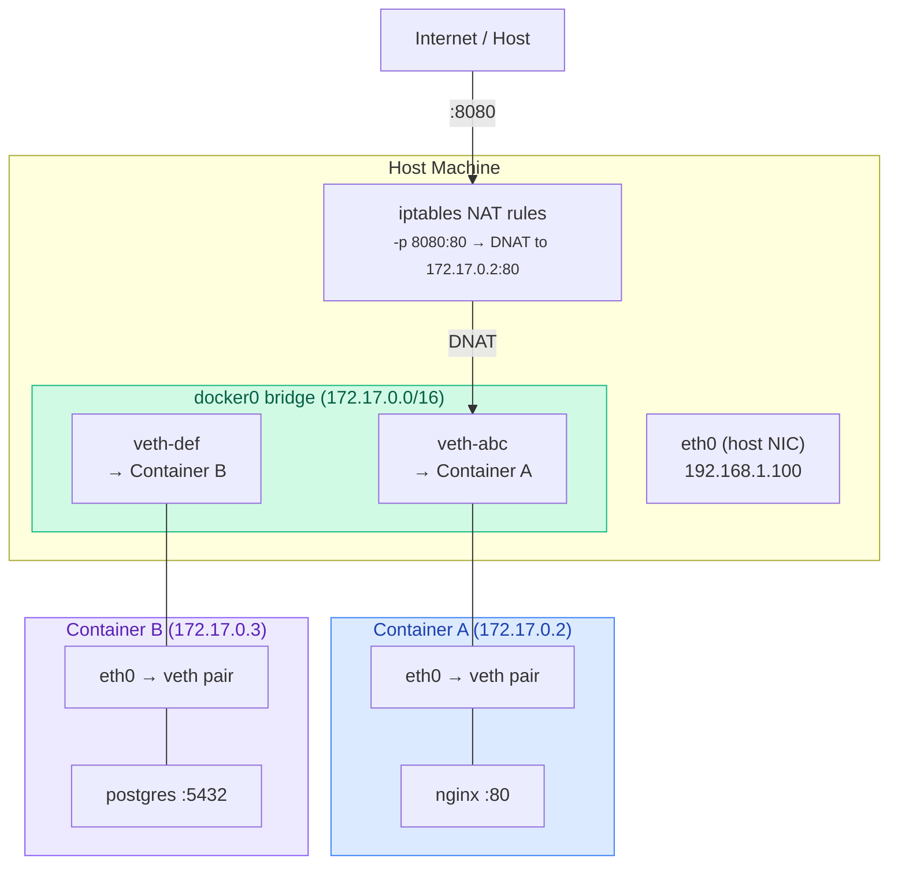
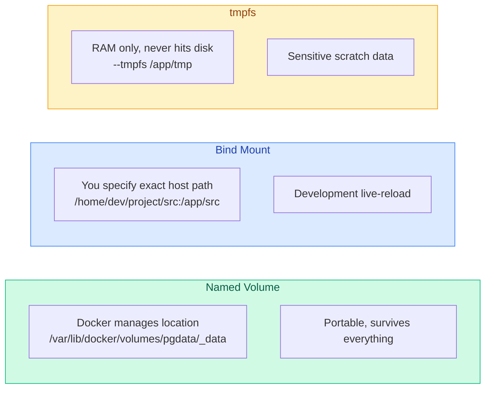
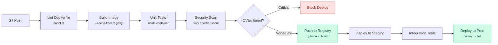

# Docker

> **Master containerization from kernel internals to production orchestration.** Covers Linux namespaces, cgroups, image layering, networking, storage, Compose, CI/CD pipelines, and every interview question that comes up at senior-level interviews.

---

## How to Use This Guide

This guide is structured as a progressive deep-dive, from foundational concepts to production-grade patterns:

- **Sections 1-4** — Core theory: why Docker exists, engine architecture, kernel-level isolation, containers vs VMs.
- **Sections 5-7** — Practical mastery: image layers & build cache, networking internals, volumes & persistence.
- **Sections 8-11** — Production: Compose, CI/CD pipelines, security hardening, debugging techniques.
- **Section 12** — FAANG-level interview questions with concise answers covering kernel internals, architecture, and design.

Start with Sections 1-3 if you need to explain Docker internals in an interview. If you already understand the fundamentals, jump to Section 5 for image optimization or directly to the Interview Q&A for rapid prep.

---

## 1. The Origin Story — Why Containers Exist

<div class="vtn-story-box vtn-animate-fade-up">
  <h4>The Deployment Problem (circa 2013)</h4>
  <p>At scale companies like Google, teams deployed thousands of services daily. Every service had different dependencies — Java 7 vs Java 8, Python 2 vs 3, conflicting native libraries. Deployment failures consumed 40% of operations time.</p>
  <p>Google had solved this internally with <strong>Borg</strong> (their cluster manager using Linux containers since 2003). Docker democratized this — giving every developer access to container technology that previously only Google/Facebook engineers had.</p>
  <p><strong>The fundamental insight:</strong> Don't try to make environments identical. Instead, ship the environment WITH the application. The container IS the environment.</p>
</div>

---

## 2. Architecture — Docker Engine Internals


```mermaid
flowchart TB
    subgraph CLIENT["Docker Client (CLI)"]
        CMD1["docker build"]
        CMD2["docker run"]
        CMD3["docker push"]
    end

    subgraph DAEMON["Docker Daemon (dockerd)"]
        direction TB
        REST["REST API<br/>/var/run/docker.sock"]
        IMG_SVC["Image Service"]
        CTR_SVC["Container Service"]
        NET_SVC["Network Service"]
        VOL_SVC["Volume Service"]
    end

    subgraph RUNTIME["Container Runtime Stack"]
        direction TB
        CONTAINERD["containerd<br/><small>container lifecycle management</small>"]
        SHIM["containerd-shim<br/><small>keeps container alive if containerd restarts</small>"]
        RUNC["runc<br/><small>OCI runtime — creates namespaces + cgroups</small>"]
    end

    subgraph REGISTRY["Registry (Docker Hub / ECR / GCR)"]
        REPO["Repositories<br/>nginx, postgres, myapp"]
    end

    CLIENT -->|"REST API over Unix socket"| REST
    REST --> IMG_SVC & CTR_SVC & NET_SVC & VOL_SVC
    CTR_SVC --> CONTAINERD
    CONTAINERD --> SHIM
    SHIM --> RUNC
    IMG_SVC <-->|"pull / push"| REPO

    style CLIENT fill:#DBEAFE,stroke:#3B82F6,color:#1E40AF
    style DAEMON fill:#FEF3C7,stroke:#F59E0B,color:#92400E
    style RUNTIME fill:#D1FAE5,stroke:#10B981,color:#065F46
    style REGISTRY fill:#EDE9FE,stroke:#8B5CF6,color:#5B21B6
```

<div class="vtn-callout">
  <strong>Key insight for interviews:</strong> Docker is NOT a monolith. The CLI, daemon, containerd, and runc are separate processes. When you <code>docker run</code>, the request flows through 4 layers. This separation means containerd can restart without killing running containers (the shim keeps them alive).
</div>

### The Execution Flow — What Actually Happens

When you type `docker run -d --name web -p 8080:80 nginx`:

<div class="vtn-timeline">
  <div class="vtn-timeline-item">
    <h4>1. CLI → Daemon (REST API)</h4>
    <p>Docker CLI serializes the command into a REST POST to <code>/var/run/docker.sock</code>. This is why you can also use <code>curl</code> to talk to Docker directly.</p>
  </div>
  <div class="vtn-timeline-item">
    <h4>2. Image Resolution</h4>
    <p>Daemon checks if <code>nginx:latest</code> exists locally. If not, contacts Docker Hub's registry API, authenticates, pulls the image manifest (list of layer digests), then pulls each layer in parallel.</p>
  </div>
  <div class="vtn-timeline-item">
    <h4>3. Container Creation</h4>
    <p>Daemon tells containerd to create a container. containerd prepares the root filesystem (OverlayFS: image layers + writable layer), generates an OCI runtime spec (JSON config for namespaces, cgroups, mounts).</p>
  </div>
  <div class="vtn-timeline-item">
    <h4>4. runc Fork + Exec</h4>
    <p><code>runc</code> forks a new process, sets up Linux namespaces (PID, NET, MNT, UTS, IPC, USER), configures cgroups for resource limits, pivots the root filesystem, then executes the container's entrypoint (nginx).</p>
  </div>
  <div class="vtn-timeline-item">
    <h4>5. Network Setup</h4>
    <p>A veth (virtual ethernet) pair is created — one end in the container's network namespace, other end attached to the docker0 bridge. iptables NAT rule maps host:8080 → container:80.</p>
  </div>
  <div class="vtn-timeline-item">
    <h4>6. Container Running</h4>
    <p>The shim process holds the container's stdio. If containerd crashes, the shim keeps the container alive. Daemon returns the container ID to CLI.</p>
  </div>
</div>

---

## 3. Linux Kernel Internals — How Isolation Works

This is what separates a "Docker user" from a "container engineer." Containers are NOT VMs. They're just normal Linux processes with restrictions.

### Namespaces — Isolation

Each namespace gives a container its own view of a system resource:

| Namespace | What it isolates | Effect |
|-----------|-----------------|--------|
| **PID** | Process IDs | Container's first process is PID 1 (can't see host processes) |
| **NET** | Network stack | Own IP, ports, routing table, iptables rules |
| **MNT** | Filesystem mounts | Own root filesystem (can't see host files) |
| **UTS** | Hostname | Container has its own hostname |
| **IPC** | Inter-process communication | Shared memory/semaphores isolated |
| **USER** | User/group IDs | Container's root (UID 0) maps to unprivileged host user |
| **CGROUP** | Cgroup hierarchy visibility | Can't see or modify parent cgroups |


```mermaid
graph TB
    subgraph HOST["Host Kernel (shared)"]
        subgraph NS1["Container A Namespaces"]
            PID1["PID: 1 (nginx)"]
            NET1["NET: 172.17.0.2"]
            MNT1["MNT: /app rootfs"]
        end
        subgraph NS2["Container B Namespaces"]
            PID2["PID: 1 (java)"]
            NET2["NET: 172.17.0.3"]
            MNT2["MNT: /app rootfs"]
        end
    end

    style HOST fill:#F0FDF4,stroke:#22C55E,color:#166534
    style NS1 fill:#DBEAFE,stroke:#3B82F6,color:#1E40AF
    style NS2 fill:#EDE9FE,stroke:#8B5CF6,color:#5B21B6
```

### Cgroups — Resource Limits

Cgroups (Control Groups) limit HOW MUCH of a resource a container can use:

| Cgroup Controller | What it limits | Docker flag |
|-------------------|---------------|-------------|
| **cpu** | CPU time/shares | `--cpus=2.0` or `--cpu-shares=512` |
| **memory** | RAM + swap | `--memory=512m --memory-swap=1g` |
| **blkio** | Disk I/O bandwidth | `--device-read-bps=/dev/sda:10mb` |
| **pids** | Number of processes | `--pids-limit=100` |

!!! danger "The OOM Killer — #1 Production Issue"
    When a container exceeds its memory limit, the Linux OOM killer terminates it. Docker reports this as exit code 137 (128 + SIGKILL=9). Check with `docker inspect <container> | grep OOMKilled`. 
    
    **Fix:** Set limits generously (2x average usage). For JVM apps, ALWAYS set `-XX:MaxRAMPercentage=75.0` — this makes the JVM respect cgroup limits instead of reading host memory.

### Union Filesystem (OverlayFS) — Layers Made Real


```mermaid
graph TB
    subgraph OFS["OverlayFS Mount"]
        MERGED["Merged View<br/><small>(what the container sees)</small>"]
    end

    subgraph UPPER["Upper Layer (writable)"]
        UF1["modified-config.yml"]
        UF2["new-logfile.log"]
        UF3[".wh.deleted-file<br/><small>(whiteout = deletion marker)</small>"]
    end

    subgraph LOWER["Lower Layers (read-only image)"]
        L3["Layer 3: COPY app.jar"]
        L2["Layer 2: RUN apt-get install"]
        L1["Layer 1: FROM ubuntu:22.04"]
    end

    MERGED --> UPPER
    MERGED --> LOWER

    style OFS fill:#FEF3C7,stroke:#F59E0B,color:#92400E
    style UPPER fill:#FEE2E2,stroke:#EF4444,color:#991B1B
    style LOWER fill:#DBEAFE,stroke:#3B82F6,color:#1E40AF
```

**How writes work:** Container writes go to the upper (writable) layer. Reads check upper first, then fall through to lower layers. Deletes create "whiteout" files. This is why containers start instantly — no filesystem copy needed.

**Why this matters for production:**
- 100 containers from the same image share ONE copy of the lower layers (massive disk savings)
- Writes only exist in the container's upper layer (destroyed on `docker rm`)
- If you write large files inside a container without volumes, OverlayFS performance degrades

---

## 4. Containers vs VMs — The Real Difference


```mermaid
graph TB
    subgraph VM_STACK["Virtual Machine Architecture"]
        direction TB
        VM_APP1["App A"] & VM_APP2["App B"]
        VM_BIN1["Bins/Libs"] & VM_BIN2["Bins/Libs"]
        VM_OS1["Guest OS<br/><small>Ubuntu 22.04</small>"] & VM_OS2["Guest OS<br/><small>CentOS 9</small>"]
        VM_HYP["Hypervisor (VMware / KVM / Xen)"]
        VM_HOST["Host Operating System"]
        VM_HW["Infrastructure (Hardware)"]
    end

    subgraph CTR_STACK["Container Architecture"]
        direction TB
        CTR_APP1["App A"] & CTR_APP2["App B"] & CTR_APP3["App C"] & CTR_APP4["App D"]
        CTR_BIN1["Bins/Libs"] & CTR_BIN2["Bins/Libs"] & CTR_BIN3["Bins/Libs"] & CTR_BIN4["Bins/Libs"]
        CTR_RT["Container Runtime (containerd)"]
        CTR_HOST["Host Operating System (shared kernel)"]
        CTR_HW["Infrastructure (Hardware)"]
    end

    style VM_STACK fill:#FEE2E2,stroke:#EF4444,color:#991B1B
    style CTR_STACK fill:#D1FAE5,stroke:#10B981,color:#065F46
```

| | Virtual Machine | Container |
|---|---|---|
| **Virtualization level** | Hardware (hypervisor emulates CPU, RAM, disk) | OS (shares host kernel, isolates via namespaces) |
| **Boot time** | 30-60 seconds | < 1 second |
| **Image size** | 1-20 GB (includes full OS) | 5-500 MB (only app + deps) |
| **Resource overhead** | 10-20% (hypervisor tax) | < 1% (no hypervisor) |
| **Density** | 10-20 per host | 100-1000 per host |
| **Isolation strength** | Hardware-level (very strong) | Process-level (weaker — kernel bugs can escape) |
| **Cross-OS** | Yes (Windows guest on Linux host) | No (must match host kernel) |
| **Security boundary** | Strong (used for multi-tenancy) | Weaker (not safe for untrusted workloads without gVisor/Kata) |

!!! warning "Critical Interview Point"
    **Why can't you run Windows containers on Linux?** Containers share the host kernel. A Windows container needs the Windows kernel (win32k, NT syscalls). Docker Desktop on Mac/Windows actually runs a Linux VM — containers run INSIDE that VM.

---

## 5. Image Deep Dive — Layers & Build Cache

### Layer Architecture

Every Dockerfile instruction creates a layer. Docker caches layers by content hash. If nothing changed → cache hit → skip rebuild.


```mermaid
graph TB
    subgraph BUILD["Build Process"]
        direction TB
        I1["FROM eclipse-temurin:21-jdk<br/><small>CACHED: base image (pulled once)</small>"]
        I2["COPY pom.xml + mvnw<br/><small>CACHED: until pom.xml changes</small>"]
        I3["RUN mvn dependency:resolve<br/><small>CACHED: deps change ~weekly</small>"]
        I4["COPY src/<br/><small>INVALIDATED: every commit</small>"]
        I5["RUN mvn package<br/><small>REBUILD: triggered by src change</small>"]
    end

    I1 --> I2 --> I3 --> I4 --> I5

    style I1 fill:#D1FAE5,stroke:#10B981,color:#065F46
    style I2 fill:#D1FAE5,stroke:#10B981,color:#065F46
    style I3 fill:#D1FAE5,stroke:#10B981,color:#065F46
    style I4 fill:#FEE2E2,stroke:#EF4444,color:#991B1B
    style I5 fill:#FEE2E2,stroke:#EF4444,color:#991B1B
```

**The golden rule:** Order instructions from LEAST frequently changing to MOST frequently changing. Any layer that changes invalidates ALL layers below it.

### Multi-Stage Builds — Shrink Images by 80%

```dockerfile
# ============ Stage 1: Build (has all tools, ~800MB) ============
FROM eclipse-temurin:21-jdk AS builder
WORKDIR /app

# Layer 1: Dependencies (cached until pom.xml changes)
COPY pom.xml mvnw ./
COPY .mvn/ .mvn/
RUN ./mvnw dependency:resolve -B

# Layer 2: Source + build (changes every commit)
COPY src/ src/
RUN ./mvnw package -DskipTests -B && \
    # Extract layered JAR for even smaller runtime
    java -Djarmode=layertools -jar target/*.jar extract --destination /extracted

# ============ Stage 2: Runtime (minimal, ~200MB) ============
FROM eclipse-temurin:21-jre
WORKDIR /app

# Security: non-root user
RUN groupadd -r app && useradd -r -g app -d /app app

# Copy extracted layers (maximizes Docker layer caching at runtime)
COPY --from=builder /extracted/dependencies/ ./
COPY --from=builder /extracted/spring-boot-loader/ ./
COPY --from=builder /extracted/snapshot-dependencies/ ./
COPY --from=builder /extracted/application/ ./

RUN chown -R app:app /app
USER app

EXPOSE 8080

HEALTHCHECK --interval=30s --timeout=3s --start-period=40s --retries=3 \
  CMD wget --no-verbose --tries=1 --spider http://localhost:8080/actuator/health || exit 1

# Note: -Djava.security.egd=file:/dev/./urandom is unnecessary since Java 11;
# the default SecureRandom already uses /dev/urandom.
ENTRYPOINT ["java", \
  "-XX:+UseContainerSupport", \
  "-XX:MaxRAMPercentage=75.0", \
  "-XX:InitialRAMPercentage=50.0", \
  "org.springframework.boot.loader.launch.JarLauncher"]
```

**Why `-XX:MaxRAMPercentage=75.0`?** The JVM by default reads the HOST's memory, not the cgroup limit. Without this flag, a container with `--memory=512m` on a 32GB host will think it has 32GB and set heap to 8GB → instant OOM kill.

### Image Naming & Tagging Strategy

```
registry.example.com/team-name/service-name:v2.1.0-alpine
─────────────────── ───────── ──────────── ──────────────
     registry         org/team    repo        tag
```

**Production tagging rules:**

- Never use `:latest` in production (non-reproducible deploys)
- Use semantic versions: `v2.1.0`
- Include variant: `v2.1.0-alpine`, `v2.1.0-jre21`
- CI should tag with git SHA: `v2.1.0-abc123f` (exact traceability)

---

## 6. Networking — Bridges, veth Pairs, iptables

### How Container Networking Works


```mermaid
flowchart TB
    subgraph HOST["Host Machine"]
        subgraph BRIDGE["docker0 bridge (172.17.0.0/16)"]
            VETH1["veth-abc<br/>→ Container A"]
            VETH2["veth-def<br/>→ Container B"]
        end
        ETH0["eth0 (host NIC)<br/>192.168.1.100"]
        IPTABLES["iptables NAT rules<br/><small>-p 8080:80 → DNAT to 172.17.0.2:80</small>"]
    end

    subgraph CNSA["Container A (172.17.0.2)"]
        CETH1["eth0 → veth pair"]
        NGINX["nginx :80"]
    end

    subgraph CNSB["Container B (172.17.0.3)"]
        CETH2["eth0 → veth pair"]
        PG["postgres :5432"]
    end

    INTERNET["Internet / Host"] -->|":8080"| IPTABLES
    IPTABLES -->|"DNAT"| VETH1
    VETH1 --- CETH1
    VETH2 --- CETH2
    CETH1 --- NGINX
    CETH2 --- PG

    style BRIDGE fill:#D1FAE5,stroke:#10B981,color:#065F46
    style CNSA fill:#DBEAFE,stroke:#3B82F6,color:#1E40AF
    style CNSB fill:#EDE9FE,stroke:#8B5CF6,color:#5B21B6
```

**Under the hood:**

1. Each container gets its own **network namespace** (isolated network stack)
2. A **veth pair** connects the container's namespace to the host bridge
3. The **docker0 bridge** acts like a virtual switch
4. **iptables NAT** handles port mapping (host → container) and outbound traffic (container → internet via MASQUERADE)

### Network Types — When To Use Each

| Driver | How it works | Use case | Limitations |
|--------|-------------|----------|-------------|
| **bridge (default)** | Virtual bridge + veth pairs + NAT | Single-host, quick testing | No DNS, containers use IPs |
| **User-defined bridge** | Same as above + embedded DNS server | **Multi-container apps (USE THIS)** | Single host only |
| **host** | Container uses host's network namespace directly | Ultra-low latency, performance testing | No port isolation, port conflicts |
| **overlay** | VXLAN tunnels between hosts + distributed DNS | Swarm multi-host clustering | Overhead from encapsulation |
| **macvlan** | Container gets its own MAC + IP on physical network | Legacy apps needing L2 access | Complex, needs promiscuous mode |
| **none** | No network interface at all | Security: air-gapped workloads | No network access |

<div class="vtn-callout">
  <strong>The #1 networking mistake:</strong> Using the default bridge. It has no DNS — containers can only reach each other by IP (which changes on restart). Always create a user-defined bridge: <code>docker network create mynet</code>. This gives you automatic DNS by container name.
</div>

---

## 7. Volumes & Storage — Persistence Strategies

### The Three Types


```mermaid
flowchart LR
    subgraph NV["Named Volume"]
        direction TB
        NVD["Docker manages location<br/>/var/lib/docker/volumes/pgdata/_data"]
        NVP["Portable, survives everything"]
    end

    subgraph BM["Bind Mount"]
        direction TB
        BMD["You specify exact host path<br/>/home/dev/project/src:/app/src"]
        BMP["Development live-reload"]
    end

    subgraph TM["tmpfs"]
        direction TB
        TMD["RAM only, never hits disk<br/>--tmpfs /app/tmp"]
        TMP["Sensitive scratch data"]
    end

    style NV fill:#D1FAE5,stroke:#10B981,color:#065F46
    style BM fill:#DBEAFE,stroke:#3B82F6,color:#1E40AF
    style TM fill:#FEF3C7,stroke:#F59E0B,color:#92400E
```

### Production Database Pattern

```bash
# Create a named volume (persists across container lifecycle)
docker volume create pgdata

# Run Postgres with volume + resource limits + health check
docker run -d \
  --name postgres \
  --network app-net \
  -v pgdata:/var/lib/postgresql/data \
  -e POSTGRES_PASSWORD_FILE=/run/secrets/pg_pass \
  --memory=2g --cpus=2.0 \
  --restart unless-stopped \
  --health-cmd="pg_isready -U postgres" \
  --health-interval=10s \
  postgres:16-alpine

# Backup the volume (production pattern)
docker run --rm \
  -v pgdata:/source:ro \
  -v $(pwd)/backups:/backup \
  alpine tar czf /backup/pgdata-$(date +%Y%m%d-%H%M%S).tar.gz -C /source .
```

!!! danger "Data Loss Scenario"
    `docker rm -v postgres` deletes the container AND its anonymous volumes. Named volumes (like `pgdata`) survive. ALWAYS use named volumes for databases. ALWAYS have automated backups.

---

## 8. Docker Compose — Multi-Service Orchestration

### Production-Grade Stack

```yaml
services:
  api:
    build:
      context: .
      dockerfile: Dockerfile
      target: production       # multi-stage target
    ports: ["8080:8080"]
    environment:
      SPRING_DATASOURCE_URL: jdbc:postgresql://db:5432/myapp
      SPRING_REDIS_HOST: cache
      JAVA_OPTS: "-XX:MaxRAMPercentage=75.0"
    depends_on:
      db: { condition: service_healthy }
      cache: { condition: service_healthy }
    deploy:
      resources:
        limits: { memory: 1G, cpus: '2.0' }
        reservations: { memory: 512M, cpus: '0.5' }
    restart: unless-stopped
    networks: [app-net]

  db:
    image: postgres:16-alpine
    volumes:
      - pgdata:/var/lib/postgresql/data
      - ./sql/init.sql:/docker-entrypoint-initdb.d/01-init.sql:ro
    environment:
      POSTGRES_DB: myapp
      POSTGRES_PASSWORD: ${DB_PASSWORD}   # from .env file
    healthcheck:
      test: ["CMD-SHELL", "pg_isready -U postgres"]
      interval: 5s
      timeout: 3s
      retries: 5
      start_period: 10s
    deploy:
      resources:
        limits: { memory: 2G }
    networks: [app-net]

  cache:
    image: redis:7-alpine
    command: redis-server --maxmemory 256mb --maxmemory-policy allkeys-lru
    volumes: [redis-data:/data]
    healthcheck:
      test: ["CMD", "redis-cli", "ping"]
      interval: 5s
    networks: [app-net]

  nginx:
    image: nginx:1.25-alpine
    ports: ["80:80", "443:443"]
    volumes:
      - ./nginx/conf.d:/etc/nginx/conf.d:ro
      - ./nginx/certs:/etc/nginx/certs:ro
    depends_on:
      api: { condition: service_healthy }
    networks: [app-net]

volumes:
  pgdata:
  redis-data:

networks:
  app-net:
    driver: bridge
```

---

## 9. CI/CD — The Production Pipeline


```mermaid
flowchart LR
    A["Git Push"] --> B["Lint Dockerfile<br/><small>hadolint</small>"]
    B --> C["Build Image<br/><small>--cache-from registry</small>"]
    C --> D["Unit Tests<br/><small>inside container</small>"]
    D --> E["Security Scan<br/><small>trivy / docker scout</small>"]
    E --> F{"CVEs found?"}
    F -->|Critical| G["Block Deploy"]
    F -->|None/Low| H["Push to Registry<br/><small>:git-sha + :latest</small>"]
    H --> I["Deploy to Staging"]
    I --> J["Integration Tests"]
    J --> K["Deploy to Prod<br/><small>canary → full</small>"]

    style G fill:#FEE2E2,stroke:#EF4444,color:#991B1B
    style H fill:#D1FAE5,stroke:#10B981,color:#065F46
    style K fill:#D1FAE5,stroke:#10B981,color:#065F46
```

---

## 10. Production Hardening & Security

<div class="vtn-concept-grid">
  <div class="vtn-concept-card">
    <h4>Security</h4>
    <p>Non-root user (<code>USER app</code>) · Minimal base (alpine/distroless) · CVE scanning in CI · No secrets in images · Read-only rootfs (<code>--read-only</code>) · Drop all capabilities (<code>--cap-drop=ALL</code>) · Seccomp/AppArmor profiles</p>
  </div>
  <div class="vtn-concept-card">
    <h4>Performance</h4>
    <p>Multi-stage builds · .dockerignore (exclude .git, node_modules, target) · BuildKit parallel stages · Registry-backed cache (<code>--cache-from</code>) · Layer ordering · JVM: <code>-XX:MaxRAMPercentage=75</code></p>
  </div>
  <div class="vtn-concept-card">
    <h4>Reliability</h4>
    <p>HEALTHCHECK defined · Resource limits (memory + CPU) · <code>--init</code> flag (PID 1 signal handling) · <code>--restart unless-stopped</code> · Graceful shutdown (SIGTERM handling) · Log to stdout/stderr</p>
  </div>
  <div class="vtn-concept-card">
    <h4>Observability</h4>
    <p>Structured JSON logs · Health endpoints (/health, /ready) · Prometheus metrics endpoint · Distributed tracing headers · Container labels for discovery</p>
  </div>
</div>

---

## 11. Debugging Production Containers

<div class="vtn-timeline">
  <div class="vtn-timeline-item">
    <h4>Container keeps restarting (exit code 137)</h4>
    <p><strong>Cause:</strong> OOM killed. <code>docker inspect &lt;c&gt; | grep OOMKilled</code>.<br/><strong>Fix:</strong> Increase memory limit or fix memory leak. For JVM: check <code>-XX:MaxRAMPercentage</code>.</p>
  </div>
  <div class="vtn-timeline-item">
    <h4>Container exits immediately (exit code 1)</h4>
    <p><strong>Debug:</strong> <code>docker logs &lt;c&gt;</code> for app error. <code>docker run -it --entrypoint sh &lt;image&gt;</code> to inspect filesystem. Check if config files are mounted correctly.</p>
  </div>
  <div class="vtn-timeline-item">
    <h4>Container runs but health check fails</h4>
    <p><strong>Debug:</strong> <code>docker exec -it &lt;c&gt; curl localhost:8080/health</code>. Check if the app binds to 0.0.0.0 (not 127.0.0.1). Verify EXPOSE port matches app's listening port.</p>
  </div>
  <div class="vtn-timeline-item">
    <h4>Image build is slow</h4>
    <p><strong>Fix:</strong> Check layer ordering (deps before source?). Use BuildKit (<code>DOCKER_BUILDKIT=1</code>). Add <code>.dockerignore</code>. Use <code>--cache-from</code> with registry cache in CI.</p>
  </div>
  <div class="vtn-timeline-item">
    <h4>Networking: container can't reach another container</h4>
    <p><strong>Debug:</strong> Are they on the same network? <code>docker network inspect</code>. Using default bridge? Switch to user-defined. DNS not resolving? Only works on user-defined bridges.</p>
  </div>
</div>

---

## 12. Interview Q&A (FAANG-Level)

??? question "Walk me through what happens at the kernel level when you run `docker run nginx`"
    1. Docker daemon asks containerd to create a container
    2. containerd creates an OCI bundle (rootfs + config.json)
    3. containerd-shim forks and calls runc
    4. runc calls `clone()` syscall with namespace flags (CLONE_NEWPID | CLONE_NEWNET | CLONE_NEWNS | CLONE_NEWUTS | CLONE_NEWIPC)
    5. Child process is now in new namespaces — sees PID 1, empty network, empty mount table
    6. runc sets up cgroups (writes to /sys/fs/cgroup/memory/docker/<id>/memory.limit_in_bytes)
    7. runc calls `pivot_root()` to change the root filesystem to the OverlayFS merge dir
    8. runc calls `execve()` to replace itself with the nginx binary
    9. Shim keeps the stdio file descriptors open and reports container state to containerd

??? question "Explain the difference between COPY and ADD. When would you use ADD?"
    **COPY** simply copies files from build context into image. **ADD** does the same PLUS: (1) auto-extracts tar archives (.tar, .tar.gz, .tar.bz2) and (2) can fetch URLs. Use ADD only when you need tar extraction. Never use it to fetch URLs in production (can't cache, no checksum verification — use `curl` + `RUN` instead).

??? question "You have a 2GB Docker image. How would you reduce it to under 200MB?"
    1. **Multi-stage build** — separate build tools from runtime artifact
    2. **Alpine/distroless base** — replace ubuntu (80MB) with alpine (5MB) or distroless (20MB)
    3. **Minimize layers** — combine RUN commands, clean up in same layer (`apt-get install && rm -rf /var/lib/apt/lists/*`)
    4. **Only copy what's needed** — don't COPY entire project, just the built artifact
    5. **Use .dockerignore** — exclude .git (can be 100MB+), node_modules, build artifacts
    6. **For JVM** — use JRE not JDK, use jlink to create custom minimal runtime

??? question "How would you handle secrets in Docker containers?"
    **Never bake secrets into images** (they persist in layer history even after deletion). Options by security level:
    
    - **Basic**: Environment variables at runtime (`-e SECRET=xxx`) — visible in `docker inspect`
    - **Better**: Docker secrets (Swarm) or mount secrets at runtime (`-v /path/to/secret:/run/secrets/key:ro`)
    - **Production**: External secret manager (Vault, AWS Secrets Manager) with sidecar/init container that fetches at startup
    - **Best**: Short-lived tokens via identity federation (IRSA on EKS, Workload Identity on GKE)

??? question "Explain how Docker networking works. What happens when Container A pings Container B on the same bridge?"
    1. Container A's ping creates an ICMP packet with destination = Container B's IP
    2. The packet goes through Container A's `eth0` (which is one end of a veth pair)
    3. The other end of the veth is attached to the `docker0` bridge on the host
    4. The bridge looks up its MAC table, finds which veth pair leads to Container B's IP
    5. Packet is forwarded through Container B's veth pair into Container B's network namespace
    6. Container B receives the ICMP packet on its `eth0`
    
    No NAT involved for container-to-container on same bridge — it's direct L2 switching.

??? question "What is the PID 1 problem in Docker containers?"
    Linux PID 1 has special responsibilities: reaping zombie processes and forwarding signals. Most application processes (nginx, java) don't handle this. If your app runs as PID 1 and receives SIGTERM, it might not shut down gracefully.
    
    **Solutions:** (1) Use `--init` flag (adds tini as PID 1, forwards signals), (2) Use `ENTRYPOINT ["/bin/sh", "-c", "exec java -jar app.jar"]` (exec replaces shell as PID 1), (3) Use a proper init system like `dumb-init` or `tini` in the image.

??? question "How does Docker build cache work? When is the cache invalidated?"
    Each instruction is cached by: (1) the parent layer's ID, (2) the instruction itself, (3) for COPY/ADD: the content checksum of source files. Cache is invalidated when:
    
    - Any instruction changes (even a comment in a RUN command)
    - For COPY/ADD: any file in the source path changes
    - **All subsequent layers are also invalidated** (cache is linear, not tree-shaped)
    
    This is why you COPY dependency files (pom.xml, package.json) BEFORE source code — deps change less often, so that layer stays cached.

??? question "Design a Docker-based CI/CD pipeline for a microservices architecture"
    ```
    Push → Lint Dockerfile (hadolint) → Build with layer cache from registry
    → Run unit tests inside container → Security scan (trivy)
    → Push tagged image (git-sha + semver) → Deploy to staging
    → Run integration tests against staging → Canary deploy to prod (10%)
    → Monitor error rate for 15min → Full rollout or auto-rollback
    ```
    
    Key decisions: Use BuildKit for parallel build stages. Cache layers in the registry (`--cache-to type=registry`). Pin all base images by digest. Gate deploys on zero critical CVEs. Use immutable tags (git SHA, never `:latest`).
