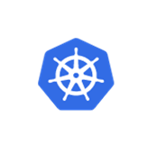

* Kubernetes is an open-source system for automating deployment, scaling and management of containerized applications.

**Problem Statement 1**: (Monitoring,Self-Healing and High Availability)

* We have containerized our application and deployed on virtual machine.
* There can be problem in the container or vm/node and either of them is crashed. Then we cannot access our service.
* In real time, there will be many containers as we deal with microservices architecture.

* we never know when and which container goes down, can we monitor it manually and restart our stopped containers ?
* There is a way to monitor the health of each container and node to bring them back when they go down. This is called self-healing or resilience.
* K8S checks or monitors the health of each container and node and bring them back when they go down. So we will not face any downtime. This is called as High-availability.

**Problem Statement 2**: (Load Balancing, Auto Scaling,Automatic bin packing)

* Your application is working fine for 20 requests per seconds, what if the requests are 100 per second ?
* The application cannot handle the load.
* What if there is a way to replicate the same application into multiple containers, if required across multiple nodes and put a load balancer in front of those containers.
* So, any request made, initially goes to the load balancer, and it distributes the load among multiple containers.
* Now the application can handle the load.

<figure markdown>
 
  <figcaption>Load Balancing, Auto Scaling,Automatic bin packing</figcaption>
</figure>

* What if there is a way to increase the number of containers if the load increases and decrease the number of containers if load decreases. This is called as Scaling.
* K8s can that smart job of scaling based on the load.
* It can scale nodes also, meaning if there are multiple containers are running in a node and while creating a new container if there are not enough resources like cpu and ram k8s can **automatically spin up another container** for running the node. This is called automatic bin packing 

**Problem Statement 3**: (Rollout,rollbacks)

* You are deploying the enhancement multiple times a day. What happens when your deployment is going 
  on your old container gets deleted and a new container gets created.
* In the gap of deleting and creating the container your application will be down which is a bad thing.
* When you have multiple containers running of the same application, instead of deleting all containers at once and creating them again with rolling deployments we can replace the containers one by one.
* i.e Rolling Deployments and also upgrade a percentage of containers i.e Canary deployments.

**Problem Statement 4**: (Secret and Config Management)

* For example: the application is running with version:1 , what if we want to deploy new version of the application ? We call this rolling out a new version or 
  what if we want to rollback to a older version if there is an error in the new version.
* With K8S we can deploy and update the secrets and application configuration without rebuilding our image and without exposing secrets in your stack configuration now.

## Features:

* Monitoring
* Self Healing
* High Availability
* Load Balancing
* Auto Scaling
* Automatic bin packing (efficiently scheduling containers onto nodes based on resource constraints)
* Rolling and Canary Deployments
* Automatic Rollout and Rollback
* Secret and Configuration Management.

## K8S Architecture

**Cluster**

* The place where we run the containers is physical or virtual machines is known as nodes more specifically worker nodes.
* Generally there will be multiple worker nodes so that of one node goes down containers can be run in other nodes.
* Also we can run the same application on multiple nodes to share the node.
* We call these set of worker nodes as data plane
* Some one should manage these worker nodes like if one node goes down moving the containers to a healty node etc.
* This contoller part is taken care by another nodealled Master node or control-plane.
* In real-time there will be more than one master node for fault tolerance.

* So a k8s cluster consists of a group of worker nodes and set of master nodes which manages the worker nodes.

**Master Node Components**:

* It consists of components that control the cluster and data about the cluster state and configuration.

    **kube API SERVER**:

     * To interact with the k8s the user can use the apis provided by api server through cli or sdk.
     * We can call api server as front end for the k8s control plane.
     * So with this api we can instruct the k8s to do some operations like scheduling pod, get the list of pods etc.

    **etcd**:
  
     * This is a storage where we can track all the nodes we have in the clusters and the containers details.
     * Its a key value store to save clustered data, recommended to have backup plan.
     * It is accessible only from api server for security reasons.No other component can directly interact with etcd.
     * This etcd has a wonderful feature called watch api. The watch waits for the changes to keys by continuously watching and sends those key updates back to the client.
     * so if any change happens in the records k8s api will respond accordingly.

    **kube scheduler**:
  
     * It helps to schedule the pods based on the various nodes based on the resource utilization.

    **kube control manager**:

     * when a change in a service config occurs for ex: replacing the image from which the pods are running or changing parameters in the config.yml, the controller spots the change amd starts working towards the new desired state.
     Types of Controllers
     * Replication Controller (correct no.of pods are running in the cluster)
     * Node Controller (monitors health of each node)
     * Endpoint controller (connects the pods and services to populate the object)

**Worker Node Components**:

   **Container run time**:                                                           

   * To run an image from a container we need a container run time. There are many CRT available in the market like docker,racket, containerd.

   **Kubelet**:
   
   * This is an agent that runs on each worker node in the cluster. It makes sure that the containers are running in a pod.
   * It regularly checks the new or modified pod specification from the api server and ensuring the pods and their containers are healthy.
   * Kubelet doesn't manage the containers that are not created by k8s.
   * It is also responsible for registering a node with k8s cluster and sending events like pod status,resource utilization reports to the master server.    

   **KubeProxy**:
    
   * It is a network proxy that runs on each worker node.
   * When a request is received for your application it makes sure to forward it to the appropriate pod.

**Summary**:

* Let's say we want to create two instances of an application.
* First we create an yml file and send it to the **Kube api server**.
* The api runs the yml file/ specification by the **kube scheduler**.
* The scheduler selects the worker node to which new node should be assigned based on the configuration and resource availability.
* At the same time the master server also stores the configuration and status data to etcd.
* Once the scheduler assigns a worker node the **kube controller manager** on the master node then sends an object specification to the node via api server.
* Upon receiving the object from the api server the **kubelet** on the node ensures the object are created accordingly.
* Whenever the status of the pod is changed like pod is killed the kubelet via api server updates the **etcd**.
* The watch function of stcd monitors the changes to the desired state and the actual state.
* The controller manager responds to this difference in the state of the resources and work towards the actual state.

## Kubernetes Setup

* Minikube
* Kind
* K3s
* Kubeadm

* 2 CPUs or more
* 2 GB of free memory
* 20 GB of free disk space
* Docker or VM manager

      minikube start --nodes 2 -p local-cluster --driver=docker
      minikube status -p local-cluster

      local-cluster
      type: Control Plane
      host: Running
      kubelet: Running
      apiserver: Running
      kubeconfig: Configured
      local-cluster-m02
      type: Worker
      host: Running
      kubelet: Running

* Create a cluster using minikube
       
           minikube start --nodes 2 -p local-cluster --driver=docker

## Kubectl Syntax:

kubectl [command][TYPE][NAME][flags] ---> kubectl  [create,get,describe,delete  etc] [pods,services] [name of the resource] [-o -f]

## Pods 

* It is an encapsulated layer over/around the containers.
* A pod can have one or more containers.
* So, when we want to run our application we will run it in containers.
* But in k8s the container alone can be deployed and it needs to be wrapped up in a pod.
* why we need pod ??
* In most cases each pod will be having only one container.
* But there is an example: where the 2 or more containers should run on one pod.
*  refreshing the configuration for every one hr.
* All the containers in the pod will share the same network and storage.
* When the pod is deleted all the containers in the pod gets deleted. and even same with creation.
* If we want to scale our application i.e when the load increases if we want to increase the number of instances of our application, we should not increase the no.of containers in the same pod. But we should increase the number of pods.
* when pods are created each pod is assigned a unique ip address and range of ports. with this we can run 2 applications on the same port in the same node.

 

* Within the same the pod the containers can communicate with "localhost" as they are in the same network.
* Containers that want to interact with other containers running in other pod can use ip address to communicate.
* To create a pod:
        
           kubectl run nginx-pod --image=nginx

* To create pod using yml:

[pod.yml](https://github.com/vamsi1998123/K8S/blob/main/pod.yml)

          kubectl apply -f pod.yml

* To get the list of pods:
  
         kubectl get pods

* To delete a pod

         kubectl delete pod ngnix-pod

* To filter nodes based on label

         kubectl get pods -l team=intergrations

* To know more info about the pod

         kubectl get pod nginx-pod -o wide  -- in text format

         kubectl get pod nginx-pod -o yaml  -- in yml format

* To get detailed info about the pod

         kubectl describe pod nginx-pod

* Getting into the pod:

         kubectl exec -it nginx-pod --bash

* To get into a specific container in a pod

         kubectl exec -it nginx-pod -c nginx-container --bash

* Port Forwarding
  * we cannot access pod directly outside the node. It can be accessed only from within the node.
  * If we have access to the cluster, we can access it with port forward.

        kubectl port-forward nginx-pod 8083:80

* Logs of a pod

        kubectl logs nginx-pod

* To delete all the resources of a pod which are created using yml

        kubctl delete -f pod.yml

## Replica Sets and Deployments  

* What happens if the pod goes down ? Users cannot access our application
* But in production, we should ensure that our application is highly available.
* To achieve this we should create multiple instances of our application instead of relying on single instance.
* In that case even if one instance goes down, the other pod can still solve the request.
* These instances are called **replicas**. If we create multiple pods manually it can be time-consuming and tedious.
* Instead of creating these replicas manually we can automate creating these replicas with the replica set object in kubernetes.
* When the pod goes down automatically bringing back is known as **self-healing**.
* When we ask replicaset to create 2 replicas it makes sure that 2 replicas are available all the time.
* If any replica goes down it will create a new replica immediately. If an extra replica is created it will delete a new replica.
* What if the Node goes down ? Again same problem, Users cannot access our application. We should all our pods to a healthy node.
* The same replica set can do the job.

[replicaset.yml](https://github.com/vamsi1998123/K8S/blob/main/replicaset.yml)

       kubectl get rs

* Now, we will delete one pod.

    

* Still, we can see 3 pods available. This is because replicaset always makes sure that the given number of replicas available all the time.

* Now, let's try to delete the node. Before let's add one more to the cluster.

          minikube node add --worker

* Check on which node the pods are running.

* Delete the node

       minikube node delete local-cluster-m02 -p local-cluster

* The pods got recreated in other node.

## RollOut and Roll Back:
* For example: our application is running with 1.21 v and we want to upgrade it to 1.22 v.
* It requires starting the new version of pod and stopping the old version of pod waiting and verifying the new version.
* There will be a case of rolling it back to a previous version in case of any issues.
* If we do this manually there will be a lot of chances of errors and it's time-consuming.
* We can automate the rollout and rollback with the deployment object in k8s.
* When we create the deployment, replicaset is automatically created, so no need to create the replica set manually.
* Every time we create a deployment the deployment creates a replica set and replicaset creates the pod.
* This is the reason pod is considered as the smallest unit in k8s.

[deployment.yml](https://github.com/vamsi1998123/K8S/blob/main/deployment.yml)

## Services 

* All the pods are non-permanent resources and ther ip address keeps on changing and when we try to access with old ip it fails to connect.
* So, we cannot rely on their ips to communicate if you want to access the services in a pod.
* The main objective of the services is to abstract the pod ip address from ens user.
* When a service is created an ip address is assigned to that service and this ip address doesn't change as long as the service exists. 
* So users can call a single stable ip address instead of calling each pod individually and the service forward the request to pod.
* Now, even if pod ip changes it doesn't matter as the service will take care of routing to appropriate pods.
* Services are not created on any node unlike pods.

**Use Case-2**

* We have 2 pods of same application.
* When we make a request to which pod our request goes?
* Service will take care of load balancing,
* i.e Service provides load balancing when you have pod replicas. It picks a pod randomly and forwards the request to it.
* Services also offer other advantages likes service discovery and zero downtime deployments.

## Types of services

**ClusterIp Service**

* This type of service exposes the pod that is internal to the cluster.
* This type of service is useful when you don't want to expose your application to the outside world but all the pods inside the cluster can access it.
* For example: database.
* spec:
     type: ClusterIp
* This is the default service.
* Service routes the request to the desired pod based on Labels.
*   selector:
       app: nginx(pod label)
* We can also do port-forwarding on svc.

[service.yml](https://github.com/vamsi1998123/K8S/blob/main/service.yml)

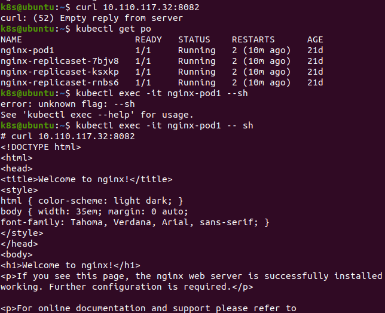

* So, cluster ip services cannot be accessed from outside of the cluster but those van be accessed from all the pods in the cluster.
* They are restricted to the cluster.
* We can access the service with the name of the service.

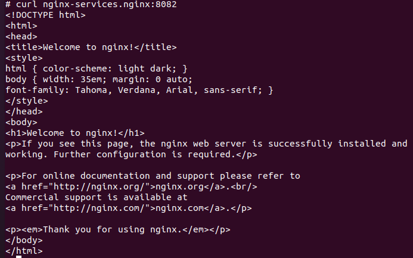

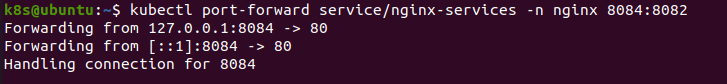

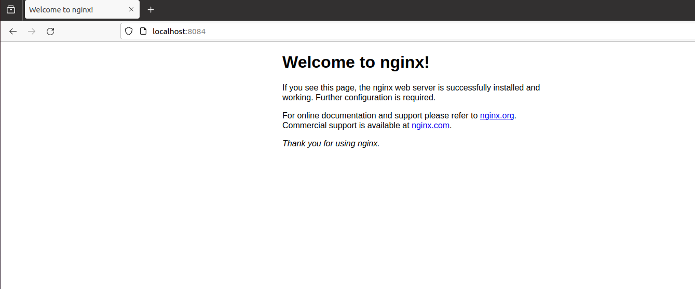

* Service offers load-balancing.

**Node Port Service**

* This type of service exposes the pod at each node at a static port called node port.
* We can access the node port service from outside the cluster by requesting nodeIp:nodePort.
* It means any request to a cluster on the given node port gets forwarded to the service and internally it acts like a cluster ip and forwards the request to the appropriate pods.
* To access the service http://192.168.49.2:30000/
* We are accessing the service with node ip but node ip change we if restart the node.
* Also it is not secure as we are opening ports on the node.
* So,it's not advised to use node-port service in production.

[serviceNodePort.yml](https://github.com/vamsi1998123/K8S/blob/main/serviceNodePort.yml)

**Load Balancer Service**

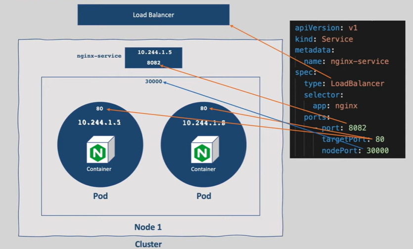

* This type of service exposes the pods externally using the cloud providers load balancer.
* This acts like a cluster ip and node port internally.

[serviceLoadBalancer.yml](https://github.com/vamsi1998123/K8S/blob/main/serviceLoadBalancer.yml)

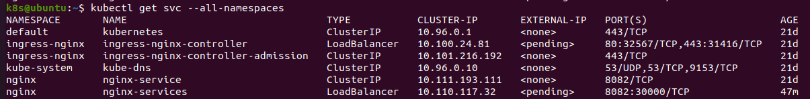

## Ingress 

* One option to expose our applications outside of the cluster is using node port services.
* With Node port services on each port on each node and exposing it to the outside of the cluster. 
* The good thing with this is  user can call any node ip in the cluster using thar port and the request gets forward to the correct port but the bad part is the port's value must be 30000-32767 and the node ip change on restarting the node and it's not secure to open ports on the node.
* In ingress, we declare which request should go to which service.
* The rules we defined to which service it routes are known as Ingress Rules.
* But writing these ingress rules is not enough. There should be some component to read these rules and process them. That component is known as Ingress Contoller.
* To process these rules we must deploy ingress controller  into our cluster for these declaration and act accordingly.
* Now whenever we make a request ingress controllers inspect http request direct that request to the correct pod based on the ingress rules

**Nginx ingress controller**

** install ingress controller in ubuntu:
      

     kubectl apply -f https://raw.githubusercontent.com/kubernetes/ingress-nginx/controller-v1.1.1/deploy/static/provider/cloud/deploy.yaml

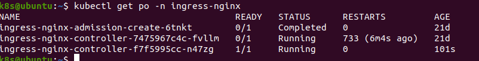

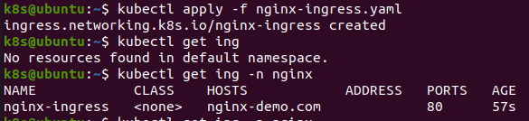

* we cannot access the site since nginx-demo.com is not a valid dns.

## Namespaces 

* when we have so many kubernetes resources of multiple applications it is tough to maintain those resources.
* To avoid this issue there should be a way to organize those resources to help different project teams to share a kubernetes cluster.
* There comes a concept called Namespaces.

## Volumes 

* When a pod is deleted all the data associated with that pod is deleted.
* How to persist the data even if the pod gets deleted.

## StatefulSets 

* Applications which stores the state of the current request,the next request us dependent on the state of the previous request
  is known as StateFul Application.
* What if the same application with a load balancer in front ?
* Let's say first request goes to the instance-1 and we set the authenticated flag to true.
* If the second request goes to the instance-2 , it doesn't give the correct result as we didn't set the flag on instance-2.
* So as a best practice its recommended to move the state to a database.
* When the first time a request comes, we generate a token and save it to the db.
* The application expects the same token for subsequent requests and validates from db.
* As we are not storing any state in our application, Application is called Stateless application and Database is called StateFul Application.
* 

## ConfigMaps and Secrets  

* When we develop any application we should not hard code the properties which change for each environment instead we should configure those properties so that we don;t need to rebuild the image.
* 3 ways to Configure Data:
  a) Passing Arguments
  b) Configuration Files
  c) Environment Variables
* Hard cording this data even in the pod definition is not a good idea as we need different pod definitions for each environment.
* Make the configuration data in common place and refer to to the data from the pod descriptor.
* For this purpose k8s provides two special types of volumes which are ConfigMap and Secret.

## Resource Management

* Once an application is scheduled on to a node it starts consuming node resources.
* It's not just one application that gets deployed to k8s. 
* So we should be extra cautious when deploying our application to k8s such that our application uses Computing resources like CPU and memory wisely and our application performs well and doesn't impact other applications.
* 
* 
* 

## Advanced Scheduling

* K8s scheduler is responsible for scheduling pods onto the nodes 
* 

## AutoScaling

* Using deployments, we can scale the pods manually.
* Whenever there is unusual traffic we can scale our deployments accordingly. But monitoring our traffic continuously and manually scaling-up our application to handle such traffic spikes is a tedious process.
* There is a way to monitor our pods and scale them automatically whenever there is an increase in CPU usage, memory or queries per second (qps). This is called Auto Scaling.
* Scaling automatically based on some metrics.

**Types of AutoScalers**

* HPA (Horizontal Pod AutoScaler) : 
  * It increases the number of replicas whenever there is a spike in CPU, memory or some other metric. That way the load is distributed among the pods.
  * As we are increasing the number of pods this is called scaling up.
  * Increasing number of replicas with HPA is not always a solution.
  * For example: we can make a database handle more connections by increasing the memory and CPU.
  * In such cases we need to increase the resources of existing pods instead of creating new pods.
  
* VPA (Vertical Pod AutoScaler)
  * With VPA we can analyze the resources of a deployment and adjust them accordingly to handle the lod.
  * We increase the resources of existing pods instead of creating new pods.

* CA (Cluster AutoScaler)
  * Finally, if there is no capacity in the cluster it doesn't make any sense to increase the number of pods with HPA or increase the resources with VPA.
  * We should be able to add nodes to the cluster to accomodate more number of pods.
  * It adds the pods, if there is any pods stuck in pending state because of lack of resources.

* Auto Scaling means not just increasing the resources or creating replicas.
* The auto scalers can scale down as well, means decreases the no. of pods and resources.

**HPA**

* Let's say our application is an e-commerce application and. 

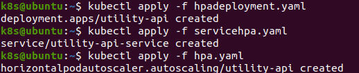

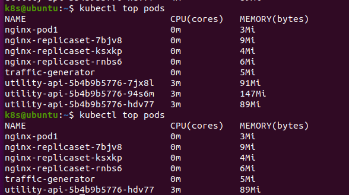

**VPA**

## RBAC

* We will be having may users accessing the k8s resources. When we don't have restrictions to the cluster there may be chances of deleting the resources accidentally.
* So it's wise to impose restrictions to create, modify and delete resources based on some role.
* For example: we should ensure that developers can only deploy certain applications to a given namespace or the IT teams can have only read access for monitoring tasks and admin can do everything.
* we cannot create users in k8s, because k8s doesn't manage users and should be managed by external identity platforms like keycloak ,AWS IAM.
* Authorization and Authentication is handled by k8s.
* When we perform any operation against our cluster the request goes to the API server. 
* RBAC
* ABAC
* Node Authorization
* We cannot create users like we created pods,services etc. Because k8s doesn't manage users and should be managed by external identity platforms like key cloak, AWS IAM.
* However, Authentication and authorization are handled by k8s.
* When we perform any operation against our cluster the request goes to the API Server.
* API server first authenticates if you are a valid user or not if you are valid user then it authorizes if you are allowed to perform an action, if we are allowed then we will get our result.

          openssl genrsa -out vamsi.key 2048

          openssl req -new -key vamsi.key -out vamsi,csr -subj "/CN=vamsi/O=dev/O=example.org"

          k8s@ubuntu:~$ ls | grep vamsi
          vamsi.csr
          vamsi.key

          k8s@ubuntu:~$ openssl x509 -req -CA ~/.minikube/ca.crt -CAkey ~/.minikube/ca.key -CAcreateserial -days 730 -in vamsi.csr -out vamsi.crt
          Signature ok
          subject=CN = vamsi, O = dev, O = example.org
          Getting CA Private Key

          k8s@ubuntu:~$ kubectl config set-credentials vamsi --client-certificate=vamsi.crt --client-key=vamsi.key
          User "vamsi" set.

          k8s@ubuntu:~$ kubectl config set-context vamsi-minikube --cluster=minikube --user=vamsi --namespace=default
          Context "vamsi-minikube" created.

          k8s@ubuntu:~$ kubectl  config get-contexts
          CURRENT   NAME             CLUSTER    AUTHINFO   NAMESPACE
          *         minikube         minikube   minikube   default
                    vamsi-minikube   minikube   vamsi  

          k8s@ubuntu:~$ kubectl config use-context vamsi-minikube
          Switched to context "vamsi-minikube".

          k8s@ubuntu:~$ kubectl get pods
          Error from server (Forbidden): pods is forbidden: User "vamsi" cannot list resource "pods" in API group "" in the namespace "default"

* valid user but not authorized to perform anything as an administrator. we should give him certain permissions.

Role and Role Binding:

* In k8s we can give the permissions to a user with roles and role binding.
* role manifest file
[role.yml](https://github.com/vamsi1998123/K8S/blob/main/role.yaml)

         k8s@ubuntu:~$ kubectl apply -f role.yaml
         role.rbac.authorization.k8s.io/pod-reader created

         k8s@ubuntu:~$ kubectl get roles
         NAME         CREATED AT
         pod-reader   2023-12-10T08:49:57Z

*  Subject (role, user group or service account) + Role (create,read,update or delete) = Role Binding

                            +  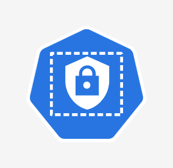=          
                                                    

[rolebinding.yaml](https://github.com/vamsi1998123/K8S/blob/main/rolebinding.yaml)
      
        k8s@ubuntu:~$ kubectl apply -f rolebinding.yaml
        clusterrolebinding.rbac.authorization.k8s.io/pod-reader-global created

        k8s@ubuntu:~$ kubectl get pods
        NAME                           READY   STATUS    RESTARTS         AGE
        debug                          0/1     Error     0                24d
        nginx-pod1                     1/1     Running   10 (4h16m ago)   48d

## Daemon sets 

* Node specific tasks such as collecting logs, metrics for each node in such cases using deployments or replica sets does not gaurantee that the Pod runs on every single node as nodes may get added to the cluster dynamically.
* We have a k8s cluster with multiple nodes. How do we monitor these nodes to see if they are running out of memory or if the CPU is utilized to max.
* We must some agent on each node so that it can collect the metrics from each node and save them to some storage so that we can monitor them.
* But the nodes are created dynamically, we cannot manually create agents on the nodes.
* That is the reason Deamon Sets came into picture. We can run a pod on each node of the cluster.
* If a new node is added to the cluster a new pod will be spun up on the newely added node.
* If the node is removed from the cluster, the pod running on that node will be garbage collected.
* Therefore, with daemon set we make sure that a pod runs on each node always.
* The key difference between a daemon set and deployment is that daemon set ensures that there is one pod per node whereas deployment or replica set can have multiple replicas per node.
* We use deployment for stateless services like UI and Backend, where scaling up and down the no.of replicas and rolling out updates is more important.
* Logging(fluentd, logstash)
* Grafana, Prometheus 
* Networking apps.

       k8s@ubuntu:~$ kubectl apply -f daemonset.yml
       daemonset.apps/node-exporter created
       k8s@ubuntu:~$ kubectl get pods
       NAME                  READY   STATUS    RESTARTS   AGE
       node-exporter-5fnkr   1/1     Running   0          16s
       k8s@ubuntu:~$ minikube  node add
       😄  Adding node m03 to cluster minikube
       👍  Starting worker node minikube-m03 in cluster minikube
       🚜  Pulling base image ...
       🔥  Creating docker container (CPUs=2, Memory=2200MB) ...\
       🐳  Preparing Kubernetes v1.27.4 on Docker 24.0.4 ...
       🔎  Verifying Kubernetes components...
       🏄  Successfully added m03 to minikube!
       k8s@ubuntu:~$ kubectl get nodes
       NAME           STATUS   ROLES           AGE   VERSION
       minikube       Ready    control-plane   99m   v1.27.4
       minikube-m02   Ready    <none>          98m   v1.27.4
       k8s@ubuntu:~$ kubectl get pods -o wide
       NAME                  READY   STATUS    RESTARTS      AGE     IP           NODE           NOMINATED NODE   READINESS GATES
       node-exporter-5fnkr   1/1     Running   0             2m48s   10.244.1.2   minikube-m02   <none>           <none>
       node-exporter-qqpzg   1/1     Running   2 (11s ago)   38s     10.244.2.2   minikube   <none>           <none>
       k8s@ubuntu:~$ kubectl delete node minikube-m02
       node "minikube-m02" deleted
       k8s@ubuntu:~$ kubectl get pods -o wide
       NAME                  READY   STATUS    RESTARTS       AGE     IP           NODE           NOMINATED NODE   READINESS GATES
       node-exporter-qqpzg   1/1     Running   0              5m40s   10.244.0.3   minikube       <none>           <none>
       k8s@ubuntu:~$ kubectl port-forward node-exporter-qqpzg 9100:9100
       Forwarding from 127.0.0.1:9100 -> 9100
       Forwarding from [::1]:9100 -> 9100

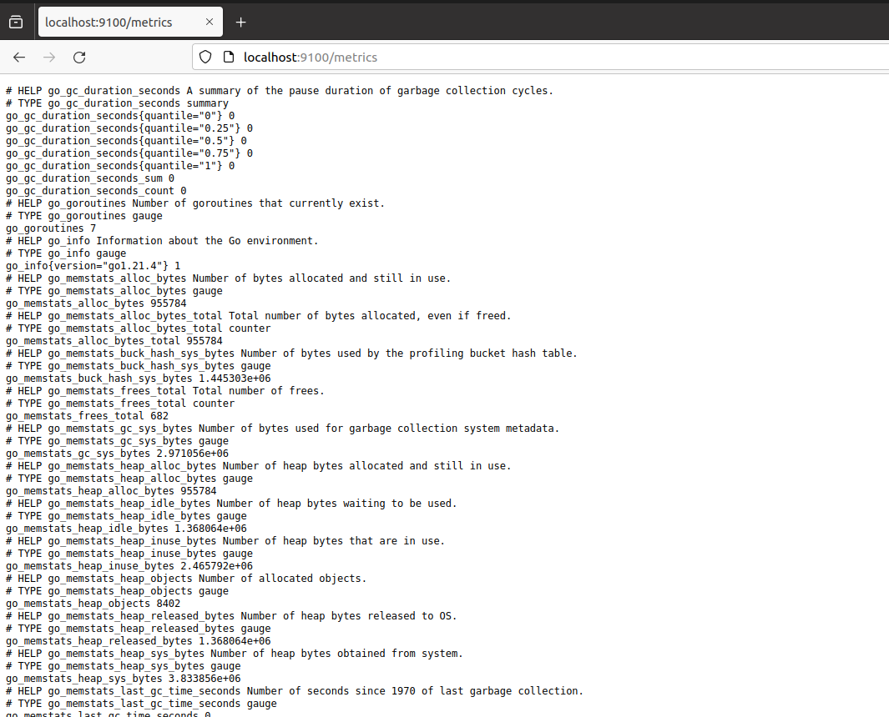

## Jobs and CronJobs  

* If we want to run our pods only once like taking the DB backup or sending emails in a batch.
* Such process shouldn't be running continuously. They will run just for a certain amount of time and run at particular times.
* For these processes having controllers like deployment is a bad idea as it makes sure the Pod runs continuously.
* 

## Helm Charts

Problem Statement 1:

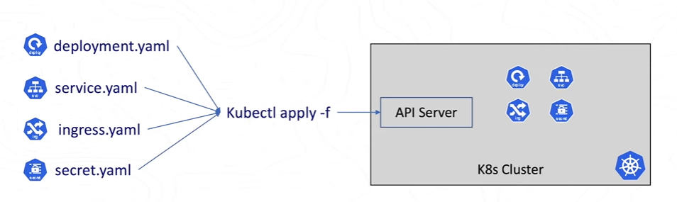

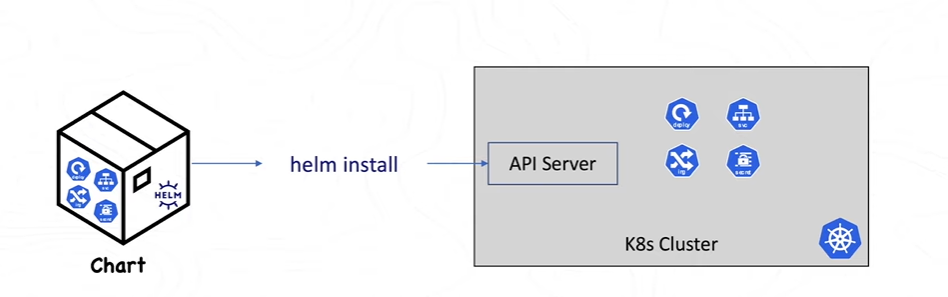

Problen Statement 2:

* Helm is open source
* It is Package manager for Kubernetes.
* There are two helm version i.e. helm2 and helm3 (3.10.0)
* If you are working on ubuntu the default package manager is APT (Advanced Package Tool). 
* Basically, the package manager is deals with the installation of a specific package.
* Even in k8s, we do some mandatory installations. like setup of monitoring setup (Prometheus and Grafana) or logging setup like elastic search.
* So why everybody has to use prometheus deployment.yml, service.yml. Instead, what if Prometheus provides an easy way to install Prometheus.
* For this reason, there is an evolution  of a concept called package Management in k8s.
* We can install all these mandatory setups using a simple package manager Helm.
* By using the helm chart with small minor modifications, we can install the setup.

        k8s@ubuntu:~$ helm create todo-api
        Creating todo-api
        k8s@ubuntu:~$ ls
        deployment.yml   get-docker.sh          Music                Public             servicehpa.yaml            service.yaml   trafficgenerator.yaml   vamsi.key
        Desktop          hpadeployment.yaml     nginx-ingress.yaml   replicaset.yml     serviceLoad.yaml           snap           vamsi.crt               Videos
        Documents        hpa.yaml               Pictures             rolebinding.yaml  'serviceNode (copy).yaml'   Templates      vamsi,csr               wrk
        Downloads        minikube-linux-amd64   pod.yml              role.yaml          serviceNode.yaml           todo-api       vamsi.csr
        k8s@ubuntu:~$ cd todo-api
        k8s@ubuntu:~/todo-api$ ls
        charts  Chart.yaml  templates  values.yaml
        k8s@ubuntu:~/todo-api$ code .
        k8s@ubuntu:~/todo-api$ 
