* Kubernetes is an open-source system for automating deployment, scaling and management of containerized applications.

**Problem Statement 1**: (Monitoring,Self-Healing and High Availability)

* We have containerized our application and deployed on virtual machine.
* There can be problem in the container or vm/node and either of them is crashed. Then we cannot access our service.
* In real time, there will be many containers as we deal with microservices architecture.

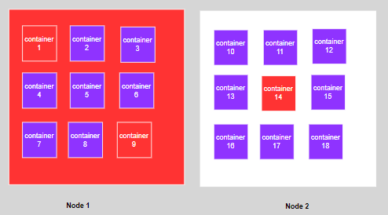

* we never know when and which container goes down, can we monitor it manually and restart our stopped containers ?
* There is a way to monitor the health of each container and node to bring them back when they go down. This is called self-healing or resilience.
* K8S checks or monitors the health of each container and node and bring them back when they go down. So we will not face any downtime. This is called as High-availability.

**Problem Statement 2**: (Load Balancing, Auto Scaling,Automatic bin packing)

* Your application is working fine for 20 requests per seconds, what if the requests are 100 per second ?
* The application cannot handle the load.
* What if there is a way to replicate the same application into multiple containers, if required across multiple nodes and put a load balancer in front of those containers.
* So, any request made, initially goes to the load balancer, and it distributes the load among multiple containers.
* Now the application can handle the load.

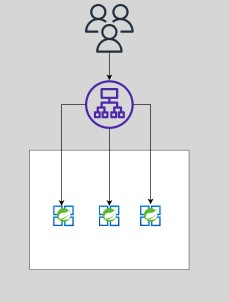{ align=center }

* What if there is a way to increase the number of containers if the load increases and decrease the number of containers if load decreases. This is called as Scaling.
* K8s can that smart job of scaling based on the load.
* It can scale nodes also, meaning if there are multiple containers are running in a node and while creating a new container if there are not enough resources like cpu and ram k8s can **automatically spin up another container** for running the node. This is called automatic bin packing 

**Problem Statement 3**: (Rollout,rollbacks)

* You are deploying the enhancement multiple times a day. What happens when your deployment is going 
  on your old container gets deleted and a new container gets created.
* In the gap of deleting and creating the container your application will be down which is a bad thing.
* When you have multiple containers running of the same application, instead of deleting all containers at once and creating them again with rolling deployments we can replace the containers one by one.
* i.e Rolling Deployments and also upgrade a percentage of containers i.e Canary deployments.

**Problem Statement 4**: (Secret and Config Management)

* For example: the application is running with version:1 , what if we want to deploy new version of the application ? We call this rolling out a new version or 
  what if we want to rollback to a older version if there is an error in the new version.
* With K8S we can deploy and update the secrets and application configuration without rebuilding our image and without exposing secrets in your stack configuration now.

## Features:

* Monitoring
* Self Healing
* High Availability
* Load Balancing
* Auto Scaling
* Automatic bin packing (efficiently scheduling containers onto nodes based on resource constraints)
* Rolling and Canary Deployments
* Automatic Rollout and Rollback
* Secret and Configuration Management.

## K8S Architecture

**Cluster**

* The place where we run the containers is physical or virtual machines is known as nodes more specifically worker nodes.
* Generally there will be multiple worker nodes so that of one node goes down containers can be run in other nodes.
* Also we can run the same application on multiple nodes to share the node.
* We call these set of worker nodes as data plane
* Some one should manage these worker nodes like if one node goes down moving the containers to a healty node etc.
* This contoller part is taken care by another nodealled Master node or control-plane.
* In real-time there will be more than one master node for fault tolerance.

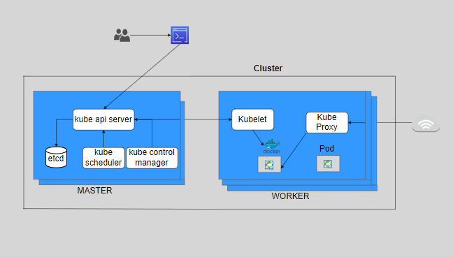

* So a k8s cluster consists of a group of worker nodes and set of master nodes which manages the worker nodes.

**Master Node Components**:

* It consists of components that control the cluster and data about the cluster state and configuration.

    **kube API SERVER**:

     * To interact with the k8s the user can use the apis provided by api server through cli or sdk.
     * We can call api server as front end for the k8s control plane.
     * So with this api we can instruct the k8s to do some operations like scheduling pod, get the list of pods etc.

    **etcd**:
  
     * This is a storage where we can track all the nodes we have in the clusters and the containers details.
     * Its a key value store to save clustered data, recommended to have backup plan.
     * It is accessible only from api server for security reasons.No other component can directly interact with etcd.
     * This etcd has a wonderful feature called watch api. The watch waits for the changes to keys by continuously watching and sends those key updates back to the client.
     * so if any change happens in the records k8s api will respond accordingly.

    **kube scheduler**:
  
     * It helps to schedule the pods based on the various nodes based on the resource utilization.

    **kube control manager**:

     * when a change in a service config occurs for ex: replacing the image from which the pods are running or changing parameters in the config.yml, the controller spots the change amd starts working towards the new desired state.
     Types of Controllers
     * Replication Controller (correct no.of pods are running in the cluster)
     * Node Controller (monitors health of each node)
     * Endpoint controller (connects the pods and services to populate the object)

**Worker Node Components**:

   **Container run time**:                                                           

   * To run an image from a container we need a container run time. There are many CRT available in the market like docker,racket, containerd.

   **Kubelet**:
   
   * This is an agent that runs on each worker node in the cluster. It makes sure that the containers are running in a pod.
   * It regularly checks the new or modified pod specification from the api server and ensuring the pods and their containers are healthy.
   * Kubelet doesn't manage the containers that are not created by k8s.
   * It is also responsible for registering a node with k8s cluster and sending events like pod status,resource utilization reports to the master server.    

   **KubeProxy**:
    
   * It is a network proxy that runs on each worker node.
   * When a request is received for your application it makes sure to forward it to the appropriate pod.

**Summary**:

* Let's say we want to create two instances of an application.
* First we create an yml file and send it to the **Kube api server**.
* The api runs the yml file/ specification by the **kube scheduler**.
* The scheduler selects the worker node to which new node should be assigned based on the configuration and resource availability.
* At the same time the master server also stores the configuration and status data to etcd.
* Once the scheduler assigns a worker node the **kube controller manager** on the master node then sends an object specification to the node via api server.
* Upon receiving the object from the api server the **kubelet** on the node ensures the object are created accordingly.
* Whenever the status of the pod is changed like pod is killed the kubelet via api server updates the **etcd**.
* The watch function of stcd monitors the changes to the desired state and the actual state.
* The controller manager responds to this difference in the state of the resources and work towards the actual state.

## Kubernetes Setup

* Minikube
* Kind
* K3s
* Kubeadm

* 2 CPUs or more
* 2 GB of free memory
* 20 GB of free disk space
* Docker or VM manager

      minikube start --nodes 2 -p local-cluster --driver=docker
      minikube status -p local-cluster

      local-cluster
      type: Control Plane
      host: Running
      kubelet: Running
      apiserver: Running
      kubeconfig: Configured
      local-cluster-m02
      type: Worker
      host: Running
      kubelet: Running

* Create a cluster using minikube
       
           minikube start --nodes 2 -p local-cluster --driver=docker

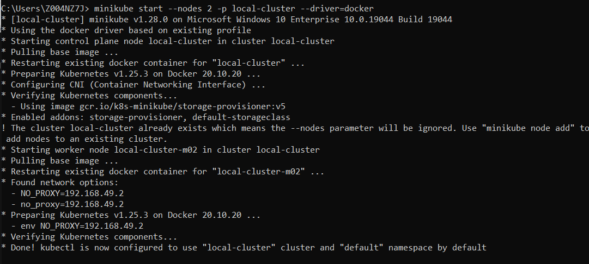

## Kubectl Syntax:

kubectl [command][TYPE][NAME][flags] ---> kubectl  [create,get,describe,delete  etc] [pods,services] [name of the resource] [-o -f]

## Pods

* It is an encapsulated layer over/around the containers.
* A pod can have one or more containers.
* So, when we want to run our application we will run it in containers.
* But in k8s the container alone can be deployed and it needs to be wrapped up in a pod.
* why we need pod ??
* In most cases each pod will be having only one container.
* But there is an example: where the 2 or more containers should run on one pod.
*  refreshing the configuration for every one hr.
* All the containers in the pod will share the same network and storage.
* When the pod is deleted all the containers in the pod gets deleted. and even same with creation.
* If we want to scale our application i.e when the load increases if we want to increase the number of instances of our application, we should not increase the no.of containers in the same pod. But we should increase the number of pods.
* when pods are created each pod is assigned a unique ip address and range of ports. with this we can run 2 applications on the same port in the same node.

 

* Within the same the pod the containers can communicate with "localhost" as they are in the same network.
* Containers that want to interact with other containers running in other pod can use ip address to communicate.
* To create a pod:
        
           kubectl run nginx-pod --image=nginx

* To create pod using yml:

[pod.yml](https://github.com/vamsi1998123/K8S/blob/main/pod.yml)

          kubectl apply -f pod.yml

* To get the list of pods:
  
         kubectl get pods

* To delete a pod

         kubectl delete pod ngnix-pod

* To filter nodes based on label

         kubectl get pods -l team=intergrations

* To know more info about the pod

         kubectl get pod nginx-pod -o wide  -- in text format

         kubectl get pod nginx-pod -o yaml  -- in yml format

* To get detailed info about the pod

         kubectl describe pod nginx-pod

* Getting into the pod:

         kubectl exec -it nginx-pod --bash

* To get into a specific container in a pod

         kubectl exec -it nginx-pod -c nginx-container --bash

* Port Forwarding
  * we cannot access pod directly outside the node. It can be accessed only from within the node.
  * If we have access to the cluster, we can access it with port forward.

        kubectl port-forward nginx-pod 8083:80

* Logs of a pod

        kubectl logs nginx-pod

* To delete all the resources of a pod which are created using yml

        kubctl delete -f pod.yml

## Replica Sets and Deployments

* What happens if the pod goes down ? Users cannot access our application
* But in production, we should ensure that our application is highly available.
* To achieve this we should create multiple instances of our application instead of relying on single instance.
* In that case even if one instance goes down, the other pod can still solve the request.
* These instances are called **replicas**. If we create multiple pods manually it can be time-consuming and tedious.
* Instead of creating these replicas manually we can automate creating these replicas with the replica set object in kubernetes.
* When the pod goes down automatically bringing back is known as **self-healing**.
* When we ask replicaset to create 2 replicas it makes sure that 2 replicas are available all the time.
* If any replica goes down it will create a new replica immediately. If an extra replica is created it will delete a new replica.
* What if the Node goes down ? Again same problem, Users cannot access our application. We should all our pods to a healthy node.
* The same replica set can do the job.

[replicaset.yml](https://github.com/vamsi1998123/K8S/blob/main/replicaset.yml)

       kubectl get rs

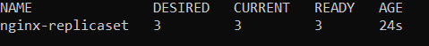

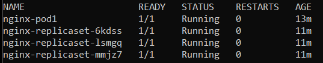

* Now, we will delete one pod.

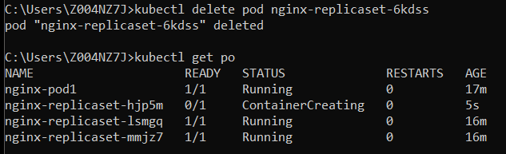    

* Still, we can see 3 pods available. This is because replicaset always makes sure that the given number of replicas available all the time.

* Now, let's try to delete the node. Before let's add one more to the cluster.

          minikube node add --worker

* Check on which node the pods are running.

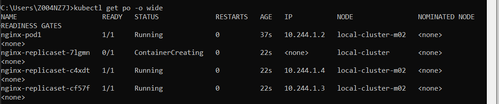

* Delete the node

       minikube node delete local-cluster-m02 -p local-cluster

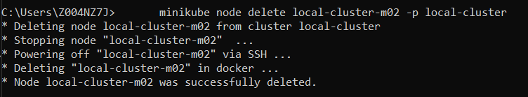

* The pods got recreated in other node.

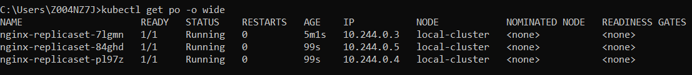

## RollOut and Roll Back:
* For example: our application is running with 1.21 v and we want to upgrade it to 1.22 v.
* It requires starting the new version of pod and stopping the old version of pod waiting and verifying the new version.
* There will be a case of rolling it back to a previous version in case of any issues.
* If we do this manually there will be a lot of chances of errors and it's time-consuming.
* We can automate the rollout and rollback with the deployment object in k8s.
* When we create the deployment, replicaset is automatically created, so no need to create the replica set manually.
* Every time we create a deployment the deployment creates a replica set and replicaset creates the pod.
* This is the reason pod is considered as the smallest unit in k8s.

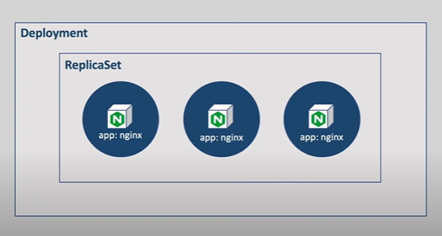

[deployment.yml](https://github.com/vamsi1998123/K8S/blob/main/deployment.yml)

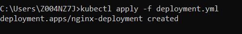

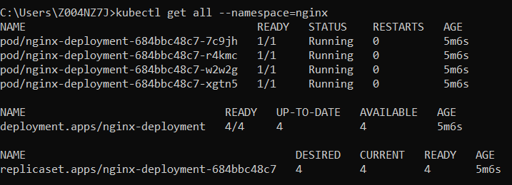

## Services

* All the pods are non-permanent resources and ther ip address keeps on changing and when we try to access with old ip it fails to connect.
* So, we cannot rely on their ips to communicate if you want to access the services in a pod.
* The main objective of the services is to abstract the pod ip address from ens user.
* When a service is created an ip address is assigned to that service and this ip address doesn't change as long as the service exists. 
* So users can call a single stable ip address instead of calling each pod individually and the service forward the request to pod.
* Now, even if pod ip changes it doesn't matter as the service will take care of routing to appropriate pods.
* Services are not created on any node unlike pods.

**Use Case-2**
* We have 2 pods of same application.
* When we make a request to which pod our request goes?
* Service will take care of load balancing,
* i.e Service provides load balancing when you have pod replicas. It picks a pod randomly and forwards the request to it.
* Services also offer other advantages likes service discovery and zero downtime deployments.

## Types of services

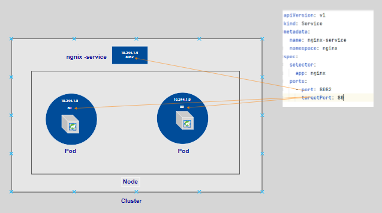

* ClusterIp Service

* Node Port Service

## Ingress

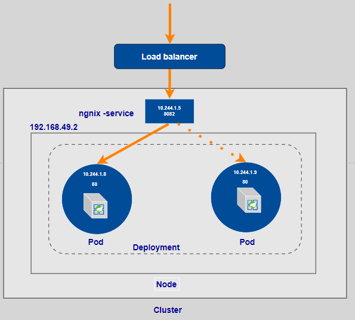

* One option to expose our applications outside of the cluster is using node port services.
* With Node port services on each port on each node and exposing it to the outside of the cluster. The good thing with this is  user can call any node ip in the cluster using thar port and the request gets forward to the correct port but the bad part is the port's value must be 30000-32767 and the node ip change on restarting the node and it's not secure to open ports on the node.
* In ingress we declare which request should go to which service.

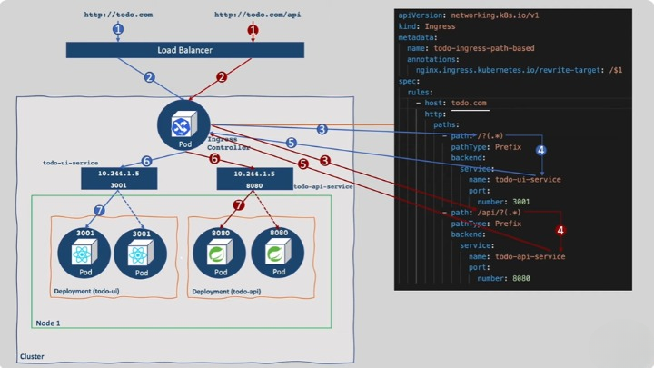

**Nginx ingress controller**

** install ingress controller in ubuntu:
      
    kubectl apply -f https://raw.githubusercontent.com/kubernetes/ingress-nginx/controller-v0.44.0/deploy/static/provider/cloud/deploy.yaml
  

## Namespaces

* when we have so many kubernetes resources of multiple applications it is tough to maintain those resources.
* To avoid this issue there should be a way to organize those resources to help different project teams to share a kubernetes cluster.
* There comes a concept called Namespaces.

## Volumes

## StatefulSets

## ConfigMaps and Secrests

## Resource Management

## Advanaced Scheduling

## AutoScaling

## RBAC

## Daemon sets

## Jobs and CronJobs