# Kubernetes (K8s)

> **Master Kubernetes from cluster internals to production operations.** Covers architecture, scheduling algorithms, networking model, storage, RBAC, Helm, debugging playbooks, and every question that comes up at senior-level DevOps and SRE interviews.

---

## How to Use This Guide

This guide is structured as a progressive deep-dive, from foundational motivation through production-grade operations:

- **Section 1** — Why K8s exists: the problems it solves (self-healing, scaling, zero-downtime, config management).
- **Sections 2-3** — Architecture & core objects: control plane internals, worker nodes, the full `kubectl apply` flow, Pods, Deployments, Services, Ingress, HPA.
- **Sections 4-6** — Advanced concepts: StatefulSets, DaemonSets, networking model, storage, RBAC.
- **Sections 7-8** — Production: Helm, operations playbook, debugging techniques.
- **Interview Q&A** — FAANG-level design and concept questions with concise answers.

Start with Section 1 if you want the mental model for why orchestration exists. If you already understand the motivation, jump to Section 2 for architecture or directly to the Interview Q&A for rapid prep.

---

## 1. Why Kubernetes Exists

Kubernetes was born from **Borg** — Google's internal system that manages billions of containers across millions of machines. In 2014, Google open-sourced the concepts as Kubernetes. Today it runs everything from Spotify to Airbnb to every major bank.

<div class="vtn-story-box vtn-animate-fade-up">
  <h4>Problem 1: Self-Healing & High Availability</h4>
  <p>You have 200 microservices running across 50 nodes. At 3 AM, a node's disk fills up and 12 containers crash. Without K8s, you get paged, SSH into machines, manually restart services, and hope nothing else breaks.</p>
  <p><strong>K8s answer:</strong> The controller-manager detects unhealthy pods within seconds. The scheduler places replacements on healthy nodes. By the time you wake up, everything is already running — on different nodes. You find out from a Slack alert that says "auto-healed."</p>
</div>

<div class="vtn-story-box vtn-animate-fade-up vtn-delay-1">
  <h4>Problem 2: Scaling Under Load</h4>
  <p>Your e-commerce site handles 1,000 req/s normally. Black Friday hits — 50,000 req/s. Manually provisioning servers takes 30 minutes. You've already lost millions in revenue.</p>
  <p><strong>K8s answer:</strong> HPA detects CPU spike within 15 seconds. Scales pods from 10 to 100 in under a minute. Cluster Autoscaler sees unschedulable pods, provisions new nodes from your cloud provider. Traffic spike handled — automatically, in under 2 minutes.</p>
</div>

<div class="vtn-story-box vtn-animate-fade-up vtn-delay-2">
  <h4>Problem 3: Zero-Downtime Deploys</h4>
  <p>You deploy 20 times per day. Old approach: stop all instances, deploy new version, start up. That's 30-60 seconds of downtime per deploy — 10+ minutes of downtime PER DAY.</p>
  <p><strong>K8s answer:</strong> Rolling updates replace one pod at a time. New pod starts → passes health check → gets traffic → old pod drains connections → terminates. If the new version crashes? Automatic rollback. Zero dropped requests.</p>
</div>

<div class="vtn-story-box vtn-animate-fade-up vtn-delay-3">
  <h4>Problem 4: Configuration & Secrets at Scale</h4>
  <p>You have 50 services × 4 environments = 200 different configurations. Database URLs, API keys, feature flags — all baked into Docker images. Changing one config means rebuilding and redeploying an image.</p>
  <p><strong>K8s answer:</strong> ConfigMaps and Secrets are injected at runtime. Change a database password? Update the Secret, rolling-restart the pods. No image rebuild. No code change. Decoupled.</p>
</div>

---

## 2. Architecture — How The Cluster Works

<div class="vtn-callout">
  A Kubernetes cluster has two planes: the <strong>Control Plane</strong> (the brain — decides what should happen) and the <strong>Data Plane</strong> (worker nodes — where your containers actually run). In production, you run 3+ control plane nodes across availability zones.
</div>

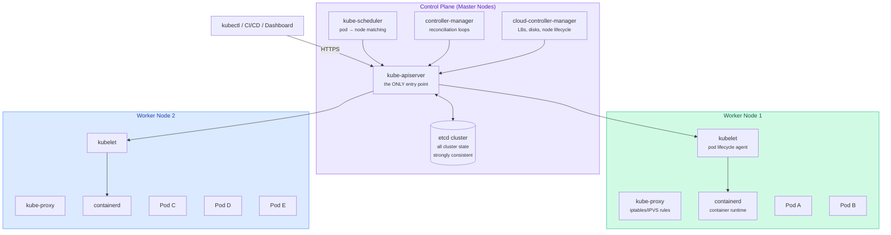
```mermaid
flowchart TB
    USER["kubectl / CI/CD / Dashboard"] -->|"HTTPS"| API

    subgraph CP["Control Plane (Master Nodes)"]
        API["kube-apiserver<br/><small>the ONLY entry point</small>"]
        ETCD[("etcd cluster<br/><small>all cluster state<br/>strongly consistent</small>")]
        SCHED["kube-scheduler<br/><small>pod → node matching</small>"]
        CM["controller-manager<br/><small>reconciliation loops</small>"]
        CCM["cloud-controller-manager<br/><small>LBs, disks, node lifecycle</small>"]

        API <--> ETCD
        SCHED --> API
        CM --> API
        CCM --> API
    end

    subgraph WN1["Worker Node 1"]
        KL1["kubelet<br/><small>pod lifecycle agent</small>"]
        KP1["kube-proxy<br/><small>iptables/IPVS rules</small>"]
        CR1["containerd<br/><small>container runtime</small>"]
        P1["Pod A"] & P2["Pod B"]
    end

    subgraph WN2["Worker Node 2"]
        KL2["kubelet"]
        KP2["kube-proxy"]
        CR2["containerd"]
        P3["Pod C"] & P4["Pod D"] & P5["Pod E"]
    end

    API --> KL1 & KL2
    KL1 --> CR1
    KL2 --> CR2

    style CP fill:#EDE9FE,stroke:#8B5CF6,color:#5B21B6
    style WN1 fill:#D1FAE5,stroke:#10B981,color:#065F46
    style WN2 fill:#DBEAFE,stroke:#3B82F6,color:#1E40AF
```

### Control Plane Deep Dive

<div class="vtn-concept-grid">
  <div class="vtn-concept-card vtn-animate-fade-up vtn-delay-1">
    <h4>kube-apiserver</h4>
    <p>The ONLY component that reads/writes etcd. Everything goes through it — kubectl, the scheduler, controllers, kubelets. It handles authentication, authorization (RBAC), admission control, and validation. Horizontally scalable (run multiple replicas behind a load balancer).</p>
  </div>
  <div class="vtn-concept-card vtn-animate-fade-up vtn-delay-2">
    <h4>etcd</h4>
    <p>Distributed key-value store (Raft consensus). Holds ALL cluster state — pod specs, service endpoints, secrets, configmaps. <strong>If etcd is lost without backup, your cluster is irrecoverable.</strong> Always run 3 or 5 nodes across zones. Always have automated backups.</p>
  </div>
  <div class="vtn-concept-card vtn-animate-fade-up vtn-delay-3">
    <h4>kube-scheduler</h4>
    <p>Watches for pods with <code>nodeName: ""</code> (unscheduled). Runs a scoring algorithm considering: resource requests, node affinity/anti-affinity, taints/tolerations, topology spread constraints, and inter-pod affinity. Picks the highest-scoring node.</p>
  </div>
  <div class="vtn-concept-card vtn-animate-fade-up vtn-delay-4">
    <h4>controller-manager</h4>
    <p>Runs ~30 control loops simultaneously. Each one watches a resource type and reconciles actual state to desired state. Deployment controller, ReplicaSet controller, Node controller, Job controller, EndpointSlice controller, etc. This is the "self-healing" engine.</p>
  </div>
</div>

### Worker Node Deep Dive

<div class="vtn-concept-grid">
  <div class="vtn-concept-card vtn-animate-fade-up vtn-delay-1">
    <h4>kubelet</h4>
    <p>Agent on every node. Watches the API server for pods assigned to its node. Calls the container runtime (containerd) to start/stop containers. Runs liveness/readiness probes. Reports node status and pod status back to API server every 10s.</p>
  </div>
  <div class="vtn-concept-card vtn-animate-fade-up vtn-delay-2">
    <h4>kube-proxy</h4>
    <p>Runs on every node. Watches Service and EndpointSlice objects. Programs iptables or IPVS rules so that Service ClusterIPs route to healthy pod backends. This is how <code>my-service:80</code> gets DNAT'd to <code>10.244.1.8:8080</code>.</p>
  </div>
  <div class="vtn-concept-card vtn-animate-fade-up vtn-delay-3">
    <h4>Container Runtime (containerd)</h4>
    <p>Pulls images, manages container lifecycle, provides CRI (Container Runtime Interface). Docker was deprecated in K8s 1.24 — containerd and CRI-O are the standards now. Your Docker images still work (they're OCI-compliant).</p>
  </div>
</div>

### The Full Request Flow: `kubectl apply -f deployment.yaml`

<div class="vtn-timeline">
  <div class="vtn-timeline-item">
    <h4>1. kubectl → API Server (HTTPS + auth)</h4>
    <p>kubectl reads your kubeconfig, authenticates (cert/token/OIDC), sends the manifest as a POST/PUT request to the API server.</p>
  </div>
  <div class="vtn-timeline-item">
    <h4>2. Admission Controllers</h4>
    <p>API server runs mutating webhooks (inject sidecar? add labels?) then validating webhooks (meets policy? resource quotas OK?). If any reject → error returned to user.</p>
  </div>
  <div class="vtn-timeline-item">
    <h4>3. Persisted to etcd</h4>
    <p>Validated object written to etcd. API server returns 201 Created. Object now exists in cluster state.</p>
  </div>
  <div class="vtn-timeline-item">
    <h4>4. Deployment Controller reacts</h4>
    <p>Watches Deployment objects. Sees new one → creates a ReplicaSet with the pod template and desired replicas.</p>
  </div>
  <div class="vtn-timeline-item">
    <h4>5. ReplicaSet Controller reacts</h4>
    <p>Watches ReplicaSets. Sees desired=3, current=0 → creates 3 Pod objects (with <code>nodeName: ""</code>).</p>
  </div>
  <div class="vtn-timeline-item">
    <h4>6. Scheduler assigns nodes</h4>
    <p>Watches unscheduled pods. Scores available nodes. Binds each pod to the best node (sets <code>nodeName</code>).</p>
  </div>
  <div class="vtn-timeline-item">
    <h4>7. kubelet starts containers</h4>
    <p>Watches pods assigned to its node. Pulls image via containerd, starts container, sets up volumes/network. Reports pod status = Running.</p>
  </div>
  <div class="vtn-timeline-item">
    <h4>8. kube-proxy updates routing</h4>
    <p>If a Service selects these pods (via label selector), kube-proxy adds them to iptables/IPVS backends. Traffic can now reach them.</p>
  </div>
</div>

---

## 3. Core Objects — Pods, Deployments, Services

### K8s Resource Map

<div class="vtn-icon-row vtn-animate-fade-up">
  <div class="vtn-icon-item">
    <svg width="48" height="48" viewBox="0 0 48 48" fill="none"><rect width="48" height="48" rx="10" fill="#326CE5" fill-opacity="0.15"/><path d="M24 12L34 18V30L24 36L14 30V18L24 12Z" stroke="#326CE5" stroke-width="2" fill="#326CE5" fill-opacity="0.1"/><circle cx="24" cy="24" r="4" fill="#326CE5"/></svg>
    <span>Pod</span>
  </div>
  <div class="vtn-icon-item">
    <svg width="48" height="48" viewBox="0 0 48 48" fill="none"><rect width="48" height="48" rx="10" fill="#10B981" fill-opacity="0.15"/><circle cx="24" cy="24" r="10" stroke="#10B981" stroke-width="2" fill="#10B981" fill-opacity="0.1"/><path d="M18 24H30M24 18V30" stroke="#10B981" stroke-width="2" stroke-linecap="round"/></svg>
    <span>Service</span>
  </div>
  <div class="vtn-icon-item">
    <svg width="48" height="48" viewBox="0 0 48 48" fill="none"><rect width="48" height="48" rx="10" fill="#8B5CF6" fill-opacity="0.15"/><rect x="14" y="14" width="20" height="20" rx="4" stroke="#8B5CF6" stroke-width="2" fill="#8B5CF6" fill-opacity="0.1"/><path d="M20 20H28M20 24H28M20 28H24" stroke="#8B5CF6" stroke-width="1.5" stroke-linecap="round"/></svg>
    <span>Deployment</span>
  </div>
  <div class="vtn-icon-item">
    <svg width="48" height="48" viewBox="0 0 48 48" fill="none"><rect width="48" height="48" rx="10" fill="#F59E0B" fill-opacity="0.15"/><path d="M14 30L24 14L34 30" stroke="#F59E0B" stroke-width="2" fill="#F59E0B" fill-opacity="0.1" stroke-linejoin="round"/><path d="M18 30L24 20L30 30" stroke="#F59E0B" stroke-width="1.5" stroke-linejoin="round"/></svg>
    <span>HPA</span>
  </div>
  <div class="vtn-icon-item">
    <svg width="48" height="48" viewBox="0 0 48 48" fill="none"><rect width="48" height="48" rx="10" fill="#06B6D4" fill-opacity="0.15"/><rect x="14" y="16" width="20" height="16" rx="3" stroke="#06B6D4" stroke-width="2" fill="#06B6D4" fill-opacity="0.1"/><path d="M18 22H30M18 26H26" stroke="#06B6D4" stroke-width="1.5" stroke-linecap="round"/></svg>
    <span>ConfigMap</span>
  </div>
  <div class="vtn-icon-item">
    <svg width="48" height="48" viewBox="0 0 48 48" fill="none"><rect width="48" height="48" rx="10" fill="#EF4444" fill-opacity="0.15"/><rect x="16" y="18" width="16" height="14" rx="3" stroke="#EF4444" stroke-width="2" fill="#EF4444" fill-opacity="0.1"/><circle cx="24" cy="25" r="2" fill="#EF4444"/><path d="M24 14V18" stroke="#EF4444" stroke-width="2" stroke-linecap="round"/><path d="M20 16C20 14 22 12 24 12C26 12 28 14 28 16V18H20V16Z" stroke="#EF4444" stroke-width="1.5" fill="none"/></svg>
    <span>Secret</span>
  </div>
  <div class="vtn-icon-item">
    <svg width="48" height="48" viewBox="0 0 48 48" fill="none"><rect width="48" height="48" rx="10" fill="#14B8A6" fill-opacity="0.15"/><path d="M16 32V20L24 16L32 20V32L24 36L16 32Z" stroke="#14B8A6" stroke-width="2" fill="#14B8A6" fill-opacity="0.1"/><path d="M16 20L24 24L32 20M24 24V36" stroke="#14B8A6" stroke-width="1.5"/></svg>
    <span>Volume</span>
  </div>
  <div class="vtn-icon-item">
    <svg width="48" height="48" viewBox="0 0 48 48" fill="none"><rect width="48" height="48" rx="10" fill="#EC4899" fill-opacity="0.15"/><rect x="12" y="14" width="24" height="20" rx="4" stroke="#EC4899" stroke-width="2" fill="#EC4899" fill-opacity="0.1"/><line x1="12" y1="22" x2="36" y2="22" stroke="#EC4899" stroke-width="1.5"/><line x1="24" y1="22" x2="24" y2="34" stroke="#EC4899" stroke-width="1.5"/></svg>
    <span>Namespace</span>
  </div>
</div>

---

### Pods — The Atomic Unit

<div class="vtn-callout">
  <strong>Mental model:</strong> A Pod is NOT "a container." It's a shared execution environment — one or more containers that share network (same IP, communicate via localhost) and storage (same volumes). Think of it as a "logical host" for tightly-coupled processes.
</div>

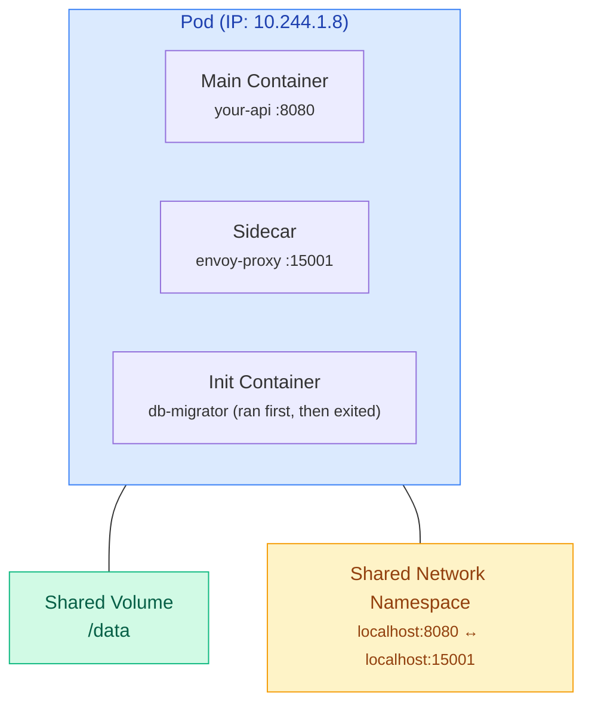
```mermaid
flowchart TB
    subgraph POD["Pod (IP: 10.244.1.8)"]
        direction LR
        MAIN["Main Container<br/><small>your-api :8080</small>"]
        SIDE["Sidecar<br/><small>envoy-proxy :15001</small>"]
        INIT["Init Container<br/><small>db-migrator (ran first, then exited)</small>"]
    end

    VOL["Shared Volume<br/>/data"]
    NET["Shared Network Namespace<br/><small>localhost:8080 ↔ localhost:15001</small>"]

    POD --- VOL
    POD --- NET

    style POD fill:#DBEAFE,stroke:#3B82F6,color:#1E40AF
    style VOL fill:#D1FAE5,stroke:#10B981,color:#065F46
    style NET fill:#FEF3C7,stroke:#F59E0B,color:#92400E
```

**Multi-container patterns (these come up in FAANG interviews):**

| Pattern | Example | Why |
|---------|---------|-----|
| **Sidecar** | Envoy proxy, log shipper (Fluentd), cert rotator | Adds functionality without modifying main app |
| **Init Container** | DB migration, wait-for-dependency, config download | Must complete before main containers start |
| **Ambassador** | Redis proxy, API gateway sidecar | Simplifies main app's connection logic |
| **Adapter** | Log format converter, metrics transformer | Standardizes output format for monitoring |

**Probes — The Self-Healing Mechanism:**

| Probe | Question | On Failure | Use Case |
|-------|----------|------------|----------|
| **Liveness** | "Is this process alive?" | Restart container | Detect deadlocks, infinite loops |
| **Readiness** | "Can this handle traffic?" | Remove from Service endpoints | Warmup, dependency health |
| **Startup** | "Has this finished starting?" | Kill + restart after timeout | Slow-starting legacy apps |

!!! danger "Production War Story: Liveness Probe Mistake"
    A team set their liveness probe to check a downstream database. When the DB had a blip, ALL pods restarted simultaneously — cascading failure. **Rule: Liveness probes must only check the process itself, never external dependencies.** Use readiness probes for dependency checks.

---

### Deployments — The Workload Manager

A Deployment manages ReplicaSets, which manage Pods. You declare desired state, K8s makes it happen.

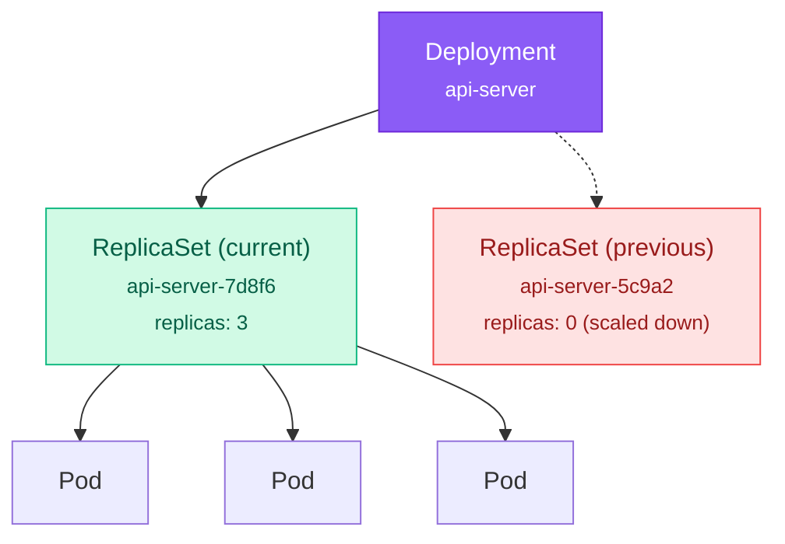
```mermaid
flowchart TB
    DEP["Deployment<br/><small>api-server</small>"]
    DEP --> RS1["ReplicaSet (current)<br/><small>api-server-7d8f6<br/>replicas: 3</small>"]
    DEP -.-> RS2["ReplicaSet (previous)<br/><small>api-server-5c9a2<br/>replicas: 0 (scaled down)</small>"]
    RS1 --> P1["Pod"] & P2["Pod"] & P3["Pod"]

    style DEP fill:#8B5CF6,stroke:#6D28D9,color:#fff
    style RS1 fill:#D1FAE5,stroke:#10B981,color:#065F46
    style RS2 fill:#FEE2E2,stroke:#EF4444,color:#991B1B
```

### Rolling Update — How Zero-Downtime Works

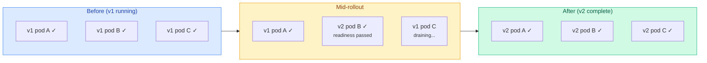
```mermaid
flowchart LR
    subgraph BEFORE["Before (v1 running)"]
        direction TB
        V1A["v1 pod A ✓"]
        V1B["v1 pod B ✓"]
        V1C["v1 pod C ✓"]
    end

    subgraph DURING["Mid-rollout"]
        direction TB
        V1X["v1 pod A ✓"]
        V2Y["v2 pod B ✓<br/><small>readiness passed</small>"]
        V1Z["v1 pod C<br/><small>draining...</small>"]
    end

    subgraph AFTER["After (v2 complete)"]
        direction TB
        V2A["v2 pod A ✓"]
        V2B["v2 pod B ✓"]
        V2C["v2 pod C ✓"]
    end

    BEFORE --> DURING --> AFTER

    style BEFORE fill:#DBEAFE,stroke:#3B82F6,color:#1E40AF
    style DURING fill:#FEF3C7,stroke:#F59E0B,color:#92400E
    style AFTER fill:#D1FAE5,stroke:#10B981,color:#065F46
```

**The rolling update cycle for each pod:**

<div class="vtn-flow-steps">
  <span class="vtn-flow-step">Start new v2 pod</span>
  <span class="vtn-flow-arrow">&rarr;</span>
  <span class="vtn-flow-step">Wait for readiness probe</span>
  <span class="vtn-flow-arrow">&rarr;</span>
  <span class="vtn-flow-step">Add to Service endpoints</span>
  <span class="vtn-flow-arrow">&rarr;</span>
  <span class="vtn-flow-step">Remove old v1 from endpoints</span>
  <span class="vtn-flow-arrow">&rarr;</span>
  <span class="vtn-flow-step">Drain connections (grace period)</span>
  <span class="vtn-flow-arrow">&rarr;</span>
  <span class="vtn-flow-step">Terminate old pod</span>
</div>

<div class="vtn-callout">
  <strong>Zero-downtime requires ALL of these:</strong> <code>maxUnavailable: 0</code> · Readiness probe that passes only when truly ready · <code>terminationGracePeriodSeconds: 30</code> · PodDisruptionBudget · SIGTERM handler in your app (finish in-flight requests, stop accepting new ones)
</div>

??? example "Production-Ready Deployment YAML"
    ```yaml
    apiVersion: apps/v1
    kind: Deployment
    metadata:
      name: api-server
    spec:
      replicas: 3
      revisionHistoryLimit: 5
      strategy:
        type: RollingUpdate
        rollingUpdate:
          maxSurge: 1
          maxUnavailable: 0
      selector:
        matchLabels: { app: api-server }
      template:
        metadata:
          labels: { app: api-server, version: v2.1.0 }
        spec:
          terminationGracePeriodSeconds: 30
          containers:
            - name: api
              image: registry.example.com/api:v2.1.0@sha256:abc123...
              ports: [{ containerPort: 8080 }]
              resources:
                requests: { memory: "256Mi", cpu: "250m" }
                limits: { memory: "512Mi", cpu: "1000m" }
              readinessProbe:
                httpGet: { path: /ready, port: 8080 }
                initialDelaySeconds: 5
                periodSeconds: 5
                failureThreshold: 3
              livenessProbe:
                httpGet: { path: /healthz, port: 8080 }
                initialDelaySeconds: 15
                periodSeconds: 10
              lifecycle:
                preStop:
                  exec:
                    command: ["/bin/sh", "-c", "sleep 5"]
    ```

---

### Services — Stable Networking Abstraction

<div class="vtn-story-box vtn-animate-fade-up">
  <h4>Why Services Exist</h4>
  <p>Pods are ephemeral — they get new IPs every time they restart. A Deployment might scale from 3 to 10 pods and back. Your frontend cannot hardcode <code>10.244.1.8:8080</code>.</p>
  <p><strong>A Service</strong> gives you a stable DNS name and virtual IP that never changes. Behind the scenes, kube-proxy programs iptables/IPVS rules to load-balance traffic across all healthy pods matching the label selector.</p>
</div>

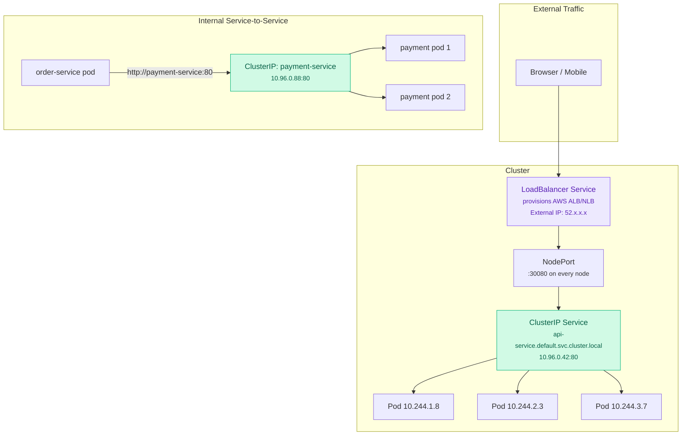
```mermaid
flowchart TB
    subgraph EXTERNAL["External Traffic"]
        CLIENT["Browser / Mobile"]
    end

    subgraph CLUSTER["Cluster"]
        LB["LoadBalancer Service<br/><small>provisions AWS ALB/NLB</small><br/><small>External IP: 52.x.x.x</small>"]
        NP["NodePort<br/><small>:30080 on every node</small>"]
        CIP["ClusterIP Service<br/><small>api-service.default.svc.cluster.local</small><br/><small>10.96.0.42:80</small>"]

        CIP --> P1["Pod 10.244.1.8"]
        CIP --> P2["Pod 10.244.2.3"]
        CIP --> P3["Pod 10.244.3.7"]
    end

    subgraph INTERNAL["Internal Service-to-Service"]
        APP["order-service pod"]
        CIP2["ClusterIP: payment-service<br/><small>10.96.0.88:80</small>"]
        PAY1["payment pod 1"]
        PAY2["payment pod 2"]
    end

    CLIENT --> LB --> NP --> CIP
    APP -->|"http://payment-service:80"| CIP2
    CIP2 --> PAY1 & PAY2

    style LB fill:#EDE9FE,stroke:#8B5CF6,color:#5B21B6
    style CIP fill:#D1FAE5,stroke:#10B981,color:#065F46
    style CIP2 fill:#D1FAE5,stroke:#10B981,color:#065F46
```

**Service types — know when to use each:**

| Type | Scope | How it works | When to use |
|------|-------|-------------|-------------|
| **ClusterIP** | Internal only | Virtual IP + DNS inside cluster | Service-to-service (90% of cases) |
| **NodePort** | External via node | Opens port 30000-32767 on every node | On-prem, no cloud LB available |
| **LoadBalancer** | External via cloud LB | Provisions ALB/NLB/GCP LB automatically | Production external traffic |
| **ExternalName** | DNS alias | CNAME to external service | Migration: gradually move traffic to K8s |
| **Headless** | Direct pod access | `clusterIP: None` — DNS returns pod IPs | StatefulSets (address specific pods) |

<div class="vtn-callout">
  <strong>DNS in K8s:</strong> Every service gets <code>&lt;service&gt;.&lt;namespace&gt;.svc.cluster.local</code>. Same namespace? Just use the service name: <code>postgres</code>, <code>redis</code>, <code>api-service</code>. Headless services: each pod gets <code>&lt;pod-name&gt;.&lt;service&gt;.&lt;namespace&gt;.svc.cluster.local</code>.
</div>

---

### Ingress — Production HTTP Routing

<div class="vtn-story-box vtn-animate-fade-up">
  <h4>The Cost Problem</h4>
  <p>You have 20 microservices that need external access. 20 LoadBalancer Services = 20 cloud load balancers = $$$. Plus you want: path-based routing, host-based routing, TLS termination, rate limiting, all on one domain.</p>
  <p><strong>Ingress</strong> = one load balancer + smart L7 routing rules. An Ingress Controller (nginx, traefik, Istio) watches Ingress objects and configures itself accordingly.</p>
</div>

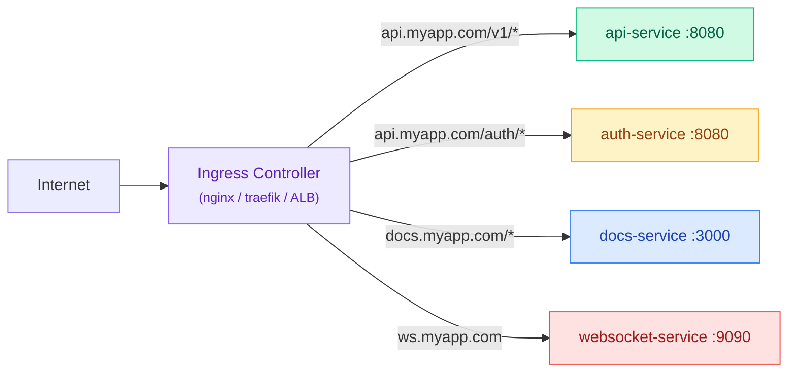
```mermaid
flowchart LR
    INTERNET["Internet"] --> IC["Ingress Controller<br/><small>(nginx / traefik / ALB)</small>"]
    IC -->|"api.myapp.com/v1/*"| API["api-service :8080"]
    IC -->|"api.myapp.com/auth/*"| AUTH["auth-service :8080"]
    IC -->|"docs.myapp.com/*"| DOCS["docs-service :3000"]
    IC -->|"ws.myapp.com"| WS["websocket-service :9090"]

    style IC fill:#EDE9FE,stroke:#8B5CF6,color:#5B21B6
    style API fill:#D1FAE5,stroke:#10B981,color:#065F46
    style AUTH fill:#FEF3C7,stroke:#F59E0B,color:#92400E
    style DOCS fill:#DBEAFE,stroke:#3B82F6,color:#1E40AF
    style WS fill:#FEE2E2,stroke:#EF4444,color:#991B1B
```

??? example "Ingress with TLS and path-based routing"
    ```yaml
    apiVersion: networking.k8s.io/v1
    kind: Ingress
    metadata:
      name: app-ingress
      annotations:
        cert-manager.io/cluster-issuer: letsencrypt-prod
        nginx.ingress.kubernetes.io/rate-limit: "100"
    spec:
      ingressClassName: nginx
      tls:
        - hosts: [api.myapp.com]
          secretName: api-tls-cert
      rules:
        - host: api.myapp.com
          http:
            paths:
              - path: /v1
                pathType: Prefix
                backend:
                  service: { name: api-service, port: { number: 80 } }
              - path: /auth
                pathType: Prefix
                backend:
                  service: { name: auth-service, port: { number: 80 } }
    ```

---

### HPA — Automatic Scaling

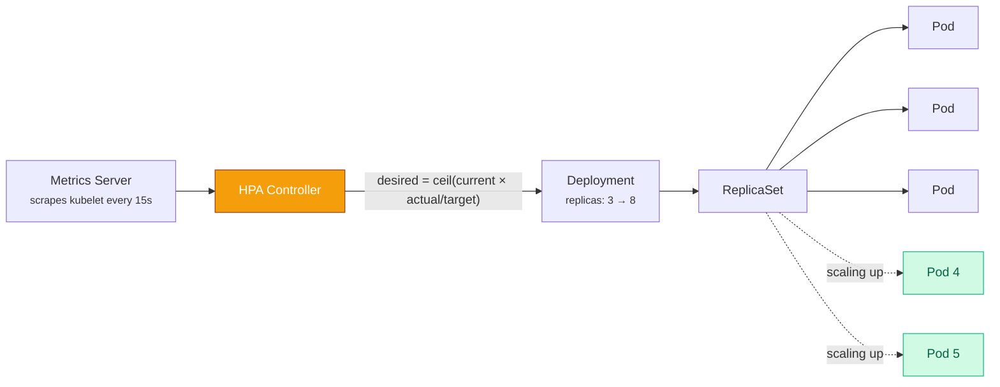
```mermaid
flowchart LR
    MS["Metrics Server<br/><small>scrapes kubelet every 15s</small>"] --> HPA["HPA Controller"]
    HPA -->|"desired = ceil(current × actual/target)"| DEP["Deployment<br/><small>replicas: 3 → 8</small>"]
    DEP --> RS["ReplicaSet"]
    RS --> P1["Pod"] & P2["Pod"] & P3["Pod"]
    RS -.->|"scaling up"| P4["Pod 4"] & P5["Pod 5"]

    style HPA fill:#F59E0B,stroke:#92400E,color:#fff
    style P4 fill:#D1FAE5,stroke:#10B981,color:#065F46
    style P5 fill:#D1FAE5,stroke:#10B981,color:#065F46
```

**How HPA calculates replicas:**

```
desiredReplicas = ceil( currentReplicas × (currentMetricValue / targetMetricValue) )
```

Example: 3 replicas at 90% CPU, target is 60% → `ceil(3 × 90/60)` = `ceil(4.5)` = **5 replicas**

**Scaling behaviors:**

- **Scale up**: Fast (30s stabilization window). React quickly to load spikes.
- **Scale down**: Slow (5 min stabilization). Avoid thrashing on bursty traffic.

| Autoscaler | What it scales | Best for |
|-----------|---------------|----------|
| **HPA** | Pod replicas (horizontal) | Stateless services under load |
| **VPA** | Pod resources (vertical) | Right-sizing, batch jobs |
| **Cluster Autoscaler** | Nodes | When pods can't be scheduled |
| **KEDA** | Pods (event-driven) | Kafka lag, SQS depth, cron-based |

---

## 4. Advanced Workloads — StatefulSets, DaemonSets, Jobs

### StatefulSets — When Identity Matters

<div class="vtn-comparison-box">
  <div class="vtn-compare-side vtn-compare-side--good">
    <h4>Deployment (stateless)</h4>
    <p>Pods are interchangeable cattle. Random names (<code>api-7d8f6-x4k2p</code>). Share storage. Scale freely. Kill any pod — who cares? Web servers, APIs, workers.</p>
  </div>
  <div class="vtn-compare-side vtn-compare-side--bad">
    <h4>StatefulSet (stateful)</h4>
    <p>Pods are named pets. Stable ordinal names (<code>postgres-0</code>, <code>postgres-1</code>). Each gets its OWN persistent disk. Start in order, stop in reverse. Databases, Kafka, ZooKeeper, Elasticsearch.</p>
  </div>
</div>

**StatefulSet guarantees:**

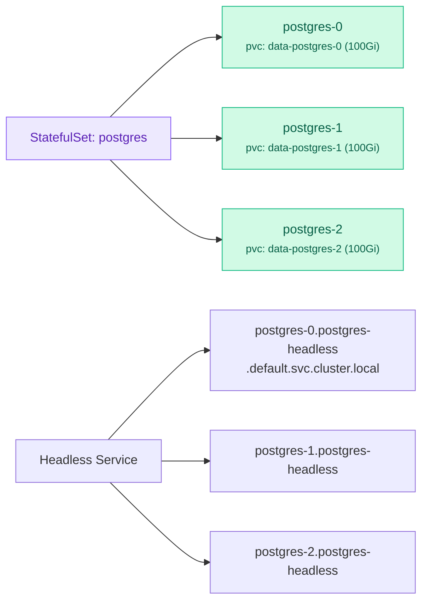
```mermaid
flowchart LR
    SS["StatefulSet: postgres"] --> P0["postgres-0<br/><small>pvc: data-postgres-0 (100Gi)</small>"]
    SS --> P1["postgres-1<br/><small>pvc: data-postgres-1 (100Gi)</small>"]
    SS --> P2["postgres-2<br/><small>pvc: data-postgres-2 (100Gi)</small>"]
    HS["Headless Service"] --> DNS0["postgres-0.postgres-headless<br/>.default.svc.cluster.local"]
    HS --> DNS1["postgres-1.postgres-headless"]
    HS --> DNS2["postgres-2.postgres-headless"]

    style SS fill:#EDE9FE,stroke:#8B5CF6,color:#5B21B6
    style P0 fill:#D1FAE5,stroke:#10B981,color:#065F46
    style P1 fill:#D1FAE5,stroke:#10B981,color:#065F46
    style P2 fill:#D1FAE5,stroke:#10B981,color:#065F46
```

- Created in order: 0 → 1 → 2 (each must be Ready before next starts)
- Terminated in reverse: 2 → 1 → 0
- Each pod's PVC persists even if the pod is deleted and rescheduled to another node
- Headless service gives each pod its own DNS name

### DaemonSets — One Pod Per Node

Need something running on EVERY node? Monitoring agent, log collector, network plugin, storage daemon.

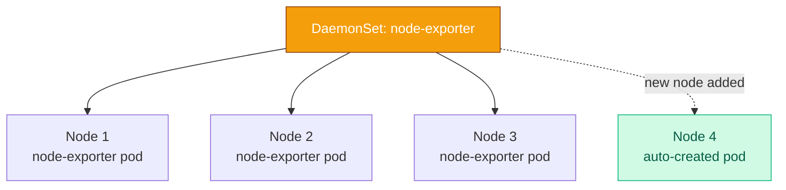
```mermaid
flowchart TB
    DS["DaemonSet: node-exporter"]
    DS --> N1["Node 1<br/>node-exporter pod"]
    DS --> N2["Node 2<br/>node-exporter pod"]
    DS --> N3["Node 3<br/>node-exporter pod"]
    DS -.->|"new node added"| N4["Node 4<br/>auto-created pod"]

    style DS fill:#F59E0B,stroke:#92400E,color:#fff
    style N4 fill:#D1FAE5,stroke:#10B981,color:#065F46
```

**Common DaemonSets in production:** Prometheus Node Exporter, Fluentd/Filebeat, Datadog Agent, Calico/Cilium (CNI), CSI node driver

### Jobs & CronJobs

| Type | Behavior | Example |
|------|----------|---------|
| **Job** | Run to completion, retry on failure, never restart after success | DB migration, data export, ML training |
| **CronJob** | Scheduled Job creation | Nightly backup (`0 2 * * *`), hourly report generation |

---

## 5. Networking — Pod-to-Pod, Services, Network Policies

### The K8s Networking Model (Three Rules)

1. **Every pod gets its own IP** (no port conflicts between pods)
2. **All pods can reach all other pods without NAT** (flat network — any pod on any node talks to any other pod on any other node)
3. **Agents on a node can reach all pods on that node**

This flat network is implemented by **CNI plugins**: Calico (BGP), Cilium (eBPF), Flannel (VXLAN), AWS VPC CNI.

### How Pod-to-Pod Works (Cross-Node)

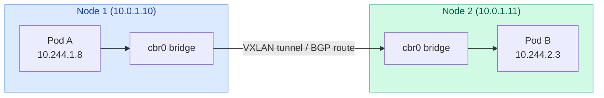
```mermaid
flowchart LR
    subgraph NODE1["Node 1 (10.0.1.10)"]
        PA["Pod A<br/>10.244.1.8"]
        CB1["cbr0 bridge"]
    end

    subgraph NODE2["Node 2 (10.0.1.11)"]
        PB["Pod B<br/>10.244.2.3"]
        CB2["cbr0 bridge"]
    end

    PA --> CB1 -->|"VXLAN tunnel / BGP route"| CB2 --> PB

    style NODE1 fill:#DBEAFE,stroke:#3B82F6,color:#1E40AF
    style NODE2 fill:#D1FAE5,stroke:#10B981,color:#065F46
```

### Network Policies — Pod-Level Firewall

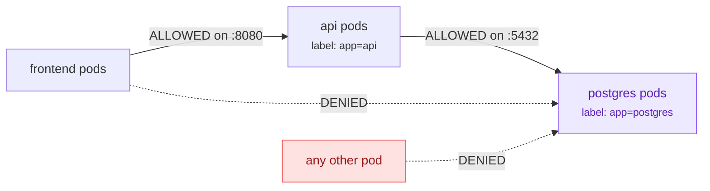
```mermaid
graph LR
    API["api pods<br/><small>label: app=api</small>"] -->|"ALLOWED on :5432"| DB["postgres pods<br/><small>label: app=postgres</small>"]
    FE["frontend pods"] -->|"ALLOWED on :8080"| API
    FE -.->|"DENIED"| DB
    OTHER["any other pod"] -.->|"DENIED"| DB

    style DB fill:#EDE9FE,stroke:#8B5CF6,color:#5B21B6
    style OTHER fill:#FEE2E2,stroke:#EF4444,color:#991B1B
```

!!! danger "Default = No Restrictions"
    Without NetworkPolicies, every pod can talk to every other pod. In production, always apply default-deny then explicitly allow needed traffic. This is defense-in-depth.

---

## 6. Storage & Persistence

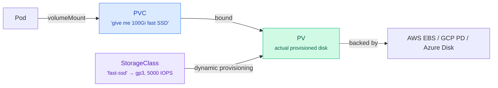
```mermaid
flowchart LR
    POD["Pod"] -->|"volumeMount"| PVC["PVC<br/><small>'give me 100Gi fast SSD'</small>"]
    PVC -->|"bound"| PV["PV<br/><small>actual provisioned disk</small>"]
    SC["StorageClass<br/><small>'fast-ssd' → gp3, 5000 IOPS</small>"] -->|"dynamic provisioning"| PV
    PV -->|"backed by"| DISK["AWS EBS / GCP PD / Azure Disk"]

    style PVC fill:#DBEAFE,stroke:#3B82F6,color:#1E40AF
    style PV fill:#D1FAE5,stroke:#10B981,color:#065F46
    style SC fill:#EDE9FE,stroke:#8B5CF6,color:#5B21B6
```

**Access modes** (determines how many nodes can mount):

| Mode | Meaning | Storage types |
|------|---------|---------------|
| **RWO** (ReadWriteOnce) | Single node read/write | EBS, GCP PD, Azure Disk (block storage) |
| **ROX** (ReadOnlyMany) | Many nodes read-only | NFS, object store mounts |
| **RWX** (ReadWriteMany) | Many nodes read/write | EFS, CephFS, NFS, GlusterFS |

---

## 7. Security — RBAC, Secrets, Pod Security

### RBAC — Who Can Do What

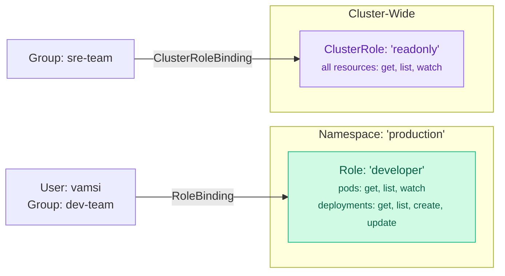
```mermaid
flowchart LR
    subgraph SCOPE["Namespace: 'production'"]
        ROLE["Role: 'developer'<br/><small>pods: get, list, watch<br/>deployments: get, list, create, update</small>"]
    end

    USER["User: vamsi<br/>Group: dev-team"] -->|"RoleBinding"| ROLE

    subgraph GLOBAL["Cluster-Wide"]
        CR["ClusterRole: 'readonly'<br/><small>all resources: get, list, watch</small>"]
    end

    SRE["Group: sre-team"] -->|"ClusterRoleBinding"| CR

    style ROLE fill:#D1FAE5,stroke:#10B981,color:#065F46
    style CR fill:#EDE9FE,stroke:#8B5CF6,color:#5B21B6
```

**Best practices:**

- Principle of least privilege — start with nothing, grant only what's needed
- Namespace-scoped Roles whenever possible (not ClusterRoles)
- Use Groups, not individual Users
- Audit: `kubectl auth can-i --list --as=vamsi -n production`

### Secrets — The Reality

K8s Secrets are **base64-encoded, NOT encrypted**. Anyone with `kubectl get secret` can decode them.

**Production secret management:**

| Level | Approach | Security |
|-------|----------|----------|
| Basic | K8s Secret with RBAC | Low (base64 in etcd) |
| Better | etcd encryption at rest | Medium (encrypted in storage) |
| Good | External Secrets Operator + Vault | High (secrets never stored in K8s) |
| Best | Workload Identity + cloud KMS | Highest (no secrets in cluster at all) |

---

## 8. Helm — Templating & Package Management

<div class="vtn-callout">
  Helm is to Kubernetes what <code>apt</code>/<code>brew</code> is to Linux/macOS. Instead of writing 15 YAML files for Prometheus + Grafana + AlertManager, you <code>helm install</code> a pre-built chart and override values.
</div>

```bash
# Install a complex application in one command
helm repo add prometheus-community https://prometheus-community.github.io/helm-charts
helm install monitoring prometheus-community/kube-prometheus-stack \
  --namespace monitoring --create-namespace \
  --set grafana.adminPassword=secret \
  --set prometheus.retention=30d

# Upgrade with new values
helm upgrade monitoring prometheus-community/kube-prometheus-stack \
  -f values-prod.yaml --atomic --wait

# Rollback if something breaks
helm rollback monitoring 1
```

**CI/CD pattern:** `helm upgrade --install --atomic --wait` — idempotent (install or upgrade), auto-rollback on failure, block until healthy.

---

## 9. Production Operations Playbook

<div class="vtn-timeline">
  <div class="vtn-timeline-item">
    <h4>Resource Requests & Limits on every container</h4>
    <p><strong>Requests</strong> = guaranteed minimum (scheduler uses this for placement). <strong>Limits</strong> = hard cap (OOM killed if exceeded). Without requests, the scheduler can overpack nodes. Without limits, one pod can starve others.</p>
  </div>
  <div class="vtn-timeline-item">
    <h4>Pod Disruption Budgets (PDB)</h4>
    <p>During node drain (maintenance, cluster upgrade), K8s evicts pods. PDB says "you must keep at least 2 running" — prevents accidental service outage during voluntary disruptions.</p>
  </div>
  <div class="vtn-timeline-item">
    <h4>Topology Spread / Anti-Affinity</h4>
    <p>Don't put all 3 replicas on the same node — one node failure takes your service down. Spread across nodes and availability zones.</p>
  </div>
  <div class="vtn-timeline-item">
    <h4>HPA + Cluster Autoscaler</h4>
    <p>HPA scales pods. But what if nodes are full? Cluster Autoscaler watches for unschedulable pods and provisions new nodes from your cloud provider (2-5 min). Together: handles any traffic spike.</p>
  </div>
  <div class="vtn-timeline-item">
    <h4>GitOps (ArgoCD / Flux)</h4>
    <p>Don't <code>kubectl apply</code> from laptops. Cluster state lives in git. PR to deploy. ArgoCD syncs continuously. Drift detection. Audit trail. Automatic rollback on git revert.</p>
  </div>
  <div class="vtn-timeline-item">
    <h4>Monitoring Stack</h4>
    <p>Prometheus (metrics) + Grafana (dashboards) + AlertManager (alerts) + Loki (logs). USE method for infra: Utilization, Saturation, Errors. RED method for services: Rate, Errors, Duration.</p>
  </div>
</div>

---

## 10. Debugging Production Issues

<div class="vtn-timeline">
  <div class="vtn-timeline-item">
    <h4>Pod stuck in Pending</h4>
    <p><code>kubectl describe pod</code> → check Events. Usually: insufficient resources (no node has enough CPU/memory), unmatched node selector/affinity, or PVC can't bind. Fix: scale down other workloads, add nodes, or fix the selector.</p>
  </div>
  <div class="vtn-timeline-item">
    <h4>Pod in CrashLoopBackOff</h4>
    <p>Container starts, crashes, restarts with exponential backoff. <code>kubectl logs &lt;pod&gt; --previous</code> shows the crash output. Common causes: missing config/secret, wrong command, failed health check, OOM (exit 137).</p>
  </div>
  <div class="vtn-timeline-item">
    <h4>Pod Running but not receiving traffic</h4>
    <p>Readiness probe failing → pod removed from Service endpoints. Check: <code>kubectl get endpoints &lt;service&gt;</code>. If empty, verify label selector matches pod labels. Exec into pod and test the health endpoint.</p>
  </div>
  <div class="vtn-timeline-item">
    <h4>Service DNS not resolving</h4>
    <p>Check CoreDNS pods in kube-system: <code>kubectl get pods -n kube-system -l k8s-app=kube-dns</code>. Exec into a pod and test: <code>nslookup my-service.default.svc.cluster.local</code>. Check if NetworkPolicy blocks DNS (port 53).</p>
  </div>
  <div class="vtn-timeline-item">
    <h4>Node NotReady</h4>
    <p>kubelet stopped heartbeating. SSH into node, check: <code>systemctl status kubelet</code>, <code>journalctl -u kubelet</code>. Common causes: disk pressure, memory pressure, container runtime crashed, network partition from control plane.</p>
  </div>
</div>

---

## 11. Interview Q&A (FAANG-Level)

??? question "Walk through the complete lifecycle of a request from browser to a pod"
    1. Browser resolves DNS → cloud LB's public IP
    2. Cloud LB forwards to NodePort on a worker node
    3. iptables DNAT rule (programmed by kube-proxy) rewrites destination to a pod IP
    4. If pod is on another node: packet sent to that node via overlay network (VXLAN) or direct routing (Calico BGP)
    5. Packet arrives at target node → enters pod's network namespace via veth pair
    6. Pod's container process receives the request on its listening port
    7. Response takes the same path back (SNAT for external traffic)

??? question "How does K8s handle a node failure? Walk through the timeline."
    - **T+0**: Node crashes (hardware failure, network partition, OOM)
    - **T+10s**: kubelet stops sending heartbeats to API server
    - **T+40s**: Node controller marks node as `Unknown` (configurable: `--node-monitor-grace-period`)
    - **T+5m**: Node controller begins pod eviction (configurable: `--pod-eviction-timeout`)
    - **T+5m+5s**: Pods on dead node get status `Terminating`. ReplicaSet controller creates replacement pods
    - **T+5m+10s**: Scheduler places new pods on healthy nodes. kubelet starts containers
    - **T+5m+30s**: New pods pass readiness probes → added to Service endpoints. Traffic restored.
    
    **For faster recovery:** Use pod-level `terminationGracePeriodSeconds: 30` and configure shorter node-monitor timeouts (but beware of false positives during network blips).

??? question "Explain how kube-proxy works in iptables mode vs IPVS mode"
    **iptables mode** (default): Creates one iptables rule per service endpoint. For a service with 3 pods, creates a chain with probability-based rules (1/3, 1/2, 1/1). O(n) rule evaluation — becomes slow at 10,000+ services.
    
    **IPVS mode**: Uses kernel IPVS (IP Virtual Server) for load balancing. O(1) lookup using hash tables. Supports multiple LB algorithms (round-robin, least-connections, source-hash). Much better for large clusters (5,000+ services). Enable with `--proxy-mode=ipvs` on kube-proxy.

??? question "What are taints and tolerations? Give a real-world example."
    **Taints** on nodes repel pods. **Tolerations** on pods allow them to schedule onto tainted nodes.
    
    Real-world: You have GPU nodes (expensive). Without taints, any pod could get scheduled there. Solution:
    - Taint GPU nodes: `kubectl taint nodes gpu-node-1 nvidia.com/gpu=present:NoSchedule`
    - Only ML pods tolerate it: `tolerations: [{key: "nvidia.com/gpu", operator: "Exists", effect: "NoSchedule"}]`
    
    Other uses: Dedicate nodes per team, keep workloads off control-plane nodes, drain nodes for maintenance (`NoExecute` effect evicts running pods).

??? question "Design a production K8s architecture for a multi-region e-commerce platform"
    ```
    Global: Route53 / Cloud DNS (latency-based routing per region)
    
    Per Region:
    ├── EKS/GKE cluster (3 AZs, managed control plane)
    ├── Node pools: general (m5.xlarge), memory-optimized (r5.2xlarge), GPU (p3.2xlarge)
    ├── Ingress: AWS ALB Ingress Controller + WAF + cert-manager
    ├── Service mesh: Istio (mTLS, observability, traffic management)
    ├── Stateless services: Deployments + HPA + PDB
    ├── Stateful: AWS RDS (outside K8s) / ElastiCache (outside K8s)
    ├── Async: Kafka on dedicated StatefulSet nodes OR MSK
    ├── Secrets: External Secrets Operator + AWS Secrets Manager
    ├── Observability: Prometheus + Grafana + Loki + Jaeger
    ├── GitOps: ArgoCD (app-of-apps pattern)
    └── Policy: OPA Gatekeeper (enforce labels, resource limits, image sources)
    ```
    
    Key decisions: Databases OUTSIDE K8s (managed services). Stateless in K8s (easy to scale/deploy). Service mesh for zero-trust networking. Multi-AZ for HA, multi-region for DR.

??? question "Explain the K8s scheduler's algorithm in detail"
    1. **Filtering** (predicate functions): Eliminate nodes that can't run the pod
        - Insufficient resources (CPU/memory requests > available)
        - Node selector / affinity doesn't match
        - Taints without matching tolerations
        - Pod topology spread constraints violated
    2. **Scoring** (priority functions): Rank remaining nodes 0-100
        - `LeastRequestedPriority` — prefer nodes with more free resources
        - `BalancedResourceAllocation` — balance CPU/memory usage ratio
        - `InterPodAffinityPriority` — honor pod affinity/anti-affinity weights
        - `NodeAffinityPriority` — prefer nodes matching preferred affinity
    3. **Binding**: Highest score wins. Update pod's `nodeName` in etcd.
    
    If multiple nodes tie, scheduler picks randomly. If NO node passes filtering, pod stays `Pending`.

??? question "How would you implement canary deployments in K8s?"
    **Option 1: Native (basic)**
    - Two Deployments: `api-stable` (90% replicas) and `api-canary` (10% replicas)
    - Same Service selector matches both → ~10% traffic to canary
    - Manual: watch metrics, scale canary up if healthy
    
    **Option 2: Istio/Linkerd (production)**
    - VirtualService with traffic splitting: 95% → stable, 5% → canary
    - Automated: Flagger watches error rate/latency, gradually shifts traffic
    - If canary degrades → automatic rollback
    
    **Option 3: Argo Rollouts**
    - Custom Rollout resource with `canary` strategy
    - Step-based: 10% → wait 5min → 30% → wait 5min → 100%
    - Integrates with Prometheus for automated analysis
