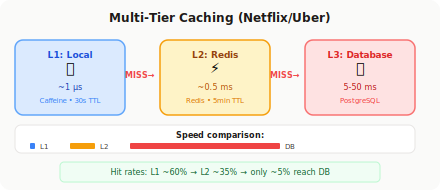
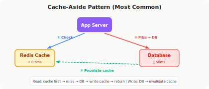
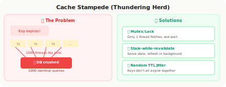

# Distributed Caching

!!! danger "Real Incident: Instagram, 2018"
    One Memcached node dies. 50M requests/sec that were served from cache slam into PostgreSQL. DB CPU hits 100% in 3 seconds. Connection pools exhaust in 5. **1 billion users see errors.** Fix: single cache node restart. Downtime: 4 minutes. Cost: ~$150K. That cache node? $0.12/hour.

---

## The 30-Second Explanation

**Cache = a fast storage layer (memory) that sits between your application and the slow storage layer (database).**

⚡

<h4 style="margin: 0 0 0.5rem; color: #059669; font-size: 0.95rem;">Speed</h4>

Redis: 0.1ms. Database: 5-50ms. 50-500x faster.

💰

<h4 style="margin: 0 0 0.5rem; color: #2563eb; font-size: 0.95rem;">Cost</h4>

$0.12/hr cache vs. $10K/hr DB scale-up

🛡️

<h4 style="margin: 0 0 0.5rem; color: #92400e; font-size: 0.95rem;">Protection</h4>

Cache absorbs traffic spikes DB can't handle

> **The key insight:** A cache isn't just for speed — it's a **shield** protecting your database from traffic it was never designed to handle.

---

## Caching Strategies

### Read Strategies

| Strategy | How | Best For |
|---|---|---|
| **Cache-Aside (Lazy)** | App checks cache → miss → reads DB → writes to cache | Most common. Simple. App controls. |
| **Read-Through** | Cache itself fetches from DB on miss | Cleaner app code. Cache handles logic. |

### Write Strategies

| Strategy | How | Trade-off |
|---|---|---|
| **Write-Through** | Write to cache AND DB synchronously | Strong consistency, higher write latency |
| **Write-Behind (Write-Back)** | Write to cache, async flush to DB | Fast writes, risk of data loss on crash |
| **Write-Around** | Write directly to DB, skip cache | Avoids cache pollution for rarely-read data |

### The Most Common Pattern (FAANG Default)

**Cache-Aside + Write-Around** — Read from cache (populate on miss), write directly to DB, invalidate cache on write.

!!! tip "Interview Gold"
    "I'd use cache-aside with write-around. On read miss, fetch from DB and populate cache with a TTL. On write, update DB and invalidate the cache entry. This avoids stale data AND cache pollution from write-heavy keys that nobody reads."

---

## Cache Invalidation — The Hardest Problem

> "There are only two hard things in computer science: cache invalidation and naming things." — Phil Karlton

| Strategy | How | When |
|---|---|---|
| **TTL-based** | Entry expires after N seconds | Default. Works for most use cases. |
| **Event-based** | DB write triggers cache delete | Strong consistency needs |
| **Version-based** | Key includes version number | When you need atomic updates |

**The Facebook approach:** On write, DELETE the cache key (don't update it). Next read will miss and repopulate from DB. This avoids race conditions between concurrent writes.

---

## Cache Failure Patterns

| Pattern | What Happens | Solution |
|---|---|---|
| **Cache Stampede** | Popular key expires → 1000 threads all hit DB simultaneously | Lock (only one thread fetches), stale-while-revalidate |
| **Cache Penetration** | Requests for keys that DON'T EXIST → always miss, always hit DB | Bloom filter, cache null results with short TTL |
| **Cache Avalanche** | Many keys expire at same time → massive DB load spike | Randomize TTLs, stagger expiration |
| **Hot Key** | One key gets millions of reads → single cache node overwhelmed | Replicate hot keys across multiple nodes, local cache |

---

## Local Cache vs. Distributed Cache

| Aspect | Local (in-process) | Distributed (Redis/Memcached) |
|---|---|---|
| **Latency** | ~1μs (memory access) | ~0.1-1ms (network hop) |
| **Shared across servers** | No (each server has own copy) | Yes |
| **Consistency** | Hard (invalidation across processes) | Easier (single source) |
| **Size** | Limited by server RAM | Can scale independently |
| **Best for** | Config, hot reference data | Session, user data, query results |

**Multi-tier approach (Netflix, Uber):** L1 = local cache (Caffeine/Guava, 30s TTL) → L2 = distributed cache (Redis, 5min TTL) → L3 = database.

---

## Eviction Policies

| Policy | How | Best For |
|---|---|---|
| **LRU** | Remove least recently used | General purpose (most common) |
| **LFU** | Remove least frequently used | Stable hot set (trending content) |
| **TTL** | Remove expired entries | Time-sensitive data |
| **Random** | Remove random entry | Surprisingly effective, zero overhead |
| **FIFO** | Remove oldest entry | Simple, when access pattern is flat |

---

## Real Systems

<table style="width: 100%; border-collapse: collapse;">
<thead>
<tr style="background: linear-gradient(135deg, #f8fafc, #f1f5f9);">
<th style="padding: 0.8rem; border-bottom: 2px solid #e2e8f0; text-align: left;">Company</th>
<th style="padding: 0.8rem; border-bottom: 2px solid #e2e8f0; text-align: left;">Stack</th>
<th style="padding: 0.8rem; border-bottom: 2px solid #e2e8f0; text-align: left;">Notable</th>
</tr>
</thead>
<tbody>
<tr><td style="padding: 0.7rem; border-bottom: 1px solid #f1f5f9;"><strong>Facebook</strong></td><td style="padding: 0.7rem; border-bottom: 1px solid #f1f5f9;">Memcached (TAO)</td><td style="padding: 0.7rem; border-bottom: 1px solid #f1f5f9;">Billions of queries/sec. Lease-based invalidation.</td></tr>
<tr><td style="padding: 0.7rem; border-bottom: 1px solid #f1f5f9;"><strong>Twitter</strong></td><td style="padding: 0.7rem; border-bottom: 1px solid #f1f5f9;">Redis + Memcached</td><td style="padding: 0.7rem; border-bottom: 1px solid #f1f5f9;">Timeline cache. Pre-computed feeds.</td></tr>
<tr><td style="padding: 0.7rem; border-bottom: 1px solid #f1f5f9;"><strong>Netflix</strong></td><td style="padding: 0.7rem; border-bottom: 1px solid #f1f5f9;">EVCache (Memcached)</td><td style="padding: 0.7rem; border-bottom: 1px solid #f1f5f9;">Multi-region replication. 30M ops/sec.</td></tr>
<tr><td style="padding: 0.7rem; border-bottom: 1px solid #f1f5f9;"><strong>Uber</strong></td><td style="padding: 0.7rem; border-bottom: 1px solid #f1f5f9;">Redis + Docstore cache</td><td style="padding: 0.7rem; border-bottom: 1px solid #f1f5f9;">Geospatial caching for nearby drivers.</td></tr>
<tr><td style="padding: 0.7rem;"><strong>Amazon</strong></td><td style="padding: 0.7rem;">ElastiCache (Redis/Memcached)</td><td style="padding: 0.7rem;">Session store, product catalog cache.</td></tr>
</tbody>
</table>

---

## Redis vs. Memcached

| Aspect | Redis | Memcached |
|---|---|---|
| Data structures | Strings, Lists, Sets, Hashes, Sorted Sets | Strings only |
| Persistence | Optional (RDB/AOF) | None (pure cache) |
| Clustering | Built-in (Redis Cluster) | Client-side sharding |
| Memory efficiency | Higher overhead per key | More memory-efficient |
| Use when | Need data structures, persistence, pub/sub | Pure key-value cache at massive scale |

---

## The 3 Mistakes That Get You Rejected

!!! danger "Don't Say These"
    1. **"Cache everything"** — Caching write-heavy, rarely-read data wastes memory and adds consistency complexity. Cache what's read-heavy.
    2. **"Just set TTL to 24 hours"** — Long TTLs mean stale data. Short TTLs mean more DB hits. The right TTL depends on data's change frequency and staleness tolerance.
    3. **"The cache can never go down"** — It will. Discuss graceful degradation: circuit breaker to DB, connection pooling, backpressure.

---

## Interview Answer Template

> "For [system], I'd use [Redis/Memcached] as a distributed cache with [cache-aside/read-through] strategy. Write path: [write-through/write-around] with cache invalidation on write. TTL: [N]s based on [data staleness tolerance]. For cache stampede protection, I'd use [mutex/stale-while-revalidate]. For hot keys, I'd [replicate/local cache]."

---

## Quick Recall Card

| Question | Answer |
|---|---|
| Most common pattern? | Cache-aside + write-around + TTL |
| Cache stampede? | Popular key expires → thundering herd. Fix: lock or stale-while-revalidate |
| Cache penetration? | Non-existent keys. Fix: bloom filter or cache nulls |
| Redis vs Memcached? | Redis = data structures + persistence. Memcached = simple, faster for strings |
| Best eviction? | LRU (general purpose) |
| Multi-tier? | L1 local (μs) → L2 distributed (ms) → L3 database |

---

## See Also

- [Redis](redis.md) — Data structures, persistence, and clustering
- [CAP Theorem](capTheorem.md) — Consistency vs availability trade-offs
- [Consistent Hashing](consistenthashing.md) — Distributing cache keys across nodes
- [Rate Limiting](ratelimiting.md) — Throttling with token bucket and sliding window
- [Spring Data Redis](springboot/spring-data-redis.md) — Redis integration in Spring Boot
