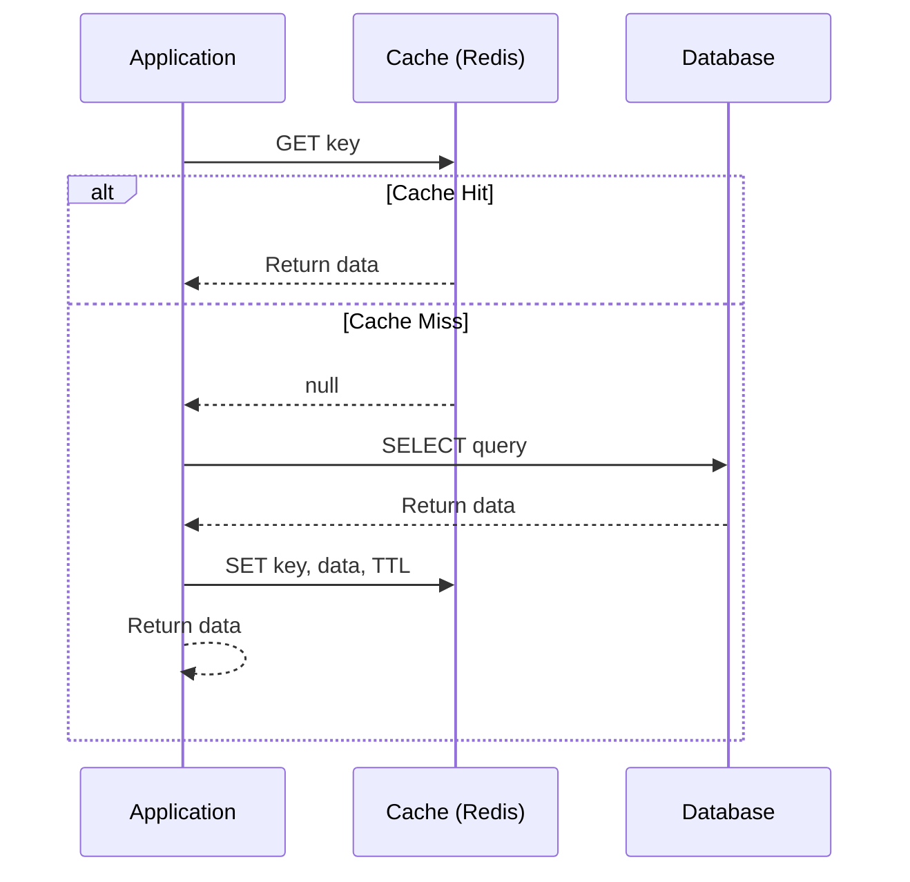
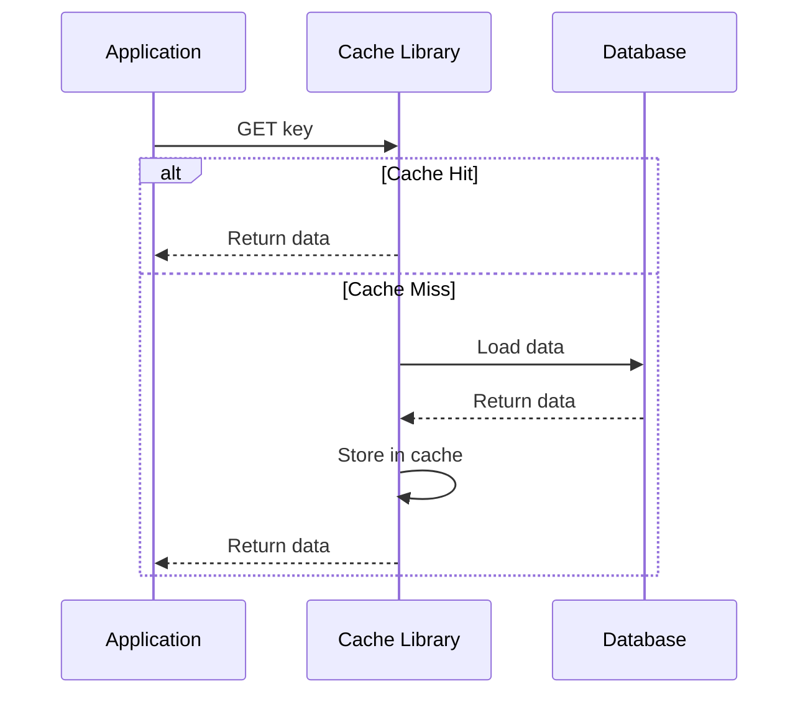
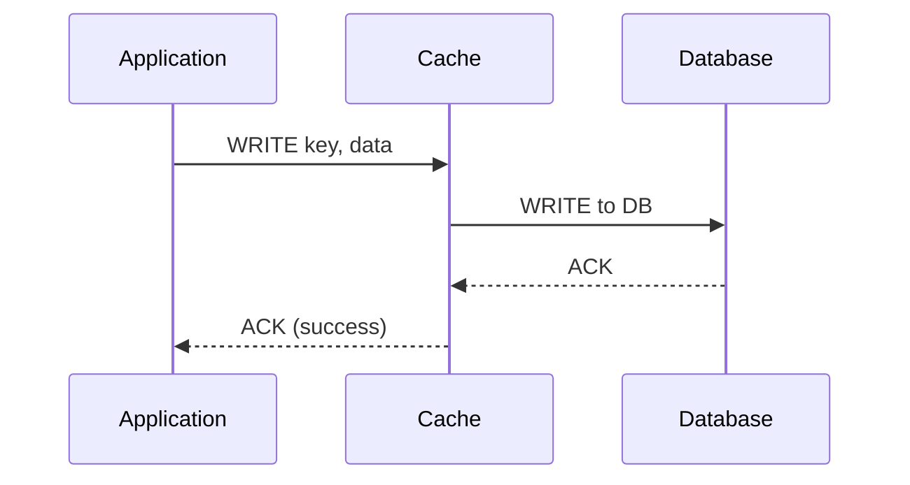
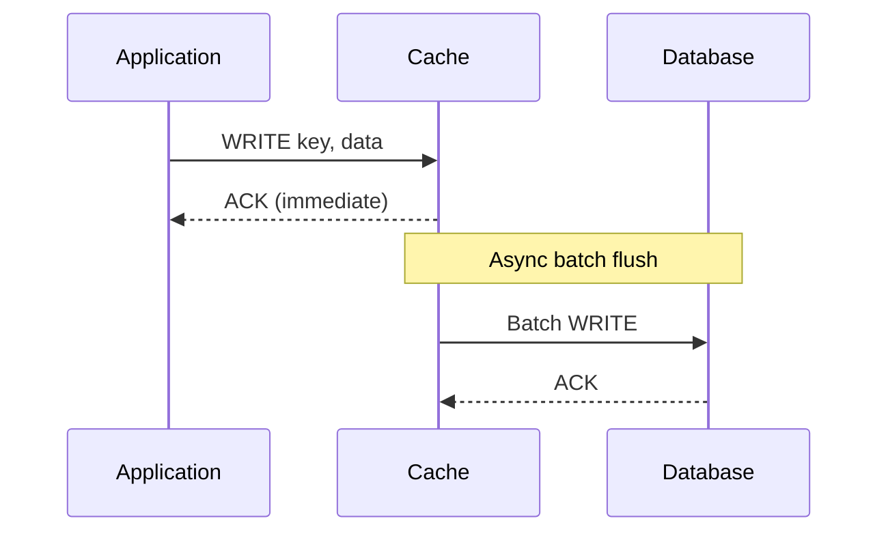
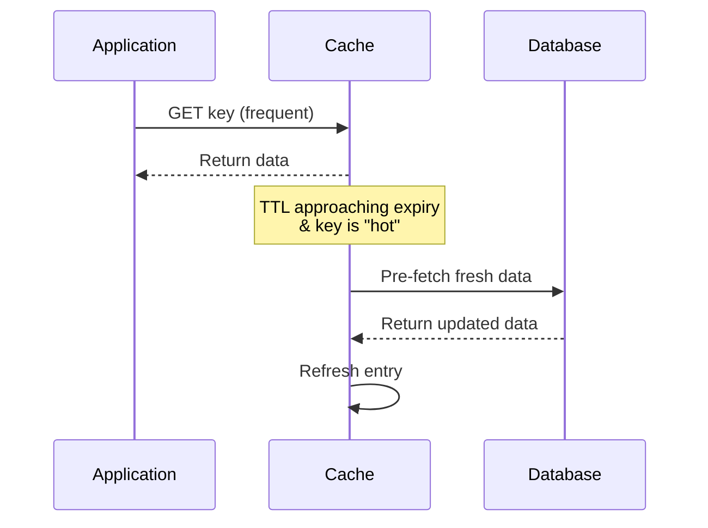
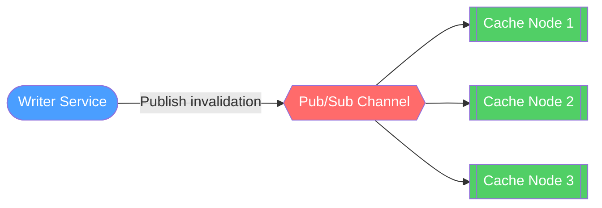
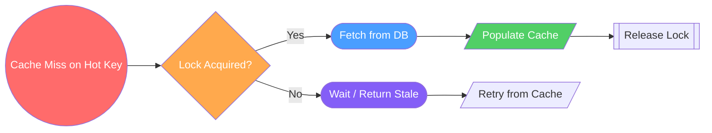
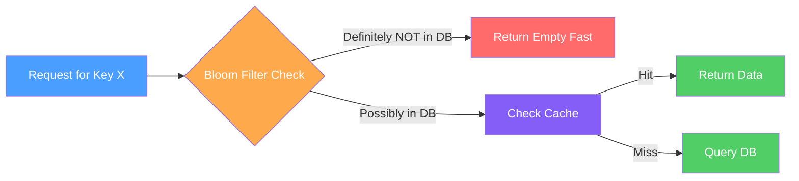
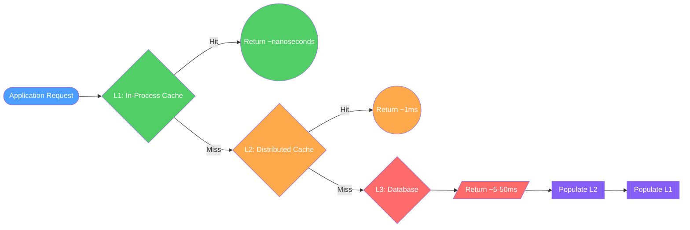
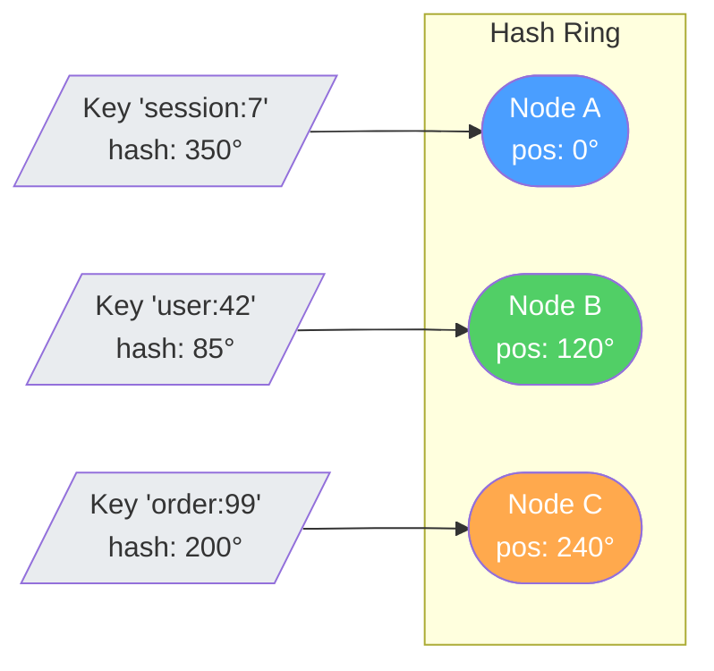

# Distributed Caching

!!! tip "Why This Matters in Interviews"
    Caching is one of the most frequently tested topics in system design interviews at FAANG companies. Nearly every large-scale system — from URL shorteners to social media feeds — requires a caching layer. Interviewers expect you to discuss cache placement, invalidation strategies, consistency trade-offs, and failure modes fluently.

---

## Why Caching?

Caching reduces latency by serving data from faster storage layers closer to the consumer. The performance difference between storage tiers is dramatic:

| Storage Medium | Latency (approx.) | Throughput |
|---|---|---|
| L1 CPU Cache | ~1 ns | Highest |
| L2 CPU Cache | ~4 ns | Very High |
| RAM (in-process) | ~100 ns | High |
| SSD (local) | ~150 us | Medium |
| Network round-trip (same DC) | ~500 us | Medium |
| HDD (spinning disk) | ~10 ms | Low |
| Cross-region network | ~50-150 ms | Low |

A cache hit served from RAM is **1000x faster** than reading from SSD and **100,000x faster** than a cross-region database call. This is why caching is foundational to any performant distributed system.

---

## Caching Strategies

### 1. Cache-Aside (Lazy Loading)

The application is responsible for reading from and writing to the cache. The cache does not interact with the database directly.

**Flow:**

- Application checks cache first
- On **cache hit**, return data directly
- On **cache miss**, read from DB, populate cache, then return


```mermaid
sequenceDiagram
    participant App as Application
    participant Cache as Cache (Redis)
    participant DB as Database

    App->>Cache: GET key
    alt Cache Hit
        Cache-->>App: Return data
    else Cache Miss
        Cache-->>App: null
        App->>DB: SELECT query
        DB-->>App: Return data
        App->>Cache: SET key, data, TTL
        App-->>App: Return data
    end
```

**Pros:** Only requested data is cached; cache failure does not break the system.
**Cons:** Cache miss penalty (three round-trips); data can become stale.

---

### 2. Read-Through

The cache sits between the application and the database. The cache itself is responsible for loading data from the DB on a miss.


```mermaid
sequenceDiagram
    participant App as Application
    participant Cache as Cache Library
    participant DB as Database

    App->>Cache: GET key
    alt Cache Hit
        Cache-->>App: Return data
    else Cache Miss
        Cache->>DB: Load data
        DB-->>Cache: Return data
        Cache->>Cache: Store in cache
        Cache-->>App: Return data
    end
```

**Pros:** Simplifies application code; consistent read path.
**Cons:** First request is always slow; cache library must understand data model.

---

### 3. Write-Through

Every write goes to the cache AND the database synchronously before returning success.


```mermaid
sequenceDiagram
    participant App as Application
    participant Cache as Cache
    participant DB as Database

    App->>Cache: WRITE key, data
    Cache->>DB: WRITE to DB
    DB-->>Cache: ACK
    Cache-->>App: ACK (success)
```

**Pros:** Cache is always consistent with DB; no stale reads.
**Cons:** Write latency is higher (two writes on every operation); unused data may fill cache.

---

### 4. Write-Behind (Write-Back)

The application writes to the cache immediately. The cache asynchronously flushes writes to the database in batches.


```mermaid
sequenceDiagram
    participant App as Application
    participant Cache as Cache
    participant DB as Database

    App->>Cache: WRITE key, data
    Cache-->>App: ACK (immediate)
    Note over Cache,DB: Async batch flush
    Cache->>DB: Batch WRITE
    DB-->>Cache: ACK
```

**Pros:** Extremely low write latency; batching reduces DB load.
**Cons:** Risk of data loss if cache node fails before flush; complex failure handling.

---

### 5. Refresh-Ahead

The cache proactively refreshes entries **before** they expire, based on access patterns.


```mermaid
sequenceDiagram
    participant App as Application
    participant Cache as Cache
    participant DB as Database

    App->>Cache: GET key (frequent)
    Cache-->>App: Return data
    Note over Cache: TTL approaching expiry<br/>& key is "hot"
    Cache->>DB: Pre-fetch fresh data
    DB-->>Cache: Return updated data
    Cache->>Cache: Refresh entry
```

**Pros:** Eliminates cache miss latency for hot keys; smooth user experience.
**Cons:** Wasted refreshes if prediction is wrong; added complexity.

---

## Cache Invalidation Approaches

> "There are only two hard things in Computer Science: cache invalidation and naming things." — Phil Karlton

### TTL-Based Expiration

Set a Time-To-Live on each cache entry. After expiry, the entry is removed or lazily evicted.

```python
# Redis example
redis.set("user:1001", json_data, ex=300)  # expires in 5 minutes
```

**Trade-off:** Simple but data can be stale up to TTL duration.

---

### Event-Driven Invalidation

When the source data changes, an event triggers cache deletion or update.


```mermaid
flowchart LR
    A[Database Write] -->|CDC Event| B[Message Broker]
    B --> C[Cache Invalidation Service]
    C --> D[DELETE from Cache]

    style A fill:#4a9eff,color:#fff
    style B fill:#ff6b6b,color:#fff
    style C fill:#ffa94d,color:#fff
    style D fill:#51cf66,color:#fff
```

**Pros:** Near real-time consistency; no polling.
**Cons:** Requires infrastructure (CDC, message bus); eventual consistency window.

---

### Versioned Keys

Append a version number to the cache key. When data changes, increment the version — old keys naturally become orphaned and expire.

```
cache_key = f"product:{product_id}:v{version}"
```

**Pros:** No explicit deletion needed; atomic version bump.
**Cons:** Old versions waste memory until TTL expires.

---

### Pub/Sub Invalidation

Cache nodes subscribe to invalidation channels. When data changes, a message is published to invalidate across all nodes.


```mermaid
flowchart LR
    A(["Writer Service"]) -->|Publish invalidation| B{{"Pub/Sub Channel"}}
    B --> C[["Cache Node 1"]]
    B --> D[["Cache Node 2"]]
    B --> E[["Cache Node 3"]]

    style A fill:#4a9eff,color:#fff
    style B fill:#ff6b6b,color:#fff
    style C fill:#51cf66,color:#fff
    style D fill:#51cf66,color:#fff
    style E fill:#51cf66,color:#fff
```

**Pros:** Broadcasts to all replicas; decoupled architecture.
**Cons:** At-most-once delivery risks missed invalidations; network partitions can cause inconsistency.

---

## Cache Consistency Problems and Solutions

### Cache Stampede (Thundering Herd)

**Problem:** When a popular cache entry expires, hundreds of concurrent requests simultaneously hit the database to rebuild the cache.

**Solutions:**

1. **Mutex/Distributed Lock** — Only one request fetches from DB; others wait.
2. **Probabilistic Early Expiration** — Each request has a small random chance to refresh the cache before TTL expires, spreading the load.


```mermaid
flowchart LR
    A(("Cache Miss on Hot Key")) --> B{"Lock Acquired?"}
    B -->|Yes| C(["Fetch from DB"])
    C --> D[/"Populate Cache"/]
    D --> E[["Release Lock"]]
    B -->|No| F(["Wait / Return Stale"])
    F --> G[/"Retry from Cache"/]

    style A fill:#ff6b6b,color:#fff
    style B fill:#ffa94d,color:#fff
    style C fill:#4a9eff,color:#fff
    style D fill:#51cf66,color:#fff
    style F fill:#845ef7,color:#fff
```

```python
# Probabilistic early expiration pseudocode
def get_with_early_refresh(key, ttl, beta=1.0):
    value, expiry = cache.get_with_ttl(key)
    remaining = expiry - now()
    # Random early refresh: probability increases as TTL decreases
    if remaining - beta * random.exponential() <= 0:
        value = db.fetch(key)
        cache.set(key, value, ttl)
    return value
```

---

### Stale Data

**Problem:** Cache holds outdated data while the source of truth has been updated.

**Strategies to Minimize:**

- Use short TTLs for frequently changing data
- Combine TTL with event-driven invalidation (belt-and-suspenders)
- Implement cache versioning tied to data modification timestamps
- Accept eventual consistency where business logic allows

---

### Cache Penetration

**Problem:** Repeated queries for data that does **not exist** in the DB bypass the cache every time, hammering the database.

**Solution: Bloom Filter**


```mermaid
flowchart LR
    A[Request for Key X] --> B{Bloom Filter Check}
    B -->|Definitely NOT in DB| C[Return Empty Fast]
    B -->|Possibly in DB| D[Check Cache]
    D -->|Hit| E[Return Data]
    D -->|Miss| F[Query DB]

    style A fill:#4a9eff,color:#fff
    style B fill:#ffa94d,color:#fff
    style C fill:#ff6b6b,color:#fff
    style D fill:#845ef7,color:#fff
    style E fill:#51cf66,color:#fff
    style F fill:#51cf66,color:#fff
```

Also: cache the **null result** with a short TTL so repeated misses are absorbed.

---

### Cache Avalanche

**Problem:** Many cache entries expire at the same time, causing a sudden flood of DB requests.

**Solutions:**

- **Staggered TTLs** — Add random jitter: `TTL = base_ttl + random(0, 600)`
- **Warm-up on deploy** — Pre-populate cache before traffic shifts
- **Circuit breakers** — Rate-limit DB calls during mass expiry events

---

## Multi-Level Caching

Production systems often use multiple cache layers to balance latency, capacity, and freshness.


```mermaid
flowchart LR
    A(["Application Request"]) --> B{"L1: In-Process Cache"}
    B -->|Hit| C(("Return ~nanoseconds"))
    B -->|Miss| D{"L2: Distributed Cache"}
    D -->|Hit| E(("Return ~1ms"))
    D -->|Miss| F{"L3: Database"}
    F --> G[/"Return ~5-50ms"/]
    G --> H[["Populate L2"]]
    H --> I[["Populate L1"]]

    style A fill:#4a9eff,color:#fff
    style B fill:#51cf66,color:#fff
    style C fill:#51cf66,color:#fff
    style D fill:#ffa94d,color:#fff
    style E fill:#ffa94d,color:#fff
    style F fill:#ff6b6b,color:#fff
    style G fill:#ff6b6b,color:#fff
    style H fill:#845ef7,color:#fff
    style I fill:#845ef7,color:#fff
```

| Layer | Example | Capacity | Latency | Scope |
|---|---|---|---|---|
| L1 (Local) | Caffeine, Guava | ~100 MB per JVM | < 1 us | Single instance |
| L2 (Distributed) | Redis, Memcached | ~100 GB cluster | ~1 ms | Shared across instances |
| L3 (Database) | PostgreSQL, DynamoDB | Terabytes | ~5-50 ms | Persistent source of truth |

**Note:** L1 invalidation across nodes requires coordination (pub/sub or short TTLs), otherwise instances may serve different versions.

---

## Distributed Cache Architectures

| Approach | How It Works | Pros | Cons |
|---|---|---|---|
| **Client-side hashing** | Client computes `hash(key) % N` to pick node | Simple, no extra infra | Adding/removing node remaps most keys |
| **Proxy-based** (Twemproxy, Envoy) | Proxy routes requests to correct shard | Thin clients, centralized logic | Proxy is bottleneck / SPOF |
| **Cluster mode** (Redis Cluster) | Nodes self-manage 16384 hash slots | Auto-failover, elastic scaling | Operational complexity, cross-slot limits |

---

### Consistent Hashing

Maps both nodes and keys onto a virtual ring. Keys are assigned to the nearest node clockwise on the ring.


```mermaid
flowchart LR
    subgraph Ring["Hash Ring"]
        direction LR
        N1(["Node A<br/>pos: 0°"])
        N2(["Node B<br/>pos: 120°"])
        N3(["Node C<br/>pos: 240°"])
    end
    K1[/"Key 'user:42'<br/>hash: 85°"/] --> N2
    K2[/"Key 'order:99'<br/>hash: 200°"/] --> N3
    K3[/"Key 'session:7'<br/>hash: 350°"/] --> N1

    style N1 fill:#4a9eff,color:#fff
    style N2 fill:#51cf66,color:#fff
    style N3 fill:#ffa94d,color:#fff
    style K1 fill:#e9ecef,color:#333
    style K2 fill:#e9ecef,color:#333
    style K3 fill:#e9ecef,color:#333
```

**Benefits:**

- Adding/removing a node only remaps ~`1/N` keys (not all)
- Virtual nodes (vnodes) solve uneven distribution
- Used by DynamoDB, Cassandra, and Redis Cluster internally

---

## Technology Comparison

| Feature | Redis | Memcached | Hazelcast | Caffeine |
|---|---|---|---|---|
| **Type** | Distributed | Distributed | Distributed (embedded/client-server) | In-process (JVM) |
| **Data Structures** | Strings, Hashes, Lists, Sets, Sorted Sets, Streams | Key-Value only | Map, Queue, Topic, etc. | Key-Value |
| **Persistence** | RDB snapshots + AOF | None | Configurable | None (in-memory) |
| **Replication** | Master-Replica | None (client-side) | Synchronous / Async | N/A |
| **Cluster Mode** | Yes (hash slots) | No (client-sharding) | Yes (partitioned) | N/A |
| **Eviction Policies** | LRU, LFU, TTL, Random | LRU | LRU, LFU, TTL | W-TinyLFU (near-optimal) |
| **Max Throughput** | ~100K ops/sec/node | ~200K ops/sec/node | ~100K ops/sec/node | Millions ops/sec (local) |
| **Pub/Sub** | Yes | No | Yes | No |
| **Language** | C | C | Java | Java |
| **Best For** | General-purpose distributed cache, sessions, leaderboards | Simple high-throughput caching | Java-native distributed computing | JVM L1 cache |

**Quick guide:** Redis is the default choice. Use Memcached for simple high-throughput blob caching. Choose Hazelcast for Java-native distributed computing. Always use Caffeine as your JVM L1 cache paired with Redis as L2.

---

## Cache Sizing and Capacity Planning

### Key Factors

1. **Working Set Size** — How much data is "hot" (frequently accessed)?
2. **Object Size** — Average serialized size of cached values
3. **Hit Rate Target** — Typically aim for 90-99% hit rate
4. **Eviction Policy** — LRU/LFU behavior affects required capacity
5. **Replication Overhead** — Master + replicas multiply memory needs

### Sizing Formula

```
Required Memory = (Hot keys) x (Avg key + Avg value + overhead per key)
                  x (1 + replication factor)
                  x (1 + fragmentation ~0.15)
```

**Example:** 10M keys, 50B key, 500B value, 80B Redis overhead, 1 replica, 15% fragmentation:
`10M x 630B x 2 x 1.15 = ~14.5 GB` -- deploy as 3 masters + 3 replicas at ~5 GB each.

---

## Monitoring and Metrics

Track these metrics to ensure cache health:

| Metric | Formula | Healthy Range | Action if Unhealthy |
|---|---|---|---|
| **Hit Rate** | hits / (hits + misses) | > 90% | Increase cache size or TTL |
| **Miss Rate** | misses / (hits + misses) | < 10% | Check key design, warm-up strategy |
| **Eviction Rate** | evictions / time | Low & stable | Scale up memory if rising |
| **Memory Usage** | used_memory / max_memory | < 80% | Scale before hitting limit |
| **Latency (p99)** | 99th percentile response | < 2 ms | Check network, hot keys, big values |
| **Connection Count** | active connections | Below max | Use connection pooling |
| **Replication Lag** | master offset - replica offset | < 1 sec | Check network, replica capacity |

**Key alerts to configure:** Hit rate below 85% for 5 min (warning), eviction rate spike above 1000/sec (critical), p99 latency above 5ms (warning).

---

## Interview Questions

??? question "How would you design a distributed cache for a social media feed?"
    **Key points to discuss:**

    - Use a **multi-level cache**: L1 Caffeine per app server for the hottest users, L2 Redis cluster for all active users
    - **Cache-aside** pattern with event-driven invalidation on new posts
    - Store pre-computed feed (list of post IDs) per user, not full post objects (saves memory, allows individual post updates)
    - Use **consistent hashing** to partition by user_id
    - Handle the **celebrity problem** (hot keys): replicate popular feeds across multiple shards or use local caching
    - TTL of 5-15 minutes with refresh-ahead for active users
    - Fan-out on write for users with < 1000 followers; fan-out on read for celebrities

??? question "What happens when a Redis node goes down? How do you handle it?"
    **Answer:**

    - **With replicas:** Automatic failover promotes a replica to master (Redis Sentinel or Redis Cluster handles this in ~1-2 seconds)
    - **Without replicas:** Cache miss storm hits the database. Mitigate with:
        - Circuit breaker to rate-limit DB calls
        - Local L1 cache absorbs some load
        - Graceful degradation (serve stale data if available)
    - **Prevention:** Always run replicas, use cluster mode (minimum 3 masters + 3 replicas), deploy across availability zones
    - **Data loss:** Write-behind caches can lose unflushed data — use Redis AOF with `appendfsync everysec` as a compromise

??? question "How do you prevent cache stampede on a hot key?"
    **Answer:**

    1. **Distributed lock (mutex):** First request acquires a lock, fetches from DB, populates cache. Other requests wait or get stale data.
    2. **Probabilistic early expiration:** Requests randomly refresh the key before actual TTL, spreading the refresh over time.
    3. **Background refresh:** A separate thread/process refreshes hot keys before they expire (refresh-ahead pattern).
    4. **Never expire:** For critical hot keys, use infinite TTL with explicit invalidation only.

    Best practice is to combine approach 2 + 3 for hot keys.

??? question "Explain the difference between cache-aside and read-through. When would you choose each?"
    **Answer:**

    - **Cache-aside:** Application manages cache explicitly. Choose when you need fine-grained control, when the caching library does not support your data source, or when different keys need different caching logic.
    - **Read-through:** Cache library handles DB loading transparently. Choose when you want simpler application code, uniform caching behavior, and the cache provider supports your data source plugin.

    Key difference: In cache-aside, the application is aware of both cache and DB. In read-through, the application only talks to the cache.

??? question "How would you handle cache consistency in a microservices architecture?"
    **Answer:**

    - **Event-driven invalidation via message bus:** When Service A updates data, it publishes an event. Services B and C that cache that data subscribe and invalidate their entries.
    - **Short TTLs as safety net:** Even if an event is lost, data self-corrects within seconds.
    - **Versioned keys:** Include a version/timestamp in the key so different services converge to the same version.
    - **Shared distributed cache:** Services read from the same Redis cluster rather than maintaining independent caches (reduces consistency surface area).
    - Accept **eventual consistency** — strong consistency across microservices with caching is extremely expensive and often unnecessary.

??? question "You have 1 billion keys and limited memory. How do you decide what to cache?"
    **Answer:**

    - **Pareto principle:** 20% of keys serve 80% of traffic — cache only the hot working set.
    - **Use LFU eviction** (not LRU) — naturally retains the most popular keys.
    - **Tiered approach:** Top 1000 keys in L1 local cache, top 1M in Redis, rest go to DB.
    - **Bloom filter:** For existence checks, 1B keys needs only ~1.2 GB at 1% false positive rate.
    - **Approximate counting** (HyperLogLog, Count-Min Sketch) to track popularity efficiently.

??? question "Compare Redis Cluster vs a proxy-based approach like Twemproxy. What are the trade-offs?"
    **Answer:**

    | Aspect | Redis Cluster | Twemproxy (Proxy-based) |
    |---|---|---|
    | Routing | Client-side (smart client) | Proxy handles routing |
    | Failover | Automatic (built-in) | Manual or external |
    | Multi-key ops | Limited to same hash slot | Limited to same backend |
    | Scalability | Add nodes, auto-rebalance | Add backends, restart proxy |
    | Complexity | Higher (gossip protocol) | Lower (stateless proxy) |
    | Latency | Lower (direct connection) | Higher (extra network hop) |

    **Choose Redis Cluster** for production systems needing automatic failover and elastic scaling.
    **Choose proxy-based** for simpler setups where you want to keep clients thin and don't need auto-failover.

??? question "How would you implement a cache warm-up strategy for a new deployment?"
    **Answer:**

    1. **Pre-population script:** Load top N most-accessed keys from DB into cache before routing traffic.
    2. **Shadow traffic:** Replay recent production reads against the new cluster.
    3. **Gradual traffic shift:** Start at 5% traffic, ramp up as hit rate improves.
    4. **Dual-read:** Read from both old and new cache; populate new cache on every request.

    Critical rule: Never cut over 100% traffic to a cold cache — the miss storm can take down your database.

---

## Key Takeaways for Interviews

!!! success "Remember These Points"
    - **Always discuss trade-offs** — no caching strategy is universally best
    - **Cache invalidation is harder than caching** — show you understand the consistency challenges
    - **Multi-level caching** is the standard production pattern (local + distributed)
    - **Consistent hashing** is essential for scalable distributed caches
    - **Monitor hit rate** — a cache with low hit rate is worse than no cache (overhead with no benefit)
    - **Design for failure** — cache should be a performance optimization, not a correctness requirement
