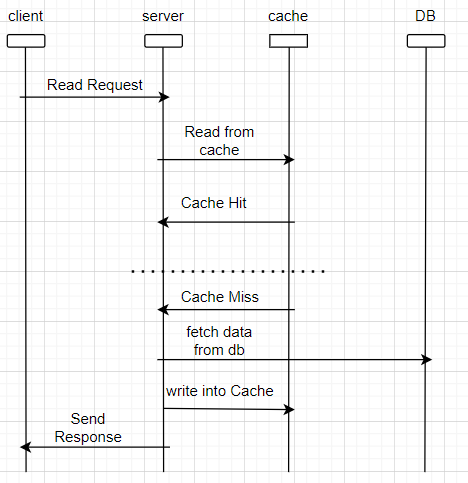

**Caching**

* Caching is a technique to store frequently used data in a fast access memory rather than accessing data every time from slow access memory.
* This makes our system fast.
* It helps to reduce the latency.
* It also helps to achieve the fault tolerance.

* There are different types of caching present at different layer of the system Like:
- Client Side Caching (browser caching)
- CDN (used to store static data)
- Load Balancer
- Server side Application Caching (like Redis etc)

**What is distributed Caching??**

- scalability i.e limited space /resources.
- single point of failure.

Caching Strategy

1. Caching Aside
* Application first check the cache.
* If data found in Cache, it's called Cache Hit and data is returned to the client.
* If data is not found in Cache, its called Cache Miss.Application fetch the data from DB , store it back to Cache and data is return back to the client.

2. Read through Cache

3. Write Around Cache.

4. Write through Cache

5. Write Back (or Behind) Cache.

