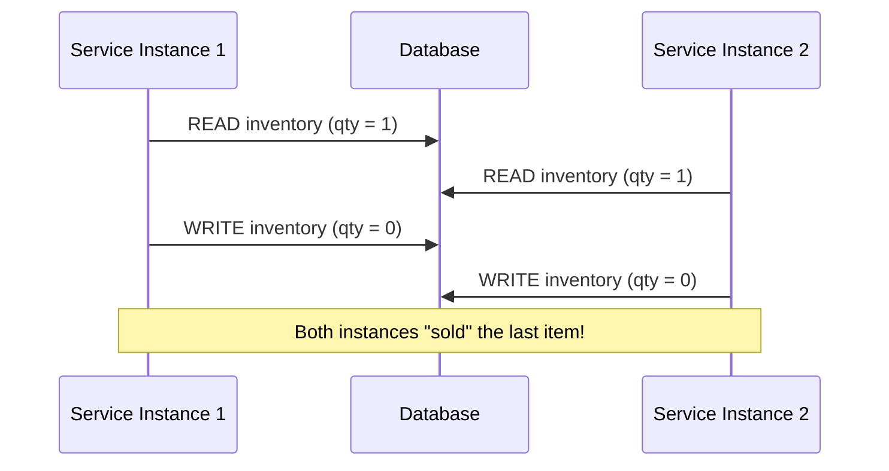
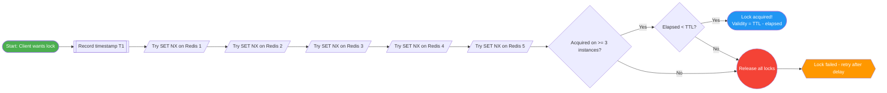
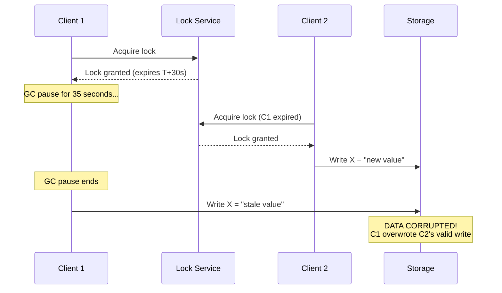
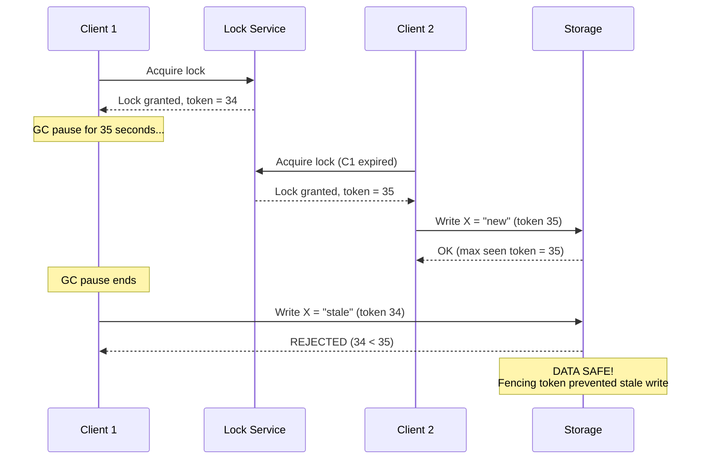
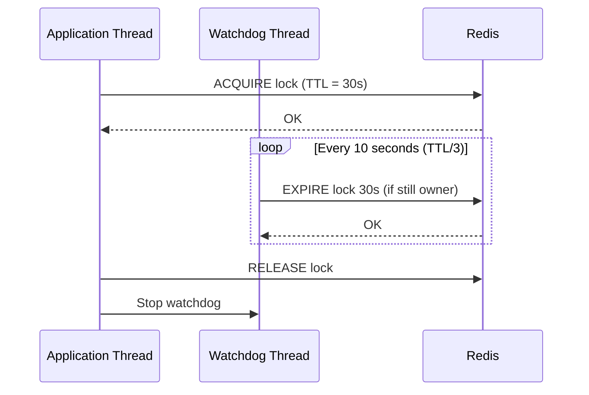

# Distributed Locks

!!! tip "Why This Matters in Interviews"
    Distributed locks are a **top-tier system design topic** at FAANG companies. They test your understanding of consensus, failure modes, and trade-offs in distributed systems. Expect follow-ups on split-brain scenarios, clock drift, and why naive approaches break under partition.

---

## Why We Need Distributed Locks

In a single-process application, a `synchronized` block or `ReentrantLock` is sufficient. In distributed systems, multiple service instances compete for shared resources — databases, files, external APIs — without shared memory.

**Without distributed locks, you get:**

- Double-charging a customer (two instances process the same payment)
- Overselling inventory (two instances read stale stock counts)
- Corrupted data (concurrent writes to the same record)

### Race Condition Example



With a distributed lock, only one instance can enter the critical section at a time, serializing access to the shared resource.

---

## Implementation Approaches

### 1. Database-Based Locks

#### SELECT FOR UPDATE (Pessimistic Locking)

```sql
BEGIN;
SELECT * FROM locks WHERE resource_id = 'order-123' FOR UPDATE;
-- Critical section: only one transaction holds this row lock
UPDATE inventory SET qty = qty - 1 WHERE product_id = 'SKU-456';
COMMIT;
```

#### Advisory Locks (PostgreSQL)

```sql
-- Acquire lock (blocks until available)
SELECT pg_advisory_lock(hashtext('order-123'));

-- Critical section
UPDATE inventory SET qty = qty - 1 WHERE product_id = 'SKU-456';

-- Release lock
SELECT pg_advisory_unlock(hashtext('order-123'));
```

**Pros:** No extra infrastructure, strong consistency via ACID.  
**Cons:** Database becomes bottleneck, no TTL (risk of deadlocks), poor scalability.

---

### 2. Redis-Based Locks

#### Basic Lock with SETNX

```redis
-- Acquire: SET if Not eXists with expiration
SET resource:order-123 owner-uuid NX PX 30000

-- Release: only if we still own it (Lua script for atomicity)
if redis.call("get", KEYS[1]) == ARGV[1] then
    return redis.call("del", KEYS[1])
else
    return 0
end
```

Key properties:

- **NX** — only set if key does not exist (mutual exclusion)
- **PX 30000** — auto-expire after 30 seconds (liveness guarantee)
- **Unique value** — prevents releasing someone else's lock

#### Why a Single Redis Instance is Unsafe

If the Redis master crashes after granting a lock but before replicating to the replica, a second client can acquire the same lock from the promoted replica. This is the **split-brain** scenario that Redlock addresses.

---

### 3. ZooKeeper-Based Locks

ZooKeeper uses **ephemeral sequential znodes** to implement fair, ordered locks:

1. Client creates `/locks/resource-001/lock-` (ephemeral + sequential)
2. ZooKeeper assigns a sequence number: `/locks/resource-001/lock-0000000007`
3. Client lists all children under `/locks/resource-001/`
4. If the client's znode has the **lowest** sequence number, it holds the lock
5. Otherwise, it sets a **watch** on the znode with the next-lower sequence number
6. When that znode is deleted (owner releases or crashes), the watch fires

**Pros:** No expiration needed (ephemeral nodes auto-delete on session loss), strong ordering guarantees.  
**Cons:** Higher latency, operational complexity of running a ZK ensemble.

---

### 4. etcd-Based Locks

etcd provides distributed locks via **leases** and **compare-and-swap (CAS)**:

```go
// Create a lease (TTL = 15 seconds)
lease, _ := client.Grant(ctx, 15)

// Attempt to acquire lock (CAS: create key only if it does not exist)
txn := client.Txn(ctx).
    If(clientv3.Compare(clientv3.CreateRevision("lock/order-123"), "=", 0)).
    Then(clientv3.OpPut("lock/order-123", "owner-id", clientv3.WithLease(lease.ID))).
    Else(clientv3.OpGet("lock/order-123"))

resp, _ := txn.Commit()

// Keep lease alive (auto-renewal)
client.KeepAlive(ctx, lease.ID)
```

**Pros:** Strong consistency (Raft-based), built-in lease TTL, widely used in Kubernetes.  
**Cons:** Lower throughput than Redis, requires understanding of Raft.

---

## The Redlock Algorithm

Redlock (proposed by Salvatore Sanfilippo) attempts to provide stronger guarantees using **N independent Redis masters** (typically N=5).

### Steps

1. Get the current time in milliseconds (`T1`)
2. Sequentially try to acquire the lock on all N instances using the same key and random value, with a small per-instance timeout
3. Calculate elapsed time: `elapsed = now - T1`
4. Lock is acquired **only if** the client obtained it on a **majority** (>= N/2 + 1) of instances AND the total elapsed time is less than the lock TTL
5. If acquired, the effective lock validity = `TTL - elapsed`
6. If not acquired, release the lock on **all** instances (even those where acquisition succeeded)

### Redlock Flow Diagram



### Criticism (Martin Kleppmann)

Martin Kleppmann argues that Redlock is fundamentally broken because:

- **GC pauses** can cause a client to believe it holds a lock after it has expired
- **Clock drift** across Redis nodes can shorten effective lock validity
- Without **fencing tokens**, safety cannot be guaranteed

---

## Fencing Tokens

A fencing token is a monotonically increasing number issued with each lock acquisition. The storage system rejects any write with a token **lower** than the highest token it has seen.

### Split-Brain Without Fencing



### Split-Brain Resolved With Fencing



---

## Lock Expiration and Renewal (Watchdog Pattern)

Setting a fixed TTL is dangerous: if the critical section takes longer than expected, the lock expires and another client can enter.

### The Watchdog Pattern

A background thread ("watchdog") periodically extends the lock's TTL while the owner is still working:



**Redisson** (Java Redis client) implements this automatically with its `RLock`:

- Default lock watchdog timeout: **30 seconds**
- Renewal interval: **every 10 seconds** (TTL / 3)
- If the JVM crashes, no renewal happens, and the lock auto-expires

---

## Comparison Table

| Feature | Redis (Single) | Redis (Redlock) | ZooKeeper | etcd | Database |
|---------|:---:|:---:|:---:|:---:|:---:|
| **Consistency** | Weak | Moderate | Strong (ZAB) | Strong (Raft) | Strong (ACID) |
| **Throughput** | Very High | High | Moderate | Moderate | Low |
| **Latency** | ~1ms | ~5-10ms | ~10-50ms | ~5-20ms | ~10-100ms |
| **Fault Tolerance** | None | N/2 failures | N/2 failures | N/2 failures | Depends on HA setup |
| **Auto-release on crash** | Via TTL | Via TTL | Ephemeral nodes | Via lease | Manual / timeout |
| **Fairness (ordering)** | No | No | Yes (sequential) | Yes (revision) | Yes (queue table) |
| **Fencing tokens** | Manual | Manual | Built-in (zxid) | Built-in (revision) | Manual |
| **Operational complexity** | Low | Moderate | High | Moderate | Low |
| **Best for** | Performance-critical, best-effort | Stronger guarantees | Strict correctness | K8s-native systems | Simple setups |

---

## Java Implementation with Redisson

```java
import org.redisson.Redisson;
import org.redisson.api.RLock;
import org.redisson.api.RedissonClient;
import org.redisson.config.Config;

import java.util.concurrent.TimeUnit;

public class DistributedLockExample {

    private final RedissonClient redisson;

    public DistributedLockExample() {
        Config config = new Config();
        config.useSingleServer()
              .setAddress("redis://localhost:6379")
              .setConnectionPoolSize(64)
              .setConnectionMinimumIdleSize(10);
        this.redisson = Redisson.create(config);
    }

    public void processOrder(String orderId) {
        // Create a lock instance for this specific resource
        RLock lock = redisson.getLock("lock:order:" + orderId);

        try {
            // Try to acquire lock: wait up to 10s, auto-release after 30s
            // If leaseTime is -1, watchdog auto-renews every 10s
            boolean acquired = lock.tryLock(10, -1, TimeUnit.SECONDS);

            if (acquired) {
                try {
                    // Critical section
                    deductInventory(orderId);
                    chargePayment(orderId);
                    sendConfirmation(orderId);
                } finally {
                    // Always release in finally block
                    if (lock.isHeldByCurrentThread()) {
                        lock.unlock();
                    }
                }
            } else {
                // Could not acquire lock within wait time
                throw new RuntimeException("Failed to acquire lock for order: " + orderId);
            }
        } catch (InterruptedException e) {
            Thread.currentThread().interrupt();
            throw new RuntimeException("Lock acquisition interrupted", e);
        }
    }

    // Redlock with multiple Redis instances
    public void processOrderWithRedlock(String orderId) {
        RLock lock1 = redisson.getLock("lock:order:" + orderId + ":1");
        RLock lock2 = redisson.getLock("lock:order:" + orderId + ":2");
        RLock lock3 = redisson.getLock("lock:order:" + orderId + ":3");

        // RedissonMultiLock implements Redlock algorithm
        RLock multiLock = redisson.getMultiLock(lock1, lock2, lock3);

        try {
            boolean acquired = multiLock.tryLock(10, 30, TimeUnit.SECONDS);
            if (acquired) {
                try {
                    // Critical section with stronger guarantees
                    processPayment(orderId);
                } finally {
                    multiLock.unlock();
                }
            }
        } catch (InterruptedException e) {
            Thread.currentThread().interrupt();
        }
    }

    // Cleanup on shutdown
    public void shutdown() {
        redisson.shutdown();
    }

    private void deductInventory(String orderId) { /* ... */ }
    private void chargePayment(String orderId) { /* ... */ }
    private void sendConfirmation(String orderId) { /* ... */ }
    private void processPayment(String orderId) { /* ... */ }
}
```

---

## Common Pitfalls

### 1. Clock Drift

Redis TTLs rely on local clocks. If a Redis node's clock jumps forward, the lock expires prematurely. Redlock assumes bounded clock drift, but NTP corrections or VM clock sync issues can violate this assumption.

**Mitigation:** Use monotonic clocks where possible; monitor clock skew across nodes.

### 2. GC Pauses (Stop-the-World)

A long GC pause can cause a client to hold a lock reference while the actual lock has expired on the server. The client resumes and operates on the shared resource without mutual exclusion.

**Mitigation:** Use fencing tokens; keep critical sections short; tune GC for low pause times.

### 3. Network Partitions

A client may acquire a lock, then become partitioned from both the lock service and the storage. Meanwhile, the lock expires and another client acquires it.

**Mitigation:** Use fencing tokens; design idempotent operations; implement lock validation before writes.

### 4. Forgetting to Release Locks

If an exception occurs and the lock is not released in a `finally` block, the lock remains held until TTL expiration (or forever with database locks).

**Mitigation:** Always use `try-finally`; prefer lock implementations with auto-expiration.

### 5. Lock Starvation

Under high contention, some clients may never acquire the lock (especially with Redis, which has no fairness guarantee).

**Mitigation:** Use ZooKeeper (sequential nodes provide FIFO ordering); implement exponential backoff with jitter.

### 6. Assuming Locks Provide Consensus

A distributed lock does not replace a consensus protocol. If you need multiple nodes to agree on a value, use Raft/Paxos — not a lock.

---

## Interview Questions

??? question "Why can't you use a single Redis instance for a reliable distributed lock?"
    A single Redis instance is a single point of failure. If it crashes after granting a lock (but before replicating to a slave in master-slave setups), the promoted slave has no knowledge of the lock. A second client can then acquire the same lock, violating mutual exclusion. Additionally, Redis replication is asynchronous, so even with replicas, there is a window where the lock can be lost. This is precisely the problem that Redlock (using N independent masters) attempts to solve.

??? question "Explain the Redlock algorithm and its controversy."
    Redlock uses N (typically 5) independent Redis masters. A client tries to acquire the lock on all N, and considers itself successful only if it acquires on a majority (>= 3) within a time less than the TTL. Martin Kleppmann criticized it because: (1) it relies on bounded clock drift which can be violated, (2) GC pauses or network delays can cause a client to use an expired lock, and (3) without fencing tokens, safety cannot be guaranteed. Antirez (Redis creator) responded that the clock drift assumption is reasonable in practice. The takeaway: for **correctness-critical** systems, prefer ZooKeeper or etcd; for **performance-critical best-effort** locking, Redis is acceptable.

??? question "What are fencing tokens and why are they necessary?"
    A fencing token is a monotonically increasing number assigned each time a lock is granted. The client passes this token with every write to the storage layer. The storage rejects any write with a token lower than the highest it has previously accepted. This prevents stale writes from clients that believe they hold the lock (due to GC pauses, network delays, or clock issues) but whose lock has actually expired and been re-granted to another client.

??? question "How does ZooKeeper implement distributed locks differently from Redis?"
    ZooKeeper uses ephemeral sequential znodes. Each client creates a znode under a lock path; the client with the lowest sequence number holds the lock. Others set watches on the next-lower znode. Key differences from Redis: (1) no TTL needed because ephemeral nodes auto-delete when the session ends (crash detection is built-in), (2) strong ordering guarantees (FIFO), (3) linearizable reads/writes via ZAB protocol. The trade-off is higher latency and operational complexity.

??? question "What is the watchdog pattern in Redisson?"
    The watchdog is a background thread that automatically renews the lock's TTL at regular intervals (typically every TTL/3, e.g., every 10 seconds for a 30-second TTL). This solves the problem of setting a fixed TTL that might be too short for long-running operations. If the JVM crashes, the watchdog stops and the lock expires naturally after the TTL. The client can opt out by specifying an explicit lease time, which disables watchdog renewal.

??? question "How would you design a distributed lock service for an e-commerce checkout system?"
    Key design decisions: (1) Use Redis with Redisson for low latency — checkout is latency-sensitive. (2) Lock granularity: per-order or per-SKU depending on the contention pattern. (3) Set TTL to 2x the maximum expected processing time. (4) Implement the watchdog pattern for renewal. (5) Use fencing tokens if writing to a database that supports them. (6) Make the payment operation idempotent (using idempotency keys) so that even if locking fails, double-charges are prevented. (7) Add monitoring for lock acquisition failures and timeouts. (8) Consider fallback: if Redis is unavailable, queue the order for later processing rather than failing hard.

??? question "What happens to a distributed lock during a network partition?"
    It depends on the system. With Redis: if the client is partitioned from Redis but can still reach the storage, it might operate without a valid lock after TTL expiration. With ZooKeeper: the client's session eventually times out, the ephemeral node is deleted, and another client can acquire the lock — but the partitioned client may not know it has lost the lock until it tries to communicate. With etcd: similar to ZooKeeper (lease expires). In all cases, fencing tokens are the safety net — the storage layer is the final gatekeeper, not the lock service alone.

??? question "Compare database advisory locks vs Redis locks for a microservices deployment."
    Database advisory locks are simpler (no extra infrastructure) and provide strong consistency, but they tie your lock scalability to your database's capacity and connection pool. Redis locks are faster (~1ms vs ~10-100ms), scale independently of the database, and support TTL natively. For microservices: prefer Redis if you already have Redis in your stack and can tolerate best-effort locking; prefer database locks if you need strong transactional guarantees and your lock contention is low; prefer ZooKeeper/etcd if correctness is paramount and you can tolerate higher latency.
