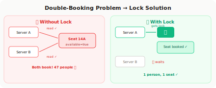

# Distributed Locks

!!! danger "Real Incident: Ticket Booking System, 2019"
    A flight booking system sells Seat 14A to **47 people simultaneously**. Two app servers both read `available = true` at the same millisecond, both wrote `available = false`. Each thought it won the race. Result: 47 angry customers, refunds, and a P0 postmortem. **This is what happens without coordination.**

---

## The 30-Second Explanation

**Distributed lock = a mechanism that ensures only ONE process across multiple servers can access a shared resource at a time.**

🔑

<h4 style="margin: 0 0 0.5rem; color: #2563eb;">Single Machine</h4>

Mutex/synchronized — trivial. OS handles it.

🌐

<h4 style="margin: 0 0 0.5rem; color: #92400e;">Distributed</h4>

Network failures, clock skew, process crashes mid-lock. Much harder.

> **The key insight:** The lock itself must be distributed AND fault-tolerant. A single Redis node as your lock server is a single point of failure.

---

## The Bathroom Key Analogy

Single-stall bathroom in a coffee shop. Only one key.

- **Acquire lock** = take the key from the counter
- **Hold lock** = you're in the bathroom
- **Release lock** = return the key
- **TTL** = if you don't return in 5 min, staff opens with master key (prevents deadlock)
- **Fencing token** = your receipt number. If someone got a NEWER receipt, your key is invalid.

---

## When You Need Distributed Locks

| Use Case | What Breaks Without It |
|---|---|
| **Inventory/Booking** | Overselling (same seat sold twice) |
| **Payment Processing** | Double-charge (same transaction processed twice) |
| **Leader Election** | Split brain (two leaders, data diverges) |
| **Cron Jobs** | Duplicate execution across instances |
| **Rate Limiting** | Inaccurate counts (race on counter) |
| **File/Resource Access** | Corruption (concurrent writes) |

---

## Implementation Options

<table style="width: 100%; border-collapse: collapse;">
<thead>
<tr style="background: linear-gradient(135deg, #f8fafc, #f1f5f9);">
<th style="padding: 0.8rem; border-bottom: 2px solid #e2e8f0; text-align: left;">Approach</th>
<th style="padding: 0.8rem; border-bottom: 2px solid #e2e8f0; text-align: left;">How</th>
<th style="padding: 0.8rem; border-bottom: 2px solid #e2e8f0; text-align: left;">Pros</th>
<th style="padding: 0.8rem; border-bottom: 2px solid #e2e8f0; text-align: left;">Cons</th>
</tr>
</thead>
<tbody>
<tr><td style="padding: 0.7rem; border-bottom: 1px solid #f1f5f9;"><strong>Redis (SETNX)</strong></td><td style="padding: 0.7rem; border-bottom: 1px solid #f1f5f9;">SET key value NX EX 30</td><td style="padding: 0.7rem; border-bottom: 1px solid #f1f5f9;">Fast, simple, widely used</td><td style="padding: 0.7rem; border-bottom: 1px solid #f1f5f9;">Not safe during Redis failover</td></tr>
<tr><td style="padding: 0.7rem; border-bottom: 1px solid #f1f5f9;"><strong>Redlock</strong></td><td style="padding: 0.7rem; border-bottom: 1px solid #f1f5f9;">Acquire on majority (3/5) Redis nodes</td><td style="padding: 0.7rem; border-bottom: 1px solid #f1f5f9;">Tolerates single node failure</td><td style="padding: 0.7rem; border-bottom: 1px solid #f1f5f9;">Controversial (clock assumptions)</td></tr>
<tr><td style="padding: 0.7rem; border-bottom: 1px solid #f1f5f9;"><strong>ZooKeeper</strong></td><td style="padding: 0.7rem; border-bottom: 1px solid #f1f5f9;">Ephemeral sequential znodes</td><td style="padding: 0.7rem; border-bottom: 1px solid #f1f5f9;">Strong guarantees, auto-release on crash</td><td style="padding: 0.7rem; border-bottom: 1px solid #f1f5f9;">Complex, higher latency</td></tr>
<tr><td style="padding: 0.7rem; border-bottom: 1px solid #f1f5f9;"><strong>etcd</strong></td><td style="padding: 0.7rem; border-bottom: 1px solid #f1f5f9;">Lease-based with Raft consensus</td><td style="padding: 0.7rem; border-bottom: 1px solid #f1f5f9;">Linearizable, built into K8s</td><td style="padding: 0.7rem; border-bottom: 1px solid #f1f5f9;">Slower than Redis</td></tr>
<tr><td style="padding: 0.7rem;"><strong>Database (SELECT FOR UPDATE)</strong></td><td style="padding: 0.7rem;">Row-level lock in RDBMS</td><td style="padding: 0.7rem;">No extra infra needed</td><td style="padding: 0.7rem;">Doesn't scale, long lock = blocked conns</td></tr>
</tbody>
</table>

---

## The Redlock Controversy

Martin Kleppmann (author of "Designing Data-Intensive Applications") vs. Salvatore Sanfilippo (Redis creator).

| Kleppmann's Argument | Antirez's Response |
|---|---|
| Clock drift can violate safety | Clock drift is bounded in practice |
| GC pauses can outlive TTL | Use fencing tokens |
| Redlock isn't formally proven safe | It's practically safe for real workloads |

**The takeaway for interviews:** Mention the controversy. Say "For correctness-critical locks (payment, inventory), I'd use ZooKeeper/etcd. For performance-critical but best-effort locks (deduplication, cron), Redis SETNX with TTL is fine."

---

## Properties of a Good Distributed Lock

| Property | What It Means |
|---|---|
| **Mutual Exclusion** | At most one client holds the lock at any time |
| **Deadlock Freedom** | Lock always eventually becomes available (TTL) |
| **Fault Tolerance** | Lock service survives node failures |
| **Fencing** | Stale lock holders can't corrupt data (fencing tokens) |

---

## Fencing Tokens — The Detail That Shows Seniority

**Problem:** Client A acquires lock, then has a long GC pause. Lock TTL expires. Client B acquires lock. Client A wakes up, thinks it still has the lock, writes data.

**Solution:** Fencing token = monotonically increasing number given with each lock acquisition.

- Client A gets lock with token 34
- Lock expires, Client B gets lock with token 35
- Client A wakes up, sends write with token 34
- Resource rejects token 34 because it's seen token 35

!!! tip "Interview Gold"
    "I'd use fencing tokens to handle the GC-pause scenario. Each lock acquisition gets a monotonically increasing token. The protected resource rejects operations with stale tokens. This is how Google's Chubby lock service works."

---

## Decision Framework

| Need | Use |
|---|---|
| Fast, best-effort (dedup, cron) | Redis SETNX + TTL |
| Correctness-critical (payments) | ZooKeeper or etcd |
| Already have a database, low scale | SELECT FOR UPDATE |
| Multi-region | Spanner's TrueTime locks |
| Kubernetes-native | etcd (already there) |

---

## The 3 Mistakes That Get You Rejected

!!! danger "Don't Say These"
    1. **"Just use Redis SETNX"** — Without discussing TTL, fencing tokens, and what happens during Redis failover, this answer is incomplete and shows junior thinking.
    2. **"Set a long TTL to be safe"** — Long TTL = long deadlock if the holder crashes. Short TTL = risk of premature expiry. The right answer is short TTL + renewal (heartbeat).
    3. **"Locks solve all concurrency problems"** — Locks are ONE tool. Sometimes optimistic concurrency (CAS), idempotency keys, or queue-based serialization is better.

---

## Interview Answer Template

> "For [use case], I'd use [Redis/ZooKeeper/etcd] because [correctness vs performance trade-off]. The lock would have a TTL of [N]s with heartbeat renewal every [N/3]s. For safety against GC pauses and clock drift, I'd use fencing tokens. The protected resource rejects operations with stale tokens."

---

## Quick Recall Card

| Question | Answer |
|---|---|
| Simplest distributed lock? | Redis SETNX with TTL |
| Safest distributed lock? | ZooKeeper (ephemeral znodes) or etcd (leases) |
| What's Redlock? | Acquire on majority (3/5) Redis nodes |
| What's a fencing token? | Monotonically increasing number to detect stale locks |
| TTL too short? | Premature expiry → two holders |
| TTL too long? | Deadlock if holder crashes |
| How to fix TTL dilemma? | Short TTL + heartbeat renewal |
