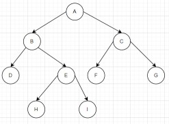
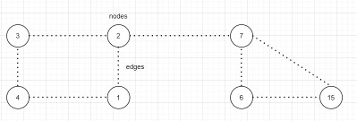
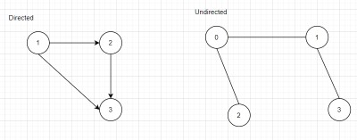
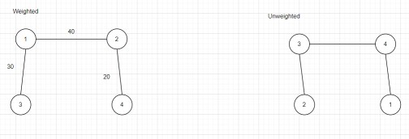

Topics:

## Arrays:

* Collection of "Similar Type of Data Elements" stored in a "contiguous location".

Operations:

Case 1: Unsorted Array

Search:

a=[5 2 1 3 4 6 -2]

num = 5

nun index of num in a[] , if not found return -1

Approach:
Traverse each value one by one and check if a[i
 == num
 Best case:O(1) , num == a[0]
 Worst Case: O(N), Element not found
Operation   Time   Space

Search       O(N)    O(1)
Insert
Delete

SubArray: Contiguous Smaller Array of Large Array

a[] = [5,1,3,2,4,6]
ex: [1,3] :YES , [1,3,2] :YES [1,3,4] : NO

SubSequence:
Smaller Array from the Larger Array, Does not Necessarily Contiguous But ORDER must be maintained.

Eg:
[1,3] :YES
[1,3,2] : YES
[1,3,4] : YES
[1,3,6,4] : NO

SubSet: ANY COMBINATION
Smaller Subset of Array. Does Not Necessarily Contiguous and Order Does not matter.
Eg:
[1,3,5]: YES
[5,1,3]: YES

2D Arrays:

* int[][] = new int[5][6];

* Transpose of a matrix : you have a square 2d matrix.return the transpose of a given matrix.
   i.e convert all the columns into rows.

## LinkedList

* When the spaces are not available together we are not able to store in array with large size , it may throw throw stack over flow, and came up with Linked List.
* So along with value we should store address of next node.

Add the element at the start:
        
      Node node = new Node(10);
      node.next = head
      head =node

Add the element at the end:
   
      Node temp = head;
      while(temp!=next){
      temp = temp.next; 
      }
      temp.next = node;
      node.next = null

Add the element in the middle: we need to pass the index
 
      Node temp = head;
      for(int i = 0 ; i<index-1;i++){
      temp = temp.next;
      }
      Node temp1 = temp.next;
      Node temp2 = temp1.next;
      temp1.next = node;
      node.next = temp2;

## Stack

* In dynamic array we can add element at any index , but if I restrict the operations to add at last and remove at last.This data structure is known as Stack.
* This will automatically follow LIFO (last in first out).
* For example you are elements into stack 10 20 30 40 50
* It will look like 
        50
        40
        30
        20
        10 
* If you want to remove element, you can only remove 50. Now the stack looks like 40 30 20 10 , now if we remove again we will get 40.
* push() --> to add an element.
* peek() --> get the top element.
* size() --> size of the stack.
* pop() ---> remove the element.

## Queue

* Add at end, but remove from first.
* FIFO(first in first out).
* offer() --> to add the element.

## Tree

* If you want to store hierarchical data.
* Nomenclature in tree:
       

* root node - the top most node of the hierarchy.
* parent node - here  B, E,C are the parent node.
* child node - successors of given node.
* child node(C) -F ,G
* child node(B) - D,E
* siblings - nodes with common parent.
* leaf node - nodes with zero children.
* ascendants - all the nodes above that given node.
   For ex: ascendants of I - E,B,A (root node)
* descendants - all the nodes below the given node.

   * Height of a node: take out the path from that given node to all other leaf nodes. length in terms of edge.
   * Height of A:  
     1. A-C-F (2) 2. A-C-G(2)   3. A-B-E-I (3) 4. A-B-D-H(3)
   * we need to consider maximum length as the height of the node. So here the maximum length is 3.
   * Depth of Node:take out the path from that root node to the that node.

## Heap
* Priority Queue: removes highest priority element. gives prior to lower value if its default priority queue.
    50 10 20 30 70 remove() - 10

## HashMap

India -138
Pakistan - 22
Nepal - 3
USA -33
key -value pair

## HashSet

* duplicates will not be added 
* only keys in map will be added as values in set.

## Graphs

* It is nothing but collection of nodes, connected to each other using edges.
 

Real Time Examples:
1. Facebook friends
2. Google Maps

Trees vs Graphs

1. In trees there is a unique node which is known as root. , in graphs no unique node which is known as root.
2. Hierarchy is clearly defined . no hierarchy in graphs.
3. Treed cannot form a cycle. Graphs can form cycle.

Classification of graphs:
Case 1 :
Directed and Undirected.

Case 2 :

Case 3:

Undirected Cyclic growth and Undirected Acyclic graph

Case 4 :
Directed Cyclic and Directed Acyclic graph

Input of a Graph:
assume graph is undirected . the first line will have 2 integers  one is no.of nodes and other is no. of edges.

7 8 

0 1 

0 3

1 2

3 2

3 4

6 5 

4 5

## Dynamic Programming

* Those who don't remember the past are commended to repeat it.
* Overlapping sub problem
* 1. Top down approach -- recursive (memoization / keep in memory (arrays , hashmaps))
* 2. Bottom up approach -- iterative 

