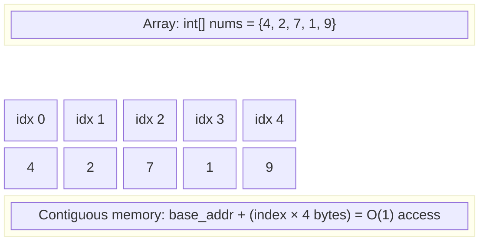
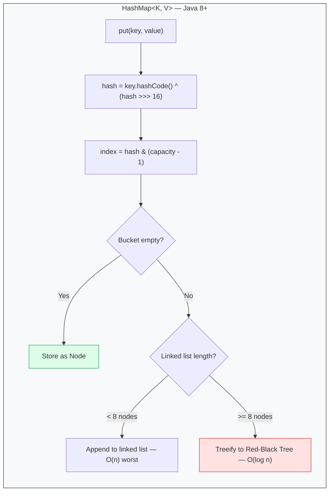
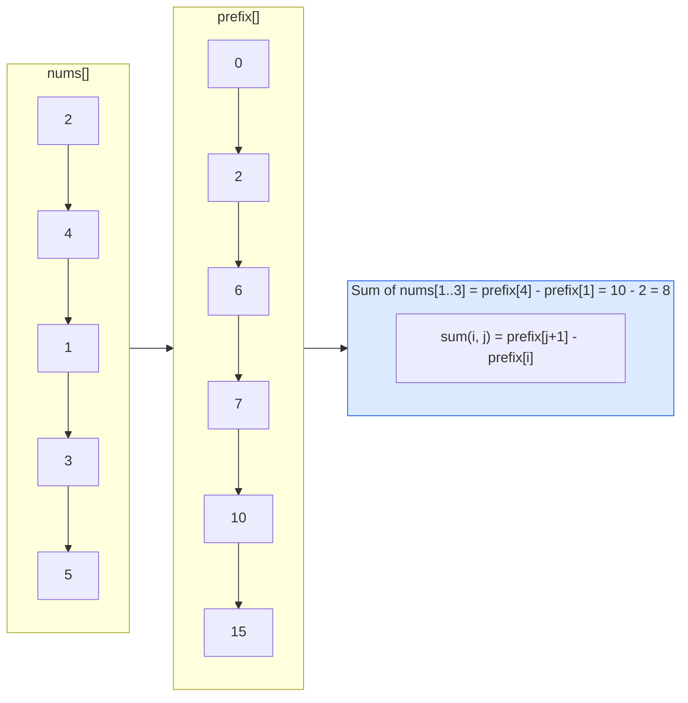
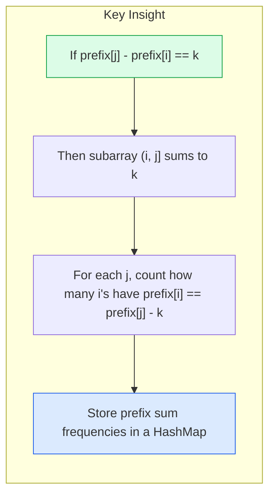

# Arrays & Hashing

<div class="vtn-hero" style="margin-left: 0; margin-right: 0; padding: 2.5rem 2rem;">
<span class="vtn-tag">Pattern #1</span>
<h1 style="font-size: 2.2rem !important;">Arrays & Hashing</h1>
<p class="vtn-subtitle">The foundation every other pattern builds on. If you can't solve array/hashmap problems fluently, you'll struggle with two pointers, sliding window, and DP. This pattern appears in 30-40% of FAANG phone screens.</p>
<div class="vtn-stats">
<div class="vtn-stat"><span class="vtn-stat-number">40%</span><span class="vtn-stat-label">Interview Frequency</span></div>
<div class="vtn-stat"><span class="vtn-stat-number">O(1)</span><span class="vtn-stat-label">HashMap Lookup</span></div>
<div class="vtn-stat"><span class="vtn-stat-number">15</span><span class="vtn-stat-label">Must-Know Problems</span></div>
</div>
</div>

---

## Why This Pattern Matters

!!! tip "Interview Reality"
    Arrays & Hashing is not just one pattern — it's the **toolbox** you reach for inside every other pattern. Two Pointers uses arrays. Sliding Window uses hash maps for constraint tracking. DP uses arrays for memoization. Master this first, and everything else becomes easier.

The core insight: **trading space for time**. Almost every O(n^2) brute force involving "find something in the array" can be reduced to O(n) by pre-storing values in a HashMap.

---

## Core Concepts

### Array Internals



**Key properties:**

- **Contiguous memory** — elements stored sequentially, enabling O(1) random access via pointer arithmetic
- **Fixed size** (in Java, `int[]`) — once allocated, cannot grow. Use `ArrayList` for dynamic sizing (amortized O(1) append via doubling)
- **Cache-friendly** — sequential access patterns are fast because the CPU prefetcher loads adjacent memory into L1 cache

### HashMap Internals (Java)

!!! warning "This Gets Asked Directly"
    Amazon and Google have asked "explain how HashMap works internally" as a standalone question. Know the numbers.



| Property | Value | Why It Matters |
|---|---|---|
| Default capacity | 16 | Power of 2 for fast modulo via `&` |
| Load factor | 0.75 | Triggers resize at 75% full (12 entries for cap 16) |
| Resize | 2x capacity | Rehashes all entries — O(n) one-time cost |
| Treeify threshold | 8 nodes in one bucket | Converts linked list to Red-Black tree |
| Untreeify threshold | 6 nodes | Converts back to linked list on removal |

### HashSet for Dedup

`HashSet<T>` is internally just a `HashMap<T, Object>` where all values are a dummy constant (`PRESENT`). Use it when you only care about **existence**, not key-value mapping.

```java
// O(n) dedup check — "does this element already exist?"
Set<Integer> seen = new HashSet<>();
for (int num : nums) {
    if (!seen.add(num)) {
        // duplicate found
    }
}
```

### Prefix Sum

The prefix sum converts any "sum of subarray [i, j]" query from O(n) to O(1) after an O(n) precomputation.



**Formula:** `sum(i, j) = prefix[j + 1] - prefix[i]` where `prefix[0] = 0` and `prefix[k] = prefix[k-1] + nums[k-1]`.

### Subarray vs Subsequence vs Subset

???question "These terms get confused constantly in interviews. Know the difference."
    | Term | Contiguous? | Order Preserved? | Example from [1,2,3,4] |
    |---|---|---|---|
    | **Subarray** | Yes | Yes | [2,3,4] |
    | **Subsequence** | No | Yes | [1,3,4] |
    | **Subset** | No | No | {1,4,2} |
    
    **Interview tip:** When a problem says "subarray," you can use sliding window or prefix sum. When it says "subsequence," you often need DP. When it says "subset," think backtracking or bitmask.

---

## Pattern Recognition

!!! tip "The 30-Second Decision Framework"
    Read the problem constraints and keywords, then pick the approach. This table covers 90% of array/hash problems.

| Signal in Problem | Think... | Example Problem |
|---|---|---|
| "Find a pair/triplet that sums to X" | HashMap (complement lookup) or Two Pointers on sorted | Two Sum, 3Sum |
| "Count/frequency of elements" | HashMap frequency counter | Top K Frequent Elements |
| "Group elements by some property" | HashMap with computed key | Group Anagrams |
| "Check if duplicate/seen before" | HashSet | Contains Duplicate |
| "Sum of subarray equals K" | Prefix sum + HashMap | Subarray Sum Equals K |
| "Product of all except self" | Prefix/suffix product arrays | Product of Array Except Self |
| "Longest consecutive sequence" | HashSet + boundary detection | Longest Consecutive Sequence |
| "In-place operation, O(1) space" | Swap/partition or use array as its own hash | First Missing Positive |
| "Constraints: n <= 10^6" | Must be O(n) or O(n log n) | Rules out O(n^2) brute force |
| "Contiguous subarray with max/min sum" | Kadane's algorithm | Maximum Subarray |

---

## Reusable Java Templates

=== "Frequency Counting"

    ```java
    /**
     * Pattern: Count occurrences of each element.
     * Use when: top-K, majority element, anagram checks.
     */
    public Map<Integer, Integer> frequencyCount(int[] nums) {
        Map<Integer, Integer> freq = new HashMap<>();
        for (int num : nums) {
            freq.merge(num, 1, Integer::sum);
        }
        return freq;
    }

    // Alternative with getOrDefault:
    // freq.put(num, freq.getOrDefault(num, 0) + 1);
    ```

=== "Two-Pass HashMap (Index Lookup)"

    ```java
    /**
     * Pattern: Store value->index in first pass, query in second.
     * Use when: finding pairs, checking complements.
     * Optimization: single-pass variant checks BEFORE inserting.
     */
    public int[] twoPassLookup(int[] nums, int target) {
        Map<Integer, Integer> valToIndex = new HashMap<>();

        // Single-pass variant (preferred for Two Sum):
        for (int i = 0; i < nums.length; i++) {
            int complement = target - nums[i];
            if (valToIndex.containsKey(complement)) {
                return new int[]{valToIndex.get(complement), i};
            }
            valToIndex.put(nums[i], i);
        }
        return new int[]{};
    }
    ```

=== "Prefix Sum"

    ```java
    /**
     * Pattern: Precompute cumulative sums for O(1) range queries.
     * Use when: subarray sum problems, range sum queries.
     */
    public int[] buildPrefixSum(int[] nums) {
        int[] prefix = new int[nums.length + 1];
        for (int i = 0; i < nums.length; i++) {
            prefix[i + 1] = prefix[i] + nums[i];
        }
        return prefix;
        // rangeSum(i, j) = prefix[j + 1] - prefix[i]
    }

    /**
     * Prefix sum + HashMap: count subarrays with sum == k
     */
    public int subarraySum(int[] nums, int k) {
        Map<Integer, Integer> prefixCount = new HashMap<>();
        prefixCount.put(0, 1); // empty prefix
        int sum = 0, count = 0;

        for (int num : nums) {
            sum += num;
            count += prefixCount.getOrDefault(sum - k, 0);
            prefixCount.merge(sum, 1, Integer::sum);
        }
        return count;
    }
    ```

=== "Group By Pattern (Anagrams)"

    ```java
    /**
     * Pattern: Group elements by a computed canonical key.
     * Use when: grouping anagrams, categorizing strings.
     */
    public List<List<String>> groupByKey(String[] strs) {
        Map<String, List<String>> groups = new HashMap<>();

        for (String s : strs) {
            // Compute canonical key (sorted chars for anagrams)
            char[] chars = s.toCharArray();
            Arrays.sort(chars);
            String key = new String(chars);

            groups.computeIfAbsent(key, k -> new ArrayList<>()).add(s);
        }
        return new ArrayList<>(groups.values());
    }

    // Alternative key: frequency array as string
    // "eat" -> "1a0b0c0d1e..." (avoids O(k log k) sort)
    private String charCountKey(String s) {
        int[] count = new int[26];
        for (char c : s.toCharArray()) count[c - 'a']++;
        return Arrays.toString(count);
    }
    ```

---

## Solved Walkthroughs

### 1. Two Sum (LC #1)

!!! tip "Interview Context"
    **Asked at:** Every company | **Frequency:** The most-asked problem in history | **Time:** 10-15 minutes (warm-up)

**Problem:** Given array `nums` and integer `target`, return indices of two numbers that sum to `target`. Exactly one solution exists.

#### Thought Process

**Dead end — Brute Force O(n^2):**
```java
// Check every pair — works but too slow for n = 10^4+
for (int i = 0; i < nums.length; i++)
    for (int j = i + 1; j < nums.length; j++)
        if (nums[i] + nums[j] == target)
            return new int[]{i, j};
```
Interviewer will ask: "Can you do better?"

**The HashMap Insight:** For each element `nums[i]`, I need `target - nums[i]` to exist somewhere else. Instead of scanning the whole array, store what I've already seen in a HashMap. Each lookup is O(1).

#### Solution

```java
public int[] twoSum(int[] nums, int target) {
    Map<Integer, Integer> seen = new HashMap<>(); // value -> index

    for (int i = 0; i < nums.length; i++) {
        int complement = target - nums[i];
        if (seen.containsKey(complement)) {
            return new int[]{seen.get(complement), i};
        }
        seen.put(nums[i], i);
    }
    throw new IllegalArgumentException("No solution");
}
```

**Complexity:** Time O(n), Space O(n)

**Common mistake:** Putting the element in the map BEFORE checking the complement. This causes the element to match with itself (e.g., target=6, nums=[3,3] would incorrectly return index 0 twice).

---

### 2. Subarray Sum Equals K (LC #560)

!!! tip "Interview Context"
    **Asked at:** Google, Facebook, Amazon | **Level:** Medium | **Key insight:** Prefix sum + HashMap

**Problem:** Given array `nums` and integer `k`, return the total number of contiguous subarrays whose sum equals `k`.

#### Why This Is Tricky

- Negative numbers exist, so sliding window does NOT work (window sum is not monotonic)
- Brute force: try all O(n^2) subarrays, compute each sum in O(n) = O(n^3). Or precompute prefix sums for O(n^2). Neither is good enough.

#### The Insight: Prefix Sum + HashMap



**Visual example:** `nums = [1, 2, 3, -1, 1], k = 3`

| Index | nums[i] | Running Sum | Need (sum - k) | Found in Map? | Count |
|---|---|---|---|---|---|
| — | — | 0 | — | {0:1} (base) | 0 |
| 0 | 1 | 1 | 1 - 3 = -2 | No | 0 |
| 1 | 2 | 3 | 3 - 3 = 0 | Yes (1 time) | 1 |
| 2 | 3 | 6 | 6 - 3 = 3 | Yes (1 time) | 2 |
| 3 | -1 | 5 | 5 - 3 = 2 | No | 2 |
| 4 | 1 | 6 | 6 - 3 = 3 | Yes (1 time) | 3 |

Answer: **3** subarrays — [1,2], [3], [2,3,-1,1]

#### Solution

```java
public int subarraySum(int[] nums, int k) {
    // Key: prefix sum value. Value: how many times we've seen it.
    Map<Integer, Integer> prefixCount = new HashMap<>();
    prefixCount.put(0, 1); // empty subarray has sum 0

    int runningSum = 0;
    int count = 0;

    for (int num : nums) {
        runningSum += num;
        // How many previous prefixes give us exactly k?
        count += prefixCount.getOrDefault(runningSum - k, 0);
        prefixCount.merge(runningSum, 1, Integer::sum);
    }
    return count;
}
```

**Complexity:** Time O(n), Space O(n)

**Why `prefixCount.put(0, 1)`?** Without it, you'd miss subarrays starting at index 0. If `runningSum == k` at some point, you need to count that as one valid subarray — which requires a "prefix sum of 0" to exist.

---

### 3. Group Anagrams (LC #49)

!!! tip "Interview Context"
    **Asked at:** Amazon, Facebook, Bloomberg | **Level:** Medium | **Key insight:** Canonical key for grouping

**Problem:** Given an array of strings, group anagrams together. Return the groups in any order.

Example: `["eat","tea","tan","ate","nat","bat"]` → `[["eat","tea","ate"],["tan","nat"],["bat"]]`

#### The Key Insight

Two strings are anagrams if and only if they have the **same characters in the same frequencies**. So we need a canonical form — a "fingerprint" — that is identical for all anagrams.

**Option A:** Sort each string. "eat" → "aet", "tea" → "aet". Same key = same group.
Cost: O(k log k) per string where k = string length.

**Option B:** Character frequency count as key. "eat" → `[1,0,0,0,1,0,...,1,0,0]`.
Cost: O(k) per string, but key is a 26-element array (constant overhead for short strings).

#### Solution (Sorted Key — Cleaner for Interviews)

```java
public List<List<String>> groupAnagrams(String[] strs) {
    Map<String, List<String>> groups = new HashMap<>();

    for (String s : strs) {
        char[] chars = s.toCharArray();
        Arrays.sort(chars);
        String key = new String(chars);

        groups.computeIfAbsent(key, k -> new ArrayList<>()).add(s);
    }
    return new ArrayList<>(groups.values());
}
```

**Complexity:** Time O(n * k log k) where n = number of strings, k = max string length. Space O(n * k).

**Follow-up the interviewer might ask:** "Can you do it without sorting?" — use the frequency count key:

```java
private String buildKey(String s) {
    int[] freq = new int[26];
    for (char c : s.toCharArray()) freq[c - 'a']++;
    // "1#0#0#...#1#0#1" — use delimiter to avoid collisions
    StringBuilder sb = new StringBuilder();
    for (int f : freq) sb.append(f).append('#');
    return sb.toString();
}
```

This gives O(n * k) time but in practice the constant factor makes it roughly equal for typical interview inputs.

---

## Common Mistakes

| Mistake | Why It's Wrong | Fix |
|---|---|---|
| Using `==` to compare strings as HashMap keys | Compares references, not content. Two equal strings from different operations won't match. | Always use `.equals()` or let HashMap handle it (it uses `.hashCode()` + `.equals()` internally — works correctly for `String`) |
| Forgetting `prefixCount.put(0, 1)` in prefix sum problems | Misses all subarrays starting at index 0 that sum to k | Always initialize with the empty prefix |
| Modifying the array while iterating | ConcurrentModificationException or skipped elements | Use a separate result structure or iterate by index |
| Using `int[]` as a HashMap key | Arrays use identity-based `hashCode()`, not content-based | Convert to `String` with `Arrays.toString()` or use `List<Integer>` |
| Assuming HashMap is O(1) for worst case | Pathological hash collisions → O(n) per op (Java 8 mitigates with treeification) | Mention amortized O(1); for interview purposes, state the assumption |
| Off-by-one in prefix sum indexing | `prefix[i]` represents sum of first `i` elements, NOT element at index `i` | Use `prefix[j+1] - prefix[i]` for range `[i, j]` |
| Not handling empty/null inputs | NullPointerException on first access | Add guard clause at the start; clarify constraints with interviewer |

---

## Practice Problems

| # | Problem | Pattern | Difficulty | Key Insight |
|---|---|---|---|---|
| 1 | [Two Sum](https://leetcode.com/problems/two-sum/) | HashMap complement | Easy | Store value→index, check complement before inserting |
| 217 | [Contains Duplicate](https://leetcode.com/problems/contains-duplicate/) | HashSet | Easy | Set.add() returns false if element exists |
| 242 | [Valid Anagram](https://leetcode.com/problems/valid-anagram/) | Frequency count | Easy | 26-int array comparison, or sort both strings |
| 49 | [Group Anagrams](https://leetcode.com/problems/group-anagrams/) | Group by key | Medium | Sorted string (or freq array) as canonical key |
| 347 | [Top K Frequent Elements](https://leetcode.com/problems/top-k-frequent-elements/) | Freq map + bucket sort | Medium | Bucket sort by frequency gives O(n) |
| 238 | [Product of Array Except Self](https://leetcode.com/problems/product-of-array-except-self/) | Prefix/suffix product | Medium | Left pass × right pass, no division needed |
| 128 | [Longest Consecutive Sequence](https://leetcode.com/problems/longest-consecutive-sequence/) | HashSet boundary | Medium | Only start counting from sequence boundary (num-1 not in set) |
| 560 | [Subarray Sum Equals K](https://leetcode.com/problems/subarray-sum-equals-k/) | Prefix sum + HashMap | Medium | Count prefix sums, look up (currentSum - k) |
| 53 | [Maximum Subarray](https://leetcode.com/problems/maximum-subarray/) | Kadane's algorithm | Medium | Reset running sum when it goes negative |
| 56 | [Merge Intervals](https://leetcode.com/problems/merge-intervals/) | Sort + linear scan | Medium | Sort by start, merge overlapping |
| 41 | [First Missing Positive](https://leetcode.com/problems/first-missing-positive/) | Array-as-hashmap | Hard | Place num at index num-1 (cyclic sort) |
| 525 | [Contiguous Array](https://leetcode.com/problems/contiguous-array/) | Prefix sum + HashMap | Medium | Treat 0 as -1, find longest subarray with sum 0 |
| 380 | [Insert Delete GetRandom O(1)](https://leetcode.com/problems/insert-delete-getrandom-o1/) | HashMap + ArrayList | Medium | HashMap for O(1) lookup, swap-to-end for O(1) delete |
| 659 | [Encode and Decode Strings](https://leetcode.com/problems/encode-and-decode-strings/) | Length prefix encoding | Medium | Store length + delimiter before each string |
| 36 | [Valid Sudoku](https://leetcode.com/problems/valid-sudoku/) | HashSet per row/col/box | Medium | Use "row-col-box" encoded keys in sets |

---

## Interview Tips

!!! tip "What Interviewers Are Actually Evaluating"

    **1. Do you immediately reach for a HashMap?**
    The #1 signal of a prepared candidate is recognizing when O(n^2) can become O(n) with a hash map. State this transition explicitly: "Brute force is O(n^2) because for each element I search the rest. I can precompute lookups in a HashMap to make it O(n)."

    **2. Do you handle edge cases without being prompted?**
    Empty arrays, single-element arrays, negative numbers, integer overflow on sums. Mention these proactively.

    **3. Do you know the time/space tradeoff?**
    Always state: "I'm using O(n) extra space to achieve O(n) time." This shows you understand the tradeoff is intentional.

    **4. Can you optimize further when prompted?**
    Common follow-ups: "Can you do it in O(1) space?" (usually means use the array itself as storage, or two-pointer on sorted array). "Can you do it in one pass?" (single-pass HashMap techniques).

    **5. Do you communicate while coding?**
    Narrate your choices: why you picked HashMap over TreeMap, why you iterate forward not backward, why you check before inserting. Silence is the enemy.

???question "Frequently Asked Follow-Up Questions"
    - "What if the array is sorted?" → Two pointers O(n) time, O(1) space
    - "What if there are duplicates?" → Use frequency map instead of set
    - "What about integer overflow?" → Use `long` for running sums
    - "Can you do it without extra space?" → Usually means modify array in-place (cyclic sort, index marking)
    - "What if the array is too large for memory?" → External sort or streaming with bounded HashMap
