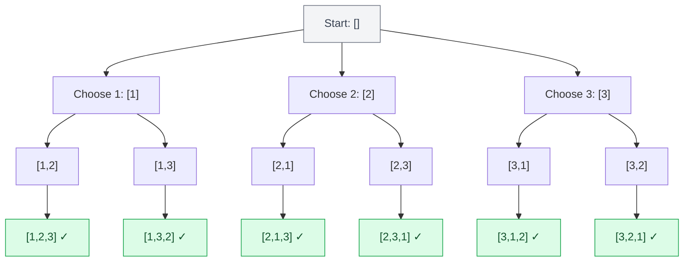
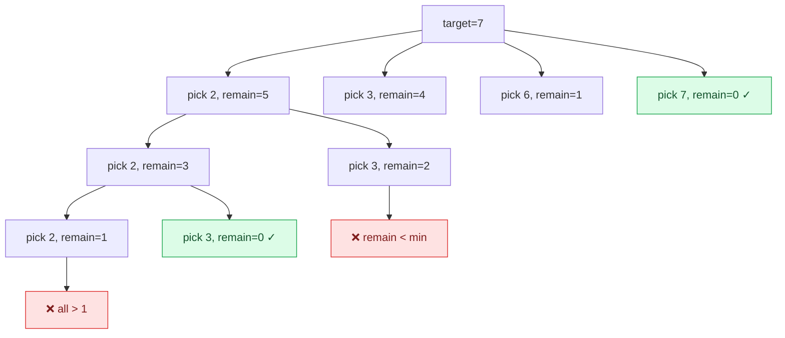

<div class="vtn-hero" style="margin-left: 0; margin-right: 0; padding: 2.5rem 2rem;">
<span class="vtn-tag">Pattern</span>
<h1 style="font-size: 2.2rem !important;">Backtracking</h1>
<p class="vtn-subtitle">Backtracking is controlled brute force. You explore all candidates systematically, abandoning a path as soon as you know it can't lead to a valid solution. It solves "generate all X" problems that seem exponential — because they ARE exponential, but pruning makes them fast enough.</p>
<div class="vtn-stats">
<div class="vtn-stat"><span class="vtn-stat-number">3</span><span class="vtn-stat-label">Templates</span></div>
<div class="vtn-stat"><span class="vtn-stat-number">12+</span><span class="vtn-stat-label">Problems</span></div>
<div class="vtn-stat"><span class="vtn-stat-number">Medium</span><span class="vtn-stat-label">Frequency</span></div>
</div>
</div>

---

## Core Concept

Backtracking builds a solution incrementally, one piece at a time. At each step, it:

1. **Chooses** — picks a candidate from the remaining options
2. **Explores** — recurses with that choice added
3. **Un-chooses** — removes the choice (backtrack) and tries the next option



---

## Pattern Recognition

| Signal in Problem | Backtracking Type | Example |
|---|---|---|
| "Generate all permutations" | Permutation | Permutations (LC #46) |
| "Generate all combinations" | Combination | Combination Sum (LC #39) |
| "Generate all subsets" | Subset | Subsets (LC #78) |
| "Find all valid configurations" | Constraint satisfaction | N-Queens (LC #51) |
| "Can you partition into..." | Partition | Partition to K Equal Subsets |
| "Word exists in grid" | Grid search | Word Search (LC #79) |
| "Generate all valid X" | Constrained generation | Generate Parentheses (LC #22) |
| "Solve this puzzle" | Constraint satisfaction | Sudoku Solver (LC #37) |

!!! tip "When NOT to Use Backtracking"
    If the problem asks for **count** of solutions (not the actual solutions) and n is large, use DP instead. Backtracking generates — DP counts.

---

## The Three Templates

### Template 1: Permutations (order matters, use all elements)

```java
// All arrangements of n elements: n! results
public List<List<Integer>> permute(int[] nums) {
    List<List<Integer>> result = new ArrayList<>();
    backtrack(nums, new ArrayList<>(), new boolean[nums.length], result);
    return result;
}

private void backtrack(int[] nums, List<Integer> current, boolean[] used, List<List<Integer>> result) {
    if (current.size() == nums.length) {
        result.add(new ArrayList<>(current)); // COPY — current mutates
        return;
    }
    for (int i = 0; i < nums.length; i++) {
        if (used[i]) continue;
        used[i] = true;
        current.add(nums[i]);
        backtrack(nums, current, used, result);
        current.removeLast();  // UNDO
        used[i] = false;       // UNDO
    }
}
```

**Key points:**

- Use `boolean[] used` to track which elements are in the current path
- Loop through ALL elements each time (order matters)
- Time: O(n × n!), Space: O(n) recursion depth

---

### Template 2: Combinations (order doesn't matter, choose k from n)

```java
// Choose k elements from n: C(n,k) results
public List<List<Integer>> combine(int n, int k) {
    List<List<Integer>> result = new ArrayList<>();
    backtrack(1, n, k, new ArrayList<>(), result);
    return result;
}

private void backtrack(int start, int n, int k, List<Integer> current, List<List<Integer>> result) {
    if (current.size() == k) {
        result.add(new ArrayList<>(current));
        return;
    }
    for (int i = start; i <= n; i++) { // start from 'start' — no going back
        current.add(i);
        backtrack(i + 1, n, k, current, result); // i+1 prevents reuse
        current.removeLast();
    }
}
```

**Key points:**

- Pass `start` index to avoid generating duplicates (since order doesn't matter)
- For "with repetition" (like Combination Sum): use `i` instead of `i + 1`
- Pruning: if `current.size() + (n - i + 1) < k`, not enough elements left — skip

---

### Template 3: Subsets (all possible subsets)

```java
// All subsets: 2^n results
public List<List<Integer>> subsets(int[] nums) {
    List<List<Integer>> result = new ArrayList<>();
    backtrack(nums, 0, new ArrayList<>(), result);
    return result;
}

private void backtrack(int[] nums, int start, List<Integer> current, List<List<Integer>> result) {
    result.add(new ArrayList<>(current)); // every state is a valid subset
    for (int i = start; i < nums.length; i++) {
        current.add(nums[i]);
        backtrack(nums, i + 1, current, result);
        current.removeLast();
    }
}
```

**Key points:**

- Same as combinations, but **no base case size check** — collect at every node, not just leaves
- For subsets with duplicates: sort input, then `if (i > start && nums[i] == nums[i-1]) continue`

---

## Handling Duplicates

When the input has duplicate elements, you'll generate duplicate solutions unless you prune:

```java
// Subsets II (LC #90) — input may have duplicates
private void backtrack(int[] nums, int start, List<Integer> current, List<List<Integer>> result) {
    result.add(new ArrayList<>(current));
    for (int i = start; i < nums.length; i++) {
        // SKIP duplicates at the SAME decision level
        if (i > start && nums[i] == nums[i - 1]) continue;
        current.add(nums[i]);
        backtrack(nums, i + 1, current, result);
        current.removeLast();
    }
}
```

!!! warning "Must Sort First"
    Duplicate skipping only works if the array is sorted. Always `Arrays.sort(nums)` before calling backtrack when dealing with duplicates.

The logic: at the same recursion level (same `start`), if we've already tried a value, skip all subsequent identical values. But at deeper levels, duplicates ARE allowed (that's `i > start`, not `i > 0`).

---

## Pruning — The Difference Between TLE and Accepted

Pruning means cutting branches of the decision tree early when you can prove they won't lead to valid solutions.

| Pruning Strategy | When to Use | Example |
|---|---|---|
| **Sort + skip duplicates** | Input has duplicates | Subsets II, Permutations II |
| **Running sum check** | Target-based problems | Combination Sum: if current sum > target, stop |
| **Remaining capacity check** | Size-limited problems | If not enough elements left to fill, stop |
| **Constraint violation** | Grid/puzzle problems | N-Queens: check column/diagonal before placing |
| **Sorted + break** | If adding current exceeds target, all future will too | Combination Sum: `if (candidates[i] > remaining) break` |

---

## Solved Walkthroughs

### Combination Sum (LC #39)

**Problem:** Given candidates (no duplicates, reusable) and target, find all unique combinations that sum to target.

**Decision tree** (target=7, candidates=[2,3,6,7]):



```java
public List<List<Integer>> combinationSum(int[] candidates, int target) {
    List<List<Integer>> result = new ArrayList<>();
    Arrays.sort(candidates); // enables pruning
    backtrack(candidates, target, 0, new ArrayList<>(), result);
    return result;
}

private void backtrack(int[] candidates, int remaining, int start, 
                       List<Integer> current, List<List<Integer>> result) {
    if (remaining == 0) {
        result.add(new ArrayList<>(current));
        return;
    }
    for (int i = start; i < candidates.length; i++) {
        if (candidates[i] > remaining) break; // PRUNE: sorted, so all after are too large
        current.add(candidates[i]);
        backtrack(candidates, remaining - candidates[i], i, current, result); // i, not i+1 (reuse allowed)
        current.removeLast();
    }
}
```

**Complexity:** O(n^(T/M)) where T=target, M=min candidate. Space: O(T/M) recursion depth.

---

### N-Queens (LC #51)

**Problem:** Place N queens on an N×N board so no two attack each other.

**Constraint:** No two queens share a row, column, or diagonal.

**Key insight:** Place one queen per row. For each row, try each column. Check constraints before placing.

```java
public List<List<String>> solveNQueens(int n) {
    List<List<String>> result = new ArrayList<>();
    Set<Integer> cols = new HashSet<>();
    Set<Integer> diag1 = new HashSet<>(); // row - col (same for all cells on a diagonal)
    Set<Integer> diag2 = new HashSet<>(); // row + col (same for all cells on anti-diagonal)
    backtrack(n, 0, new int[n], cols, diag1, diag2, result);
    return result;
}

private void backtrack(int n, int row, int[] queens, Set<Integer> cols,
                       Set<Integer> diag1, Set<Integer> diag2, List<List<String>> result) {
    if (row == n) {
        result.add(buildBoard(queens, n));
        return;
    }
    for (int col = 0; col < n; col++) {
        if (cols.contains(col) || diag1.contains(row - col) || diag2.contains(row + col)) {
            continue; // PRUNE: constraint violated
        }
        queens[row] = col;
        cols.add(col);
        diag1.add(row - col);
        diag2.add(row + col);

        backtrack(n, row + 1, queens, cols, diag1, diag2, result);

        cols.remove(col);       // UNDO
        diag1.remove(row - col);
        diag2.remove(row + col);
    }
}
```

**Diagonal trick:** All cells on the same diagonal have the same `row - col` value. All cells on the same anti-diagonal have the same `row + col` value. Using HashSets gives O(1) conflict checking.

---

### Generate Parentheses (LC #22)

**Problem:** Generate all valid combinations of n pairs of parentheses.

**Key insight:** At each position, you can add `(` if open count < n, or `)` if close count < open count.

```java
public List<String> generateParenthesis(int n) {
    List<String> result = new ArrayList<>();
    backtrack(n, 0, 0, new StringBuilder(), result);
    return result;
}

private void backtrack(int n, int open, int close, StringBuilder sb, List<String> result) {
    if (sb.length() == 2 * n) {
        result.add(sb.toString());
        return;
    }
    if (open < n) {
        sb.append('(');
        backtrack(n, open + 1, close, sb, result);
        sb.deleteCharAt(sb.length() - 1);
    }
    if (close < open) {
        sb.append(')');
        backtrack(n, open, close + 1, sb, result);
        sb.deleteCharAt(sb.length() - 1);
    }
}
```

**Why this is elegant:** The constraints (`open < n` and `close < open`) act as built-in pruning. We never generate invalid parentheses — every path we explore is valid. No wasted work.

---

## Common Mistakes

| Mistake | Why It's Wrong | Fix |
|---|---|---|
| Forgetting to copy the list on add | `current` mutates — you'll end up with empty lists | `result.add(new ArrayList<>(current))` |
| Not undoing the choice | State leaks between branches → wrong answers | Always undo after recursive call (remove + unset) |
| Using `i > 0` instead of `i > start` for dedup | Skips valid choices at deeper levels | `i > start` skips only same-level duplicates |
| Not sorting before duplicate handling | Duplicates won't be adjacent → skip logic fails | Always `Arrays.sort()` first |
| Forgetting that combinations need `start` param | Without it, [1,2] and [2,1] both generated | Pass start index, loop from `start` |
| Using String concatenation in loop | Creates O(n) new strings per append → TLE | Use `StringBuilder`, delete last char to undo |

---

## Backtracking vs. Other Approaches

| Approach | When to Use | Time | Example |
|---|---|---|---|
| **Backtracking** | Generate ALL valid solutions | Exponential (but pruned) | N-Queens, Sudoku |
| **DP** | COUNT solutions or find OPTIMAL | Polynomial (usually) | Coin Change, Climbing Stairs |
| **BFS** | Find SHORTEST path to a solution | O(V+E) | Word Ladder |
| **Greedy** | Single optimal choice at each step | O(n log n) | Interval Scheduling |

---

## Practice Problems

| # | Problem | Type | Difficulty | Key Insight |
|---|---|---|---|---|
| 46 | Permutations | Permutation | Medium | Used array, iterate all positions |
| 47 | Permutations II | Permutation + dedup | Medium | Sort + skip same-level duplicates |
| 78 | Subsets | Subset | Medium | Collect at every node |
| 90 | Subsets II | Subset + dedup | Medium | Sort + `i > start` skip |
| 39 | Combination Sum | Combination | Medium | Reuse allowed (pass `i` not `i+1`) |
| 40 | Combination Sum II | Combination + dedup | Medium | No reuse + sort + dedup |
| 22 | Generate Parentheses | Constrained gen | Medium | open < n, close < open |
| 79 | Word Search | Grid backtrack | Medium | Mark visited, 4-directional DFS |
| 51 | N-Queens | Constraint satisfaction | Hard | Col + diagonal sets for O(1) check |
| 37 | Sudoku Solver | Constraint satisfaction | Hard | Row/col/box sets + early termination |
| 131 | Palindrome Partitioning | Partition | Medium | isPalindrome check as pruning |
| 17 | Letter Combinations of Phone | Combination | Medium | Mapping + iterate each digit's chars |
| 93 | Restore IP Addresses | Constrained gen | Medium | 1-3 digits per segment, validate range |
| 698 | Partition to K Equal Subsets | Partition | Medium | Sort descending for better pruning |

---

## Interview Tips

!!! tip "What Signals Success"
    - **Draw the decision tree first.** Even a partial tree shows the interviewer you understand the branching structure. Takes 30 seconds, saves 5 minutes of confusion.
    - **State the time complexity.** "This generates all permutations so it's O(n × n!)" or "There are 2^n subsets." Don't be afraid of exponential — if the constraints are small (n ≤ 15), it's expected.
    - **Identify pruning opportunities.** After writing the basic solution, say "Here I can prune by X" — this is the seniority signal.
    - **Use the template.** All backtracking follows choose → explore → un-choose. If you internalize this, the code writes itself and you can focus on the problem-specific logic.
