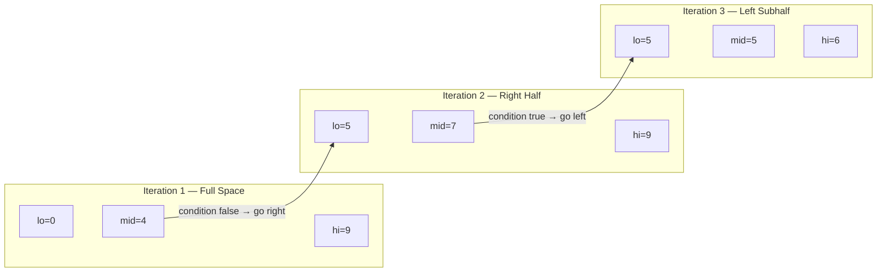
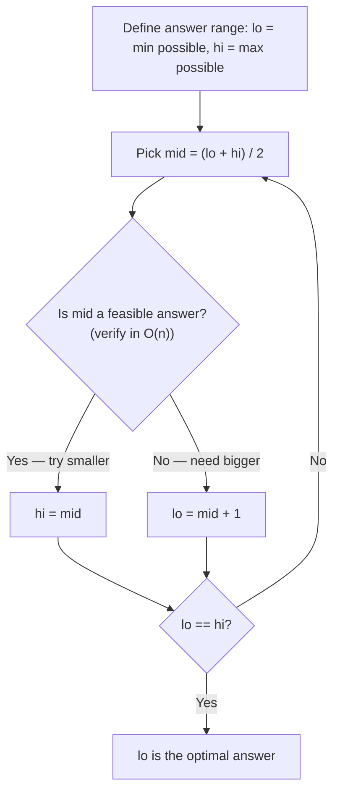
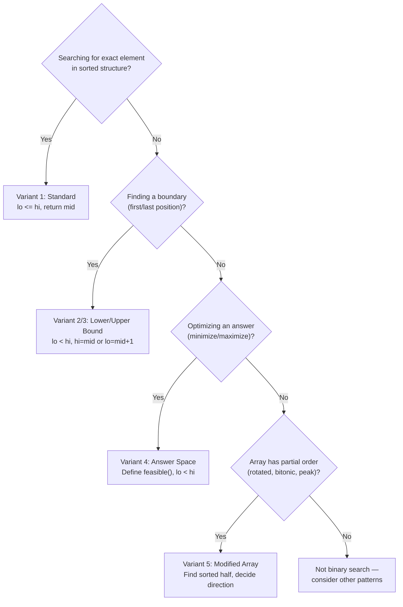

# Binary Search

<div class="vtn-hero" style="margin-left: 0; margin-right: 0; padding: 2.5rem 2rem;">
<span class="vtn-tag">Pattern #3</span>
<h1 style="font-size: 2.2rem !important;">Binary Search — Beyond Sorted Arrays</h1>
<p class="vtn-subtitle">Binary search is not "search in sorted array." It is: find the boundary where a monotonic property flips from false to true, by halving the search space. Once you see it this way, you unlock rotated arrays, answer-space optimization, and matrix search — the problems that separate L4 from L5 offers.</p>
<div class="vtn-stats">
<div class="vtn-stat"><span class="vtn-stat-number">5</span><span class="vtn-stat-label">Variants</span></div>
<div class="vtn-stat"><span class="vtn-stat-number">3</span><span class="vtn-stat-label">Walkthroughs</span></div>
<div class="vtn-stat"><span class="vtn-stat-number">15</span><span class="vtn-stat-label">Practice Problems</span></div>
</div>
</div>

---

## Core Concept — The Three Ingredients

Every binary search problem requires exactly three things:

1. **Search space** — a range `[lo, hi]` where the answer lives
2. **Monotonic condition** — a predicate `f(x)` that is `false` for all values below some threshold and `true` for all values above it (or vice versa)
3. **Halving rule** — based on evaluating `f(mid)`, discard half the search space

!!! tip "The Universal Mental Model"
    Stop thinking "is this array sorted?" Instead ask: **"Is there a monotonic property I can exploit to eliminate half the candidates each step?"** If yes — binary search applies.

### How Binary Search Eliminates Half Each Iteration



**Complexity:** From n candidates to 1 in O(log n) steps. For n = 1,000,000 that is only 20 iterations.

---

## Why Off-By-One Errors Happen

The #1 source of bugs in binary search is the loop condition and boundary updates. Here is why:

| Loop Style | When to Use | Key Property |
|---|---|---|
| `while (lo <= hi)` | Exact match search. Every element is checked. | Loop ends when `lo > hi` (space is empty). |
| `while (lo < hi)` | Finding a boundary (lower/upper bound). | Loop ends when `lo == hi` (one candidate left). |
| `while (lo + 1 < hi)` | When you want to avoid adjacent-element edge cases. | Loop ends with `lo` and `hi` adjacent — post-process both. |

!!! warning "The Golden Rule"
    If you use `lo < hi`, you must ensure `mid` can never equal `hi` (use `mid = lo + (hi - lo) / 2`). If you use `lo <= hi`, you **must** have a `return` inside the loop or update both `lo` and `hi` past `mid` to avoid infinite loops.

---

## Five Variants

### Variant 1 — Standard Binary Search (Exact Match)

Find the index of `target` in a sorted array, or return -1.

=== "Template"

    ```java
    int binarySearch(int[] nums, int target) {
        int lo = 0, hi = nums.length - 1;
        while (lo <= hi) {
            int mid = lo + (hi - lo) / 2;
            if (nums[mid] == target) return mid;
            else if (nums[mid] < target) lo = mid + 1;
            else hi = mid - 1;
        }
        return -1;
    }
    ```

=== "Why lo <= hi?"

    ```java
    // We need to check every element including when lo == hi
    // (single element remaining). Using lo < hi would skip
    // the last comparison.
    //
    // Both lo and hi move PAST mid:
    //   lo = mid + 1
    //   hi = mid - 1
    // This guarantees the search space shrinks every iteration.
    ```

---

### Variant 2 — Lower Bound (First Element >= Target)

Returns the leftmost insertion point. Equivalent to C++ `lower_bound` or Java's `Collections.binarySearch` when element is not found.

=== "Template"

    ```java
    int lowerBound(int[] nums, int target) {
        int lo = 0, hi = nums.length; // hi = length (past-end)
        while (lo < hi) {
            int mid = lo + (hi - lo) / 2;
            if (nums[mid] < target) lo = mid + 1;
            else hi = mid; // nums[mid] >= target, could be answer
        }
        return lo; // first index where nums[i] >= target
    }
    ```

=== "Why hi = mid (not mid - 1)?"

    ```java
    // When nums[mid] >= target, mid MIGHT be the answer.
    // We can't discard it. So hi = mid keeps it in the space.
    // Combined with lo < hi and mid = lo + (hi-lo)/2,
    // this guarantees convergence: when lo == hi, that's our answer.
    //
    // If we used hi = mid - 1 here, we could skip the actual answer.
    ```

---

### Variant 3 — Upper Bound (First Element > Target)

Returns the index after the last occurrence of `target`. Useful for counting occurrences: `upperBound - lowerBound`.

=== "Template"

    ```java
    int upperBound(int[] nums, int target) {
        int lo = 0, hi = nums.length;
        while (lo < hi) {
            int mid = lo + (hi - lo) / 2;
            if (nums[mid] <= target) lo = mid + 1;
            else hi = mid; // nums[mid] > target, could be answer
        }
        return lo; // first index where nums[i] > target
    }
    ```

=== "Difference from Lower Bound"

    ```java
    // The ONLY difference: the condition uses <= instead of <
    // Lower bound: nums[mid] < target  → go right
    // Upper bound: nums[mid] <= target → go right
    //
    // This means upper bound skips past elements EQUAL to target,
    // landing on the first element strictly greater.
    ```

---

### Variant 4 — Binary Search on Answer Space

The most powerful variant. Instead of searching an array, you search a range of possible answers.

=== "Template"

    ```java
    // Minimize x such that feasible(x) is true
    int binarySearchOnAnswer(int lo, int hi) {
        while (lo < hi) {
            int mid = lo + (hi - lo) / 2;
            if (feasible(mid)) {
                hi = mid; // mid works, but maybe smaller works too
            } else {
                lo = mid + 1; // mid doesn't work, need bigger
            }
        }
        return lo;
    }

    // Maximize x such that feasible(x) is true
    int binarySearchOnAnswerMax(int lo, int hi) {
        while (lo < hi) {
            int mid = lo + (hi - lo + 1) / 2; // ceil division!
            if (feasible(mid)) {
                lo = mid; // mid works, but maybe bigger works too
            } else {
                hi = mid - 1; // mid doesn't work, need smaller
            }
        }
        return lo;
    }
    ```

=== "Why Ceiling Division for Maximize?"

    ```java
    // When maximizing: lo = mid means lo might not advance.
    // Example: lo=3, hi=4 → mid = 3 + (4-3)/2 = 3 → lo=3 → infinite loop!
    // Fix: mid = lo + (hi - lo + 1) / 2 → mid = 3 + (4-3+1)/2 = 4
    //
    // Rule: if lo = mid is in your code, use CEILING division.
    //        if hi = mid is in your code, use FLOOR division (default).
    ```

!!! tip "When to Use Answer-Space Binary Search"
    Ask yourself: "If someone told me the answer is X, can I verify it efficiently (usually O(n))?" If yes, binary search on X.

---

### Variant 5 — Binary Search on Rotated/Modified Arrays

The array is not fully sorted, but it has structure you can exploit (one or both halves are sorted).

=== "Template"

    ```java
    int searchRotated(int[] nums, int target) {
        int lo = 0, hi = nums.length - 1;
        while (lo <= hi) {
            int mid = lo + (hi - lo) / 2;
            if (nums[mid] == target) return mid;

            // Determine which half is sorted
            if (nums[lo] <= nums[mid]) {
                // Left half is sorted
                if (nums[lo] <= target && target < nums[mid]) {
                    hi = mid - 1; // target in sorted left half
                } else {
                    lo = mid + 1; // target in right half
                }
            } else {
                // Right half is sorted
                if (nums[mid] < target && target <= nums[hi]) {
                    lo = mid + 1; // target in sorted right half
                } else {
                    hi = mid - 1; // target in left half
                }
            }
        }
        return -1;
    }
    ```

=== "Key Insight"

    ```java
    // In a rotated sorted array, at any mid point,
    // at least ONE half is always perfectly sorted.
    //
    // Strategy:
    // 1. Find which half is sorted (compare endpoints)
    // 2. Check if target falls in the sorted half (simple range check)
    // 3. If yes → search that half. If no → search the other half.
    //
    // This works because range checks are trivial on sorted segments.
    ```

---

## The Answer-Space Binary Search Deep Dive

???+ question "When does binary search apply to optimization problems?"
    **Whenever the answer has a monotonic feasibility property.** If answer = X is feasible, then all answers > X (or < X) are also feasible. You are searching for the boundary between feasible and infeasible.

### The Paradigm



### Example 1: Koko Eating Bananas (LC #875)

**Problem:** Koko has `n` piles of bananas. She can eat at speed `k` bananas/hour (one pile per hour, even if she finishes early). Find the minimum `k` such that she finishes all piles within `h` hours.

**Monotonic property:** If Koko can finish at speed `k`, she can also finish at speed `k+1`. We want the minimum feasible `k`.

=== "Solution"

    ```java
    int minEatingSpeed(int[] piles, int h) {
        int lo = 1, hi = Arrays.stream(piles).max().getAsInt();
        while (lo < hi) {
            int mid = lo + (hi - lo) / 2;
            if (canFinish(piles, mid, h)) {
                hi = mid;
            } else {
                lo = mid + 1;
            }
        }
        return lo;
    }

    boolean canFinish(int[] piles, int speed, int h) {
        int hours = 0;
        for (int pile : piles) {
            hours += (pile + speed - 1) / speed; // ceiling division
        }
        return hours <= h;
    }
    ```

=== "Complexity"

    ```
    Time:  O(n * log(max_pile))
           - Binary search: log(max_pile) iterations
           - Each feasibility check: O(n)
    Space: O(1)
    ```

### Example 2: Split Array Largest Sum (LC #410)

**Problem:** Split array into `m` subarrays to minimize the largest subarray sum.

**Monotonic property:** If we can split with max sum = X, we can certainly split with max sum = X+1 (same split works). We want the minimum feasible X.

=== "Solution"

    ```java
    int splitArray(int[] nums, int m) {
        int lo = Arrays.stream(nums).max().getAsInt(); // at least the largest element
        int hi = Arrays.stream(nums).sum(); // worst case: one group
        while (lo < hi) {
            int mid = lo + (hi - lo) / 2;
            if (canSplit(nums, m, mid)) {
                hi = mid;
            } else {
                lo = mid + 1;
            }
        }
        return lo;
    }

    boolean canSplit(int[] nums, int m, int maxSum) {
        int groups = 1, currentSum = 0;
        for (int num : nums) {
            if (currentSum + num > maxSum) {
                groups++;
                currentSum = num;
                if (groups > m) return false;
            } else {
                currentSum += num;
            }
        }
        return true;
    }
    ```

=== "Complexity"

    ```
    Time:  O(n * log(sum - max))
    Space: O(1)
    ```

---

## Solved Walkthroughs

### Problem 1: Search in Rotated Sorted Array (LC #33)

???+ question "Problem Statement"
    Given a rotated sorted array with distinct values and a target, return the index of target or -1. Must run in O(log n).

**Brute Force:** Linear scan — O(n). Fails the O(log n) requirement.

**Insight:** At any midpoint, one half is guaranteed sorted. Use that sorted half to determine where target could be.

=== "Code"

    ```java
    int search(int[] nums, int target) {
        int lo = 0, hi = nums.length - 1;
        while (lo <= hi) {
            int mid = lo + (hi - lo) / 2;
            if (nums[mid] == target) return mid;

            if (nums[lo] <= nums[mid]) {
                // Left half [lo..mid] is sorted
                if (nums[lo] <= target && target < nums[mid]) {
                    hi = mid - 1;
                } else {
                    lo = mid + 1;
                }
            } else {
                // Right half [mid..hi] is sorted
                if (nums[mid] < target && target <= nums[hi]) {
                    lo = mid + 1;
                } else {
                    hi = mid - 1;
                }
            }
        }
        return -1;
    }
    ```

=== "Dry Run"

    ```
    nums = [4, 5, 6, 7, 0, 1, 2], target = 0

    Iter 1: lo=0, hi=6, mid=3 → nums[3]=7 ≠ 0
            nums[0]=4 <= nums[3]=7 → left sorted
            Is 4 <= 0 < 7? NO → lo = 4

    Iter 2: lo=4, hi=6, mid=5 → nums[5]=1 ≠ 0
            nums[4]=0 <= nums[5]=1 → left sorted
            Is 0 <= 0 < 1? YES → hi = 4

    Iter 3: lo=4, hi=4, mid=4 → nums[4]=0 == 0 → return 4 ✓
    ```

=== "Complexity"

    ```
    Time:  O(log n)
    Space: O(1)
    ```

!!! warning "Common Mistake"
    Using `nums[lo] < nums[mid]` instead of `nums[lo] <= nums[mid]`. When `lo == mid` (two elements left), the left "half" is just one element and IS sorted. The `<=` handles this edge case.

---

### Problem 2: Find First and Last Position (LC #34)

???+ question "Problem Statement"
    Given a sorted array and target, find the starting and ending position. Return [-1, -1] if not found. Must be O(log n).

**Brute Force:** Linear scan for first and last — O(n).

**Insight:** This is literally lower_bound + upper_bound - 1.

=== "Code"

    ```java
    int[] searchRange(int[] nums, int target) {
        int first = lowerBound(nums, target);
        if (first == nums.length || nums[first] != target) {
            return new int[]{-1, -1};
        }
        int last = upperBound(nums, target) - 1;
        return new int[]{first, last};
    }

    int lowerBound(int[] nums, int target) {
        int lo = 0, hi = nums.length;
        while (lo < hi) {
            int mid = lo + (hi - lo) / 2;
            if (nums[mid] < target) lo = mid + 1;
            else hi = mid;
        }
        return lo;
    }

    int upperBound(int[] nums, int target) {
        int lo = 0, hi = nums.length;
        while (lo < hi) {
            int mid = lo + (hi - lo) / 2;
            if (nums[mid] <= target) lo = mid + 1;
            else hi = mid;
        }
        return lo;
    }
    ```

=== "Dry Run"

    ```
    nums = [5, 7, 7, 8, 8, 10], target = 8

    lowerBound(8):
      lo=0, hi=6 → mid=3, nums[3]=8 >= 8 → hi=3
      lo=0, hi=3 → mid=1, nums[1]=7 < 8  → lo=2
      lo=2, hi=3 → mid=2, nums[2]=7 < 8  → lo=3
      lo=3, hi=3 → return 3 ✓ (first 8)

    upperBound(8):
      lo=0, hi=6 → mid=3, nums[3]=8 <= 8 → lo=4
      lo=4, hi=6 → mid=5, nums[5]=10 > 8 → hi=5
      lo=4, hi=5 → mid=4, nums[4]=8 <= 8 → lo=5
      lo=5, hi=5 → return 5

    last = 5 - 1 = 4 ✓ (last 8)
    Result: [3, 4]
    ```

=== "Complexity"

    ```
    Time:  O(log n) — two binary searches
    Space: O(1)
    ```

---

### Problem 3: Koko Eating Bananas (LC #875)

???+ question "Problem Statement"
    Koko loves eating bananas. There are `n` piles. The `i`-th pile has `piles[i]` bananas. Guards return in `h` hours. Koko eats at speed `k` bananas/hour (picks one pile per hour). Find the minimum integer `k` such that she can eat all bananas within `h` hours.

**Brute Force:** Try k = 1, 2, 3, ... until feasible. O(max_pile * n).

**Insight:** If k works, k+1 also works. Monotonic! Binary search on k in [1, max(piles)].

=== "Code"

    ```java
    int minEatingSpeed(int[] piles, int h) {
        int lo = 1;
        int hi = 0;
        for (int p : piles) hi = Math.max(hi, p);

        while (lo < hi) {
            int mid = lo + (hi - lo) / 2;
            if (canFinish(piles, mid, h)) {
                hi = mid; // mid works, try slower
            } else {
                lo = mid + 1; // mid too slow
            }
        }
        return lo;
    }

    boolean canFinish(int[] piles, int speed, int h) {
        int totalHours = 0;
        for (int pile : piles) {
            totalHours += (pile + speed - 1) / speed;
            if (totalHours > h) return false; // early exit
        }
        return true;
    }
    ```

=== "Why This is Answer-Space Binary Search"

    ```
    Search space: [1, max(piles)]  — possible eating speeds
    Monotonic:    canFinish(speed) is false...false...true...true
    Halving:      if mid works → try smaller (hi = mid)
                  if mid fails → need bigger (lo = mid + 1)
    Feasibility:  O(n) per check

    We never search an array. We search the ANSWER itself.
    ```

=== "Complexity"

    ```
    Time:  O(n * log(max_pile))
           n = number of piles, max_pile up to 10^9
           log(10^9) ≈ 30 iterations
    Space: O(1)
    ```

---

## Off-By-One Error Prevention — Decision Table

Use this table to pick the right template for your problem:

| Problem Type | Loop | `lo` init | `hi` init | Update on "yes" | Update on "no" | `mid` formula | Return |
|---|---|---|---|---|---|---|---|
| Exact match | `lo <= hi` | `0` | `n-1` | `return mid` | `lo=mid+1` / `hi=mid-1` | `lo+(hi-lo)/2` | -1 if not found |
| First >= target (lower bound) | `lo < hi` | `0` | `n` | `hi = mid` | `lo = mid + 1` | `lo+(hi-lo)/2` | `lo` |
| First > target (upper bound) | `lo < hi` | `0` | `n` | `hi = mid` | `lo = mid + 1` | `lo+(hi-lo)/2` | `lo` |
| Minimize answer | `lo < hi` | `min_ans` | `max_ans` | `hi = mid` | `lo = mid + 1` | `lo+(hi-lo)/2` | `lo` |
| Maximize answer | `lo < hi` | `min_ans` | `max_ans` | `lo = mid` | `hi = mid - 1` | `lo+(hi-lo+1)/2` | `lo` |
| Rotated array | `lo <= hi` | `0` | `n-1` | `return mid` | depends on sorted half | `lo+(hi-lo)/2` | -1 if not found |

!!! tip "The Memorization Trick"
    **"hi = mid → floor division. lo = mid → ceiling division."** This one rule eliminates 90% of infinite-loop bugs.

---

## Common Mistakes

!!! danger "1. Integer Overflow in Mid Calculation"
    ```java
    // WRONG — overflows when lo + hi > Integer.MAX_VALUE
    int mid = (lo + hi) / 2;

    // CORRECT — always safe
    int mid = lo + (hi - lo) / 2;
    ```

!!! danger "2. Infinite Loop from Wrong Mid Formula"
    ```java
    // When you have: lo = mid (maximize pattern)
    // and use floor division: mid = lo + (hi - lo) / 2
    // Example: lo=3, hi=4 → mid=3 → lo=3 → INFINITE LOOP

    // Fix: use ceiling division
    int mid = lo + (hi - lo + 1) / 2;
    ```

!!! danger "3. Forgetting to Handle Empty Result in Lower Bound"
    ```java
    // lowerBound returns nums.length if ALL elements < target
    int idx = lowerBound(nums, target);
    // MUST check: idx < nums.length && nums[idx] == target
    // before using the result!
    ```

!!! danger "4. Wrong Comparison in Rotated Array"
    ```java
    // WRONG: using strict < instead of <=
    if (nums[lo] < nums[mid]) // fails when lo == mid

    // CORRECT: includes the case where left "half" is one element
    if (nums[lo] <= nums[mid])
    ```

!!! danger "5. Off-by-One in Answer Space Bounds"
    ```java
    // For Koko eating bananas:
    // WRONG: lo = 0 → division by zero in feasibility check
    // CORRECT: lo = 1 (minimum meaningful speed)

    // For split array largest sum:
    // WRONG: lo = 0 → can't fit the largest element
    // CORRECT: lo = max(nums) → at minimum, one group holds the biggest element
    ```

!!! danger "6. Returning Wrong Value After Loop"
    ```java
    // With lo < hi loop, after exit: lo == hi == answer
    // Returning hi or lo both work — they are equal.

    // With lo <= hi loop, lo and hi have CROSSED.
    // lo = hi + 1 after exit. Know which one you need:
    //   - lo is the insertion point (first element > last checked)
    //   - hi is the last valid index checked
    ```

---

## Practice Problems

### Variant 1 — Standard Binary Search

| # | Problem | Difficulty | Key Insight |
|---|---|---|---|
| 704 | Binary Search | Easy | Pure template |
| 374 | Guess Number Higher or Lower | Easy | API-based binary search |
| 74 | Search a 2D Matrix | Medium | Flatten 2D to 1D index |

### Variant 2 & 3 — Lower/Upper Bound

| # | Problem | Difficulty | Key Insight |
|---|---|---|---|
| 34 | Find First and Last Position | Medium | Two binary searches |
| 35 | Search Insert Position | Easy | Literally lower_bound |
| 2300 | Successful Pairs of Spells and Potions | Medium | Sort + lower_bound per spell |

### Variant 4 — Answer Space Binary Search

| # | Problem | Difficulty | Key Insight |
|---|---|---|---|
| 875 | Koko Eating Bananas | Medium | Minimize speed, verify in O(n) |
| 410 | Split Array Largest Sum | Hard | Minimize max sum, greedy verify |
| 1011 | Capacity to Ship Packages | Medium | Same pattern as split array |
| 1482 | Min Days to Make M Bouquets | Medium | Binary search on days |
| 668 | Kth Smallest in Multiplication Table | Hard | Count elements <= mid |
| 774 | Minimize Max Distance to Gas Station | Hard | Binary search on distance (float) |

### Variant 5 — Rotated/Modified Arrays

| # | Problem | Difficulty | Key Insight |
|---|---|---|---|
| 33 | Search in Rotated Sorted Array | Medium | One half always sorted |
| 153 | Find Minimum in Rotated Sorted Array | Medium | Compare mid with hi |
| 162 | Find Peak Element | Medium | Climb toward bigger neighbor |

---

## Summary — The Binary Search Decision Flowchart



!!! tip "Interview Tip"
    When you identify binary search, tell your interviewer: "I notice a monotonic property here — [describe it]. I'll binary search on [the search space] with [the feasibility condition]." This shows structured thinking and gives them confidence you won't get lost in off-by-one bugs.
