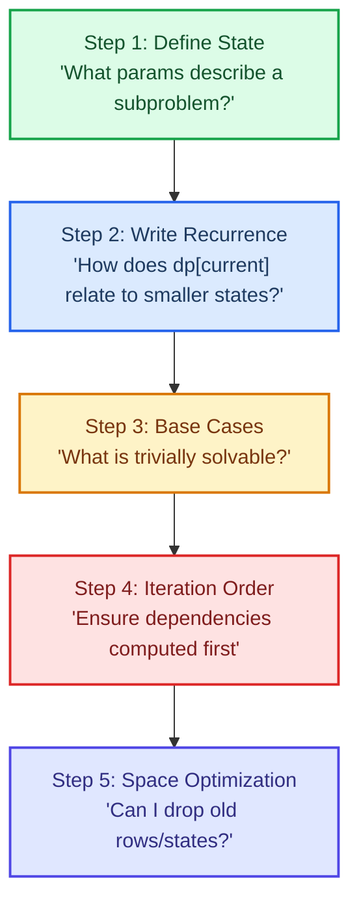
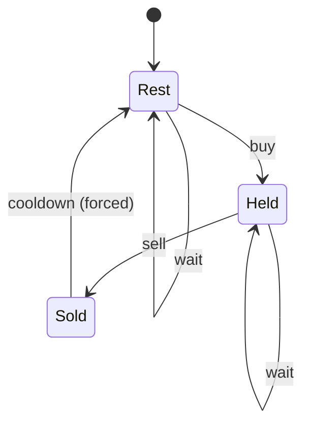
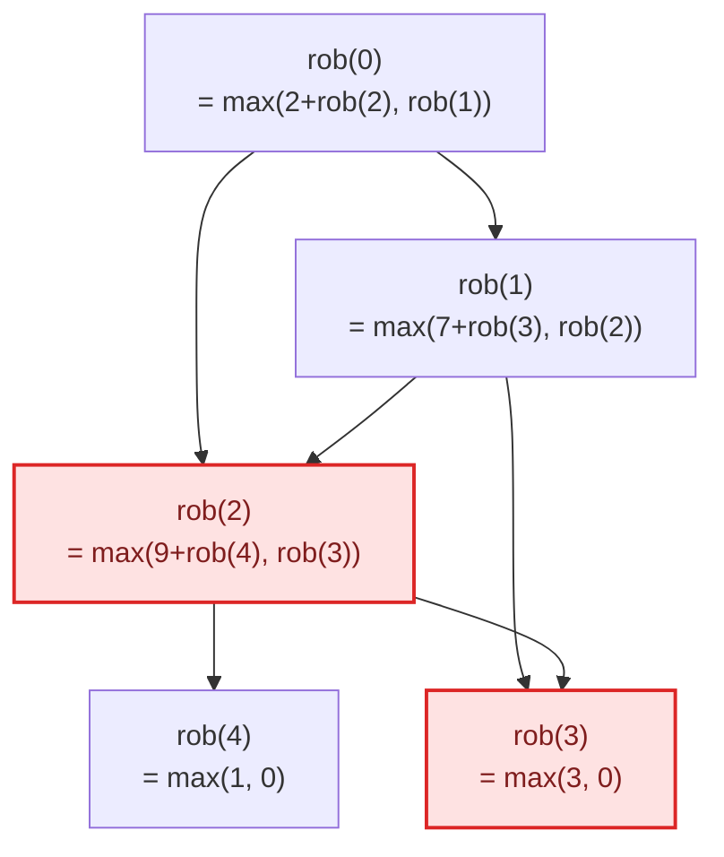
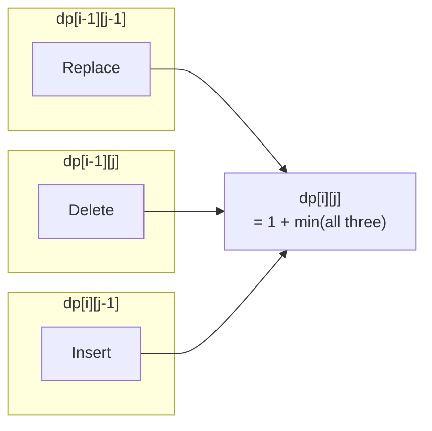

<div class="vtn-hero" style="margin-left: 0; margin-right: 0; padding: 2.5rem 2rem;">
<span class="vtn-tag">Pattern #9</span>
<h1 style="font-size: 2.2rem !important;">Dynamic Programming</h1>
<p class="vtn-subtitle">DP is the #1 topic people fear. But it is learnable: define state, write recurrence, handle base cases, iterate. Every DP problem follows this recipe. Once you internalize the framework, the "magic" disappears and it becomes mechanical pattern matching.</p>
<div class="vtn-stats">
<div class="vtn-stat"><span class="vtn-stat-number">7</span><span class="vtn-stat-label">Categories</span></div>
<div class="vtn-stat"><span class="vtn-stat-number">4</span><span class="vtn-stat-label">Walkthroughs</span></div>
<div class="vtn-stat"><span class="vtn-stat-number">20</span><span class="vtn-stat-label">Practice Problems</span></div>
</div>
</div>

---

## When Is It DP?

The hardest part of DP is not writing the code — it is **recognizing** that the problem is DP in the first place. Use this framework:

!!! tip "The DP Recognition Checklist"
    A problem is likely DP if it has **both** of these properties:

    1. **Overlapping Subproblems** — The same subproblem is solved multiple times in a naive recursive approach
    2. **Optimal Substructure** — The optimal solution to the problem can be built from optimal solutions to its subproblems

!!! warning "Signals That Scream DP"
    - The problem asks: "find the **minimum/maximum/count of ways**" with choices at each step
    - Greedy has a counterexample (greedy works when local optimal = global optimal; if not, it is DP)
    - Brute force has exponential time with repeated subproblems
    - The problem involves making a **sequence of decisions** where each decision depends on previous ones
    - Constraints allow O(n^2) or O(n*W) but not O(2^n)

???question "Greedy vs DP — How to Tell?"
    **Greedy works** when you can prove a locally optimal choice leads to a globally optimal solution (e.g., activity selection with earliest finish time).

    **DP is needed** when the locally optimal choice does NOT guarantee global optimality. Classic example: Coin Change with denominations [1, 3, 4] and target 6. Greedy picks 4+1+1=3 coins, but DP finds 3+3=2 coins.

    If you suspect greedy, try to find a counterexample. If one exists in 30 seconds, switch to DP.

---

## The 5-Step Framework

Every DP solution follows these 5 steps. Memorize this — it turns an intimidating open-ended problem into a structured fill-in-the-blanks exercise.



| Step | Question to Ask | Example (Climbing Stairs) |
|---|---|---|
| **1. State** | What info do I need to describe where I am? | `dp[i]` = number of ways to reach step `i` |
| **2. Recurrence** | How do I get to current state from previous? | `dp[i] = dp[i-1] + dp[i-2]` |
| **3. Base Cases** | What can I solve without recursion? | `dp[0] = 1, dp[1] = 1` |
| **4. Order** | Which direction do I iterate? | Left to right (i depends on i-1, i-2) |
| **5. Space** | Do I need the entire table? | Only need prev two values → O(1) space |

---

## DP Categories

### 1. 1D Linear DP

**State:** `dp[i]` = answer considering the first `i` elements.

**When to use:** Problems where you process elements left to right and the decision at position `i` depends only on a fixed number of previous positions.

=== "Template"

    ```java
    public int solve(int[] nums) {
        int n = nums.length;
        int[] dp = new int[n];
        dp[0] = /* base case */;

        for (int i = 1; i < n; i++) {
            dp[i] = /* recurrence using dp[i-1], dp[i-2], etc. */;
        }
        return dp[n - 1];
    }
    ```

=== "Space Optimized"

    ```java
    public int solve(int[] nums) {
        int prev2 = /* base for dp[0] */;
        int prev1 = /* base for dp[1] */;

        for (int i = 2; i < nums.length; i++) {
            int curr = /* recurrence using prev1, prev2 */;
            prev2 = prev1;
            prev1 = curr;
        }
        return prev1;
    }
    ```

**Key Problems:** Climbing Stairs, House Robber, Maximum Subarray, Decode Ways, Jump Game II

---

### 2. 2D Grid DP

**State:** `dp[i][j]` = answer at position (i, j) in a grid.

**When to use:** Problems on a 2D grid where you can only move right/down (or limited directions), and you need min cost, number of paths, etc.

=== "Template"

    ```java
    public int solve(int[][] grid) {
        int m = grid.length, n = grid[0].length;
        int[][] dp = new int[m][n];
        dp[0][0] = grid[0][0]; // or 1 for path counting

        // Fill first row
        for (int j = 1; j < n; j++)
            dp[0][j] = dp[0][j - 1] + grid[0][j];
        // Fill first column
        for (int i = 1; i < m; i++)
            dp[i][0] = dp[i - 1][0] + grid[i][0];

        // Fill rest
        for (int i = 1; i < m; i++)
            for (int j = 1; j < n; j++)
                dp[i][j] = Math.min(dp[i-1][j], dp[i][j-1]) + grid[i][j];

        return dp[m - 1][n - 1];
    }
    ```

=== "Space Optimized (1D row)"

    ```java
    public int solve(int[][] grid) {
        int m = grid.length, n = grid[0].length;
        int[] dp = new int[n];
        dp[0] = grid[0][0];

        for (int j = 1; j < n; j++)
            dp[j] = dp[j - 1] + grid[0][j];

        for (int i = 1; i < m; i++) {
            dp[0] += grid[i][0];
            for (int j = 1; j < n; j++)
                dp[j] = Math.min(dp[j], dp[j - 1]) + grid[i][j];
        }
        return dp[n - 1];
    }
    ```

**Key Problems:** Unique Paths, Minimum Path Sum, Dungeon Game, Maximal Square

---

### 3. Knapsack DP

**State:** `dp[i][w]` = best value using first `i` items with capacity `w`.

**When to use:** You have items with weight/cost and value, and a capacity constraint. Also applies to subset sum, partition problems, and coin change variants.

=== "0/1 Knapsack"

    ```java
    public int knapsack01(int[] weights, int[] values, int capacity) {
        int n = weights.length;
        int[][] dp = new int[n + 1][capacity + 1];

        for (int i = 1; i <= n; i++) {
            for (int w = 0; w <= capacity; w++) {
                dp[i][w] = dp[i - 1][w]; // skip item i
                if (weights[i - 1] <= w) {
                    dp[i][w] = Math.max(dp[i][w],
                        dp[i - 1][w - weights[i - 1]] + values[i - 1]); // take item i
                }
            }
        }
        return dp[n][capacity];
    }
    ```

=== "Unbounded Knapsack"

    ```java
    public int knapsackUnbounded(int[] weights, int[] values, int capacity) {
        int[] dp = new int[capacity + 1];

        for (int w = 0; w <= capacity; w++) {
            for (int i = 0; i < weights.length; i++) {
                if (weights[i] <= w) {
                    dp[w] = Math.max(dp[w], dp[w - weights[i]] + values[i]);
                }
            }
        }
        return dp[capacity];
    }
    ```

=== "0/1 Space Optimized"

    ```java
    // Key insight: iterate capacity BACKWARDS to avoid using same item twice
    public int knapsack01Optimized(int[] weights, int[] values, int capacity) {
        int[] dp = new int[capacity + 1];

        for (int i = 0; i < weights.length; i++) {
            for (int w = capacity; w >= weights[i]; w--) { // backwards!
                dp[w] = Math.max(dp[w], dp[w - weights[i]] + values[i]);
            }
        }
        return dp[capacity];
    }
    ```

!!! warning "0/1 vs Unbounded — The Direction Trick"
    - **0/1 Knapsack** (each item used at most once): iterate capacity **backwards** (right to left)
    - **Unbounded Knapsack** (items can be reused): iterate capacity **forwards** (left to right)

    This is because backward iteration ensures we only use the "previous row" values (item not yet taken), while forward iteration allows reusing the current row (item already taken in this pass).

**Key Problems:** Subset Sum, Partition Equal Subset Sum, Coin Change, Target Sum

---

### 4. String DP

**State:** `dp[i][j]` = answer for `s1[0..i-1]` and `s2[0..j-1]`.

**When to use:** Problems comparing two strings/sequences — edit distance, longest common subsequence, regex matching.

=== "Template"

    ```java
    public int solve(String s1, String s2) {
        int m = s1.length(), n = s2.length();
        int[][] dp = new int[m + 1][n + 1];

        // Base cases: dp[i][0] and dp[0][j]
        for (int i = 0; i <= m; i++) dp[i][0] = /* base */;
        for (int j = 0; j <= n; j++) dp[0][j] = /* base */;

        for (int i = 1; i <= m; i++) {
            for (int j = 1; j <= n; j++) {
                if (s1.charAt(i - 1) == s2.charAt(j - 1)) {
                    dp[i][j] = dp[i - 1][j - 1] + /* match logic */;
                } else {
                    dp[i][j] = /* mismatch: combine dp[i-1][j], dp[i][j-1], dp[i-1][j-1] */;
                }
            }
        }
        return dp[m][n];
    }
    ```

**Key Problems:** Longest Common Subsequence, Edit Distance, Longest Palindromic Subsequence, Regular Expression Matching, Wildcard Matching

---

### 5. Interval DP

**State:** `dp[i][j]` = answer for the subarray/substring from index `i` to `j`.

**When to use:** Problems where you try all possible "split points" in a range — matrix chain multiplication, burst balloons, palindrome partitioning.

=== "Template"

    ```java
    public int solve(int[] nums) {
        int n = nums.length;
        int[][] dp = new int[n][n];

        // Base: single elements (length 1)
        for (int i = 0; i < n; i++) dp[i][i] = /* base */;

        // Fill by increasing length
        for (int len = 2; len <= n; len++) {
            for (int i = 0; i <= n - len; i++) {
                int j = i + len - 1;
                dp[i][j] = Integer.MAX_VALUE; // or MIN_VALUE for max problems
                for (int k = i; k < j; k++) { // try all split points
                    dp[i][j] = Math.min(dp[i][j],
                        dp[i][k] + dp[k + 1][j] + /* cost of combining */);
                }
            }
        }
        return dp[0][n - 1];
    }
    ```

!!! tip "Iteration Order for Interval DP"
    Always iterate by **increasing length** (not by row). This ensures that when computing `dp[i][j]`, all shorter intervals `dp[i][k]` and `dp[k+1][j]` are already computed.

**Key Problems:** Burst Balloons, Matrix Chain Multiplication, Palindrome Partitioning II, Stone Game

---

### 6. State Machine DP

**State:** Includes which "state" or "phase" you are in. Useful when there are rules about what transitions are allowed.

=== "Template (Buy/Sell Stock with Cooldown)"

    ```java
    public int maxProfit(int[] prices) {
        int n = prices.length;
        // States: held (holding stock), sold (just sold), rest (cooldown/idle)
        int[] held = new int[n];
        int[] sold = new int[n];
        int[] rest = new int[n];

        held[0] = -prices[0];
        sold[0] = 0;
        rest[0] = 0;

        for (int i = 1; i < n; i++) {
            held[i] = Math.max(held[i-1], rest[i-1] - prices[i]); // keep or buy
            sold[i] = held[i-1] + prices[i];                       // sell
            rest[i] = Math.max(rest[i-1], sold[i-1]);              // stay idle
        }
        return Math.max(sold[n-1], rest[n-1]);
    }
    ```



**Key Problems:** Best Time to Buy/Sell Stock II/III/IV/with Cooldown/with Transaction Fee

---

### 7. Bitmask DP

**State:** `dp[mask]` or `dp[mask][i]` where `mask` is a bitmask representing which elements have been used/visited.

**When to use:** Problems involving permutations or subsets where `n` is small (n <= 20). The bitmask encodes "which items are chosen" in O(2^n) states.

=== "Template (TSP-style)"

    ```java
    public int solve(int[][] dist, int n) {
        int[][] dp = new int[1 << n][n];
        for (int[] row : dp) Arrays.fill(row, Integer.MAX_VALUE);
        dp[1][0] = 0; // start at node 0

        for (int mask = 1; mask < (1 << n); mask++) {
            for (int u = 0; u < n; u++) {
                if (dp[mask][u] == Integer.MAX_VALUE) continue;
                if ((mask & (1 << u)) == 0) continue; // u not in mask
                for (int v = 0; v < n; v++) {
                    if ((mask & (1 << v)) != 0) continue; // v already visited
                    int newMask = mask | (1 << v);
                    dp[newMask][v] = Math.min(dp[newMask][v],
                        dp[mask][u] + dist[u][v]);
                }
            }
        }
        // Find min cost to visit all nodes
        int full = (1 << n) - 1;
        int ans = Integer.MAX_VALUE;
        for (int u = 0; u < n; u++)
            ans = Math.min(ans, dp[full][u]);
        return ans;
    }
    ```

**Key Problems:** Travelling Salesman, Shortest Superstring, Can I Win, Partition to K Equal Sum Subsets (n <= 16)

---

## Solved Walkthroughs

### Problem 1: House Robber (LC #198) — 1D DP

???question "Problem Statement"
    You are a robber planning to rob houses along a street. Each house has a certain amount of money. Adjacent houses have connected security systems — if two adjacent houses are broken into on the same night, the police are alerted. Find the maximum amount you can rob without alerting police.

    **Input:** `nums = [2, 7, 9, 3, 1]` **Output:** `12` (rob houses 0, 2, 4: 2+9+1=12)

#### Step 1: Why Greedy Fails

You might think "just pick the largest elements that are not adjacent." But that does not work — you need to consider the global picture. The **decision at each house** (rob or skip) affects future options.

#### Step 2: Recursive Decision Tree (shows overlapping subproblems)



Notice `rob(2)` and `rob(3)` are computed **multiple times** — overlapping subproblems confirmed.

#### Step 3: Memoization (Top-Down)

```java
public int rob(int[] nums) {
    int[] memo = new int[nums.length];
    Arrays.fill(memo, -1);
    return robFrom(nums, 0, memo);
}

private int robFrom(int[] nums, int i, int[] memo) {
    if (i >= nums.length) return 0;
    if (memo[i] != -1) return memo[i];

    // Choice: rob this house + skip next, OR skip this house
    memo[i] = Math.max(
        nums[i] + robFrom(nums, i + 2, memo),
        robFrom(nums, i + 1, memo)
    );
    return memo[i];
}
```

#### Step 4: Tabulation (Bottom-Up)

```java
public int rob(int[] nums) {
    if (nums.length == 0) return 0;
    if (nums.length == 1) return nums[0];

    int[] dp = new int[nums.length];
    dp[0] = nums[0];
    dp[1] = Math.max(nums[0], nums[1]);

    for (int i = 2; i < nums.length; i++) {
        dp[i] = Math.max(dp[i - 1], dp[i - 2] + nums[i]);
    }
    return dp[nums.length - 1];
}
```

#### Step 5: Space Optimization — O(1)

```java
public int rob(int[] nums) {
    if (nums.length == 0) return 0;
    if (nums.length == 1) return nums[0];

    int prev2 = nums[0];
    int prev1 = Math.max(nums[0], nums[1]);

    for (int i = 2; i < nums.length; i++) {
        int curr = Math.max(prev1, prev2 + nums[i]);
        prev2 = prev1;
        prev1 = curr;
    }
    return prev1;
}
```

!!! warning "Common Mistake"
    Setting `dp[1] = nums[1]` instead of `dp[1] = Math.max(nums[0], nums[1])`. The answer at position 1 is "best considering the first 2 houses" — you might still pick house 0.

**Complexity:** Time O(n), Space O(1)

---

### Problem 2: Coin Change (LC #322) — Unbounded Knapsack

???question "Problem Statement"
    Given coins of different denominations and a total amount, find the **fewest number of coins** needed to make that amount. Return -1 if it cannot be made.

    **Input:** `coins = [1, 3, 4], amount = 6` **Output:** `2` (3+3)

#### Why Greedy Fails

With coins `[1, 3, 4]` and amount `6`:

- **Greedy** (largest first): 4 + 1 + 1 = 3 coins
- **DP** (optimal): 3 + 3 = 2 coins

Greedy fails because taking the largest coin does not always lead to the global minimum.

#### Build the DP Table Step by Step

**State:** `dp[a]` = minimum coins to make amount `a`

**Recurrence:** `dp[a] = min(dp[a - coin] + 1)` for each coin where `coin <= a`

**Base case:** `dp[0] = 0` (zero coins needed for amount 0)

| amount | dp value | choices tried |
|---|---|---|
| 0 | 0 | base case |
| 1 | 1 | dp[1-1]+1 = 1 |
| 2 | 2 | dp[2-1]+1 = 2 |
| 3 | 1 | dp[3-3]+1 = **1**, dp[3-1]+1 = 3 |
| 4 | 1 | dp[4-4]+1 = **1**, dp[4-3]+1 = 2, dp[4-1]+1 = 3 |
| 5 | 2 | dp[5-4]+1 = 2, dp[5-3]+1 = **2**, dp[5-1]+1 = 2 |
| 6 | 2 | dp[6-4]+1 = 3, dp[6-3]+1 = **2**, dp[6-1]+1 = 3 |

#### Memoization (Top-Down)

```java
public int coinChange(int[] coins, int amount) {
    int[] memo = new int[amount + 1];
    Arrays.fill(memo, -2); // -2 = not computed
    int result = dp(coins, amount, memo);
    return result;
}

private int dp(int[] coins, int amount, int[] memo) {
    if (amount == 0) return 0;
    if (amount < 0) return -1;
    if (memo[amount] != -2) return memo[amount];

    int min = Integer.MAX_VALUE;
    for (int coin : coins) {
        int sub = dp(coins, amount - coin, memo);
        if (sub != -1) {
            min = Math.min(min, sub + 1);
        }
    }
    memo[amount] = (min == Integer.MAX_VALUE) ? -1 : min;
    return memo[amount];
}
```

#### Tabulation (Bottom-Up)

```java
public int coinChange(int[] coins, int amount) {
    int[] dp = new int[amount + 1];
    Arrays.fill(dp, amount + 1); // "infinity"
    dp[0] = 0;

    for (int a = 1; a <= amount; a++) {
        for (int coin : coins) {
            if (coin <= a) {
                dp[a] = Math.min(dp[a], dp[a - coin] + 1);
            }
        }
    }
    return dp[amount] > amount ? -1 : dp[amount];
}
```

!!! tip "Why `amount + 1` Instead of `Integer.MAX_VALUE`?"
    Using `Integer.MAX_VALUE` risks overflow when you do `dp[a - coin] + 1`. Using `amount + 1` as infinity is safe because the answer can never exceed `amount` (using all 1-coins).

**Complexity:** Time O(amount * coins.length), Space O(amount)

---

### Problem 3: Longest Common Subsequence (LC #1143) — String DP

???question "Problem Statement"
    Given two strings, return the length of their longest common subsequence. A subsequence is a sequence that can be derived by deleting some (or no) characters without changing the order.

    **Input:** `s1 = "abcde", s2 = "ace"` **Output:** `3` (LCS is "ace")

#### The 2D Table — Visual Fill

**State:** `dp[i][j]` = length of LCS of `s1[0..i-1]` and `s2[0..j-1]`

**Recurrence:**

- If `s1[i-1] == s2[j-1]`: `dp[i][j] = dp[i-1][j-1] + 1` (characters match, extend LCS)
- Else: `dp[i][j] = max(dp[i-1][j], dp[i][j-1])` (skip one character from either string)

|   | "" | a | c | e |
|---|---|---|---|---|
| "" | 0 | 0 | 0 | 0 |
| a | 0 | **1** | 1 | 1 |
| b | 0 | 1 | 1 | 1 |
| c | 0 | 1 | **2** | 2 |
| d | 0 | 1 | 2 | 2 |
| e | 0 | 1 | 2 | **3** |

Bold entries show where characters matched and the diagonal was extended.

#### Tabulation

```java
public int longestCommonSubsequence(String text1, String text2) {
    int m = text1.length(), n = text2.length();
    int[][] dp = new int[m + 1][n + 1];

    for (int i = 1; i <= m; i++) {
        for (int j = 1; j <= n; j++) {
            if (text1.charAt(i - 1) == text2.charAt(j - 1)) {
                dp[i][j] = dp[i - 1][j - 1] + 1;
            } else {
                dp[i][j] = Math.max(dp[i - 1][j], dp[i][j - 1]);
            }
        }
    }
    return dp[m][n];
}
```

#### Space Optimization — O(n) with Two Rows

```java
public int longestCommonSubsequence(String text1, String text2) {
    int m = text1.length(), n = text2.length();
    int[] prev = new int[n + 1];
    int[] curr = new int[n + 1];

    for (int i = 1; i <= m; i++) {
        for (int j = 1; j <= n; j++) {
            if (text1.charAt(i - 1) == text2.charAt(j - 1)) {
                curr[j] = prev[j - 1] + 1;
            } else {
                curr[j] = Math.max(prev[j], curr[j - 1]);
            }
        }
        int[] temp = prev;
        prev = curr;
        curr = temp;
        Arrays.fill(curr, 0);
    }
    return prev[n];
}
```

!!! warning "Common Mistake"
    Confusing subsequence with substring. A **subsequence** need not be contiguous. If the problem says "substring," you need a different recurrence (reset to 0 on mismatch).

**Complexity:** Time O(m*n), Space O(min(m,n))

---

### Problem 4: Edit Distance (LC #72) — String DP

???question "Problem Statement"
    Given two strings `word1` and `word2`, return the minimum number of operations (insert, delete, replace) to convert `word1` into `word2`.

    **Input:** `word1 = "horse", word2 = "ros"` **Output:** `3` (horse -> rorse -> rose -> ros)

#### How Operations Map to DP Transitions

**State:** `dp[i][j]` = min edits to convert `word1[0..i-1]` into `word2[0..j-1]`

**Recurrence:**

- If `word1[i-1] == word2[j-1]`: `dp[i][j] = dp[i-1][j-1]` (no operation needed)
- Else: `dp[i][j] = 1 + min(`
    - `dp[i-1][j-1]` → **replace** word1[i-1] with word2[j-1]
    - `dp[i-1][j]` → **delete** word1[i-1]
    - `dp[i][j-1]` → **insert** word2[j-1] after word1[i-1]
    - `)`



#### Base Cases

- `dp[i][0] = i` (delete all i characters from word1)
- `dp[0][j] = j` (insert all j characters of word2)

#### Fill the Table: "horse" to "ros"

|   | "" | r | o | s |
|---|---|---|---|---|
| "" | 0 | 1 | 2 | 3 |
| h | 1 | 1 | 2 | 3 |
| o | 2 | 2 | 1 | 2 |
| r | 3 | 2 | 2 | 2 |
| s | 4 | 3 | 3 | 2 |
| e | 5 | 4 | 4 | **3** |

#### Tabulation

```java
public int minDistance(String word1, String word2) {
    int m = word1.length(), n = word2.length();
    int[][] dp = new int[m + 1][n + 1];

    for (int i = 0; i <= m; i++) dp[i][0] = i;
    for (int j = 0; j <= n; j++) dp[0][j] = j;

    for (int i = 1; i <= m; i++) {
        for (int j = 1; j <= n; j++) {
            if (word1.charAt(i - 1) == word2.charAt(j - 1)) {
                dp[i][j] = dp[i - 1][j - 1];
            } else {
                dp[i][j] = 1 + Math.min(
                    dp[i - 1][j - 1], // replace
                    Math.min(dp[i - 1][j], dp[i][j - 1]) // delete, insert
                );
            }
        }
    }
    return dp[m][n];
}
```

#### Space Optimization — O(n)

```java
public int minDistance(String word1, String word2) {
    int m = word1.length(), n = word2.length();
    int[] prev = new int[n + 1];
    int[] curr = new int[n + 1];

    for (int j = 0; j <= n; j++) prev[j] = j;

    for (int i = 1; i <= m; i++) {
        curr[0] = i;
        for (int j = 1; j <= n; j++) {
            if (word1.charAt(i - 1) == word2.charAt(j - 1)) {
                curr[j] = prev[j - 1];
            } else {
                curr[j] = 1 + Math.min(prev[j - 1],
                    Math.min(prev[j], curr[j - 1]));
            }
        }
        int[] temp = prev;
        prev = curr;
        curr = temp;
    }
    return prev[n];
}
```

!!! warning "Common Mistake"
    Forgetting that **insert** corresponds to `dp[i][j-1]`, not `dp[i+1][j]`. Think of it as: "I have matched word1[0..i-1] against word2[0..j-2]; I insert word2[j-1] to match one more character of word2, so I move to dp[i][j]."

**Complexity:** Time O(m*n), Space O(n)

---

## Top-Down vs Bottom-Up

| Aspect | Top-Down (Memoization) | Bottom-Up (Tabulation) |
|---|---|---|
| **Implementation** | Recursive + memo table | Iterative with DP array |
| **State exploration** | Only computes needed states | Computes ALL states |
| **Stack overflow** | Risk for large inputs (deep recursion) | No recursion, no stack risk |
| **Space optimization** | Harder (recursion needs full table) | Easier (can use rolling arrays) |
| **Debugging** | Harder to trace | Easier to print table |
| **Speed** | Slightly slower (recursion overhead, cache misses) | Slightly faster (sequential memory access) |
| **When to prefer** | Sparse state space, only some states needed | Dense state space, need all states, or need O(1) space |

!!! tip "Interview Strategy"
    1. **Start with top-down** — it maps directly from the recursive thinking and is less error-prone
    2. **Convert to bottom-up** when asked to optimize — show the interviewer you can do both
    3. **Apply space optimization** as the final refinement — this is the "wow" moment

---

## Space Optimization Techniques

### Rolling Array (Two Rows)

When `dp[i]` only depends on `dp[i-1]`, keep only two rows and alternate:

```java
int[] prev = new int[n + 1];
int[] curr = new int[n + 1];
// After computing curr row:
int[] temp = prev;
prev = curr;
curr = temp;
```

### Single Row (In-Place)

When `dp[i][j]` depends only on `dp[i-1][j]` (directly above) and `dp[i][j-1]` (left), you can use a single row — the "above" value is the old value at `dp[j]` before overwriting:

```java
int[] dp = new int[n + 1];
for (int i = 1; i <= m; i++) {
    for (int j = 1; j <= n; j++) {
        dp[j] = /* dp[j] is "above", dp[j-1] is "left" */;
    }
}
```

!!! warning "When In-Place Fails"
    If you need `dp[i-1][j-1]` (the diagonal), save it in a variable **before** overwriting:

    ```java
    int prev_diag = dp[0];
    for (int j = 1; j <= n; j++) {
        int temp = dp[j]; // save current (will become prev_diag next iteration)
        dp[j] = /* use prev_diag for dp[i-1][j-1] */;
        prev_diag = temp;
    }
    ```

### Two Variables (O(1) Space)

When `dp[i]` only depends on `dp[i-1]` and `dp[i-2]` (e.g., Fibonacci, Climbing Stairs, House Robber):

```java
int prev2 = base0, prev1 = base1;
for (int i = 2; i < n; i++) {
    int curr = f(prev1, prev2);
    prev2 = prev1;
    prev1 = curr;
}
```

---

## Common Mistakes

!!! danger "6 Mistakes That Cost Offers"

    **1. Wrong State Definition**

    Defining `dp[i]` as "answer using element i" instead of "answer considering elements 0..i." The former misses the case where element i is not used. Always define state as "best answer for the subproblem up to this point."

    **2. Wrong Iteration Order**

    For 0/1 knapsack with 1D array, iterating capacity left-to-right uses an item multiple times (unbounded behavior). Must iterate right-to-left. For interval DP, iterating by (i, j) in row order fails — must iterate by increasing interval length.

    **3. Forgetting Base Cases**

    Especially `dp[0]` or `dp[0][0]`. If your recurrence is `dp[i] = dp[i-1] + dp[i-2]`, you need BOTH `dp[0]` and `dp[1]` defined. Missing one causes array index out of bounds.

    **4. Not Handling Empty Input**

    ```java
    if (nums == null || nums.length == 0) return 0;
    if (nums.length == 1) return nums[0]; // often a special case
    ```

    **5. Integer Overflow in Counting Problems**

    "Number of ways" problems can overflow `int`. Use `long` or apply modular arithmetic: `dp[i] = (dp[i-1] + dp[i-2]) % 1_000_000_007;`

    **6. Off-by-One in String DP**

    Using `dp[m][n]` with 1-indexed strings but accessing `s.charAt(i)` (0-indexed). Convention: `dp[i][j]` corresponds to `s1[0..i-1]` and `s2[0..j-1]`. So access `s1.charAt(i-1)`.

---

## Practice Problems

### 1D Linear DP

| # | Problem | Difficulty | Key Insight |
|---|---|---|---|
| 70 | Climbing Stairs | Easy | Fibonacci pattern, dp[i] = dp[i-1] + dp[i-2] |
| 198 | House Robber | Medium | Take/skip decision: dp[i] = max(dp[i-1], dp[i-2] + nums[i]) |
| 300 | Longest Increasing Subsequence | Medium | O(n^2) DP or O(n log n) with patience sorting |
| 139 | Word Break | Medium | dp[i] = true if any dp[j] is true and s[j..i] is in dictionary |
| 152 | Maximum Product Subarray | Medium | Track both max AND min (negative * negative = positive) |

### 2D Grid DP

| # | Problem | Difficulty | Key Insight |
|---|---|---|---|
| 62 | Unique Paths | Medium | dp[i][j] = dp[i-1][j] + dp[i][j-1], pure counting |
| 64 | Minimum Path Sum | Medium | dp[i][j] = grid[i][j] + min(top, left) |
| 221 | Maximal Square | Medium | dp[i][j] = min(top, left, diag) + 1 if cell is '1' |
| 174 | Dungeon Game | Hard | Fill bottom-up (backwards) to handle "minimum at every step" |

### Knapsack Variants

| # | Problem | Difficulty | Key Insight |
|---|---|---|---|
| 322 | Coin Change | Medium | Unbounded knapsack, minimize coins |
| 416 | Partition Equal Subset Sum | Medium | 0/1 knapsack, target = sum/2 |
| 494 | Target Sum | Medium | Transform to subset sum: find subset with sum = (target + total) / 2 |
| 518 | Coin Change 2 | Medium | Count combinations (not permutations) — outer loop on coins |

### String DP

| # | Problem | Difficulty | Key Insight |
|---|---|---|---|
| 1143 | Longest Common Subsequence | Medium | Match extends diagonal, mismatch takes max of skip-either |
| 72 | Edit Distance | Medium | Three operations map to three neighbors in DP table |
| 516 | Longest Palindromic Subsequence | Medium | LPS(s) = LCS(s, reverse(s)) |
| 10 | Regular Expression Matching | Hard | Handle '*' by "zero matches" or "one+ matches" transitions |

### Interval & State Machine

| # | Problem | Difficulty | Key Insight |
|---|---|---|---|
| 312 | Burst Balloons | Hard | Think of last balloon popped in range [i,j], not first |
| 309 | Buy/Sell Stock with Cooldown | Medium | 3-state machine: held, sold, rest |
| 188 | Buy/Sell Stock IV | Hard | Generalize to k transactions with 2k states |

---

## How to Approach a New DP Problem in an Interview

When you are stuck, follow this checklist **in order**:

!!! tip "The 'Last Decision' Technique"
    1. **What is the last decision made?** (e.g., "include or exclude the last element," "which item to pick last," "where to split")
    2. **What information do I need to make that decision?** (e.g., "remaining capacity," "current position," "which elements are used")
    3. **That information IS your state.** Write it as `dp[...]`
    4. **How does making each choice reduce the problem?** That gives you the recurrence.
    5. **When is the problem trivially solvable?** That gives base cases.

### Interview Communication Script

```
"I notice this problem has optimal substructure and overlapping subproblems —
I think DP is the right approach."

"Let me define the state: dp[i] represents..."

"The recurrence is: at each position, I can either... or...,
so dp[i] = max/min of those choices."

"Base cases: when i = 0, the answer is trivially..."

"Let me trace through the example to verify..."
[Trace 2-3 cells of the DP table on the whiteboard]

"Time complexity is O(...), space is O(...).
I can optimize space to O(...) using a rolling array — shall I implement that?"
```

!!! warning "Do Not Jump to Code"
    In an interview, spend 5-7 minutes on the state definition and recurrence BEFORE writing code. If the recurrence is wrong, no amount of clean code saves you. Verify with the example first.

---

## Quick Reference Card

```
┌─────────────────────────────────────────────────────────────┐
│  DP PATTERN SELECTION GUIDE                                  │
├─────────────────────────────────────────────────────────────┤
│  "Min/max considering first i elements"  →  1D Linear DP    │
│  "Path/count in a grid"                  →  2D Grid DP      │
│  "Select items with capacity limit"      →  Knapsack DP     │
│  "Compare/transform two strings"         →  String DP       │
│  "Best answer for subarray [i..j]"       →  Interval DP     │
│  "Allowed transitions between phases"    →  State Machine   │
│  "Subset of n <= 20 items"               →  Bitmask DP      │
├─────────────────────────────────────────────────────────────┤
│  SPACE OPTIMIZATION RULE OF THUMB                            │
│  dp[i] depends on dp[i-1] only        →  two rows / O(n)   │
│  dp[i] depends on dp[i-1] & dp[i-2]   →  two variables     │
│  dp[i][j] needs diagonal               →  save prev_diag    │
│  interval DP (dp[i][j] for all pairs)  →  usually no opt    │
└─────────────────────────────────────────────────────────────┘
```
