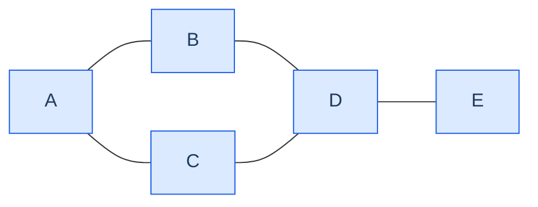
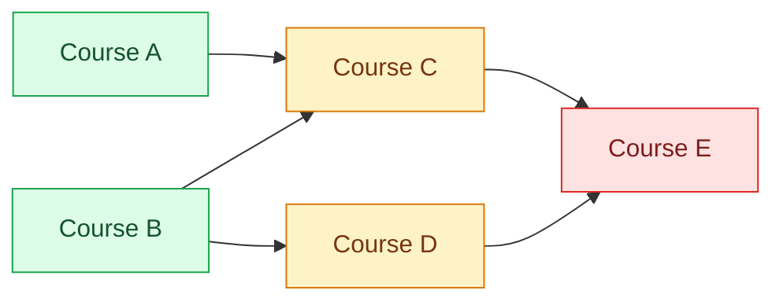
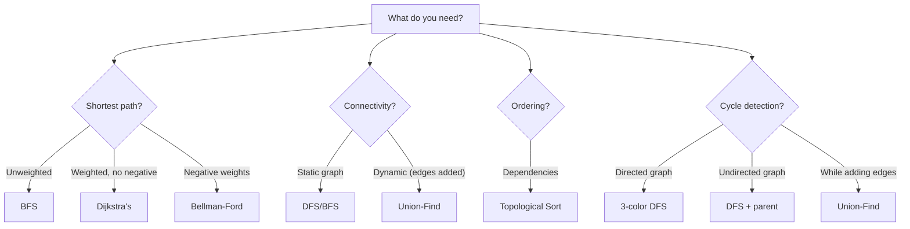

<div class="vtn-hero" style="margin-left: 0; margin-right: 0; padding: 2.5rem 2rem;">
<span class="vtn-tag">Interview Prep</span>
<h1 style="font-size: 2.2rem !important;">Graph Algorithms Mastery</h1>
<p class="vtn-subtitle">Graphs are disguised everywhere: grids are graphs, dependencies are graphs, social networks are graphs. The skill is not memorizing algorithms — it's recognizing when a problem is a graph problem in the first place.</p>
<div class="vtn-stats">
<div class="vtn-stat"><span class="vtn-stat-number">5</span><span class="vtn-stat-label">Core Patterns</span></div>
<div class="vtn-stat"><span class="vtn-stat-number">15</span><span class="vtn-stat-label">Practice Problems</span></div>
<div class="vtn-stat"><span class="vtn-stat-number">7</span><span class="vtn-stat-label">Templates</span></div>
</div>
</div>

---

## Graph Representations

### Adjacency List vs Adjacency Matrix

Consider this simple graph:



=== "Adjacency List"

    ```java
    // Map<Node, List<Neighbor>>
    Map<String, List<String>> graph = new HashMap<>();
    graph.put("A", List.of("B", "C"));
    graph.put("B", List.of("A", "D"));
    graph.put("C", List.of("A", "D"));
    graph.put("D", List.of("B", "C", "E"));
    graph.put("E", List.of("D"));
    ```

    - Space: O(V + E)
    - Check if edge exists: O(degree)
    - Get all neighbors: O(degree)

=== "Adjacency Matrix"

    ```java
    //       A  B  C  D  E
    int[][] matrix = {
        {0, 1, 1, 0, 0},  // A
        {1, 0, 0, 1, 0},  // B
        {1, 0, 0, 1, 0},  // C
        {0, 1, 1, 0, 1},  // D
        {0, 0, 0, 1, 0}   // E
    };
    ```

    - Space: O(V^2)
    - Check if edge exists: O(1)
    - Get all neighbors: O(V)

!!! tip "When to Use Which"
    | Situation | Use | Why |
    |---|---|---|
    | Sparse graph (E << V^2) | Adjacency List | Saves memory |
    | Dense graph (E close to V^2) | Adjacency Matrix | O(1) edge check |
    | Need to check if edge exists frequently | Matrix | O(1) vs O(degree) |
    | BFS/DFS traversal | List | Faster to iterate neighbors |
    | Most interview problems | **List** | Graphs are usually sparse |

### Building Graphs from Edge Lists and Grids

```java
// Undirected graph from edge list
int[][] edges = {{0,1}, {0,2}, {1,3}, {2,3}, {3,4}};
Map<Integer, List<Integer>> graph = new HashMap<>();
for (int[] edge : edges) {
    graph.computeIfAbsent(edge[0], k -> new ArrayList<>()).add(edge[1]);
    graph.computeIfAbsent(edge[1], k -> new ArrayList<>()).add(edge[0]); // remove for directed
}

// A grid IS a graph: each cell connects to 4 neighbors
int[][] dirs = {{0,1}, {0,-1}, {1,0}, {-1,0}};
// Neighbor of (r, c) = (r + dirs[i][0], c + dirs[i][1]) if in bounds
```

!!! warning "Directed vs Undirected Pitfall"
    For **undirected** graphs, add edges in both directions. Forgetting the reverse edge is the #1 graph bug in interviews.

---

## BFS Deep Dive

BFS explores level by level — guarantees shortest path in **unweighted** graphs.

### BFS Template

```java
public List<Integer> bfs(Map<Integer, List<Integer>> graph, int start) {
    List<Integer> order = new ArrayList<>();
    Set<Integer> visited = new HashSet<>();
    Queue<Integer> queue = new LinkedList<>();

    visited.add(start);
    queue.offer(start);

    while (!queue.isEmpty()) {
        int node = queue.poll();
        order.add(node);

        for (int neighbor : graph.getOrDefault(node, List.of())) {
            if (!visited.contains(neighbor)) {
                visited.add(neighbor);
                queue.offer(neighbor);
            }
        }
    }
    return order;
}
```

!!! warning "Mark visited WHEN ADDING to queue, not when polling"
    If you mark visited when polling, the same node gets added to the queue multiple times by different parents. This causes TLE and duplicate processing.

### Multi-Source BFS (Rotting Oranges Pattern)

Multiple starting points, find minimum time for something to spread:

```java
// LC #994 - Rotting Oranges
public int orangesRotting(int[][] grid) {
    int rows = grid.length, cols = grid[0].length;
    Queue<int[]> queue = new LinkedList<>();
    int fresh = 0;

    // Add ALL sources at once
    for (int r = 0; r < rows; r++) {
        for (int c = 0; c < cols; c++) {
            if (grid[r][c] == 2) queue.offer(new int[]{r, c});
            else if (grid[r][c] == 1) fresh++;
        }
    }

    int[][] dirs = {{0,1},{0,-1},{1,0},{-1,0}};
    int minutes = 0;

    while (!queue.isEmpty() && fresh > 0) {
        int size = queue.size();
        for (int i = 0; i < size; i++) {
            int[] cell = queue.poll();
            for (int[] d : dirs) {
                int nr = cell[0] + d[0], nc = cell[1] + d[1];
                if (nr >= 0 && nr < rows && nc >= 0 && nc < cols && grid[nr][nc] == 1) {
                    grid[nr][nc] = 2;
                    fresh--;
                    queue.offer(new int[]{nr, nc});
                }
            }
        }
        minutes++;
    }
    return fresh == 0 ? minutes : -1;
}
```

### BFS with Level Tracking (Shortest Distance)

Use the `dist` map as both the visited set and distance tracker:

```java
public Map<Integer, Integer> shortestDistance(Map<Integer, List<Integer>> graph, int start) {
    Map<Integer, Integer> dist = new HashMap<>();
    Queue<Integer> queue = new LinkedList<>();
    dist.put(start, 0);
    queue.offer(start);

    while (!queue.isEmpty()) {
        int node = queue.poll();
        for (int neighbor : graph.getOrDefault(node, List.of())) {
            if (!dist.containsKey(neighbor)) {
                dist.put(neighbor, dist.get(node) + 1);
                queue.offer(neighbor);
            }
        }
    }
    return dist;
}
```

???question "When does BFS NOT give shortest path?"
    BFS gives shortest path only in **unweighted** graphs (or graphs where all edges have equal weight). For weighted graphs, you need Dijkstra's. Using BFS on a weighted graph is a common interview mistake that instantly fails test cases.

---

## DFS Deep Dive

DFS goes deep before backtracking. Use for connectivity, cycle detection, and path exploration.

### DFS Templates

=== "Iterative (Stack)"

    ```java
    public List<Integer> dfsIterative(Map<Integer, List<Integer>> graph, int start) {
        List<Integer> order = new ArrayList<>();
        Set<Integer> visited = new HashSet<>();
        Deque<Integer> stack = new ArrayDeque<>();

        stack.push(start);

        while (!stack.isEmpty()) {
            int node = stack.pop();
            if (visited.contains(node)) continue;
            visited.add(node);
            order.add(node);

            for (int neighbor : graph.getOrDefault(node, List.of())) {
                if (!visited.contains(neighbor)) {
                    stack.push(neighbor);
                }
            }
        }
        return order;
    }
    ```

=== "Recursive"

    ```java
    public void dfsRecursive(Map<Integer, List<Integer>> graph, int node, Set<Integer> visited) {
        visited.add(node);
        // process node here

        for (int neighbor : graph.getOrDefault(node, List.of())) {
            if (!visited.contains(neighbor)) {
                dfsRecursive(graph, neighbor, visited);
            }
        }
    }
    ```

### Three-State Cycle Detection (Directed Graphs)

Use three states: **WHITE (0)** = unvisited, **GRAY (1)** = in recursion stack, **BLACK (2)** = fully processed. A back edge to a GRAY node means cycle.

```java
public boolean hasCycle(Map<Integer, List<Integer>> graph, int numNodes) {
    int[] color = new int[numNodes]; // 0=WHITE, 1=GRAY, 2=BLACK

    for (int i = 0; i < numNodes; i++) {
        if (color[i] == 0 && dfsHasCycle(graph, i, color)) {
            return true;
        }
    }
    return false;
}

private boolean dfsHasCycle(Map<Integer, List<Integer>> graph, int node, int[] color) {
    color[node] = 1; // GRAY - enter recursion stack

    for (int neighbor : graph.getOrDefault(node, List.of())) {
        if (color[neighbor] == 1) return true;  // back edge = cycle!
        if (color[neighbor] == 0 && dfsHasCycle(graph, neighbor, color)) return true;
    }

    color[node] = 2; // BLACK - fully processed
    return false;
}
```

!!! warning "Cycle Detection: Directed vs Undirected"
    - **Directed**: Use WHITE/GRAY/BLACK. A node revisited that is GRAY means cycle.
    - **Undirected**: Simply track parent. If you visit a neighbor that is already visited AND is not your parent, that's a cycle. Do NOT use three-color for undirected graphs — it gives false positives.

### Connected Components

Loop through all nodes; each time you find an unvisited node, run DFS/BFS from it and increment your component count. This pattern applies to both explicit graphs and grids (island counting).

---

## Topological Sort

Topological sort produces a linear ordering of vertices such that for every directed edge (u, v), u comes before v. **Only works on DAGs** (Directed Acyclic Graphs).

### When to Use

- Course prerequisites / dependency resolution
- Build order / task scheduling
- Compilation order
- Any problem saying "do X before Y"

### DAG Example



**Valid topological orders:** [A, B, C, D, E] or [B, A, D, C, E] or [B, D, A, C, E]...

### Kahn's Algorithm (BFS-based, Indegree)

```java
public List<Integer> topologicalSort(int numCourses, int[][] prerequisites) {
    Map<Integer, List<Integer>> graph = new HashMap<>();
    int[] indegree = new int[numCourses];

    for (int[] pre : prerequisites) {
        graph.computeIfAbsent(pre[1], k -> new ArrayList<>()).add(pre[0]);
        indegree[pre[0]]++;
    }

    // Start with nodes that have no dependencies
    Queue<Integer> queue = new LinkedList<>();
    for (int i = 0; i < numCourses; i++) {
        if (indegree[i] == 0) queue.offer(i);
    }

    List<Integer> order = new ArrayList<>();
    while (!queue.isEmpty()) {
        int node = queue.poll();
        order.add(node);

        for (int neighbor : graph.getOrDefault(node, List.of())) {
            indegree[neighbor]--;
            if (indegree[neighbor] == 0) {
                queue.offer(neighbor);
            }
        }
    }

    // If order doesn't contain all nodes, there's a cycle
    return order.size() == numCourses ? order : List.of();
}
```

!!! tip "Kahn's Algorithm = Built-in Cycle Detection"
    If the result list has fewer than V nodes, the graph has a cycle. Nodes in the cycle never reach indegree 0, so they never get added to the queue.

### DFS-based Topological Sort (Reverse Postorder)

DFS approach: after visiting all descendants of a node, push it onto a stack. The stack gives topological order.

```java
private void dfsTopSort(Map<Integer, List<Integer>> graph, int node,
                        boolean[] visited, Deque<Integer> stack) {
    visited[node] = true;
    for (int neighbor : graph.getOrDefault(node, List.of())) {
        if (!visited[neighbor]) dfsTopSort(graph, neighbor, visited, stack);
    }
    stack.push(node); // add AFTER all descendants processed
}
```

---

## Union-Find / Disjoint Set

Two operations: **find** (which group?) and **union** (merge groups). Near O(1) amortized with path compression + union by rank.

### Template

```java
class UnionFind {
    private int[] parent;
    private int[] rank;
    private int components;

    public UnionFind(int n) {
        parent = new int[n];
        rank = new int[n];
        components = n;
        for (int i = 0; i < n; i++) parent[i] = i;
    }

    public int find(int x) {
        if (parent[x] != x) {
            parent[x] = find(parent[x]); // path compression
        }
        return parent[x];
    }

    public boolean union(int x, int y) {
        int px = find(x), py = find(y);
        if (px == py) return false; // already connected

        // union by rank
        if (rank[px] < rank[py]) { int tmp = px; px = py; py = tmp; }
        parent[py] = px;
        if (rank[px] == rank[py]) rank[px]++;
        components--;
        return true;
    }

    public boolean connected(int x, int y) { return find(x) == find(y); }
    public int getComponents() { return components; }
}
```

!!! tip "When Union-Find vs BFS/DFS"
    | Scenario | Best Choice | Why |
    |---|---|---|
    | Static graph, find components once | BFS/DFS | Simpler, same complexity |
    | Edges added dynamically, query connectivity | **Union-Find** | O(alpha(n)) per operation |
    | Kruskal's MST | **Union-Find** | Need cycle detection while adding edges |
    | Redundant connection detection | **Union-Find** | Find the edge that creates a cycle |
    | Shortest path needed | BFS/DFS | Union-Find doesn't track paths |

---

## Shortest Path Algorithms

### Dijkstra's Algorithm

For weighted graphs with **non-negative** weights. Uses a min-heap to always expand the cheapest node.

```java
public int[] dijkstra(Map<Integer, List<int[]>> graph, int src, int n) {
    // graph: node -> list of [neighbor, weight]
    int[] dist = new int[n];
    Arrays.fill(dist, Integer.MAX_VALUE);
    dist[src] = 0;

    // PriorityQueue of [distance, node]
    PriorityQueue<int[]> pq = new PriorityQueue<>((a, b) -> a[0] - b[0]);
    pq.offer(new int[]{0, src});

    while (!pq.isEmpty()) {
        int[] curr = pq.poll();
        int d = curr[0], u = curr[1];

        if (d > dist[u]) continue; // stale entry, skip

        for (int[] edge : graph.getOrDefault(u, List.of())) {
            int v = edge[0], w = edge[1];
            if (dist[u] + w < dist[v]) {
                dist[v] = dist[u] + w;
                pq.offer(new int[]{dist[v], v});
            }
        }
    }
    return dist;
}
```

???question "When does Dijkstra fail?"
    Dijkstra's fails with **negative edge weights**. It assumes once a node is finalized (popped from PQ), no shorter path exists. A negative edge later could invalidate this assumption. Use Bellman-Ford for graphs with negative weights.

### Bellman-Ford (Brief)

- Handles negative weights, detects negative cycles
- Time: O(V * E) — slower than Dijkstra's
- Relax all edges V-1 times; if any edge can still be relaxed on the V-th pass, negative cycle exists
- Interview use: "Cheapest Flights Within K Stops" — run only K relaxation passes instead of V-1

---

## Solved Walkthroughs

### Problem 1: Number of Islands (LC #200)

Given an `m x n` 2D grid of `'1'` (land) and `'0'` (water), count the number of islands. Three approaches — interviewers love when you discuss trade-offs:

=== "BFS"

    ```java
    public int numIslands(char[][] grid) {
        int count = 0;
        int rows = grid.length, cols = grid[0].length;
        int[][] dirs = {{0,1},{0,-1},{1,0},{-1,0}};

        for (int r = 0; r < rows; r++) {
            for (int c = 0; c < cols; c++) {
                if (grid[r][c] == '1') {
                    count++;
                    // BFS to mark entire island as visited
                    Queue<int[]> queue = new LinkedList<>();
                    queue.offer(new int[]{r, c});
                    grid[r][c] = '0'; // mark visited

                    while (!queue.isEmpty()) {
                        int[] cell = queue.poll();
                        for (int[] d : dirs) {
                            int nr = cell[0] + d[0], nc = cell[1] + d[1];
                            if (nr >= 0 && nr < rows && nc >= 0 && nc < cols
                                && grid[nr][nc] == '1') {
                                grid[nr][nc] = '0';
                                queue.offer(new int[]{nr, nc});
                            }
                        }
                    }
                }
            }
        }
        return count;
    }
    ```

=== "DFS"

    ```java
    public int numIslands(char[][] grid) {
        int count = 0;
        for (int r = 0; r < grid.length; r++) {
            for (int c = 0; c < grid[0].length; c++) {
                if (grid[r][c] == '1') {
                    count++;
                    dfs(grid, r, c);
                }
            }
        }
        return count;
    }

    private void dfs(char[][] grid, int r, int c) {
        if (r < 0 || r >= grid.length || c < 0 || c >= grid[0].length
            || grid[r][c] == '0') return;
        grid[r][c] = '0'; // mark visited
        dfs(grid, r + 1, c);
        dfs(grid, r - 1, c);
        dfs(grid, r, c + 1);
        dfs(grid, r, c - 1);
    }
    ```

=== "Union-Find"

    Use the `UnionFind` class from above. Flatten grid to 1D: `id = r * cols + c`. Union adjacent land cells (only right/down to avoid duplicates). Answer = `components - waterCells`.

| Approach | Time | Space | Best When |
|---|---|---|---|
| BFS | O(m*n) | O(min(m,n)) | Guaranteed no stack overflow |
| DFS | O(m*n) | O(m*n) worst case stack | Cleanest code |
| Union-Find | O(m*n * alpha) | O(m*n) | Follow-up: dynamic island merge |

---

### Problem 2: Course Schedule (LC #207)

Given `numCourses` and `prerequisites[i] = [a, b]` (must take b before a), return `true` if you can finish all courses. **Approach:** Topological sort — if a valid ordering exists, no cycle.

```java
public boolean canFinish(int numCourses, int[][] prerequisites) {
    Map<Integer, List<Integer>> graph = new HashMap<>();
    int[] indegree = new int[numCourses];

    for (int[] pre : prerequisites) {
        graph.computeIfAbsent(pre[1], k -> new ArrayList<>()).add(pre[0]);
        indegree[pre[0]]++;
    }

    Queue<Integer> queue = new LinkedList<>();
    for (int i = 0; i < numCourses; i++) {
        if (indegree[i] == 0) queue.offer(i);
    }

    int processed = 0;
    while (!queue.isEmpty()) {
        int course = queue.poll();
        processed++;
        for (int next : graph.getOrDefault(course, List.of())) {
            if (--indegree[next] == 0) queue.offer(next);
        }
    }

    return processed == numCourses;
}
```

!!! tip "Course Schedule II (LC #210)"
    Same algorithm — just return the `order` list instead of a boolean. The list IS the topological order.

---

### Problem 3: Network Delay Time (LC #743)

Given `n` nodes and `times[i] = [u, v, w]` (signal from u to v takes w time), find minimum time for all nodes to receive a signal sent from node `k`. **Approach:** Dijkstra's — answer is the max of all shortest distances.

```java
public int networkDelayTime(int[][] times, int n, int k) {
    // Build adjacency list: node -> [(neighbor, weight)]
    Map<Integer, List<int[]>> graph = new HashMap<>();
    for (int[] t : times) {
        graph.computeIfAbsent(t[0], x -> new ArrayList<>()).add(new int[]{t[1], t[2]});
    }

    // Dijkstra's
    int[] dist = new int[n + 1]; // 1-indexed
    Arrays.fill(dist, Integer.MAX_VALUE);
    dist[k] = 0;

    PriorityQueue<int[]> pq = new PriorityQueue<>((a, b) -> a[0] - b[0]);
    pq.offer(new int[]{0, k});

    while (!pq.isEmpty()) {
        int[] curr = pq.poll();
        int d = curr[0], u = curr[1];

        if (d > dist[u]) continue;

        for (int[] edge : graph.getOrDefault(u, List.of())) {
            int v = edge[0], w = edge[1];
            if (dist[u] + w < dist[v]) {
                dist[v] = dist[u] + w;
                pq.offer(new int[]{dist[v], v});
            }
        }
    }

    int maxDist = 0;
    for (int i = 1; i <= n; i++) {
        if (dist[i] == Integer.MAX_VALUE) return -1;
        maxDist = Math.max(maxDist, dist[i]);
    }
    return maxDist;
}
```

---

## "Is This a Graph Problem?" Recognition Table

| Problem Pattern | Why It's a Graph | Algorithm |
|---|---|---|
| Grid with connected regions | Each cell is a node, 4-directional edges | BFS/DFS |
| "Can X reach Y?" | Reachability = path existence | BFS/DFS |
| "Do X before Y" / dependencies | Directed edges = dependencies | Topological Sort |
| "Minimum steps to transform A to B" | States are nodes, transitions are edges | BFS (shortest path) |
| Word Ladder / letter-by-letter change | Each word is a node, one-letter diff = edge | BFS |
| "Group elements that share a property" | Shared property = edge | Union-Find / DFS |
| "Find redundant connection" | Adding edge creates cycle | Union-Find |
| Social network / friend-of-friend | People = nodes, friendships = edges | BFS (degrees of separation) |
| Matrix shortest path (equal weights) | Grid BFS with distance tracking | BFS |
| Cheapest flight with K stops | Weighted graph with constraint | Modified Dijkstra / BFS |

!!! tip "The Transformation Pattern"
    If the problem says "minimum number of steps/operations to convert X to Y", think BFS. Each state is a node. Each valid operation creates an edge to the next state. BFS finds the shortest path = minimum operations.

---

## Common Mistakes

!!! danger "Mistake 1: Forgetting the Visited Set"
    Without marking nodes as visited, you'll revisit them infinitely (in cyclic graphs) or exponentially (in DAGs). Always use a `visited` set or modify the input to mark cells.

!!! danger "Mistake 2: BFS on Weighted Graphs"
    BFS gives shortest path ONLY when all edges have equal weight. For `[[A,B,1], [A,C,5], [C,B,1]]`, BFS might find A->B (cost 1) but miss that some longer-hop paths are cheaper in other scenarios. Use Dijkstra's for weighted graphs.

!!! danger "Mistake 3: Wrong Cycle Detection for Undirected Graphs"
    Using the WHITE/GRAY/BLACK method on an undirected graph gives false positives — going from A to B and back to A looks like a cycle but isn't. For undirected graphs, track the parent and only report a cycle if you visit a node that is visited AND is not your direct parent.

!!! danger "Mistake 4: Not Handling Disconnected Graphs"
    Starting BFS/DFS from only one node misses disconnected components. Always loop through ALL nodes and start a new traversal from any unvisited node.

    ```java
    // WRONG: only explores component containing node 0
    dfs(graph, 0, visited);

    // RIGHT: explores all components
    for (int i = 0; i < n; i++) {
        if (!visited.contains(i)) dfs(graph, i, visited);
    }
    ```

!!! danger "Mistake 5: Integer Overflow in Dijkstra's"
    When computing `dist[u] + weight`, if `dist[u]` is `Integer.MAX_VALUE`, addition overflows to negative. Always check `if (dist[u] == Integer.MAX_VALUE) continue;` or use `long`.

!!! danger "Mistake 6: Confusing Node Count vs Edge Count in Complexity"
    - BFS/DFS: O(V + E) not O(V) — you visit every edge too
    - Topological Sort: O(V + E)
    - Dijkstra's: O((V + E) log V) not O(V log V)
    - Always count edge processing in your complexity analysis

---

## Practice Problems

### BFS

| # | Problem | Difficulty | Key Insight |
|---|---|---|---|
| 200 | [Number of Islands](https://leetcode.com/problems/number-of-islands/) | Medium | Grid BFS, mark visited |
| 994 | [Rotting Oranges](https://leetcode.com/problems/rotting-oranges/) | Medium | Multi-source BFS |
| 127 | [Word Ladder](https://leetcode.com/problems/word-ladder/) | Hard | State-space BFS, transform = edge |
| 1091 | [Shortest Path in Binary Matrix](https://leetcode.com/problems/shortest-path-in-binary-matrix/) | Medium | 8-directional BFS |

### DFS

| # | Problem | Difficulty | Key Insight |
|---|---|---|---|
| 695 | [Max Area of Island](https://leetcode.com/problems/max-area-of-island/) | Medium | DFS + count cells |
| 133 | [Clone Graph](https://leetcode.com/problems/clone-graph/) | Medium | DFS + HashMap for cloned nodes |
| 417 | [Pacific Atlantic Water Flow](https://leetcode.com/problems/pacific-atlantic-water-flow/) | Medium | Reverse DFS from both oceans |

### Topological Sort

| # | Problem | Difficulty | Key Insight |
|---|---|---|---|
| 207 | [Course Schedule](https://leetcode.com/problems/course-schedule/) | Medium | Cycle detection via topo sort |
| 210 | [Course Schedule II](https://leetcode.com/problems/course-schedule-ii/) | Medium | Return the topological order |
| 269 | [Alien Dictionary](https://leetcode.com/problems/alien-dictionary/) | Hard | Build graph from sorted words, topo sort |

### Union-Find

| # | Problem | Difficulty | Key Insight |
|---|---|---|---|
| 684 | [Redundant Connection](https://leetcode.com/problems/redundant-connection/) | Medium | Edge that creates cycle = union returns false |
| 323 | [Number of Connected Components](https://leetcode.com/problems/number-of-connected-components-in-an-undirected-graph/) | Medium | Union all edges, count components |
| 128 | [Longest Consecutive Sequence](https://leetcode.com/problems/longest-consecutive-sequence/) | Medium | Union consecutive numbers |

### Shortest Path

| # | Problem | Difficulty | Key Insight |
|---|---|---|---|
| 743 | [Network Delay Time](https://leetcode.com/problems/network-delay-time/) | Medium | Classic Dijkstra's |
| 787 | [Cheapest Flights Within K Stops](https://leetcode.com/problems/cheapest-flights-within-k-stops/) | Medium | BFS with level limit or Bellman-Ford with K iterations |
| 1514 | [Path with Maximum Probability](https://leetcode.com/problems/path-with-maximum-probability/) | Medium | Modified Dijkstra (max-heap, multiply instead of add) |

---

## Algorithm Selection Cheatsheet



---
