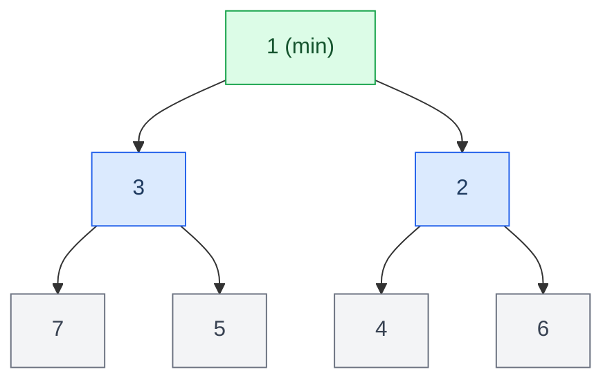
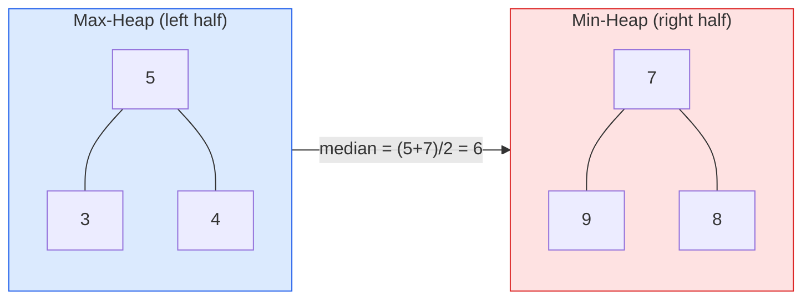

# Heaps & Greedy Algorithms — Top K & Scheduling Problems

<div class="vtn-hero" style="margin-left: 0; margin-right: 0; padding: 2.5rem 2rem;">
<span class="vtn-tag">Pattern</span>
<h1 style="font-size: 2.2rem !important;">Heaps & Greedy</h1>
<p class="vtn-subtitle">Heaps give you efficient access to the extreme (min/max). Greedy gives you optimal solutions by making locally best choices. Together they solve scheduling, top-K, and optimization problems that appear in every FAANG interview loop.</p>
<div class="vtn-stats">
<div class="vtn-stat"><span class="vtn-stat-number">2</span><span class="vtn-stat-label">Patterns</span></div>
<div class="vtn-stat"><span class="vtn-stat-number">15+</span><span class="vtn-stat-label">Problems</span></div>
<div class="vtn-stat"><span class="vtn-stat-number">Medium-High</span><span class="vtn-stat-label">Frequency</span></div>
</div>
</div>

---

## Part 1: Heaps (Priority Queue)

### Core Concept

A heap is a complete binary tree where every parent satisfies the heap property. In a **min-heap**, parent ≤ children. In a **max-heap**, parent ≥ children.



| Operation | Complexity | Notes |
|---|---|---|
| peek (get min/max) | O(1) | Just read the root |
| offer (insert) | O(log n) | Bubble up |
| poll (remove top) | O(log n) | Swap root with last, bubble down |
| heapify (build from array) | O(n) | NOT O(n log n) — bottom-up is linear |
| remove arbitrary element | O(n) | Must search first |

### Java PriorityQueue

```java
// Min-heap (default)
PriorityQueue<Integer> minHeap = new PriorityQueue<>();

// Max-heap
PriorityQueue<Integer> maxHeap = new PriorityQueue<>(Comparator.reverseOrder());

// Custom comparator (sort by frequency, then by value)
PriorityQueue<int[]> pq = new PriorityQueue<>((a, b) -> 
    a[1] != b[1] ? b[1] - a[1] : a[0] - b[0]
);
```

!!! warning "PriorityQueue is NOT sorted iteration"
    Iterating a PriorityQueue does NOT give elements in sorted order. Only `poll()` guarantees order. If you need sorted iteration, poll until empty.

---

### Pattern Recognition

| Signal in Problem | Pattern | Example |
|---|---|---|
| "K largest/smallest" | Min-heap of size K | Top K Frequent Elements |
| "Kth largest/smallest" | Min-heap of size K, peek = answer | Kth Largest Element |
| "Merge K sorted" | Min-heap of K elements, always expand smallest | Merge K Sorted Lists |
| "Running median" | Two heaps (max-heap for left, min-heap for right) | Find Median from Data Stream |
| "Closest K points" | Max-heap of size K | K Closest Points to Origin |
| "Schedule/process by priority" | Heap ordered by priority | Task Scheduler |
| "Continuously get min/max as data arrives" | Heap (streaming) | Sliding window median |

---

### Templates

=== "Top-K Pattern"

    ```java
    // Find K largest elements — use MIN-heap of size K
    // Intuition: min-heap holds the K largest seen so far.
    // The smallest of those K is at the top — if new element is bigger, replace it.
    public int[] topKLargest(int[] nums, int k) {
        PriorityQueue<Integer> minHeap = new PriorityQueue<>();
        for (int num : nums) {
            minHeap.offer(num);
            if (minHeap.size() > k) {
                minHeap.poll(); // remove smallest — not in top K
            }
        }
        return minHeap.stream().mapToInt(Integer::intValue).toArray();
    }
    ```

=== "Two-Heap Median"

    ```java
    // Running median: max-heap (left half) + min-heap (right half)
    // Invariant: maxHeap.size() == minHeap.size() or maxHeap.size() == minHeap.size() + 1
    PriorityQueue<Integer> left = new PriorityQueue<>(Comparator.reverseOrder()); // max-heap
    PriorityQueue<Integer> right = new PriorityQueue<>(); // min-heap

    public void addNum(int num) {
        left.offer(num);
        right.offer(left.poll()); // balance: move max of left to right
        if (right.size() > left.size()) {
            left.offer(right.poll()); // keep left >= right in size
        }
    }

    public double findMedian() {
        if (left.size() > right.size()) return left.peek();
        return (left.peek() + right.peek()) / 2.0;
    }
    ```

=== "Merge K Sorted"

    ```java
    // Merge K sorted lists using min-heap
    public ListNode mergeKLists(ListNode[] lists) {
        PriorityQueue<ListNode> pq = new PriorityQueue<>(
            Comparator.comparingInt(a -> a.val)
        );
        for (ListNode head : lists) {
            if (head != null) pq.offer(head);
        }

        ListNode dummy = new ListNode(0);
        ListNode curr = dummy;
        while (!pq.isEmpty()) {
            ListNode smallest = pq.poll();
            curr.next = smallest;
            curr = curr.next;
            if (smallest.next != null) pq.offer(smallest.next);
        }
        return dummy.next;
    }
    ```

---

### Solved Walkthrough: Top K Frequent Elements (LC #347)

**Problem:** Given an integer array and integer k, return the k most frequent elements.

**Thought process:**

1. First, count frequencies → HashMap O(n)
2. Then find top K from the frequency map → this is the "Top K" pattern
3. Options: sort (O(n log n)), heap (O(n log k)), bucket sort (O(n))

**Heap approach (O(n log k)):**

```java
public int[] topKFrequent(int[] nums, int k) {
    Map<Integer, Integer> freq = new HashMap<>();
    for (int n : nums) freq.merge(n, 1, Integer::sum);

    // Min-heap by frequency — keeps K most frequent
    PriorityQueue<Integer> pq = new PriorityQueue<>(
        Comparator.comparingInt(freq::get)
    );
    for (int key : freq.keySet()) {
        pq.offer(key);
        if (pq.size() > k) pq.poll();
    }

    return pq.stream().mapToInt(Integer::intValue).toArray();
}
```

**Bucket sort approach (O(n)) — optimal:**

```java
public int[] topKFrequent(int[] nums, int k) {
    Map<Integer, Integer> freq = new HashMap<>();
    for (int n : nums) freq.merge(n, 1, Integer::sum);

    // Bucket index = frequency, bucket content = numbers with that frequency
    List<Integer>[] buckets = new List[nums.length + 1];
    for (var entry : freq.entrySet()) {
        int f = entry.getValue();
        if (buckets[f] == null) buckets[f] = new ArrayList<>();
        buckets[f].add(entry.getKey());
    }

    int[] result = new int[k];
    int idx = 0;
    for (int i = buckets.length - 1; i >= 0 && idx < k; i--) {
        if (buckets[i] != null) {
            for (int num : buckets[i]) {
                result[idx++] = num;
                if (idx == k) break;
            }
        }
    }
    return result;
}
```

**Complexity:** Heap: O(n log k) time, O(n) space. Bucket sort: O(n) time, O(n) space.

---

### Solved Walkthrough: Find Median from Data Stream (LC #295)

**Problem:** Design a data structure that supports adding numbers and finding the median efficiently.

**Key insight:** Keep two heaps — the left half in a max-heap, the right half in a min-heap. The median is always at the boundary between them.



**Invariant:** `left.size() == right.size()` or `left.size() == right.size() + 1`

The two-heap template shown above is the complete implementation. Time: O(log n) per add, O(1) for median.

---

## Part 2: Greedy Algorithms

### Core Concept

A greedy algorithm makes the locally optimal choice at each step, hoping to find the global optimum. It works when the problem has **greedy choice property** (local optimum leads to global optimum) and **optimal substructure**.

!!! tip "The Greedy Test"
    Before using greedy: can you find a counterexample where the greedy choice fails? If yes → use DP. If you can't find one → greedy might work, but you need to convince the interviewer WHY.

### Greedy Proof Techniques

| Technique | How It Works | Example |
|---|---|---|
| **Exchange argument** | Show swapping any non-greedy choice with greedy doesn't worsen the solution | Interval scheduling |
| **Stays ahead** | Show greedy solution is always ≥ any other at every step | Activity selection |
| **Contradiction** | Assume greedy isn't optimal → derive contradiction | Huffman coding |

---

### Pattern Recognition

| Signal in Problem | Greedy Strategy | Example |
|---|---|---|
| "Non-overlapping intervals" | Sort by end time, pick earliest ending | Interval Scheduling |
| "Minimum number of X to cover" | Sort, then be greedy about coverage | Minimum Platforms |
| "Assign tasks/items optimally" | Sort by some criteria, assign greedily | Task Assignment |
| "Jump/reach farthest" | Track max reachable | Jump Game |
| "Minimum cost to do X" | Sort by cost, pick cheapest valid option | Minimum Cost |
| "Partition/split into groups" | Sort, then greedy grouping | Partition Labels |

---

### Templates

=== "Interval Scheduling"

    ```java
    // Maximum non-overlapping intervals
    // Sort by END time, greedily pick earliest-ending that doesn't conflict
    public int maxNonOverlapping(int[][] intervals) {
        Arrays.sort(intervals, Comparator.comparingInt(a -> a[1]));
        int count = 0, lastEnd = Integer.MIN_VALUE;
        for (int[] interval : intervals) {
            if (interval[0] >= lastEnd) { // no overlap
                count++;
                lastEnd = interval[1];
            }
        }
        return count;
    }
    ```

=== "Jump Game"

    ```java
    // Can you reach the end? Track farthest reachable index.
    public boolean canJump(int[] nums) {
        int farthest = 0;
        for (int i = 0; i <= farthest && i < nums.length; i++) {
            farthest = Math.max(farthest, i + nums[i]);
            if (farthest >= nums.length - 1) return true;
        }
        return false;
    }
    ```

=== "Merge Intervals"

    ```java
    // Merge overlapping intervals
    public int[][] merge(int[][] intervals) {
        Arrays.sort(intervals, Comparator.comparingInt(a -> a[0]));
        List<int[]> merged = new ArrayList<>();
        for (int[] interval : intervals) {
            if (merged.isEmpty() || merged.getLast()[1] < interval[0]) {
                merged.add(interval);
            } else {
                merged.getLast()[1] = Math.max(merged.getLast()[1], interval[1]);
            }
        }
        return merged.toArray(new int[0][]);
    }
    ```

---

### Solved Walkthrough: Merge Intervals (LC #56)

**Problem:** Given a collection of intervals, merge all overlapping intervals.

**Thought process:**

1. Sorting by start time puts overlapping intervals adjacent
2. After sorting, interval B overlaps with current merged if B.start ≤ merged.end
3. When overlapping, extend merged.end = max(merged.end, B.end)

**Visual:**

```mermaid
gantt
    title Before: [1,3] [2,6] [8,10] [15,18]
    dateFormat X
    axisFormat %s
    section Input
    [1,3]    : 1, 3
    [2,6]    : 2, 6
    [8,10]   : 8, 10
    [15,18]  : 15, 18
    section Merged
    [1,6]    : crit, 1, 6
    [8,10]   : crit, 8, 10
    [15,18]  : crit, 15, 18
```



**Why greedy works:** After sorting by start, we process intervals left-to-right. Each merge decision is final because no future interval can start before the current one (sorted!). No backtracking needed.

---

### Solved Walkthrough: Task Scheduler (LC #621)

**Problem:** Given tasks (chars) and cooldown `n`, find minimum intervals to finish all tasks.

**Key insight:** The most frequent task dictates the minimum time. Arrange the most frequent task first, fill gaps with other tasks.

```java
public int leastInterval(char[] tasks, int n) {
    int[] freq = new int[26];
    for (char t : tasks) freq[t - 'A']++;

    int maxFreq = Arrays.stream(freq).max().getAsInt();
    int maxCount = (int) Arrays.stream(freq).filter(f -> f == maxFreq).count();

    // Formula: (maxFreq - 1) gaps of size (n + 1) + maxCount tasks in last group
    int result = (maxFreq - 1) * (n + 1) + maxCount;

    // If tasks fill all gaps, answer is just total tasks (no idle needed)
    return Math.max(result, tasks.length);
}
```

**Intuition:** Imagine maxFreq = 3, n = 2, task A appears 3 times:
```
A _ _ | A _ _ | A
```
Each `|` gap has size n+1. We have (maxFreq-1) gaps. Fill gaps with other tasks. If all gaps filled, no idle time — answer is just task count.

---

## Common Mistakes

| Mistake | Why It's Wrong | Fix |
|---|---|---|
| Using max-heap for "K largest" | Max-heap of N elements = O(N log N). Min-heap of K = O(N log K) | Use min-heap of size K for top-K problems |
| Applying greedy without justification | Greedy only works when local optimum = global optimum | Find a counterexample, or explain WHY greedy is correct |
| Forgetting heap comparator direction | `PriorityQueue` is min-heap by default in Java | Use `Comparator.reverseOrder()` for max-heap |
| Greedy on unsorted data | Most greedy algorithms require sorting first | Sort by the relevant criteria before greedy processing |
| Not considering ties in heap | Equal-priority elements may need secondary ordering | Add secondary comparator (e.g., alphabetical for same frequency) |
| Using `Collections.sort` inside a loop | Sorting inside a loop = O(n² log n) | Sort once outside, or use a heap for dynamic ordering |

---

## Practice Problems

### Heaps

| # | Problem | Difficulty | Key Insight |
|---|---|---|---|
| 215 | Kth Largest Element in Array | Medium | Min-heap of size K OR quickselect |
| 347 | Top K Frequent Elements | Medium | Frequency map + min-heap or bucket sort |
| 295 | Find Median from Data Stream | Hard | Two heaps (max-left, min-right) |
| 23 | Merge K Sorted Lists | Hard | Min-heap of K node heads |
| 973 | K Closest Points to Origin | Medium | Max-heap of size K by distance |
| 621 | Task Scheduler | Medium | Greedy + max-frequency formula |
| 355 | Design Twitter | Medium | Merge K sorted (user feeds) |
| 703 | Kth Largest Element in Stream | Easy | Min-heap of size K, peek = answer |

### Greedy

| # | Problem | Difficulty | Key Insight |
|---|---|---|---|
| 56 | Merge Intervals | Medium | Sort by start, extend end |
| 55 | Jump Game | Medium | Track farthest reachable |
| 45 | Jump Game II | Medium | BFS-like level tracking |
| 435 | Non-overlapping Intervals | Medium | Sort by end, count conflicts |
| 763 | Partition Labels | Medium | Last occurrence map + greedy extend |
| 134 | Gas Station | Medium | If total gas ≥ total cost, solution exists; find start greedily |
| 846 | Hand of Straights | Medium | TreeMap + greedy grouping |
| 678 | Valid Parenthesis String | Medium | Track min/max open count |

---

## Interview Tips

!!! tip "What Interviewers Look For"
    - **Heap problems:** Can you identify the right heap direction (min vs max)? Can you explain WHY size K works?
    - **Greedy problems:** Can you PROVE your greedy works? Say "this works because..." or "a counterexample would be... and it doesn't exist because..."
    - **The sorting step:** Many candidates forget that greedy usually needs sorted input. State "I'll sort by X because Y" explicitly.
    - **Alternatives:** Mention you know quickselect for Kth element (O(n) average). Mention you know bucket sort for top-K (O(n)). Shows depth.
