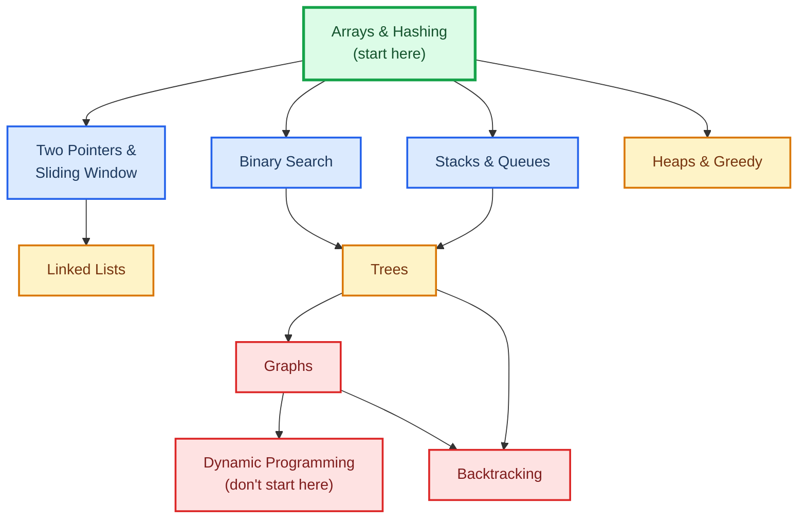

# DSA Without the Pain

The code you're already writing is doing DSA — you're just doing it badly. That `for` loop inside another `for` loop that scans your list of users to find duplicates? That's an O(n²) pattern. Swap it for a `HashSet` and your code runs 1000x faster with three fewer lines. That's it. That's DSA.

You don't have to love algorithms. You just have to recognize a handful of patterns when they show up. This page teaches you those patterns using real code you'd actually write, not toy problems from a textbook.

---

## The One Trick That Pays for This Whole Page

Here's a bug I've fixed dozens of times in production Java code:

```java
// Slow — O(n²). Fine at 100 users. Dies at 10,000.
List<User> duplicates = new ArrayList<>();
for (User a : users) {
    for (User b : users) {
        if (a != b && a.getEmail().equals(b.getEmail())) {
            duplicates.add(a);
        }
    }
}
```

The fix:

```java
// Fast — O(n). Same result, 1000x faster at scale.
Set<String> seen = new HashSet<>();
List<User> duplicates = new ArrayList<>();
for (User u : users) {
    if (!seen.add(u.getEmail())) {
        duplicates.add(u);
    }
}
```

That's **one pattern** — "use a HashSet for O(1) lookups." Just knowing this pattern exists is the difference between code that scales and code that doesn't. There are about 11 more like it. That's the whole point of DSA.

---

## What This Actually Gets You

| You Want... | DSA Gives You |
|---|---|
| **Better production code** | Loops that don't fall over at scale, queries that don't time out, code reviews you don't dread |
| **A raise / promotion** | Senior engineers get paid to spot O(n²) in a PR. Juniors write it. |
| **To pass FAANG interviews** | The 12 patterns cover ~65% of what they ask. There's no shortcut around this one. |
| **To stop feeling stupid** | Debugging weird behavior in HashMap, understanding why your recursion blew the stack, why sort is slow — this is all DSA in disguise |

If none of those move you, you can close this tab guilt-free. If any of them do — keep reading.

---

## The 5-Minute Start

If you read only one thing on this site, read **[Arrays & Hashing](arrays-hashing.md)**. Two things will happen:

1. You'll walk away with 2–3 patterns you can use in production code tomorrow.
2. You'll realize DSA is way less scary than it sounds.

That page is designed to be finishable during a coffee break. It teaches:

- **The HashSet trick** (the one above, generalized)
- **Prefix sums** — how to answer "sum from index 5 to index 42" in O(1) instead of O(n)
- **Frequency counting** — the pattern behind detecting anagrams, top-K anything, and half of all interview questions

Come back for the rest when you're ready.

---

## The Full Pattern Map

For the people who want the whole thing. Study top to bottom — later patterns build on earlier ones.



The **green** box is where everyone starts. **Blue** is the core 4 that cover most of what you'll see day-to-day. **Yellow** is the "senior engineer" tier. **Red** is where FAANG interviews live — save these for last.

---

## Pattern-by-Pattern: What You Actually Learn

| Pattern | Real-World Use | Interview Frequency | Deep Dive |
|---|---|---|---|
| **Arrays & Hashing** | Deduping users, counting API hits by endpoint, "find X in a list" | Very High | [→ Start here](arrays-hashing.md) |
| **Two Pointers** | Comparing two sorted lists, in-place array cleanup, palindrome checks | Very High | [→ Two Pointers & Sliding Window](two-pointers-sliding-window.md) |
| **Sliding Window** | Rate limiting, "requests in the last 60s", moving averages | High | [→ Same page](two-pointers-sliding-window.md) |
| **Binary Search** | Finding a version that broke a test, database index lookups, `TreeMap` internals | High | [→ Binary Search](binary-search.md) |
| **Stacks & Queues** | Undo/redo, matching brackets, BFS crawlers, print job order | Medium-High | [→ Stacks & Queues](stacks-queues.md) |
| **Linked Lists** | LRU cache internals, task schedulers, `LinkedList` in Java | Medium | [→ Linked Lists](linked-lists.md) |
| **Trees** | Filesystem hierarchies, DOM, autocomplete, `TreeMap`/`TreeSet` | Medium-High | [→ Trees](trees.md) |
| **Graphs** | Social networks, dependency resolution (`npm install`), route finding | Medium | [→ Graphs](graphs.md) |
| **Dynamic Programming** | Optimal choices with overlap: pricing, path costs, string diffs | Very High (in interviews) | [→ Dynamic Programming](dynamic-programming.md) |
| **Heaps & Greedy** | Priority queues, "top 10 slowest queries", scheduling | Medium | [→ Heaps & Greedy](heaps-greedy.md) |
| **Backtracking** | Sudoku solvers, generating permutations, constraint satisfaction | Medium | [→ Backtracking](backtracking.md) |

---

## The "Am I Doing This Wrong?" Cheat Sheet

Look at the size of your input. That's how you know if your solution is fast enough. No memorization needed — read the constraint, pick the pattern:

| If your input has... | Your code must be at most... | Which usually means... |
|---|---|---|
| Under 10 items | Anything works | Don't overthink it |
| Up to 500 items | O(n³) is fine | Nested loops still OK |
| Up to 5,000 items | O(n²) is the limit | Nested loops start to hurt |
| Up to 100,000 items | O(n log n) | Sort first, then walk it |
| Up to 1,000,000 items | O(n) | One pass. HashMap. Two pointers. |
| Up to 1,000,000,000 items | O(log n) | Binary search |

If you write a nested loop over a list of 100,000 users, that's 10 billion iterations. Your code will hang. This table tells you when to stop and pick a better pattern.

---

## Data Structures You Should Know Cold

Just five. That's it. The rest are variations.

| Structure | Java Class | Use When... | Speed |
|---|---|---|---|
| **HashMap** | `HashMap<K,V>` | You need O(1) "does this key exist?" or "get value for key" | Fast |
| **HashSet** | `HashSet<T>` | You need O(1) "have I seen this?" | Fast |
| **TreeMap** | `TreeMap<K,V>` | You need HashMap features **plus** sorted keys / range queries | Slower but sorted |
| **ArrayDeque** | `ArrayDeque<T>` | You need a stack (`push`/`pop`) or queue (`offer`/`poll`) | Fast |
| **PriorityQueue** | `PriorityQueue<T>` | You need "give me the smallest/largest so far" | O(log n) |

Master these five and you've covered ~80% of what you'll ever need. The rest ([full data structure operations table](arrays-hashing.md#data-structure-operations)) is optimization.

---

## How to Actually Learn This

I've watched people bounce off DSA their entire careers. Here's what works and what doesn't:

### Doesn't work

- **Reading LeetCode solutions**. You'll understand each one and remember none. Zero pattern recognition transfers.
- **Doing 300 problems randomly**. You'll get faster at problems that look exactly like the ones you did. Everything else stays hard.
- **Watching YouTube playlists at 2x speed**. Feels productive. Isn't.

### Works

- **Learn one pattern, then solve 3–5 problems using only that pattern.** You're training pattern-recognition, not memorization.
- **Explain the pattern out loud before coding.** If you can't say it in one sentence, you don't understand it yet.
- **When you get stuck, look at the pattern name, not the solution.** If someone tells you "use two pointers here," that's usually enough to unblock you. Peek at that, not the full code.

### The 4-week sprint (if you have a FAANG interview soon)

| Week | Focus | You Should Feel |
|---|---|---|
| 1 | Arrays & Hashing, Two Pointers, Sliding Window | "Oh, this isn't so bad." |
| 2 | Binary Search, Stacks, Linked Lists, Trees | "I can see the patterns now." |
| 3 | Graphs, DP (1D), Heaps & Greedy | "OK the interview questions are just recombinations." |
| 4 | DP (2D+), Backtracking, mock interviews | Ready. |

The first 5 patterns cover roughly 65% of real interview questions. If you're short on time, nail those and go.

---

## Ready?

Start with **[Arrays & Hashing →](arrays-hashing.md)**. It's the smallest step and the biggest payoff. If that page doesn't hook you, DSA isn't for you and that's fine — you can build plenty of things without ever solving a graph problem.

But if it clicks, welcome. The rest of this section is written for you.
