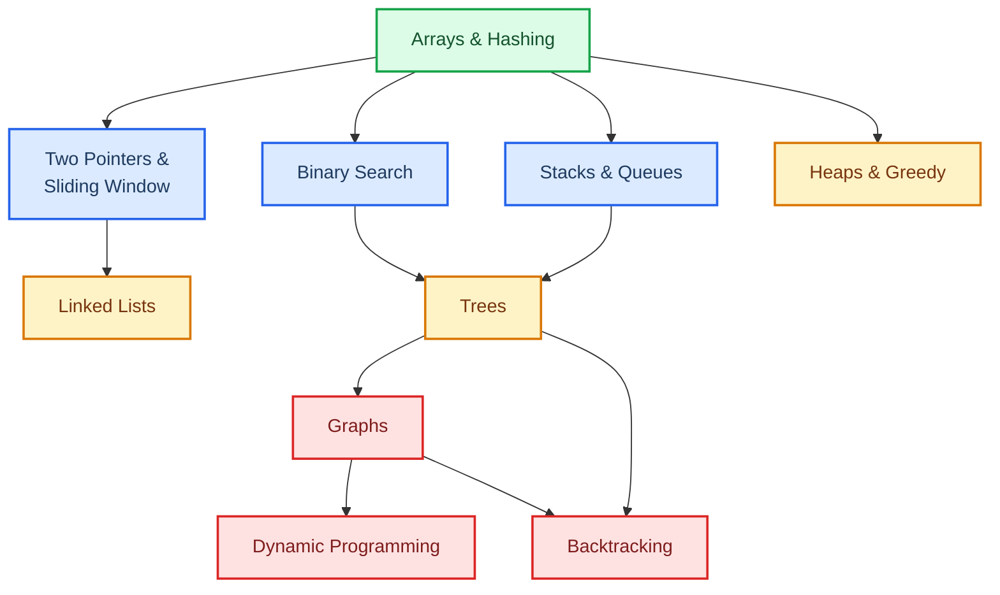

# 12 DSA Coding Patterns for FAANG Interviews — LeetCode in Java

Interview Prep
<h1 style="font-size: 2.2rem !important;">DSA Pattern Mastery</h1>

From 300+ LeetCode problems distilled into 12 patterns that actually matter for FAANG interviews. Each page has diagrams, Java code, solved walkthroughs, and the mistakes that cost offers.

12Patterns

80+Problems

300+LeetCode Solved

---

## The Pattern Map

After grinding 300+ problems, you realize there are really only 12 patterns. Everything else is a variation. Here's the dependency graph — study in this order:

---

## Pattern Frequency in Interviews

| Pattern | Frequency | Where It Shows Up | Page |
|---|---|---|---|
| **Arrays & Hashing** | :material-fire:{.fire} Very High | Two Sum, prefix sums, frequency counting, grouping | [Arrays & Hashing](arrays-hashing.md) |
| **Two Pointers** | :material-fire:{.fire} Very High | Sorted data, pairs, palindromes, in-place operations | [Two Pointers & Sliding Window](two-pointers-sliding-window.md) |
| **Sliding Window** | :material-fire:{.fire} High | Longest/shortest subarray, substring constraints | [Two Pointers & Sliding Window](two-pointers-sliding-window.md) |
| **Binary Search** | :material-fire:{.fire} High | Sorted data, search on answer space, rotated arrays | [Binary Search](binary-search.md) |
| **Stacks & Queues** | :material-trending-up: Medium-High | Parentheses, monotonic patterns, next greater element | [Stacks & Queues](stacks-queues.md) |
| **Linked Lists** | :material-trending-up: Medium | Reversal, cycle detection, merge operations | [Linked Lists](linked-lists.md) |
| **Trees** | :material-trending-up: Medium-High | Traversals, BST validation, path problems, LCA | [Trees](trees.md) |
| **Graphs** | :material-trending-up: Medium | BFS/DFS, topological sort, shortest path, components | [Graphs](graphs.md) |
| **Dynamic Programming** | :material-fire:{.fire} Very High | Optimization, counting, string matching, knapsack | [Dynamic Programming](dynamic-programming.md) |
| **Heaps & Greedy** | :material-trending-up: Medium | Top-K, scheduling, interval problems, merge K sorted | [Heaps & Greedy](heaps-greedy.md) |
| **Backtracking** | :material-trending-neutral: Medium | Permutations, combinations, constraint satisfaction | [Backtracking](backtracking.md) |

---

## How to Use These Pages

Each topic page follows the same structure:

1. **Core Concept** — Visual explanation with mermaid diagrams
2. **Pattern Recognition** — "When you see X, think Y" signals
3. **Templates** — Reusable Java code you can adapt to any problem
4. **Solved Walkthroughs** — 2-3 problems solved step-by-step with thought process
5. **Common Mistakes** — The errors that cost people offers
6. **Practice Problems** — Curated list ranked by ROI

---

## Complexity Quick Reference

### Time Complexity Intuition

!!! tip "What Each Complexity Feels Like at Scale (n = 10^6)"
    | Complexity | Operations | Can You Use It? | Example |
    |---|---|---|---|
    | O(1) | 1 | Always | HashMap lookup |
    | O(log n) | 20 | Always | Binary search |
    | O(n) | 10^6 | Always | Single pass |
    | O(n log n) | 2 × 10^7 | Usually fine | Sorting |
    | O(n²) | 10^12 | **TLE** for n > 10^4 | Nested loops |
    | O(2^n) | Heat death | **TLE** for n > 20 | Brute force subsets |
    | O(n!) | Bigger heat death | **TLE** for n > 10 | Permutations |

### Constraint-to-Complexity Mapping

This is the cheat code for contests: **look at `n` in the constraints, and work backward to the acceptable time complexity.**

| Constraint on `n` | Target Complexity | Typical Patterns |
|---|---|---|
| n ≤ 10 | O(n!) or O(2^n) | Backtracking, bitmask DP |
| n ≤ 20 | O(2^n) | Bitmask DP, meet-in-middle |
| n ≤ 500 | O(n³) | Floyd-Warshall, interval DP |
| n ≤ 5,000 | O(n²) | Nested loops, 2D DP |
| n ≤ 10^5 | O(n log n) | Sorting + binary search, divide & conquer |
| n ≤ 10^6 | O(n) | Two pointers, sliding window, hash map |
| n ≤ 10^9 | O(log n) or O(1) | Binary search on answer, math |

---

## Data Structure Operations — Master Table

| Structure | Access | Search | Insert | Delete | When to Use |
|---|---|---|---|---|---|
| Array | O(1) | O(n) | O(n) | O(n) | Index-based access, contiguous data |
| Sorted Array | O(1) | O(log n) | O(n) | O(n) | Binary search needed |
| HashMap | — | O(1) avg | O(1) avg | O(1) avg | O(1) lookup, frequency counting |
| TreeMap | — | O(log n) | O(log n) | O(log n) | Sorted keys, range queries |
| Linked List | O(n) | O(n) | O(1)* | O(1)* | Frequent insert/delete at known position |
| Stack | O(n) | O(n) | O(1) | O(1) | LIFO, undo, parsing, monotonic patterns |
| Queue | O(n) | O(n) | O(1) | O(1) | BFS, FIFO processing |
| Heap | — | O(n) | O(log n) | O(log n) | Top-K, running median, merge K |
| BST (balanced) | — | O(log n) | O(log n) | O(log n) | Sorted order, rank queries |
| Trie | — | O(m) | O(m) | O(m) | Prefix matching, autocomplete |
| Union-Find | — | O(α(n)) | O(α(n)) | — | Connected components, cycle detection |

---

## Study Plan

### 4-Week FAANG Sprint

| Week | Focus | Topics | Problems/Day |
|---|---|---|---|
| **1** | Foundations | Arrays & Hashing, Two Pointers, Sliding Window | 3-4 |
| **2** | Core Patterns | Binary Search, Stacks, Linked Lists, Trees | 3-4 |
| **3** | Advanced | Graphs, DP (1D + 2D), Heaps & Greedy | 2-3 |
| **4** | Hard Patterns | DP (advanced), Backtracking, Mixed/Contest problems | 2-3 |

!!! warning "The 80/20 Rule"
    The first 5 patterns (Arrays & Hashing, Two Pointers, Sliding Window, Binary Search, Trees) cover ~65% of what you'll see in real interviews. If you're short on time, nail these before touching DP or Graphs.

---

## What Each Page Contains That Others Don't

Every site has a "Two Sum uses a HashMap" explanation. Here's what makes these pages different:

- **The "why this works" intuition** — not just the code, but the mental model that lets you adapt it to unseen problems
- **Step-by-step thought process** — showing the dead ends and pivots, not just the clean final solution
- **Mermaid diagrams** — visual walkthroughs of how data structures change as the algorithm runs
- **Interview mistakes with specific consequences** — "if you do X, the interviewer thinks Y"
- **Constraint-based pattern selection** — how to pick the right approach in 30 seconds by reading the problem constraints
