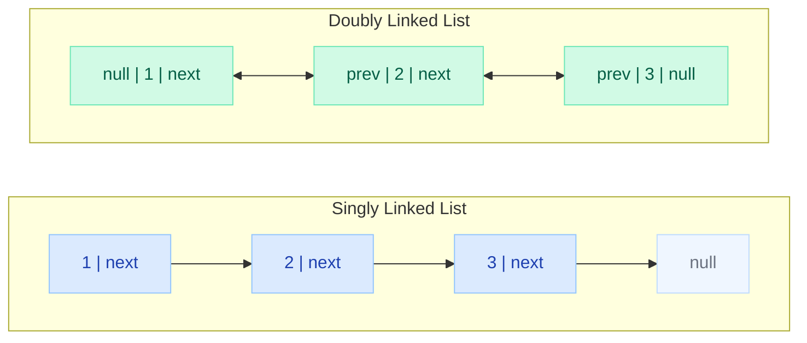
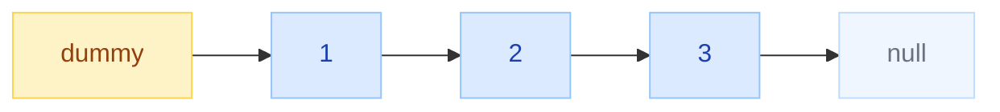
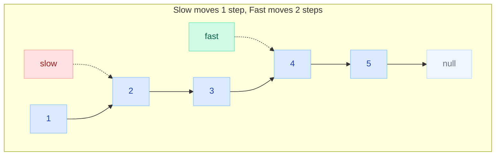
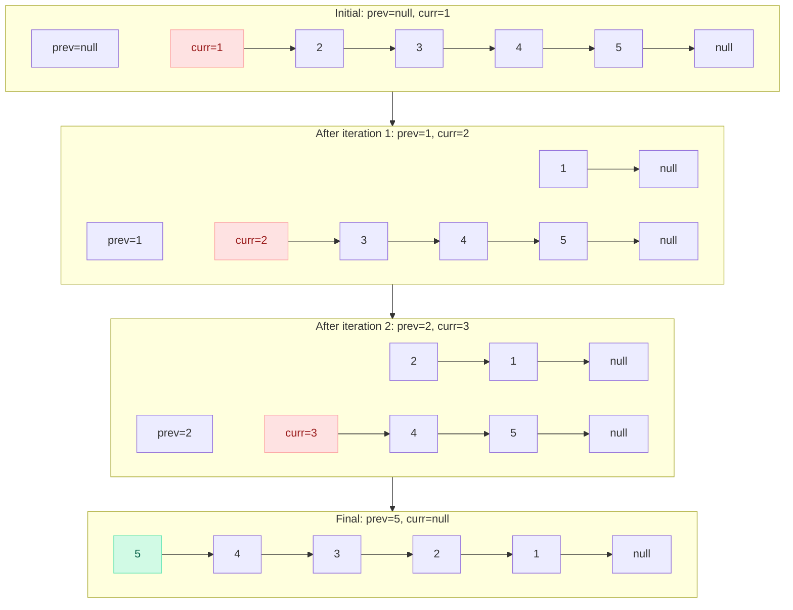
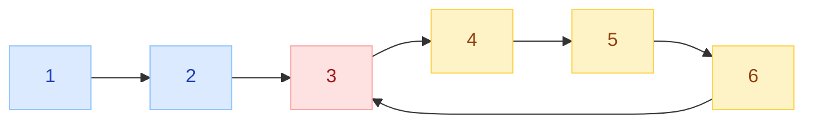
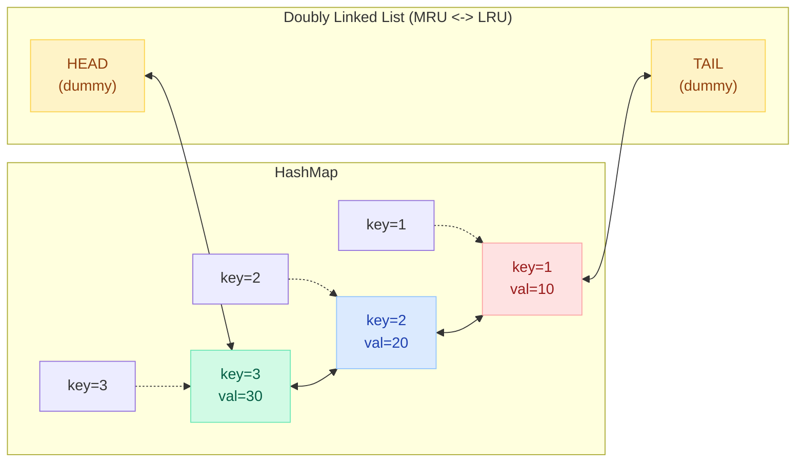

# Linked Lists

<div class="vtn-hero" style="margin-left: 0; margin-right: 0; padding: 2.5rem 2rem;">
<span class="vtn-tag">DSA Pattern</span>
<h1 style="font-size: 2.2rem !important;">Linked List Mastery</h1>
<p class="vtn-subtitle">Linked list problems test pointer manipulation skills. They're less about complex algorithms and more about getting the details right without bugs. Master 5 techniques and you can solve any linked list problem thrown at you in a FAANG interview.</p>
<div class="vtn-stats">
<div class="vtn-stat"><span class="vtn-stat-number">5</span><span class="vtn-stat-label">Techniques</span></div>
<div class="vtn-stat"><span class="vtn-stat-number">12</span><span class="vtn-stat-label">Must-Solve</span></div>
<div class="vtn-stat"><span class="vtn-stat-number">3</span><span class="vtn-stat-label">Walkthroughs</span></div>
</div>
</div>

---

## Core Concepts

### Singly vs Doubly Linked List



### The ListNode Definition

```java
// Singly Linked List Node — the standard LeetCode definition
public class ListNode {
    int val;
    ListNode next;
    
    ListNode() {}
    ListNode(int val) { this.val = val; }
    ListNode(int val, ListNode next) { this.val = val; this.next = next; }
}

// Doubly Linked List Node — used in LRU Cache, browser history
public class DListNode {
    int key, val;
    DListNode prev, next;
    
    DListNode(int key, int val) { this.key = key; this.val = val; }
}
```

### Why Linked Lists in Interviews?

!!! tip "What interviewers are actually testing"
    - **Null handling** — Can you write code that doesn't crash on empty/single-node lists?
    - **Pointer rewiring** — Can you manipulate references without losing nodes?
    - **Edge case awareness** — Do you test head, tail, odd/even length?
    - **Space efficiency** — Can you solve in O(1) space with in-place modifications?

---

## The 5 Techniques That Solve Everything

### 1. Dummy Head Node

The dummy (sentinel) node eliminates special-case logic for operations that modify the head.



=== "Without Dummy (messy)"

    ```java
    public ListNode removeElements(ListNode head, int val) {
        // Special case: head itself needs removal
        while (head != null && head.val == val) {
            head = head.next;
        }
        ListNode curr = head;
        while (curr != null && curr.next != null) {
            if (curr.next.val == val) {
                curr.next = curr.next.next;
            } else {
                curr = curr.next;
            }
        }
        return head;
    }
    ```

=== "With Dummy (clean)"

    ```java
    public ListNode removeElements(ListNode head, int val) {
        ListNode dummy = new ListNode(0, head);
        ListNode curr = dummy;
        while (curr.next != null) {
            if (curr.next.val == val) {
                curr.next = curr.next.next;
            } else {
                curr = curr.next;
            }
        }
        return dummy.next;
    }
    ```

!!! warning "When to use a dummy head"
    Use it whenever the head of the list might change — deletion, partition, merge, etc. The cost is one extra allocation; the benefit is cleaner, less error-prone code.

---

### 2. Two Pointers (Slow/Fast)

The slow/fast pointer technique (Floyd's Tortoise and Hare) solves three categories of problems:



| Problem Type | How It Works |
|---|---|
| **Find middle** | When fast reaches end, slow is at middle |
| **Detect cycle** | If fast meets slow, cycle exists |
| **Nth from end** | Advance fast N steps first, then move both |

```java
// Find middle node (for odd length: exact middle, for even: second middle)
public ListNode middleNode(ListNode head) {
    ListNode slow = head, fast = head;
    while (fast != null && fast.next != null) {
        slow = slow.next;
        fast = fast.next.next;
    }
    return slow;
}

// Remove Nth node from end
public ListNode removeNthFromEnd(ListNode head, int n) {
    ListNode dummy = new ListNode(0, head);
    ListNode fast = dummy, slow = dummy;
    for (int i = 0; i <= n; i++) fast = fast.next;
    while (fast != null) {
        slow = slow.next;
        fast = fast.next;
    }
    slow.next = slow.next.next;
    return dummy.next;
}
```

---

### 3. Reversal

The most fundamental linked list operation. You must be able to write this in your sleep.

#### Iterative Reversal (3 Pointers)

```mermaid
flowchart LR
    subgraph Step1["Step 1: Save next"]
        direction LR
        P1["prev=null"] ~~~ C1["curr=1"] --> NX1["next=2"] --> S1_3["3"] --> S1_N["null"]
    end
    
    subgraph Step2["Step 2: Reverse pointer"]
        direction LR
        P2["prev=null"] <-- C2["curr=1"]
        NX2["next=2"] --> S2_3["3"] --> S2_N["null"]
    end
    
    subgraph Step3["Step 3: Advance prev & curr"]
        direction LR
        S3_1["1"] --> S3_null["null"]
        P3["prev=1"] ~~~ C3["curr=2"] --> S3_3["3"] --> S3_N["null"]
    end

    style C1 fill:#FEE2E2,stroke:#FCA5A5,color:#991B1B
    style C2 fill:#FEE2E2,stroke:#FCA5A5,color:#991B1B
    style C3 fill:#FEE2E2,stroke:#FCA5A5,color:#991B1B
    style P1 fill:#D1FAE5,stroke:#6EE7B7,color:#065F46
    style P2 fill:#D1FAE5,stroke:#6EE7B7,color:#065F46
    style P3 fill:#D1FAE5,stroke:#6EE7B7,color:#065F46
    style NX1 fill:#FEF3C7,stroke:#FCD34D,color:#92400E
    style NX2 fill:#FEF3C7,stroke:#FCD34D,color:#92400E
```

=== "Iterative"

    ```java
    public ListNode reverseList(ListNode head) {
        ListNode prev = null, curr = head;
        while (curr != null) {
            ListNode next = curr.next;  // 1. Save next
            curr.next = prev;           // 2. Reverse pointer
            prev = curr;                // 3. Advance prev
            curr = next;                // 4. Advance curr
        }
        return prev;
    }
    ```

=== "Recursive"

    ```java
    public ListNode reverseList(ListNode head) {
        // Base case: empty list or single node
        if (head == null || head.next == null) return head;
        
        // Recurse: reverse everything after head
        ListNode newHead = reverseList(head.next);
        
        // head.next is now the LAST node of the reversed sublist
        // Make it point back to head
        head.next.next = head;
        head.next = null;
        
        return newHead;
    }
    ```

!!! tip "The recursive trick explained"
    After `reverseList(head.next)` returns, `head.next` still points to the last node of the reversed portion. So `head.next.next = head` makes that last node point back to us. Then `head.next = null` breaks the old forward link.

---

### 4. Merge Two Sorted Lists

A building block for merge sort on linked lists and many other problems.

```mermaid
flowchart LR
    subgraph L1["List 1"]
        A["1"] --> B["3"] --> C["5"]
    end
    subgraph L2["List 2"]
        D["2"] --> E["4"] --> F["6"]
    end
    subgraph Merged["Merged"]
        M1["1"] --> M2["2"] --> M3["3"] --> M4["4"] --> M5["5"] --> M6["6"]
    end

    style A fill:#DBEAFE,stroke:#93C5FD,color:#1E40AF
    style B fill:#DBEAFE,stroke:#93C5FD,color:#1E40AF
    style C fill:#DBEAFE,stroke:#93C5FD,color:#1E40AF
    style D fill:#D1FAE5,stroke:#6EE7B7,color:#065F46
    style E fill:#D1FAE5,stroke:#6EE7B7,color:#065F46
    style F fill:#D1FAE5,stroke:#6EE7B7,color:#065F46
    style M1 fill:#DBEAFE,stroke:#93C5FD,color:#1E40AF
    style M2 fill:#D1FAE5,stroke:#6EE7B7,color:#065F46
    style M3 fill:#DBEAFE,stroke:#93C5FD,color:#1E40AF
    style M4 fill:#D1FAE5,stroke:#6EE7B7,color:#065F46
    style M5 fill:#DBEAFE,stroke:#93C5FD,color:#1E40AF
    style M6 fill:#D1FAE5,stroke:#6EE7B7,color:#065F46
```



```java
public ListNode mergeTwoLists(ListNode l1, ListNode l2) {
    ListNode dummy = new ListNode(0);
    ListNode tail = dummy;
    
    while (l1 != null && l2 != null) {
        if (l1.val <= l2.val) {
            tail.next = l1;
            l1 = l1.next;
        } else {
            tail.next = l2;
            l2 = l2.next;
        }
        tail = tail.next;
    }
    tail.next = (l1 != null) ? l1 : l2;
    return dummy.next;
}
```

---

### 5. In-Place Modification (Reorder List)

Problems like Reorder List (L0 -> Ln -> L1 -> Ln-1 -> ...) combine multiple techniques:

1. **Find middle** (slow/fast)
2. **Reverse** second half
3. **Merge** alternating nodes

```java
public void reorderList(ListNode head) {
    if (head == null || head.next == null) return;
    
    // 1. Find middle
    ListNode slow = head, fast = head;
    while (fast.next != null && fast.next.next != null) {
        slow = slow.next;
        fast = fast.next.next;
    }
    
    // 2. Reverse second half
    ListNode second = reverse(slow.next);
    slow.next = null; // cut the list
    
    // 3. Merge alternating
    ListNode first = head;
    while (second != null) {
        ListNode tmp1 = first.next, tmp2 = second.next;
        first.next = second;
        second.next = tmp1;
        first = tmp1;
        second = tmp2;
    }
}
```

---

## Solved Walkthroughs

### Problem 1: Reverse Linked List (LC #206)

???+ question "Problem Statement"
    Given the head of a singly linked list, reverse the list and return the reversed list.
    
    **Input:** head = [1, 2, 3, 4, 5]  
    **Output:** [5, 4, 3, 2, 1]

#### Step-by-Step Pointer Diagram



#### Code

```java
public ListNode reverseList(ListNode head) {
    ListNode prev = null, curr = head;
    while (curr != null) {
        ListNode next = curr.next;
        curr.next = prev;
        prev = curr;
        curr = next;
    }
    return prev; // prev is the new head
}
```

#### Complexity

| | Value |
|---|---|
| **Time** | O(n) — single pass |
| **Space** | O(1) — only 3 pointers |

#### Common Mistakes

!!! danger "Don't forget to save `curr.next` BEFORE overwriting it"
    ```java
    // BUG: loses the rest of the list!
    curr.next = prev;
    ListNode next = curr.next; // This is now prev, not the original next!
    ```

---

### Problem 2: Linked List Cycle II (LC #142)

???+ question "Problem Statement"
    Given a linked list, return the node where the cycle begins. If there is no cycle, return null.

#### Floyd's Algorithm — The Math Proof



!!! tip "Why Floyd's works — the math"
    Let:
    
    - **F** = distance from head to cycle start
    - **C** = cycle length
    - **a** = distance from cycle start to meeting point
    
    When slow and fast meet:
    
    - Slow traveled: **F + a**
    - Fast traveled: **F + a + nC** (completed n full cycles)
    - Since fast moves 2x: **2(F + a) = F + a + nC**
    - Simplifying: **F + a = nC**
    - Therefore: **F = nC - a = (n-1)C + (C - a)**
    
    This means: the distance from **head to cycle start** equals the distance from **meeting point to cycle start** (going forward around the cycle). So if you put one pointer at head and one at the meeting point, advancing both by 1, they meet at the cycle start.

#### Code

```java
public ListNode detectCycle(ListNode head) {
    ListNode slow = head, fast = head;
    
    // Phase 1: Detect if cycle exists
    while (fast != null && fast.next != null) {
        slow = slow.next;
        fast = fast.next.next;
        if (slow == fast) break;
    }
    
    // No cycle
    if (fast == null || fast.next == null) return null;
    
    // Phase 2: Find cycle start
    // Move one pointer to head, keep other at meeting point
    slow = head;
    while (slow != fast) {
        slow = slow.next;
        fast = fast.next;  // Both move at speed 1 now
    }
    return slow; // This is the cycle start
}
```

#### Complexity

| | Value |
|---|---|
| **Time** | O(n) |
| **Space** | O(1) — no HashSet needed |

#### Common Mistakes

!!! danger "Phase 1 loop condition"
    Check `fast != null && fast.next != null` — not `fast.next != null && fast.next.next != null`. The second form crashes when fast itself is null.

---

### Problem 3: LRU Cache (LC #146)

???+ question "Problem Statement"
    Design a data structure that supports `get(key)` and `put(key, value)` in O(1) time with a capacity limit. When capacity is exceeded, evict the least recently used item.

#### Architecture: HashMap + Doubly Linked List



!!! tip "Design Insight"
    - **HashMap** gives O(1) lookup by key
    - **Doubly Linked List** gives O(1) insertion/deletion (with node reference)
    - Most recently used at the **head**, least recently used at the **tail**
    - On `get`: move accessed node to head
    - On `put`: add at head, if over capacity evict from tail

#### Full Implementation

```java
class LRUCache {
    
    private class DListNode {
        int key, val;
        DListNode prev, next;
        DListNode(int key, int val) { this.key = key; this.val = val; }
    }
    
    private int capacity;
    private Map<Integer, DListNode> map;
    private DListNode head, tail; // dummy sentinels
    
    public LRUCache(int capacity) {
        this.capacity = capacity;
        this.map = new HashMap<>();
        head = new DListNode(0, 0);
        tail = new DListNode(0, 0);
        head.next = tail;
        tail.prev = head;
    }
    
    public int get(int key) {
        if (!map.containsKey(key)) return -1;
        DListNode node = map.get(key);
        moveToHead(node);
        return node.val;
    }
    
    public void put(int key, int value) {
        if (map.containsKey(key)) {
            DListNode node = map.get(key);
            node.val = value;
            moveToHead(node);
        } else {
            DListNode newNode = new DListNode(key, value);
            map.put(key, newNode);
            addToHead(newNode);
            if (map.size() > capacity) {
                DListNode lru = tail.prev;
                removeNode(lru);
                map.remove(lru.key);
            }
        }
    }
    
    // --- Helper methods ---
    
    private void addToHead(DListNode node) {
        node.prev = head;
        node.next = head.next;
        head.next.prev = node;
        head.next = node;
    }
    
    private void removeNode(DListNode node) {
        node.prev.next = node.next;
        node.next.prev = node.prev;
    }
    
    private void moveToHead(DListNode node) {
        removeNode(node);
        addToHead(node);
    }
}
```

#### Complexity

| Operation | Time | Space |
|---|---|---|
| `get(key)` | O(1) | — |
| `put(key, value)` | O(1) | — |
| **Overall space** | — | O(capacity) |

#### Common Mistakes

!!! danger "Critical implementation pitfalls"
    1. **Forgetting to store the key in the node** — you need it to remove from the HashMap when evicting from the tail
    2. **Not using dummy head/tail** — leads to 4+ null checks in add/remove
    3. **Wrong pointer order in `addToHead`** — must update `head.next.prev` before `head.next`

---

## Edge Cases Checklist

!!! warning "The things that trip people up in interviews"

    | Edge Case | Why It Matters |
    |---|---|
    | **Null head** | Every method must handle `head == null` |
    | **Single node** | Reversal, middle-finding, cycle detection all need this check |
    | **Even vs odd length** | Middle node is different; affects split operations |
    | **Cycle at head** | Head itself is part of the cycle — fast/slow still works |
    | **Cycle at tail** | Tail points back to any earlier node |
    | **Two lists of different lengths** | Intersection and merge problems need length alignment |
    | **Duplicate values** | Don't confuse node identity with value equality |

---

## Common Mistakes

!!! danger "6 Bugs That Cost Offers"

    **1. Losing the reference to next before overwriting**
    ```java
    // WRONG — curr.next is gone forever
    curr.next = prev;
    curr = curr.next; // This is prev now!
    
    // CORRECT
    ListNode next = curr.next;
    curr.next = prev;
    curr = next;
    ```

    **2. Off-by-one in fast/slow pointer initialization**
    ```java
    // For finding middle (prefer second middle for even-length):
    ListNode slow = head, fast = head;
    // For finding the node BEFORE middle:
    ListNode slow = head, fast = head.next;
    ```

    **3. Not checking `fast.next` before `fast.next.next`**
    ```java
    // CRASH on odd-length lists
    while (fast.next.next != null) // NullPointerException if fast.next is null
    
    // SAFE
    while (fast != null && fast.next != null)
    ```

    **4. Forgetting to terminate the list after splitting**
    ```java
    // After finding middle for merge sort:
    ListNode mid = findMiddle(head);
    ListNode secondHalf = mid.next;
    mid.next = null; // MUST cut the link!
    ```

    **5. Modifying the list while iterating**
    ```java
    // WRONG — infinite loop if you don't advance correctly
    while (curr != null) {
        if (curr.val == target) curr.next = curr.next.next;
        curr = curr.next; // Skips the node after deletion!
    }
    ```

    **6. Returning `head` instead of `dummy.next`**
    ```java
    // If head was deleted, `head` still points to the old (now disconnected) node
    // Always return dummy.next when using dummy head pattern
    ```

---

## Practice Problems

Sorted from foundational to advanced. Solve in this order:

| # | Problem | Difficulty | Key Technique |
|---|---|---|---|
| 1 | [Reverse Linked List](https://leetcode.com/problems/reverse-linked-list/) (LC 206) | Easy | Reversal |
| 2 | [Merge Two Sorted Lists](https://leetcode.com/problems/merge-two-sorted-lists/) (LC 21) | Easy | Merge + Dummy head |
| 3 | [Linked List Cycle](https://leetcode.com/problems/linked-list-cycle/) (LC 141) | Easy | Two pointers |
| 4 | [Remove Nth From End](https://leetcode.com/problems/remove-nth-node-from-end-of-list/) (LC 19) | Medium | Two pointers + Dummy |
| 5 | [Add Two Numbers](https://leetcode.com/problems/add-two-numbers/) (LC 2) | Medium | Dummy head + Carry |
| 6 | [Intersection of Two Lists](https://leetcode.com/problems/intersection-of-two-linked-lists/) (LC 160) | Easy | Two pointers (length trick) |
| 7 | [Palindrome Linked List](https://leetcode.com/problems/palindrome-linked-list/) (LC 234) | Easy | Slow/fast + Reversal |
| 8 | [Linked List Cycle II](https://leetcode.com/problems/linked-list-cycle-ii/) (LC 142) | Medium | Floyd's algorithm |
| 9 | [Reorder List](https://leetcode.com/problems/reorder-list/) (LC 143) | Medium | All techniques combined |
| 10 | [Copy List with Random Pointer](https://leetcode.com/problems/copy-list-with-random-pointer/) (LC 138) | Medium | In-place interleave |
| 11 | [Merge K Sorted Lists](https://leetcode.com/problems/merge-k-sorted-lists/) (LC 23) | Hard | Merge + Divide & Conquer |
| 12 | [LRU Cache](https://leetcode.com/problems/lru-cache/) (LC 146) | Medium | HashMap + Doubly LL |

---

## Quick Reference Card

???+ tip "Interview Template"
    ```java
    // 1. Always start with null check
    if (head == null || head.next == null) return head;
    
    // 2. Use dummy head when head might change
    ListNode dummy = new ListNode(0, head);
    
    // 3. Two pointers template
    ListNode slow = head, fast = head;
    while (fast != null && fast.next != null) { ... }
    
    // 4. Reversal template (iterative)
    ListNode prev = null, curr = head;
    while (curr != null) {
        ListNode next = curr.next;
        curr.next = prev;
        prev = curr;
        curr = next;
    }
    // prev is the new head
    
    // 5. Always return dummy.next, not head
    return dummy.next;
    ```

!!! tip "Interview Tip"
    When asked a linked list problem, immediately ask: "Can I modify the input list?" and "Is there a cycle possibility?" These clarifying questions show maturity and help you choose the right technique.
