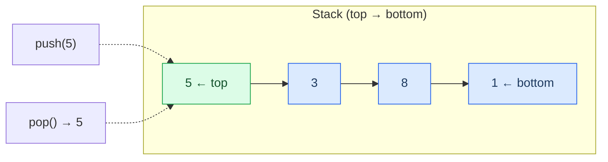
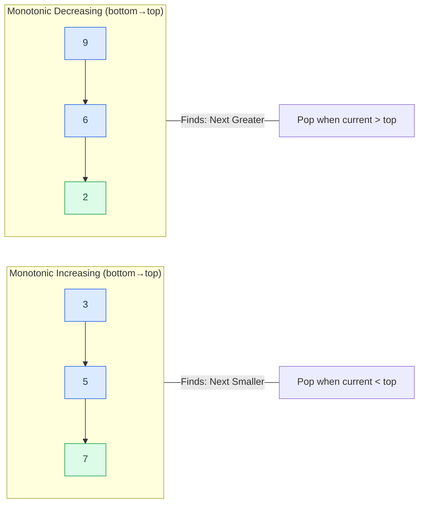
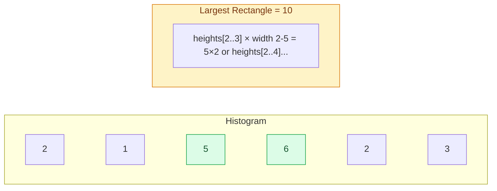

<div class="vtn-hero" style="margin-left: 0; margin-right: 0; padding: 2.5rem 2rem;">
<span class="vtn-tag">DSA Pattern</span>
<h1 style="font-size: 2.2rem !important;">Stacks & Queues</h1>
<p class="vtn-subtitle">Stacks are deceptively powerful. Monotonic stacks alone solve an entire class of "next greater/smaller" problems that seem hard until you see the pattern. Once you internalize the monotonic template, a dozen medium/hard LeetCode problems become straightforward.</p>
<div class="vtn-stats">
<div class="vtn-stat"><span class="vtn-stat-number">3</span><span class="vtn-stat-label">Core Patterns</span></div>
<div class="vtn-stat"><span class="vtn-stat-number">15</span><span class="vtn-stat-label">Practice Problems</span></div>
<div class="vtn-stat"><span class="vtn-stat-number">O(n)</span><span class="vtn-stat-label">Time Complexity</span></div>
</div>
</div>

---

## Stack Fundamentals

### LIFO — Last In, First Out



### The Right Way to Use Stacks in Java

```java
// CORRECT — use Deque interface with ArrayDeque
Deque<Integer> stack = new ArrayDeque<>();
stack.push(5);      // pushes to top
stack.pop();        // removes and returns top
stack.peek();       // returns top without removing
stack.isEmpty();    // check before pop/peek
```

!!! warning "Never Use `java.util.Stack` in Interviews"
    The `Stack` class extends `Vector`, making every operation synchronized — unnecessary overhead for single-threaded code. It also allows random access via index (`get(i)`), which violates the stack abstraction. **Interviewers notice this.** Always use `Deque<E> stack = new ArrayDeque<>()`.

    | Feature | `java.util.Stack` | `ArrayDeque` |
    |---|---|---|
    | Thread safety | Synchronized (slow) | Not synchronized (fast) |
    | Inheritance | Extends Vector (leaky abstraction) | Implements Deque |
    | Random access | Yes (breaks LIFO contract) | No (correct abstraction) |
    | Null elements | Allowed | Not allowed |
    | Recommended | Since Java 1.0 (legacy) | Since Java 6 (modern) |

### Stack Operations — Complexity

| Operation | Time | Space |
|---|---|---|
| push | O(1) amortized | O(1) |
| pop | O(1) | O(1) |
| peek | O(1) | O(1) |
| isEmpty | O(1) | O(1) |
| search | O(n) | O(1) |

---

## Monotonic Stack Deep Dive

This is the single most valuable stack pattern for FAANG interviews. It converts O(n^2) brute-force "next greater/smaller" problems into elegant O(n) solutions.

### The Core Insight

!!! tip "The Key Mental Model"
    A monotonic stack maintains elements in sorted order (either increasing or decreasing from bottom to top). **When we pop an element, we have found the answer for that element** — the current element being processed is the "next greater" or "next smaller" for everything it forces off the stack.

    Think of it like a queue at a nightclub: shorter people get pushed aside when a taller person arrives. The moment you're pushed aside, the person who pushed you is your "next taller person."

### Two Variants



### Template: Next Greater Element (Monotonic Decreasing Stack)

```java
/**
 * For each element, find the next element to the right that is GREATER.
 * Stack maintains decreasing order (bottom to top).
 * When current > top, current is the "next greater" for top.
 */
public int[] nextGreaterElement(int[] nums) {
    int n = nums.length;
    int[] result = new int[n];
    Arrays.fill(result, -1); // default: no next greater
    Deque<Integer> stack = new ArrayDeque<>(); // stores INDICES

    for (int i = 0; i < n; i++) {
        // Pop all elements smaller than current — current is their answer
        while (!stack.isEmpty() && nums[stack.peek()] < nums[i]) {
            int idx = stack.pop();
            result[idx] = nums[i];
        }
        stack.push(i);
    }
    return result;
}
```

### Template: Next Smaller Element (Monotonic Increasing Stack)

```java
/**
 * For each element, find the next element to the right that is SMALLER.
 * Stack maintains increasing order (bottom to top).
 * When current < top, current is the "next smaller" for top.
 */
public int[] nextSmallerElement(int[] nums) {
    int n = nums.length;
    int[] result = new int[n];
    Arrays.fill(result, -1);
    Deque<Integer> stack = new ArrayDeque<>();

    for (int i = 0; i < n; i++) {
        while (!stack.isEmpty() && nums[stack.peek()] > nums[i]) {
            int idx = stack.pop();
            result[idx] = nums[i];
        }
        stack.push(i);
    }
    return result;
}
```

### Visual Walkthrough: Daily Temperatures (LC #739)

Given `temperatures = [73, 74, 75, 71, 69, 72, 76, 73]`, find how many days until a warmer temperature.

This is "next greater element" but we return the distance instead of the value.

=== "Step 1-3"

    | Step | Current | Stack (indices) | Stack (values) | Action |
    |---|---|---|---|---|
    | i=0 | 73 | `[]` | `[]` | Push 0. Stack: `[0]` |
    | i=1 | 74 | `[0]` | `[73]` | 74 > 73, pop 0. result[0]=1-0=1. Push 1. Stack: `[1]` |
    | i=2 | 75 | `[1]` | `[74]` | 75 > 74, pop 1. result[1]=2-1=1. Push 2. Stack: `[2]` |

=== "Step 4-6"

    | Step | Current | Stack (indices) | Stack (values) | Action |
    |---|---|---|---|---|
    | i=3 | 71 | `[2]` | `[75]` | 71 < 75, just push. Stack: `[2,3]` |
    | i=4 | 69 | `[2,3]` | `[75,71]` | 69 < 71, just push. Stack: `[2,3,4]` |
    | i=5 | 72 | `[2,3,4]` | `[75,71,69]` | 72 > 69, pop 4: result[4]=1. 72 > 71, pop 3: result[3]=2. 72 < 75, stop. Push 5. Stack: `[2,5]` |

=== "Step 7-8"

    | Step | Current | Stack (indices) | Stack (values) | Action |
    |---|---|---|---|---|
    | i=6 | 76 | `[2,5]` | `[75,72]` | 76 > 72, pop 5: result[5]=1. 76 > 75, pop 2: result[2]=4. Push 6. Stack: `[6]` |
    | i=7 | 73 | `[6]` | `[76]` | 73 < 76, just push. Stack: `[6,7]` |

    **Final result:** `[1, 1, 4, 2, 1, 1, 0, 0]` — remaining elements in stack get 0 (no warmer day).

```java
public int[] dailyTemperatures(int[] temperatures) {
    int n = temperatures.length;
    int[] result = new int[n];
    Deque<Integer> stack = new ArrayDeque<>();

    for (int i = 0; i < n; i++) {
        while (!stack.isEmpty() && temperatures[stack.peek()] < temperatures[i]) {
            int idx = stack.pop();
            result[idx] = i - idx;
        }
        stack.push(i);
    }
    return result;
}
```

---

## Queue & Deque

### Queue = BFS

Queues are the backbone of BFS (Breadth-First Search). Every BFS traversal uses a queue to process nodes level by level. For full BFS details, see the [Graphs page](graphs.md).

```java
Queue<Integer> queue = new LinkedList<>();  // or new ArrayDeque<>()
queue.offer(startNode);   // enqueue
queue.poll();             // dequeue (returns null if empty)
queue.peek();             // front element without removing
```

!!! tip "ArrayDeque vs LinkedList for Queue"
    `ArrayDeque` is faster as a queue in practice (better cache locality, no node allocation overhead). Use `LinkedList` only if you need null elements or the `List` interface simultaneously.

### Monotonic Deque — Sliding Window Maximum/Minimum

The monotonic deque pattern solves the "maximum/minimum in a sliding window" problem in O(n) total time. Without it, you need O(n * k) with brute force or O(n log k) with a heap.

**The insight:** Maintain a deque where elements are in decreasing order. The front always holds the current window's maximum. When sliding the window, remove elements that fall outside, and remove from the back any elements smaller than the new element (they can never be the maximum while the new element exists in the window).

```java
/**
 * Template: Sliding Window Maximum using Monotonic Deque
 * Deque stores INDICES, maintains decreasing order of values.
 */
public int[] maxSlidingWindow(int[] nums, int k) {
    int n = nums.length;
    int[] result = new int[n - k + 1];
    Deque<Integer> deque = new ArrayDeque<>(); // stores indices

    for (int i = 0; i < n; i++) {
        // Remove elements outside the window
        while (!deque.isEmpty() && deque.peekFirst() < i - k + 1) {
            deque.pollFirst();
        }
        // Remove elements smaller than current (they'll never be max)
        while (!deque.isEmpty() && nums[deque.peekLast()] < nums[i]) {
            deque.pollLast();
        }
        deque.offerLast(i);

        // Window is fully formed starting at i >= k-1
        if (i >= k - 1) {
            result[i - k + 1] = nums[deque.peekFirst()];
        }
    }
    return result;
}
```

### Priority Queue (Brief)

A Priority Queue (min-heap/max-heap) is covered in detail on the [Heaps & Greedy page](heaps-greedy.md). Key point: use `PriorityQueue` when you need the min/max across the entire dataset, use monotonic deque when you need min/max within a sliding window.

---

## Solved Walkthroughs

### Problem 1: Valid Parentheses (LC #20) — Easy

???question "Problem Statement"
    Given a string containing just the characters `(`, `)`, `{`, `}`, `[` and `]`, determine if the input string is valid. An input string is valid if: open brackets are closed by the same type, and open brackets are closed in the correct order.

**Brute force:** Repeatedly remove innermost pairs `()`, `{}`, `[]` until string is empty or no more removals possible. O(n^2).

**Insight:** A stack naturally handles nesting. Push opening brackets; when you see a closing bracket, the top of the stack must be its matching opener.

**The map-based approach (cleaner than if-else chains):**

```java
public boolean isValid(String s) {
    Deque<Character> stack = new ArrayDeque<>();
    Map<Character, Character> map = Map.of(
        ')', '(',
        '}', '{',
        ']', '['
    );

    for (char c : s.toCharArray()) {
        if (map.containsKey(c)) {
            // Closing bracket — check match
            if (stack.isEmpty() || stack.pop() != map.get(c)) {
                return false;
            }
        } else {
            // Opening bracket — push
            stack.push(c);
        }
    }
    return stack.isEmpty();
}
```

**Complexity:** O(n) time, O(n) space.

!!! warning "Common Mistakes"
    - Forgetting to check `stack.isEmpty()` at the end — the string `"((("` has no mismatches but is invalid.
    - Not handling the case where a closing bracket arrives when the stack is empty — e.g., `")"`.

---

### Problem 2: Largest Rectangle in Histogram (LC #84) — Hard

???question "Problem Statement"
    Given an array of integers `heights` representing the histogram's bar height where the width of each bar is 1, find the area of the largest rectangle in the histogram.

This is the hardest monotonic stack problem and a FAANG favorite. If you understand this, every other monotonic stack problem becomes manageable.

**Brute force:** For each bar, expand left and right to find how far it can extend. O(n^2).

**Insight:** For each bar, we need to know the "nearest shorter bar on the left" and "nearest shorter bar on the right." The rectangle using bar `i` as the shortest has width = `rightBoundary - leftBoundary - 1` and height = `heights[i]`.

A monotonic increasing stack gives us both boundaries in a single pass.

**Step-by-step for `heights = [2, 1, 5, 6, 2, 3]`:**



=== "Walkthrough"

    | i | heights[i] | Stack (indices) | Action | Area Calculated |
    |---|---|---|---|---|
    | 0 | 2 | `[]` | Push 0. Stack: `[0]` | — |
    | 1 | 1 | `[0]` | 1 < 2, pop 0. height=2, width=1(no left boundary). Area=2. Push 1. Stack: `[1]` | 2 |
    | 2 | 5 | `[1]` | 5 > 1, push 2. Stack: `[1,2]` | — |
    | 3 | 6 | `[1,2]` | 6 > 5, push 3. Stack: `[1,2,3]` | — |
    | 4 | 2 | `[1,2,3]` | 2 < 6, pop 3. h=6, w=4-2-1=1. Area=6. Pop 2. h=5, w=4-1-1=2. Area=10. 2 >= 1, stop. Push 4. Stack: `[1,4]` | 6, **10** |
    | 5 | 3 | `[1,4]` | 3 > 2, push 5. Stack: `[1,4,5]` | — |
    | end | — | `[1,4,5]` | Pop 5: h=3, w=6-4-1=1. Area=3. Pop 4: h=2, w=6-1-1=4. Area=8. Pop 1: h=1, w=6. Area=6. | 3, 8, 6 |

    **Maximum area = 10** (bar of height 5, extending over indices 2-3, width 2).

=== "Code"

    ```java
    public int largestRectangleArea(int[] heights) {
        int n = heights.length;
        int maxArea = 0;
        Deque<Integer> stack = new ArrayDeque<>(); // monotonic increasing

        for (int i = 0; i <= n; i++) {
            // Use 0 as sentinel for the final flush
            int currentHeight = (i == n) ? 0 : heights[i];

            while (!stack.isEmpty() && heights[stack.peek()] > currentHeight) {
                int height = heights[stack.pop()];
                // Width: from current left boundary to i
                int width = stack.isEmpty() ? i : i - stack.peek() - 1;
                maxArea = Math.max(maxArea, height * width);
            }
            stack.push(i);
        }
        return maxArea;
    }
    ```

=== "Why the Sentinel?"

    When we finish iterating, elements remain in the stack that never found a "next smaller" to the right. By appending a virtual bar of height 0 at position `n`, we force every remaining element to pop — calculating their area with the right boundary at `n`.

**Complexity:** O(n) time (each bar pushed/popped at most once), O(n) space.

!!! warning "Common Mistakes"
    - Forgetting the sentinel (leaving bars in the stack without calculating their area).
    - Getting the width formula wrong: it's `i - stack.peek() - 1` when stack is non-empty, or `i` when stack is empty (bar extends to the left edge).
    - Using `>=` instead of `>` in the while condition — equal heights should be pushed, not popped (though popping them also works if you handle it carefully).

---

### Problem 3: Sliding Window Maximum (LC #239) — Hard

???question "Problem Statement"
    You are given an array of integers `nums` and a sliding window of size `k` which is moving from the left of the array to the right. Return the max element in each window position.

**Brute force:** For each window, scan all k elements. O(n * k).

**Heap approach:** Use a max-heap, lazily remove expired elements. O(n log k).

**Optimal — Monotonic Deque:** O(n) total.

**Insight:** We maintain a deque of indices in decreasing order of their values. The front of the deque is always the maximum of the current window. When we slide the window:

1. Remove the front if it's outside the window.
2. Remove elements from the back that are smaller than the incoming element (they can never be the answer while the new element is in the window).
3. Add the new element to the back.

=== "Walkthrough"

    `nums = [1, 3, -1, -3, 5, 3, 6, 7]`, `k = 3`

    | i | nums[i] | Deque (indices) | Deque (values) | Window | Max |
    |---|---|---|---|---|---|
    | 0 | 1 | `[0]` | `[1]` | forming... | — |
    | 1 | 3 | `[1]` | `[3]` | forming... | — |
    | 2 | -1 | `[1,2]` | `[3,-1]` | [1,3,-1] | **3** |
    | 3 | -3 | `[1,2,3]` | `[3,-1,-3]` | [3,-1,-3] | **3** |
    | 4 | 5 | `[4]` | `[5]` | [-1,-3,5] | **5** |
    | 5 | 3 | `[4,5]` | `[5,3]` | [-3,5,3] | **5** |
    | 6 | 6 | `[6]` | `[6]` | [5,3,6] | **6** |
    | 7 | 7 | `[7]` | `[7]` | [3,6,7] | **7** |

    At i=4: nums[4]=5 is greater than -3, -1, and 3, so we pop all from back. Even index 1 (value 3) is removed because it's outside the window (1 < 4-3+1=2). Result: `[3, 3, 5, 5, 6, 7]`

=== "Code"

    ```java
    public int[] maxSlidingWindow(int[] nums, int k) {
        int n = nums.length;
        int[] result = new int[n - k + 1];
        Deque<Integer> deque = new ArrayDeque<>();

        for (int i = 0; i < n; i++) {
            // Remove indices outside the window
            while (!deque.isEmpty() && deque.peekFirst() < i - k + 1) {
                deque.pollFirst();
            }
            // Remove smaller elements from back (they're useless)
            while (!deque.isEmpty() && nums[deque.peekLast()] <= nums[i]) {
                deque.pollLast();
            }
            deque.offerLast(i);

            if (i >= k - 1) {
                result[i - k + 1] = nums[deque.peekFirst()];
            }
        }
        return result;
    }
    ```

=== "Why O(n)?"

    Each element is added to the deque exactly once and removed at most once. So across all iterations, the total work of the inner while loops is O(n), not O(n*k).

**Complexity:** O(n) time, O(k) space.

---

## Stack-Based Patterns Table

| Pattern | Signal in Problem | Template | Example Problems |
|---|---|---|---|
| **Matching/Nesting** | Parentheses, tags, nested structures | Push openers, pop on closer | Valid Parentheses, Decode String |
| **Monotonic Stack (Next Greater)** | "Next greater element", "days until warmer" | Decreasing stack, pop when current > top | Daily Temperatures, Next Greater Element I/II |
| **Monotonic Stack (Next Smaller)** | "Next smaller", "largest rectangle" | Increasing stack, pop when current < top | Largest Rectangle, Trapping Rain Water |
| **Expression Evaluation** | Calculator, RPN, operator precedence | Operator stack + operand stack | Basic Calculator, Evaluate RPN |
| **Monotonic Deque** | "Maximum/minimum in window", sliding window | Deque maintaining decreasing/increasing order | Sliding Window Maximum, Shortest Subarray Sum >= K |
| **Stack as History** | "Undo", "back button", "decode nested" | Stack stores previous states | Min Stack, Decode String, Asteroid Collision |

---

## Common Mistakes

!!! danger "Mistakes That Cost Offers"

    **1. Using `java.util.Stack` instead of `ArrayDeque`**
    Interviewers at Google/Meta specifically watch for this. It signals you don't know modern Java.

    **2. Forgetting to store INDICES instead of values**
    Most monotonic stack problems need indices to compute distances or widths. Storing raw values loses positional information.

    **3. Off-by-one in width calculation**
    In histogram problems, the width is `i - stack.peek() - 1`, not `i - stack.peek()`. Draw it out. The boundaries are exclusive.

    **4. Not handling the empty stack case**
    When the stack is empty after popping, it means the popped element is the smallest so far — its left boundary extends to index 0. Width = `i` (or `n` during final flush).

    **5. Confusing `<=` vs `<` in the while condition**
    For "next greater" you pop when `current > top` (strict). Using `>=` would find "next greater or equal" — different problem. Be precise about what you're computing.

    **6. Forgetting the final flush in histogram**
    After processing all bars, the stack still contains bars that never found a shorter bar to the right. You must pop them all (or use the sentinel trick with height 0 at position n).

---

## Practice Problems

### Tier 1 — Must Solve (High frequency, builds intuition)

| # | Problem | Difficulty | Pattern | Key Insight |
|---|---|---|---|---|
| 20 | Valid Parentheses | Easy | Matching | Map-based bracket matching |
| 155 | Min Stack | Medium | Stack as History | Store min alongside each element |
| 739 | Daily Temperatures | Medium | Monotonic (Next Greater) | Store indices, return distance |
| 150 | Evaluate Reverse Polish Notation | Medium | Expression Eval | Operand stack, pop two on operator |
| 84 | Largest Rectangle in Histogram | Hard | Monotonic (Next Smaller) | Width = right boundary - left boundary - 1 |

### Tier 2 — Solidify the Pattern

| # | Problem | Difficulty | Pattern | Key Insight |
|---|---|---|---|---|
| 496 | Next Greater Element I | Easy | Monotonic (Next Greater) | Precompute with stack, store in map |
| 503 | Next Greater Element II | Medium | Monotonic (Next Greater) | Circular array — iterate 2n with modulo |
| 394 | Decode String | Medium | Stack as History | Push current string + count on nested `[` |
| 735 | Asteroid Collision | Medium | Stack simulation | Only collide when top is right-moving, current is left-moving |
| 239 | Sliding Window Maximum | Hard | Monotonic Deque | Decreasing deque, front = max, expire by index |

### Tier 3 — Advanced (Hard problems for strong candidates)

| # | Problem | Difficulty | Pattern | Key Insight |
|---|---|---|---|---|
| 42 | Trapping Rain Water | Hard | Monotonic Stack (or two pointers) | Each bar traps water based on nearest taller bars on both sides |
| 85 | Maximal Rectangle | Hard | Histogram per row | Build histogram row by row, apply LC #84 |
| 316 | Remove Duplicate Letters | Medium | Monotonic + Greedy | Stack maintains smallest lexicographic order, use last-occurrence map |
| 901 | Online Stock Span | Medium | Monotonic (Next Greater to left) | Stack stores (price, span) pairs |
| 862 | Shortest Subarray with Sum >= K | Hard | Monotonic Deque + Prefix Sum | Deque maintains increasing prefix sums |

---

## Quick Reference Card

```java
// === STACK (LIFO) ===
Deque<Integer> stack = new ArrayDeque<>();
stack.push(x);          // add to top
stack.pop();            // remove from top (throws if empty)
stack.peek();           // view top (throws if empty)
stack.isEmpty();        // always check before pop/peek

// === QUEUE (FIFO) ===
Queue<Integer> queue = new ArrayDeque<>();
queue.offer(x);         // add to back
queue.poll();           // remove from front (null if empty)
queue.peek();           // view front (null if empty)

// === DEQUE (double-ended) ===
Deque<Integer> deque = new ArrayDeque<>();
deque.offerFirst(x);   // add to front
deque.offerLast(x);    // add to back
deque.pollFirst();     // remove from front
deque.pollLast();      // remove from back
deque.peekFirst();     // view front
deque.peekLast();      // view back
```

!!! tip "Interview One-Liners"
    - "Monotonic stack gives O(n) for next greater/smaller problems because each element is pushed and popped at most once."
    - "I use ArrayDeque instead of Stack because Stack is a legacy synchronized class that extends Vector."
    - "The sentinel trick avoids special-casing the final flush of remaining elements."
    - "Monotonic deque gives O(n) sliding window max because the amortized cost per element is O(1) — each element enters and leaves the deque at most once."
