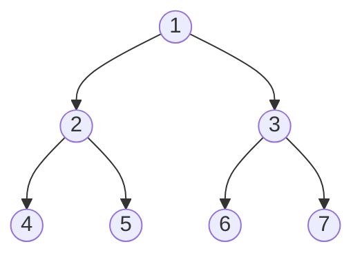

# Trees

<div class="vtn-hero" style="margin-left: 0; margin-right: 0; padding: 2.5rem 2rem;">
<span class="vtn-tag">DSA Pattern</span>
<h1 style="font-size: 2.2rem !important;">Trees — The Recursive Backbone</h1>
<p class="vtn-subtitle">Trees are the second most common interview topic after arrays. Most tree problems reduce to "choose the right traversal + decide what information to pass up or down." Master these two decisions and you can solve 90% of tree problems in under 20 minutes.</p>
<div class="vtn-stats">
<div class="vtn-stat"><span class="vtn-stat-number">4</span><span class="vtn-stat-label">Archetypes</span></div>
<div class="vtn-stat"><span class="vtn-stat-number">15</span><span class="vtn-stat-label">Problems</span></div>
<div class="vtn-stat"><span class="vtn-stat-number">4</span><span class="vtn-stat-label">Walkthroughs</span></div>
</div>
</div>

---

## 1. Core Concepts

### The TreeNode Definition

Every tree problem starts here. Memorize this — you will write it from scratch in interviews.

```java
public class TreeNode {
    int val;
    TreeNode left;
    TreeNode right;

    TreeNode(int val) {
        this.val = val;
    }
}
```

---

### Binary Tree Types

Understanding tree properties helps you recognize constraints and shortcuts available in a problem.

=== "Full Binary Tree"

    Every node has **0 or 2** children. No node has exactly one child.

    ```mermaid
    graph TD
        A((8)) --> B((4))
        A --> C((12))
        B --> D((2))
        B --> E((6))
        C --> F((10))
        C --> G((14))
    ```

    **Property:** If there are `n` leaf nodes, there are `n - 1` internal nodes.

=== "Complete Binary Tree"

    All levels fully filled **except possibly the last**, which is filled left-to-right.

    ```mermaid
    graph TD
        A((1)) --> B((2))
        A --> C((3))
        B --> D((4))
        B --> E((5))
        C --> F((6))
        C --> G((" "))
        style G fill:none,stroke:none
    ```

    **Property:** A heap is always a complete binary tree. Can be stored in an array where children of index `i` are at `2i+1` and `2i+2`.

=== "Perfect Binary Tree"

    All internal nodes have 2 children AND all leaves are at the same level.

    ```mermaid
    graph TD
        A((1)) --> B((2))
        A --> C((3))
        B --> D((4))
        B --> E((5))
        C --> F((6))
        C --> G((7))
    ```

    **Property:** A perfect tree of height `h` has exactly `2^(h+1) - 1` nodes. Height 3 = 15 nodes.

=== "Balanced Binary Tree"

    For **every** node, the height difference between left and right subtrees is at most 1.

    ```mermaid
    graph TD
        A((10)) --> B((5))
        A --> C((15))
        B --> D((3))
        B --> E((7))
        C --> F((12))
    ```

    **Property:** Guarantees O(log n) operations. AVL trees and Red-Black trees are self-balancing.

---

### Height vs Depth — The Confusion That Costs Marks

!!! warning "This trips people up in interviews constantly"
    - **Depth** of a node = number of edges from **root** to that node (root has depth 0)
    - **Height** of a node = number of edges from that node to the **deepest leaf** below it
    - **Height of tree** = height of root = max depth of any leaf

    ```
            1          depth=0, height=3
           / \
          2   3        depth=1, height=1 (node 3)
         / \
        4   5          depth=2, height=0 (leaves)
       /
      6                depth=3, height=0
    ```

    When a problem says "maximum depth of a binary tree" (LC #104), they want the height of the root, which equals the max depth of any leaf.

---

### BST Property

!!! tip "The property applies to the ENTIRE subtree, not just immediate children"
    For every node `n`:

    - **All** nodes in the left subtree have values **< n.val**
    - **All** nodes in the right subtree have values **> n.val**

    This is the #1 mistake in "Validate BST" — checking only immediate children passes some cases but fails on:
    ```
          5
         / \
        1   6
           / \
          3   7    <-- 3 < 5 but is in right subtree! INVALID BST
    ```

---

## 2. Traversal Deep Dive

Every tree problem uses one of these traversals. Pick the right one and you are 80% done.

### The Four Traversals

Consider this tree for all examples:



| Traversal | Order | Result | Mnemonic |
|---|---|---|---|
| **Inorder** | Left, Root, Right | 4, 2, 5, **1**, 6, 3, 7 | "in" = root in the middle |
| **Preorder** | Root, Left, Right | **1**, 2, 4, 5, 3, 6, 7 | "pre" = root first |
| **Postorder** | Left, Right, Root | 4, 5, 2, 6, 7, 3, **1** | "post" = root last |
| **Level-order** | Level by level | 1, 2, 3, 4, 5, 6, 7 | BFS with queue |

---

### When to Use Each

???+ question "How do I pick the right traversal?"
    | Traversal | Use When... | Example Problems |
    |---|---|---|
    | **Inorder** | You need elements in sorted order from a BST | Kth smallest, validate BST |
    | **Preorder** | You need to process a node before its children (top-down) | Serialize tree, copy tree, path sum |
    | **Postorder** | You need children's results before processing the parent (bottom-up) | Tree height, diameter, delete nodes |
    | **Level-order** | You need to process level by level, or find shortest path in unweighted tree | Zigzag traversal, right side view, min depth |

---

### Recursive Implementations

=== "Inorder"

    ```java
    void inorder(TreeNode root, List<Integer> result) {
        if (root == null) return;
        inorder(root.left, result);
        result.add(root.val);        // process between left and right
        inorder(root.right, result);
    }
    ```

=== "Preorder"

    ```java
    void preorder(TreeNode root, List<Integer> result) {
        if (root == null) return;
        result.add(root.val);         // process before children
        preorder(root.left, result);
        preorder(root.right, result);
    }
    ```

=== "Postorder"

    ```java
    void postorder(TreeNode root, List<Integer> result) {
        if (root == null) return;
        postorder(root.left, result);
        postorder(root.right, result);
        result.add(root.val);         // process after children
    }
    ```

=== "Level-order"

    ```java
    List<List<Integer>> levelOrder(TreeNode root) {
        List<List<Integer>> result = new ArrayList<>();
        if (root == null) return result;

        Queue<TreeNode> queue = new LinkedList<>();
        queue.offer(root);

        while (!queue.isEmpty()) {
            int size = queue.size();  // snapshot current level size
            List<Integer> level = new ArrayList<>();

            for (int i = 0; i < size; i++) {
                TreeNode node = queue.poll();
                level.add(node.val);
                if (node.left != null) queue.offer(node.left);
                if (node.right != null) queue.offer(node.right);
            }
            result.add(level);
        }
        return result;
    }
    ```

---

### Iterative Implementations (Interview Must-Know)

!!! warning "Interviewers love asking for iterative traversals"
    They test whether you truly understand the traversal order or just memorized the recursive version. The stack-based iterative approach mirrors the call stack.

=== "Iterative Inorder"

    ```java
    List<Integer> inorderIterative(TreeNode root) {
        List<Integer> result = new ArrayList<>();
        Deque<TreeNode> stack = new ArrayDeque<>();
        TreeNode curr = root;

        while (curr != null || !stack.isEmpty()) {
            // Go as far left as possible
            while (curr != null) {
                stack.push(curr);
                curr = curr.left;
            }
            // Process the node
            curr = stack.pop();
            result.add(curr.val);
            // Move to right subtree
            curr = curr.right;
        }
        return result;
    }
    ```

=== "Iterative Preorder"

    ```java
    List<Integer> preorderIterative(TreeNode root) {
        List<Integer> result = new ArrayList<>();
        if (root == null) return result;

        Deque<TreeNode> stack = new ArrayDeque<>();
        stack.push(root);

        while (!stack.isEmpty()) {
            TreeNode node = stack.pop();
            result.add(node.val);
            // Push right first so left is processed first (LIFO)
            if (node.right != null) stack.push(node.right);
            if (node.left != null) stack.push(node.left);
        }
        return result;
    }
    ```

=== "Iterative Postorder"

    ```java
    List<Integer> postorderIterative(TreeNode root) {
        LinkedList<Integer> result = new LinkedList<>();
        if (root == null) return result;

        Deque<TreeNode> stack = new ArrayDeque<>();
        stack.push(root);

        while (!stack.isEmpty()) {
            TreeNode node = stack.pop();
            result.addFirst(node.val);  // reverse insertion
            if (node.left != null) stack.push(node.left);
            if (node.right != null) stack.push(node.right);
        }
        return result;
    }
    ```

---

### Morris Traversal (O(1) Space)

!!! tip "Mention this to impress — rarely asked to code it"
    Morris traversal uses **threaded binary trees** to achieve O(1) space inorder traversal. It temporarily modifies tree pointers (threading right pointers of predecessors back to current node), then restores them.

    **When it matters:** If the interviewer specifically asks "can you do this without a stack and without recursion?" — this is the answer. Time stays O(n), space drops to O(1).

    ```java
    List<Integer> morrisInorder(TreeNode root) {
        List<Integer> result = new ArrayList<>();
        TreeNode curr = root;

        while (curr != null) {
            if (curr.left == null) {
                result.add(curr.val);
                curr = curr.right;
            } else {
                // Find inorder predecessor
                TreeNode pred = curr.left;
                while (pred.right != null && pred.right != curr) {
                    pred = pred.right;
                }
                if (pred.right == null) {
                    // Create thread
                    pred.right = curr;
                    curr = curr.left;
                } else {
                    // Remove thread, process node
                    pred.right = null;
                    result.add(curr.val);
                    curr = curr.right;
                }
            }
        }
        return result;
    }
    ```

---

## 3. The 4 Tree Problem Archetypes

Every tree problem falls into one of these four categories. Identify the archetype and the solution structure follows naturally.

### Archetype 1: Top-Down (Pass Info Downward)

You carry information **from parent to child**. The function signature typically has extra parameters.

**Pattern:** `void dfs(TreeNode node, infoFromParent)`

| Problem | What You Pass Down |
|---|---|
| Max Depth | current depth |
| Path Sum | remaining target sum |
| Same Tree | both nodes simultaneously |
| Path with target | path so far |

```java
// Example: Max Depth (top-down style)
int maxDepth = 0;

void dfs(TreeNode node, int depth) {
    if (node == null) return;
    if (node.left == null && node.right == null) {
        maxDepth = Math.max(maxDepth, depth);
    }
    dfs(node.left, depth + 1);
    dfs(node.right, depth + 1);
}
```

---

### Archetype 2: Bottom-Up (Aggregate Info Upward)

Children return their results; the parent combines them. The function **returns** useful information.

**Pattern:** `int dfs(TreeNode node)` — returns computed value, may update a global answer.

| Problem | What Children Return | Global Update |
|---|---|---|
| Tree Height | height of subtree | none |
| Diameter | height of subtree | max(leftH + rightH) |
| Balanced Check | height (-1 if unbalanced) | none |
| Subtree Sum | sum of subtree | compare to target |

```java
// Example: Diameter of Binary Tree (LC #543)
int diameter = 0;

int height(TreeNode node) {
    if (node == null) return 0;
    int leftH = height(node.left);
    int rightH = height(node.right);
    diameter = Math.max(diameter, leftH + rightH);  // update global
    return 1 + Math.max(leftH, rightH);             // return to parent
}
```

---

### Archetype 3: BST-Specific

Exploit the BST property (`left < root < right`) to prune search space or maintain sorted order.

| Problem | Key Insight |
|---|---|
| Validate BST | Pass valid range (min, max) downward |
| Kth Smallest | Inorder traversal gives sorted order — stop at k |
| LCA in BST | If both targets < node, go left; both > node, go right; else found |
| Inorder Successor | If target < node, node might be answer, go left |

```java
// Example: LCA in BST (O(log n) — exploit BST property)
TreeNode lcaBST(TreeNode root, TreeNode p, TreeNode q) {
    while (root != null) {
        if (p.val < root.val && q.val < root.val) {
            root = root.left;
        } else if (p.val > root.val && q.val > root.val) {
            root = root.right;
        } else {
            return root;  // split point = LCA
        }
    }
    return null;
}
```

---

### Archetype 4: Construction

Build a tree from given data. Usually involves finding the root, then recursively building left and right subtrees.

| Problem | Root Identification |
|---|---|
| Build from Preorder + Inorder | First element of preorder = root |
| Build from Postorder + Inorder | Last element of postorder = root |
| Serialize/Deserialize | Encode structure with null markers |
| Convert Sorted Array to BST | Middle element = root (balanced) |

```java
// Example: Build from Preorder + Inorder
int preIdx = 0;
Map<Integer, Integer> inorderMap = new HashMap<>();

TreeNode build(int[] preorder, int[] inorder) {
    for (int i = 0; i < inorder.length; i++) {
        inorderMap.put(inorder[i], i);
    }
    return buildHelper(preorder, 0, inorder.length - 1);
}

TreeNode buildHelper(int[] preorder, int left, int right) {
    if (left > right) return null;
    int rootVal = preorder[preIdx++];
    TreeNode root = new TreeNode(rootVal);
    int inIdx = inorderMap.get(rootVal);
    root.left = buildHelper(preorder, left, inIdx - 1);
    root.right = buildHelper(preorder, inIdx + 1, right);
    return root;
}
```

---

## 4. Solved Walkthroughs

### Problem 1: Validate BST (LC #98)

???+ question "Given the root of a binary tree, determine if it is a valid BST."

    **The Trap:** Checking only `node.left.val < node.val < node.right.val` is WRONG.

    **The Insight:** Each node must fall within a valid range. The range narrows as you descend:

    - Going left: upper bound becomes parent's value
    - Going right: lower bound becomes parent's value

    ```java
    public boolean isValidBST(TreeNode root) {
        return validate(root, Long.MIN_VALUE, Long.MAX_VALUE);
    }

    private boolean validate(TreeNode node, long min, long max) {
        if (node == null) return true;
        if (node.val <= min || node.val >= max) return false;
        return validate(node.left, min, node.val) &&
               validate(node.right, node.val, max);
    }
    ```

    **Complexity:** Time O(n), Space O(h) where h = height of tree.

    **Common Mistakes:**

    - Using `int` for bounds — fails when node values are `Integer.MIN_VALUE` or `Integer.MAX_VALUE`
    - Using `<` instead of `<=` — BSTs typically disallow duplicates (check problem statement)
    - Only checking immediate children, not the entire subtree constraint

---

### Problem 2: Binary Tree Maximum Path Sum (LC #124)

???+ question "Find the maximum path sum. A path is any sequence of nodes connected by edges (doesn't need to pass through root)."

    **The Insight:** At each node, you make two decisions:

    1. **Global answer update:** Can I use this node as the "turning point" (path goes left-up-right)?
    2. **Return to parent:** What's the best single-branch path I can offer to my parent?

    These are DIFFERENT values. The global answer can include both children. The return value can only include one (otherwise it's not a valid path through the parent).

    ```java
    int maxSum = Integer.MIN_VALUE;

    public int maxPathSum(TreeNode root) {
        dfs(root);
        return maxSum;
    }

    private int dfs(TreeNode node) {
        if (node == null) return 0;

        // Only take positive contributions
        int leftGain = Math.max(0, dfs(node.left));
        int rightGain = Math.max(0, dfs(node.right));

        // Update global: path through this node as turning point
        maxSum = Math.max(maxSum, node.val + leftGain + rightGain);

        // Return to parent: best single branch
        return node.val + Math.max(leftGain, rightGain);
    }
    ```

    **Complexity:** Time O(n), Space O(h).

    **Common Mistakes:**

    - Forgetting `Math.max(0, ...)` — negative subtrees should be skipped, not included
    - Returning `leftGain + rightGain + node.val` to parent — that would create a fork, which isn't a valid path through the parent
    - Not handling all-negative trees — initializing maxSum to 0 instead of `Integer.MIN_VALUE`

---

### Problem 3: Lowest Common Ancestor (LC #236)

???+ question "Given a binary tree and two nodes p and q, find their lowest common ancestor."

    **The Insight:** Do a postorder DFS. At each node:

    - If the node is `null`, or equals `p`, or equals `q` — return it
    - If both left and right subtrees return non-null — this node is the LCA
    - Otherwise, return whichever side is non-null

    ```java
    public TreeNode lowestCommonAncestor(TreeNode root, TreeNode p, TreeNode q) {
        if (root == null || root == p || root == q) return root;

        TreeNode left = lowestCommonAncestor(root.left, p, q);
        TreeNode right = lowestCommonAncestor(root.right, p, q);

        if (left != null && right != null) return root;  // found on both sides
        return left != null ? left : right;              // propagate non-null up
    }
    ```

    **Why it works:** If `p` and `q` are in different subtrees, this node is where they "meet" going up. If they are in the same subtree, the deeper ancestor gets returned and propagated all the way up.

    **Complexity:** Time O(n), Space O(h).

    **Common Mistakes:**

    - Trying BFS — this is fundamentally a bottom-up problem
    - Not understanding that the recursion handles all cases: p is ancestor of q, q is ancestor of p, and the general case
    - Over-complicating with parent pointers when the recursive solution is 6 lines

---

### Problem 4: Serialize and Deserialize Binary Tree (LC #297)

???+ question "Design an algorithm to serialize a binary tree to a string and deserialize it back."

    **The Insight:** Use BFS (level-order) with explicit null markers. This preserves the complete structure.

    ```java
    public class Codec {

        // Serialize: BFS with "null" markers
        public String serialize(TreeNode root) {
            if (root == null) return "";
            StringBuilder sb = new StringBuilder();
            Queue<TreeNode> queue = new LinkedList<>();
            queue.offer(root);

            while (!queue.isEmpty()) {
                TreeNode node = queue.poll();
                if (node == null) {
                    sb.append("null,");
                } else {
                    sb.append(node.val).append(",");
                    queue.offer(node.left);
                    queue.offer(node.right);
                }
            }
            return sb.toString();
        }

        // Deserialize: BFS reconstruction
        public TreeNode deserialize(String data) {
            if (data.isEmpty()) return null;
            String[] vals = data.split(",");
            TreeNode root = new TreeNode(Integer.parseInt(vals[0]));
            Queue<TreeNode> queue = new LinkedList<>();
            queue.offer(root);
            int i = 1;

            while (!queue.isEmpty() && i < vals.length) {
                TreeNode parent = queue.poll();

                // Left child
                if (!vals[i].equals("null")) {
                    parent.left = new TreeNode(Integer.parseInt(vals[i]));
                    queue.offer(parent.left);
                }
                i++;

                // Right child
                if (i < vals.length && !vals[i].equals("null")) {
                    parent.right = new TreeNode(Integer.parseInt(vals[i]));
                    queue.offer(parent.right);
                }
                i++;
            }
            return root;
        }
    }
    ```

    **Complexity:** Time O(n) for both serialize and deserialize. Space O(n).

    **Common Mistakes:**

    - Forgetting null markers — without them you cannot distinguish different tree structures that have the same values
    - Off-by-one in the index during deserialization
    - Using preorder without null markers — ambiguous for reconstruction

---

## 5. BST Operations

### Search

```java
TreeNode search(TreeNode root, int target) {
    if (root == null || root.val == target) return root;
    if (target < root.val) return search(root.left, target);
    return search(root.right, target);
}
```

**Time:** O(h) where h = height. O(log n) if balanced, O(n) worst case (skewed).

---

### Insert

```java
TreeNode insert(TreeNode root, int val) {
    if (root == null) return new TreeNode(val);
    if (val < root.val) {
        root.left = insert(root.left, val);
    } else {
        root.right = insert(root.right, val);
    }
    return root;
}
```

!!! tip "The `root.left = insert(root.left, val)` pattern"
    This "assign the result of the recursive call" pattern is how you link newly created nodes to the tree. It works because the recursive call returns the (possibly new) root of the subtree.

---

### Delete (3 Cases)

This is the most complex BST operation. Interviewers love it because it tests your understanding of all three cases.

```java
TreeNode delete(TreeNode root, int key) {
    if (root == null) return null;

    if (key < root.val) {
        root.left = delete(root.left, key);
    } else if (key > root.val) {
        root.right = delete(root.right, key);
    } else {
        // Found the node to delete

        // Case 1: Leaf node — just remove
        if (root.left == null && root.right == null) {
            return null;
        }
        // Case 2: One child — replace with that child
        if (root.left == null) return root.right;
        if (root.right == null) return root.left;

        // Case 3: Two children — replace with inorder successor
        TreeNode successor = findMin(root.right);
        root.val = successor.val;
        root.right = delete(root.right, successor.val);
    }
    return root;
}

TreeNode findMin(TreeNode node) {
    while (node.left != null) node = node.left;
    return node;
}
```

???+ question "Why inorder successor and not predecessor?"
    Either works. The inorder successor (smallest node in right subtree) maintains BST property because it is larger than everything in the left subtree and smaller than everything else in the right subtree. Convention is successor, but state this choice in interviews.

---

## 6. Common Mistakes

!!! danger "Mistakes That Cost Offers"

    **1. Confusing height and depth**

    Height is measured going DOWN from a node. Depth is measured going UP from a node to root. When the problem says "maximum depth," they want the height of the root (same numeric value, different direction of measurement).

    **2. Forgetting the null base case**

    Every recursive tree function needs `if (root == null) return ...`. Forgetting this causes NullPointerException. The return value depends on context: `0` for height, `true` for validation, `null` for search.

    **3. Not handling single-child delete in BST**

    The "two children" case in BST deletion gets all the attention, but forgetting the single-child case (return the existing child) is a common bug. Test with: delete a node that has only a left child.

    **4. Returning the wrong value in bottom-up problems**

    In the diameter problem, you UPDATE the global answer with `leftH + rightH`, but RETURN `1 + max(leftH, rightH)` to the parent. Mixing these up gives wrong answers.

    **5. Using int bounds in Validate BST**

    If the tree can contain `Integer.MIN_VALUE` or `Integer.MAX_VALUE`, using `int` for bounds fails. Use `long` or pass `null` and handle it separately.

    **6. Modifying the tree unintentionally**

    Morris traversal temporarily modifies pointers. If the problem says "do not modify the tree," you must restore them. Similarly, serialization approaches that alter the structure are incorrect if the original tree is still needed.

---

## 7. Pattern Recognition Cheat Sheet

!!! tip "When you see X, think Y"

    | Signal in Problem | Likely Pattern |
    |---|---|
    | "sorted order" from a BST | Inorder traversal |
    | "level by level" or "shortest" | BFS / Level-order |
    | "height" or "diameter" or "balanced" | Bottom-up (postorder) |
    | "path from root to leaf" | Top-down (preorder) with accumulator |
    | "validate BST" | Range passing (top-down) OR inorder check |
    | "serialize" or "reconstruct" | Construction archetype |
    | "lowest common ancestor" | Postorder: check both subtrees |
    | "kth smallest/largest in BST" | Inorder traversal with counter |
    | "all paths" or "all root-to-leaf" | Backtracking with path list |
    | "mirror" or "symmetric" | Two-pointer recursion (left vs right) |

---

## 8. Practice Problems

### Tier 1: Must-Solve (High frequency)

| # | Problem | Archetype | Key Insight |
|---|---|---|---|
| 104 | Maximum Depth of Binary Tree | Bottom-up | `1 + max(left, right)` |
| 226 | Invert Binary Tree | Top-down | Swap children at each node |
| 100 | Same Tree | Top-down | Compare both trees simultaneously |
| 572 | Subtree of Another Tree | Top-down + Same Tree | Check isSameTree at every node |
| 98 | Validate BST | BST / Range | Pass (min, max) range down |
| 235 | LCA of a BST | BST | Exploit ordering to find split |
| 236 | LCA of a Binary Tree | Bottom-up | Postorder null-check pattern |

### Tier 2: Important (Medium frequency)

| # | Problem | Archetype | Key Insight |
|---|---|---|---|
| 102 | Binary Tree Level Order Traversal | Level-order | BFS with level size snapshot |
| 543 | Diameter of Binary Tree | Bottom-up | Global max of leftH + rightH |
| 230 | Kth Smallest in BST | BST / Inorder | Stop inorder at count == k |
| 105 | Construct from Preorder + Inorder | Construction | Preorder first = root, split inorder |
| 124 | Binary Tree Max Path Sum | Bottom-up | Global vs local return value |

### Tier 3: Hard but High-Impact

| # | Problem | Archetype | Key Insight |
|---|---|---|---|
| 297 | Serialize and Deserialize | Construction | BFS with null markers |
| 114 | Flatten Binary Tree to Linked List | Bottom-up | Postorder: connect right to left's rightmost |
| 199 | Binary Tree Right Side View | Level-order | Last node at each BFS level |

---

## 9. Complexity Summary

| Operation / Problem Type | Time | Space |
|---|---|---|
| Any single traversal | O(n) | O(h) recursion stack |
| BST Search / Insert / Delete | O(h) | O(h) or O(1) iterative |
| Level-order traversal | O(n) | O(w) where w = max width |
| Build from Preorder + Inorder | O(n) | O(n) for hashmap |
| Morris Traversal | O(n) | O(1) |

Where `h` = height of tree: O(log n) for balanced, O(n) for skewed.

!!! tip "Space complexity in interviews"
    Always state: "The space is O(h) due to the recursion stack, which is O(log n) for a balanced tree and O(n) in the worst case of a completely skewed tree." This shows you understand the nuance.
