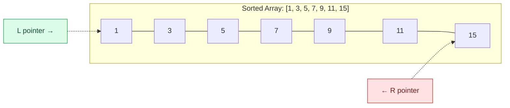
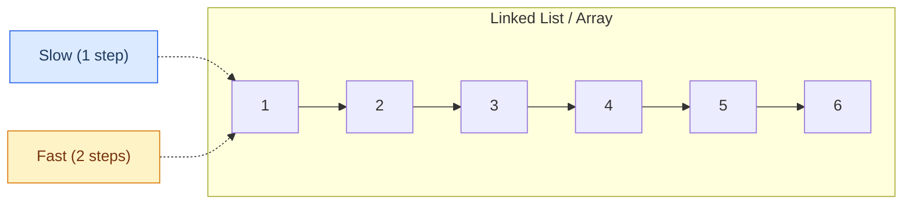
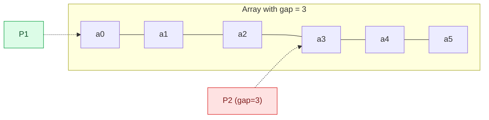
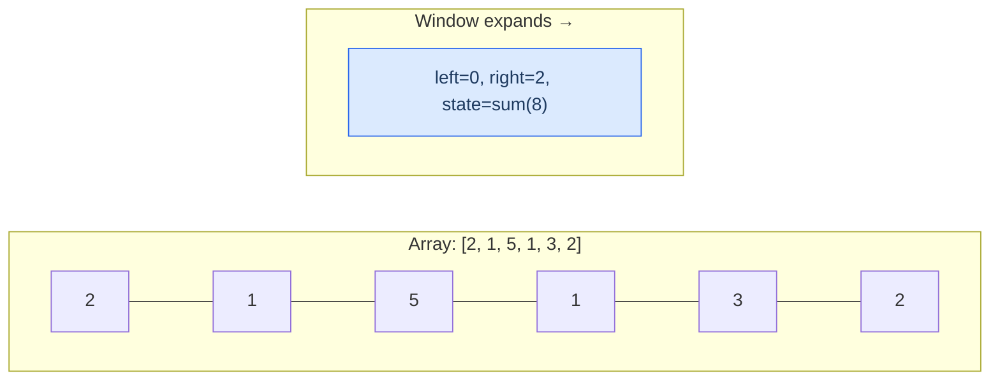
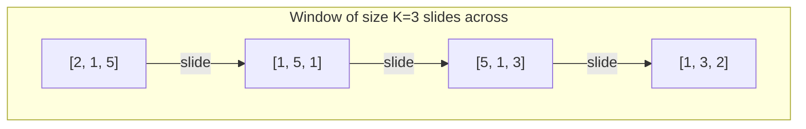
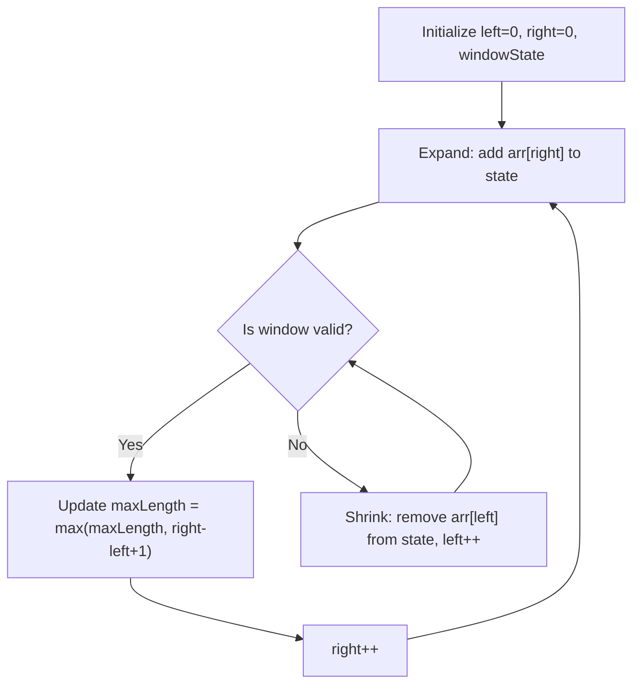
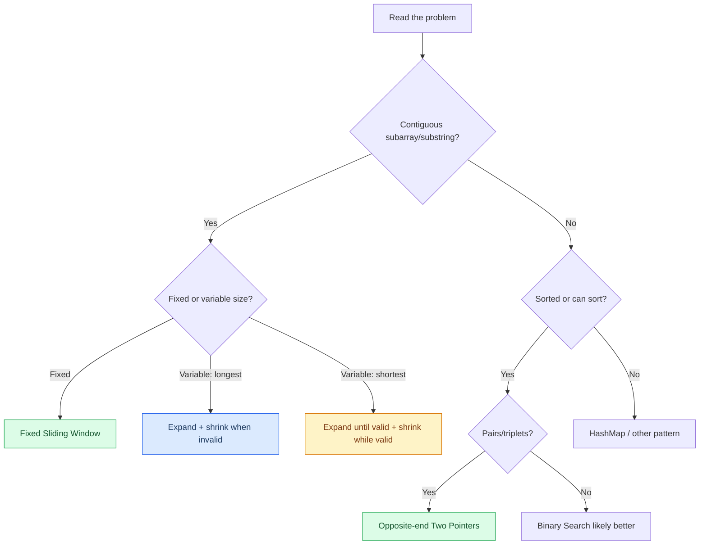

# Two Pointers & Sliding Window

<div class="vtn-hero" style="margin-left: 0; margin-right: 0; padding: 2.5rem 2rem;">
<span class="vtn-tag">DSA Pattern</span>
<h1 style="font-size: 2.2rem !important;">Two Pointers & Sliding Window</h1>
<p class="vtn-subtitle">Two patterns combined because they share the same DNA: both exploit sorted or sequential structure to collapse O(n^2) brute force into O(n). Master these and you eliminate ~30% of FAANG coding questions in one shot.</p>
<div class="vtn-stats">
<div class="vtn-stat"><span class="vtn-stat-number">6</span><span class="vtn-stat-label">Templates</span></div>
<div class="vtn-stat"><span class="vtn-stat-number">4</span><span class="vtn-stat-label">Walkthroughs</span></div>
<div class="vtn-stat"><span class="vtn-stat-number">15</span><span class="vtn-stat-label">Practice Problems</span></div>
</div>
</div>

---

## Why These Two Patterns Together?

Both patterns answer the same fundamental question: **"How do I avoid checking every possible pair/subarray?"**

- **Two Pointers** exploits **sorted order** or **structural constraints** to prune the search space.
- **Sliding Window** exploits **contiguous subarray/substring** structure to maintain state incrementally.

The key insight: if your brute force is two nested loops over indices `i` and `j`, and there is a monotonic relationship between them, you can often reduce to a single pass.

---

## Two Pointers

### Core Concept



Two pointers work when you can **make a binary decision** at each step: move the left pointer right, or move the right pointer left. This decision must be justified by a monotonic property (e.g., "the sum is too small, so moving left inward cannot help").

---

### Three Variants

#### Variant A: Opposite Ends Converging

```mermaid
flowchart LR
    subgraph Step1["Step 1: L=0, R=6"]
        direction LR
        a1["[1"] --- a2["3"] --- a3["5"] --- a4["7"] --- a5["9"] --- a6["11"] --- a7["15]"]
    end
    subgraph Step2["Step 2: L=1, R=6"]
        direction LR
        b1["1"] --- b2["[3"] --- b3["5"] --- b4["7"] --- b5["9"] --- b6["11"] --- b7["15]"]
    end
    subgraph Step3["Step 3: L=1, R=5"]
        direction LR
        c1["1"] --- c2["[3"] --- c3["5"] --- c4["7"] --- c5["9"] --- c6["11]"] --- c7["15"]
    end
    Step1 --> Step2
    Step2 --> Step3
```



**Use when:** Sorted array, looking for pairs that satisfy a condition (target sum, max area, palindrome check).

**Template:**

```java
public int oppositeEnds(int[] arr, int target) {
    int left = 0, right = arr.length - 1;
    
    while (left < right) {
        int current = evaluate(arr, left, right);
        
        if (current == target) {
            return result; // or record and continue
        } else if (current < target) {
            left++;  // need bigger value
        } else {
            right--; // need smaller value
        }
    }
    return -1; // not found
}
```

---

#### Variant B: Same Direction — Fast/Slow



**Use when:** Cycle detection (Floyd's), finding middle, removing N-th from end, in-place array dedup.

**Template:**

```java
public ListNode fastSlow(ListNode head) {
    ListNode slow = head, fast = head;
    
    while (fast != null && fast.next != null) {
        slow = slow.next;        // 1 step
        fast = fast.next.next;   // 2 steps
        
        if (slow == fast) {
            return slow; // cycle detected
        }
    }
    return slow; // middle of list (no cycle)
}
```

---

#### Variant C: Fixed Gap



**Use when:** Finding the N-th node from end, checking if a distance-K pair exists, comparing elements with fixed separation.

**Template:**

```java
public ListNode removeNthFromEnd(ListNode head, int n) {
    ListNode dummy = new ListNode(0, head);
    ListNode first = dummy, second = dummy;
    
    // Advance first pointer by n+1 steps
    for (int i = 0; i <= n; i++) {
        first = first.next;
    }
    
    // Move both until first hits end
    while (first != null) {
        first = first.next;
        second = second.next;
    }
    
    second.next = second.next.next; // skip the target
    return dummy.next;
}
```

---

### Pattern Recognition Table

| When You See... | Use Variant | Why |
|---|---|---|
| "Sorted array" + "pair with sum/difference" | A: Opposite ends | Sorted order gives monotonic direction |
| "Two sum" (unsorted, exact match) | HashMap (not two pointers!) | No sorted order to exploit |
| "Container with most water" / "trapping rain water" | A: Opposite ends | Width decreases; greedily keep the taller side |
| "Palindrome check" | A: Opposite ends | Compare mirror positions |
| "Remove duplicates in-place" | B: Fast/Slow (read/write) | Fast reads, slow writes |
| "Linked list cycle" | B: Fast/Slow | Floyd's tortoise and hare |
| "Middle of linked list" | B: Fast/Slow | When fast finishes, slow is at middle |
| "Kth from end" | C: Fixed gap | Gap ensures correct distance |
| "3Sum / 4Sum" | A: Opposite ends (nested) | Sort + fix one element + two-pointer inner |

---

## Sliding Window

### Core Concept



The window represents the **current candidate** subarray/substring. The algorithm has two phases that interleave:

1. **Expand** (move `right` forward) — explore new possibilities
2. **Shrink** (move `left` forward) — restore validity or optimize

!!! tip "The Key Insight"
    Every element enters the window exactly once (when `right` advances) and leaves exactly once (when `left` advances). This guarantees O(n) total work even though we have two moving pointers.

---

### Three Types

#### Type 1: Fixed-Size Window



**Use when:** "Maximum/minimum sum of subarray of size K", "average of subarrays of size K".

**Template:**

```java
public int fixedWindow(int[] arr, int k) {
    int windowSum = 0, maxSum = Integer.MIN_VALUE;
    
    for (int right = 0; right < arr.length; right++) {
        windowSum += arr[right]; // expand
        
        if (right >= k - 1) {
            maxSum = Math.max(maxSum, windowSum);
            windowSum -= arr[right - k + 1]; // shrink (remove leftmost)
        }
    }
    return maxSum;
}
```

---

#### Type 2: Variable Window — Find Longest Valid

**Goal:** Find the **longest** subarray/substring that satisfies a constraint.

**Strategy:** Expand greedily. Shrink only when the window becomes invalid.



**Template:**

```java
public int longestValid(String s) {
    Map<Character, Integer> windowState = new HashMap<>();
    int left = 0, maxLength = 0;
    
    for (int right = 0; right < s.length(); right++) {
        char c = s.charAt(right);
        windowState.merge(c, 1, Integer::sum); // expand
        
        while (!isValid(windowState)) {         // shrink until valid
            char leftChar = s.charAt(left);
            windowState.merge(leftChar, -1, Integer::sum);
            if (windowState.get(leftChar) == 0) {
                windowState.remove(leftChar);
            }
            left++;
        }
        
        maxLength = Math.max(maxLength, right - left + 1); // record
    }
    return maxLength;
}
```

---

#### Type 3: Variable Window — Find Shortest Valid

**Goal:** Find the **shortest** subarray that satisfies a constraint.

**Strategy:** Expand until valid. Then shrink as much as possible while still valid, recording the minimum at each valid state.

**Template:**

```java
public int shortestValid(int[] arr, int target) {
    int left = 0, windowSum = 0;
    int minLength = Integer.MAX_VALUE;
    
    for (int right = 0; right < arr.length; right++) {
        windowSum += arr[right]; // expand
        
        while (windowSum >= target) {             // valid! try to shrink
            minLength = Math.min(minLength, right - left + 1);
            windowSum -= arr[left];
            left++;
        }
    }
    return minLength == Integer.MAX_VALUE ? 0 : minLength;
}
```

!!! warning "Longest vs. Shortest — The Shrink Difference"
    - **Longest valid:** shrink when **invalid**, record **after** shrinking
    - **Shortest valid:** shrink when **valid**, record **during** shrinking
    
    Getting these backwards is the #1 sliding window bug.

---

## Solved Walkthroughs

### Problem 1: Container With Most Water (LC #11) — Two Pointers

???question "Problem Statement"
    Given `n` non-negative integers `a0, a1, ..., an-1` where each represents a vertical line at position `i` with height `a[i]`, find two lines that together with the x-axis form a container that holds the most water.

**Brute Force:** Check every pair `(i, j)` — O(n^2).

**The Insight:** Start with the widest container (left=0, right=n-1). Area = min(height[L], height[R]) * (R - L). When you move a pointer inward, width decreases by 1. The ONLY way area can increase is if height increases. So move the pointer with the **shorter** height — keeping the taller one cannot help because min() is already bottlenecked by the shorter side.

!!! tip "Why Greedy Works"
    If `height[L] < height[R]`, then for ALL positions `j < R`, the container `(L, j)` has: smaller width AND height still capped by `height[L]`. So we can never do better with this L — discard it.

```java
public int maxArea(int[] height) {
    int left = 0, right = height.length - 1;
    int maxWater = 0;
    
    while (left < right) {
        int width = right - left;
        int h = Math.min(height[left], height[right]);
        maxWater = Math.max(maxWater, width * h);
        
        // Move the shorter side inward
        if (height[left] < height[right]) {
            left++;
        } else {
            right--;
        }
    }
    return maxWater;
}
```

**Complexity:** O(n) time, O(1) space.

**Common Mistakes:**

- Moving the taller pointer instead of the shorter one (destroys the greedy guarantee)
- Forgetting that when heights are equal, moving either works (but you must move at least one)

---

### Problem 2: 3Sum (LC #15) — Two Pointers

???question "Problem Statement"
    Given an integer array `nums`, return all triplets `[nums[i], nums[j], nums[k]]` such that `i != j != k` and `nums[i] + nums[j] + nums[k] == 0`. The solution set must not contain duplicate triplets.

**Brute Force:** Three nested loops — O(n^3).

**The Insight:** Sort the array. Fix one element `nums[i]`, then the problem reduces to "Two Sum II" on the remaining sorted subarray — use opposite-end two pointers to find pairs summing to `-nums[i]`.

**The Dedup Trick:** After sorting, skip consecutive duplicates at three levels:

1. Skip duplicate `i` values (outer loop)
2. After finding a valid triplet, skip duplicate `left` values
3. After finding a valid triplet, skip duplicate `right` values

```java
public List<List<Integer>> threeSum(int[] nums) {
    List<List<Integer>> result = new ArrayList<>();
    Arrays.sort(nums); // O(n log n)
    
    for (int i = 0; i < nums.length - 2; i++) {
        // Skip duplicate i values
        if (i > 0 && nums[i] == nums[i - 1]) continue;
        
        // Early termination: if smallest element > 0, no solution possible
        if (nums[i] > 0) break;
        
        int left = i + 1, right = nums.length - 1;
        int target = -nums[i];
        
        while (left < right) {
            int sum = nums[left] + nums[right];
            
            if (sum == target) {
                result.add(Arrays.asList(nums[i], nums[left], nums[right]));
                
                // Skip duplicates for left and right
                while (left < right && nums[left] == nums[left + 1]) left++;
                while (left < right && nums[right] == nums[right - 1]) right--;
                
                left++;
                right--;
            } else if (sum < target) {
                left++;
            } else {
                right--;
            }
        }
    }
    return result;
}
```

**Complexity:** O(n^2) time (sort + n iterations of two-pointer), O(1) extra space (ignoring output).

**Common Mistakes:**

- Forgetting to sort first — two pointers require sorted order
- Deduplicating at only one level (you need all three)
- Using `nums[left] == nums[left - 1]` instead of `nums[left] == nums[left + 1]` after finding a result (off-by-one in dedup direction)
- Not handling the early termination when `nums[i] > 0`

---

### Problem 3: Longest Substring Without Repeating Characters (LC #3) — Sliding Window

???question "Problem Statement"
    Given a string `s`, find the length of the **longest substring** without repeating characters.

**Brute Force:** Check every substring, verify no duplicates — O(n^3) with HashSet per window, or O(n^2) with optimization.

**The Insight:** This is "Variable Window — Find Longest Valid". The validity condition is "no character appears more than once in the window." Use a HashMap to store the **last seen index** of each character. When you encounter a repeat, jump `left` directly to `lastSeen + 1` instead of sliding one by one.

```java
public int lengthOfLongestSubstring(String s) {
    Map<Character, Integer> lastSeen = new HashMap<>();
    int left = 0, maxLength = 0;
    
    for (int right = 0; right < s.length(); right++) {
        char c = s.charAt(right);
        
        // If char was seen and is within current window, jump left
        if (lastSeen.containsKey(c) && lastSeen.get(c) >= left) {
            left = lastSeen.get(c) + 1;
        }
        
        lastSeen.put(c, right); // update last seen position
        maxLength = Math.max(maxLength, right - left + 1);
    }
    return maxLength;
}
```

!!! tip "Why HashMap Stores Index, Not Count"
    Storing the index lets us jump `left` directly to the right position in O(1) instead of incrementing `left` one step at a time. This avoids the inner while-loop entirely, making the code cleaner (though both are O(n) amortized).

**Complexity:** O(n) time, O(min(n, alphabet_size)) space.

**Common Mistakes:**

- Not checking `lastSeen.get(c) >= left` — the character might have been seen before the current window started (stale entry)
- Using a frequency map with a while-loop shrink (works but more complex for this problem)
- Confusing this with the "at most K distinct characters" variant (different validity condition)

---

### Problem 4: Minimum Window Substring (LC #76) — Sliding Window

???question "Problem Statement"
    Given strings `s` and `t`, return the minimum window substring of `s` that contains all characters of `t`. If no such window exists, return `""`.

**Brute Force:** Check every substring of `s`, verify it contains all of `t` — O(n^2 * m).

**The Insight:** This is "Variable Window — Find Shortest Valid." The validity condition: the window contains all characters of `t` with required frequencies. The optimization: instead of comparing full frequency maps each time, maintain a `formed` counter that tracks how many **unique characters** have met their required count.

```java
public String minWindow(String s, String t) {
    if (s.length() < t.length()) return "";
    
    // Build required frequency map
    Map<Character, Integer> required = new HashMap<>();
    for (char c : t.toCharArray()) {
        required.merge(c, 1, Integer::sum);
    }
    
    int requiredSize = required.size(); // unique chars needed
    int formed = 0;                     // unique chars with count met
    
    Map<Character, Integer> windowCounts = new HashMap<>();
    int left = 0;
    int minLen = Integer.MAX_VALUE;
    int minLeft = 0;
    
    for (int right = 0; right < s.length(); right++) {
        // Expand: add s[right] to window
        char c = s.charAt(right);
        windowCounts.merge(c, 1, Integer::sum);
        
        // Check if this char's frequency requirement is now met
        if (required.containsKey(c) && 
            windowCounts.get(c).intValue() == required.get(c).intValue()) {
            formed++;
        }
        
        // Shrink: while window is valid, try to minimize
        while (formed == requiredSize) {
            // Record minimum
            if (right - left + 1 < minLen) {
                minLen = right - left + 1;
                minLeft = left;
            }
            
            // Remove s[left] from window
            char leftChar = s.charAt(left);
            windowCounts.merge(leftChar, -1, Integer::sum);
            
            if (required.containsKey(leftChar) && 
                windowCounts.get(leftChar) < required.get(leftChar)) {
                formed--;
            }
            left++;
        }
    }
    
    return minLen == Integer.MAX_VALUE ? "" : s.substring(minLeft, minLeft + minLen);
}
```

!!! tip "The `formed` Counter Optimization"
    Without `formed`, you would need to compare the entire window frequency map against the required map at every step — O(unique_chars) per step. With `formed`, checking validity is O(1): just `formed == requiredSize`.

**Complexity:** O(n + m) time where n = |s|, m = |t|. O(n + m) space.

**Common Mistakes:**

- Using `>=` instead of `==` when incrementing `formed` (would count the same character multiple times)
- Not using `.intValue()` when comparing Integer objects (autoboxing comparison bug for values > 127)
- Forgetting to check `required.containsKey(c)` before comparing counts (NPE on characters not in `t`)
- Returning `s.substring(left, left + minLen)` instead of using the saved `minLeft` (left has moved!)

---

## When Two Pointers Fails

Not every problem with pairs or subarrays is a two-pointer problem. Here are cases where it **looks** like two pointers but is not:

| Problem | Why It Fails | Correct Approach |
|---|---|---|
| Two Sum (unsorted array) | No sorted order to determine direction | HashMap O(n) |
| Subarray Sum Equals K (with negatives) | Negative numbers break monotonicity — sum can decrease when expanding | Prefix sum + HashMap |
| Longest Substring with At Most K Distinct (counting all occurrences) | Still works! This one IS sliding window | — |
| Maximum Product Subarray | Product can flip sign; expanding does not monotonically change result | DP tracking min and max |
| Shortest Unsorted Subarray | Not about finding a contiguous valid window | Stack-based or sort-comparison |

!!! warning "The Monotonicity Requirement"
    Two pointers and sliding window both require a **monotonic relationship**: moving a pointer in one direction must consistently improve or worsen the metric. If a single step can both improve AND worsen the result (e.g., adding a negative number to a sum), these patterns break down.

---

## Common Mistakes

| # | Mistake | Consequence | Fix |
|---|---|---|---|
| 1 | Using two pointers on **unsorted** data | Skips valid pairs; wrong answer | Sort first, or use HashMap instead |
| 2 | Sliding window with **negative** numbers for sum problems | Shrinking can increase sum, breaking the invariant | Use prefix sum + HashMap for negative cases |
| 3 | Off-by-one in window size: `right - left` vs `right - left + 1` | Window size is always off by one; wrong answer on every test case | The window `[left, right]` inclusive has size `right - left + 1` |
| 4 | Forgetting to **update state** when shrinking | Window state becomes inconsistent; produces wrong max/min | Always mirror the expand logic: if you add on expand, subtract on shrink |
| 5 | Moving **both** pointers in the same iteration | Skips states; can miss the optimal answer | Move exactly one pointer per iteration (except when recording + advancing both after a match) |
| 6 | Integer comparison with `==` instead of `.equals()` for boxed types | Works for values -128 to 127, fails silently above | Always use `.intValue()` or `.equals()` with Integer objects |

---

## Practice Problems

### Two Pointers

| # | Problem | Difficulty | Key Insight |
|---|---|---|---|
| 1 | [Two Sum II - Sorted](https://leetcode.com/problems/two-sum-ii-input-array-is-sorted/) | Easy | Classic opposite-end; sorted guarantees direction |
| 2 | [Valid Palindrome](https://leetcode.com/problems/valid-palindrome/) | Easy | Opposite ends, skip non-alphanumeric |
| 3 | [3Sum](https://leetcode.com/problems/3sum/) | Medium | Sort + fix one + two-pointer; dedup at 3 levels |
| 4 | [Container With Most Water](https://leetcode.com/problems/container-with-most-water/) | Medium | Greedy: always discard the shorter side |
| 5 | [Trapping Rain Water](https://leetcode.com/problems/trapping-rain-water/) | Hard | Track leftMax/rightMax; water at i = min(maxes) - height[i] |
| 6 | [Sort Colors](https://leetcode.com/problems/sort-colors/) | Medium | Dutch flag: 3 pointers (low, mid, high) |
| 7 | [Remove Duplicates from Sorted Array II](https://leetcode.com/problems/remove-duplicates-from-sorted-array-ii/) | Medium | Slow/fast write pointer; allow at most 2 |
| 8 | [4Sum](https://leetcode.com/problems/4sum/) | Medium | Fix two + two-pointer inner; careful with overflow |

### Sliding Window

| # | Problem | Difficulty | Key Insight |
|---|---|---|---|
| 1 | [Maximum Average Subarray I](https://leetcode.com/problems/maximum-average-subarray-i/) | Easy | Fixed window of size K |
| 2 | [Longest Substring Without Repeating Characters](https://leetcode.com/problems/longest-substring-without-repeating-characters/) | Medium | Variable longest; HashMap stores last index |
| 3 | [Minimum Size Subarray Sum](https://leetcode.com/problems/minimum-size-subarray-sum/) | Medium | Variable shortest; shrink while sum >= target |
| 4 | [Longest Repeating Character Replacement](https://leetcode.com/problems/longest-repeating-character-replacement/) | Medium | Window valid if `windowSize - maxFreq <= k` |
| 5 | [Minimum Window Substring](https://leetcode.com/problems/minimum-window-substring/) | Hard | `formed` counter for O(1) validity check |
| 6 | [Sliding Window Maximum](https://leetcode.com/problems/sliding-window-maximum/) | Hard | Monotonic deque maintains decreasing order |
| 7 | [Subarrays with K Different Integers](https://leetcode.com/problems/subarrays-with-k-different-integers/) | Hard | exactly(K) = atMost(K) - atMost(K-1) |

---

## Interview Tips

### Signals You Are Solving Well

=== "Strong Signals"

    - **Immediately identifying** the pattern from constraints ("n = 10^5 with subarray constraint — this is sliding window")
    - **Stating the invariant** before coding: "My window maintains the property that..."
    - **Explaining WHY** pointer movement is safe: "Moving left can only decrease the sum, which is what we need because..."
    - **Handling edge cases** proactively: empty input, all duplicates, single element
    - **Correctly analyzing** amortized complexity: "Each element enters and leaves the window at most once, so total work is O(2n) = O(n)"

=== "Weak Signals"

    - Starting with brute force and never transitioning to the optimal approach
    - Writing the two-pointer loop but unable to justify why it is correct
    - Mixing up longest vs. shortest window shrink logic
    - Forgetting to update window state during shrink
    - Off-by-one errors on window boundaries that require multiple debug passes
    - Unable to explain time complexity beyond "it's O(n) because there's one loop"

### The 30-Second Pattern Selection Framework



!!! tip "What Interviewers Actually Want to Hear"
    1. **The monotonic argument** — "I can safely discard this state because expanding/shrinking can only make it worse/better"
    2. **The invariant** — "At every step of my loop, the following property holds: ..."
    3. **The complexity justification** — "Each element is processed at most twice (once on expand, once on shrink), giving O(n)"
    
    These three statements, delivered cleanly, are what separates a "pass" from a "strong hire."
