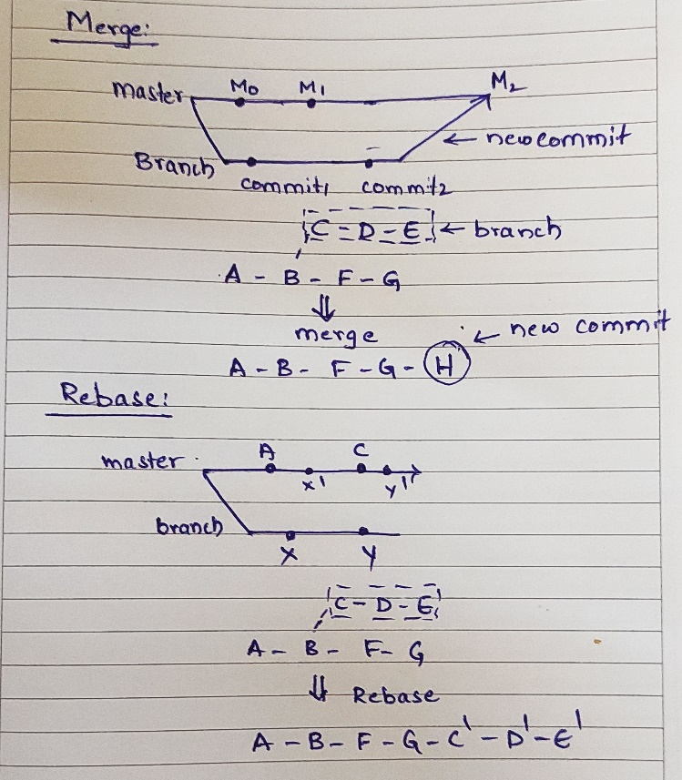

New Branch creation and PR

Branch name creation:

UserStory Number/userstory name

- -------create a new branch-------

git checkout -b <branch-name>

- -------check status of branch-------

git status

- -------to pull changes from a branch-------

git pull origin dev

- -------add the changes to stage----------

git add <filepath>

- -------commit the changes done-----------

git commit -m "commit message"

- ---------push the changes----------------

git push origin <branch-name>

- -------------------to remove a file from staged changes------

git checkout -- <file-path>

git stash:

**If you want to back up your changes**

git has an area called stash where you can temporarily store a snapshot of your changes without committing to the git repository.

Its separate from the working directory , the repository.

- you made some changes but you don’t want to commit them and you want to switch to another branch-------

**GIT MERGE**

when the local branch is behind the master branch , the branch needs the new changes which are in master branch , then merge is used

Basically git merge creates a new commit with all the commits you made to the branch.

**GIT REBASE:**

when the local branch is behind the master branch , the branch needs the new changes which are in master branch , then fetch is used

Basically git rebase does not create a new commit , all the commits will be shown in the new branch , so unnecessary history.

**GIT FETCH:**

When we do git fetch all the changes from the repository will be downloaded into the remote directory/repository but not into local repository.

**GIT PULL -->** git fetch + git merge .

When we do git fetch all the changes from the repository will be downloaded into the remote directory/repository and then from remote local repository.