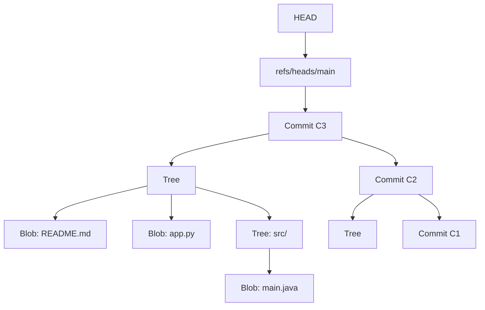
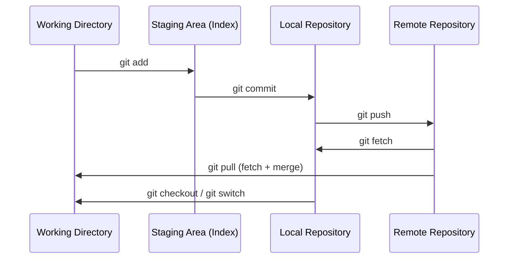
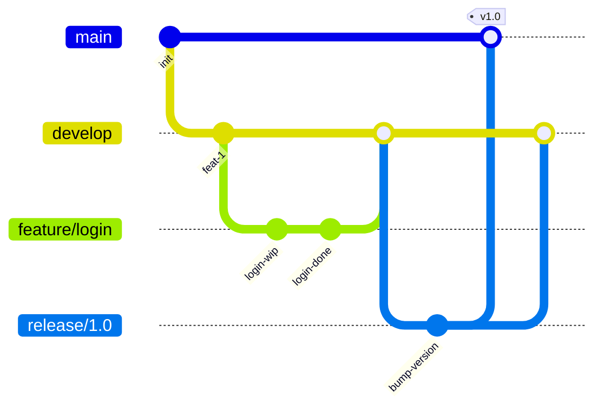
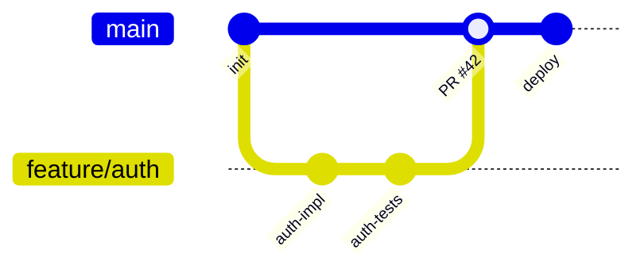
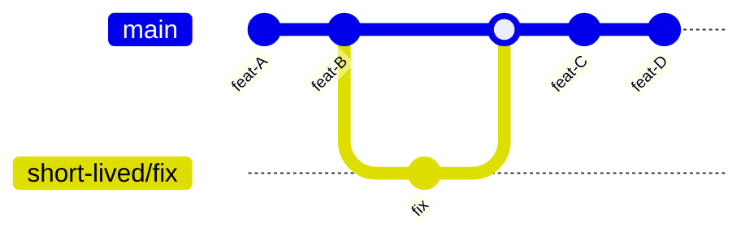
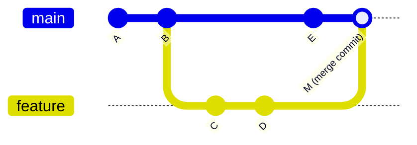

# Git

## Why Git Knowledge Matters

Git is the universal version control system in modern software development. Whether you are a junior developer or a principal engineer, interviewers expect fluency with Git. Understanding how Git works under the hood separates candidates who merely memorize commands from those who can troubleshoot complex merge conflicts, recover lost work, and design efficient branching strategies for their teams.

---

## Git Internals

Git is fundamentally a content-addressable filesystem. Every piece of data is stored as an object identified by a SHA-1 hash.

| Object | Purpose |
|--------|---------|
| **Blob** | Stores file contents (no filename, no metadata) |
| **Tree** | Stores directory listings — maps filenames to blobs or other trees |
| **Commit** | Points to a tree, contains author/committer info, message, and parent commit(s) |
| **Tag** | A named pointer to a commit (annotated tags are objects themselves) |

**Refs** are human-readable pointers (branches, tags, HEAD) that resolve to commit SHAs.


```mermaid
graph TD
    HEAD --> main[refs/heads/main]
    main --> C3[Commit C3]
    C3 --> T3[Tree]
    C3 --> C2[Commit C2]
    T3 --> B1[Blob: README.md]
    T3 --> B2[Blob: app.py]
    T3 --> ST[Tree: src/]
    ST --> B3[Blob: main.java]
    C2 --> T2[Tree]
    C2 --> C1[Commit C1]
```

---

## Core Workflow


```mermaid
sequenceDiagram
    participant WD as Working Directory
    participant SA as Staging Area (Index)
    participant LR as Local Repository
    participant RR as Remote Repository

    WD->>SA: git add
    SA->>LR: git commit
    LR->>RR: git push
    RR->>LR: git fetch
    RR->>WD: git pull (fetch + merge)
    LR->>WD: git checkout / git switch
```

- **Working Directory** — files on disk you are editing
- **Staging Area (Index)** — snapshot of what will go into the next commit
- **Local Repository** — full history stored in `.git/`
- **Remote Repository** — shared repo (GitHub, GitLab, Bitbucket)

---

## Essential Commands

### Setup and Cloning

```bash
git init                                          # Initialize a new repository
git clone https://github.com/user/repo.git        # Clone existing repo
git clone -b develop https://github.com/user/repo.git  # Clone specific branch
```

### Everyday Workflow

```bash
git status                                        # Check status
git add src/Main.java                             # Stage specific files
git add -A                                        # Stage all changes
git commit -m "feat: add user authentication"     # Commit with message
git push origin feature/login                     # Push to remote
git pull origin main                              # Pull (fetch + merge)
git fetch origin                                  # Fetch without merging
```

### Branching and Switching

```bash
git branch -a                                     # List all branches
git switch -c feature/payment                     # Create and switch to new branch
git checkout -b feature/payment                   # Older syntax equivalent
git switch main                                   # Switch to existing branch
git branch -d feature/payment                     # Delete local branch
git push origin --delete feature/payment          # Delete remote branch
```

### Merging and Rebasing

```bash
git switch main && git merge feature/payment      # Merge feature into main
git rebase main                                   # Rebase current branch onto main
git rebase --abort                                # Abort rebase in progress
git rebase --continue                             # Continue after resolving conflicts
```

### Stash and Cherry-Pick

```bash
git stash                                         # Stash current changes
git stash push -m "WIP: refactoring auth"         # Stash with a message
git stash list                                    # List stashes
git stash pop                                     # Apply and remove most recent stash
git stash apply stash@{2}                         # Apply specific stash
git cherry-pick abc1234                           # Cherry-pick a commit
```

### Reset and Revert

```bash
git reset --soft HEAD~1       # Undo commit, keep changes staged
git reset HEAD~1              # Undo commit, keep changes unstaged (mixed, default)
git reset --hard HEAD~1       # Undo commit, DISCARD all changes
git revert abc1234            # Create new commit that undoes a previous commit
```

### History and Inspection

```bash
git log --oneline --graph --all                   # Visual commit log
git diff HEAD~3..HEAD                             # Changes between commits
git diff --cached                                 # Changes in staging area
git blame src/Main.java                           # Who changed each line
git bisect start                                  # Binary search for bug commit
git bisect bad                                    # Mark current as bad
git bisect good v1.0                              # Mark known good commit
git bisect reset                                  # End bisect session
```

---

## Branching Strategies

| Aspect | Git Flow | GitHub Flow | Trunk-Based |
|--------|----------|-------------|-------------|
| **Main branches** | `main` + `develop` | `main` only | `main` only |
| **Feature branches** | Long-lived, off `develop` | Short-lived, off `main` | Very short-lived (< 1 day) |
| **Release process** | Release branches | Deploy from `main` | Continuous from `main` |
| **Hotfixes** | Dedicated hotfix branches | PR to `main` | Fix on trunk directly |
| **Complexity** | High | Low | Low |
| **Best for** | Scheduled releases | SaaS, continuous delivery | CI/CD mature teams |

### Git Flow


```mermaid
gitGraph
    commit id: "init"
    branch develop
    checkout develop
    commit id: "feat-1"
    branch feature/login
    commit id: "login-wip"
    commit id: "login-done"
    checkout develop
    merge feature/login
    branch release/1.0
    commit id: "bump-version"
    checkout main
    merge release/1.0 tag: "v1.0"
    checkout develop
    merge release/1.0
```

### GitHub Flow


```mermaid
gitGraph
    commit id: "init"
    branch feature/auth
    commit id: "auth-impl"
    commit id: "auth-tests"
    checkout main
    merge feature/auth id: "PR #42"
    commit id: "deploy"
```

### Trunk-Based Development


```mermaid
gitGraph
    commit id: "feat-A"
    commit id: "feat-B"
    branch short-lived/fix
    commit id: "fix"
    checkout main
    merge short-lived/fix
    commit id: "feat-C"
    commit id: "feat-D"
```

---

## Merge vs Rebase

| | Merge | Rebase |
|---|---|---|
| **History** | Preserves branch topology | Creates linear history |
| **Safety** | Safe for shared branches | Only for local/private branches |
| **Commits** | Creates merge commit | Replays commits (rewrites SHAs) |
| **Use when** | Integrating shared work | Cleaning up before PR |


```mermaid
gitGraph
    commit id: "A"
    commit id: "B"
    branch feature
    commit id: "C"
    commit id: "D"
    checkout main
    commit id: "E"
    merge feature id: "M (merge commit)"
```

**After rebase instead**: commits C and D replay on top of E, producing A - B - E - C' - D' (linear, no merge commit).

**Golden Rule**: Never rebase commits that have been pushed and shared with others.

---

## Conflict Resolution Workflow

```bash
# 1. Attempt merge or rebase
git merge feature/payment

# 2. Check which files conflict
git status

# 3. Resolve conflict markers in files:
#    <<<<<<< HEAD
#    (your changes)
#    =======
#    (their changes)
#    >>>>>>> feature/payment

# 4. Stage resolved files and complete
git add src/Payment.java
git commit                    # for merge
# or: git rebase --continue   # for rebase
```

**Tips:** Use `git mergetool` for visual diffs, `git rerere` for recurring conflicts, and `git diff --check` to find leftover markers.

---

## Interactive Rebase

Rewrite commit history before pushing with `git rebase -i HEAD~4`:

| Command | Effect |
|---------|--------|
| `pick` | Keep the commit as-is |
| `reword` | Keep commit but edit the message |
| `squash` | Meld into previous commit, combine messages |
| `fixup` | Meld into previous commit, discard this message |
| `drop` | Remove the commit entirely |
| `edit` | Pause to amend the commit |

**Example — squash WIP commits before PR:**

```
pick abc1234 feat: add payment service
squash def5678 wip: fixing tests
squash ghi9012 wip: more fixes
pick jkl3456 feat: add payment validation
```

---

## Git Hooks

Scripts in `.git/hooks/` that run automatically at key points:

| Hook | Trigger | Common Use |
|------|---------|------------|
| `pre-commit` | Before commit created | Lint, format, check secrets |
| `commit-msg` | After message entered | Enforce conventional commits |
| `pre-push` | Before push to remote | Run tests |
| `post-merge` | After merge completes | Reinstall dependencies |

**Example pre-commit hook:**

```bash
#!/bin/sh
if grep -rn "console.log\|debugger\|System.out.println" --include="*.java" --include="*.js" .; then
    echo "ERROR: Debug statements found. Remove before committing."
    exit 1
fi
```

Use [Husky](https://typicode.github.io/husky/) or [pre-commit](https://pre-commit.com/) to version-control hooks in your repo.

---

## .gitignore Patterns

```gitignore
# Compiled output
*.class
*.jar
target/
build/

# IDE files
.idea/
.vscode/
*.iml

# OS files
.DS_Store
Thumbs.db

# Environment and secrets
.env
*.pem

# Dependencies
node_modules/
venv/

# Negation — track this specific file
!config/default.env
```

**Pattern rules:** `*` matches anything except `/`, `**` matches directories recursively, `!` negates (re-includes), trailing `/` matches only directories. Debug with `git check-ignore -v <file>`.

---

## Tips and Advanced Usage

### Reflog for Recovery

The reflog records every HEAD change — even after `reset --hard`:

```bash
git reflog                              # View reflog
git branch recovered-work abc1234       # Recover a "lost" commit
```

Entries expire after 90 days by default.

### Worktrees

Check out multiple branches simultaneously in separate directories:

```bash
git worktree add ../hotfix-dir hotfix/critical-bug
git worktree list
git worktree remove ../hotfix-dir
```

### Useful Aliases

```bash
git config --global alias.st "status -sb"
git config --global alias.lg "log --oneline --graph --all --decorate"
git config --global alias.unstage "restore --staged"
git config --global alias.last "log -1 HEAD --stat"
```

---

## Interview Questions

??? question "What is the difference between `git merge` and `git rebase`? When would you use each?"

    **Merge** creates a new merge commit combining two branches, preserving the full branch topology. **Rebase** replays commits on top of another branch, producing linear history without merge commits.

    **Use merge** on shared branches or when preserving diverge/converge history matters. **Use rebase** on local feature branches before PRs to keep history clean.

    Golden rule: never rebase commits already pushed and shared — it rewrites history and forces collaborators to reconcile divergent states.

??? question "How would you recover a commit after `git reset --hard`?"

    Use `git reflog` to find the SHA of the lost commit:

    ```bash
    git reflog
    git branch recovery-branch abc1234
    ```

    The reflog records every position HEAD has pointed to. Entries expire after 90 days by default, so recovery must happen within that window.

??? question "Explain the three trees of Git: Working Directory, Staging Area, and Repository."

    - **Working Directory**: Actual files on your filesystem that you edit.
    - **Staging Area (Index)**: Snapshot of what will go into the next commit, populated via `git add`.
    - **Repository (.git)**: Committed history stored as Git objects (blobs, trees, commits).

    This architecture gives fine-grained control over each commit, enabling atomic, logical commits even when multiple changes serve different purposes.

??? question "What is `git bisect` and how do you use it to find a bug?"

    `git bisect` performs a binary search through commit history to identify the exact commit that introduced a bug.

    1. `git bisect start`
    2. `git bisect bad` (current is broken)
    3. `git bisect good v1.0` (known working state)
    4. Test each checkout, mark `good` or `bad`
    5. `git bisect reset` when done

    Reduces O(n) search to O(log n). Automate with `git bisect run <test-script>`.

??? question "What happens internally when you run `git commit`?"

    1. Git snapshots the staging area into a **tree object** representing the directory structure.
    2. Creates a **commit object** with: pointer to tree, parent commit(s), author/committer, timestamp, message.
    3. Stores the commit (SHA-1 hashed) in `.git/objects/`.
    4. Updates the current branch ref (e.g., `refs/heads/main`) to point to the new commit.
    5. HEAD indirectly references the new commit through the branch ref.

    Git reuses blobs that have not changed — no files are duplicated.

??? question "Compare Git Flow, GitHub Flow, and Trunk-Based Development. Which suits continuous deployment?"

    - **Git Flow**: `main` + `develop` + feature/release/hotfix branches. High ceremony, best for scheduled releases.
    - **GitHub Flow**: Branch off `main`, open PR, merge back. Simple, good for frequent deploys.
    - **Trunk-Based**: Commit directly to `main` or merge very short-lived branches (hours). Requires strong CI/CD and feature flags.

    For continuous deployment, **Trunk-Based Development** is ideal if the team has mature pipelines and feature flag infrastructure. **GitHub Flow** is a pragmatic middle ground for teams not yet ready for pure trunk-based.
