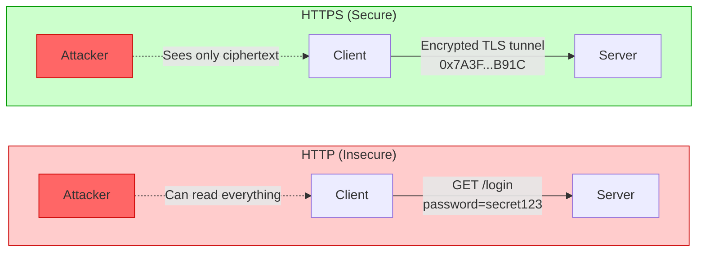
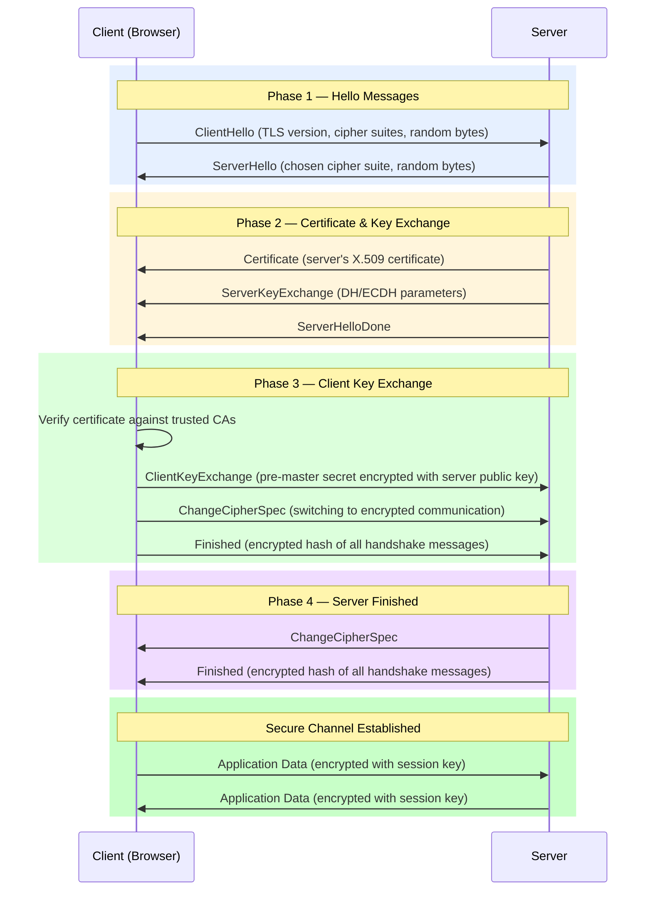
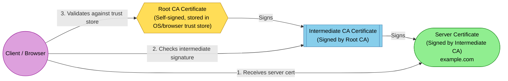
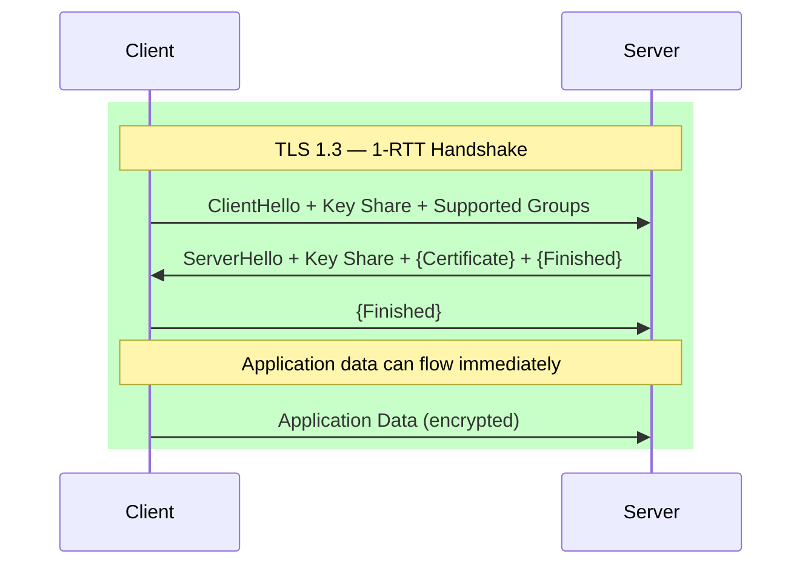
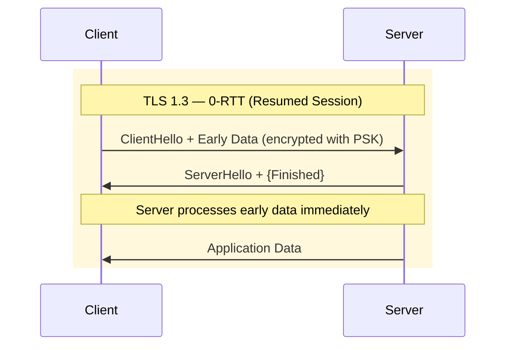
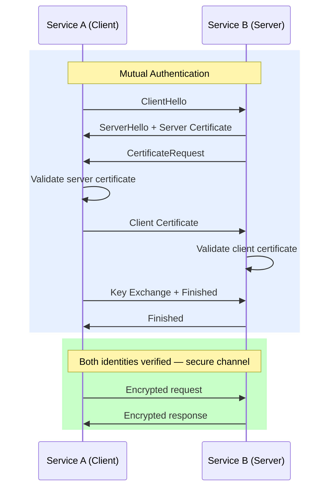
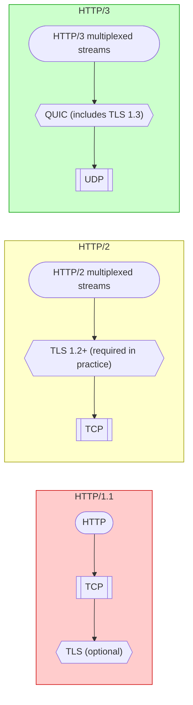

# HTTPS, TLS & Network Security

!!! tip "System Design Interview Relevance"
    HTTPS and TLS are fundamental to any system design discussion involving security, authentication, or microservice communication. Interviewers expect you to explain how data is secured in transit, how certificate chains work, and how mTLS enables zero-trust architectures. This is especially critical for questions about API gateways, service meshes, and payment systems.

---

## HTTP vs HTTPS — What Changes

| Aspect | HTTP | HTTPS |
|--------|------|-------|
| Port | 80 | 443 |
| Encryption | None (plaintext) | TLS encryption |
| Integrity | No guarantee | MAC-based integrity check |
| Authentication | None | Server identity via certificates |
| Performance | Faster (no handshake overhead) | Slight overhead from TLS handshake |
| URL visibility | Fully visible to intermediaries | Only domain visible (via SNI) |

---

## TLS Handshake — Step by Step

The TLS handshake establishes a secure connection before any application data is exchanged. Here is the TLS 1.2 handshake flow:

### Handshake Steps Explained

1. **Client Hello** — Client sends supported TLS versions, cipher suites, and a client random value
2. **Server Hello** — Server selects the cipher suite and TLS version, sends server random
3. **Certificate** — Server sends its X.509 certificate for identity verification
4. **Key Exchange** — Both parties contribute to generating the pre-master secret
5. **Finished** — Both sides confirm the handshake integrity with a hash of all messages

---

## Symmetric vs Asymmetric Encryption

| Property | Symmetric Encryption | Asymmetric Encryption |
|----------|---------------------|----------------------|
| Keys | Single shared key | Public + Private key pair |
| Speed | Fast (100-1000x faster) | Slow (computationally expensive) |
| Key distribution | Challenging (must share securely) | Easy (public key is shareable) |
| Use in TLS | Bulk data encryption (AES) | Key exchange & digital signatures |
| Algorithms | AES-128, AES-256, ChaCha20 | RSA, ECDSA, Ed25519 |
| Key size | 128-256 bits | 2048-4096 bits (RSA) / 256 bits (ECC) |

**How TLS uses both:**

- **Asymmetric** encryption is used during the handshake to securely exchange a session key
- **Symmetric** encryption (using that session key) encrypts all application data
- This hybrid approach gives you the security of asymmetric key exchange with the speed of symmetric bulk encryption

---

## Certificate Chain of Trust

A certificate chain establishes trust from a server certificate up to a trusted root CA.

### Why Intermediate CAs?

- **Security isolation** — Root CA private key stays offline in an HSM (Hardware Security Module)
- **Revocation** — If an intermediate is compromised, only that subtree is revoked
- **Operational flexibility** — Different intermediates for different purposes (EV, DV, code signing)

---

## TLS Version Comparison

| Feature | TLS 1.0 (1999) | TLS 1.1 (2006) | TLS 1.2 (2008) | TLS 1.3 (2018) |
|---------|----------------|----------------|----------------|----------------|
| Status | Deprecated | Deprecated | Widely used | Recommended |
| Handshake RTT | 2-RTT | 2-RTT | 2-RTT | 1-RTT (0-RTT resumption) |
| Key Exchange | RSA, DH | RSA, DH | RSA, DH, ECDHE | ECDHE, DHE only |
| Cipher Suites | Many (weak ones included) | Many | Many | Only 5 strong suites |
| Forward Secrecy | Optional | Optional | Optional | Mandatory |
| Known Vulnerabilities | BEAST, POODLE | POODLE variants | Lucky13 (mitigated) | None known |
| Hash Algorithms | MD5, SHA-1 | SHA-1 | SHA-256, SHA-384 | SHA-256, SHA-384 |

---

## TLS 1.3 Improvements

TLS 1.3 is a major overhaul that reduces complexity and improves both security and performance.

### Key Improvements

1. **Fewer round trips** — Handshake completes in 1-RTT (vs 2-RTT in TLS 1.2)
2. **0-RTT resumption** — Returning clients can send data immediately
3. **Forward secrecy by default** — All key exchanges use ephemeral keys (no static RSA)
4. **Simplified cipher suites** — Removed insecure algorithms (RC4, 3DES, CBC mode, SHA-1)
5. **Encrypted handshake** — Certificate is encrypted (not visible to passive observers)
6. **Removed legacy features** — No renegotiation, no compression, no custom DH groups

### 0-RTT Resumption

!!! warning "0-RTT Replay Risk"
    0-RTT data is not protected against replay attacks. Only use it for idempotent requests (GET). Never use 0-RTT for state-changing operations (POST, PUT, DELETE).

---

## Certificate Pinning

**What:** Certificate pinning binds a specific certificate or public key to a host, rejecting any other valid certificate — even those signed by trusted CAs.

**Why:** Protects against compromised CAs issuing fraudulent certificates for your domain.

### Types of Pinning

| Type | What is pinned | Pros | Cons |
|------|---------------|------|------|
| Certificate pinning | Entire leaf cert | Simple to implement | Must update app on cert rotation |
| Public key pinning | Subject Public Key Info (SPKI) | Survives cert renewal (same key) | Key compromise requires app update |
| Backup pins | Multiple keys/certs | Rotation without app update | More complex management |

### Where It Is Used

- **Mobile apps** — Prevent MITM even on compromised networks
- **Banking/finance** — Extra layer beyond standard CA validation
- **IoT devices** — Fixed communication endpoints

!!! danger "Deprecation Note"
    HTTP Public Key Pinning (HPKP) header was deprecated in Chrome (2018) due to the risk of "pinning yourself out" — bricking your site if keys are lost. Certificate Transparency (CT) logs are now the preferred alternative for browsers.

---

## mTLS — Mutual TLS

In standard TLS, only the server proves its identity. In **mutual TLS (mTLS)**, both parties authenticate each other using certificates.

### mTLS in Microservices

| Aspect | Details |
|--------|---------|
| **Service Mesh** | Istio, Linkerd automatically inject mTLS between sidecars |
| **Certificate Management** | SPIFFE/SPIRE for workload identity, auto-rotation |
| **Zero Trust** | Every service call is authenticated regardless of network position |
| **Service Identity** | Each service gets a unique certificate (not shared) |

### When to Use mTLS

- Internal service-to-service communication
- API authentication between organizations
- Database connections from application servers
- Zero-trust network architectures

---

## Common Attacks

### Man-in-the-Middle (MITM)

**How it works:** Attacker intercepts communication between client and server, potentially reading or modifying data.

**Mitigations:**

- Certificate validation (trust chain verification)
- Certificate pinning
- HSTS (HTTP Strict Transport Security)

### SSL Stripping

**How it works:** Attacker downgrades HTTPS to HTTP by intercepting the initial redirect. User thinks they are on HTTPS but are communicating over HTTP with the attacker.

**Mitigations:**

- HSTS header (`Strict-Transport-Security: max-age=31536000; includeSubDomains`)
- HSTS preload list (hardcoded in browsers)
- Never serve sensitive pages over HTTP, not even redirects

### Downgrade Attacks

**How it works:** Attacker forces client and server to negotiate a weaker TLS version or cipher suite.

**Mitigations:**

- TLS_FALLBACK_SCSV (Signaling Cipher Suite Value)
- Disable TLS 1.0/1.1 on servers
- TLS 1.3 removes vulnerable negotiation mechanisms

### Certificate Forgery

**How it works:** Attacker obtains a fraudulent certificate from a compromised or rogue CA.

**Real-world examples:**

- DigiNotar (2011) — Issued fake Google certificates
- Symantec (2017) — Misissued thousands of certificates

**Mitigations:**

- Certificate Transparency (CT) logs — public, append-only logs of all issued certs
- CAA DNS records — specify which CAs can issue for your domain
- Certificate pinning (for mobile apps)

---

## HTTP/2 and HTTP/3 (QUIC) — Relation to TLS

### Key Differences

| Feature | HTTP/1.1 | HTTP/2 | HTTP/3 (QUIC) |
|---------|----------|--------|----------------|
| Transport | TCP | TCP | UDP |
| TLS requirement | Optional | Practically required (ALPN) | Built-in (TLS 1.3 mandatory) |
| Multiplexing | No (head-of-line blocking) | Yes (stream level) | Yes (no HoL blocking) |
| Connection setup | TCP + TLS = 3-4 RTT | TCP + TLS = 2-3 RTT | 1 RTT (0-RTT for resumption) |
| Header compression | None | HPACK | QPACK |

### Why QUIC Integrates TLS 1.3 Directly

- Eliminates separate TCP and TLS handshakes
- Achieves 1-RTT connection establishment (vs 2-3 RTT for TCP + TLS)
- 0-RTT connection resumption for returning clients
- Connection migration survives IP changes (e.g., WiFi to cellular)

---

## Performance Impact and Optimization

### TLS Performance Costs

| Operation | Latency Impact |
|-----------|---------------|
| Full TLS 1.2 handshake | 2 RTT (~100-300ms globally) |
| Full TLS 1.3 handshake | 1 RTT (~50-150ms) |
| TLS session resumption | 1 RTT (TLS 1.2) / 0 RTT (TLS 1.3) |
| Symmetric encryption (AES-GCM) | Negligible with AES-NI hardware |
| Certificate chain validation | 1-5ms (with caching) |

### Optimization Techniques

#### Session Resumption

- **Session IDs** (TLS 1.2) — Server stores session state, client reconnects with ID
- **Session Tickets** (TLS 1.2) — Server encrypts session state, sends to client
- **PSK (Pre-Shared Key)** (TLS 1.3) — Enables 0-RTT resumption

#### OCSP Stapling

Instead of the client checking certificate revocation status with the CA (adding latency), the server periodically fetches the OCSP response and "staples" it to the TLS handshake.

**Benefits:**

- Eliminates extra RTT to OCSP responder
- Improves privacy (CA does not learn which sites client visits)
- Reduces load on CA infrastructure

#### Other Optimizations

| Technique | Benefit |
|-----------|---------|
| **ECDSA certificates** | Smaller than RSA, faster verification |
| **TLS False Start** | Send data before handshake completes (TLS 1.2) |
| **TCP Fast Open** | Combine TCP SYN with data |
| **CDN termination** | TLS termination at edge, closer to users |
| **Hardware acceleration** | AES-NI instructions for bulk encryption |
| **Certificate compression** | Reduce certificate size in handshake |

---

## Interview Questions

??? question "What happens when you type https://google.com in the browser?"
    1. **DNS resolution** — Browser resolves google.com to an IP address
    2. **TCP handshake** — 3-way handshake (SYN, SYN-ACK, ACK)
    3. **TLS handshake** — Client Hello, Server Hello, Certificate exchange, Key exchange, Finished
    4. **HTTP request** — Browser sends encrypted GET / request
    5. **Response** — Server sends encrypted HTML response
    6. **Rendering** — Browser decrypts and renders the page

    Key points to mention: HSTS check (may skip HTTP entirely), certificate validation against trust store, session resumption if previously visited, and ALPN negotiation for HTTP/2.

??? question "Why does TLS use both symmetric and asymmetric encryption?"
    Asymmetric encryption (RSA/ECDHE) is computationally expensive — roughly 1000x slower than symmetric encryption. However, symmetric encryption requires both parties to share a secret key.

    TLS solves this by using asymmetric encryption only during the handshake to securely establish a shared session key. All subsequent data is encrypted with fast symmetric algorithms (AES-256-GCM or ChaCha20-Poly1305). This hybrid approach provides the best of both worlds: secure key distribution and high-performance data encryption.

??? question "What is forward secrecy and why does TLS 1.3 mandate it?"
    **Forward secrecy** (also called Perfect Forward Secrecy / PFS) means that compromising a server's long-term private key does not compromise past session keys. Each session uses ephemeral key pairs (ECDHE) that are discarded after use.

    Without forward secrecy (e.g., static RSA key exchange), an attacker who records encrypted traffic and later obtains the server's private key can decrypt all historical communications. With ECDHE, each session's key is unique and ephemeral — past traffic remains secure.

    TLS 1.3 mandates forward secrecy by removing static RSA key exchange entirely.

??? question "How does mTLS work in a microservices architecture?"
    In mTLS, both client and server present certificates during the TLS handshake. In microservices:

    1. A **service mesh** (Istio/Linkerd) injects sidecar proxies alongside each service
    2. A **certificate authority** (e.g., SPIFFE/SPIRE) issues short-lived certificates to each workload
    3. Sidecars handle mTLS transparently — application code is unaware
    4. Certificates are **automatically rotated** (typically every 24 hours)
    5. Authorization policies define which services can communicate

    This implements **zero-trust networking** — no service is trusted based on network location alone.

??? question "Explain the difference between TLS 1.2 and TLS 1.3 handshakes."
    **TLS 1.2:** Requires 2 round trips. Client and server exchange hellos, then the server sends its certificate, then key exchange happens in a separate round trip. The cipher suite negotiation allows many legacy algorithms.

    **TLS 1.3:** Requires only 1 round trip. The client sends key shares in the first message (guessing which key exchange the server will choose). The server responds with its key share, certificate (now encrypted), and finished message all at once. Only 5 cipher suites are allowed, all providing forward secrecy. Resuming sessions can achieve 0-RTT.

??? question "How would you design certificate management for 500+ microservices?"
    Key design decisions:

    1. **Automated issuance** — Use SPIFFE/SPIRE or HashiCorp Vault PKI for automated cert provisioning
    2. **Short-lived certificates** — 24-hour expiry eliminates need for revocation infrastructure
    3. **Service mesh** — Istio/Linkerd handle mTLS transparently via sidecars
    4. **Workload identity** — Each pod gets a unique SVID (SPIFFE Verifiable Identity Document)
    5. **Root CA isolation** — Offline root CA, online intermediate CAs per cluster/region
    6. **Rotation without downtime** — Overlap validity periods, graceful connection draining
    7. **Monitoring** — Alert on certs expiring within 2x rotation period

??? question "What is OCSP stapling and why is it important?"
    When a client receives a server certificate, it needs to verify the cert has not been revoked. Traditional OCSP requires the client to contact the CA's OCSP responder — adding latency and leaking browsing history.

    **OCSP Stapling:** The server periodically fetches a signed, time-stamped OCSP response from the CA and includes ("staples") it in the TLS handshake. Benefits:

    - Eliminates extra network round trip for the client
    - Preserves user privacy (CA cannot track browsing)
    - Reduces load on CA infrastructure
    - Response is signed by CA, so server cannot forge it

??? question "How does HTTP/3 (QUIC) improve upon TLS over TCP?"
    HTTP/3 uses QUIC, which integrates TLS 1.3 directly into the transport layer:

    1. **Combined handshake** — Transport and crypto setup in 1 RTT (vs 2-3 for TCP + TLS)
    2. **0-RTT resumption** — Returning clients send data immediately
    3. **No head-of-line blocking** — Lost packets only affect their specific stream
    4. **Connection migration** — Connections survive IP changes (identified by connection ID, not IP tuple)
    5. **Always encrypted** — Even transport headers are encrypted, preventing middlebox interference

    Trade-off: UDP-based, so some networks/firewalls may block it; falls back to HTTP/2 over TCP.

---

## Quick Reference — TLS Best Practices

| Practice | Recommendation |
|----------|---------------|
| Minimum TLS version | TLS 1.2 (prefer 1.3) |
| Cipher suites | ECDHE + AES-256-GCM or ChaCha20-Poly1305 |
| Key exchange | ECDHE with P-256 or X25519 |
| Certificate type | ECDSA (P-256) preferred over RSA |
| Certificate lifetime | 90 days (Let's Encrypt) or shorter |
| HSTS | Enable with long max-age and includeSubDomains |
| OCSP | Enable stapling |
| CT | Require Certificate Transparency |
| Internal services | mTLS with short-lived certs |
