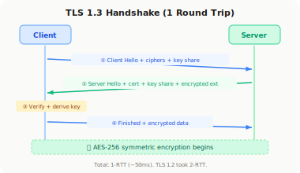

# HTTPS & TLS

!!! danger "Real Incident: Firesheep, 2010"
    A Firefox extension let anyone on public WiFi hijack Facebook/Twitter sessions with one click. 1.4 million downloads in week one. The message: **HTTP is a live broadcast of your digital life.** This forced the entire internet to adopt HTTPS.

---

## The 30-Second Explanation

**HTTPS = HTTP + TLS encryption. Every byte between client and server is encrypted so nobody in the middle can read or tamper with it.**

📬

<h4 style="margin: 0 0 0.5rem; color: #dc2626;">HTTP (Postcard)</h4>

Everyone who handles it can read it. Passwords, cookies, everything.

📦

<h4 style="margin: 0 0 0.5rem; color: #059669;">HTTPS (Sealed Box)</h4>

Encrypted end-to-end. Only sender and receiver can read.

---

## TLS Handshake — What Actually Happens

| Step | What | Why |
|:---:|---|---|
| 1 | **Client Hello** — "I support TLS 1.3, these ciphers" | Announce capabilities |
| 2 | **Server Hello** — "Let's use TLS 1.3 with AES-256. Here's my certificate." | Agree on crypto |
| 3 | **Client verifies cert** — checks CA chain, expiry, domain match | Prove server identity |
| 4 | **Key Exchange** — Diffie-Hellman to derive shared secret | Both sides get same key without sending it |
| 5 | **Encrypted traffic begins** — symmetric encryption (AES) | Fast, secure communication |

**Total time:** TLS 1.3 = 1 round trip (1-RTT). TLS 1.2 = 2 round trips. Resumption = 0-RTT.

---

## The 3 Guarantees

| Guarantee | What | Without It |
|---|---|---|
| **Confidentiality** | Nobody can read the data | Passwords visible on WiFi |
| **Integrity** | Nobody can modify data in transit | Attacker injects malware into page |
| **Authentication** | You're talking to the real server | Attacker impersonates your bank |

---

## Symmetric vs. Asymmetric — Why Both?

| Type | Speed | Used For |
|---|---|---|
| **Asymmetric** (RSA/ECDSA) | Slow (1000x slower) | Key exchange + authentication (handshake only) |
| **Symmetric** (AES-256) | Fast | All actual data transfer after handshake |

**Why both?** Asymmetric solves the "how do two strangers agree on a secret key?" problem. Once they have the shared key, symmetric takes over because it's 1000x faster.

---

## Certificates — The Trust Chain

| Concept | What |
|---|---|
| **Certificate** | Server's public key + domain + who issued it |
| **CA (Certificate Authority)** | Trusted third party that signs certificates (DigiCert, Let's Encrypt) |
| **Chain of trust** | Root CA → Intermediate CA → Server cert |
| **Validation** | Browser checks: is this cert for this domain? Signed by trusted CA? Not expired? |

**Let's Encrypt** made HTTPS free. Before 2015, certificates cost $100-300/year. Now there's no excuse for HTTP.

---

## TLS 1.2 vs TLS 1.3

| Aspect | TLS 1.2 | TLS 1.3 |
|---|---|---|
| Handshake | 2-RTT | 1-RTT (50% faster) |
| Resumption | 1-RTT | 0-RTT (instant) |
| Ciphers | Many (some weak) | Only strong ones kept |
| Forward secrecy | Optional | Mandatory |
| Adopted | 2008 | 2018 |

---

## mTLS — When the Server Also Verifies the Client

| Normal TLS | mTLS (Mutual TLS) |
|---|---|
| Client verifies server | Both verify each other |
| Browser → Website | Service A → Service B (microservices) |
| One certificate | Two certificates |
| "Is this really Google?" | "Is this really the payment service calling me?" |

**Used in:** Service mesh (Istio), internal microservice communication, zero-trust networks.

---

## What Interviewers Ask

| Question | Key Point |
|---|---|
| "How does HTTPS work?" | Asymmetric for key exchange → symmetric for data |
| "What's a certificate?" | Public key + identity, signed by trusted CA |
| "Why not just asymmetric for everything?" | Too slow (1000x slower than symmetric) |
| "What's forward secrecy?" | Compromising today's key doesn't decrypt past traffic (ephemeral DH keys) |
| "HTTP/2 vs HTTP/3?" | H2 = multiplexed over TCP+TLS. H3 = QUIC (UDP+TLS built-in, 0-RTT) |
| "What's certificate pinning?" | Client hardcodes expected cert/key. Prevents CA compromise. Used in mobile apps. |

---

## Real-World Numbers

| Metric | Value |
|---|---|
| HTTPS adoption (2024) | 95%+ of web traffic |
| TLS handshake overhead | 1-2ms (TLS 1.3) |
| Certificate cost | Free (Let's Encrypt) |
| HTTP/3 adoption | 30%+ (Google, Cloudflare, Meta) |

---

## The 3 Mistakes That Get You Rejected

!!! danger "Don't Say These"
    1. **"HTTPS uses RSA to encrypt all traffic"** — RSA is only for the handshake. Actual data uses AES (symmetric). If you encrypt GB of data with RSA, you'll be waiting all day.
    2. **"The certificate contains the private key"** — NEVER. The cert has the PUBLIC key. The private key never leaves the server.
    3. **"HTTPS prevents all attacks"** — It prevents eavesdropping and tampering, but NOT: XSS, SQL injection, DDoS, or phishing with a valid cert.

---

## Quick Recall Card

| Question | Answer |
|---|---|
| What does TLS guarantee? | Confidentiality, Integrity, Authentication |
| Handshake uses? | Asymmetric (RSA/ECDH) for key exchange |
| Data transfer uses? | Symmetric (AES-256) for speed |
| TLS 1.3 improvement? | 1-RTT handshake, 0-RTT resumption, mandatory forward secrecy |
| What's mTLS? | Both client and server authenticate each other |
| What's forward secrecy? | Ephemeral keys — past traffic safe even if long-term key leaks |
