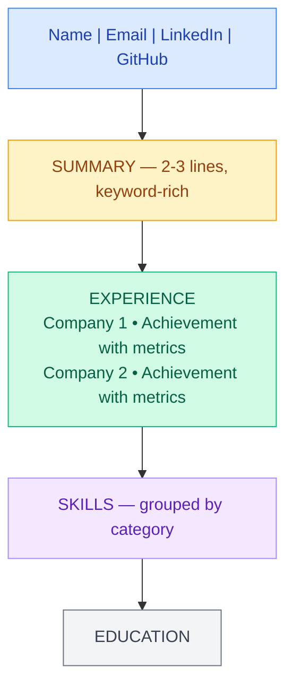

# Career Strategy for Java Backend Engineers

> Getting hired at top companies is 50% technical skill and 50% strategy. This guide covers the strategy half — the part most engineers neglect.

---

## Resume That Gets Callbacks

### The 6-Second Rule

Recruiters spend an average of **6 seconds** on initial resume scan. They look at:

1. Current company and title
2. Years of experience
3. Keywords matching the job description
4. Education (briefly)

!!! tip "Above the fold matters most"
    The top third of your resume gets 80% of attention. Put your strongest signal there — not an "Objective" statement.

### Technical Resume Structure



### Quantify Everything

| Weak | Strong |
|------|--------|
| "Improved API performance" | "Reduced API p99 latency from 800ms to 45ms by implementing Redis caching, handling 50K RPM" |
| "Built microservices" | "Decomposed monolith into 12 microservices, reducing deploy time from 4hrs to 15min" |
| "Worked on database optimization" | "Optimized PostgreSQL queries reducing avg response time by 73%, saving $40K/month in infrastructure" |
| "Mentored junior developers" | "Mentored 5 engineers, 3 promoted within 12 months" |

### ATS Keywords That Matter

Your resume must pass Applicant Tracking Systems. Include these naturally:

**Must-have for Java Backend roles:**

| Category | Keywords |
|----------|----------|
| Languages | Java, Java 8/11/17/21, SQL, Python |
| Frameworks | Spring Boot, Spring Cloud, Hibernate, JPA |
| Architecture | Microservices, REST API, Event-Driven, CQRS |
| Data | PostgreSQL, MySQL, MongoDB, Redis, Kafka |
| Cloud | AWS (EC2, S3, RDS, Lambda), Docker, Kubernetes |
| Practices | CI/CD, TDD, Agile, Code Review, System Design |
| Tools | Git, Jenkins, Gradle/Maven, Terraform, Datadog |

### Resume by Experience Level

=== "2-3 Years"

    **Focus:** Technical depth in core technologies
    
    - Show progression and learning speed
    - Highlight specific technologies mastered
    - Include side projects and open-source contributions
    - Keep to 1 page

=== "5-7 Years"

    **Focus:** Impact and ownership
    
    - Lead with system-level achievements
    - Show mentorship and code review leadership
    - Include architecture decisions you drove
    - Emphasize scale (users, requests, data volume)
    - 1-2 pages maximum

=== "8-10+ Years"

    **Focus:** Strategy and organizational impact
    
    - Lead with business outcomes
    - Show cross-team influence
    - Include technology strategy decisions
    - Mention cost savings and efficiency gains
    - 2 pages maximum

### Common Mistakes That Get Resumes Rejected

!!! danger "Immediate rejection triggers"
    - Typos in the first 3 lines
    - No metrics or quantification anywhere
    - Generic objective statements
    - Listing every technology ever touched
    - PDF that isn't machine-readable
    - More than 2 pages for <10 years experience

---

## Salary Negotiation

### Know Your Market Value

| Source | What It Shows | Reliability |
|--------|---------------|-------------|
| levels.fyi | Total comp by level, company | High (verified) |
| Glassdoor | Base salary ranges | Medium |
| Blind | Real-time comp discussions | High (anonymous engineers) |
| Paysa/Comparably | Market averages | Medium |
| Recruiter conversations | Current market rate | High |

### Typical Total Compensation (2026, US)

| Level | FAANG TC | Tier-2 Tech | Startups |
|-------|----------|-------------|----------|
| Junior (0-2yr) | $150-200K | $100-150K | $90-140K + equity |
| Mid (3-5yr) | $200-320K | $150-220K | $130-200K + equity |
| Senior (5-8yr) | $320-500K | $220-350K | $180-300K + equity |
| Staff (8-12yr) | $500-750K | $350-500K | $250-400K + equity |
| Principal (12+yr) | $750K-1.2M | $500-700K | $350-600K + equity |

*TC = Base + Bonus + RSU (annualized)*

### Negotiation Framework

**Rule 1:** Never give a number first.

**Rule 2:** Always negotiate. Companies expect it.

**Rule 3:** Negotiate AFTER the offer, not before.

### Scripts You Can Use

!!! example "When asked for salary expectations (before offer)"
    "I'm focused on finding the right role and team fit. I'm confident we can find a number that works for both sides once we determine mutual interest. What's the budgeted range for this level?"

!!! example "After receiving an offer"
    "Thank you — I'm genuinely excited about this role. I've done market research and based on my experience with [specific skill], I was hoping the base could be closer to $X. Is there flexibility there?"

!!! example "If they say the offer is final"
    "I understand the base may be fixed. Could we explore a signing bonus, additional RSUs, or an earlier review cycle? I want to make this work."

### What to Negotiate (in order of flexibility)

1. **Signing bonus** — easiest to increase (one-time cost)
2. **RSU/Equity** — often flexible, especially at startups
3. **Base salary** — hardest to move but compounds over time
4. **Start date** — negotiate for rest or to finish a vesting cliff
5. **Title/Level** — impacts future compensation trajectory
6. **Remote/Hybrid** — increasingly negotiable

---

## Interview Day Strategy

### The 45-Minute Technical Interview Structure

```
Minutes 0-5:    Introductions, problem statement
Minutes 5-10:   Clarifying questions, approach discussion
Minutes 10-35:  Coding/Design (the core)
Minutes 35-42:  Testing, edge cases, optimization
Minutes 42-45:  Your questions to the interviewer
```

### How to Think Out Loud

| Instead of... | Say... |
|---------------|--------|
| (silent coding for 3 minutes) | "I'm thinking about the trade-off between HashMap and TreeMap here. HashMap gives O(1) lookup but I need sorted output later..." |
| "Let me just code this" | "My approach is: first validate input, then build the graph, then BFS. Let me start with the graph construction." |
| (stuck, staring at screen) | "I'm stuck on the edge case where the list is empty. Let me think about what the expected behavior should be..." |

### Handling "I Don't Know"

!!! tip "Graceful uncertainty"
    **Don't say:** "I don't know"
    
    **Say:** "I haven't worked with that specific implementation, but based on similar patterns like X, I'd approach it by..."
    
    **Or:** "I'm not certain about the exact API, but conceptually it works like... Let me reason through what it should be."

### Remote Interview Checklist

- [ ] Stable internet (use ethernet if possible)
- [ ] Quiet room, no background noise
- [ ] Camera at eye level
- [ ] Good lighting (light source behind camera, not behind you)
- [ ] Water bottle within reach
- [ ] IDE/editor ready with blank file
- [ ] Second monitor for problem statement
- [ ] Phone on silent, notifications off
- [ ] Backup plan if video fails (phone hotspot, phone camera)

---

## Company Research Playbook

### Before the Interview, Research:

| What to Find | Where to Look |
|--------------|---------------|
| Tech stack | Job posting, engineering blog, StackShare |
| Team size | LinkedIn (search employees with team name) |
| Recent launches | Company blog, press releases |
| Engineering culture | Conference talks, open-source repos |
| Interview process | Glassdoor interviews, Blind, LeetCode discuss |
| Competitors | Crunchbase, industry reports |

### Questions to Ask Your Interviewer

=== "Hiring Manager"

    - "What does success look like in the first 6 months?"
    - "What's the biggest technical challenge the team faces right now?"
    - "How do you measure engineer performance?"

=== "Technical Peer"

    - "What's your deployment pipeline like?"
    - "How do you handle on-call? What's the incident frequency?"
    - "What's the ratio of new feature work vs maintenance?"

=== "Senior Leadership"

    - "Where is the engineering org headed in the next year?"
    - "How does this team's work tie into company strategy?"
    - "What's the promotion timeline like for strong performers?"

---

## Career Roadmap by Experience Level

### 0-2 Years (Junior/Entry)

**Interview Focus:** Data structures, algorithms, language fundamentals

| Skill Area | What to Master |
|------------|---------------|
| Java Core | Collections, Streams, Concurrency basics |
| Spring | Boot basics, REST APIs, JPA |
| SQL | Joins, indexes, basic optimization |
| Tools | Git, Maven/Gradle, Docker basics |
| DSA | Arrays, strings, trees, graphs, DP (medium LeetCode) |

**Signal to interviewers:** "I learn fast and write clean code."

### 3-5 Years (Mid-Level)

**Interview Focus:** System design basics, deep language knowledge, ownership stories

| Skill Area | What to Master |
|------------|---------------|
| Architecture | Microservices, event-driven, API design |
| Databases | Query optimization, replication, sharding concepts |
| Distributed | Caching, queues, consistency trade-offs |
| Leadership | Code review, mentoring, technical documentation |
| System Design | Design a URL shortener, chat system, rate limiter |

**Signal to interviewers:** "I own features end-to-end and make technical decisions."

### 5-8 Years (Senior)

**Interview Focus:** Complex system design, production experience, leadership

| Skill Area | What to Master |
|------------|---------------|
| System Design | Design YouTube, Uber, distributed search |
| Production | Debugging, monitoring, incident response |
| Scale | Handle millions of users, performance tuning |
| Influence | RFC writing, architecture reviews, hiring |
| Trade-offs | CAP theorem applied, consistency vs availability |

**Signal to interviewers:** "I design systems that scale and mentor others to do the same."

### 8+ Years (Staff/Principal)

**Interview Focus:** Organizational impact, technical vision, ambiguity navigation

| Skill Area | What to Master |
|------------|---------------|
| Strategy | Technology roadmaps, build vs buy decisions |
| Cross-team | Platform thinking, API contracts, migrations |
| Leadership | Growing senior engineers, setting technical direction |
| Business | Cost optimization, revenue impact, risk assessment |
| Communication | Executive presentations, RFCs, tech strategy docs |

**Signal to interviewers:** "I multiply the output of the entire engineering organization."

---

## Interview Preparation Timelines

### 4-Week Intensive Plan

| Week | Focus | Daily Time |
|------|-------|-----------|
| 1 | DSA — Arrays, Strings, HashMap, Two Pointers | 3-4 hours |
| 2 | DSA — Trees, Graphs, DP + System Design fundamentals | 3-4 hours |
| 3 | System Design deep dive + Behavioral stories (STAR format) | 3-4 hours |
| 4 | Mock interviews + weak area review + company-specific prep | 3-4 hours |

### 8-Week Balanced Plan (Working Professionals)

| Week | Weekdays (1.5hr) | Weekend (3hr) |
|------|-------------------|---------------|
| 1-2 | LeetCode Easy/Medium (core patterns) | Java deep-dive topics |
| 3-4 | LeetCode Medium (DP, Graphs) | Spring Boot + Microservices review |
| 5-6 | System Design (1 case study/day) | Mock system design interviews |
| 7 | Behavioral prep + company research | Full mock interview day |
| 8 | Weak areas + review | Rest + light review |

---

## After the Offer

### Evaluating Multiple Offers

| Factor | Weight | Questions to Ask |
|--------|--------|------------------|
| Total Compensation | 25% | What's the 4-year total? How do RSUs vest? |
| Growth Opportunity | 25% | Will I learn? Is there a path to next level? |
| Team & Manager | 20% | Do I respect the people? Is the manager supportive? |
| Work-Life Balance | 15% | On-call frequency? Expected hours? Remote flexibility? |
| Company Trajectory | 10% | Is the company growing? Stock trending up? |
| Location & Commute | 5% | Can I sustain this daily? |

### RSU Vesting Comparison

| Company | Vesting Schedule | Year 1 | Year 2 | Year 3 | Year 4 |
|---------|-----------------|--------|--------|--------|--------|
| Amazon | Back-loaded | 5% | 15% | 40% | 40% |
| Google | Even | 25% | 25% | 25% | 25% |
| Meta | Even | 25% | 25% | 25% | 25% |
| Microsoft | Even | 25% | 25% | 25% | 25% |
| Apple | Even | 25% | 25% | 25% | 25% |

!!! warning "Amazon's back-loaded vesting"
    Amazon compensates with a signing bonus in years 1-2 to offset the low RSU vesting. Factor this in when comparing total comp.

### First 90 Days at a New Job

**Days 1-30:** Listen and learn

- Understand the codebase, architecture, team dynamics
- Ship a small PR in week 1 (even a typo fix)
- Set up 1:1s with every team member
- Document what confuses you (it helps others later)

**Days 31-60:** Add value

- Take ownership of a small feature or bug fix
- Start contributing to code reviews
- Identify one process improvement

**Days 61-90:** Build momentum

- Own a medium-sized project
- Present something in team meeting
- Write your first technical document/RFC
- Have a career conversation with your manager

---

## Key Takeaways

!!! success "The career strategy formula"
    1. **Resume** — Quantify impact, not responsibilities
    2. **Negotiation** — Never accept the first offer
    3. **Preparation** — Structured plan beats random LeetCode grinding
    4. **Interview** — Think out loud, ask questions, show curiosity
    5. **Growth** — Every 2-3 years, evaluate if you're still growing
