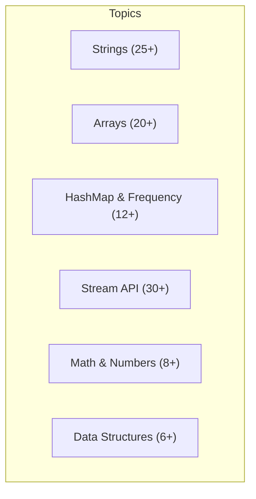

# Java Coding Interview Questions

A comprehensive collection of 100+ real coding problems asked in technical interviews — organized by topic with optimal solutions and complexity analysis. All solutions available in the [:fontawesome-brands-github: Java-Practice](https://github.com/saivamsikaruturi/Java-Practice) repository.

---

## Quick Navigation



---

## String Problems

### Reverse Operations

| # | Problem | Approach | Time | Space |
|---|---------|----------|------|-------|
| 1 | Reverse a string | Two-pointer swap on char array | O(n) | O(n) |
| 2 | Reverse a string using recursion | `reverse(s.substring(1)) + s.charAt(0)` | O(n²) | O(n) |
| 3 | Reverse each word in a sentence (keep word order) | Split → reverse each word → rejoin | O(n) | O(n) |
| 4 | Reverse word order in a sentence | Split → iterate backwards | O(n) | O(n) |
| 5 | Reverse both word order AND characters in each word | Combine approaches 3 + 4 | O(n) | O(n) |

??? example "Solutions: Reverse Operations"

    **1. Reverse a String (Two-Pointer)**

    Use two pointers starting at both ends of a char array, swapping characters until they meet in the middle. This is the most efficient in-place approach.

    ```java
    public String reverse(String s) {
        char[] chars = s.toCharArray();
        int left = 0, right = chars.length - 1;
        while (left < right) {
            char temp = chars[left];
            chars[left++] = chars[right];
            chars[right--] = temp;
        }
        return new String(chars);
    }
    ```

    - **Time:** O(n) — single pass through half the array
    - **Space:** O(n) — char array copy of the string

    ---

    **2. Reverse a String Using Recursion**

    Recursively take the first character and append it after reversing the rest. Base case is an empty or single-character string.

    ```java
    public String reverseRecursive(String s) {
        if (s.length() <= 1) return s;
        return reverseRecursive(s.substring(1)) + s.charAt(0);
    }
    ```

    - **Time:** O(n^2) — substring creates new string each call
    - **Space:** O(n) — recursion stack depth

    ---

    **3. Reverse Each Word in a Sentence (Keep Word Order)**

    Split the sentence by spaces, reverse each individual word using StringBuilder, then rejoin with spaces.

    ```java
    public String reverseEachWord(String sentence) {
        String[] words = sentence.split(" ");
        StringBuilder result = new StringBuilder();
        for (String word : words) {
            result.append(new StringBuilder(word).reverse()).append(" ");
        }
        return result.toString().trim();
    }
    ```

    - **Time:** O(n) — processes each character once
    - **Space:** O(n) — stores the result string

    ---

    **4. Reverse Word Order in a Sentence**

    Split by spaces, then iterate from the last word to the first, building the result.

    ```java
    public String reverseWordOrder(String sentence) {
        String[] words = sentence.trim().split("\\s+");
        StringBuilder result = new StringBuilder();
        for (int i = words.length - 1; i >= 0; i--) {
            result.append(words[i]);
            if (i > 0) result.append(" ");
        }
        return result.toString();
    }
    ```

    - **Time:** O(n) — single pass through the words
    - **Space:** O(n) — result string storage

    ---

    **5. Reverse Both Word Order AND Characters in Each Word**

    Combine approaches: reverse word order first, then reverse characters in each word. Alternatively, just reverse the entire string.

    ```java
    public String reverseAll(String sentence) {
        String[] words = sentence.trim().split("\\s+");
        StringBuilder result = new StringBuilder();
        for (int i = words.length - 1; i >= 0; i--) {
            result.append(new StringBuilder(words[i]).reverse());
            if (i > 0) result.append(" ");
        }
        return result.toString();
    }
    ```

    - **Time:** O(n) — processes each character once
    - **Space:** O(n) — result string storage

### Palindrome & Validation

| # | Problem | Approach | Time | Space |
|---|---------|----------|------|-------|
| 6 | Check if a string is a palindrome | Reverse and compare (or two-pointer) | O(n) | O(1) |
| 7 | Find all palindrome substrings | Generate all substrings, two-pointer check each | O(n³) | O(1) |
| 8 | Check if a string is a rotation of another | Concatenate `s+s`, check `contains(target)` | O(n) | O(n) |
| 9 | Rotate a string by R positions | `s.substring(r) + s.substring(0, r)` | O(n) | O(n) |
| 10 | Check if string is an isogram (no repeated chars) | HashSet — add each char, check size | O(n) | O(n) |

??? example "Solutions: Palindrome & Validation"

    **6. Check if a String is a Palindrome (Two-Pointer)**

    Use two pointers from both ends, comparing characters moving inward. If all pairs match, it is a palindrome.

    ```java
    public boolean isPalindrome(String s) {
        int left = 0, right = s.length() - 1;
        while (left < right) {
            if (s.charAt(left++) != s.charAt(right--)) return false;
        }
        return true;
    }
    ```

    - **Time:** O(n) — single pass through half the string
    - **Space:** O(1) — no extra storage needed

    ---

    **7. Find All Palindrome Substrings**

    Generate all substrings using nested loops. For each substring, check if it is a palindrome using the two-pointer technique.

    ```java
    public List<String> findAllPalindromes(String s) {
        List<String> result = new ArrayList<>();
        for (int i = 0; i < s.length(); i++) {
            for (int j = i + 1; j <= s.length(); j++) {
                String sub = s.substring(i, j);
                if (sub.length() > 1 && isPalindrome(sub)) {
                    result.add(sub);
                }
            }
        }
        return result;
    }
    ```

    - **Time:** O(n^3) — O(n^2) substrings, O(n) palindrome check each
    - **Space:** O(1) — excluding result storage

    ---

    **8. Check if String is a Rotation of Another**

    Concatenate the string with itself. If the target is a substring of this concatenation, it is a valid rotation.

    ```java
    public boolean isRotation(String s1, String s2) {
        if (s1.length() != s2.length()) return false;
        return (s1 + s1).contains(s2);
    }
    ```

    - **Time:** O(n) — contains uses efficient substring search
    - **Space:** O(n) — concatenated string

    ---

    **10. Check if String is an Isogram**

    An isogram has no repeating characters. Add each character to a HashSet; if adding fails (duplicate), it is not an isogram.

    ```java
    public boolean isIsogram(String s) {
        Set<Character> seen = new HashSet<>();
        for (char c : s.toLowerCase().toCharArray()) {
            if (!seen.add(c)) return false;
        }
        return true;
    }
    ```

    - **Time:** O(n) — single pass through the string
    - **Space:** O(n) — HashSet stores unique characters

### Character Operations

| # | Problem | Approach | Time | Space |
|---|---------|----------|------|-------|
| 11 | Count frequency of each character | HashMap iteration | O(n) | O(k) |
| 12 | Find first duplicate character | HashMap — break at count >= 2 | O(n) | O(k) |
| 13 | Find character with max occurrence | LinkedHashMap + track max during iteration | O(n) | O(k) |
| 14 | Find 2nd most frequent character | Frequency map → sort by value → skip(1) | O(n log k) | O(k) |
| 15 | Find first non-repeating character | LinkedHashMap — first entry with value 1 | O(n) | O(k) |
| 16 | Find duplicate characters using Streams | `groupingBy + counting()`, filter > 1 | O(n) | O(k) |

??? example "Solutions: Character Operations"

    **11. Count Frequency of Each Character (HashMap)**

    Iterate through each character of the string and use a HashMap to count occurrences. The merge method elegantly handles both new and existing keys.

    ```java
    public Map<Character, Integer> charFrequency(String s) {
        Map<Character, Integer> freq = new HashMap<>();
        for (char c : s.toCharArray()) {
            freq.merge(c, 1, Integer::sum);
        }
        return freq;
    }
    ```

    - **Time:** O(n) — single pass through the string
    - **Space:** O(k) — where k is the number of unique characters

    ---

    **12. Find First Duplicate Character**

    Use a HashSet to track seen characters. The first character that fails the add operation (already exists) is the first duplicate.

    ```java
    public char firstDuplicate(String s) {
        Set<Character> seen = new HashSet<>();
        for (char c : s.toCharArray()) {
            if (!seen.add(c)) return c;
        }
        return '\0'; // no duplicate found
    }
    ```

    - **Time:** O(n) — stops at the first duplicate
    - **Space:** O(k) — stores unique characters seen so far

    ---

    **13. Find Character with Max Occurrence**

    Build a frequency map, then find the entry with the highest value. Using LinkedHashMap preserves insertion order for consistent results.

    ```java
    public char maxOccurrence(String s) {
        Map<Character, Integer> freq = new LinkedHashMap<>();
        for (char c : s.toCharArray()) {
            freq.merge(c, 1, Integer::sum);
        }
        return freq.entrySet().stream()
            .max(Map.Entry.comparingByValue())
            .map(Map.Entry::getKey)
            .orElse('\0');
    }
    ```

    - **Time:** O(n) — single pass to build map, single pass to find max
    - **Space:** O(k) — frequency map storage

    ---

    **15. Find First Non-Repeating Character (LinkedHashMap)**

    Use LinkedHashMap to preserve insertion order while counting frequencies. Then find the first entry with count equal to 1.

    ```java
    public char firstNonRepeating(String s) {
        Map<Character, Integer> map = new LinkedHashMap<>();
        for (char c : s.toCharArray()) {
            map.merge(c, 1, Integer::sum);
        }
        return map.entrySet().stream()
            .filter(e -> e.getValue() == 1)
            .map(Map.Entry::getKey)
            .findFirst()
            .orElse('\0');
    }
    ```

    - **Time:** O(n) — two passes: one to build map, one to find first unique
    - **Space:** O(k) — LinkedHashMap stores unique characters

    ---

    **16. Find Duplicate Characters Using Streams**

    Use Stream API with groupingBy and counting collectors. Filter entries where count exceeds 1.

    ```java
    public List<Character> findDuplicates(String s) {
        return s.chars()
            .mapToObj(c -> (char) c)
            .collect(Collectors.groupingBy(Function.identity(), Collectors.counting()))
            .entrySet().stream()
            .filter(e -> e.getValue() > 1)
            .map(Map.Entry::getKey)
            .collect(Collectors.toList());
    }
    ```

    - **Time:** O(n) — single pass with stream operations
    - **Space:** O(k) — frequency map and result list

### String Manipulation

| # | Problem | Approach | Time | Space |
|---|---------|----------|------|-------|
| 17 | Remove all whitespace | `replaceAll("\\s", "")` | O(n) | O(n) |
| 18 | Remove special characters | `replaceAll("[^0-9A-Za-z]", "")` | O(n) | O(n) |
| 19 | Count special characters / extract alphanumeric | `Character.isLetterOrDigit()` check | O(n) | O(n) |
| 20 | Count words in a string | `split("\\s+").length` | O(n) | O(n) |
| 21 | Display all vowels in a string | Iterate + vowel set check | O(n) | O(1) |
| 22 | Count unique vowels and consonants | Two counters with char classification | O(n) | O(1) |
| 23 | Find even-length words | Split → filter by `word.length() % 2 == 0` | O(n) | O(n) |
| 24 | Generate all substrings | Nested loops: `substring(i, j+1)` | O(n²) | O(n²) |
| 25 | Remove duplicate words from sentence | LinkedHashMap preserving order | O(n) | O(n) |
| 26 | Password validation (length, alphanumeric, special) | Regex pattern matching | O(n) | O(1) |
| 27 | Caesar cipher (shift chars by N) | Character arithmetic with `% 26` | O(n) | O(n) |
| 28 | Swap two strings without a third variable | Concatenation + substring extraction | O(n) | O(n) |

??? example "Solutions: String Manipulation"

    **24. Generate All Substrings (Nested Loop)**

    Use two nested loops where the outer loop picks the start index and the inner loop picks the end index. Extract each substring using the substring method.

    ```java
    public List<String> allSubstrings(String s) {
        List<String> result = new ArrayList<>();
        for (int i = 0; i < s.length(); i++) {
            for (int j = i + 1; j <= s.length(); j++) {
                result.add(s.substring(i, j));
            }
        }
        return result;
    }
    ```

    - **Time:** O(n^2) — nested loop generates n*(n+1)/2 substrings
    - **Space:** O(n^2) — stores all substrings

    ---

    **25. Remove Duplicate Words from Sentence (LinkedHashSet)**

    Split the sentence into words and add them to a LinkedHashSet which preserves insertion order while eliminating duplicates.

    ```java
    public String removeDuplicateWords(String sentence) {
        String[] words = sentence.split("\\s+");
        Set<String> unique = new LinkedHashSet<>(Arrays.asList(words));
        return String.join(" ", unique);
    }
    ```

    - **Time:** O(n) — single pass through words
    - **Space:** O(n) — LinkedHashSet stores unique words

    ---

    **27. Caesar Cipher (Character Arithmetic)**

    Shift each character by N positions in the alphabet using modular arithmetic to wrap around. Handle both uppercase and lowercase separately.

    ```java
    public String caesarCipher(String s, int shift) {
        StringBuilder result = new StringBuilder();
        for (char c : s.toCharArray()) {
            if (Character.isUpperCase(c)) {
                result.append((char) ('A' + (c - 'A' + shift) % 26));
            } else if (Character.isLowerCase(c)) {
                result.append((char) ('a' + (c - 'a' + shift) % 26));
            } else {
                result.append(c);
            }
        }
        return result.toString();
    }
    ```

    - **Time:** O(n) — single pass through the string
    - **Space:** O(n) — result StringBuilder

    ---

    **26. Password Validation (Regex)**

    Validate password rules: minimum length, at least one uppercase, one lowercase, one digit, and one special character using regex patterns.

    ```java
    public boolean isValidPassword(String password) {
        if (password.length() < 8) return false;
        boolean hasUpper = password.matches(".*[A-Z].*");
        boolean hasLower = password.matches(".*[a-z].*");
        boolean hasDigit = password.matches(".*\\d.*");
        boolean hasSpecial = password.matches(".*[!@#$%^&*()].*");
        return hasUpper && hasLower && hasDigit && hasSpecial;
    }
    ```

    - **Time:** O(n) — regex scans the string for each condition
    - **Space:** O(1) — no extra data structures

---

## Array Problems

### Finding Elements

| # | Problem | Approach | Time | Space |
|---|---------|----------|------|-------|
| 1 | Two Sum — find indices that add to target | HashMap complement lookup | O(n) | O(n) |
| 2 | Find second largest element | Single pass: track first, second | O(n) | O(1) |
| 3 | Find third largest element | Single pass: track top 3 variables | O(n) | O(1) |
| 4 | Find Nth highest element | Min-heap (PriorityQueue) of size N | O(n log k) | O(k) |
| 5 | Find min and max in array | Single pass comparison | O(n) | O(1) |
| 6 | Find closest number to a target | Linear scan with `Math.abs(target - element)` | O(n) | O(1) |
| 7 | Find missing number in 1..N | Sum formula: `n*(n+1)/2 - arraySum` | O(n) | O(1) |
| 8 | Find duplicates in an array | HashMap frequency, filter count > 1 | O(n) | O(n) |
| 9 | Find element with highest frequency | HashMap + stream max by value | O(n) | O(n) |
| 10 | Find 3rd largest with duplicates | HashSet filter + sorted stream | O(n log n) | O(n) |
| 11 | Find closest pair of numbers | Sort + compare adjacent differences | O(n log n) | O(1) |
| 12 | Max sum of K consecutive elements | Sliding window | O(n) | O(1) |

??? example "Solutions: Finding Elements"

    **1. Two Sum (HashMap Complement Lookup)**

    For each element, calculate the complement (target - current). Check if the complement exists in the HashMap. If yes, return both indices. Otherwise, store current element with its index.

    ```java
    public int[] twoSum(int[] nums, int target) {
        Map<Integer, Integer> map = new HashMap<>();
        for (int i = 0; i < nums.length; i++) {
            int complement = target - nums[i];
            if (map.containsKey(complement)) {
                return new int[]{map.get(complement), i};
            }
            map.put(nums[i], i);
        }
        return new int[]{};
    }
    ```

    - **Time:** O(n) — single pass with O(1) HashMap lookup
    - **Space:** O(n) — HashMap stores at most n elements

    ---

    **2. Find Second Largest Element (Single Pass)**

    Track the largest and second largest in one pass. When a new largest is found, demote the old largest to second. Update second if a value is between both.

    ```java
    public int secondLargest(int[] arr) {
        int first = Integer.MIN_VALUE, second = Integer.MIN_VALUE;
        for (int num : arr) {
            if (num > first) {
                second = first;
                first = num;
            } else if (num > second && num != first) {
                second = num;
            }
        }
        return second;
    }
    ```

    - **Time:** O(n) — single pass through the array
    - **Space:** O(1) — only two tracking variables

    ---

    **4. Find Nth Largest Element (Min-Heap)**

    Maintain a min-heap of size N. For each element, add to heap; if heap size exceeds N, remove the minimum. The heap's top is the Nth largest.

    ```java
    public int nthLargest(int[] arr, int n) {
        PriorityQueue<Integer> minHeap = new PriorityQueue<>();
        for (int num : arr) {
            minHeap.offer(num);
            if (minHeap.size() > n) {
                minHeap.poll();
            }
        }
        return minHeap.peek();
    }
    ```

    - **Time:** O(n log k) — each heap operation is O(log k)
    - **Space:** O(k) — heap stores at most k elements

    ---

    **7. Find Missing Number (Math Formula)**

    Calculate expected sum of 1 to N using the formula n*(n+1)/2. Subtract the actual array sum to find the missing number.

    ```java
    public int findMissing(int[] arr, int n) {
        int expectedSum = n * (n + 1) / 2;
        int actualSum = 0;
        for (int num : arr) actualSum += num;
        return expectedSum - actualSum;
    }
    ```

    - **Time:** O(n) — single pass to compute sum
    - **Space:** O(1) — only stores sum variables

    ---

    **8. Find Duplicates in an Array (HashMap)**

    Count frequency of each element using a HashMap, then filter entries where count exceeds 1.

    ```java
    public List<Integer> findDuplicates(int[] arr) {
        Map<Integer, Integer> freq = new HashMap<>();
        for (int num : arr) {
            freq.merge(num, 1, Integer::sum);
        }
        return freq.entrySet().stream()
            .filter(e -> e.getValue() > 1)
            .map(Map.Entry::getKey)
            .collect(Collectors.toList());
    }
    ```

    - **Time:** O(n) — single pass to build frequency map
    - **Space:** O(n) — HashMap stores all elements

    ---

    **12. Max Sum of K Consecutive Elements (Sliding Window)**

    Compute the sum of the first K elements. Then slide the window by adding the next element and removing the first element of the previous window. Track the maximum sum.

    ```java
    public int maxSumSubarray(int[] arr, int k) {
        int windowSum = 0;
        for (int i = 0; i < k; i++) windowSum += arr[i];
        int maxSum = windowSum;
        for (int i = k; i < arr.length; i++) {
            windowSum += arr[i] - arr[i - k];
            maxSum = Math.max(maxSum, windowSum);
        }
        return maxSum;
    }
    ```

    - **Time:** O(n) — single pass after initial window
    - **Space:** O(1) — only stores sum and max variables

### Rearranging & Segregation

| # | Problem | Approach | Time | Space |
|---|---------|----------|------|-------|
| 13 | Move all zeros to end | Two-pointer: copy non-zeros forward, fill rest | O(n) | O(1) |
| 14 | Segregate 0s and 1s | Two-pointer swap from both ends | O(n) | O(1) |
| 15 | Segregate even and odd numbers | Two-pointer left/right swap | O(n) | O(1) |
| 16 | Swap adjacent elements | Iterate by 2, swap pairs | O(n) | O(1) |
| 17 | Rotate array by N positions (left) | Repeated single-position shifts (or reversal trick) | O(n) | O(1) |
| 18 | Insert element at beginning (shift all) | Array shift + insert | O(n) | O(1) |

??? example "Solutions: Rearranging & Segregation"

    **13. Move All Zeros to End (Two-Pointer)**

    Use a write pointer to track the next non-zero position. Copy all non-zero elements forward, then fill the remaining positions with zeros.

    ```java
    public void moveZeros(int[] arr) {
        int insertPos = 0;
        for (int num : arr) {
            if (num != 0) arr[insertPos++] = num;
        }
        while (insertPos < arr.length) {
            arr[insertPos++] = 0;
        }
    }
    ```

    - **Time:** O(n) — single pass through the array
    - **Space:** O(1) — in-place modification

    ---

    **14. Segregate 0s and 1s (Two-Pointer)**

    Use two pointers from both ends. Move left pointer forward past 0s, move right pointer backward past 1s. Swap when both are misplaced.

    ```java
    public void segregateZerosOnes(int[] arr) {
        int left = 0, right = arr.length - 1;
        while (left < right) {
            while (left < right && arr[left] == 0) left++;
            while (left < right && arr[right] == 1) right--;
            if (left < right) {
                arr[left++] = 0;
                arr[right--] = 1;
            }
        }
    }
    ```

    - **Time:** O(n) — each element visited at most once
    - **Space:** O(1) — in-place swaps

    ---

    **15. Segregate Even and Odd Numbers (Two-Pointer)**

    Left pointer finds the next odd, right pointer finds the next even. Swap them until pointers cross.

    ```java
    public void segregateEvenOdd(int[] arr) {
        int left = 0, right = arr.length - 1;
        while (left < right) {
            while (left < right && arr[left] % 2 == 0) left++;
            while (left < right && arr[right] % 2 != 0) right--;
            if (left < right) {
                int temp = arr[left];
                arr[left++] = arr[right];
                arr[right--] = temp;
            }
        }
    }
    ```

    - **Time:** O(n) — each element visited at most once
    - **Space:** O(1) — in-place swaps

    ---

    **17. Rotate Array by N Positions — Reversal Algorithm**

    Reverse the first k elements, reverse the remaining elements, then reverse the entire array. This achieves left rotation in O(n) time with O(1) space.

    ```java
    public void rotateLeft(int[] arr, int k) {
        int n = arr.length;
        k = k % n;
        reverse(arr, 0, k - 1);
        reverse(arr, k, n - 1);
        reverse(arr, 0, n - 1);
    }

    private void reverse(int[] arr, int start, int end) {
        while (start < end) {
            int temp = arr[start];
            arr[start++] = arr[end];
            arr[end--] = temp;
        }
    }
    ```

    - **Time:** O(n) — three reversals, each linear
    - **Space:** O(1) — in-place modification

### Sorting

| # | Problem | Approach | Time | Space |
|---|---------|----------|------|-------|
| 19 | Bubble Sort | Adjacent comparisons, repeated passes | O(n²) | O(1) |
| 20 | Quick Sort | Pivot partition + recurse | O(n log n) | O(log n) |
| 21 | Sort characters of a string descending | Convert to array, bubble sort | O(n²) | O(n) |
| 22 | Sort integers descending using Streams | `sorted(Comparator.reverseOrder())` | O(n log n) | O(n) |

??? example "Solutions: Sorting"

    **19. Bubble Sort**

    Repeatedly compare adjacent elements and swap if out of order. After each pass, the largest unsorted element bubbles to its correct position.

    ```java
    public void bubbleSort(int[] arr) {
        int n = arr.length;
        for (int i = 0; i < n - 1; i++) {
            boolean swapped = false;
            for (int j = 0; j < n - 1 - i; j++) {
                if (arr[j] > arr[j + 1]) {
                    int temp = arr[j];
                    arr[j] = arr[j + 1];
                    arr[j + 1] = temp;
                    swapped = true;
                }
            }
            if (!swapped) break; // optimization: already sorted
        }
    }
    ```

    - **Time:** O(n^2) worst/average, O(n) best (already sorted with optimization)
    - **Space:** O(1) — in-place sorting

    ---

    **20. Quick Sort (Divide and Conquer)**

    Pick a pivot element, partition the array so elements less than pivot are on the left and greater on the right. Recursively sort both partitions.

    ```java
    public void quickSort(int[] arr, int low, int high) {
        if (low < high) {
            int pivotIndex = partition(arr, low, high);
            quickSort(arr, low, pivotIndex - 1);
            quickSort(arr, pivotIndex + 1, high);
        }
    }

    private int partition(int[] arr, int low, int high) {
        int pivot = arr[high];
        int i = low - 1;
        for (int j = low; j < high; j++) {
            if (arr[j] <= pivot) {
                i++;
                int temp = arr[i];
                arr[i] = arr[j];
                arr[j] = temp;
            }
        }
        int temp = arr[i + 1];
        arr[i + 1] = arr[high];
        arr[high] = temp;
        return i + 1;
    }
    ```

    - **Time:** O(n log n) average, O(n^2) worst case
    - **Space:** O(log n) — recursion stack depth

### Search

| # | Problem | Approach | Time | Space |
|---|---------|----------|------|-------|
| 23 | Binary search (iterative) | Divide sorted array by midpoint | O(log n) | O(1) |
| 24 | Binary search (recursive) | Recursive divide and conquer | O(log n) | O(log n) |

??? example "Solutions: Search"

    **23. Binary Search (Iterative)**

    Repeatedly divide the search space in half by comparing the target with the middle element. Adjust left or right boundary based on comparison.

    ```java
    public int binarySearch(int[] arr, int target) {
        int left = 0, right = arr.length - 1;
        while (left <= right) {
            int mid = left + (right - left) / 2; // avoids overflow
            if (arr[mid] == target) return mid;
            else if (arr[mid] < target) left = mid + 1;
            else right = mid - 1;
        }
        return -1; // not found
    }
    ```

    - **Time:** O(log n) — halves search space each iteration
    - **Space:** O(1) — only pointer variables

    ---

    **24. Binary Search (Recursive)**

    Same logic as iterative but uses recursion. Base case is when left exceeds right (element not found).

    ```java
    public int binarySearchRecursive(int[] arr, int left, int right, int target) {
        if (left > right) return -1;
        int mid = left + (right - left) / 2;
        if (arr[mid] == target) return mid;
        else if (arr[mid] < target) return binarySearchRecursive(arr, mid + 1, right, target);
        else return binarySearchRecursive(arr, left, mid - 1, target);
    }
    ```

    - **Time:** O(log n) — halves search space each call
    - **Space:** O(log n) — recursion stack depth

### Matrix

| # | Problem | Approach | Time | Space |
|---|---------|----------|------|-------|
| 25 | Set row/column to zero if element is zero | Track zero positions, then fill | O(m×n) | O(m+n) |
| 26 | Anti-diagonal sum | Nested loop with index condition `i+j == n-1` | O(n²) | O(1) |

??? example "Solutions: Matrix"

    **25. Set Row/Column to Zero (Marker Approach)**

    First pass: find all rows and columns that contain zeros. Second pass: set entire rows and columns to zero based on the markers.

    ```java
    public void setZeroes(int[][] matrix) {
        int m = matrix.length, n = matrix[0].length;
        Set<Integer> zeroRows = new HashSet<>();
        Set<Integer> zeroCols = new HashSet<>();

        for (int i = 0; i < m; i++) {
            for (int j = 0; j < n; j++) {
                if (matrix[i][j] == 0) {
                    zeroRows.add(i);
                    zeroCols.add(j);
                }
            }
        }

        for (int i = 0; i < m; i++) {
            for (int j = 0; j < n; j++) {
                if (zeroRows.contains(i) || zeroCols.contains(j)) {
                    matrix[i][j] = 0;
                }
            }
        }
    }
    ```

    - **Time:** O(m x n) — two full passes through the matrix
    - **Space:** O(m + n) — stores row and column indices containing zeros

---

## HashMap & Frequency Problems

| # | Problem | Approach | Time | Space |
|---|---------|----------|------|-------|
| 1 | Character frequency map | Iterate chars, `map.merge(c, 1, Integer::sum)` | O(n) | O(k) |
| 2 | Group anagrams from string array | Sort each word's chars as HashMap key | O(n × k log k) | O(n) |
| 3 | Two Sum with HashMap | Store complement, O(1) lookup | O(n) | O(n) |
| 4 | Sort HashMap by value | `entrySet().stream().sorted(Map.Entry.comparingByValue())` | O(n log n) | O(n) |
| 5 | Sort HashMap by key | `TreeMap` or `sorted(comparingByKey())` | O(n log n) | O(n) |
| 6 | Remove entries from HashMap conditionally | `entrySet().removeIf(predicate)` | O(n) | O(1) |
| 7 | Find elements in list A not in list B | Stream filter with `!listB.contains()` | O(n×m) | O(n) |
| 8 | Set operations: union, intersection, subtraction | `addAll`, `retainAll`, `removeAll` | O(n) | O(n) |
| 9 | Roman numeral to integer | HashMap lookup + subtraction rule | O(n) | O(1) |
| 10 | Find duplicate elements using frequency map | HashMap count > 1 | O(n) | O(n) |
| 11 | Frequency of array elements | HashMap counting, iterate once | O(n) | O(n) |
| 12 | Remove duplicates preserving order | LinkedHashSet or `stream().distinct()` | O(n) | O(n) |

??? example "Solutions: HashMap & Frequency Problems"

    **2. Group Anagrams (Sorted Key HashMap)**

    For each word, sort its characters to create a canonical key. Words that are anagrams of each other produce the same sorted key. Group them using a HashMap.

    ```java
    public List<List<String>> groupAnagrams(String[] strs) {
        Map<String, List<String>> map = new HashMap<>();
        for (String s : strs) {
            char[] chars = s.toCharArray();
            Arrays.sort(chars);
            String key = new String(chars);
            map.computeIfAbsent(key, k -> new ArrayList<>()).add(s);
        }
        return new ArrayList<>(map.values());
    }
    ```

    - **Time:** O(n x k log k) — n words, each sorted in k log k
    - **Space:** O(n) — HashMap stores all words

    ---

    **3. Two Sum with HashMap**

    Store each number's index in a HashMap. For the current number, check if (target - current) already exists in the map.

    ```java
    public int[] twoSum(int[] nums, int target) {
        Map<Integer, Integer> map = new HashMap<>();
        for (int i = 0; i < nums.length; i++) {
            int complement = target - nums[i];
            if (map.containsKey(complement)) {
                return new int[]{map.get(complement), i};
            }
            map.put(nums[i], i);
        }
        return new int[]{};
    }
    ```

    - **Time:** O(n) — single pass with O(1) lookup
    - **Space:** O(n) — HashMap stores visited elements

    ---

    **4. Sort HashMap by Value**

    Convert the entry set to a stream, sort by value using a comparator, and collect into a LinkedHashMap to preserve sorted order.

    ```java
    public Map<String, Integer> sortByValue(Map<String, Integer> map) {
        return map.entrySet().stream()
            .sorted(Map.Entry.comparingByValue())
            .collect(Collectors.toMap(
                Map.Entry::getKey,
                Map.Entry::getValue,
                (e1, e2) -> e1,
                LinkedHashMap::new
            ));
    }
    ```

    - **Time:** O(n log n) — sorting the entries
    - **Space:** O(n) — new LinkedHashMap for result

    ---

    **9. Roman Numeral to Integer (HashMap Lookup)**

    Map each Roman numeral character to its value. If the current value is less than the next value, subtract it (handles IV, IX, etc.). Otherwise, add it.

    ```java
    public int romanToInt(String s) {
        Map<Character, Integer> map = Map.of(
            'I', 1, 'V', 5, 'X', 10, 'L', 50,
            'C', 100, 'D', 500, 'M', 1000
        );
        int result = 0;
        for (int i = 0; i < s.length(); i++) {
            int curr = map.get(s.charAt(i));
            int next = (i + 1 < s.length()) ? map.get(s.charAt(i + 1)) : 0;
            result += (curr < next) ? -curr : curr;
        }
        return result;
    }
    ```

    - **Time:** O(n) — single pass through the string
    - **Space:** O(1) — fixed-size lookup map

    ---

    **8. Set Operations: Union, Intersection, Subtraction**

    Use built-in Set methods for efficient set operations. Union uses addAll, intersection uses retainAll, and subtraction uses removeAll.

    ```java
    public void setOperations(Set<Integer> setA, Set<Integer> setB) {
        // Union
        Set<Integer> union = new HashSet<>(setA);
        union.addAll(setB);

        // Intersection
        Set<Integer> intersection = new HashSet<>(setA);
        intersection.retainAll(setB);

        // Difference (A - B)
        Set<Integer> difference = new HashSet<>(setA);
        difference.removeAll(setB);
    }
    ```

    - **Time:** O(n) — each operation iterates through one set
    - **Space:** O(n) — new sets for results

    ---

    **12. Remove Duplicates Preserving Order (LinkedHashSet)**

    LinkedHashSet maintains insertion order while rejecting duplicates. Convert list to LinkedHashSet and back for a deduplicated, order-preserved result.

    ```java
    public <T> List<T> removeDuplicates(List<T> list) {
        return new ArrayList<>(new LinkedHashSet<>(list));
    }

    // Stream alternative
    public <T> List<T> removeDuplicatesStream(List<T> list) {
        return list.stream().distinct().collect(Collectors.toList());
    }
    ```

    - **Time:** O(n) — single pass to build set
    - **Space:** O(n) — stores unique elements

---

## Stream API Problems

### Basic Operations

| # | Problem | Approach | Time |
|---|---------|----------|------|
| 1 | Filter even numbers from a list | `filter(n -> n % 2 == 0)` | O(n) |
| 2 | Filter odd numbers | `filter(n -> n % 2 != 0)` | O(n) |
| 3 | Find max value | `stream().max(Comparator.naturalOrder())` | O(n) |
| 4 | Sum all elements | `mapToInt(Integer::intValue).sum()` | O(n) |
| 5 | Average of elements | `mapToDouble().average()` | O(n) |
| 6 | Count elements | `stream().count()` | O(n) |
| 7 | Sort in natural order | `sorted()` | O(n log n) |
| 8 | Sort in reverse order | `sorted(Comparator.reverseOrder())` | O(n log n) |
| 9 | Limit first N elements | `stream().limit(n)` | O(n) |
| 10 | Skip first N elements | `stream().skip(n)` | O(n) |
| 11 | Cube all elements | `map(e -> e * e * e)` | O(n) |
| 12 | Square even, cube odd | `map(e -> e%2==0 ? e*e : e*e*e)` | O(n) |

??? example "Solutions: Stream API — Basic Operations"

    **1-4. Filter, Max, and Sum (Core Stream Patterns)**

    These represent the most common Stream API operations: filtering with predicates, finding extremes, and aggregating values.

    ```java
    public void basicStreamOps(List<Integer> numbers) {
        // Filter even numbers
        List<Integer> evens = numbers.stream()
            .filter(n -> n % 2 == 0)
            .collect(Collectors.toList());

        // Find max value
        Optional<Integer> max = numbers.stream()
            .max(Comparator.naturalOrder());

        // Sum all elements
        int sum = numbers.stream()
            .mapToInt(Integer::intValue)
            .sum();

        // Average
        OptionalDouble avg = numbers.stream()
            .mapToDouble(Integer::doubleValue)
            .average();
    }
    ```

    - **Time:** O(n) for each operation — single pass through the stream
    - **Space:** O(n) for collect operations, O(1) for reductions

    ---

    **7-8. Sorting with Streams**

    Streams provide natural and reverse sorting using Comparator. The sorted operation creates a new sorted stream without modifying the source.

    ```java
    public void sortingOps(List<Integer> numbers) {
        // Natural order
        List<Integer> sorted = numbers.stream()
            .sorted()
            .collect(Collectors.toList());

        // Reverse order
        List<Integer> reversed = numbers.stream()
            .sorted(Comparator.reverseOrder())
            .collect(Collectors.toList());
    }
    ```

    - **Time:** O(n log n) — standard comparison sort
    - **Space:** O(n) — new list for sorted result

    ---

    **12. Square Even, Cube Odd (Conditional Mapping)**

    Use map with a ternary operator to apply different transformations based on a condition.

    ```java
    public List<Integer> squareEvenCubeOdd(List<Integer> numbers) {
        return numbers.stream()
            .map(n -> n % 2 == 0 ? n * n : n * n * n)
            .collect(Collectors.toList());
    }
    ```

    - **Time:** O(n) — single pass transformation
    - **Space:** O(n) — new list for results

### Filtering & Searching

| # | Problem | Approach | Time |
|---|---------|----------|------|
| 13 | Filter strings starting with a character | `filter(s -> s.startsWith("A"))` | O(n) |
| 14 | Find duplicate elements | `HashSet` + `filter(e -> !set.add(e))` | O(n) |
| 15 | Remove duplicates | `stream().distinct()` | O(n) |
| 16 | Remove nulls from a list | `filter(Objects::nonNull)` | O(n) |
| 17 | Remove duplicates and nulls | `filter(!=null).distinct()` | O(n) |
| 18 | Find elements with frequency > 1 | `Collections.frequency` in filter | O(n²) |
| 19 | Check if any element matches condition | `anyMatch(predicate)` | O(n) |

??? example "Solutions: Stream API — Filtering & Searching"

    **14. Find Duplicate Elements (HashSet Filter Trick)**

    Use a HashSet's add method which returns false for duplicates. Filter elements where add returns false to find all duplicates.

    ```java
    public List<Integer> findDuplicates(List<Integer> list) {
        Set<Integer> seen = new HashSet<>();
        return list.stream()
            .filter(e -> !seen.add(e))
            .collect(Collectors.toList());
    }
    ```

    - **Time:** O(n) — single pass with O(1) HashSet operations
    - **Space:** O(n) — HashSet stores unique elements

    ---

    **15-17. Remove Duplicates, Nulls, or Both**

    Chain filter and distinct operations to clean data. Objects.nonNull is a clean predicate for null filtering.

    ```java
    public List<Integer> cleanList(List<Integer> list) {
        // Remove nulls and duplicates
        return list.stream()
            .filter(Objects::nonNull)
            .distinct()
            .collect(Collectors.toList());
    }
    ```

    - **Time:** O(n) — single pass
    - **Space:** O(n) — internal HashSet for distinct tracking

    ---

    **18. Find Elements with Frequency Greater Than 1**

    Use groupingBy with counting to build a frequency map, then filter entries with count > 1.

    ```java
    public List<Integer> frequentElements(List<Integer> list) {
        Map<Integer, Long> freq = list.stream()
            .collect(Collectors.groupingBy(Function.identity(), Collectors.counting()));
        return freq.entrySet().stream()
            .filter(e -> e.getValue() > 1)
            .map(Map.Entry::getKey)
            .collect(Collectors.toList());
    }
    ```

    - **Time:** O(n) — two passes: count + filter
    - **Space:** O(n) — frequency map storage

### Reduction & Collection

| # | Problem | Approach | Time |
|---|---------|----------|------|
| 20 | Find longest string using reduce | `reduce((a,b) -> a.length() >= b.length() ? a : b)` | O(n) |
| 21 | Concatenate strings with delimiter | `reduce((a,b) -> a + "-" + b)` or `Collectors.joining` | O(n) |
| 22 | Flatten list of lists | `flatMap(Collection::stream)` | O(n) |
| 23 | Convert List to Map | `Collectors.toMap(keyFn, valueFn)` | O(n) |
| 24 | Group by a property | `Collectors.groupingBy(classifier)` | O(n) |
| 25 | Generate first 100 odd numbers | `Stream.iterate(1, n -> n+2).limit(100)` | O(n) |

??? example "Solutions: Stream API — Reduction & Collection"

    **20. Find Longest String Using Reduce**

    Reduce compares pairs of elements, keeping the longer one. The final result is the longest string in the stream.

    ```java
    public String longestString(List<String> list) {
        return list.stream()
            .reduce((a, b) -> a.length() >= b.length() ? a : b)
            .orElse("");
    }
    ```

    - **Time:** O(n) — single pass comparison
    - **Space:** O(1) — no intermediate collections

    ---

    **22. Flatten List of Lists (flatMap)**

    flatMap transforms each element into a stream and then flattens all resulting streams into a single stream. Essential for nested collection processing.

    ```java
    public List<Integer> flatten(List<List<Integer>> nestedList) {
        return nestedList.stream()
            .flatMap(Collection::stream)
            .collect(Collectors.toList());
    }
    ```

    - **Time:** O(n) — where n is total elements across all lists
    - **Space:** O(n) — flattened result list

    ---

    **23. Convert List to Map (Collectors.toMap)**

    Use toMap collector with key and value extractor functions. Handle duplicate keys with a merge function.

    ```java
    public Map<Integer, String> listToMap(List<Employee> employees) {
        return employees.stream()
            .collect(Collectors.toMap(
                Employee::getId,
                Employee::getName,
                (existing, replacement) -> existing // handle duplicates
            ));
    }
    ```

    - **Time:** O(n) — single pass through the list
    - **Space:** O(n) — resulting map

    ---

    **24. Group By a Property (Collectors.groupingBy)**

    groupingBy partitions stream elements into groups based on a classifier function. The result is a Map where keys are group identifiers and values are lists.

    ```java
    public Map<String, List<Employee>> groupByDept(List<Employee> employees) {
        return employees.stream()
            .collect(Collectors.groupingBy(Employee::getDepartment));
    }

    // With downstream collector (count per group)
    public Map<String, Long> countByDept(List<Employee> employees) {
        return employees.stream()
            .collect(Collectors.groupingBy(Employee::getDepartment, Collectors.counting()));
    }
    ```

    - **Time:** O(n) — single pass grouping
    - **Space:** O(n) — map with grouped lists

### Employee/Object Stream Problems

| # | Problem | Approach | Time |
|---|---------|----------|------|
| 26 | Count male/female employees | `filter(e -> e.getGender().equals("Male")).count()` | O(n) |
| 27 | Get all unique departments | `map(Employee::getDept).distinct()` | O(n) |
| 28 | Sum of ages of male employees | `filter + mapToInt(getAge).sum()` | O(n) |
| 29 | Average age of female employees | `filter + mapToDouble.average()` | O(n) |
| 30 | Highest salary employee | `max(Comparator.comparingDouble(getSalary))` | O(n) |
| 31 | 2nd highest salary | `sorted(reversed).skip(1).findFirst()` | O(n log n) |
| 32 | Employees joined after a date | `filter(e -> e.getJoinDate().isAfter(date))` | O(n) |
| 33 | Youngest employee | `min(Comparator.comparingInt(getAge))` | O(n) |
| 34 | Filter by age and apply salary hike | `filter(age > 25).map(salary * 1.10)` | O(n) |
| 35 | Sort objects by salary desc, then name | `Comparator.comparing(getSalary).reversed().thenComparing(getName)` | O(n log n) |

??? example "Solutions: Employee/Object Stream Problems"

    **30. Highest Salary Employee**

    Use max with a comparator on the salary field to find the employee with the highest pay.

    ```java
    public Optional<Employee> highestPaid(List<Employee> employees) {
        return employees.stream()
            .max(Comparator.comparingDouble(Employee::getSalary));
    }
    ```

    - **Time:** O(n) — single pass comparison
    - **Space:** O(1) — no intermediate collections

    ---

    **31. 2nd Highest Salary**

    Sort employees by salary in descending order, skip the first one, and take the next. Use distinct salaries to handle ties.

    ```java
    public Optional<Employee> secondHighestSalary(List<Employee> employees) {
        return employees.stream()
            .sorted(Comparator.comparingDouble(Employee::getSalary).reversed())
            .skip(1)
            .findFirst();
    }

    // If you need 2nd highest unique salary
    public OptionalDouble secondHighestUniqueSalary(List<Employee> employees) {
        return employees.stream()
            .mapToDouble(Employee::getSalary)
            .distinct()
            .sorted()
            .skip(employees.stream().mapToDouble(Employee::getSalary).distinct().count() - 2)
            .findFirst();
    }
    ```

    - **Time:** O(n log n) — sorting required
    - **Space:** O(n) — sorted intermediate collection

    ---

    **35. Sort Objects by Salary Descending, Then Name Ascending**

    Chain comparators using thenComparing for multi-field sorting. Reversed on salary gives descending order.

    ```java
    public List<Employee> sortBySalaryThenName(List<Employee> employees) {
        return employees.stream()
            .sorted(Comparator.comparingDouble(Employee::getSalary).reversed()
                .thenComparing(Employee::getName))
            .collect(Collectors.toList());
    }
    ```

    - **Time:** O(n log n) — comparison sort
    - **Space:** O(n) — sorted result list

    ---

    **Highest Paid Employee by Department (groupingBy + maxBy)**

    Combine groupingBy with a downstream maxBy collector to find the highest paid employee in each department.

    ```java
    public Map<String, Optional<Employee>> highestPaidByDept(List<Employee> employees) {
        return employees.stream()
            .collect(Collectors.groupingBy(
                Employee::getDepartment,
                Collectors.maxBy(Comparator.comparingDouble(Employee::getSalary))
            ));
    }
    ```

    - **Time:** O(n) — single pass grouping and comparison
    - **Space:** O(n) — map with department groups

---

## Math & Number Problems

| # | Problem | Approach | Time | Space |
|---|---------|----------|------|-------|
| 1 | Check if number is palindrome | Reverse digits using `% 10` and `/ 10` | O(d) | O(1) |
| 2 | Fibonacci series up to N | Iterative: `first + second` swap | O(n) | O(1) |
| 3 | Nth Fibonacci number (recursive) | `fib(n-1) + fib(n-2)` | O(2ⁿ) | O(n) |
| 4 | Factorial using recursion | `n * factorial(n-1)`, base: `n <= 1` | O(n) | O(n) |
| 5 | Check if number is Armstrong | Sum of cubes of digits == number | O(d) | O(1) |
| 6 | Swap two numbers without temp variable | `a=a+b; b=a-b; a=a-b` | O(1) | O(1) |
| 7 | FizzBuzz (divisible by 3, 5, or both) | Modulo checks in loop | O(n) | O(1) |
| 8 | Min and max sum (exclude one element) | Sort, sum first n-1 and last n-1 | O(n log n) | O(1) |

??? example "Solutions: Math & Number Problems"

    **1. Check if Number is Palindrome (Digit Reversal)**

    Reverse the number by extracting digits from the end using modulo and division. Compare the reversed number with the original.

    ```java
    public boolean isPalindromeNumber(int num) {
        if (num < 0) return false;
        int original = num, reversed = 0;
        while (num > 0) {
            reversed = reversed * 10 + num % 10;
            num /= 10;
        }
        return original == reversed;
    }
    ```

    - **Time:** O(d) — where d is the number of digits
    - **Space:** O(1) — only stores reversed number

    ---

    **2. Fibonacci Series (Iterative)**

    Start with 0 and 1, then each subsequent number is the sum of the previous two. Iterative approach avoids exponential recursion overhead.

    ```java
    public List<Integer> fibonacci(int n) {
        List<Integer> series = new ArrayList<>();
        int a = 0, b = 1;
        for (int i = 0; i < n; i++) {
            series.add(a);
            int temp = a + b;
            a = b;
            b = temp;
        }
        return series;
    }
    ```

    - **Time:** O(n) — single loop
    - **Space:** O(1) — excluding result storage (only two variables)

    ---

    **4. Factorial Using Recursion**

    Multiply n by the factorial of (n-1). Base case: factorial of 0 or 1 is 1.

    ```java
    public long factorial(int n) {
        if (n <= 1) return 1;
        return n * factorial(n - 1);
    }
    ```

    - **Time:** O(n) — n recursive calls
    - **Space:** O(n) — recursion stack depth

    ---

    **5. Check if Number is Armstrong**

    An Armstrong number equals the sum of its digits each raised to the power of the number of digits. For example, 153 = 1^3 + 5^3 + 3^3.

    ```java
    public boolean isArmstrong(int num) {
        int original = num;
        int digits = String.valueOf(num).length();
        int sum = 0;
        while (num > 0) {
            int digit = num % 10;
            sum += Math.pow(digit, digits);
            num /= 10;
        }
        return sum == original;
    }
    ```

    - **Time:** O(d) — where d is the number of digits
    - **Space:** O(1) — only arithmetic variables

    ---

    **7. FizzBuzz**

    Classic interview problem: print "Fizz" for multiples of 3, "Buzz" for multiples of 5, "FizzBuzz" for both, or the number itself. Check divisibility by 15 first to handle the combined case.

    ```java
    public List<String> fizzBuzz(int n) {
        List<String> result = new ArrayList<>();
        for (int i = 1; i <= n; i++) {
            if (i % 15 == 0) result.add("FizzBuzz");
            else if (i % 3 == 0) result.add("Fizz");
            else if (i % 5 == 0) result.add("Buzz");
            else result.add(String.valueOf(i));
        }
        return result;
    }
    ```

    - **Time:** O(n) — single loop from 1 to n
    - **Space:** O(1) — excluding result storage

    ---

    **8. Min and Max Sum (Exclude One Element)**

    Sort the array. The minimum sum excludes the largest element (sum of first n-1), and the maximum sum excludes the smallest (sum of last n-1).

    ```java
    public long[] minMaxSum(int[] arr) {
        Arrays.sort(arr);
        long totalSum = 0;
        for (int num : arr) totalSum += num;
        long minSum = totalSum - arr[arr.length - 1];
        long maxSum = totalSum - arr[0];
        return new long[]{minSum, maxSum};
    }
    ```

    - **Time:** O(n log n) — dominated by sorting
    - **Space:** O(1) — only stores sums

---

## Data Structures & Stack

| # | Problem | Approach | Time | Space |
|---|---------|----------|------|-------|
| 1 | Validate balanced brackets `{([` | Push open, pop on close, check match | O(n) | O(n) |
| 2 | Reverse an ArrayList | Iterate backward, add to new list | O(n) | O(n) |
| 3 | Reverse a linked list | Iterative: three-pointer reversal | O(n) | O(1) |
| 4 | Immutable class design | Final class, deep copy in constructor + getter | - | - |
| 5 | Custom LinkedList operations | Extend LinkedList, override methods | O(n) | O(n) |

??? example "Solutions: Data Structures & Stack"

    **1. Validate Balanced Brackets (Stack)**

    Push opening brackets onto a stack. For each closing bracket, check if the top of the stack is the matching opener. If the stack is empty at the end, brackets are balanced.

    ```java
    public boolean isBalanced(String s) {
        Deque<Character> stack = new ArrayDeque<>();
        Map<Character, Character> pairs = Map.of(')', '(', '}', '{', ']', '[');
        for (char c : s.toCharArray()) {
            if (pairs.containsValue(c)) {
                stack.push(c);
            } else if (pairs.containsKey(c)) {
                if (stack.isEmpty() || stack.pop() != pairs.get(c)) return false;
            }
        }
        return stack.isEmpty();
    }
    ```

    - **Time:** O(n) — single pass through the string
    - **Space:** O(n) — stack stores unmatched opening brackets

    ---

    **3. Reverse a Linked List (Iterative Three-Pointer)**

    Use three pointers: prev, current, and next. At each step, reverse the current node's pointer to point to prev, then advance all pointers.

    ```java
    public ListNode reverseLinkedList(ListNode head) {
        ListNode prev = null, current = head;
        while (current != null) {
            ListNode next = current.next;
            current.next = prev;
            prev = current;
            current = next;
        }
        return prev;
    }
    ```

    - **Time:** O(n) — single pass through the list
    - **Space:** O(1) — only three pointer variables

    ---

    **4. Immutable Class Design**

    Make the class final (prevent subclassing), fields private and final, no setters, defensive copy in constructor, and return unmodifiable views from getters.

    ```java
    public final class ImmutablePerson {
        private final String name;
        private final List<String> hobbies;

        public ImmutablePerson(String name, List<String> hobbies) {
            this.name = name;
            this.hobbies = new ArrayList<>(hobbies); // defensive copy
        }

        public String getName() { return name; }

        public List<String> getHobbies() {
            return Collections.unmodifiableList(hobbies); // unmodifiable view
        }
    }
    ```

    - **Key principles:** final class, final fields, defensive copy in, unmodifiable out
    - **Why:** Prevents external mutation and ensures thread safety without synchronization

---

## Collections & Date API

| # | Problem | Approach | Time | Space |
|---|---------|----------|------|-------|
| 1 | Remove duplicates from a list | `new HashSet<>(list)` or `stream().distinct()` | O(n) | O(n) |
| 2 | Sort list of strings naturally | `stream().sorted(naturalOrder())` | O(n log n) | O(n) |
| 3 | Find common elements between two lists | `stream().anyMatch(list2::contains)` | O(n×m) | O(1) |
| 4 | Add days to LocalDateTime | `LocalDateTime.now().plusDays(n)` | O(1) | O(1) |

---

## Optimal Solutions — Java Code

### 1. Two Sum (HashMap — O(n))

```java
public int[] twoSum(int[] nums, int target) {
    Map<Integer, Integer> map = new HashMap<>();
    for (int i = 0; i < nums.length; i++) {
        int complement = target - nums[i];
        if (map.containsKey(complement)) {
            return new int[]{map.get(complement), i};
        }
        map.put(nums[i], i);
    }
    return new int[]{};
}
```

### 2. Character Frequency (Stream API)

```java
public Map<Character, Long> charFrequency(String s) {
    return s.chars()
        .mapToObj(c -> (char) c)
        .collect(Collectors.groupingBy(Function.identity(), Collectors.counting()));
}
```

### 3. Second Largest Element (Single Pass — O(n))

```java
public int secondLargest(int[] arr) {
    int first = Integer.MIN_VALUE, second = Integer.MIN_VALUE;
    for (int num : arr) {
        if (num > first) {
            second = first;
            first = num;
        } else if (num > second && num != first) {
            second = num;
        }
    }
    return second;
}
```

### 4. Balanced Brackets (Stack — O(n))

```java
public boolean isBalanced(String s) {
    Deque<Character> stack = new ArrayDeque<>();
    Map<Character, Character> pairs = Map.of(')', '(', '}', '{', ']', '[');
    for (char c : s.toCharArray()) {
        if (pairs.containsValue(c)) {
            stack.push(c);
        } else if (pairs.containsKey(c)) {
            if (stack.isEmpty() || stack.pop() != pairs.get(c)) return false;
        }
    }
    return stack.isEmpty();
}
```

### 5. Move Zeros to End (Two Pointer — O(n))

```java
public void moveZeros(int[] arr) {
    int insertPos = 0;
    for (int num : arr) {
        if (num != 0) arr[insertPos++] = num;
    }
    while (insertPos < arr.length) arr[insertPos++] = 0;
}
```

### 6. Group Anagrams (HashMap — O(n × k log k))

```java
public List<List<String>> groupAnagrams(String[] strs) {
    Map<String, List<String>> map = new HashMap<>();
    for (String s : strs) {
        char[] chars = s.toCharArray();
        Arrays.sort(chars);
        String key = new String(chars);
        map.computeIfAbsent(key, k -> new ArrayList<>()).add(s);
    }
    return new ArrayList<>(map.values());
}
```

### 7. First Non-Repeating Character (LinkedHashMap)

```java
public char firstNonRepeating(String s) {
    Map<Character, Integer> map = new LinkedHashMap<>();
    for (char c : s.toCharArray()) {
        map.merge(c, 1, Integer::sum);
    }
    return map.entrySet().stream()
        .filter(e -> e.getValue() == 1)
        .map(Map.Entry::getKey)
        .findFirst()
        .orElse('\0');
}
```

### 8. Reverse Words in Sentence

```java
public String reverseEachWord(String s) {
    String[] words = s.trim().split("\\s+");
    StringBuilder result = new StringBuilder();
    for (String word : words) {
        result.append(new StringBuilder(word).reverse()).append(" ");
    }
    return result.toString().trim();
}
```

### 9. Nth Largest Element (Min-Heap — O(n log k))

```java
public int nthLargest(int[] arr, int n) {
    PriorityQueue<Integer> minHeap = new PriorityQueue<>();
    for (int num : arr) {
        minHeap.offer(num);
        if (minHeap.size() > n) minHeap.poll();
    }
    return minHeap.peek();
}
```

### 10. Roman Numeral to Integer

```java
public int romanToInt(String s) {
    Map<Character, Integer> map = Map.of(
        'I', 1, 'V', 5, 'X', 10, 'L', 50,
        'C', 100, 'D', 500, 'M', 1000
    );
    int result = 0;
    for (int i = 0; i < s.length(); i++) {
        int curr = map.get(s.charAt(i));
        int next = (i + 1 < s.length()) ? map.get(s.charAt(i + 1)) : 0;
        result += (curr < next) ? -curr : curr;
    }
    return result;
}
```

### 11. Rotate Array (Reversal Algorithm — O(n))

```java
public void rotateLeft(int[] arr, int k) {
    int n = arr.length;
    k = k % n;
    reverse(arr, 0, k - 1);
    reverse(arr, k, n - 1);
    reverse(arr, 0, n - 1);
}

private void reverse(int[] arr, int start, int end) {
    while (start < end) {
        int temp = arr[start];
        arr[start++] = arr[end];
        arr[end--] = temp;
    }
}
```

### 12. Segregate Even and Odd (Two Pointer — O(n))

```java
public void segregateEvenOdd(int[] arr) {
    int left = 0, right = arr.length - 1;
    while (left < right) {
        while (left < right && arr[left] % 2 == 0) left++;
        while (left < right && arr[right] % 2 != 0) right--;
        if (left < right) {
            int temp = arr[left];
            arr[left++] = arr[right];
            arr[right--] = temp;
        }
    }
}
```

### 13. Find Missing Number (Math — O(n))

```java
public int findMissing(int[] arr, int n) {
    int expectedSum = n * (n + 1) / 2;
    int actualSum = 0;
    for (int num : arr) actualSum += num;
    return expectedSum - actualSum;
}
```

### 14. Stream — Employee by Department & Salary

```java
public Map<String, Optional<Employee>> highestPaidByDept(List<Employee> employees) {
    return employees.stream()
        .collect(Collectors.groupingBy(
            Employee::getDepartment,
            Collectors.maxBy(Comparator.comparingDouble(Employee::getSalary))
        ));
}
```

### 15. Immutable Class

```java
public final class ImmutablePerson {
    private final String name;
    private final List<String> hobbies;

    public ImmutablePerson(String name, List<String> hobbies) {
        this.name = name;
        this.hobbies = new ArrayList<>(hobbies); // defensive copy
    }

    public String getName() { return name; }

    public List<String> getHobbies() {
        return Collections.unmodifiableList(hobbies); // unmodifiable view
    }
}
```

---

## Pattern Recognition — Most Frequently Asked

| Rank | Topic | Frequency | Key Technique |
|------|-------|-----------|---------------|
| 1 | **Reverse a string** | Very High | Two-pointer, recursion, StringBuilder |
| 2 | **Character frequency** | Very High | HashMap, Streams `groupingBy` |
| 3 | **Find Nth largest** | High | Min-heap, single-pass tracking |
| 4 | **Palindrome check** | High | Reverse comparison, two-pointer |
| 5 | **Stream API filtering/mapping** | High | `filter`, `map`, `collect` |
| 6 | **Two Sum** | High | HashMap complement lookup |
| 7 | **Move zeros / segregate** | Medium | Two-pointer technique |
| 8 | **Balanced brackets** | Medium | Stack push/pop |
| 9 | **Sort HashMap by value** | Medium | Stream + Comparator |
| 10 | **Group anagrams** | Medium | Sorted key HashMap |

---

## Complexity Cheat Sheet

| Technique | Time | Space | When to Use |
|-----------|------|-------|-------------|
| Two Pointer | O(n) | O(1) | Sorted arrays, partitioning |
| HashMap Lookup | O(1) avg | O(n) | Complement search, frequency |
| Sliding Window | O(n) | O(1) | Contiguous subarray problems |
| Min/Max Heap | O(n log k) | O(k) | Kth largest/smallest |
| Binary Search | O(log n) | O(1) | Sorted array search |
| Sorting + Scan | O(n log n) | O(1) | When order matters |
| Stack | O(n) | O(n) | Matching/nesting problems |
| Stream API | O(n) | O(n) | Declarative transformations |

---

## Interview Tips

!!! tip "Time Management"
    Most coding rounds give 30-45 minutes for 2-3 problems. Start with the one you're most confident about.

!!! tip "Talk Through Your Approach"
    Before coding: state the approach, time complexity, and space complexity. This matters more than a perfect solution.

!!! tip "Edge Cases to Always Consider"
    - Empty input / null
    - Single element
    - All elements same
    - Already sorted (ascending/descending)
    - Negative numbers
    - Integer overflow
    - Strings with spaces, special chars, Unicode

!!! tip "Common Mistakes to Avoid"
    - Using `==` instead of `.equals()` for String comparison
    - Not handling `Integer.MIN_VALUE` / `Integer.MAX_VALUE` edge cases
    - Off-by-one errors in loop bounds
    - Modifying a collection while iterating (use `Iterator.remove()` or streams)
    - Using `Stack` class instead of `Deque` (ArrayDeque is preferred)

!!! tip "Stream API Patterns to Know"
    ```java
    // Frequency map
    stream.collect(Collectors.groupingBy(Function.identity(), Collectors.counting()));

    // Group by property
    stream.collect(Collectors.groupingBy(Employee::getDept));

    // Partition (boolean split)
    stream.collect(Collectors.partitioningBy(n -> n % 2 == 0));

    // Join strings
    stream.collect(Collectors.joining(", "));
    ```
