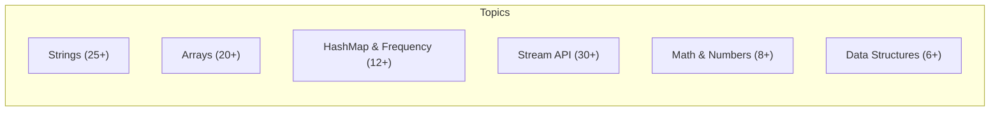

# Java Coding Interview Questions

A comprehensive collection of 100+ real coding problems asked in technical interviews — organized by topic with optimal solutions and complexity analysis. All solutions available in the [:fontawesome-brands-github: Java-Practice](https://github.com/saivamsikaruturi/Java-Practice) repository.

---

## Quick Navigation



---

## String Problems

### Reverse Operations

| # | Problem | Approach | Time | Space |
|---|---------|----------|------|-------|
| 1 | Reverse a string | Two-pointer swap on char array | O(n) | O(n) |
| 2 | Reverse a string using recursion | `reverse(s.substring(1)) + s.charAt(0)` | O(n²) | O(n) |
| 3 | Reverse each word in a sentence (keep word order) | Split → reverse each word → rejoin | O(n) | O(n) |
| 4 | Reverse word order in a sentence | Split → iterate backwards | O(n) | O(n) |
| 5 | Reverse both word order AND characters in each word | Combine approaches 3 + 4 | O(n) | O(n) |

### Palindrome & Validation

| # | Problem | Approach | Time | Space |
|---|---------|----------|------|-------|
| 6 | Check if a string is a palindrome | Reverse and compare (or two-pointer) | O(n) | O(1) |
| 7 | Find all palindrome substrings | Generate all substrings, two-pointer check each | O(n³) | O(1) |
| 8 | Check if a string is a rotation of another | Concatenate `s+s`, check `contains(target)` | O(n) | O(n) |
| 9 | Rotate a string by R positions | `s.substring(r) + s.substring(0, r)` | O(n) | O(n) |
| 10 | Check if string is an isogram (no repeated chars) | HashSet — add each char, check size | O(n) | O(n) |

### Character Operations

| # | Problem | Approach | Time | Space |
|---|---------|----------|------|-------|
| 11 | Count frequency of each character | HashMap iteration | O(n) | O(k) |
| 12 | Find first duplicate character | HashMap — break at count >= 2 | O(n) | O(k) |
| 13 | Find character with max occurrence | LinkedHashMap + track max during iteration | O(n) | O(k) |
| 14 | Find 2nd most frequent character | Frequency map → sort by value → skip(1) | O(n log k) | O(k) |
| 15 | Find first non-repeating character | LinkedHashMap — first entry with value 1 | O(n) | O(k) |
| 16 | Find duplicate characters using Streams | `groupingBy + counting()`, filter > 1 | O(n) | O(k) |

### String Manipulation

| # | Problem | Approach | Time | Space |
|---|---------|----------|------|-------|
| 17 | Remove all whitespace | `replaceAll("\\s", "")` | O(n) | O(n) |
| 18 | Remove special characters | `replaceAll("[^0-9A-Za-z]", "")` | O(n) | O(n) |
| 19 | Count special characters / extract alphanumeric | `Character.isLetterOrDigit()` check | O(n) | O(n) |
| 20 | Count words in a string | `split("\\s+").length` | O(n) | O(n) |
| 21 | Display all vowels in a string | Iterate + vowel set check | O(n) | O(1) |
| 22 | Count unique vowels and consonants | Two counters with char classification | O(n) | O(1) |
| 23 | Find even-length words | Split → filter by `word.length() % 2 == 0` | O(n) | O(n) |
| 24 | Generate all substrings | Nested loops: `substring(i, j+1)` | O(n²) | O(n²) |
| 25 | Remove duplicate words from sentence | LinkedHashMap preserving order | O(n) | O(n) |
| 26 | Password validation (length, alphanumeric, special) | Regex pattern matching | O(n) | O(1) |
| 27 | Caesar cipher (shift chars by N) | Character arithmetic with `% 26` | O(n) | O(n) |
| 28 | Swap two strings without a third variable | Concatenation + substring extraction | O(n) | O(n) |

---

## Array Problems

### Finding Elements

| # | Problem | Approach | Time | Space |
|---|---------|----------|------|-------|
| 1 | Two Sum — find indices that add to target | HashMap complement lookup | O(n) | O(n) |
| 2 | Find second largest element | Single pass: track first, second | O(n) | O(1) |
| 3 | Find third largest element | Single pass: track top 3 variables | O(n) | O(1) |
| 4 | Find Nth highest element | Min-heap (PriorityQueue) of size N | O(n log k) | O(k) |
| 5 | Find min and max in array | Single pass comparison | O(n) | O(1) |
| 6 | Find closest number to a target | Linear scan with `Math.abs(target - element)` | O(n) | O(1) |
| 7 | Find missing number in 1..N | Sum formula: `n*(n+1)/2 - arraySum` | O(n) | O(1) |
| 8 | Find duplicates in an array | HashMap frequency, filter count > 1 | O(n) | O(n) |
| 9 | Find element with highest frequency | HashMap + stream max by value | O(n) | O(n) |
| 10 | Find 3rd largest with duplicates | HashSet filter + sorted stream | O(n log n) | O(n) |
| 11 | Find closest pair of numbers | Sort + compare adjacent differences | O(n log n) | O(1) |
| 12 | Max sum of K consecutive elements | Sliding window | O(n) | O(1) |

### Rearranging & Segregation

| # | Problem | Approach | Time | Space |
|---|---------|----------|------|-------|
| 13 | Move all zeros to end | Two-pointer: copy non-zeros forward, fill rest | O(n) | O(1) |
| 14 | Segregate 0s and 1s | Two-pointer swap from both ends | O(n) | O(1) |
| 15 | Segregate even and odd numbers | Two-pointer left/right swap | O(n) | O(1) |
| 16 | Swap adjacent elements | Iterate by 2, swap pairs | O(n) | O(1) |
| 17 | Rotate array by N positions (left) | Repeated single-position shifts (or reversal trick) | O(n) | O(1) |
| 18 | Insert element at beginning (shift all) | Array shift + insert | O(n) | O(1) |

### Sorting

| # | Problem | Approach | Time | Space |
|---|---------|----------|------|-------|
| 19 | Bubble Sort | Adjacent comparisons, repeated passes | O(n²) | O(1) |
| 20 | Quick Sort | Pivot partition + recurse | O(n log n) | O(log n) |
| 21 | Sort characters of a string descending | Convert to array, bubble sort | O(n²) | O(n) |
| 22 | Sort integers descending using Streams | `sorted(Comparator.reverseOrder())` | O(n log n) | O(n) |

### Search

| # | Problem | Approach | Time | Space |
|---|---------|----------|------|-------|
| 23 | Binary search (iterative) | Divide sorted array by midpoint | O(log n) | O(1) |
| 24 | Binary search (recursive) | Recursive divide and conquer | O(log n) | O(log n) |

### Matrix

| # | Problem | Approach | Time | Space |
|---|---------|----------|------|-------|
| 25 | Set row/column to zero if element is zero | Track zero positions, then fill | O(m×n) | O(m+n) |
| 26 | Anti-diagonal sum | Nested loop with index condition `i+j == n-1` | O(n²) | O(1) |

---

## HashMap & Frequency Problems

| # | Problem | Approach | Time | Space |
|---|---------|----------|------|-------|
| 1 | Character frequency map | Iterate chars, `map.merge(c, 1, Integer::sum)` | O(n) | O(k) |
| 2 | Group anagrams from string array | Sort each word's chars as HashMap key | O(n × k log k) | O(n) |
| 3 | Two Sum with HashMap | Store complement, O(1) lookup | O(n) | O(n) |
| 4 | Sort HashMap by value | `entrySet().stream().sorted(Map.Entry.comparingByValue())` | O(n log n) | O(n) |
| 5 | Sort HashMap by key | `TreeMap` or `sorted(comparingByKey())` | O(n log n) | O(n) |
| 6 | Remove entries from HashMap conditionally | `entrySet().removeIf(predicate)` | O(n) | O(1) |
| 7 | Find elements in list A not in list B | Stream filter with `!listB.contains()` | O(n×m) | O(n) |
| 8 | Set operations: union, intersection, subtraction | `addAll`, `retainAll`, `removeAll` | O(n) | O(n) |
| 9 | Roman numeral to integer | HashMap lookup + subtraction rule | O(n) | O(1) |
| 10 | Find duplicate elements using frequency map | HashMap count > 1 | O(n) | O(n) |
| 11 | Frequency of array elements | HashMap counting, iterate once | O(n) | O(n) |
| 12 | Remove duplicates preserving order | LinkedHashSet or `stream().distinct()` | O(n) | O(n) |

---

## Stream API Problems

### Basic Operations

| # | Problem | Approach | Time |
|---|---------|----------|------|
| 1 | Filter even numbers from a list | `filter(n -> n % 2 == 0)` | O(n) |
| 2 | Filter odd numbers | `filter(n -> n % 2 != 0)` | O(n) |
| 3 | Find max value | `stream().max(Comparator.naturalOrder())` | O(n) |
| 4 | Sum all elements | `mapToInt(Integer::intValue).sum()` | O(n) |
| 5 | Average of elements | `mapToDouble().average()` | O(n) |
| 6 | Count elements | `stream().count()` | O(n) |
| 7 | Sort in natural order | `sorted()` | O(n log n) |
| 8 | Sort in reverse order | `sorted(Comparator.reverseOrder())` | O(n log n) |
| 9 | Limit first N elements | `stream().limit(n)` | O(n) |
| 10 | Skip first N elements | `stream().skip(n)` | O(n) |
| 11 | Cube all elements | `map(e -> e * e * e)` | O(n) |
| 12 | Square even, cube odd | `map(e -> e%2==0 ? e*e : e*e*e)` | O(n) |

### Filtering & Searching

| # | Problem | Approach | Time |
|---|---------|----------|------|
| 13 | Filter strings starting with a character | `filter(s -> s.startsWith("A"))` | O(n) |
| 14 | Find duplicate elements | `HashSet` + `filter(e -> !set.add(e))` | O(n) |
| 15 | Remove duplicates | `stream().distinct()` | O(n) |
| 16 | Remove nulls from a list | `filter(Objects::nonNull)` | O(n) |
| 17 | Remove duplicates and nulls | `filter(!=null).distinct()` | O(n) |
| 18 | Find elements with frequency > 1 | `Collections.frequency` in filter | O(n²) |
| 19 | Check if any element matches condition | `anyMatch(predicate)` | O(n) |

### Reduction & Collection

| # | Problem | Approach | Time |
|---|---------|----------|------|
| 20 | Find longest string using reduce | `reduce((a,b) -> a.length() >= b.length() ? a : b)` | O(n) |
| 21 | Concatenate strings with delimiter | `reduce((a,b) -> a + "-" + b)` or `Collectors.joining` | O(n) |
| 22 | Flatten list of lists | `flatMap(Collection::stream)` | O(n) |
| 23 | Convert List to Map | `Collectors.toMap(keyFn, valueFn)` | O(n) |
| 24 | Group by a property | `Collectors.groupingBy(classifier)` | O(n) |
| 25 | Generate first 100 odd numbers | `Stream.iterate(1, n -> n+2).limit(100)` | O(n) |

### Employee/Object Stream Problems

| # | Problem | Approach | Time |
|---|---------|----------|------|
| 26 | Count male/female employees | `filter(e -> e.getGender().equals("Male")).count()` | O(n) |
| 27 | Get all unique departments | `map(Employee::getDept).distinct()` | O(n) |
| 28 | Sum of ages of male employees | `filter + mapToInt(getAge).sum()` | O(n) |
| 29 | Average age of female employees | `filter + mapToDouble.average()` | O(n) |
| 30 | Highest salary employee | `max(Comparator.comparingDouble(getSalary))` | O(n) |
| 31 | 2nd highest salary | `sorted(reversed).skip(1).findFirst()` | O(n log n) |
| 32 | Employees joined after a date | `filter(e -> e.getJoinDate().isAfter(date))` | O(n) |
| 33 | Youngest employee | `min(Comparator.comparingInt(getAge))` | O(n) |
| 34 | Filter by age and apply salary hike | `filter(age > 25).map(salary * 1.10)` | O(n) |
| 35 | Sort objects by salary desc, then name | `Comparator.comparing(getSalary).reversed().thenComparing(getName)` | O(n log n) |

---

## Math & Number Problems

| # | Problem | Approach | Time | Space |
|---|---------|----------|------|-------|
| 1 | Check if number is palindrome | Reverse digits using `% 10` and `/ 10` | O(d) | O(1) |
| 2 | Fibonacci series up to N | Iterative: `first + second` swap | O(n) | O(1) |
| 3 | Nth Fibonacci number (recursive) | `fib(n-1) + fib(n-2)` | O(2ⁿ) | O(n) |
| 4 | Factorial using recursion | `n * factorial(n-1)`, base: `n <= 1` | O(n) | O(n) |
| 5 | Check if number is Armstrong | Sum of cubes of digits == number | O(d) | O(1) |
| 6 | Swap two numbers without temp variable | `a=a+b; b=a-b; a=a-b` | O(1) | O(1) |
| 7 | FizzBuzz (divisible by 3, 5, or both) | Modulo checks in loop | O(n) | O(1) |
| 8 | Min and max sum (exclude one element) | Sort, sum first n-1 and last n-1 | O(n log n) | O(1) |

---

## Data Structures & Stack

| # | Problem | Approach | Time | Space |
|---|---------|----------|------|-------|
| 1 | Validate balanced brackets `{([` | Push open, pop on close, check match | O(n) | O(n) |
| 2 | Reverse an ArrayList | Iterate backward, add to new list | O(n) | O(n) |
| 3 | Reverse a linked list | Iterative: three-pointer reversal | O(n) | O(1) |
| 4 | Immutable class design | Final class, deep copy in constructor + getter | - | - |
| 5 | Custom LinkedList operations | Extend LinkedList, override methods | O(n) | O(n) |

---

## Collections & Date API

| # | Problem | Approach | Time | Space |
|---|---------|----------|------|-------|
| 1 | Remove duplicates from a list | `new HashSet<>(list)` or `stream().distinct()` | O(n) | O(n) |
| 2 | Sort list of strings naturally | `stream().sorted(naturalOrder())` | O(n log n) | O(n) |
| 3 | Find common elements between two lists | `stream().anyMatch(list2::contains)` | O(n×m) | O(1) |
| 4 | Add days to LocalDateTime | `LocalDateTime.now().plusDays(n)` | O(1) | O(1) |

---

## Optimal Solutions — Java Code

### 1. Two Sum (HashMap — O(n))

```java
public int[] twoSum(int[] nums, int target) {
    Map<Integer, Integer> map = new HashMap<>();
    for (int i = 0; i < nums.length; i++) {
        int complement = target - nums[i];
        if (map.containsKey(complement)) {
            return new int[]{map.get(complement), i};
        }
        map.put(nums[i], i);
    }
    return new int[]{};
}
```

### 2. Character Frequency (Stream API)

```java
public Map<Character, Long> charFrequency(String s) {
    return s.chars()
        .mapToObj(c -> (char) c)
        .collect(Collectors.groupingBy(Function.identity(), Collectors.counting()));
}
```

### 3. Second Largest Element (Single Pass — O(n))

```java
public int secondLargest(int[] arr) {
    int first = Integer.MIN_VALUE, second = Integer.MIN_VALUE;
    for (int num : arr) {
        if (num > first) {
            second = first;
            first = num;
        } else if (num > second && num != first) {
            second = num;
        }
    }
    return second;
}
```

### 4. Balanced Brackets (Stack — O(n))

```java
public boolean isBalanced(String s) {
    Deque<Character> stack = new ArrayDeque<>();
    Map<Character, Character> pairs = Map.of(')', '(', '}', '{', ']', '[');
    for (char c : s.toCharArray()) {
        if (pairs.containsValue(c)) {
            stack.push(c);
        } else if (pairs.containsKey(c)) {
            if (stack.isEmpty() || stack.pop() != pairs.get(c)) return false;
        }
    }
    return stack.isEmpty();
}
```

### 5. Move Zeros to End (Two Pointer — O(n))

```java
public void moveZeros(int[] arr) {
    int insertPos = 0;
    for (int num : arr) {
        if (num != 0) arr[insertPos++] = num;
    }
    while (insertPos < arr.length) arr[insertPos++] = 0;
}
```

### 6. Group Anagrams (HashMap — O(n × k log k))

```java
public List<List<String>> groupAnagrams(String[] strs) {
    Map<String, List<String>> map = new HashMap<>();
    for (String s : strs) {
        char[] chars = s.toCharArray();
        Arrays.sort(chars);
        String key = new String(chars);
        map.computeIfAbsent(key, k -> new ArrayList<>()).add(s);
    }
    return new ArrayList<>(map.values());
}
```

### 7. First Non-Repeating Character (LinkedHashMap)

```java
public char firstNonRepeating(String s) {
    Map<Character, Integer> map = new LinkedHashMap<>();
    for (char c : s.toCharArray()) {
        map.merge(c, 1, Integer::sum);
    }
    return map.entrySet().stream()
        .filter(e -> e.getValue() == 1)
        .map(Map.Entry::getKey)
        .findFirst()
        .orElse('\0');
}
```

### 8. Reverse Words in Sentence

```java
public String reverseEachWord(String s) {
    String[] words = s.trim().split("\\s+");
    StringBuilder result = new StringBuilder();
    for (String word : words) {
        result.append(new StringBuilder(word).reverse()).append(" ");
    }
    return result.toString().trim();
}
```

### 9. Nth Largest Element (Min-Heap — O(n log k))

```java
public int nthLargest(int[] arr, int n) {
    PriorityQueue<Integer> minHeap = new PriorityQueue<>();
    for (int num : arr) {
        minHeap.offer(num);
        if (minHeap.size() > n) minHeap.poll();
    }
    return minHeap.peek();
}
```

### 10. Roman Numeral to Integer

```java
public int romanToInt(String s) {
    Map<Character, Integer> map = Map.of(
        'I', 1, 'V', 5, 'X', 10, 'L', 50,
        'C', 100, 'D', 500, 'M', 1000
    );
    int result = 0;
    for (int i = 0; i < s.length(); i++) {
        int curr = map.get(s.charAt(i));
        int next = (i + 1 < s.length()) ? map.get(s.charAt(i + 1)) : 0;
        result += (curr < next) ? -curr : curr;
    }
    return result;
}
```

### 11. Rotate Array (Reversal Algorithm — O(n))

```java
public void rotateLeft(int[] arr, int k) {
    int n = arr.length;
    k = k % n;
    reverse(arr, 0, k - 1);
    reverse(arr, k, n - 1);
    reverse(arr, 0, n - 1);
}

private void reverse(int[] arr, int start, int end) {
    while (start < end) {
        int temp = arr[start];
        arr[start++] = arr[end];
        arr[end--] = temp;
    }
}
```

### 12. Segregate Even and Odd (Two Pointer — O(n))

```java
public void segregateEvenOdd(int[] arr) {
    int left = 0, right = arr.length - 1;
    while (left < right) {
        while (left < right && arr[left] % 2 == 0) left++;
        while (left < right && arr[right] % 2 != 0) right--;
        if (left < right) {
            int temp = arr[left];
            arr[left++] = arr[right];
            arr[right--] = temp;
        }
    }
}
```

### 13. Find Missing Number (Math — O(n))

```java
public int findMissing(int[] arr, int n) {
    int expectedSum = n * (n + 1) / 2;
    int actualSum = 0;
    for (int num : arr) actualSum += num;
    return expectedSum - actualSum;
}
```

### 14. Stream — Employee by Department & Salary

```java
public Map<String, Optional<Employee>> highestPaidByDept(List<Employee> employees) {
    return employees.stream()
        .collect(Collectors.groupingBy(
            Employee::getDepartment,
            Collectors.maxBy(Comparator.comparingDouble(Employee::getSalary))
        ));
}
```

### 15. Immutable Class

```java
public final class ImmutablePerson {
    private final String name;
    private final List<String> hobbies;

    public ImmutablePerson(String name, List<String> hobbies) {
        this.name = name;
        this.hobbies = new ArrayList<>(hobbies); // defensive copy
    }

    public String getName() { return name; }

    public List<String> getHobbies() {
        return Collections.unmodifiableList(hobbies); // unmodifiable view
    }
}
```

---

## Pattern Recognition — Most Frequently Asked

| Rank | Topic | Frequency | Key Technique |
|------|-------|-----------|---------------|
| 1 | **Reverse a string** | Very High | Two-pointer, recursion, StringBuilder |
| 2 | **Character frequency** | Very High | HashMap, Streams `groupingBy` |
| 3 | **Find Nth largest** | High | Min-heap, single-pass tracking |
| 4 | **Palindrome check** | High | Reverse comparison, two-pointer |
| 5 | **Stream API filtering/mapping** | High | `filter`, `map`, `collect` |
| 6 | **Two Sum** | High | HashMap complement lookup |
| 7 | **Move zeros / segregate** | Medium | Two-pointer technique |
| 8 | **Balanced brackets** | Medium | Stack push/pop |
| 9 | **Sort HashMap by value** | Medium | Stream + Comparator |
| 10 | **Group anagrams** | Medium | Sorted key HashMap |

---

## Complexity Cheat Sheet

| Technique | Time | Space | When to Use |
|-----------|------|-------|-------------|
| Two Pointer | O(n) | O(1) | Sorted arrays, partitioning |
| HashMap Lookup | O(1) avg | O(n) | Complement search, frequency |
| Sliding Window | O(n) | O(1) | Contiguous subarray problems |
| Min/Max Heap | O(n log k) | O(k) | Kth largest/smallest |
| Binary Search | O(log n) | O(1) | Sorted array search |
| Sorting + Scan | O(n log n) | O(1) | When order matters |
| Stack | O(n) | O(n) | Matching/nesting problems |
| Stream API | O(n) | O(n) | Declarative transformations |

---

## Interview Tips

!!! tip "Time Management"
    Most coding rounds give 30-45 minutes for 2-3 problems. Start with the one you're most confident about.

!!! tip "Talk Through Your Approach"
    Before coding: state the approach, time complexity, and space complexity. This matters more than a perfect solution.

!!! tip "Edge Cases to Always Consider"
    - Empty input / null
    - Single element
    - All elements same
    - Already sorted (ascending/descending)
    - Negative numbers
    - Integer overflow
    - Strings with spaces, special chars, Unicode

!!! tip "Common Mistakes to Avoid"
    - Using `==` instead of `.equals()` for String comparison
    - Not handling `Integer.MIN_VALUE` / `Integer.MAX_VALUE` edge cases
    - Off-by-one errors in loop bounds
    - Modifying a collection while iterating (use `Iterator.remove()` or streams)
    - Using `Stack` class instead of `Deque` (ArrayDeque is preferred)

!!! tip "Stream API Patterns to Know"
    ```java
    // Frequency map
    stream.collect(Collectors.groupingBy(Function.identity(), Collectors.counting()));

    // Group by property
    stream.collect(Collectors.groupingBy(Employee::getDept));

    // Partition (boolean split)
    stream.collect(Collectors.partitioningBy(n -> n % 2 == 0));

    // Join strings
    stream.collect(Collectors.joining(", "));
    ```
