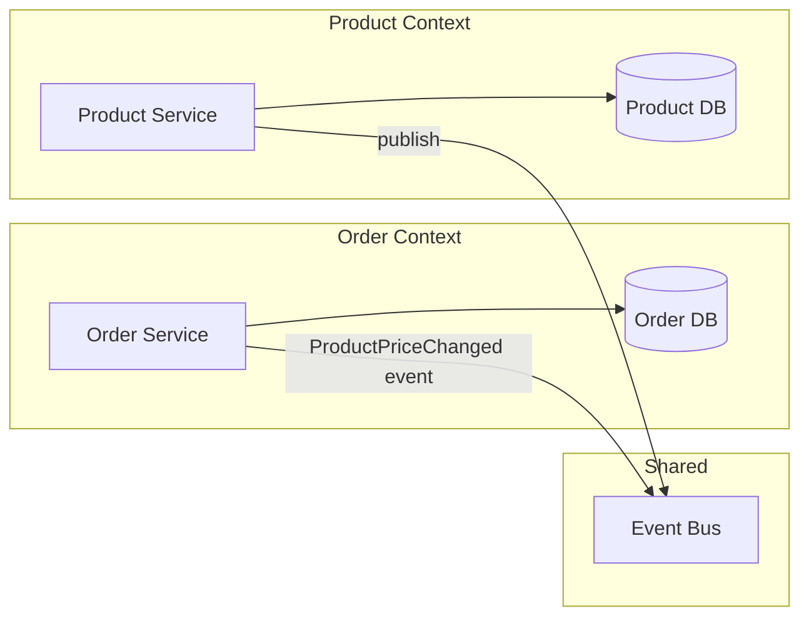

# Java Scenario-Based Interview Questions

> These aren't textbook questions — they're the "tell me about a time..." and "what would you do if..." questions that test real production experience.

---

## Multithreading Scenarios

### Scenario 1: The Deadlocked Payment Service

**Interviewer:** "Two threads are processing payments. Thread A holds lock on Account-1 and needs Account-2. Thread B holds lock on Account-2 and needs Account-1. The service is frozen. How do you detect and prevent this?"

**Answer framework:**

```java
// THE PROBLEM: Lock ordering violation
public void transfer(Account from, Account to, BigDecimal amount) {
    synchronized (from) {         // Thread A locks Account-1
        synchronized (to) {       // Thread A waits for Account-2 (held by B)
            from.debit(amount);
            to.credit(amount);
        }
    }
}
```

**Detection:**

```bash
# Thread dump shows BLOCKED threads waiting on each other
jcmd <pid> Thread.print | grep -A5 "BLOCKED"
```

**Prevention — Lock Ordering:**

```java
public void transfer(Account from, Account to, BigDecimal amount) {
    // Always acquire locks in consistent order (by ID)
    Account first = from.getId() < to.getId() ? from : to;
    Account second = from.getId() < to.getId() ? to : from;
    
    synchronized (first) {
        synchronized (second) {
            from.debit(amount);
            to.credit(amount);
        }
    }
}
```

**Prevention — Timeout-based:**

```java
public void transfer(Account from, Account to, BigDecimal amount) {
    boolean gotBoth = false;
    while (!gotBoth) {
        if (from.getLock().tryLock(100, TimeUnit.MILLISECONDS)) {
            try {
                if (to.getLock().tryLock(100, TimeUnit.MILLISECONDS)) {
                    try {
                        from.debit(amount);
                        to.credit(amount);
                        gotBoth = true;
                    } finally {
                        to.getLock().unlock();
                    }
                }
            } finally {
                from.getLock().unlock();
            }
        }
        if (!gotBoth) Thread.sleep(randomBackoff());
    }
}
```

---

### Scenario 2: The Producer Outpacing Consumer

**Interviewer:** "Your Kafka consumer processes 1000 msg/sec but the producer sends 5000 msg/sec. The queue grows unbounded. What's your strategy?"

**Answer:**

| Strategy | Trade-off |
|----------|-----------|
| Increase consumers (horizontal) | More instances, partition assignment complexity |
| Batch processing | Higher throughput but increased latency per message |
| Backpressure (bounded queue) | Producer blocks/rejects — need DLQ strategy |
| Async processing with CompletableFuture | Decouple IO from processing — careful with ordering |

```java
// Bounded queue with backpressure
BlockingQueue<Event> queue = new ArrayBlockingQueue<>(10_000);

// Producer: blocks when queue is full (natural backpressure)
public void produce(Event event) throws InterruptedException {
    if (!queue.offer(event, 5, TimeUnit.SECONDS)) {
        // Queue full for 5 seconds — send to dead letter queue
        deadLetterQueue.send(event);
        metrics.increment("events.dropped");
    }
}

// Consumer: batch processing for throughput
public void consumeLoop() {
    List<Event> batch = new ArrayList<>(100);
    while (running) {
        queue.drainTo(batch, 100); // grab up to 100 at once
        if (!batch.isEmpty()) {
            processBatch(batch);
            batch.clear();
        } else {
            Thread.sleep(10); // avoid busy spin
        }
    }
}
```

---

### Scenario 3: Thread-Safe Lazy Initialization

**Interviewer:** "You have an expensive resource that should only be created once, accessed by 100 threads. Show me three ways with trade-offs."

```java
// Approach 1: synchronized method (simple but blocks all threads)
public class ServiceRegistry {
    private static ServiceRegistry instance;
    
    public static synchronized ServiceRegistry getInstance() {
        if (instance == null) {
            instance = new ServiceRegistry(); // expensive
        }
        return instance;
    }
    // Downside: every get() call pays synchronization cost
}

// Approach 2: Holder pattern (lazy, lock-free, recommended)
public class ServiceRegistry {
    private static class Holder {
        static final ServiceRegistry INSTANCE = new ServiceRegistry();
    }
    
    public static ServiceRegistry getInstance() {
        return Holder.INSTANCE; // class loaded only on first access
    }
    // Best: no synchronization, guaranteed by JVM classloading
}

// Approach 3: Enum (simplest, serialization-safe)
public enum ServiceRegistry {
    INSTANCE;
    
    // constructor runs once, thread-safe by JVM guarantee
    ServiceRegistry() { /* expensive init */ }
}
```

---

### Scenario 4: Visibility Without Synchronization

**Interviewer:** "Thread A sets `running = false` but Thread B keeps looping. What's happening?"

```java
// BUG: Thread B may never see the update
class Worker implements Runnable {
    private boolean running = true; // NOT volatile
    
    public void run() {
        while (running) { // JIT may hoist this read out of loop
            doWork();
        }
    }
    
    public void stop() {
        running = false; // Thread A writes, but B never sees it
    }
}
```

**Why?** Without `volatile`, the JIT compiler can optimize the loop to read `running` once and cache it in a register. Thread B never re-reads from main memory.

```java
// FIX: volatile ensures visibility across threads
private volatile boolean running = true;
```

**When volatile is NOT enough:**

```java
// volatile doesn't help here — compound operation (read-modify-write)
private volatile int counter = 0;

public void increment() {
    counter++; // NOT atomic! (read → add → write)
}

// Fix: use AtomicInteger
private final AtomicInteger counter = new AtomicInteger(0);
```

---

### Scenario 5: CompletableFuture Composition

**Interviewer:** "You need to call 3 services in parallel, combine results, and handle partial failures. Show me."

```java
public OrderSummary getOrderSummary(String orderId) {
    CompletableFuture<Order> orderFuture = CompletableFuture
        .supplyAsync(() -> orderService.getOrder(orderId));
    
    CompletableFuture<Payment> paymentFuture = CompletableFuture
        .supplyAsync(() -> paymentService.getPayment(orderId));
    
    CompletableFuture<Shipping> shippingFuture = CompletableFuture
        .supplyAsync(() -> shippingService.getStatus(orderId))
        .exceptionally(ex -> Shipping.unknown()); // graceful degradation
    
    return CompletableFuture.allOf(orderFuture, paymentFuture, shippingFuture)
        .thenApply(v -> new OrderSummary(
            orderFuture.join(),
            paymentFuture.join(),
            shippingFuture.join()
        ))
        .orTimeout(3, TimeUnit.SECONDS)
        .exceptionally(ex -> OrderSummary.partial(orderFuture.getNow(null)))
        .join();
}
```

---

## OOP Design Scenarios

### Scenario 6: Why Composition Over Inheritance?

**Interviewer:** "Show me a real example where inheritance breaks and composition fixes it."

```java
// INHERITANCE PROBLEM: Fragile base class
public class InstrumentedHashSet<E> extends HashSet<E> {
    private int addCount = 0;
    
    @Override
    public boolean add(E e) {
        addCount++;
        return super.add(e);
    }
    
    @Override
    public boolean addAll(Collection<? extends E> c) {
        addCount += c.size();
        return super.addAll(c); // BUG: HashSet.addAll() calls add() internally!
    }
    // addAll(3 elements) → addCount = 6 (double counted!)
}
```

```java
// COMPOSITION FIX: Wrapper/Decorator pattern
public class InstrumentedSet<E> implements Set<E> {
    private final Set<E> delegate; // composition — we don't extend
    private int addCount = 0;
    
    public InstrumentedSet(Set<E> delegate) {
        this.delegate = delegate;
    }
    
    public boolean add(E e) {
        addCount++;
        return delegate.add(e); // no internal call loop
    }
    
    public boolean addAll(Collection<? extends E> c) {
        addCount += c.size();
        return delegate.addAll(c); // delegate handles its own logic
    }
    // Correct! addAll(3 elements) → addCount = 3
}
```

**When to use inheritance:**

- IS-A relationship is permanent and unambiguous
- You control both parent and child (same codebase)
- Template Method pattern (abstract class with hook methods)

**When to use composition:**

- HAS-A or USES-A relationship
- You want to combine behaviors from multiple sources
- The parent class might change independently
- You need runtime flexibility (swap implementations)

---

### Scenario 7: Design a Notification System (OOP)

**Interviewer:** "Design a notification system that supports Email, SMS, Push, and Slack. New channels should be easy to add."

```java
// Strategy pattern — open for extension, closed for modification
public interface NotificationChannel {
    void send(User user, Message message);
    boolean supports(NotificationType type);
}

public class EmailChannel implements NotificationChannel {
    private final EmailClient client;
    
    public void send(User user, Message message) {
        client.send(user.getEmail(), message.getSubject(), message.getBody());
    }
    
    public boolean supports(NotificationType type) {
        return type == NotificationType.TRANSACTIONAL 
            || type == NotificationType.MARKETING;
    }
}

public class SlackChannel implements NotificationChannel {
    private final SlackClient client;
    
    public void send(User user, Message message) {
        client.postMessage(user.getSlackId(), message.getBody());
    }
    
    public boolean supports(NotificationType type) {
        return type == NotificationType.ALERT;
    }
}

// Dispatcher — uses composition, new channels auto-discovered via DI
@Service
public class NotificationDispatcher {
    private final List<NotificationChannel> channels;
    
    public NotificationDispatcher(List<NotificationChannel> channels) {
        this.channels = channels; // Spring injects all implementations
    }
    
    public void notify(User user, Message message) {
        channels.stream()
            .filter(ch -> ch.supports(message.getType()))
            .forEach(ch -> ch.send(user, message));
    }
}
```

**Follow-ups:**

- "How do you handle failures?" → Retry with exponential backoff, DLQ for permanent failures
- "How do you add rate limiting?" → Decorator pattern wrapping each channel
- "How do you test this?" → Mock channels, verify correct routing

---

### Scenario 8: Immutability in Domain Objects

**Interviewer:** "Why should domain objects be immutable? Show me a Money class."

```java
public final class Money {
    private final BigDecimal amount;
    private final Currency currency;
    
    public Money(BigDecimal amount, Currency currency) {
        this.amount = amount.setScale(2, RoundingMode.HALF_UP);
        this.currency = Objects.requireNonNull(currency);
    }
    
    public Money add(Money other) {
        if (!this.currency.equals(other.currency)) {
            throw new CurrencyMismatchException(this.currency, other.currency);
        }
        return new Money(this.amount.add(other.amount), this.currency);
    }
    
    public Money multiply(int quantity) {
        return new Money(this.amount.multiply(BigDecimal.valueOf(quantity)), this.currency);
    }
    
    // No setters — thread-safe, can be shared freely, safe as HashMap keys
}
```

**Benefits of immutability:**

| Benefit | Explanation |
|---------|-------------|
| Thread safety | No synchronization needed — immutable objects can't have race conditions |
| Safe HashMap keys | hashCode() never changes after construction |
| Simpler reasoning | No "temporal coupling" — object is always in valid state |
| Safe sharing | Can pass references without defensive copying |
| Cache-friendly | Can be cached without staleness concerns |

---

## SQL Scenario Questions

### Scenario 9: Find and Delete Duplicate Records

**Interviewer:** "A table has duplicate rows. Find them, then delete all but one of each."

```sql
-- Find duplicates
SELECT email, COUNT(*) as cnt
FROM users
GROUP BY email
HAVING COUNT(*) > 1;

-- Delete duplicates (keep lowest ID)
DELETE FROM users
WHERE id NOT IN (
    SELECT MIN(id)
    FROM users
    GROUP BY email
);

-- Alternative with CTE (PostgreSQL, more readable)
WITH duplicates AS (
    SELECT id,
           ROW_NUMBER() OVER (PARTITION BY email ORDER BY id) as rn
    FROM users
)
DELETE FROM users
WHERE id IN (SELECT id FROM duplicates WHERE rn > 1);
```

---

### Scenario 10: Recursive CTE — Org Chart

**Interviewer:** "Given an employees table with manager_id, find all reports (direct and indirect) for a given manager."

```sql
WITH RECURSIVE org_tree AS (
    -- Base case: direct reports
    SELECT id, name, manager_id, 1 as depth
    FROM employees
    WHERE manager_id = 'CEO_ID'
    
    UNION ALL
    
    -- Recursive case: reports of reports
    SELECT e.id, e.name, e.manager_id, ot.depth + 1
    FROM employees e
    INNER JOIN org_tree ot ON e.manager_id = ot.id
    WHERE ot.depth < 10 -- safety limit
)
SELECT * FROM org_tree ORDER BY depth, name;
```

---

### Scenario 11: Change Data Capture (CDC)

**Interviewer:** "How would you track changes to a table over time for auditing?"

```sql
-- Approach 1: Trigger-based CDC
CREATE TABLE order_audit (
    audit_id BIGSERIAL PRIMARY KEY,
    order_id BIGINT,
    operation VARCHAR(10), -- INSERT, UPDATE, DELETE
    old_values JSONB,
    new_values JSONB,
    changed_at TIMESTAMP DEFAULT NOW(),
    changed_by VARCHAR(100)
);

CREATE FUNCTION audit_orders() RETURNS TRIGGER AS $$
BEGIN
    INSERT INTO order_audit (order_id, operation, old_values, new_values, changed_by)
    VALUES (
        COALESCE(NEW.id, OLD.id),
        TG_OP,
        CASE WHEN TG_OP != 'INSERT' THEN row_to_json(OLD)::jsonb END,
        CASE WHEN TG_OP != 'DELETE' THEN row_to_json(NEW)::jsonb END,
        current_user
    );
    RETURN COALESCE(NEW, OLD);
END;
$$ LANGUAGE plpgsql;

CREATE TRIGGER orders_audit_trigger
AFTER INSERT OR UPDATE OR DELETE ON orders
FOR EACH ROW EXECUTE FUNCTION audit_orders();
```

---

### Scenario 12: SQL Query Optimization

**Interviewer:** "This query takes 30 seconds. Optimize it."

```sql
-- SLOW: full table scan, filesort
SELECT u.name, COUNT(o.id) as order_count, SUM(o.total) as total_spent
FROM users u
LEFT JOIN orders o ON u.id = o.user_id
WHERE o.created_at > '2025-01-01'
AND u.status = 'active'
GROUP BY u.name
ORDER BY total_spent DESC
LIMIT 100;
```

**Optimization steps:**

```sql
-- 1. Add composite index for the WHERE + JOIN
CREATE INDEX idx_orders_user_date ON orders(user_id, created_at);
CREATE INDEX idx_users_status ON users(status);

-- 2. Rewrite to avoid scanning inactive users
SELECT u.name, COUNT(o.id) as order_count, SUM(o.total) as total_spent
FROM users u
INNER JOIN orders o ON u.id = o.user_id  -- Changed LEFT to INNER (WHERE already filters nulls)
WHERE u.status = 'active'
AND o.created_at > '2025-01-01'
GROUP BY u.id, u.name  -- Include PK for faster grouping
ORDER BY total_spent DESC
LIMIT 100;

-- 3. Check EXPLAIN plan
EXPLAIN ANALYZE SELECT ...;
```

| Optimization | Impact |
|-------------|--------|
| LEFT → INNER JOIN | Eliminates null rows already filtered by WHERE |
| Composite index on orders | Index-only scan for date range per user |
| Index on users.status | Skip inactive users immediately |
| GROUP BY includes PK | Avoids hash aggregate in some engines |

---

## Domain-Driven Design (DDD) Scenarios

### Scenario 13: Bounded Contexts

**Interviewer:** "In an e-commerce system, should Order and Product share the same database?"

**Answer:**



**Why separate:**

| Shared DB (Monolith) | Separate DBs (Bounded Contexts) |
|----------------------|----------------------------------|
| Tight coupling — schema change breaks both | Independent evolution |
| Single point of failure | Fault isolation |
| Simpler queries (JOINs) | Need eventual consistency |
| One team can own | Different teams, different deploy cadences |

**Key DDD terms for interviews:**

| Term | Definition | Example |
|------|-----------|---------|
| Entity | Has identity, changes over time | Order (has orderId) |
| Value Object | Defined by attributes, immutable | Money(100, USD) |
| Aggregate | Consistency boundary, one root entity | Order + OrderItems |
| Repository | Persistence abstraction | OrderRepository |
| Domain Event | Something that happened | OrderPlaced, PaymentReceived |
| Bounded Context | Linguistic boundary, own model | "Product" means different things in Catalog vs Shipping |

---

## Web Services: REST vs SOAP

### Scenario 14: When to Use SOAP vs REST

**Interviewer:** "Your team is integrating with a bank's API. They offer both SOAP and REST. Which do you choose and why?"

| Factor | REST | SOAP |
|--------|------|------|
| Transport | HTTP only | HTTP, SMTP, JMS, etc. |
| Format | JSON (lightweight) | XML only (verbose) |
| Contract | OpenAPI/Swagger (optional) | WSDL (mandatory, strict) |
| Security | HTTPS + OAuth2 + JWT | WS-Security (message-level encryption) |
| Transactions | No built-in standard | WS-AtomicTransaction |
| Reliability | Idempotent design (manual) | WS-ReliableMessaging |
| State | Stateless | Can be stateful |
| Performance | Faster (smaller payload) | Slower (XML parsing overhead) |

**Choose SOAP when:**

- Enterprise integration requiring WS-Security (message-level encryption)
- Distributed transactions across multiple services
- Strict contract enforcement (WSDL guarantees compatibility)
- Legacy system integration (banking, insurance, government)

**Choose REST when:**

- Public APIs (simple, widely understood)
- Mobile/web clients (JSON is native)
- Microservices (lightweight, fast)
- CRUD-dominant operations
- When you control both ends

---

## Frequently Asked Questions

??? question "What are the most common scenario-based Java interview questions?"

    The most frequently asked scenarios cover: deadlock detection and prevention, producer-consumer with backpressure, thread-safe singleton patterns, CompletableFuture composition for parallel API calls, and memory visibility issues with volatile. Senior interviews add: designing notification systems with Strategy pattern, immutable domain objects, and SQL optimization with EXPLAIN analysis.

??? question "How do you answer scenario questions in Java interviews?"

    Use the STAR-T framework: **S**ituation (set context), **T**ask (what needed solving), **A**ction (your specific contribution), **R**esult (measurable outcome), **T**rade-offs (what alternatives you considered). Always mention monitoring, testing, and what could go wrong — this signals production maturity.

??? question "What is Domain-Driven Design and why do interviewers ask about it?"

    DDD is an approach to software design that models complex business domains using Entities, Value Objects, Aggregates, and Bounded Contexts. Interviewers ask about it because it demonstrates ability to decompose large systems into maintainable boundaries — critical for microservices architecture at scale.
