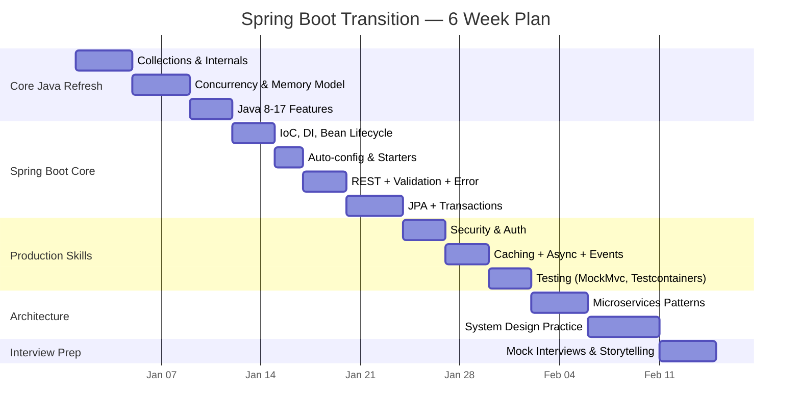

# Switching to Spring Boot — Interview Guide for Experienced Devs

> You have 8-15 years of real engineering experience. You've built production systems, led teams, solved hard problems. The gap isn't ability — it's vocabulary. This guide helps you translate what you already know into what Spring Boot interviewers expect to hear.

---

## Who This Is For

- Senior engineers moving from proprietary stacks (Salesforce, SAP, Oracle) to open-source Java/Spring Boot
- Developers in consulting (TCS, Infosys, Wipro, Capgemini) targeting product companies
- Engineers with TypeScript/Node.js or .NET experience adding Java/Spring Boot
- Anyone with 8+ years who needs to demonstrate **depth** in Spring internals, not just usage

---

## The Mindset Shift

| Consulting/Proprietary World | Open-Source/Product World |
|---|---|
| "I configured X" | "I chose X because of tradeoff Y" |
| "We used the vendor tool" | "I built it / I evaluated alternatives" |
| "Requirements were given" | "I proposed the design" |
| "It worked" | "Here's how I measured and improved it" |

**Key insight:** Interviewers at product companies care about *why* over *what*. Every answer should include the tradeoff you considered.

---

## What Interviewers Actually Test (By Round)

### Round 1: Core Java Screen (45 min)

They're checking if you *understand* Java or just *use* it. This is where most experienced devs trip — they've been productive for years without ever thinking about internals.

**Must-know topics (non-negotiable):**

| Topic | Depth Expected | Study Link |
|---|---|---|
| Collections internals | How HashMap handles collisions, rehashing, treeification | [HashMap Internals](../java/HashMapInternals.md) |
| Concurrency | Thread pools, CompletableFuture, happens-before, volatile vs atomic | [Multithreading](../java/MultiThreading.md) · [Executors](../java/Executors.md) |
| Memory model | Heap vs stack, GC roots, G1 vs ZGC, when objects are eligible for GC | [Garbage Collection](../java/GarbageCollection.md) |
| Java 8-17 features | Streams, Optional, records, sealed classes, pattern matching | [Java 8](../java/Java8.md) · [Java 17](../java/Java17.md) |
| Generics & type erasure | PECS, wildcards, why you can't do `new T()` | [Generics](../java/Generics.md) |

**How to answer at senior level:**

!!! tip "Example: HashMap question"
    **Junior answer:** "HashMap stores key-value pairs using hashing."

    **Senior answer:** "HashMap uses an array of Node buckets. Keys are placed using `hash(key) & (n-1)`. On collision, it chains via linked list, but once a bucket exceeds 8 entries *and* capacity ≥ 64, it treeifies to a red-black tree — bringing worst-case lookup from O(n) to O(log n). Load factor 0.75 triggers resize at 75% capacity, which is a full rehash. In concurrent scenarios, I'd use ConcurrentHashMap which uses CAS + synchronized on individual bins rather than segment locks since Java 8."

---

### Round 2: Spring Boot Deep Dive (60 min)

This is where your transition shows. They want to know you understand the *framework machinery*, not just annotation placement.

**Priority topics (study in this order):**

| Priority | Topic | Why It Matters | Study Link |
|---|---|---|---|
| 1 | IoC & DI fundamentals | Foundation of everything Spring | [IoC & DI](../springboot/SpringIOC.md) |
| 2 | Bean lifecycle & scopes | Shows you understand the container | [Bean Lifecycle](../springboot/bean-lifecycle.md) |
| 3 | Auto-configuration | How Spring Boot "magically" works | [Auto Configuration](../springboot/AutoConfiguration.md) |
| 4 | Spring Data JPA + N+1 | Every backend hits this | [Spring Data JPA](../springboot/spring-data-jpa.md) · [N+1 Problem](../springboot/n-plus-one-jpa.md) |
| 5 | Transaction management | @Transactional pitfalls are a top question | [Transactions](../springboot/transactions.md) |
| 6 | Security filter chain | Auth is always asked | [Security](../springboot/security.md) · [Filter Chain](../springboot/security-filter-chain.md) |
| 7 | Exception handling | Production readiness signal | [Exception Handling](../springboot/exceptionhandling.md) |
| 8 | Profiles & configuration | Environment management | [Profiles](../springboot/profiles.md) |

**Common trap questions for experienced devs:**

- "What happens if you call a `@Transactional` method from within the same class?" → Proxy bypass — no transaction.
- "How does Spring resolve circular dependencies?" → [Circular Dependencies](../springboot/circular-dependencies.md)
- "Difference between `@Component`, `@Service`, `@Repository`?" → Semantically different, functionally identical (except `@Repository` adds persistence exception translation).
- "How does `@Async` actually work?" → [Async & Scheduling](../springboot/async.md)

---

### Round 3: System Design / Architecture (60 min)

**This is where your experience is your advantage.** You've seen production systems. Lean into it.

| Topic | Your Edge | Study Link |
|---|---|---|
| Microservices patterns | You've lived monolith → microservice pain | [Design Principles](../microservices/design-principles.md) |
| Circuit breakers & resilience | You've debugged cascading failures | [Circuit Breaker](../microservices/CircuitBreaker.md) |
| Event-driven architecture | You've dealt with data consistency | [Event-Driven](../microservices/event-driven.md) |
| Database sharding & scaling | You've hit performance walls | [Database Sharding](../systemdesign/database-sharding.md) |
| Caching strategies | You've optimized hot paths | [Distributed Caching](../distributedCaching.md) |

---

## 6-Week Transition Plan

For someone with 10+ years who can dedicate 2 hours/day:

---

## Week-by-Week Breakdown

### Week 1-2: Core Java (Fill Gaps, Don't Start From Zero)

You already know OOP. Focus on **internals and "why"** questions:

- [ ] Explain HashMap internal structure without looking at notes
- [ ] Write a thread-safe singleton 3 different ways
- [ ] Explain what happens during a `ConcurrentHashMap.put()` in Java 17
- [ ] Describe how G1 GC decides which regions to collect
- [ ] Use CompletableFuture to compose 3 async API calls with error handling

**Resources:** [Java Interview Guide](../java/java-interview-guide.md) — focus on L2/L3 depth questions

### Week 3-4: Spring Boot (Build Something Real)

Don't just read — build a small REST service with:

- [ ] Custom auto-configuration with conditional beans
- [ ] JPA with 1:N relationship, pagination, and custom queries
- [ ] @Transactional with propagation levels (test the self-invocation trap)
- [ ] Global exception handler returning RFC 7807 problem details
- [ ] Spring Security with JWT + role-based access
- [ ] Integration tests using @SpringBootTest + Testcontainers

**Resources:** [Spring Boot Interview Guide](../springboot/spring-boot-interview-guide.md)

### Week 5: Microservices & Architecture

- [ ] Design a service that uses Circuit Breaker (Resilience4j)
- [ ] Implement async communication with Kafka or RabbitMQ
- [ ] Draw and explain a system design for one of: [URL Shortener](../systemdesign/case-studies/url-shortener.md), [Chat System](../systemdesign/case-studies/chat-system.md), or [Notification System](../systemdesign/case-studies/notification-system.md)

### Week 6: Interview Practice

- [ ] Practice explaining your past projects using the STAR format but with technical depth
- [ ] Do 3 mock system design interviews (45 min each)
- [ ] Practice answering "why Spring Boot over X?" with real tradeoffs

---

## How to Reframe Your Experience

Your consulting/proprietary experience is **valuable** — you just need to translate it:

| What You Did | How to Present It |
|---|---|
| "Configured Salesforce flows" | "Designed event-driven workflows with retry semantics and dead-letter handling" |
| "Built integration between systems" | "Built REST/async APIs handling 500 RPS with circuit breaker patterns" |
| "Managed database performance" | "Optimized query plans, implemented read replicas, designed sharding strategy" |
| "Led a team of 5" | "Made architectural decisions — chose eventual consistency over distributed transactions because..." |
| "Worked with vendor tools" | "Evaluated build-vs-buy tradeoffs, chose X because of Y constraint" |

---

## Red Flags to Avoid in Interviews

!!! danger "Things that signal 'I haven't made the transition yet'"
    - Saying "I used annotations" without explaining what they do under the hood
    - Not knowing what a Spring proxy is or how AOP works
    - Answering "we used Kafka" without explaining consumer groups, partitions, or offset management
    - No opinion on REST vs gRPC vs async messaging tradeoffs
    - Describing architecture without mentioning failure modes

---

## Quick Reference: Top 20 Questions They Will Ask

1. How does Spring's IoC container work internally?
2. What's the difference between `@Autowired` constructor vs field injection? Why prefer constructor?
3. Explain the Spring bean lifecycle (instantiation → initialization → destruction)
4. What happens when you put `@Transactional` on a private method?
5. How does Spring Boot auto-configuration work? What's `spring.factories` / `AutoConfiguration.imports`?
6. Explain the N+1 problem. How do you detect and fix it?
7. How does `@Async` work? What are the pitfalls?
8. Describe Spring Security's filter chain. How is a request authenticated?
9. What's the difference between optimistic and pessimistic locking in JPA?
10. How would you handle distributed transactions across microservices?
11. Explain circuit breaker pattern. When would you NOT use it?
12. How does ConcurrentHashMap work in Java 17?
13. What's the Java Memory Model? What does "happens-before" mean?
14. CompletableFuture vs Virtual Threads — when to use which?
15. How do you test a Spring Boot application? Unit vs integration vs slice tests?
16. Explain eventual consistency. How do you handle it in practice?
17. How would you design a rate limiter?
18. What's the difference between Saga and 2PC? When to use each?
19. How do you handle API versioning in a running production system?
20. Explain back-pressure in reactive streams. When is WebFlux appropriate?

**For each question:** Practice answering in under 2 minutes, always including one tradeoff or "it depends" qualifier with the condition.

---

## Next Steps

- [Core Java Interview Guide](../java/java-interview-guide.md) — Deep-dive questions with L1/L2/L3 difficulty
- [Spring Boot Interview Guide](../springboot/spring-boot-interview-guide.md) — Framework-specific depth
- [System Design Interview Guide](../systemdesign/system-design-interview-guide.md) — Architecture problems
- [Career Strategy](career-strategy.md) — Positioning and negotiation
