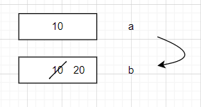
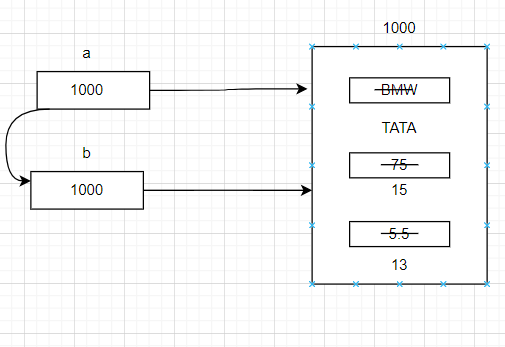

## public static void main(String[] args)

  public - to call by jvm from anywhere
  static - without existing object also JVM has to call this method and main method has no way related to any object.
  void   - main() method won't return anything to JVM.
  main   - this is the name which is configured in JVM.
  String[] args- command line arguments

## System.out.println()
 
  example: 
             
         class Test
        {
         static String s = "java";
         }
         Test.s.length(); 
     
here 
* Test is a class name , 
* s is static variable present in test class of type String 
* length is a method present in String class.

         class System
          {
           static PrintStream out;
           }
           System.out.println("Hello");

*  System ----- it is a class
*  out    ----- static member present in System class of type PrintStream
*  println ---- method present in PrintStream class.

## var-arg methods / variable length arguments (variable number of argument methods)
* It is introduced in 1.5v.
* sum(10,20)      
    
      public static void sum(int a, int b){
       }
 
* sum(10,20,30)

      public static void sum(int a, int b,int c){
       }

* sum(int... a)

* m1(int[] a)  == m1(int... a)
* main(String[] args) == main(String... args)

int i = 9;
int i = 09;

In Java, the difference between int i = 9; and int i = 09; lies in the way the numbers are interpreted.

int i = 9;: This assigns the decimal value 9 to the variable i. The number 9 is represented in the decimal number system.

int i = 09;: This is not a valid integer initialization in Java. In Java, if a numeric literal starts with a leading zero (0), it is interpreted as an octal (base 8) number. However, octal numbers can only include digits from 0 to 7. Since 9 is not a valid octal digit, the code int i = 09; will result in a compilation error.

## Is Java Pass by Value or Pass by reference ??

**Pass by value**

    int a = 10;
    int b;
    b = a;
    System.out.println(a); -- 10;
    System.out.println(b); -- 10;
    b = 20;
    System.out.println(b) -- 20;
    System.out.println(a) -- 10;

**Pass by Reference**
   
   

* Here we are passing the memory address and the object which we are changing will be reflecting in the initial object.
* So, by default all the object references when passed into a particular method will look like pass by reference but it's actually memory address.
* **In Java, it is pass by value.**

## ReHashing

**why we can't use primitive as key in hashmap**

* n Java, primitive types such as int, char, boolean, etc., cannot be used directly as keys in a HashMap or any other Map implementation. This is because HashMap requires keys to be objects, and primitive types are not objects in Java.

* To work around this limitation, Java provides wrapper classes for primitive types, such as Integer for int, Character for char, Boolean for boolean, and so on. These wrapper classes allow primitive values to be treated as objects and can be used as keys in HashMap or other Map implementations.

* The reason for this restriction is that HashMap uses the hashCode() and equals() methods of the key objects to determine the bucket location and handle key collisions. These methods are defined in the Object class, which is the base class for all classes in Java, including the wrapper classes.

* By using wrapper classes as keys, you can take advantage of the hashCode() and equals() implementations provided by the wrapper classes. These implementations are specifically designed to work correctly with HashMap and other collections.

* Additionally, using wrapper classes allows for null values as keys since objects can be assigned a null reference, whereas primitive types cannot. This provides flexibility in handling scenarios where a key may or may not be present.

* In summary, the use of wrapper classes for primitive types enables them to be used as keys in HashMap by providing the necessary object-oriented capabilities required by the underlying implementation.

**I have stringbuilder as key in hashmap ,  in first case  hashmap.put(str); in 2nd case hashmap.put(str.append("kumar") , what will happen**

* When using StringBuilder as a key in a HashMap, the behavior will depend on whether you modify the StringBuilder after adding it to the HashMap. Let's consider the two cases you mentioned: hashmap.put(str);

* In this case, the StringBuilder object referenced by str is added as a key to the HashMap. The StringBuilder object itself is not modified after adding it to the HashMap. The HashMap will use the initial state of the StringBuilder object (the characters present at the time of adding) to calculate the hash code and determine the bucket location for storing the value associated with the key. hashmap.put(str.append("kumar"));

* In this case, you are modifying the StringBuilder object by appending the string "kumar" before adding it to the HashMap. The StringBuilder object is modified, and its internal state changes after appending the string. The HashMap will calculate the hash code based on the updated state of the StringBuilder, taking into account the appended characters. This means that the hash code and bucket location for the key will be different from the first case. If you try to retrieve the value associated with the key later, you need to provide the StringBuilder object with the same state as it was when it was added to the HashMap.

* It's important to note that using mutable objects like StringBuilder as keys in a HashMap can lead to unexpected behavior and should generally be avoided. Modifying the key after adding it to the HashMap can cause difficulties in retrieving the associated values because the hash code and bucket location may change. It is recommended to use immutable objects or wrapper classes (like String) as keys in HashMap to ensure consistent and predictable behavior.

* Since the content of the StringBuilder object has changed between the two put operations, the hashmap.get(str); call may not be able to retrieve the value associated with the key. The hash code and bucket location used for key lookup will be calculated based on the current state of the StringBuilder object, which may not match the state when it was added to the HashMap.

* Therefore, the output of hashmap.get(str); in this case may be null

