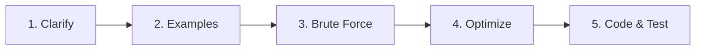

# Interview Preparation Strategy

A structured approach to cracking FAANG and top-tier tech interviews. This guide covers the meta-strategy — what to study, how to practice, and how to perform on the day.

---

## Interview Rounds Overview

| Round | Duration | What They Assess | How to Prepare |
|---|---|---|---|
| **Online Assessment** | 60-90 min | DSA problem solving, speed | LeetCode timed contests |
| **Phone Screen** | 45-60 min | Coding + communication | Practice thinking aloud |
| **DSA Round (x2)** | 45 min each | Problem solving, optimization | Pattern recognition, 200+ problems |
| **System Design** | 45-60 min | Architecture, trade-offs | Design 15-20 systems end-to-end |
| **Low-Level Design** | 45-60 min | OOP, SOLID, patterns | Practice 10-15 LLD problems |
| **Behavioral** | 30-45 min | Leadership, conflict, impact | STAR format, 8-10 stories ready |
| **Hiring Manager** | 30-45 min | Culture fit, career goals | Research the team and product |

---

## DSA Preparation Roadmap

### Phase 1: Foundation (Weeks 1-3)

!!! abstract "Goal: Build pattern recognition for core data structures"

| Topic | Key Problems | Target |
|---|---|---|
| Arrays & Hashing | Two Sum, Group Anagrams, Top K Frequent | 15 problems |
| Two Pointers | 3Sum, Container With Most Water, Trapping Rain Water | 10 problems |
| Sliding Window | Longest Substring Without Repeating, Minimum Window Substring | 8 problems |
| Stack | Valid Parentheses, Daily Temperatures, Largest Rectangle in Histogram | 8 problems |
| Binary Search | Search Rotated Array, Find Minimum, Koko Eating Bananas | 10 problems |

### Phase 2: Core Patterns (Weeks 4-7)

!!! abstract "Goal: Master recursive thinking and graph traversal"

| Topic | Key Problems | Target |
|---|---|---|
| Linked Lists | Reverse, Merge K Sorted, LRU Cache | 10 problems |
| Trees | Validate BST, Level Order, Serialize/Deserialize | 15 problems |
| Tries | Word Search II, Design Autocomplete | 5 problems |
| Backtracking | N-Queens, Combination Sum, Palindrome Partitioning | 10 problems |
| Graphs | Number of Islands, Course Schedule, Alien Dictionary | 12 problems |
| Heaps | Merge K Sorted Lists, Find Median, Task Scheduler | 8 problems |

### Phase 3: Advanced (Weeks 8-10)

!!! abstract "Goal: Handle dynamic programming and complex graph algorithms"

| Topic | Key Problems | Target |
|---|---|---|
| Dynamic Programming | Longest Increasing Subsequence, Edit Distance, Burst Balloons | 20 problems |
| Greedy | Jump Game, Merge Intervals, Non-overlapping Intervals | 8 problems |
| Advanced Graphs | Dijkstra, Bellman-Ford, MST, Network Delay Time | 8 problems |
| Union Find | Redundant Connection, Accounts Merge | 5 problems |
| Intervals | Insert Interval, Meeting Rooms II, Minimum Platforms | 6 problems |
| Bit Manipulation | Single Number, Counting Bits, Reverse Bits | 5 problems |

### Phase 4: Mock & Refinement (Weeks 11-12)

- Timed mock interviews (3 per week)
- Contest participation (LeetCode Weekly/Biweekly)
- Revisit weak patterns
- Focus on communication and explaining approach

---

## Problem Solving Framework

### The 5-Step Method

```mermaid
flowchart LR
    A["1. Clarify"] --> B["2. Examples"]
    B --> C["3. Brute Force"]
    C --> D["4. Optimize"]
    D --> E["5. Code & Test"]
```

**Step 1 — Clarify** (2-3 minutes)

- Input constraints (size, range, type)
- Edge cases (empty, single element, duplicates)
- Expected output format
- Can I modify the input?

**Step 2 — Examples** (1-2 minutes)

- Work through 1-2 examples by hand
- Include an edge case example
- Confirm understanding with the interviewer

**Step 3 — Brute Force** (1-2 minutes)

- State the obvious solution and its complexity
- Shows you can always produce a working solution
- Sets a baseline to optimize from

**Step 4 — Optimize** (3-5 minutes)

- Identify the bottleneck (repeated work, unnecessary scans)
- Apply relevant pattern (hash map, two pointers, binary search)
- State the improved time/space complexity
- Get interviewer buy-in before coding

**Step 5 — Code & Test** (20-25 minutes)

- Write clean, readable code with meaningful names
- Talk through your logic as you write
- Dry-run with an example
- Check edge cases

---

## Pattern Recognition Cheat Sheet

!!! tip "The fastest path to solving unknown problems is recognizing which pattern applies"

| Signal in Problem Statement | Pattern to Apply |
|---|---|
| "Find pair/triplet that satisfies condition" | Two Pointers or HashMap |
| "Contiguous subarray with property X" | Sliding Window |
| "Sorted array/search space" | Binary Search |
| "All permutations/combinations/subsets" | Backtracking |
| "Connected components / shortest path" | BFS/DFS / Dijkstra |
| "Optimal substructure + overlapping subproblems" | Dynamic Programming |
| "Min/Max of something at each step" | Greedy or Heap |
| "Nested structure / matching brackets" | Stack |
| "Top K / Kth largest" | Heap (min-heap of size K) |
| "Prefix lookup / autocomplete" | Trie |
| "Range queries / interval merging" | Sort + Sweep Line |
| "Detect cycle / connected sets" | Union Find |
| "Stream of data / running median" | Two Heaps |
| "Matrix traversal" | BFS/DFS with visited set |

---

## System Design Preparation

### Topics to Master

| Category | Topics |
|---|---|
| **Fundamentals** | Load Balancing, Caching, CDN, DNS, CAP Theorem |
| **Storage** | SQL vs NoSQL, Sharding, Replication, Consistent Hashing |
| **Communication** | REST, gRPC, WebSockets, Message Queues, Pub/Sub |
| **Scaling** | Horizontal vs Vertical, Database Partitioning, Read Replicas |
| **Reliability** | Redundancy, Failover, Circuit Breakers, Rate Limiting |
| **Data** | Data Modeling, Indexing, CQRS, Event Sourcing |

### Systems to Practice

| Difficulty | Systems |
|---|---|
| **Standard** | URL Shortener, Paste Bin, Rate Limiter, Key-Value Store |
| **Intermediate** | Twitter Feed, Instagram, Notification System, Chat App |
| **Advanced** | YouTube, Google Maps, Distributed Search, Payment System |
| **Expert** | Google Docs (CRDT), Stock Exchange, Ad Serving, Uber |

### System Design Framework (30-minute structure)

| Phase | Time | What to Do |
|---|---|---|
| Requirements | 5 min | Functional + non-functional, scale estimates |
| High-Level Design | 5 min | Core components, data flow diagram |
| API Design | 3 min | Key endpoints, request/response |
| Data Model | 5 min | Schema, access patterns, storage choice |
| Deep Dive | 10 min | Scale bottlenecks, trade-offs, failure modes |
| Wrap-up | 2 min | Monitoring, future improvements |

---

## Low-Level Design (LLD) Preparation

### Key Principles

- **SOLID Principles** — Single Responsibility, Open/Closed, Liskov Substitution, Interface Segregation, Dependency Inversion
- **Design Patterns** — Factory, Strategy, Observer, Decorator, Builder (most common in interviews)
- **Clean Code** — Meaningful names, small methods, DRY, encapsulation

### LLD Problems to Practice

| Problem | Key Patterns Used |
|---|---|
| Parking Lot | Strategy, Factory, Observer |
| Elevator System | State, Strategy, Observer |
| LRU Cache | HashMap + Doubly Linked List |
| Chess / Tic-Tac-Toe | State, Command, Strategy |
| Hotel Booking | Builder, Observer, Strategy |
| File System | Composite, Iterator |
| Notification Service | Observer, Factory, Strategy |
| Vending Machine | State, Strategy |
| Splitwise (Expense Sharing) | Observer, Strategy |
| Library Management | Factory, Observer, Strategy |

---

## Behavioral Interview Preparation

### STAR Framework

| Component | What to Cover | Example Prompt |
|---|---|---|
| **Situation** | Context, team, constraints | "On my team of 5, we were behind on a critical release..." |
| **Task** | Your specific responsibility | "I was responsible for the payment integration..." |
| **Action** | What YOU did (not the team) | "I proposed breaking it into 3 phases and took ownership of..." |
| **Result** | Quantified impact | "Delivered 2 weeks early, reduced latency by 40%..." |

### Stories to Prepare (8-10 unique stories covering all themes)

| Theme | Typical Questions |
|---|---|
| **Leadership** | Tell me about a time you led without authority |
| **Conflict** | Describe a disagreement with a teammate |
| **Failure** | Tell me about a time you failed |
| **Ambiguity** | How did you handle unclear requirements? |
| **Tight Deadline** | Describe delivering under pressure |
| **Innovation** | When did you simplify a complex system? |
| **Mentorship** | How have you helped others grow? |
| **Customer Impact** | When did you prioritize the customer? |

---

## Complexity Analysis Quick Reference

### Time Complexity Ranking (best to worst)

| Complexity | Name | Example |
|---|---|---|
| O(1) | Constant | HashMap lookup |
| O(log n) | Logarithmic | Binary search |
| O(n) | Linear | Array traversal |
| O(n log n) | Linearithmic | Merge sort, heap sort |
| O(n^2) | Quadratic | Nested loops (bubble sort) |
| O(2^n) | Exponential | Subsets generation |
| O(n!) | Factorial | Permutations |

### Space Complexity Common Cases

| Pattern | Space Used |
|---|---|
| HashMap/HashSet of input | O(n) |
| Recursion depth | O(depth) — usually O(log n) or O(n) |
| Matrix (m x n) | O(m * n) |
| BFS queue | O(width of tree/graph level) |
| DFS stack | O(height of tree/depth of graph) |
| DP table | O(n) or O(n * m) depending on states |

---

## Week-by-Week Study Plan (12 Weeks)

| Week | Focus Area | Daily Target |
|---|---|---|
| 1 | Arrays, Strings, Hashing | 3 problems/day |
| 2 | Two Pointers, Sliding Window | 3 problems/day |
| 3 | Binary Search, Stack, Queue | 3 problems/day |
| 4 | Linked Lists, Trees (DFS) | 2-3 problems/day |
| 5 | Trees (BFS), BST | 2-3 problems/day |
| 6 | Graphs (BFS, DFS, Topological Sort) | 2 problems/day |
| 7 | Backtracking, Heaps | 2 problems/day |
| 8-9 | Dynamic Programming | 2 problems/day |
| 10 | Greedy, Intervals, Union Find | 2 problems/day |
| 11 | System Design (2 systems/week) + LLD | 1 system + 1 LLD/day |
| 12 | Mock interviews + weak areas | 1 mock/day |

---

## Day-of-Interview Checklist

!!! warning "Before the Interview"
    - Test your IDE/editor setup (for virtual interviews)
    - Have pen and paper ready for diagrams
    - Review your prepared behavioral stories
    - Warm up with 1-2 easy problems (10-15 min)
    - Confirm time zone and meeting link

!!! info "During the Interview"
    - Clarify before coding — never assume
    - Think aloud — silence makes interviewers nervous
    - Start with brute force, then optimize
    - Write clean code with meaningful variable names
    - Test your solution with examples before saying "done"
    - Ask "Does this look good?" to invite feedback

!!! success "After Each Round"
    - Thank the interviewer
    - Note down the problems asked (for later review)
    - Don't dwell on mistakes — focus on the next round

---

## Common Mistakes to Avoid

| Mistake | Why It Hurts | Fix |
|---|---|---|
| Jumping straight to code | Misses edge cases, shows no planning | Always clarify and state approach first |
| Silent coding | Interviewer can't assess your thinking | Narrate decisions as you code |
| Ignoring hints | Appears stubborn or not coachable | Treat hints as collaboration |
| Over-engineering | Wastes time, adds unnecessary complexity | Solve the exact problem asked |
| Not testing | Leaves bugs undiscovered | Dry-run with at least 2 test cases |
| Memorizing solutions | Falls apart with slight variations | Focus on understanding patterns |
| Skipping behavioral prep | "I'll wing it" leads to rambling | Prepare 8-10 structured stories |
| Only doing easy problems | False confidence, no growth | Push to medium/hard consistently |

---

??? question "How many problems should I solve before interviewing at FAANG?"
    **Quality over quantity.** Aim for 150-200 well-understood problems covering all major patterns. Someone who deeply understands 150 problems and can recognize patterns will outperform someone who rushed through 500. Each problem should be: (1) solved independently, (2) optimized, (3) reviewed for alternative approaches, (4) categorized by pattern.

??? question "How long should I prepare for a FAANG interview?"
    **3-6 months** for most engineers with some DSA background. Breakdown: 8-10 weeks for DSA (2-3 hours/day), 2-3 weeks for System Design, 1 week for behavioral. If starting from zero DSA knowledge, add 4 more weeks for foundations. Consistency matters more than duration — daily practice beats weekend cramming.

??? question "Should I use Java or Python for coding interviews?"
    **Use whatever you're fastest and most comfortable with.** Java advantages: type safety catches bugs, strong collections API, enterprise companies prefer it. Python advantages: concise syntax saves time, less boilerplate, better for quick prototyping. Most FAANG companies don't care — they evaluate problem-solving, not language choice.

??? question "What if I get stuck during the interview?"
    (1) Re-read the problem constraints — they often hint at the approach. (2) Try a smaller example by hand. (3) Think about which data structure would help. (4) Ask a clarifying question — interviewers expect this. (5) State your partial thinking: "I'm considering X approach because..." — this shows your problem-solving process even if you haven't found the full solution.
