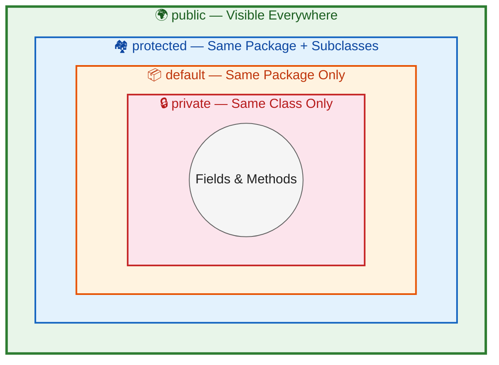
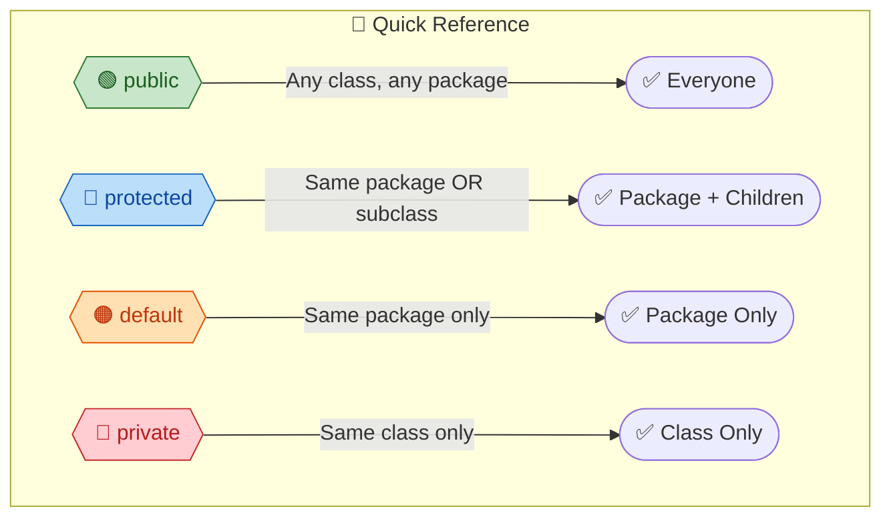
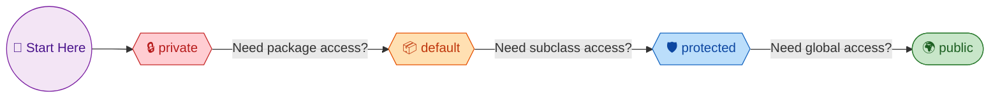

# Access Modifiers in Java

Access modifiers control **who can see and use** your classes, methods, and variables. Getting this wrong leads to broken encapsulation, security issues, and tightly coupled code.

---

## The Four Access Levels





---

## Visibility Table

| Modifier | Same class | Same package | Subclass (different package) | Any class |
|---|---|---|---|---|
| `private` | Yes | No | No | No |
| default (no keyword) | Yes | Yes | No | No |
| `protected` | Yes | Yes | Yes | No |
| `public` | Yes | Yes | Yes | Yes |

---

## Each Modifier in Detail

### `private` — Class-level encapsulation

Only accessible within the **same class**. This is the default you should start with for all fields.

```java
public class BankAccount {
    private double balance;  // no one outside can touch this directly

    public void deposit(double amount) {
        if (amount <= 0) throw new IllegalArgumentException("Amount must be positive");
        this.balance += amount;
    }

    public double getBalance() {
        return balance;  // controlled read access
    }
}
```

**Why it matters**: If `balance` were `public`, any class could set it to -1000 and bypass validation.

### `default` (Package-private) — No keyword

When you write **no modifier at all**, it's package-private. Only classes in the **same package** can access it.

```java
class InternalHelper {  // no 'public' — only visible in this package
    void processData() {
        // utility method for classes in this package only
    }
}
```

**When to use**: Internal implementation classes that shouldn't be part of your public API.

### `protected` — Package + subclasses

Accessible within the same package AND by subclasses in any package.

```java
public class Animal {
    protected String name;  // subclasses can access

    protected void makeSound() {
        System.out.println("Some sound");
    }
}

// Different package
public class Dog extends Animal {
    public void bark() {
        makeSound();  // OK — Dog is a subclass
        System.out.println(name + " barks!");  // OK — protected field
    }
}
```

### `public` — Visible everywhere

```java
public class UserService {
    public User findById(Long id) {  // API — anyone can call this
        return userRepository.findById(id);
    }
}
```

---

## Access Modifiers on Classes

| Where | Allowed modifiers |
|---|---|
| Top-level class | `public` or default only |
| Inner class | All four (`private`, default, `protected`, `public`) |
| Local class (inside method) | No modifier allowed |

```java
public class Outer {
    private class Secret { }       // only Outer can see this
    protected class Helper { }     // Outer + subclasses
    public class PublicInner { }   // everyone
    class PackageInner { }         // same package only
}
```

---

## The Golden Rule: Start Private, Open Up as Needed



This is called the **principle of least privilege**. Always start with `private` and only increase visibility when you have a concrete reason.

---

## Common Interview Traps

??? question "1. Can you access a protected member from a different package without extending the class?"
    **No.** This is the most common mistake. `protected` does NOT mean "accessible everywhere." A class in a different package must **extend** the class to access protected members. Simply importing the class is not enough.

    ```java
    // package com.app.service
    public class Animal { protected void eat() {} }

    // package com.app.controller
    public class Test {
        void test() {
            Animal a = new Animal();
            a.eat();  // COMPILE ERROR — not a subclass
        }
    }
    ```

??? question "2. What is the default access modifier for interface methods?"
    `public`. All methods in an interface are implicitly `public`. You cannot make them `private` (before Java 9) or `protected`. Since Java 9, `private` methods are allowed in interfaces for internal helper logic.

??? question "3. Can a top-level class be private?"
    **No.** A top-level class can only be `public` or default (package-private). If it were `private`, nothing could see it — it would be useless. Only inner classes can be `private`.

??? question "4. Why should fields always be private? What if I need external access?"
    Direct field access breaks **encapsulation**. If you make a field `public`, you can never add validation, logging, or lazy loading later without breaking all callers. Use `private` fields with `getter`/`setter` methods so you can control access. This is why frameworks like Spring and Hibernate require getters/setters.

??? question "5. What happens if a subclass tries to reduce the visibility of an overridden method?"
    **Compile error.** You can **increase** visibility (e.g., `protected` → `public`) but never **decrease** it. This is because of the Liskov Substitution Principle — code using the parent type expects the method to be accessible.

    ```java
    public class Parent {
        public void show() {}
    }
    public class Child extends Parent {
        private void show() {}  // COMPILE ERROR — cannot reduce visibility
    }
    ```
