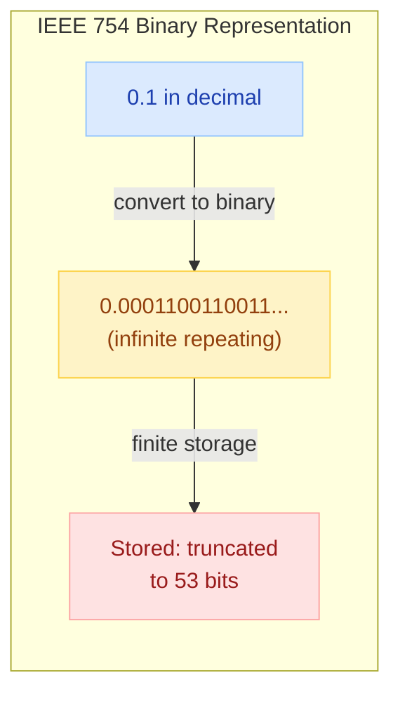
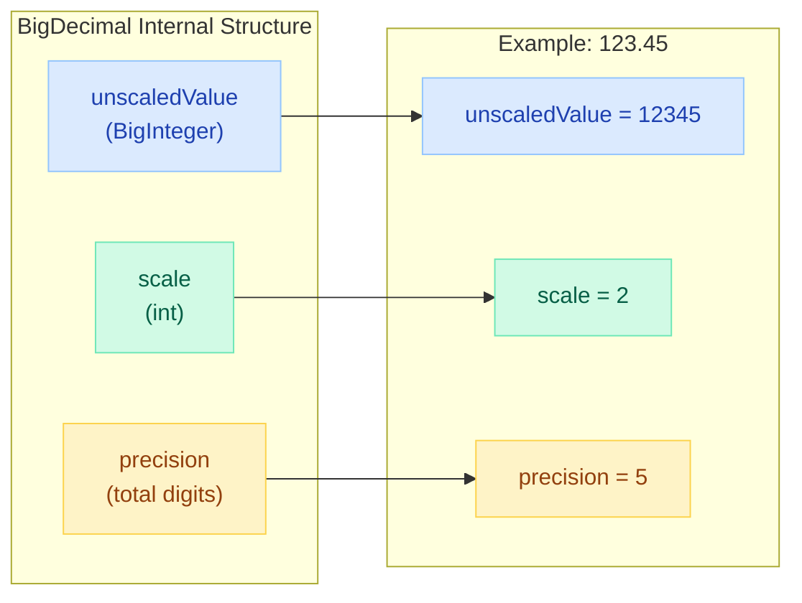
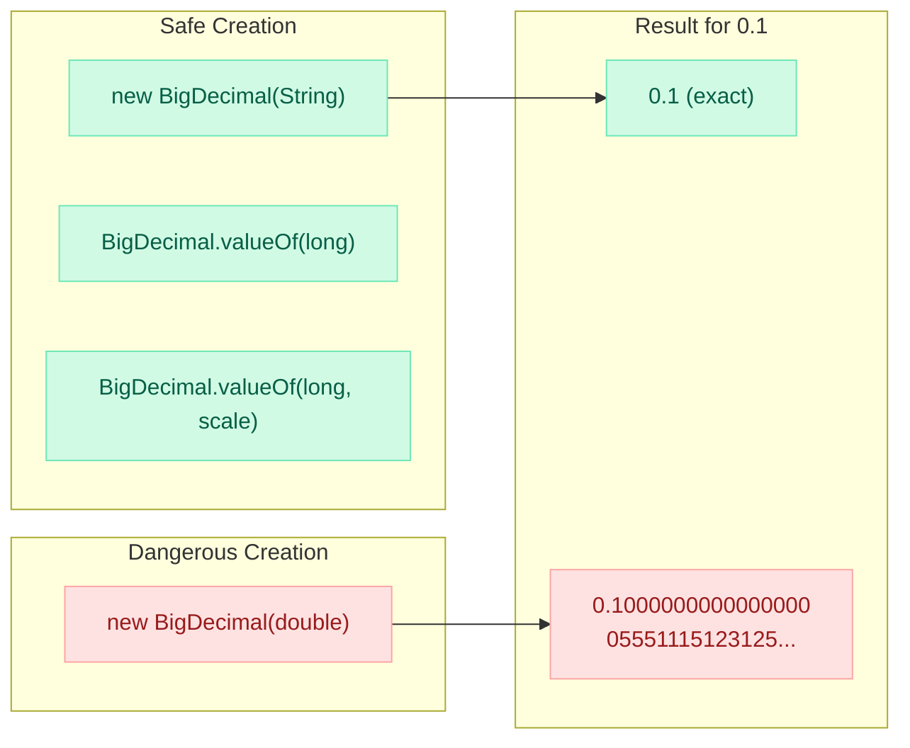
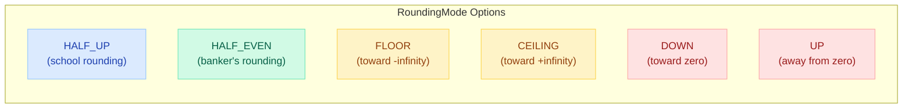
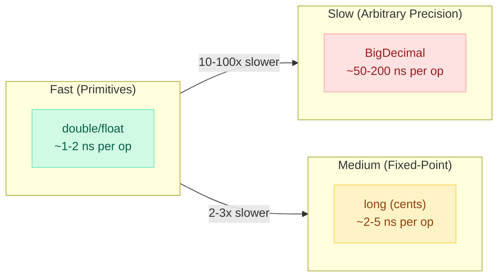

# BigDecimal, BigInteger & Numeric Precision

> **"If you use `double` for money, you will lose money." — Joshua Bloch, Effective Java**

---

!!! danger "Real Incident: The Vancouver Stock Exchange (1982)"
    The Vancouver Stock Exchange index started at 1000.000 in January 1982. After 22 months of truncating (not rounding) the index value to 3 decimal places on every update, the index read **524.881** — almost half of what it should have been. When they finally recalculated correctly, the true value was **1098.892**. Floating-point truncation silently destroyed over $500M in perceived market value.

---

## Why 0.1 + 0.2 != 0.3



```java
// The classic demonstration
System.out.println(0.1 + 0.2);          // 0.30000000000000004  ❌
System.out.println(0.1 + 0.2 == 0.3);   // false  ❌

// Real financial damage:
double price = 0.10;
double quantity = 3;
System.out.println(price * quantity);     // 0.30000000000000004 — overcharge!

// With BigDecimal:
BigDecimal bdPrice = new BigDecimal("0.10");
BigDecimal bdQty = new BigDecimal("3");
System.out.println(bdPrice.multiply(bdQty));  // 0.30 — exact ✅
```

| Base-10 Decimal | Binary Equivalent | Exact in Binary? |
|-----------------|-------------------|------------------|
| 0.5 | 0.1 | Yes |
| 0.25 | 0.01 | Yes |
| 0.1 | 0.000110011... (repeating) | **No** |
| 0.2 | 0.001100110... (repeating) | **No** |
| 0.3 | 0.010011001... (repeating) | **No** |

---

## BigDecimal Architecture



**Formula:** `BigDecimal = unscaledValue × 10^(-scale)`

```java
BigDecimal bd = new BigDecimal("123.45");
bd.unscaledValue();  // 12345 (BigInteger)
bd.scale();          // 2
bd.precision();      // 5

// Negative scale = large numbers
BigDecimal big = new BigDecimal("1.23E+10");  // 12300000000
big.unscaledValue(); // 123
big.scale();         // -8
```

---

## Creation: The `new` vs `valueOf()` Trap



```java
// ❌ NEVER do this — captures the imprecise double representation
BigDecimal bad = new BigDecimal(0.1);
System.out.println(bad);  // 0.1000000000000000055511151231257827021181583404541015625

// ✅ Use String constructor — exact decimal representation
BigDecimal good = new BigDecimal("0.1");
System.out.println(good);  // 0.1

// ✅ Or use valueOf() for doubles — calls Double.toString() first, then String constructor
BigDecimal also_good = BigDecimal.valueOf(0.1);
System.out.println(also_good);  // 0.1

// ✅ Static constants for common values
BigDecimal.ZERO;  // 0
BigDecimal.ONE;   // 1
BigDecimal.TEN;   // 10
```

!!! warning "The valueOf(double) Workaround"
    `BigDecimal.valueOf(0.1)` works because it internally calls `Double.toString(0.1)` which returns `"0.1"`, then creates a BigDecimal from that string. It is safe but slightly slower than the String constructor.

---

## Immutability — Every Operation Returns a New Object

```java
BigDecimal price = new BigDecimal("100.00");

// ❌ Common bug: ignoring return value
price.add(new BigDecimal("10.00"));  // result is DISCARDED!
System.out.println(price);            // still 100.00

// ✅ Correct: capture the return value
BigDecimal newPrice = price.add(new BigDecimal("10.00"));
System.out.println(newPrice);  // 110.00
System.out.println(price);     // 100.00 (original unchanged)
```

!!! tip "Interview Insight"
    BigDecimal is **immutable** like String. Every arithmetic method (`add`, `subtract`, `multiply`, `divide`) returns a **new** BigDecimal instance. The original is never modified. This is thread-safe by design.

---

## RoundingMode



| Mode | 5.5 | 2.5 | -1.5 | -2.5 | Use Case |
|------|-----|-----|------|------|----------|
| `HALF_UP` | 6 | 3 | -2 | -3 | General rounding (what you learned in school) |
| `HALF_EVEN` | 6 | **2** | -2 | **-2** | Financial/banking (eliminates bias) |
| `FLOOR` | 5 | 2 | -2 | -3 | Tax truncation (toward -infinity) |
| `CEILING` | 6 | 3 | -1 | -2 | Rounding up charges |
| `DOWN` | 5 | 2 | -1 | -2 | Truncation (toward zero) |
| `UP` | 6 | 3 | -2 | -3 | Conservative estimates (away from zero) |
| `UNNECESSARY` | - | - | - | - | Asserts exact result (throws if rounding needed) |

```java
BigDecimal value = new BigDecimal("2.5");

value.setScale(0, RoundingMode.HALF_UP);    // 3
value.setScale(0, RoundingMode.HALF_EVEN);  // 2 (rounds to nearest EVEN)
value.setScale(0, RoundingMode.FLOOR);      // 2
value.setScale(0, RoundingMode.CEILING);    // 3

// Banker's rounding eliminates systematic bias in large datasets
// HALF_UP always rounds 0.5 up → cumulative positive bias
// HALF_EVEN rounds 0.5 to nearest even → bias cancels out over many operations
```

!!! info "Why Banker's Rounding (HALF_EVEN)?"
    When summing millions of rounded values (e.g., daily interest calculations across accounts), HALF_UP introduces a systematic upward bias (~0.5 cents per operation). HALF_EVEN distributes rounding equally between up and down, making the cumulative error statistically zero. This is why financial institutions and IEEE 754 default to it.

---

## MathContext for Controlling Precision

```java
// MathContext = precision + RoundingMode
MathContext mc = new MathContext(4, RoundingMode.HALF_EVEN);

BigDecimal result = new BigDecimal("123.456789").round(mc);
System.out.println(result);  // 123.5 (4 significant digits)

// Pre-defined contexts
MathContext.DECIMAL32;   // 7 digits, HALF_EVEN (like float)
MathContext.DECIMAL64;   // 16 digits, HALF_EVEN (like double)
MathContext.DECIMAL128;  // 34 digits, HALF_EVEN (quad precision)
MathContext.UNLIMITED;   // unlimited precision, no rounding

// Use in operations
BigDecimal a = new BigDecimal("1");
BigDecimal b = new BigDecimal("3");
BigDecimal third = a.divide(b, mc);  // 0.3333 (4 significant digits)
```

---

## Comparison: equals() vs compareTo()

!!! danger "Critical Pitfall: equals() considers scale!"
    `new BigDecimal("2.0").equals(new BigDecimal("2.00"))` returns **`false`** because they have different scales (1 vs 2). Use `compareTo()` for numeric equality.

```java
BigDecimal a = new BigDecimal("2.0");
BigDecimal b = new BigDecimal("2.00");

// equals() checks BOTH value AND scale
a.equals(b);       // false! (scale 1 != scale 2)

// compareTo() checks numeric value only
a.compareTo(b);    // 0 (numerically equal) ✅

// This has HashMap implications!
Map<BigDecimal, String> map = new HashMap<>();
map.put(new BigDecimal("2.0"), "two");
map.get(new BigDecimal("2.00"));  // null! Different hashCode due to different scale

// Fix: use TreeMap (uses compareTo) or stripTrailingZeros()
Map<BigDecimal, String> treeMap = new TreeMap<>();
treeMap.put(new BigDecimal("2.0"), "two");
treeMap.get(new BigDecimal("2.00"));  // "two" ✅

// Or normalize:
a.stripTrailingZeros().equals(b.stripTrailingZeros());  // true ✅
```

---

## Division Pitfall: ArithmeticException

```java
// ❌ This THROWS ArithmeticException!
BigDecimal one = BigDecimal.ONE;
BigDecimal three = new BigDecimal("3");
one.divide(three);  // ArithmeticException: Non-terminating decimal expansion

// Why? 1/3 = 0.333333... (infinite), BigDecimal can't represent infinite decimals

// ✅ Always specify scale and RoundingMode for division
one.divide(three, 10, RoundingMode.HALF_EVEN);  // 0.3333333333

// ✅ Or use MathContext
one.divide(three, new MathContext(10, RoundingMode.HALF_EVEN));  // 0.3333333333

// Safe divisors (finite decimal expansion): powers of 2 and 5 only
// 1/2 = 0.5 ✅, 1/4 = 0.25 ✅, 1/5 = 0.2 ✅
// 1/3 ❌, 1/7 ❌, 1/6 ❌, 1/9 ❌
```

!!! tip "Rule of Thumb"
    **Always** provide a scale and RoundingMode when dividing BigDecimals. If you don't, you're gambling that the result is a terminating decimal.

---

## Arithmetic Operations

```java
BigDecimal a = new BigDecimal("100.50");
BigDecimal b = new BigDecimal("23.75");

// Basic operations (all return new BigDecimal)
a.add(b);                          // 124.25
a.subtract(b);                     // 76.75
a.multiply(b);                     // 2386.8750
a.divide(b, 4, RoundingMode.HALF_EVEN);  // 4.2316

// Chaining operations
BigDecimal total = price
    .multiply(quantity)
    .add(tax)
    .setScale(2, RoundingMode.HALF_EVEN);

// Remainder and divideAndRemainder
BigDecimal[] result = a.divideAndRemainder(b);
// result[0] = quotient (4), result[1] = remainder (5.50)

// Power
a.pow(2);  // 10100.2500

// Absolute value, negate, signum
a.abs();       // 100.50
a.negate();    // -100.50
a.signum();    // 1 (positive), 0 (zero), -1 (negative)

// Scale manipulation
a.setScale(4, RoundingMode.HALF_EVEN);  // 100.5000
a.movePointLeft(2);   // 1.0050
a.movePointRight(2);  // 10050
```

---

## Performance Considerations



| Approach | Speed | Precision | Best For |
|----------|-------|-----------|----------|
| `double` | Fastest | ~15 significant digits, inexact | Scientific computing, graphics |
| `long` (cents) | Fast | Exact within range | Fixed-precision money (2 decimal places) |
| `BigDecimal` | Slowest (50-100x) | Arbitrary, exact | Variable precision, regulatory compliance |

```java
// Alternative: store money as long cents (avoids BigDecimal overhead)
long priceInCents = 1999;  // $19.99
long taxInCents = 160;     // $1.60
long totalInCents = priceInCents + taxInCents;  // $21.59

// Convert for display
String formatted = String.format("$%d.%02d", totalInCents / 100, totalInCents % 100);

// When to use BigDecimal despite performance:
// - Variable decimal places (crypto: 8-18 decimals)
// - Regulatory requirement for exact arithmetic
// - Intermediate calculations need more precision than final result
```

!!! warning "Performance Tips"
    - Reuse `MathContext` instances (immutable, safe to share)
    - Prefer `BigDecimal.valueOf(long)` over `new BigDecimal(String)` for integers
    - Use `stripTrailingZeros()` sparingly (creates new object)
    - For tight loops with fixed precision, consider `long` arithmetic

---

## BigInteger: Arbitrary-Precision Integers

```java
// When long (max ~9.2 × 10^18) isn't enough
BigInteger factorial100 = BigInteger.ONE;
for (int i = 2; i <= 100; i++) {
    factorial100 = factorial100.multiply(BigInteger.valueOf(i));
}
// 100! = 93326215443944152681699238856266700490715968264381621468592963895...

// Common operations
BigInteger a = new BigInteger("123456789012345678901234567890");
BigInteger b = new BigInteger("987654321098765432109876543210");

a.add(b);
a.subtract(b);
a.multiply(b);
a.divide(b);          // integer division
a.mod(b);             // modulus
a.pow(10);            // a^10
a.gcd(b);             // greatest common divisor
a.isProbablePrime(10); // primality test (Miller-Rabin)
a.modPow(b, m);       // modular exponentiation (RSA!)

// Bit operations (useful for cryptography)
a.bitLength();        // number of bits
a.testBit(5);         // is bit 5 set?
a.setBit(10);         // set bit 10
a.and(b);             // bitwise AND
a.or(b);              // bitwise OR
a.xor(b);             // bitwise XOR
a.shiftLeft(3);       // << 3
a.shiftRight(3);      // >> 3

// Conversion
a.intValueExact();    // throws if overflow
a.longValueExact();   // throws if overflow
a.toByteArray();      // for serialization/crypto
```

| Use Case | Why BigInteger |
|----------|---------------|
| Cryptography (RSA, DH) | Keys are 2048+ bit numbers |
| Factorial / combinatorics | Results exceed long range quickly |
| Blockchain / hashing | Hash values as large integers |
| Scientific computing | Exact integer arithmetic without overflow |

---

## Real-World: Financial Calculations

### Tax Computation

```java
public class TaxCalculator {
    private static final MathContext CALC_CONTEXT = 
        new MathContext(10, RoundingMode.HALF_EVEN);
    
    public BigDecimal calculateTotal(BigDecimal subtotal, BigDecimal taxRate) {
        // Tax rate as decimal: 8.25% = 0.0825
        BigDecimal tax = subtotal.multiply(taxRate, CALC_CONTEXT)
            .setScale(2, RoundingMode.HALF_UP);  // round tax to cents
        
        return subtotal.add(tax);
    }
    
    // Handling multiple items with different tax rates
    public BigDecimal calculateOrderTotal(List<LineItem> items) {
        BigDecimal total = BigDecimal.ZERO;
        
        for (LineItem item : items) {
            BigDecimal lineTotal = item.price()
                .multiply(BigDecimal.valueOf(item.quantity()))
                .setScale(2, RoundingMode.HALF_EVEN);
            
            BigDecimal lineTax = lineTotal
                .multiply(item.taxRate())
                .setScale(2, RoundingMode.HALF_UP);
            
            total = total.add(lineTotal).add(lineTax);
        }
        
        return total;
    }
}
```

### Currency Handling with Rounding

```java
public class CurrencyUtil {
    
    // Different currencies have different decimal places
    public static BigDecimal round(BigDecimal amount, Currency currency) {
        int decimals = currency.getDefaultFractionDigits();  // USD=2, JPY=0, BHD=3
        return amount.setScale(decimals, RoundingMode.HALF_EVEN);
    }
    
    // Split a bill evenly (handle remainder)
    public static List<BigDecimal> splitEvenly(BigDecimal total, int parts) {
        BigDecimal share = total.divide(BigDecimal.valueOf(parts), 
            2, RoundingMode.FLOOR);  // round down each share
        
        BigDecimal distributed = share.multiply(BigDecimal.valueOf(parts));
        BigDecimal remainder = total.subtract(distributed);  // leftover cents
        
        List<BigDecimal> shares = new ArrayList<>();
        for (int i = 0; i < parts; i++) {
            // Give remainder penny to first person(s)
            if (remainder.compareTo(BigDecimal.ZERO) > 0) {
                shares.add(share.add(new BigDecimal("0.01")));
                remainder = remainder.subtract(new BigDecimal("0.01"));
            } else {
                shares.add(share);
            }
        }
        return shares;
    }
    
    // Interest calculation
    public static BigDecimal compoundInterest(
            BigDecimal principal, BigDecimal annualRate, 
            int timesPerYear, int years) {
        // A = P(1 + r/n)^(nt)
        MathContext mc = new MathContext(20, RoundingMode.HALF_EVEN);
        
        BigDecimal ratePerPeriod = annualRate.divide(
            BigDecimal.valueOf(timesPerYear), mc);
        BigDecimal base = BigDecimal.ONE.add(ratePerPeriod);
        int totalPeriods = timesPerYear * years;
        
        BigDecimal amount = principal.multiply(base.pow(totalPeriods, mc), mc);
        return amount.setScale(2, RoundingMode.HALF_EVEN);
    }
}
```

---

## Common Pitfalls Table

| Pitfall | Wrong Code | Correct Code | Consequence |
|---------|-----------|--------------|-------------|
| Double constructor | `new BigDecimal(0.1)` | `new BigDecimal("0.1")` | Silent precision loss |
| Ignoring return value | `bd.add(tax)` | `bd = bd.add(tax)` | Operation has no effect |
| equals() for comparison | `a.equals(b)` | `a.compareTo(b) == 0` | 2.0 != 2.00 with equals |
| Division without scale | `a.divide(b)` | `a.divide(b, 10, HALF_EVEN)` | ArithmeticException |
| Using in HashMap | `map.put(bd, val)` | Use TreeMap or normalize scale | Key lookup fails |
| toString() vs toPlainString() | `bd.toString()` | `bd.toPlainString()` | May output scientific notation |
| Comparing with == | `bd1 == bd2` | `bd1.compareTo(bd2) == 0` | Reference comparison |
| Not specifying RoundingMode | `bd.setScale(2)` | `bd.setScale(2, HALF_EVEN)` | ArithmeticException if rounding needed |

---

## Interview Questions

??? question "Why should you never use double/float for financial calculations?"
    **Answer:** `double` and `float` use IEEE 754 binary floating point, which cannot exactly represent most decimal fractions (like 0.1, 0.2). This causes cumulative rounding errors. For example, `0.1 + 0.2 = 0.30000000000000004` in binary floating point. In financial systems processing millions of transactions, these tiny errors compound into significant monetary discrepancies. Use `BigDecimal` with String constructors for exact decimal arithmetic.

??? question "What is the difference between equals() and compareTo() in BigDecimal?"
    **Answer:** `equals()` checks both numeric value AND scale, so `new BigDecimal("2.0").equals(new BigDecimal("2.00"))` returns `false` (different scales). `compareTo()` checks only the numeric value, returning 0 for mathematically equal values regardless of scale. Always use `compareTo()` for numeric equality checks. This also means BigDecimal violates the general contract that `equals()` and `compareTo()` should be consistent — which causes problems in HashMaps (use TreeMap instead).

??? question "What happens when you divide 1 by 3 using BigDecimal without specifying scale?"
    **Answer:** You get an `ArithmeticException` with the message "Non-terminating decimal expansion; no exact representable decimal result." BigDecimal requires exact representation by default, and 1/3 = 0.333... is infinite. You must always specify a scale and RoundingMode when dividing: `one.divide(three, 10, RoundingMode.HALF_EVEN)`.

??? question "Explain Banker's Rounding (HALF_EVEN) and why financial systems prefer it."
    **Answer:** HALF_EVEN rounds to the nearest even number when the value is exactly at the midpoint (x.5). So 2.5 rounds to 2, 3.5 rounds to 4, 4.5 rounds to 4, 5.5 rounds to 6. This eliminates the systematic upward bias of HALF_UP (which always rounds 0.5 up). Over millions of transactions, HALF_UP accumulates a positive error of approximately 0.5 cents per rounding. HALF_EVEN distributes the rounding direction equally, making the cumulative error statistically zero.

??? question "How would you design a money type in Java?"
    **Answer:** Use a record (Java 16+) combining BigDecimal with Currency: `record Money(BigDecimal amount, Currency currency)`. Ensure the amount is always stored with the correct scale for the currency (`setScale(currency.getDefaultFractionDigits())`). Provide arithmetic methods that enforce same-currency operations and use HALF_EVEN rounding. For exchange rate conversions, accept a MathContext parameter. For high-performance systems with fixed 2-decimal currencies, consider storing as `long` cents internally.

??? question "What is the new BigDecimal(double) trap?"
    **Answer:** `new BigDecimal(0.1)` creates a BigDecimal with the exact value of the `double` 0.1, which is actually `0.1000000000000000055511151231257827...` due to IEEE 754 representation. It does NOT create a BigDecimal with value 0.1. Use `new BigDecimal("0.1")` or `BigDecimal.valueOf(0.1)` instead. The String constructor parses the decimal literally. `valueOf(double)` works because it internally calls `Double.toString()` first.

---

## Quick Recall

| Topic | Key Point |
|-------|-----------|
| Why not double? | IEEE 754 cannot represent most decimals exactly (0.1 repeats in binary) |
| Creation | Always use `new BigDecimal("string")` — never `new BigDecimal(double)` |
| Immutability | Every operation returns a NEW object — always capture return value |
| Scale | Number of digits after decimal point; part of `equals()` check |
| Precision | Total number of significant digits |
| Formula | `value = unscaledValue × 10^(-scale)` |
| Division | ALWAYS specify scale + RoundingMode (avoids ArithmeticException) |
| equals vs compareTo | `equals` checks scale (2.0 != 2.00); `compareTo` checks value only |
| HALF_EVEN | Banker's rounding — eliminates cumulative bias in large datasets |
| BigInteger | Arbitrary-precision integers — used in crypto (RSA), factorials |
| Performance | BigDecimal is ~50-100x slower than double; use long cents for fixed precision |
| HashMap trap | Different scales = different hashCodes; use TreeMap or normalize |
| toString() | May use scientific notation; use `toPlainString()` for guaranteed decimal |
| Thread safety | Immutable = inherently thread-safe (no synchronization needed) |
