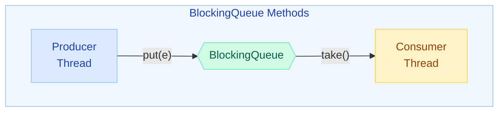
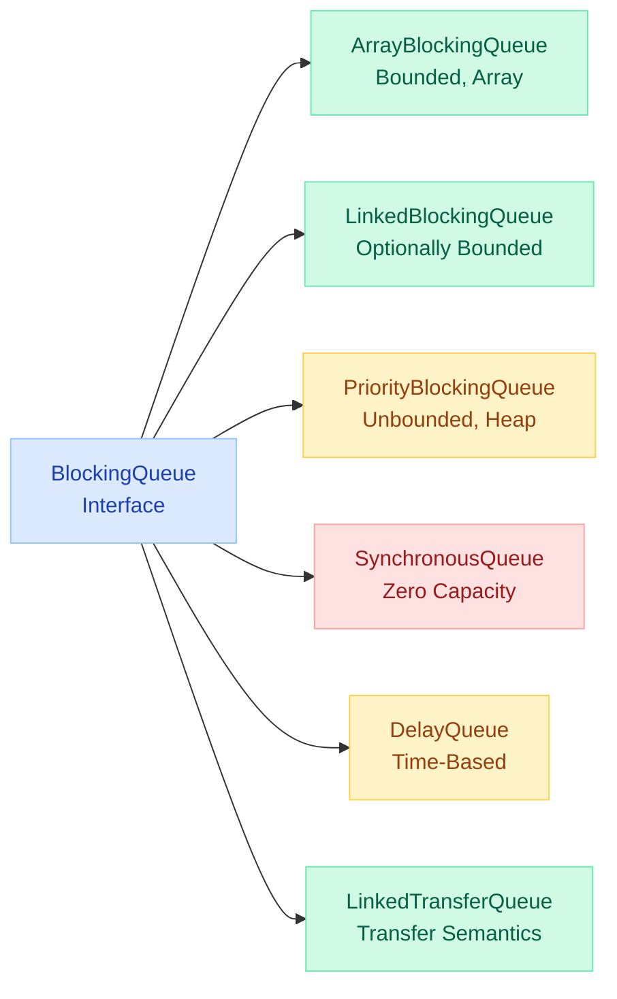
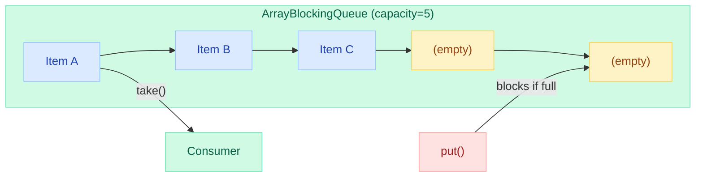
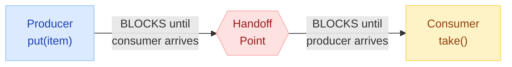
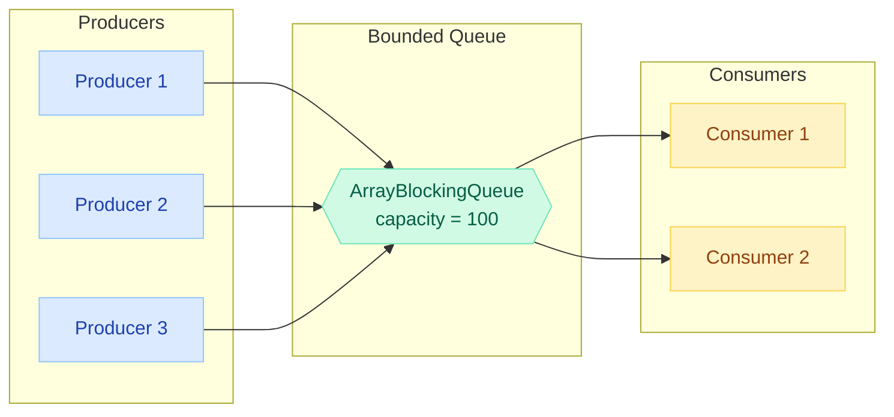
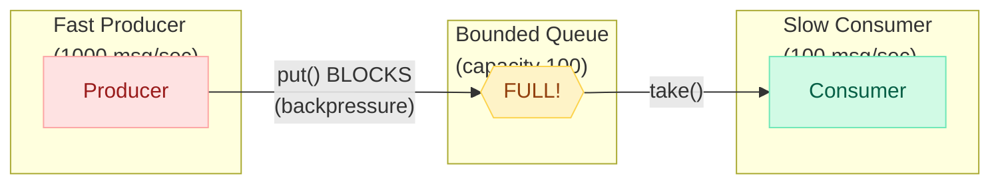

# BlockingQueue & Producer-Consumer Pattern

> "The producer-consumer pattern is the backbone of every message-driven system. Get the queue wrong, and you get either data loss or memory exhaustion — there is no in-between."

!!! danger "Real-World Incident"
    A payments processing service at a major e-commerce company used an **unbounded LinkedBlockingQueue** as its work queue. During Black Friday, order ingestion outpaced processing 10:1. The queue grew to 12 million entries, heap usage hit 95%, GC pauses exceeded 30 seconds, and the entire payment service went unresponsive. 48,000 transactions were lost. The fix: switch to a **bounded ArrayBlockingQueue(10000)** with a `CallerRunsPolicy` rejection handler — applying backpressure to upstream producers instead of silently accumulating unbounded debt.

---

## BlockingQueue Interface

`java.util.concurrent.BlockingQueue` extends `Queue` and adds **blocking** semantics: threads wait (block) rather than getting null or throwing exceptions when the queue is empty/full.



### Four Categories of Operations

| Behavior | Insert | Remove | Examine |
|---|---|---|---|
| **Throws Exception** | `add(e)` | `remove()` | `element()` |
| **Returns Special Value** | `offer(e)` → false | `poll()` → null | `peek()` → null |
| **Blocks Indefinitely** | `put(e)` | `take()` | N/A |
| **Blocks with Timeout** | `offer(e, time, unit)` | `poll(time, unit)` | N/A |

!!! tip "Interview Insight"
    **put/take** = blocks forever until space/element is available. Used for reliable producer-consumer.  
    **offer/poll** = returns immediately (or with timeout). Used when you need non-blocking behavior or want to implement custom backpressure.

---

## BlockingQueue Implementations



---

### ArrayBlockingQueue

A **fixed-capacity** queue backed by a circular array. Once created, the capacity cannot change.

```java
// Bounded queue — blocks when full
BlockingQueue<Order> queue = new ArrayBlockingQueue<>(1000);

// Fair mode — FIFO ordering for waiting threads (slower but prevents starvation)
BlockingQueue<Order> fairQueue = new ArrayBlockingQueue<>(1000, true);
```

**Internals:**

- Single `ReentrantLock` guards both put and take
- Two `Condition` variables: `notFull` (for producers) and `notEmpty` (for consumers)
- Fair mode uses a fair ReentrantLock — waiting threads are served in FIFO order
- Circular array with `putIndex` and `takeIndex` pointers



!!! warning "Fair vs Unfair"
    Fair mode guarantees no thread starvation but reduces throughput by ~30-50% due to ordering overhead. Use fair mode only when starvation is a real concern (e.g., multiple producers with different priorities).

---

### LinkedBlockingQueue

Backed by **linked nodes**. Optionally bounded — defaults to `Integer.MAX_VALUE` (effectively unbounded).

```java
// Unbounded (dangerous in production!)
BlockingQueue<Task> unbounded = new LinkedBlockingQueue<>();

// Bounded — preferred for production
BlockingQueue<Task> bounded = new LinkedBlockingQueue<>(5000);
```

**Key difference from ArrayBlockingQueue:**

| Feature | ArrayBlockingQueue | LinkedBlockingQueue |
|---|---|---|
| Locks | Single lock (put + take) | **Two separate locks** (putLock + takeLock) |
| Throughput | Lower under contention | Higher — producers and consumers don't block each other |
| Memory | Pre-allocated array | Allocates nodes on each put (GC pressure) |
| Fairness option | Yes | No |

!!! tip "When to Choose"
    - **ArrayBlockingQueue**: Known fixed capacity, fairness needed, lower GC pressure
    - **LinkedBlockingQueue**: High throughput needed, producers/consumers operate at different rates

---

### PriorityBlockingQueue

An **unbounded** blocking queue that orders elements by priority (natural order or custom `Comparator`). Not FIFO — highest-priority element is always dequeued first.

```java
// Natural ordering (Comparable)
BlockingQueue<PriorityTask> pq = new PriorityBlockingQueue<>();

// Custom comparator — higher priority first
BlockingQueue<PriorityTask> pq = new PriorityBlockingQueue<>(100,
    Comparator.comparingInt(PriorityTask::getPriority).reversed()
);
```

```java
class PriorityTask implements Comparable<PriorityTask> {
    private final int priority;
    private final String payload;

    public PriorityTask(int priority, String payload) {
        this.priority = priority;
        this.payload = payload;
    }

    @Override
    public int compareTo(PriorityTask other) {
        return Integer.compare(this.priority, other.priority); // lower = higher priority
    }
}
```

**Characteristics:**

- `put()` never blocks (unbounded)
- `take()` blocks only when empty
- Backed by a binary heap (same as PriorityQueue)
- **Not FIFO** — elements with equal priority have no guaranteed order
- Iterator does NOT traverse in priority order

---

### SynchronousQueue

A queue with **zero capacity**. Every `put()` must wait for a corresponding `take()` — a direct handoff between threads.



```java
BlockingQueue<Runnable> handoff = new SynchronousQueue<>();

// This is exactly what Executors.newCachedThreadPool() uses!
ExecutorService cached = new ThreadPoolExecutor(
    0, Integer.MAX_VALUE,
    60L, TimeUnit.SECONDS,
    new SynchronousQueue<>()  // zero buffering — task goes directly to a thread
);
```

**Key properties:**

- `size()` always returns 0
- `peek()` always returns null
- `offer(e)` returns false unless another thread is waiting to take
- Two modes: **fair** (FIFO queue of waiting threads) and **unfair** (LIFO stack — better throughput)

!!! tip "Interview Insight"
    "How does `newCachedThreadPool` avoid queuing tasks?" — It uses a SynchronousQueue. If no idle thread is available to take the task, the pool creates a new thread. Tasks are never buffered.

---

### DelayQueue

An **unbounded** queue where elements can only be taken after their delay has expired. Elements must implement `Delayed`.

```java
class ScheduledTask implements Delayed {
    private final String name;
    private final long executeAt; // absolute time in millis

    public ScheduledTask(String name, long delayMillis) {
        this.name = name;
        this.executeAt = System.currentTimeMillis() + delayMillis;
    }

    @Override
    public long getDelay(TimeUnit unit) {
        long remaining = executeAt - System.currentTimeMillis();
        return unit.convert(remaining, TimeUnit.MILLISECONDS);
    }

    @Override
    public int compareTo(Delayed other) {
        return Long.compare(this.getDelay(TimeUnit.MILLISECONDS),
                           other.getDelay(TimeUnit.MILLISECONDS));
    }
}
```

```java
DelayQueue<ScheduledTask> delayQueue = new DelayQueue<>();
delayQueue.put(new ScheduledTask("Send reminder email", 5000));  // execute after 5s
delayQueue.put(new ScheduledTask("Expire session", 30000));       // execute after 30s

// Consumer — blocks until an element's delay expires
ScheduledTask task = delayQueue.take(); // waits for earliest expiry
```

**Use cases:**

- Session expiration
- Retry with exponential backoff
- Rate limiting (token bucket refill)
- Cache entry expiration
- Scheduled notifications

---

### LinkedTransferQueue (Java 7+)

An **unbounded** queue combining the best of `LinkedBlockingQueue` and `SynchronousQueue`. Adds the `transfer()` method — the producer blocks until a consumer actually receives the element.

```java
TransferQueue<Event> queue = new LinkedTransferQueue<>();

// Regular put — non-blocking (enqueues like LinkedBlockingQueue)
queue.put(event);

// Transfer — blocks until a consumer takes this specific element
queue.transfer(event); // producer waits for consumer

// Try transfer — if a consumer is waiting, hand off directly; else return false
boolean immediate = queue.tryTransfer(event);

// Try transfer with timeout
boolean handed = queue.tryTransfer(event, 100, TimeUnit.MILLISECONDS);
```

**When to use:**

- When you need **acknowledgement** that a consumer received the message
- Replaces SynchronousQueue when you also want buffering as a fallback
- Best concurrent queue performance in benchmarks (lock-free algorithms)

---

## Producer-Consumer Pattern

The most fundamental concurrency pattern: **decouple work production from consumption** using a shared queue.



### Basic Implementation

```java
import java.util.concurrent.*;

public class ProducerConsumerDemo {
    private static final BlockingQueue<String> queue = new ArrayBlockingQueue<>(10);
    private static final String POISON_PILL = "DONE";

    public static void main(String[] args) {
        Thread producer = new Thread(() -> {
            try {
                for (int i = 0; i < 50; i++) {
                    String item = "Order-" + i;
                    queue.put(item); // blocks if queue is full (backpressure!)
                    System.out.println("Produced: " + item);
                }
                queue.put(POISON_PILL); // signal termination
            } catch (InterruptedException e) {
                Thread.currentThread().interrupt();
            }
        });

        Thread consumer = new Thread(() -> {
            try {
                while (true) {
                    String item = queue.take(); // blocks if queue is empty
                    if (POISON_PILL.equals(item)) break;
                    process(item);
                }
            } catch (InterruptedException e) {
                Thread.currentThread().interrupt();
            }
        });

        producer.start();
        consumer.start();
    }

    private static void process(String item) {
        System.out.println("Consumed: " + item);
    }
}
```

---

### Multiple Producers & Consumers with Thread Pool

In production, you rarely have a single producer and consumer. Here's the scalable pattern:

```java
import java.util.concurrent.*;
import java.util.concurrent.atomic.AtomicInteger;

public class MultiProducerConsumer {
    private static final int QUEUE_CAPACITY = 1000;
    private static final int NUM_PRODUCERS = 3;
    private static final int NUM_CONSUMERS = 5;
    private static final String POISON_PILL = "__STOP__";

    private static final BlockingQueue<String> queue =
        new ArrayBlockingQueue<>(QUEUE_CAPACITY);

    public static void main(String[] args) throws InterruptedException {
        ExecutorService producerPool = Executors.newFixedThreadPool(NUM_PRODUCERS);
        ExecutorService consumerPool = Executors.newFixedThreadPool(NUM_CONSUMERS);
        AtomicInteger producedCount = new AtomicInteger(0);

        // Start producers
        for (int p = 0; p < NUM_PRODUCERS; p++) {
            final int producerId = p;
            producerPool.submit(() -> {
                try {
                    for (int i = 0; i < 100; i++) {
                        String item = "P" + producerId + "-Item" + i;
                        queue.put(item);
                        producedCount.incrementAndGet();
                    }
                } catch (InterruptedException e) {
                    Thread.currentThread().interrupt();
                }
            });
        }

        // Start consumers
        for (int c = 0; c < NUM_CONSUMERS; c++) {
            final int consumerId = c;
            consumerPool.submit(() -> {
                try {
                    while (true) {
                        String item = queue.take();
                        if (POISON_PILL.equals(item)) {
                            queue.put(POISON_PILL); // propagate to other consumers
                            break;
                        }
                        processItem(consumerId, item);
                    }
                } catch (InterruptedException e) {
                    Thread.currentThread().interrupt();
                }
            });
        }

        // Shutdown producers, then signal consumers
        producerPool.shutdown();
        producerPool.awaitTermination(1, TimeUnit.MINUTES);

        // All producers done — send poison pill
        queue.put(POISON_PILL);

        consumerPool.shutdown();
        consumerPool.awaitTermination(1, TimeUnit.MINUTES);

        System.out.println("Total produced: " + producedCount.get());
    }

    private static void processItem(int consumerId, String item) {
        // Simulate work
        System.out.printf("Consumer-%d processed: %s%n", consumerId, item);
    }
}
```

!!! warning "Poison Pill Propagation"
    With multiple consumers, a single poison pill only stops one consumer. The trick: when a consumer receives the poison pill, it **re-enqueues** it so the next consumer also sees it. This cascades shutdown to all consumers.

---

## Backpressure with Bounded Queues

Backpressure means **slowing down producers** when consumers can't keep up. A bounded BlockingQueue provides natural backpressure via `put()` blocking.



### Backpressure Strategies

| Strategy | Implementation | Trade-off |
|---|---|---|
| **Block** | `queue.put(item)` | Producer slows down; simple but can cascade upstream |
| **Drop newest** | `queue.offer(item)` — discard if full | No blocking; data loss |
| **Drop oldest** | Custom: poll + offer | Keeps freshest data; lossy |
| **Caller-runs** | ThreadPoolExecutor's CallerRunsPolicy | Producer thread does the work itself |
| **Exception** | `queue.add(item)` throws if full | Immediate feedback; needs error handling |
| **Timeout** | `queue.offer(item, 5, SECONDS)` | Bounded wait; fallback on timeout |

```java
// Production backpressure pattern with metrics
public class BackpressureProducer {
    private final BlockingQueue<Event> queue;
    private final MeterRegistry metrics;

    public void produce(Event event) {
        boolean accepted = queue.offer(event, 500, TimeUnit.MILLISECONDS);
        if (!accepted) {
            metrics.counter("queue.rejected").increment();
            // Fallback: write to dead-letter queue, retry later, or drop
            deadLetterQueue.add(event);
        } else {
            metrics.gauge("queue.size", queue.size());
        }
    }
}
```

---

## Comparison Table — All Implementations

| Implementation | Bounded? | Ordering | Locking | Null Elements | Best Use Case |
|---|---|---|---|---|---|
| **ArrayBlockingQueue** | Yes (fixed) | FIFO | Single lock | No | Known capacity, fairness needed |
| **LinkedBlockingQueue** | Optional | FIFO | Two locks (put/take) | No | High throughput, decoupled rates |
| **PriorityBlockingQueue** | No | Priority | Single lock | No | Priority-ordered processing |
| **SynchronousQueue** | Zero capacity | N/A | Lock-free | No | Direct handoff, cached thread pool |
| **DelayQueue** | No | Delay-based | Single lock | No | Scheduled execution, expiration |
| **LinkedTransferQueue** | No | FIFO | Lock-free | No | Transfer acknowledgement, best perf |

---

## Real-World Applications

### 1. Thread Pool Work Queues

Every `ThreadPoolExecutor` uses a BlockingQueue internally:

```java
// Fixed thread pool uses LinkedBlockingQueue (unbounded — dangerous!)
ExecutorService fixed = Executors.newFixedThreadPool(10);
// Internally: new LinkedBlockingQueue<>() — can OOM under load

// Recommended: explicit bounded queue with rejection policy
ExecutorService safe = new ThreadPoolExecutor(
    10, 20,                              // core/max threads
    60L, TimeUnit.SECONDS,               // idle timeout
    new ArrayBlockingQueue<>(500),       // bounded work queue
    new ThreadPoolExecutor.CallerRunsPolicy() // backpressure
);
```

| Pool Type | Queue Used | Why |
|---|---|---|
| `newFixedThreadPool` | `LinkedBlockingQueue` (unbounded) | Tasks queue when all threads busy |
| `newCachedThreadPool` | `SynchronousQueue` | No queuing — create new thread immediately |
| `newSingleThreadExecutor` | `LinkedBlockingQueue` (unbounded) | Sequential task ordering |
| `newScheduledThreadPool` | `DelayedWorkQueue` | Time-based scheduling |

### 2. Event Processing Pipeline

```java
// Multi-stage pipeline: each stage is a producer-consumer
BlockingQueue<RawEvent> ingest = new LinkedBlockingQueue<>(10000);
BlockingQueue<EnrichedEvent> enriched = new ArrayBlockingQueue<>(5000);
BlockingQueue<ValidatedEvent> validated = new ArrayBlockingQueue<>(5000);

// Stage 1: Ingest → Enrich
executor.submit(() -> {
    while (!Thread.currentThread().isInterrupted()) {
        RawEvent raw = ingest.take();
        EnrichedEvent e = enrichService.enrich(raw);
        enriched.put(e);
    }
});

// Stage 2: Enrich → Validate
executor.submit(() -> {
    while (!Thread.currentThread().isInterrupted()) {
        EnrichedEvent e = enriched.take();
        ValidatedEvent v = validator.validate(e);
        validated.put(v);
    }
});

// Stage 3: Validate → Persist
executor.submit(() -> {
    while (!Thread.currentThread().isInterrupted()) {
        ValidatedEvent v = validated.take();
        repository.save(v);
    }
});
```

### 3. Rate Limiting with DelayQueue

```java
public class TokenBucketRateLimiter {
    private final DelayQueue<Token> tokens = new DelayQueue<>();
    private final int maxTokens;
    private final long refillIntervalMs;

    public TokenBucketRateLimiter(int maxTokens, long refillIntervalMs) {
        this.maxTokens = maxTokens;
        this.refillIntervalMs = refillIntervalMs;
        // Pre-fill tokens
        for (int i = 0; i < maxTokens; i++) {
            tokens.put(new Token(0)); // immediately available
        }
    }

    public boolean tryAcquire(long timeoutMs) throws InterruptedException {
        Token token = tokens.poll(timeoutMs, TimeUnit.MILLISECONDS);
        if (token != null) {
            // Schedule a replacement token after refill interval
            tokens.put(new Token(refillIntervalMs));
            return true;
        }
        return false; // rate limited
    }

    private static class Token implements Delayed {
        private final long availableAt;

        Token(long delayMs) {
            this.availableAt = System.currentTimeMillis() + delayMs;
        }

        @Override
        public long getDelay(TimeUnit unit) {
            return unit.convert(availableAt - System.currentTimeMillis(), TimeUnit.MILLISECONDS);
        }

        @Override
        public int compareTo(Delayed o) {
            return Long.compare(this.getDelay(TimeUnit.MILLISECONDS),
                               o.getDelay(TimeUnit.MILLISECONDS));
        }
    }
}
```

---

## Common Interview Questions

### Q1: What happens if you use an unbounded queue in a ThreadPoolExecutor?

The max-threads parameter becomes useless. Since the queue never fills up, new threads beyond core-pool-size are never created. Tasks pile up indefinitely in memory, eventually causing OOM. This is the #1 production bug with `Executors.newFixedThreadPool()`.

### Q2: How do you gracefully shut down a producer-consumer system?

1. **Stop producing** — call `producerPool.shutdown()`
2. **Drain remaining items** — let consumers finish current queue contents
3. **Signal termination** — use a poison pill or `consumerPool.shutdownNow()` (sets interrupt flag)
4. **Await termination** — `awaitTermination()` with a timeout
5. **Handle stragglers** — force shutdown if timeout expires

### Q3: SynchronousQueue vs LinkedTransferQueue?

Both support direct handoff, but `LinkedTransferQueue` also allows buffering. Use `transfer()` when you want SynchronousQueue-like blocking semantics, and `put()` when you want normal queuing. It is strictly more flexible.

### Q4: How does PriorityBlockingQueue handle equal priorities?

It does NOT guarantee FIFO ordering for elements with equal priority. If you need stable ordering, add a secondary sort key (e.g., a sequence number):

```java
class StablePriorityTask implements Comparable<StablePriorityTask> {
    private static final AtomicLong SEQ = new AtomicLong(0);
    private final int priority;
    private final long sequenceNumber = SEQ.incrementAndGet();

    @Override
    public int compareTo(StablePriorityTask other) {
        int cmp = Integer.compare(this.priority, other.priority);
        if (cmp != 0) return cmp;
        return Long.compare(this.sequenceNumber, other.sequenceNumber); // FIFO tiebreaker
    }
}
```

### Q5: Why does BlockingQueue prohibit null elements?

`poll()` returns `null` to indicate "queue is empty." If `null` were a valid element, you couldn't distinguish "I got a null element" from "the queue was empty." This ambiguity would break timeout-based polling patterns.

### Q6: ArrayBlockingQueue — when to use fair=true?

Only when you have multiple producers competing to put and starvation is a real concern. Fair mode uses a fair `ReentrantLock`, which maintains a FIFO queue of waiting threads. This prevents thread starvation but reduces throughput by 30-50% due to additional ordering overhead.

### Q7: How do you implement backpressure without blocking the producer thread?

Use `offer()` with a timeout. If it returns false, apply a fallback strategy: log a warning, write to a dead-letter queue, drop the message, or apply exponential backoff. This gives the producer bounded waiting time instead of indefinite blocking.

---

## Quick Recall

| Question | Answer |
|---|---|
| put() vs offer()? | put() blocks forever; offer() returns false immediately (or with timeout) |
| take() vs poll()? | take() blocks forever; poll() returns null immediately (or with timeout) |
| ArrayBlockingQueue lock model? | Single ReentrantLock + 2 Conditions (notFull, notEmpty) |
| LinkedBlockingQueue lock model? | **Two** separate locks (putLock + takeLock) — higher throughput |
| PriorityBlockingQueue bounded? | No — unbounded, put() never blocks |
| SynchronousQueue capacity? | **Zero** — every put() waits for a take() |
| DelayQueue ordering? | By expiration time (earliest first) |
| LinkedTransferQueue transfer()? | Producer blocks until consumer **actually receives** the element |
| Poison pill pattern? | Special sentinel value signals consumers to stop |
| Multiple consumers + poison pill? | Consumer re-enqueues the poison pill after receiving it |
| newCachedThreadPool queue? | SynchronousQueue — direct handoff, no buffering |
| newFixedThreadPool queue? | Unbounded LinkedBlockingQueue — OOM risk! |
| Backpressure mechanism? | Bounded queue + put() blocking OR offer() + fallback |
| Null elements allowed? | **No** — null is used as a sentinel by poll() |
| Fair ArrayBlockingQueue cost? | ~30-50% throughput reduction |
| Best overall performance? | LinkedTransferQueue (lock-free algorithms) |
