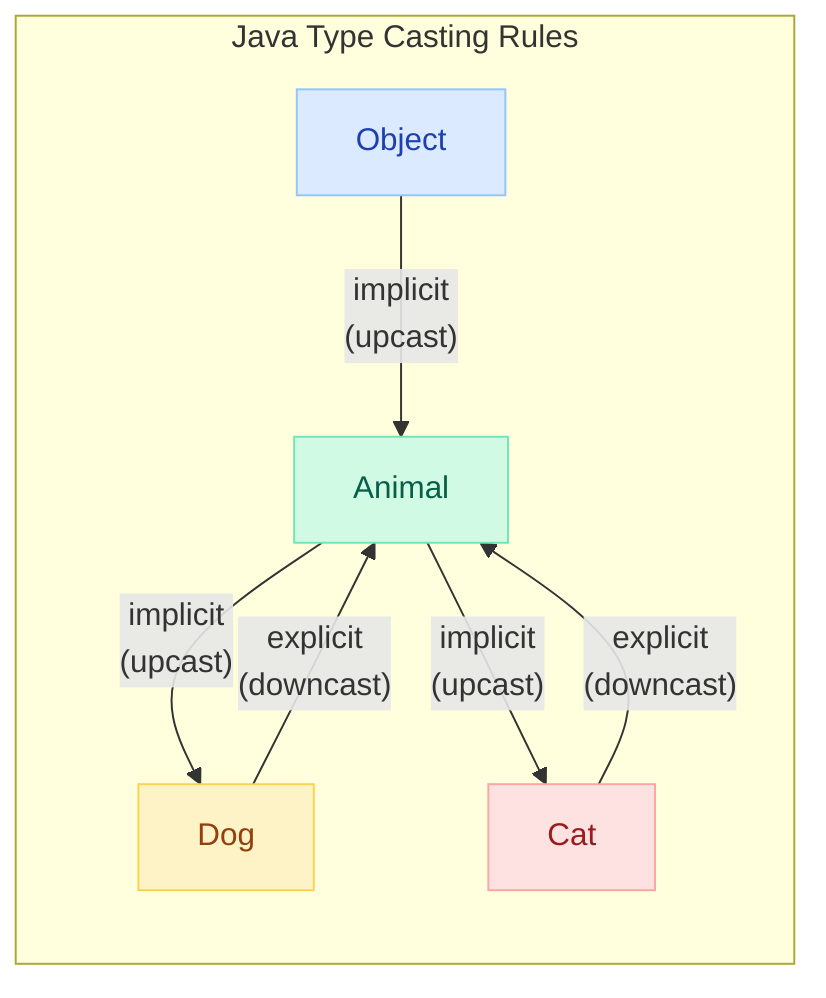
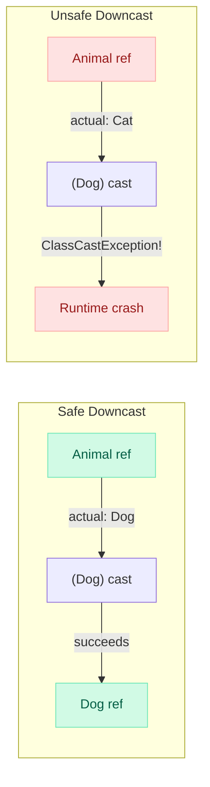
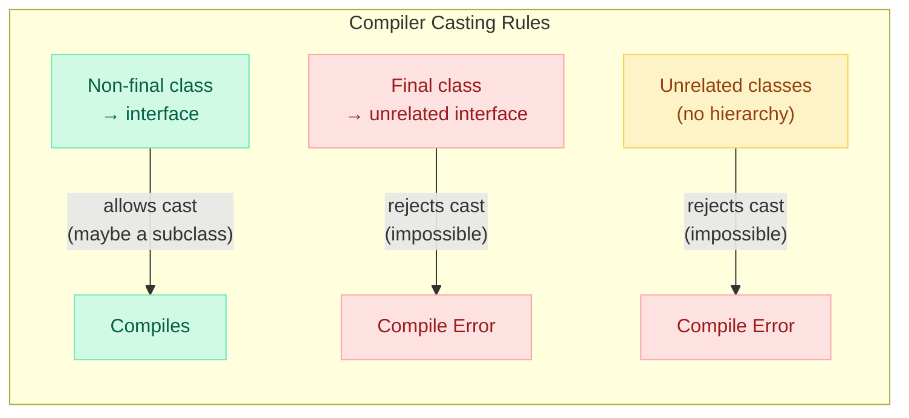

# Type Casting, instanceof & Type Checking in Java

> **"Every ClassCastException is a design smell — it means your type system told you something at compile time that you chose to ignore at runtime."**

---

!!! danger "Real Incident: E-Commerce Deserializer, 2022"
    A payment service stored events as `Object` in a shared queue. A developer cast every event to `PaymentEvent` without checking. When the marketing team added `PromoEvent` to the same queue, **production threw ClassCastException on 40% of messages** at 2 AM during Black Friday. The fix was 3 lines of `instanceof` — but the outage lasted 47 minutes and cost $2.3M in lost revenue.

---

## Type Hierarchy & Casting Rules



---

## Widening (Upcasting) — Implicit, Always Safe

Upcasting moves **up** the hierarchy (subclass to superclass). The compiler does it implicitly because a `Dog` IS-A `Animal` — no information is lost.

```java
Dog dog = new Dog("Rex");
Animal animal = dog;          // implicit upcast — always safe
Object obj = animal;          // another implicit upcast

// The reference type changes, but the actual object is still a Dog
System.out.println(animal.getClass());  // class Dog
```

| Rule | Explanation |
|------|-------------|
| Always succeeds | A subclass reference always fits in a superclass variable |
| No cast operator needed | Compiler inserts it automatically |
| Loses access to subclass methods | `animal.fetch()` won't compile even though the object is a Dog |
| Actual object unchanged | Only the reference type narrows the visible API |

### When Upcasting Happens Automatically

```java
// 1. Method parameters
void feed(Animal a) { ... }
feed(new Dog("Rex"));  // Dog → Animal (implicit)

// 2. Collections
List<Animal> animals = new ArrayList<>();
animals.add(new Dog("Rex"));  // Dog → Animal (implicit)
animals.add(new Cat("Whiskers"));

// 3. Return types
Animal adopt() {
    return new Dog("Buddy");  // Dog → Animal (implicit)
}
```

---

## Narrowing (Downcasting) — Explicit, ClassCastException Risk

Downcasting moves **down** the hierarchy (superclass to subclass). Requires an explicit cast and can fail at runtime.

```java
Animal animal = new Dog("Rex");

// ✅ Works — the actual object IS a Dog
Dog dog = (Dog) animal;
dog.fetch();

// ❌ ClassCastException at runtime!
Animal animal2 = new Cat("Whiskers");
Dog dog2 = (Dog) animal2;  // compiles fine, EXPLODES at runtime
```



### Always Guard Downcasts

```java
// ✅ Safe pattern — check before cast
if (animal instanceof Dog) {
    Dog dog = (Dog) animal;
    dog.fetch();
}

// ✅ Even better — Java 16+ pattern matching
if (animal instanceof Dog dog) {
    dog.fetch();  // already cast and scoped
}
```

---

## Primitive Widening and Narrowing

Primitive casting follows different rules than reference casting.

### Primitive Widening (Safe, Implicit)

```java
byte → short → int → long → float → double
char → int → long → float → double

int x = 42;
long y = x;      // implicit widening — no data loss
double z = x;    // implicit widening — int to double
```

### Primitive Narrowing (Lossy, Explicit)

```java
double pi = 3.14159;
int truncated = (int) pi;       // 3 — fractional part lost!

long big = 130L;
byte small = (byte) big;        // -126 — overflow wraps around!

int millions = 16_777_217;
float approx = millions;        // 16777216.0 — precision loss (implicit but lossy!)
```

| Conversion | Risk |
|-----------|------|
| `int` to `long` | None — always safe |
| `int` to `float` | Precision loss (float has 24-bit mantissa) |
| `long` to `double` | Precision loss (double has 53-bit mantissa) |
| `double` to `int` | Truncation + possible overflow |
| `int` to `byte` | Wraps around (modulo 256) |

!!! warning "Sneaky Precision Loss"
    `int` to `float` and `long` to `double` are **widening** conversions (implicit), but they lose precision for large values. The compiler won't warn you!
    
    ```java
    int big = 16_777_217;        // 2^24 + 1
    float f = big;               // 16777216.0 — lost the +1!
    System.out.println((int) f); // 16777216 — silently wrong
    ```

---

## The instanceof Operator

`instanceof` tests whether an object is an instance of a specific class or interface — **at runtime**.

```java
Animal animal = getAnimal();

animal instanceof Dog      // true if animal IS a Dog (or subclass of Dog)
animal instanceof Animal   // always true (Dog IS-A Animal)
animal instanceof Object   // always true (everything IS-A Object)
null instanceof Dog        // always false — null is never an instance of anything
```

### Key Properties

| Property | Behavior |
|----------|----------|
| **Null-safe** | `null instanceof X` always returns `false` — no NPE |
| **Inheritance-aware** | Returns `true` for the class AND all superclasses/interfaces |
| **Compile-time check** | Compiler rejects impossible checks (e.g., `String instanceof Integer`) |
| **Final classes** | Compiler can optimize — a `String` can never be a `Dog` |

### Pattern Matching instanceof (Java 16+)

```java
// ❌ Old way — check then cast (redundant)
if (obj instanceof String) {
    String s = (String) obj;
    System.out.println(s.length());
}

// ✅ New way — pattern variable (check + cast + scope in one)
if (obj instanceof String s) {
    System.out.println(s.length());  // s is already cast
}

// Works with && (short-circuit guarantees safety)
if (obj instanceof String s && s.length() > 5) {
    process(s);
}

// ❌ Does NOT work with || (s might not be assigned)
// if (obj instanceof String s || s.isEmpty()) { }  // COMPILE ERROR
```

### Guarded Patterns in switch (Java 21+)

```java
static String describe(Object obj) {
    return switch (obj) {
        case Integer i when i > 0  -> "Positive int: " + i;
        case Integer i             -> "Non-positive int: " + i;
        case String s when s.isBlank() -> "Blank string";
        case String s              -> "String: " + s;
        case null                  -> "null";
        default                    -> "Unknown: " + obj.getClass();
    };
}
```

---

## ClassCastException: When and Why

A `ClassCastException` is thrown at runtime when you attempt to cast an object to a type it is NOT.

```java
// The JVM checks: "Is the actual object assignable to the target type?"
Object obj = "hello";
Integer num = (Integer) obj;  // ClassCastException: String cannot be cast to Integer
```

### Common Causes

| Cause | Example |
|-------|---------|
| Blind downcast without instanceof | `(Dog) animal` when animal is a Cat |
| Wrong generic assumption | Casting `List<Object>` elements without checking |
| Deserialization mismatch | Class version changed, old serialized data loaded |
| Proxy/wrapper confusion | Casting a Spring proxy to concrete class |
| Collection type pollution | Raw types hiding incorrect element types |

### How to Prevent

```java
// 1. Always check first
if (event instanceof PaymentEvent pe) {
    processPayment(pe);
} else if (event instanceof PromoEvent promo) {
    processPromo(promo);
}

// 2. Use polymorphism instead of casting
event.process();  // let the subclass decide behavior

// 3. Use generics to catch at compile time
Queue<PaymentEvent> paymentQueue = new LinkedList<>();  // type-safe
```

---

## Casting with Interfaces

The compiler is **less strict** with interface casts because any class could implement an interface (unless the class is `final`).

```java
class Dog extends Animal { }
interface Flyable { void fly(); }

Dog dog = new Dog();
Flyable f = (Flyable) dog;  // Compiles! (Dog could have a subclass that implements Flyable)
                             // But throws ClassCastException at runtime

// With final class — compiler CAN reject:
final class Rock { }
Rock rock = new Rock();
// Flyable f2 = (Flyable) rock;  // COMPILE ERROR — Rock is final, can never implement Flyable
```



---

## Generics and Casting (Type Erasure)

Due to type erasure, generics are erased at runtime. This makes casting with generics problematic.

```java
// At runtime, List<String> and List<Integer> are both just "List"
List<String> strings = new ArrayList<>();
List rawList = strings;               // warning: raw type
List<Integer> integers = rawList;     // warning: unchecked cast — compiles!
integers.add(42);                     // works at runtime (erasure removes checks)

String s = strings.get(0);           // ClassCastException! (it's actually an Integer)
```

### Unchecked Cast Warnings

```java
// ❌ Compiler warns: "unchecked cast"
Object obj = getFromCache();

@SuppressWarnings("unchecked")           // Only suppress if you're SURE
Map<String, List<Integer>> map = (Map<String, List<Integer>>) obj;

// ✅ Better: use Class token for type-safe casting
public <T> T getFromCache(String key, Class<T> type) {
    Object value = cache.get(key);
    return type.cast(value);  // ClassCastException with clear message if wrong type
}
```

### You Cannot Do This

```java
// ❌ Cannot check generic type at runtime (erasure)
if (list instanceof List<String>) { }  // COMPILE ERROR

// ✅ Can check raw type only
if (list instanceof List<?>) { }       // OK but tells you nothing about element type

// ✅ Check elements individually
if (list.stream().allMatch(e -> e instanceof String)) {
    @SuppressWarnings("unchecked")
    List<String> strings = (List<String>) list;
}
```

---

## Class.cast() vs (Type) Cast

| Feature | `(Type) obj` | `Type.class.cast(obj)` |
|---------|-------------|----------------------|
| **Syntax** | Operator | Method call |
| **Compile-time check** | Yes — rejects impossible casts | No — accepts any Object |
| **Generic-friendly** | No — can't use type parameter `(T) obj` warns | Yes — `clazz.cast(obj)` is clean |
| **Error message** | Basic: "X cannot be cast to Y" | Same but works in generic contexts |
| **Use case** | Normal code | Frameworks, generic utilities |

```java
// When (Type) cast shines — everyday code
Dog dog = (Dog) animal;

// When Class.cast() shines — generic/reflective code
public <T> T deserialize(byte[] data, Class<T> type) {
    Object obj = objectMapper.readValue(data, type);
    return type.cast(obj);  // type-safe, no unchecked warning
}
```

---

## getClass() vs instanceof

| | `instanceof` | `getClass()` |
|---|---|---|
| **Checks** | "Is this object assignable to this type?" (includes subclasses) | "Is this the EXACT class?" |
| **Inheritance** | `new Dog() instanceof Animal` = `true` | `new Dog().getClass() == Animal.class` = `false` |
| **Null handling** | `null instanceof X` = `false` (safe) | `null.getClass()` = NPE |
| **Use case** | Polymorphic checks, safe casting | Exact type matching, equals() |

```java
// instanceof — inheritance-aware
Dog rex = new GoldenRetriever();
rex instanceof Dog;              // true
rex instanceof Animal;           // true
rex instanceof GoldenRetriever;  // true

// getClass() — exact match only
rex.getClass() == Dog.class;              // false! it's a GoldenRetriever
rex.getClass() == GoldenRetriever.class;  // true
```

### In equals() — The Classic Debate

```java
// Option A: instanceof (Liskov-friendly, allows subclass equality)
@Override
public boolean equals(Object o) {
    if (!(o instanceof Point p)) return false;
    return x == p.x && y == p.y;
}

// Option B: getClass() (strict, subclasses are never equal to parent)
@Override
public boolean equals(Object o) {
    if (o == null || getClass() != o.getClass()) return false;
    Point p = (Point) o;
    return x == p.x && y == p.y;
}
```

!!! tip "Effective Java Recommendation"
    Joshua Bloch recommends `getClass()` in `equals()` for most cases. Using `instanceof` can violate symmetry when subclasses add fields. However, for **immutable value types** (like records), `instanceof` is fine.

---

## Type Witness: Collections.\<String\>emptyList()

A type witness explicitly tells the compiler what generic type to infer when it can't figure it out.

```java
// ❌ Before Java 8 — compiler couldn't always infer
List<String> list = Collections.emptyList();           // works
void process(List<String> items) { }
process(Collections.emptyList());                      // ❌ might not compile in Java 7

// ✅ Type witness to the rescue
process(Collections.<String>emptyList());              // explicit type witness

// Modern Java (8+) — inference is smarter, rarely needed
process(Collections.emptyList());                      // ✅ works now (target type inference)
```

### When You Still Need Type Witnesses

```java
// Chained method calls where inference breaks
Optional.<List<String>>empty().orElse(new ArrayList<>());

// When the compiler can't infer from context
var map = Collections.<String, List<Integer>>emptyMap();  // var needs help
```

---

## Anti-Pattern: Excessive instanceof Chains

```java
// ❌ BAD — "type switch" smell (violates Open/Closed Principle)
void processShape(Shape shape) {
    if (shape instanceof Circle c) {
        drawCircle(c);
    } else if (shape instanceof Rectangle r) {
        drawRectangle(r);
    } else if (shape instanceof Triangle t) {
        drawTriangle(t);
    }
    // Adding a new shape requires modifying THIS code
}
```

### Fix: Use Polymorphism

```java
// ✅ GOOD — each shape knows how to draw itself
interface Shape {
    void draw();
}

class Circle implements Shape {
    @Override public void draw() { /* circle logic */ }
}

// Now: shape.draw() — no instanceof needed, and new shapes don't break existing code
```

### Exception: When instanceof IS Appropriate

| Acceptable Use | Why |
|---------------|-----|
| **Sealed type hierarchies (Java 17+)** | Compiler ensures exhaustiveness — safe |
| **Visitor pattern on external types** | You don't control the hierarchy |
| **Deserialization / event dispatch** | Incoming types are unknown at compile time |
| **equals() override** | Standard Java idiom |
| **Adapter/bridge patterns** | Converting between type systems |

```java
// ✅ Sealed classes + pattern matching — the modern approach
sealed interface Shape permits Circle, Rectangle, Triangle {}

String describe(Shape shape) {
    return switch (shape) {  // compiler verifies exhaustiveness!
        case Circle c    -> "Circle(r=" + c.radius() + ")";
        case Rectangle r -> "Rect(" + r.w() + "x" + r.h() + ")";
        case Triangle t  -> "Triangle(base=" + t.base() + ")";
    };
}
```

---

## Real-World Use Cases

### 1. Event/Message Handlers (Deserialization)

```java
// Kafka consumer receiving mixed event types
void onMessage(ConsumerRecord<String, Event> record) {
    Event event = record.value();
    switch (event) {
        case OrderCreated e   -> orderService.handle(e);
        case PaymentReceived e -> paymentService.handle(e);
        case ShipmentSent e   -> shippingService.handle(e);
        default -> log.warn("Unknown event type: {}", event.getClass());
    }
}
```

### 2. Spring Proxy Unwrapping

```java
// Spring wraps beans in proxies (AOP, @Transactional)
// Direct cast to implementation class will FAIL

// ❌ Fails — proxy is not the actual class
MyServiceImpl impl = (MyServiceImpl) applicationContext.getBean("myService");

// ✅ Use interface reference
MyService service = applicationContext.getBean(MyService.class);

// ✅ Or unwrap the proxy
if (AopUtils.isAopProxy(bean)) {
    Object target = ((Advised) bean).getTargetSource().getTarget();
    MyServiceImpl impl = (MyServiceImpl) target;
}
```

### 3. Jackson Deserializer with Type Discrimination

```java
@JsonTypeInfo(use = JsonTypeInfo.Id.NAME, property = "type")
@JsonSubTypes({
    @JsonSubTypes.Type(value = CircleDTO.class, name = "circle"),
    @JsonSubTypes.Type(value = RectDTO.class, name = "rectangle")
})
public abstract class ShapeDTO { }

// Jackson handles casting internally — you get the correct subtype
ShapeDTO shape = objectMapper.readValue(json, ShapeDTO.class);
if (shape instanceof CircleDTO circle) {
    System.out.println("Radius: " + circle.getRadius());
}
```

---

## Interview Questions

??? question "What is the difference between upcasting and downcasting?"

    **Answer:**
    
    - **Upcasting** (widening): subclass to superclass. Implicit, always safe. Loses access to subclass-specific methods.
    - **Downcasting** (narrowing): superclass to subclass. Explicit cast required, can throw ClassCastException at runtime if the actual object is not compatible.
    
    ```java
    Dog dog = new Dog();
    Animal a = dog;         // upcast — implicit, safe
    Dog d = (Dog) a;        // downcast — explicit, safe here (actual object IS Dog)
    Cat c = (Cat) a;        // downcast — ClassCastException! (actual object is Dog)
    ```

??? question "Why does `null instanceof X` return false instead of throwing NPE?"

    **Answer:**
    
    The JLS defines `instanceof` to return false for null because null has no type — it's not an instance of anything. This makes instanceof a null-safe check, which is why the pattern `if (x instanceof Type t)` is safe even when x is null.

??? question "Can you use instanceof with generics?"

    **Answer:**
    
    Not with parameterized types due to type erasure. At runtime, `List<String>` and `List<Integer>` are both just `List`. You can only check `instanceof List<?>`. To verify element types, you must check elements individually or use a type token pattern (`Class<T>`).

??? question "getClass() == vs instanceof in equals() — which is correct?"

    **Answer:**
    
    Both are valid but have different semantics:
    
    - `instanceof` allows subclass objects to be equal to parent — good for immutable value types but can break symmetry if subclass adds fields
    - `getClass()` requires exact type match — stricter, always symmetric, recommended by Effective Java for most mutable classes
    
    For `record` types (Java 16+), the auto-generated `equals()` uses exact class matching internally.

??? question "What happens with type erasure and casting in generics?"

    **Answer:**
    
    Due to erasure, casts to parameterized types are unchecked at runtime. `(List<String>) obj` compiles with a warning but the JVM only verifies it's a `List` — not that elements are Strings. The ClassCastException may surface later when you access an element. Solution: use bounded type tokens (`Class<T>`) for type-safe generic operations.

??? question "When is instanceof the RIGHT design choice vs polymorphism?"

    **Answer:**
    
    instanceof is appropriate when:
    
    1. You don't control the type hierarchy (external library)
    2. Sealed classes with exhaustive switch (Java 17+)
    3. Deserialization/event dispatch (types determined at runtime)
    4. equals()/hashCode() implementations
    5. Adapter patterns between type systems
    
    It's an anti-pattern when you control the hierarchy and keep adding `else if` branches — that's a sign you should use polymorphism (let each subclass define behavior).

---

## Quick Recall Card

| Question | Answer |
|----------|--------|
| Upcast direction? | Subclass to superclass — implicit, always safe |
| Downcast direction? | Superclass to subclass — explicit, can throw ClassCastException |
| `null instanceof X`? | Always `false` — no NPE |
| `instanceof` vs `getClass()`? | instanceof checks IS-A (includes subclasses); getClass() checks exact type |
| Interface cast compile rule? | Compiler allows unless class is `final` (could have subclass implementing it) |
| Type erasure effect on casting? | `(List<String>)` only checks `List` at runtime — elements unchecked |
| `Class.cast()` vs `(Type)` cast? | Same behavior; Class.cast() works cleanly in generic contexts |
| Pattern matching instanceof? | `if (obj instanceof String s)` — check + cast + scope in one (Java 16+) |
| Fix for instanceof chains? | Use polymorphism or sealed classes with switch |
| Primitive int to long? | Widening — implicit, safe, no data loss |
| Primitive double to int? | Narrowing — explicit cast required, truncates fractional part |
| Type witness syntax? | `Collections.<String>emptyList()` — tells compiler the generic type |
