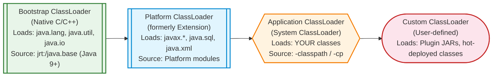
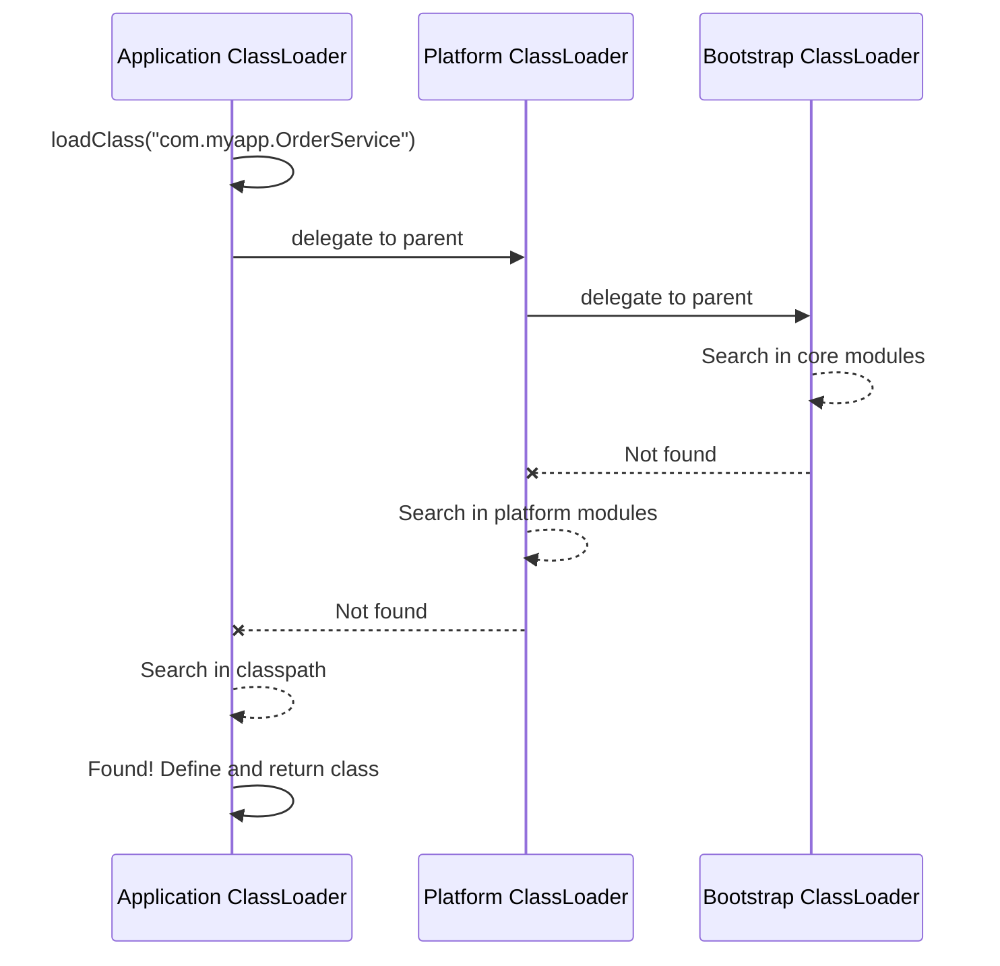
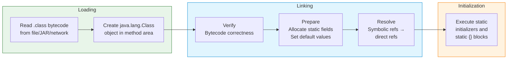
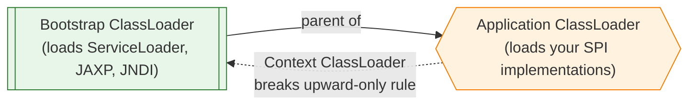

# Java ClassLoaders — Deep Dive for Interviews

ClassLoaders are the gatekeepers of the JVM. Every class you use -- from `java.lang.String` to your own `UserService` -- is loaded into memory by a ClassLoader. Understanding how they work is critical for debugging `ClassNotFoundException`, `NoClassDefFoundError`, and classloading conflicts in frameworks like Spring, Tomcat, and OSGi. This topic bridges JVM internals, application servers, and modular architecture.

---

## ClassLoader Hierarchy

The JVM uses a **three-tier hierarchy** of classloaders, each responsible for loading classes from a specific location.



| ClassLoader | Parent | What It Loads | Location (Java 8) | Location (Java 9+) |
|---|---|---|---|---|
| **Bootstrap** | None (native) | Core Java classes (`java.lang.*`, `java.util.*`) | `rt.jar`, `jre/lib/` | `jrt:/java.base` modules |
| **Platform** (Extension) | Bootstrap | Platform extensions (`javax.*`, `java.sql.*`) | `jre/lib/ext/` | Platform modules |
| **Application** (System) | Platform | Your application classes | `-classpath` / `-cp` | `-classpath` / module path |

```java
public class ClassLoaderDemo {
    public static void main(String[] args) {
        // Bootstrap ClassLoader (returns null -- implemented in native code)
        System.out.println(String.class.getClassLoader());        // null

        // Platform ClassLoader (Java 9+) / Extension ClassLoader (Java 8)
        System.out.println(java.sql.Driver.class.getClassLoader()); 
        // jdk.internal.loader.ClassLoaders$PlatformClassLoader

        // Application ClassLoader
        System.out.println(ClassLoaderDemo.class.getClassLoader());
        // jdk.internal.loader.ClassLoaders$AppClassLoader
    }
}
```

!!! warning "Bootstrap returns null"
    `String.class.getClassLoader()` returns `null` because the Bootstrap ClassLoader is implemented in native code (C/C++), not as a Java object. Always null-check when walking the classloader chain.

---

## Delegation Model (Parent-First)

The most important principle: **a classloader always delegates to its parent before attempting to load a class itself.** This is called the **parent-first** or **parent-delegation** model.



**Why delegation matters:**

1. **Security** -- Prevents user code from replacing core classes. You cannot write your own `java.lang.String` and have it loaded instead of the real one.
2. **Uniqueness** -- A class is uniquely identified by its **fully qualified name + the classloader that loaded it**. Delegation ensures core classes are loaded only once.
3. **Consistency** -- All classes see the same `java.lang.Object` from the Bootstrap loader.

```java
// Simplified view of how ClassLoader.loadClass() works
protected Class<?> loadClass(String name, boolean resolve) throws ClassNotFoundException {
    // 1. Check if already loaded
    Class<?> c = findLoadedClass(name);

    if (c == null) {
        try {
            // 2. Delegate to parent
            if (parent != null) {
                c = parent.loadClass(name, false);
            } else {
                // 3. Bootstrap ClassLoader (no Java parent)
                c = findBootstrapClassOrNull(name);
            }
        } catch (ClassNotFoundException e) {
            // Parent could not find it -- expected
        }

        if (c == null) {
            // 4. Try to find it ourselves
            c = findClass(name);
        }
    }

    if (resolve) {
        resolveClass(c);
    }
    return c;
}
```

!!! info "Parent-first vs Child-first"
    Application servers like **Tomcat** break the standard delegation model. Tomcat's `WebAppClassLoader` uses **child-first** loading for web applications -- it searches the WAR's `WEB-INF/classes` and `WEB-INF/lib` **before** delegating to the parent. This allows different web apps to use different versions of the same library.

---

## Class Loading Phases

When the JVM loads a class, it goes through three major phases: **Loading**, **Linking**, and **Initialization**.



### Phase 1: Loading

The classloader reads the `.class` file (from disk, JAR, network, or even generated at runtime) and creates a `java.lang.Class` object representing it in the method area (Metaspace).

### Phase 2: Linking

Linking has three sub-phases:

| Sub-phase | What Happens | Failure |
|---|---|---|
| **Verify** | Validates bytecode structure, magic number (`0xCAFEBABE`), version compatibility, type safety | `VerifyError` |
| **Prepare** | Allocates memory for static fields and sets them to **default values** (0, null, false) -- not the values from your code | -- |
| **Resolve** | Converts symbolic references (class names in the constant pool) to direct memory references | `NoClassDefFoundError` |

!!! note "Prepare vs Initialization"
    During **Prepare**, `static int count = 42;` is set to `0` (the default). Only during **Initialization** is it set to `42`. This distinction matters for understanding static field ordering bugs.

### Phase 3: Initialization

The JVM executes:

- Static variable assignments (`static int x = 10;`)
- Static initializer blocks (`static { ... }`)

In the order they appear in the source code, from top to bottom.

```java
public class InitOrder {
    static int a = 10;                  // Step 1: a = 10
    static int b;                       // Step 2: b remains 0 (from Prepare)

    static {
        b = a * 2;                      // Step 3: b = 20
        System.out.println("Static block: a=" + a + ", b=" + b);
    }

    static int c = b + 5;              // Step 4: c = 25
}
```

**When does initialization happen?**

- First `new` instance of the class
- Calling a static method
- Accessing a static field (unless it is a compile-time constant)
- `Class.forName("com.example.MyClass")` (by default)
- Subclass initialization triggers parent initialization first

---

## Class.forName() vs ClassLoader.loadClass()

This is a classic interview question. Both load classes, but they behave differently regarding initialization.

| Aspect | `Class.forName(name)` | `classLoader.loadClass(name)` |
|---|---|---|
| **Initialization** | Runs static initializers | Does NOT run static initializers |
| **ClassLoader used** | Caller's classloader | The specified classloader |
| **Use case** | JDBC drivers, Service providers | Lazy loading, frameworks |
| **Overloaded form** | `Class.forName(name, initialize, loader)` | -- |

```java
// Triggers static initialization -- essential for JDBC driver registration
Class.forName("com.mysql.cj.jdbc.Driver");
// The Driver class has: static { DriverManager.registerDriver(new Driver()); }

// Does NOT trigger initialization -- just loads the bytecode
ClassLoader cl = Thread.currentThread().getContextClassLoader();
Class<?> clazz = cl.loadClass("com.mysql.cj.jdbc.Driver");
// Driver is NOT registered yet!

// Explicit control: load but don't initialize
Class.forName("com.mysql.cj.jdbc.Driver", false, cl);
```

!!! tip "Modern JDBC (Java 6+)"
    Since Java 6, JDBC drivers are discovered automatically via `ServiceLoader` (using `META-INF/services`). You no longer need `Class.forName()` for driver registration, but the question still appears in interviews.

---

## Custom ClassLoader Implementation

Writing a custom classloader is essential for plugin systems, hot deployment, and sandboxing.

```java
public class PluginClassLoader extends ClassLoader {

    private final Path pluginDir;

    public PluginClassLoader(Path pluginDir, ClassLoader parent) {
        super(parent);  // set parent for delegation
        this.pluginDir = pluginDir;
    }

    @Override
    protected Class<?> findClass(String name) throws ClassNotFoundException {
        // Convert com.example.MyPlugin -> com/example/MyPlugin.class
        String fileName = name.replace('.', File.separatorChar) + ".class";
        Path classFile = pluginDir.resolve(fileName);

        try {
            byte[] bytes = Files.readAllBytes(classFile);

            // defineClass: converts raw bytes into a Class object
            // This is the critical method -- only ClassLoader can call it
            return defineClass(name, bytes, 0, bytes.length);
        } catch (IOException e) {
            throw new ClassNotFoundException("Could not load " + name, e);
        }
    }
}
```

```java
// Usage
Path pluginDir = Path.of("/opt/app/plugins");
PluginClassLoader loader = new PluginClassLoader(pluginDir, 
    ClassLoader.getSystemClassLoader());

Class<?> pluginClass = loader.loadClass("com.vendor.AnalyticsPlugin");
Object plugin = pluginClass.getDeclaredConstructor().newInstance();

// Cast to a shared interface (loaded by the parent classloader)
Plugin p = (Plugin) plugin;
p.execute();
```

!!! warning "ClassCastException trap"
    If the `Plugin` interface is loaded by **different classloaders** in the parent and child, casting will throw `ClassCastException` even though the types have the same name. A class identity in the JVM is `(fully qualified name, classloader)` -- both must match.

### Key Methods in `java.lang.ClassLoader`

| Method | Purpose |
|---|---|
| `loadClass(String)` | Entry point -- implements delegation model |
| `findClass(String)` | Override this in custom classloaders to define where classes come from |
| `defineClass(byte[])` | Converts raw bytes to a `Class<?>` object -- called by `findClass` |
| `findLoadedClass(String)` | Checks if this loader has already loaded the class |
| `getParent()` | Returns the parent classloader |
| `getResource(String)` | Finds a resource (file) on the classpath |

---

## Context ClassLoader

Every thread has a **context classloader** accessible via `Thread.currentThread().getContextClassLoader()`. It exists to solve a specific problem with the delegation model.

**The problem:** Core Java classes (loaded by Bootstrap) sometimes need to load user-provided implementations (SPI pattern). But Bootstrap cannot see classes on the application classpath because delegation only goes upward.



```java
// How ServiceLoader uses the context classloader internally
public static <S> ServiceLoader<S> load(Class<S> service) {
    ClassLoader cl = Thread.currentThread().getContextClassLoader();
    return new ServiceLoader<>(service, cl);
}

// Setting a custom context classloader (common in app servers)
Thread.currentThread().setContextClassLoader(myCustomLoader);
try {
    // Code here will use myCustomLoader for SPI lookups
    ServiceLoader<Plugin> plugins = ServiceLoader.load(Plugin.class);
} finally {
    // Always restore the original
    Thread.currentThread().setContextClassLoader(originalLoader);
}
```

!!! info "When to use the Context ClassLoader"
    Use it when writing library code that needs to find classes provided by the caller. Frameworks like **Spring**, **JNDI**, **JAXB**, and **JDBC's ServiceLoader** all rely on the context classloader. In most application code you never need to touch it directly.

---

## Class Unloading and PermGen / Metaspace

### PermGen (Java 7 and earlier)

- Class metadata was stored in a fixed-size region called **Permanent Generation** (part of the heap).
- Default size: 64MB (configurable with `-XX:MaxPermSize`).
- Frequent cause of `java.lang.OutOfMemoryError: PermGen space` in application servers with many redeployments.

### Metaspace (Java 8+)

- Class metadata moved to **native memory** (outside the heap).
- Grows dynamically by default -- no fixed upper bound (but you can set one with `-XX:MaxMetaspaceSize`).
- Eliminated `PermGen space` errors, but Metaspace leaks are still possible.

| Aspect | PermGen (Java <= 7) | Metaspace (Java 8+) |
|---|---|---|
| **Location** | Inside the heap | Native memory (off-heap) |
| **Default size** | 64MB (fixed) | Unlimited (grows dynamically) |
| **Tuning** | `-XX:MaxPermSize=256m` | `-XX:MaxMetaspaceSize=512m` |
| **OOM Error** | `OutOfMemoryError: PermGen space` | `OutOfMemoryError: Metaspace` |
| **GC behavior** | Collected during Full GC | Collected when classloader is GC'd |

### When Can a Class Be Unloaded?

A class can be garbage collected **only if all three conditions are met:**

1. All instances of the class have been garbage collected.
2. The `Class<?>` object itself is unreachable.
3. The **ClassLoader** that loaded the class has been garbage collected.

!!! danger "Application server leaks"
    This is why hot redeployments in Tomcat can leak Metaspace. If even one object from the old classloader is referenced (e.g., a static field, a ThreadLocal, a registered JDBC driver), the entire classloader and all its classes cannot be garbage collected.

```java
// Common leak pattern: ThreadLocal holding a reference to a webapp class
public class LeakyService {
    // This ThreadLocal holds a reference to a class loaded by the WebAppClassLoader
    private static final ThreadLocal<ExpensiveObject> cache = 
        ThreadLocal.withInitial(ExpensiveObject::new);
    // If this thread is a server thread that outlives the webapp,
    // the WebAppClassLoader can never be GC'd
}
```

---

## ClassNotFoundException vs NoClassDefFoundError

Another top interview question. They sound similar but have very different root causes.

| Aspect | `ClassNotFoundException` | `NoClassDefFoundError` |
|---|---|---|
| **Type** | Checked Exception | Error (unchecked) |
| **When** | Runtime -- explicit loading attempt | Runtime -- class was available at compile time but missing at runtime |
| **Cause** | Class not on classpath | Class was found once but failed to load (e.g., static initializer threw exception) |
| **Triggered by** | `Class.forName()`, `ClassLoader.loadClass()` | JVM tries to use a class it cannot resolve |
| **Recovery** | Possible (catch and handle) | Usually fatal |

```java
// ClassNotFoundException -- the class is simply not on the classpath
try {
    Class<?> clazz = Class.forName("com.nonexistent.MyClass");
} catch (ClassNotFoundException e) {
    System.out.println("Class not found: " + e.getMessage());
}

// NoClassDefFoundError -- class existed at compile time but fails at runtime
// Scenario: PaymentProcessor depends on StripeSDK, which is missing from the runtime JAR
public class OrderService {
    public void processPayment() {
        // Compiles fine, but if stripe-sdk.jar is missing at runtime:
        // java.lang.NoClassDefFoundError: com/stripe/StripeClient
        StripeClient client = new StripeClient();
    }
}
```

!!! tip "The static initializer trap"
    A common cause of `NoClassDefFoundError` is a static initializer that throws an exception. The **first** attempt to load the class throws `ExceptionInInitializerError`. Every **subsequent** attempt throws `NoClassDefFoundError` because the JVM marks the class as failed.

```java
public class BrokenConfig {
    static {
        // This throws an exception during class initialization
        String value = System.getProperty("missing.property");
        int parsed = Integer.parseInt(value); // NullPointerException!
    }
}

// First access:  ExceptionInInitializerError (wraps NullPointerException)
// Second access: NoClassDefFoundError (class permanently marked as failed)
```

---

## URLClassLoader

`URLClassLoader` is the most commonly used classloader for loading classes from JARs or directories at runtime. It extends `ClassLoader` and accepts an array of URLs.

```java
// Load classes from external JARs at runtime
URL[] urls = {
    new File("/opt/plugins/analytics.jar").toURI().toURL(),
    new File("/opt/plugins/reporting.jar").toURI().toURL()
};

// Parent = system classloader for delegation
try (URLClassLoader loader = new URLClassLoader(urls, 
        ClassLoader.getSystemClassLoader())) {

    Class<?> reportClass = loader.loadClass("com.vendor.ReportGenerator");
    Object generator = reportClass.getDeclaredConstructor().newInstance();

    // Use reflection or a shared interface to invoke methods
    Method generate = reportClass.getMethod("generate", String.class);
    generate.invoke(generator, "Q4-2025");
}
// URLClassLoader implements Closeable -- always close to release JAR file handles
```

!!! warning "URLClassLoader removed from System ClassLoader in Java 9+"
    In Java 8, `ClassLoader.getSystemClassLoader()` returned a `URLClassLoader`, so you could cast it and call `addURL()` to dynamically add JARs to the classpath. This **no longer works** in Java 9+ because the system classloader is now `jdk.internal.loader.ClassLoaders$AppClassLoader`. Use a separate `URLClassLoader` instance instead.

---

## Module System Impact (Java 9+)

Java 9 introduced the **Java Platform Module System (JPMS)**, which significantly changes how classloading works.

### Key Changes

| Pre-Java 9 | Java 9+ |
|---|---|
| Extension ClassLoader | **Platform ClassLoader** (renamed) |
| `rt.jar` (monolithic) | Modular `jrt:/` images |
| All packages accessible | Strong encapsulation by default |
| System classloader is `URLClassLoader` | System classloader is internal class |
| Classpath only | Classpath + **module path** |

### Module Encapsulation and ClassLoaders

```java
// Pre-Java 9: Any class could access any public class
// Java 9+: Modules must explicitly export packages

module com.myapp {
    requires java.sql;           // dependency on java.sql module
    requires java.logging;       // dependency on java.logging module
    exports com.myapp.api;       // only this package is visible to other modules
    opens com.myapp.internal to spring.core;  // allow reflection from Spring
}
```

```java
// Accessing module info at runtime
Module mod = String.class.getModule();
System.out.println(mod.getName());        // java.base
System.out.println(mod.getDescriptor());  // module descriptor

ModuleLayer layer = ModuleLayer.boot();
layer.modules().forEach(m -> System.out.println(m.getName()));
```

!!! info "The unnamed module"
    Classes on the classpath (not the module path) are placed in the **unnamed module**, which can read all named modules. This is why legacy non-modular code still works in Java 9+. But named modules cannot read the unnamed module unless explicitly configured.

---

## Hot Deployment and Class Reloading

The JVM does **not** support reloading a class with the same classloader. To reload a class, you must create a **new classloader instance** and load the updated class through it.

```java
public class HotReloader {
    private PluginClassLoader currentLoader;
    private Plugin activePlugin;

    public void reload() throws Exception {
        // 1. Discard old classloader (allows GC of old classes)
        if (currentLoader != null) {
            currentLoader = null;  // eligible for GC
        }

        // 2. Create a fresh classloader
        currentLoader = new PluginClassLoader(
            Path.of("/opt/app/plugins"),
            ClassLoader.getSystemClassLoader()
        );

        // 3. Load the updated class
        Class<?> pluginClass = currentLoader.loadClass("com.vendor.AnalyticsPlugin");
        activePlugin = (Plugin) pluginClass.getDeclaredConstructor().newInstance();

        System.out.println("Plugin reloaded successfully");
    }
}
```

**How frameworks handle it:**

| Framework | Strategy |
|---|---|
| **Spring Boot DevTools** | Creates a separate "restart" classloader for application classes; base classloader for dependencies stays loaded |
| **JRebel** | Uses Java agent instrumentation to redefine classes without restarting |
| **Tomcat** | Discards the entire `WebAppClassLoader` and creates a new one on redeploy |
| **OSGi** | Each bundle has its own classloader; bundles can be stopped, updated, and restarted independently |

!!! note "Java Instrumentation API"
    `java.lang.instrument.Instrumentation.redefineClasses()` can replace method bodies of already-loaded classes without creating a new classloader, but it cannot change the class schema (add/remove fields or methods). DCEVM (Dynamic Code Evolution VM) extends this to support structural changes.

---

## Common Problems and Debugging

### Problem 1: ClassLoader Leaks in Application Servers

**Symptom:** `OutOfMemoryError: Metaspace` after multiple hot redeployments.

**Root cause:** A reference from outside the webapp classloader (e.g., a JDBC driver registered in `DriverManager`, a shutdown hook, a `ThreadLocal`) prevents the old `WebAppClassLoader` from being garbage collected.

```java
// Fix: Deregister JDBC drivers on shutdown
@WebListener
public class CleanupListener implements ServletContextListener {
    @Override
    public void contextDestroyed(ServletContextEvent sce) {
        Enumeration<Driver> drivers = DriverManager.getDrivers();
        while (drivers.hasMoreElements()) {
            Driver driver = drivers.nextElement();
            if (driver.getClass().getClassLoader() == getClass().getClassLoader()) {
                try {
                    DriverManager.deregisterDriver(driver);
                } catch (SQLException e) {
                    // log warning
                }
            }
        }
    }
}
```

### Problem 2: Duplicate Classes from Different Classloaders

**Symptom:** `ClassCastException: com.example.User cannot be cast to com.example.User`

**Diagnosis:** The same class loaded by two different classloaders creates two distinct `Class` objects.

```java
// Debugging classloader identity
System.out.println("Class: " + obj.getClass().getName());
System.out.println("ClassLoader: " + obj.getClass().getClassLoader());
System.out.println("Target ClassLoader: " + User.class.getClassLoader());
System.out.println("Same class? " + (obj.getClass() == User.class));
```

### Problem 3: Resources Not Found

**Symptom:** `getResource()` or `getResourceAsStream()` returns null.

```java
// Wrong: looks relative to the ClassLoader root
InputStream is = MyClass.class.getResourceAsStream("config.properties");

// Right: absolute path from classpath root
InputStream is = MyClass.class.getResourceAsStream("/config.properties");

// Alternative: use the classloader directly (always absolute)
InputStream is = MyClass.class.getClassLoader()
    .getResourceAsStream("config.properties");
```

### Debugging Commands

```bash
# Print classloader hierarchy for the running JVM
java -verbose:class -jar myapp.jar 2>&1 | grep "Loading"

# Show which JAR a class was loaded from
java -verbose:class MyApp 2>&1 | grep "UserService"
# [0.234s][info][class,load] com.myapp.UserService source: file:/app/lib/service.jar

# Heap dump to find classloader leaks
jmap -dump:format=b,file=heap.hprof <pid>
# Then analyze with Eclipse MAT -> "Duplicate Classes" report

# Check Metaspace usage
jcmd <pid> VM.metaspace
```

---

## Interview Questions

??? question "What are the three built-in ClassLoaders in Java and what does each one load?"
    **Bootstrap ClassLoader** (native C/C++): Loads core Java classes from `java.base` module (`java.lang.*`, `java.util.*`, `java.io.*`). Returns `null` when accessed via `getClassLoader()`.

    **Platform ClassLoader** (called Extension ClassLoader before Java 9): Loads platform extension classes (`javax.*`, `java.sql.*`, `java.xml.*`). Loaded from platform modules (or `jre/lib/ext/` in Java 8).

    **Application ClassLoader** (System ClassLoader): Loads your application classes from the classpath (`-cp` / `-classpath` or `CLASSPATH` environment variable). This is the default classloader for your code.

    The hierarchy is Bootstrap -> Platform -> Application. Each classloader delegates to its parent before trying to load a class itself.

??? question "Explain the parent delegation model. Why does Java use it?"
    When a classloader receives a request to load a class, it **does not try to load it itself first**. Instead it delegates to its parent, which delegates to its parent, all the way up to the Bootstrap ClassLoader. Only if the parent fails does the child attempt to load the class.

    Java uses this for three reasons: (1) **Security** -- prevents malicious code from replacing core classes like `java.lang.String`. (2) **Uniqueness** -- ensures core classes are loaded only once by the topmost capable loader. (3) **Consistency** -- all code shares the same `java.lang.Object`, `java.lang.String`, etc.

??? question "What is the difference between Class.forName() and ClassLoader.loadClass()?"
    `Class.forName("com.example.Foo")` loads the class **and** runs its static initializers. This was essential for JDBC driver registration where the driver registers itself in a `static {}` block.

    `ClassLoader.loadClass("com.example.Foo")` loads the class but does **not** run static initializers -- it only performs the Loading and Linking phases. Initialization happens later when the class is first actively used.

    You can control initialization explicitly with the three-argument form: `Class.forName("com.example.Foo", false, classLoader)` where the second parameter controls whether to initialize.

??? question "What is the difference between ClassNotFoundException and NoClassDefFoundError?"
    `ClassNotFoundException` is a **checked exception** thrown when you explicitly try to load a class that does not exist on the classpath (via `Class.forName()` or `ClassLoader.loadClass()`).

    `NoClassDefFoundError` is an **Error** (unchecked) thrown when the JVM or classloader tries to load a class that was present at compile time but is missing (or failed to initialize) at runtime. A common cause is a static initializer that throws an exception -- the first load throws `ExceptionInInitializerError`, and all subsequent attempts throw `NoClassDefFoundError`.

    Key difference: `ClassNotFoundException` means "never found," while `NoClassDefFoundError` often means "found once but failed."

??? question "How do you write a custom ClassLoader? Which method should you override?"
    Extend `java.lang.ClassLoader` and override the `findClass(String name)` method. Do **not** override `loadClass()` -- that would break the delegation model.

    In `findClass()`: (1) Read the `.class` file bytes from your custom source (file system, network, database, etc.). (2) Call `defineClass(name, bytes, 0, bytes.length)` to convert the raw bytes into a `Class<?>` object. (3) Throw `ClassNotFoundException` if the class cannot be found.

    Always pass a parent classloader to the constructor via `super(parent)` so delegation works correctly.

??? question "What is the Thread Context ClassLoader and why does it exist?"
    The context classloader (accessed via `Thread.currentThread().getContextClassLoader()`) exists to solve a limitation of the parent-delegation model. Core Java classes loaded by the Bootstrap ClassLoader sometimes need to load user-provided implementations (SPI pattern -- e.g., JDBC drivers, JAXP parsers, JNDI providers). But Bootstrap cannot delegate **downward** to the Application ClassLoader.

    The context classloader provides a backdoor: `ServiceLoader` and other SPI mechanisms use `Thread.currentThread().getContextClassLoader()` to find and load implementation classes from the application classpath, even when the SPI framework code itself was loaded by Bootstrap.

    By default, the context classloader is the Application ClassLoader, but frameworks like Tomcat set it to the web application's classloader for each request thread.

??? question "Can a class be unloaded from the JVM? Under what conditions?"
    Yes, but only if **all three conditions** are met: (1) All instances of the class have been garbage collected. (2) The `java.lang.Class` object representing the class is unreachable. (3) The ClassLoader that loaded the class has been garbage collected.

    In practice, classes loaded by the Bootstrap, Platform, or Application ClassLoaders are **never unloaded** because these classloaders live for the lifetime of the JVM. Only classes loaded by custom classloaders can be unloaded when the custom classloader itself is GC'd.

    This is the basis for hot deployment: discard the old classloader, create a new one, and reload the updated classes.

??? question "Why did Java replace PermGen with Metaspace in Java 8?"
    PermGen was a **fixed-size** region of the heap (default 64MB) that stored class metadata. It was a constant source of `OutOfMemoryError: PermGen space`, especially in application servers with frequent redeployments or applications that generated many classes dynamically (e.g., heavy use of reflection proxies, Groovy/Scala).

    Metaspace uses **native memory** (outside the heap), grows dynamically, and is only limited by available system memory (unless you set `-XX:MaxMetaspaceSize`). It is garbage collected when the classloader that loaded the classes is GC'd, making it much more efficient for dynamic class loading scenarios.

??? question "How do application servers like Tomcat handle classloading for web applications?"
    Tomcat uses a **child-first** (parent-last) classloading model that inverts the standard delegation. Each web application gets its own `WebAppClassLoader` that searches `WEB-INF/classes` and `WEB-INF/lib` **before** delegating to the parent.

    This allows: (1) Each webapp can use different versions of the same library. (2) Webapps are isolated from each other. (3) Redeployment works by discarding the old `WebAppClassLoader` and creating a new one.

    The exception is classes from `java.*` and `javax.*` packages -- these always delegate to the parent to maintain security and consistency. Tomcat follows the Servlet specification's recommended classloading order: Bootstrap -> System -> Webapp (WEB-INF) -> Common.

??? question "How does the Java 9 Module System affect classloading?"
    Java 9 introduced several changes: (1) The Extension ClassLoader was renamed to **Platform ClassLoader**. (2) The monolithic `rt.jar` was replaced by modular runtime images (`jrt:/`). (3) The system classloader is no longer a `URLClassLoader` -- you cannot cast and call `addURL()`. (4) **Strong encapsulation** means modules must explicitly export packages; internal packages are inaccessible by default, even via reflection (unless `opens` is declared).

    Classes on the classpath are placed in the **unnamed module**, which can read all named modules but is not readable by named modules. The `--add-opens` and `--add-reads` flags allow overriding module boundaries at launch time, often needed for frameworks like Spring and Hibernate that rely on deep reflection.

---

## Quick Reference Cheat Sheet

```
┌────────────────────────────────────────────────────────────────────┐
│                     CLASSLOADER CHEAT SHEET                        │
├────────────────────────────────────────────────────────────────────┤
│                                                                    │
│  Bootstrap (null)  ──loads──>  java.lang.*, java.util.*           │
│       ↑ parent                                                     │
│  Platform          ──loads──>  javax.*, java.sql.*                │
│       ↑ parent                                                     │
│  Application       ──loads──>  Your classes (-cp)                 │
│       ↑ parent                                                     │
│  Custom            ──loads──>  Plugins, hot-deployed code         │
│                                                                    │
├────────────────────────────────────────────────────────────────────┤
│  LOADING PHASES:  Load → Verify → Prepare → Resolve → Initialize │
├────────────────────────────────────────────────────────────────────┤
│  Class.forName()        →  loads + initializes                    │
│  ClassLoader.loadClass  →  loads only (no init)                   │
├────────────────────────────────────────────────────────────────────┤
│  ClassNotFoundException →  class not on classpath (checked)       │
│  NoClassDefFoundError   →  class failed to load (unchecked)      │
├────────────────────────────────────────────────────────────────────┤
│  Class identity = fully qualified name + ClassLoader instance     │
│  Class unloading = only when ClassLoader is GC'd                  │
│  PermGen (<=7) → Metaspace (8+) → native memory, dynamic size    │
└────────────────────────────────────────────────────────────────────┘
```
