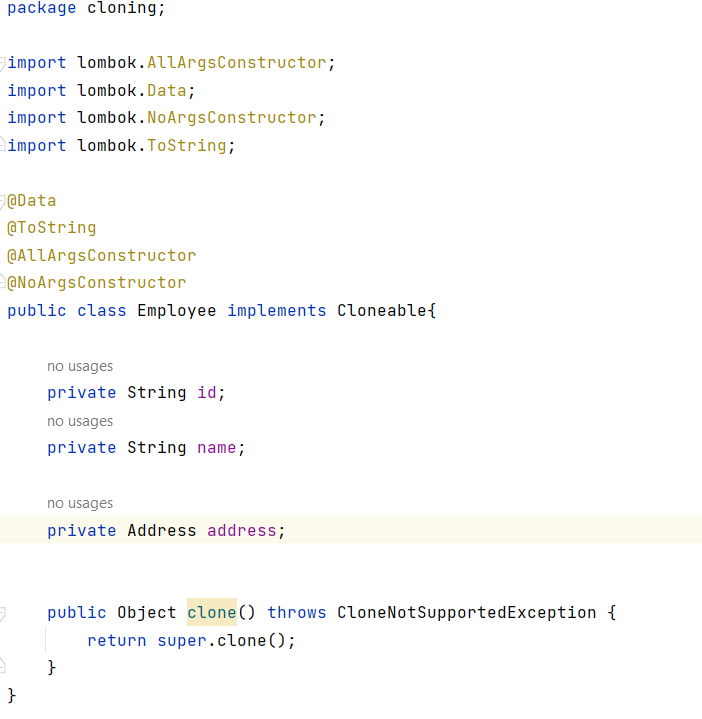
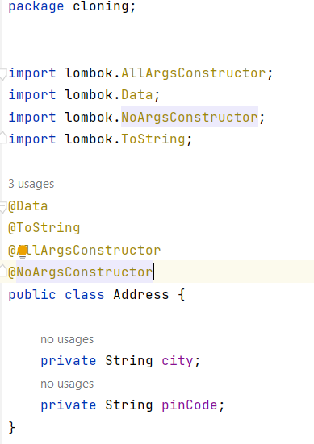
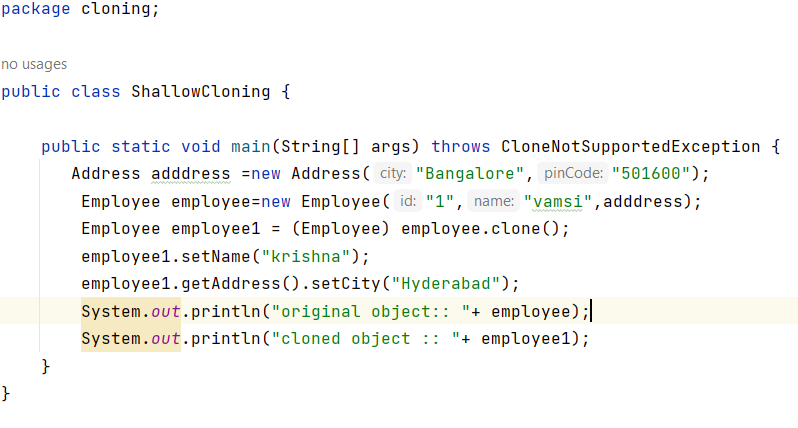
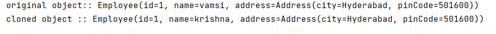
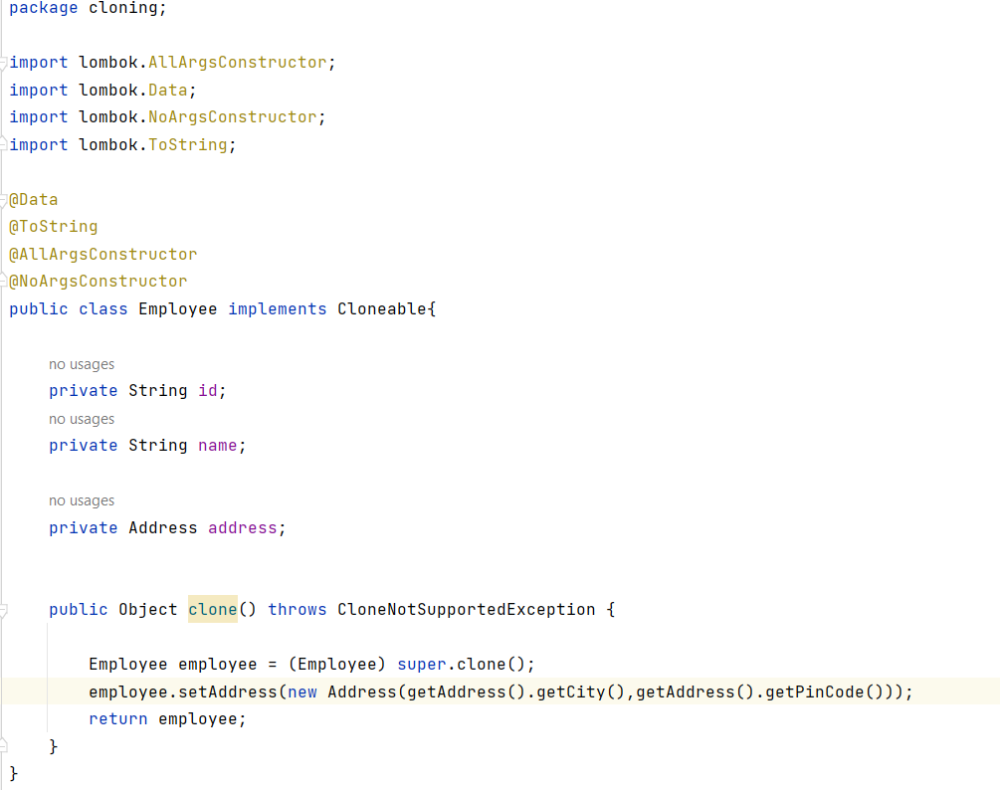
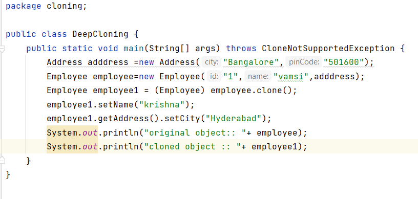
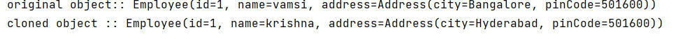

## Cloning
* The process of creating duplicate copy of an object.
* If you want to quickly create an object using the existing object in such a way that you get a new instance (reference is not shared) with the same cintent for the fields in the new object as in
  existing object.
* That's when tou can use clone() method which creates an exact copy of the existing object.Then  you can modify the cloned object without those
  modification reflecting in original.

**clone() method**

* clone() method is defined as protected in the Object class which you must override as public
  in any derived classes that tou want to clone.

**Advantages of cloning**

* If you have an object, creation of which using the usual way is costly, as
  example if you have to call DB in order to get data to create  and initialize your object.
  In that scenario rather than hitting DB every time to create and initialize your object.In that scenario rather than hitting DB every time to create your object you can cache it, clone it when object is needed and update  it in DB only when needed.
* There is a design pattern called prototype design pattern which suggests the same approach.

**Types Of Cloning**

a) Shallow copy cloning:

* The default version of clone() method creates the shallow copy of an object.
* The shallow copy of an object will have exact copy of all the fields of original object.
* If original object has any references to other objects as fields, then only references of those objects are copied into clone object, copy of those objects are not created. That means any changes made to those objects through clone object will be reflected in original object or vice-versa.
* Shallow copy is not 100% disjoint from original object. Shallow copy is not 100% independent of original object.

b) Deep copy cloning

* Deep copy of an object will have exact copy of all the fields of original object just like shallow copy.
* But in additional, if original object has any references to other objects as fields, then copy of those objects are also created by calling clone() method on them.
* That means clone object and original object will be 100% disjoint.
* They will be 100% independent of each other. Any changes made to clone object will not be reflected in original object or vice-versa.

