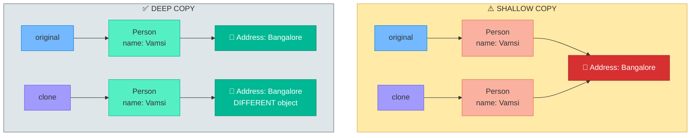

# Cloning in Java — Shallow vs Deep Copy

Cloning creates a **copy of an object**. Java provides `Object.clone()`, but it's a tricky API with well-known pitfalls. Understanding shallow vs deep copy is essential for interviews.

---

## Shallow Copy vs Deep Copy


```mermaid
graph TD
    subgraph SHALLOW["⚠️ SHALLOW COPY"]
        SO["original"] --> SP["Person<br/>name: Vamsi"]
        SP --> SA["📍 Address: Bangalore"]
        SC["clone"] --> SP2["Person<br/>name: Vamsi"]
        SP2 --> SA
    end

    subgraph DEEP["✅ DEEP COPY"]
        DO["original"] --> DP["Person<br/>name: Vamsi"]
        DP --> DA["📍 Address: Bangalore"]
        DC["clone"] --> DP2["Person<br/>name: Vamsi"]
        DP2 --> DA2["📍 Address: Bangalore<br/>DIFFERENT object"]
    end

    style SHALLOW fill:#ffeaa7,stroke:#d4a84b,color:#333
    style DEEP fill:#dfe6e9,stroke:#636e72,color:#333
    style SO fill:#74b9ff,stroke:#0984e3,color:#333
    style SC fill:#a29bfe,stroke:#6c5ce7,color:#333
    style SP fill:#fab1a0,stroke:#e17055,color:#333
    style SP2 fill:#fab1a0,stroke:#e17055,color:#333
    style SA fill:#d63031,stroke:#a02525,color:#fff
    style DO fill:#74b9ff,stroke:#0984e3,color:#333
    style DC fill:#a29bfe,stroke:#6c5ce7,color:#333
    style DP fill:#55efc4,stroke:#00b894,color:#333
    style DP2 fill:#55efc4,stroke:#00b894,color:#333
    style DA fill:#00b894,stroke:#008c6e,color:#fff
    style DA2 fill:#00b894,stroke:#008c6e,color:#fff
```

| Aspect | Shallow Copy | Deep Copy |
|---|---|---|
| Primitive fields | Copied by value | Copied by value |
| Object references | Copies the reference (same object) | Creates new objects recursively |
| Independence | Partial — shared references | Full — completely independent |
| Performance | Fast | Slower (more objects created) |

---

## Using `Object.clone()` — Shallow Copy

### Step 1: Implement `Cloneable` and override `clone()`

```java
public class Employee implements Cloneable {
    private String name;
    private int age;
    private Address address;  // reference type

    public Employee(String name, int age, Address address) {
        this.name = name;
        this.age = age;
        this.address = address;
    }

    @Override
    public Employee clone() throws CloneNotSupportedException {
        return (Employee) super.clone();  // shallow copy
    }
}

public class Address {
    private String city;
    private String zip;

    public Address(String city, String zip) {
        this.city = city;
        this.zip = zip;
    }
}
```

### The Problem with Shallow Copy

```java
Address addr = new Address("Bangalore", "560001");
Employee original = new Employee("Vamsi", 27, addr);
Employee clone = original.clone();

clone.getAddress().setCity("Hyderabad");

System.out.println(original.getAddress().getCity()); // "Hyderabad" — OOPS!
```

Both `original` and `clone` share the **same** `Address` object. Changing one affects the other.

---

## Deep Copy — Three Approaches

### Approach 1: Override `clone()` recursively

```java
public class Employee implements Cloneable {
    private String name;
    private int age;
    private Address address;

    @Override
    public Employee clone() throws CloneNotSupportedException {
        Employee cloned = (Employee) super.clone();
        cloned.address = this.address.clone();  // deep copy the address too
        return cloned;
    }
}

public class Address implements Cloneable {
    private String city;
    private String zip;

    @Override
    public Address clone() throws CloneNotSupportedException {
        return (Address) super.clone();
    }
}
```

Now `original.address` and `clone.address` are **different objects**.

### Approach 2: Copy Constructor (Recommended)

```java
public class Employee {
    private String name;
    private int age;
    private Address address;

    // Copy constructor
    public Employee(Employee other) {
        this.name = other.name;
        this.age = other.age;
        this.address = new Address(other.address);  // deep copy
    }
}

public class Address {
    private String city;
    private String zip;

    public Address(Address other) {
        this.city = other.city;
        this.zip = other.zip;
    }
}

// Usage
Employee clone = new Employee(original);
```

### Approach 3: Serialization (for complex object graphs)

```java
public static <T extends Serializable> T deepCopy(T object) {
    try {
        ByteArrayOutputStream bos = new ByteArrayOutputStream();
        ObjectOutputStream oos = new ObjectOutputStream(bos);
        oos.writeObject(object);

        ByteArrayInputStream bis = new ByteArrayInputStream(bos.toByteArray());
        ObjectInputStream ois = new ObjectInputStream(bis);
        return (T) ois.readObject();
    } catch (Exception e) {
        throw new RuntimeException("Deep copy failed", e);
    }
}
```

**Pros**: Works for any object graph depth. **Cons**: Slow, requires `Serializable`, not suitable for performance-critical code.

---

## Why `clone()` is Problematic

Joshua Bloch (Effective Java, Item 13): *"The Cloneable interface was intended to be a mixin interface, but it fails to serve that purpose."*

| Problem | Details |
|---|---|
| `Cloneable` is a marker interface | No `clone()` method — it's on `Object` with `protected` access |
| `CloneNotSupportedException` | Checked exception even when class implements `Cloneable` |
| Shallow by default | Must manually implement deep copy for every reference field |
| Bypasses constructor | `clone()` creates object without calling any constructor |
| Fragile with inheritance | Subclass must remember to call `super.clone()` |

**Best practice**: Prefer **copy constructors** or **static factory methods** over `clone()`.

---

## `String` and Immutable Objects — No Deep Copy Needed

`String` is **immutable** — it can't be changed after creation. So shallow copy is perfectly safe for `String` fields.

```java
String a = "Hello";
String b = a;  // both point to same object — but it's immutable, so no risk
```

This is why `clone()` for `Employee` doesn't need to deep-copy the `name` field.

---

## Interview Questions

??? question "1. What is the output?"
    ```java
    int[] arr1 = {1, 2, 3};
    int[] arr2 = arr1.clone();
    arr2[0] = 99;
    System.out.println(arr1[0]);
    ```

    **Output**: `1`. For arrays of **primitives**, `clone()` creates a deep copy (primitives are copied by value). But for arrays of **objects** (e.g., `Employee[]`), `clone()` is shallow — the references are copied, not the objects.

??? question "2. How do you clone an ArrayList?"
    `new ArrayList<>(original)` creates a shallow copy (same elements, new list). For deep copy, you need to clone each element: `original.stream().map(e -> new Employee(e)).collect(Collectors.toList())`.

??? question "3. Why does Effective Java recommend copy constructors over clone()?"
    Copy constructors: don't require `Cloneable`, don't throw checked exceptions, call constructors (so invariants are enforced), work well with `final` fields, and have clear deep/shallow semantics. `clone()` has none of these benefits and adds fragile behavior with inheritance.

??? question "4. If a class has only primitive fields and String fields, is shallow copy safe?"
    **Yes.** Primitives are copied by value, and `String` is immutable. A shallow copy is effectively a deep copy in this case. You only need deep copy when the class has **mutable object references** (like `Date`, `List`, custom objects).
