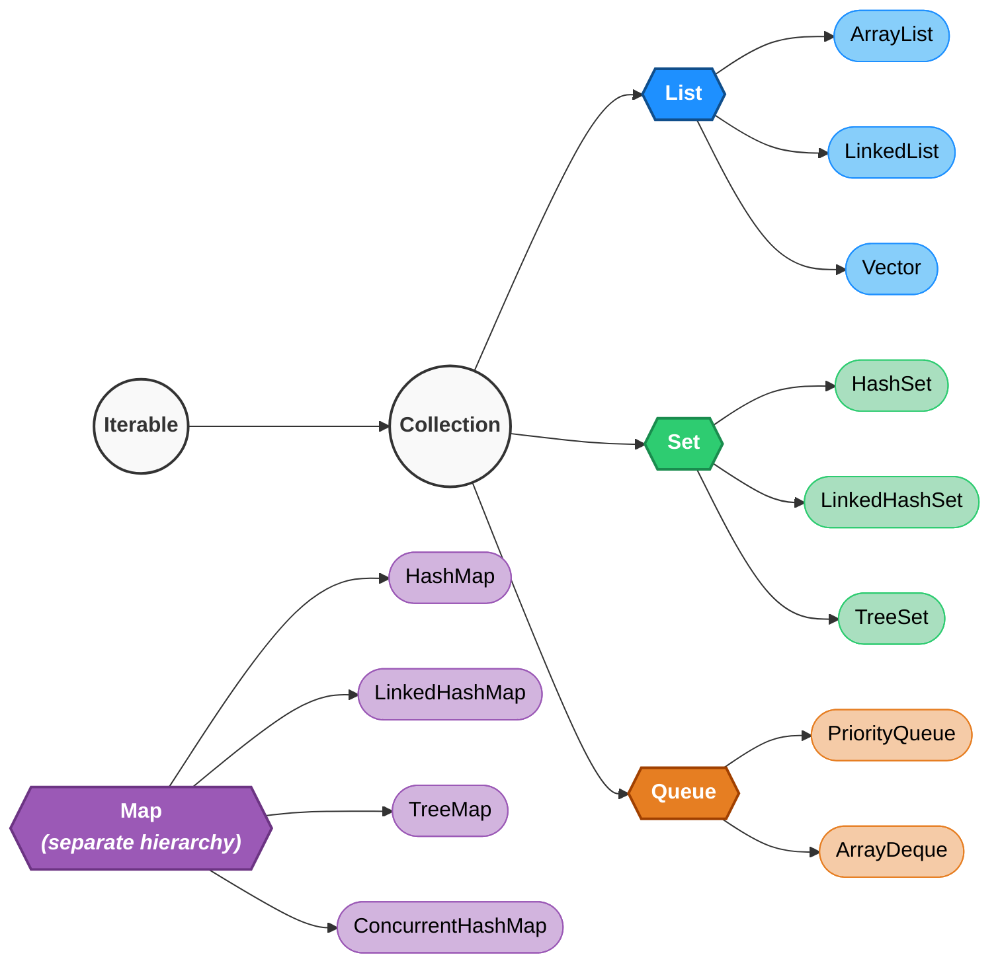
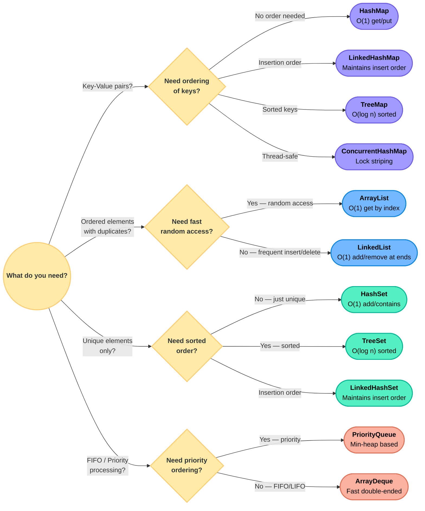

# Java Collections Framework

The Collections Framework is a unified architecture for storing and manipulating groups of objects. It's one of the most asked topics in Java interviews.

---

## Collection Hierarchy


```mermaid
flowchart LR
    %% Root
    Iterable(("<b>Iterable</b>")):::root --> Collection(("<b>Collection</b>")):::root

    %% Branches from Collection
    Collection --> List{{"<b>List</b>"}}:::listStyle
    Collection --> Set{{"<b>Set</b>"}}:::setStyle
    Collection --> Queue{{"<b>Queue</b>"}}:::queueStyle

    %% List implementations
    List --> ArrayList(["ArrayList"]):::listImpl
    List --> LinkedList(["LinkedList"]):::listImpl
    List --> Vector(["Vector"]):::listImpl

    %% Set implementations
    Set --> HashSet(["HashSet"]):::setImpl
    Set --> LinkedHashSet(["LinkedHashSet"]):::setImpl
    Set --> TreeSet(["TreeSet"]):::setImpl

    %% Queue implementations
    Queue --> PriorityQueue(["PriorityQueue"]):::queueImpl
    Queue --> ArrayDeque(["ArrayDeque"]):::queueImpl

    %% Map hierarchy (separate)
    MapRoot{{"<b>Map</b><br/><i>(separate hierarchy)</i>"}}:::mapStyle --> HashMap(["HashMap"]):::mapImpl
    MapRoot --> LinkedHashMap(["LinkedHashMap"]):::mapImpl
    MapRoot --> TreeMap(["TreeMap"]):::mapImpl
    MapRoot --> ConcurrentHashMap(["ConcurrentHashMap"]):::mapImpl

    %% Styles
    classDef root fill:#f9f9f9,stroke:#333,stroke-width:2px,color:#333
    classDef listStyle fill:#1e90ff,stroke:#104e8b,stroke-width:2px,color:#fff,font-weight:bold
    classDef listImpl fill:#87cefa,stroke:#1e90ff,stroke-width:1px,color:#000
    classDef setStyle fill:#2ecc71,stroke:#1a8c4e,stroke-width:2px,color:#fff,font-weight:bold
    classDef setImpl fill:#a9dfbf,stroke:#2ecc71,stroke-width:1px,color:#000
    classDef queueStyle fill:#e67e22,stroke:#a04000,stroke-width:2px,color:#fff,font-weight:bold
    classDef queueImpl fill:#f5cba7,stroke:#e67e22,stroke-width:1px,color:#000
    classDef mapStyle fill:#9b59b6,stroke:#6c3483,stroke-width:2px,color:#fff,font-weight:bold
    classDef mapImpl fill:#d2b4de,stroke:#9b59b6,stroke-width:1px,color:#000
```

### When to Use Which Collection (Decision Tree)


```mermaid
flowchart LR
    Start(("What do you need?")):::decision

    Start -->|"Key-Value pairs?"| MapQ{"Need ordering<br/>of keys?"}:::decision
    Start -->|"Ordered elements<br/>with duplicates?"| ListQ{"Need fast<br/>random access?"}:::decision
    Start -->|"Unique elements<br/>only?"| SetQ{"Need sorted<br/>order?"}:::decision
    Start -->|"FIFO / Priority<br/>processing?"| QueueQ{"Need priority<br/>ordering?"}:::decision

    %% Map branch
    MapQ -->|"No order needed"| HashMap2(["<b>HashMap</b><br/>O(1) get/put"]):::mapImpl
    MapQ -->|"Insertion order"| LinkedHashMap2(["<b>LinkedHashMap</b><br/>Maintains insert order"]):::mapImpl
    MapQ -->|"Sorted keys"| TreeMap2(["<b>TreeMap</b><br/>O(log n) sorted"]):::mapImpl
    MapQ -->|"Thread-safe"| ConcurrentHashMap2(["<b>ConcurrentHashMap</b><br/>Lock striping"]):::mapImpl

    %% List branch
    ListQ -->|"Yes — random access"| ArrayList2(["<b>ArrayList</b><br/>O(1) get by index"]):::listImpl
    ListQ -->|"No — frequent insert/delete"| LinkedList2(["<b>LinkedList</b><br/>O(1) add/remove at ends"]):::listImpl

    %% Set branch
    SetQ -->|"No — just unique"| HashSet2(["<b>HashSet</b><br/>O(1) add/contains"]):::setImpl
    SetQ -->|"Yes — sorted"| TreeSet2(["<b>TreeSet</b><br/>O(log n) sorted"]):::setImpl
    SetQ -->|"Insertion order"| LinkedHashSet2(["<b>LinkedHashSet</b><br/>Maintains insert order"]):::setImpl

    %% Queue branch
    QueueQ -->|"Yes — priority"| PriorityQueue2(["<b>PriorityQueue</b><br/>Min-heap based"]):::queueImpl
    QueueQ -->|"No — FIFO/LIFO"| ArrayDeque2(["<b>ArrayDeque</b><br/>Fast double-ended"]):::queueImpl

    %% Styles
    classDef decision fill:#ffeaa7,stroke:#fdcb6e,stroke-width:2px,color:#2d3436,font-weight:bold
    classDef listImpl fill:#74b9ff,stroke:#0984e3,stroke-width:2px,color:#000
    classDef setImpl fill:#55efc4,stroke:#00b894,stroke-width:2px,color:#000
    classDef queueImpl fill:#fab1a0,stroke:#e17055,stroke-width:2px,color:#000
    classDef mapImpl fill:#a29bfe,stroke:#6c5ce7,stroke-width:2px,color:#000
```

---

## Collection vs Collections

| `Collection` | `Collections` |
|---|---|
| **Interface** — root of the collection hierarchy | **Utility class** — static helper methods |
| `List`, `Set`, `Queue` extend it | `sort()`, `min()`, `max()`, `unmodifiableList()` |

---

## List — Ordered, Allows Duplicates

### ArrayList

- **Backed by**: Dynamic array
- **Best for**: Random access (`get(i)` is O(1))
- **Worst at**: Insertions/deletions in the middle (O(n) — shifts elements)

```java
List<String> list = new ArrayList<>();
list.add("Java");
list.add("Python");
list.add("Java");     // duplicates allowed
list.get(0);          // O(1) — "Java"
list.remove(1);       // O(n) — shifts elements
```

### LinkedList

- **Backed by**: Doubly-linked list
- **Best for**: Frequent insertions/deletions at head/tail
- **Worst at**: Random access (`get(i)` is O(n) — traverses nodes)

```java
LinkedList<String> list = new LinkedList<>();
list.addFirst("First");  // O(1)
list.addLast("Last");    // O(1)
list.get(5);             // O(n) — must traverse
```

### ArrayList vs LinkedList

| Operation | ArrayList | LinkedList |
|---|---|---|
| `get(index)` | O(1) | O(n) |
| `add(end)` | O(1) amortized | O(1) |
| `add(middle)` | O(n) | O(1) if you have the node |
| `remove(middle)` | O(n) | O(1) if you have the node |
| Memory | Less (contiguous array) | More (node + 2 pointers per element) |

**Rule of thumb**: Use `ArrayList` unless you have a specific reason for `LinkedList`. ArrayList is almost always faster in practice due to CPU cache friendliness.

---

## Set — No Duplicates

### HashSet

- **Backed by**: `HashMap` internally
- **Order**: No guaranteed order
- **Null**: Allows one null element
- **Performance**: O(1) for add, remove, contains

### LinkedHashSet

- **Backed by**: `LinkedHashMap`
- **Order**: Maintains **insertion order**
- **Use case**: When you need uniqueness + predictable iteration order

### TreeSet

- **Backed by**: Red-Black Tree (`TreeMap`)
- **Order**: **Sorted** (natural order or custom `Comparator`)
- **Performance**: O(log n) for add, remove, contains
- **Null**: Does NOT allow null

```java
Set<Integer> set = new TreeSet<>();
set.add(30); set.add(10); set.add(20);
System.out.println(set);  // [10, 20, 30] — sorted
```

---

## Map — Key-Value Pairs

### HashMap

- **Backed by**: Array of buckets + linked lists (or trees when bucket > 8 elements)
- **Order**: No guaranteed order
- **Null**: One null key, multiple null values
- **Performance**: O(1) average for get/put

### How HashMap Works Internally

```
    Index:  [0]  [1]  [2]  [3]  [4]  [5]  [6]  [7]
             │         │
             ▼         ▼
          [K1,V1]   [K3,V3]──►[K4,V4]  (collision → linked list)
             │
             ▼
          [K2,V2]  (collision → linked list, then tree if > 8)
```

1. `hashCode()` of key → determines **bucket index**
2. If bucket is empty → insert directly
3. If bucket has entries → check `equals()` for duplicate key
4. If same key → **replace** value
5. If different key → **chain** (linked list, or red-black tree if chain > 8)

### The hashCode/equals Contract

| Rule | Meaning |
|---|---|
| If `a.equals(b)` → `a.hashCode() == b.hashCode()` | Equal objects MUST have the same hash code |
| If `a.hashCode() == b.hashCode()` → `a.equals(b)` might be false | Same hash doesn't mean equal (collisions exist) |
| Override both or neither | Breaking this contract breaks HashMap |

```java
public class Employee {
    private int id;
    private String name;

    @Override
    public boolean equals(Object o) {
        if (this == o) return true;
        if (!(o instanceof Employee e)) return false;
        return id == e.id && Objects.equals(name, e.name);
    }

    @Override
    public int hashCode() {
        return Objects.hash(id, name);
    }
}
```

### LinkedHashMap

- Maintains **insertion order** (or access order for LRU cache)
- Slightly slower than HashMap due to maintaining linked list

### TreeMap

- **Sorted** by key (natural order or custom `Comparator`)
- O(log n) for all operations
- Does NOT allow null keys

---

## Queue and Deque

### PriorityQueue

- Elements ordered by **priority** (natural order or Comparator)
- NOT FIFO — highest priority element comes out first
- Backed by: min-heap

```java
PriorityQueue<Integer> pq = new PriorityQueue<>();
pq.add(30); pq.add(10); pq.add(20);
pq.poll();  // 10 (smallest = highest priority)
pq.poll();  // 20
```

### ArrayDeque

- Double-ended queue — add/remove from both ends
- **Faster** than `LinkedList` as a queue and stack
- No null elements

```java
Deque<String> stack = new ArrayDeque<>();
stack.push("A"); stack.push("B");
stack.pop();  // "B" (LIFO)

Deque<String> queue = new ArrayDeque<>();
queue.offer("A"); queue.offer("B");
queue.poll();  // "A" (FIFO)
```

---

## Fail-Fast vs Fail-Safe Iterators

| Type | Behavior | Example |
|---|---|---|
| **Fail-Fast** | Throws `ConcurrentModificationException` if collection is modified during iteration | `ArrayList`, `HashMap`, `HashSet` |
| **Fail-Safe** | Works on a copy, no exception | `CopyOnWriteArrayList`, `ConcurrentHashMap` |

```java
// Fail-Fast — throws exception
List<String> list = new ArrayList<>(List.of("A", "B", "C"));
for (String s : list) {
    if (s.equals("B")) list.remove(s);  // ConcurrentModificationException!
}

// Safe way — use Iterator.remove()
Iterator<String> it = list.iterator();
while (it.hasNext()) {
    if (it.next().equals("B")) it.remove();  // safe
}
```

---

## Choosing the Right Collection

| Need | Use |
|---|---|
| Ordered list, fast random access | `ArrayList` |
| Frequent add/remove at ends | `LinkedList` or `ArrayDeque` |
| Unique elements, no order | `HashSet` |
| Unique elements, sorted | `TreeSet` |
| Unique elements, insertion order | `LinkedHashSet` |
| Key-value pairs, fast lookup | `HashMap` |
| Key-value pairs, sorted keys | `TreeMap` |
| Key-value pairs, insertion order | `LinkedHashMap` |
| Priority-based processing | `PriorityQueue` |
| Stack (LIFO) | `ArrayDeque` |
| Queue (FIFO) | `ArrayDeque` or `LinkedList` |
| Thread-safe list | `CopyOnWriteArrayList` |
| Thread-safe map | `ConcurrentHashMap` |

---

## Interview Questions

??? question "1. How does HashMap handle collisions?"
    When two keys have the same bucket index (hash collision), HashMap stores them as a **linked list** in that bucket. Since Java 8, when a bucket has more than 8 entries, the linked list converts to a **red-black tree** (O(log n) lookup instead of O(n)). When it shrinks below 6, it converts back to a linked list.

??? question "2. Why should you override both hashCode() and equals()?"
    If you override `equals()` but not `hashCode()`, two equal objects could end up in **different buckets** in a HashMap, making `map.get(key)` fail even though the key exists. The contract requires: if `a.equals(b)` is true, then `a.hashCode()` must equal `b.hashCode()`.

??? question "3. What is the difference between `Comparable` and `Comparator`?"
    `Comparable` — the class itself defines its natural ordering via `compareTo()`. One sorting logic per class. `Comparator` — an external class defines ordering via `compare()`. Multiple sorting strategies possible. Use `Comparable` for the default order, `Comparator` for alternate orders.

??? question "4. Why is HashMap not thread-safe? What happens in concurrent access?"
    Multiple threads can simultaneously modify the internal array, leading to: lost updates (one write overwrites another), infinite loops (in Java 7 due to rehashing), corrupted data. Use `ConcurrentHashMap` for thread-safe access or `Collections.synchronizedMap()` (but that's slower due to full locking).

??? question "5. How would you implement an LRU Cache using Java collections?"
    Use `LinkedHashMap` with `accessOrder=true` and override `removeEldestEntry()`:
    ```java
    Map<K, V> lru = new LinkedHashMap<>(capacity, 0.75f, true) {
        protected boolean removeEldestEntry(Map.Entry<K, V> eldest) {
            return size() > capacity;
        }
    };
    ```
    For thread-safe LRU, wrap it in `Collections.synchronizedMap()` or use `ConcurrentHashMap` with a custom eviction strategy.
