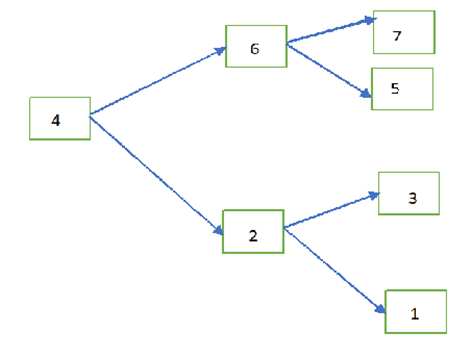

                    Internal Working of Hash Map

Hash set underlying data structure is Hash table . Hash set works on principle of Hashing.

1.when we are added the values into Hash map we should add both key and value.

2. .hashCode() method calculates the hash code of the key

3. Using the Hash code , bucket index will be calculated

4. If there is no Hash Collison then it adds the key value pair into the first node of the bucket.

5. If there is hash collision , then it compare the content of value using Equals method

6.If both the values are not same ,then it adds in the next node.

7.If the values are same then it adds to the linked list by replacing the existing equal node.

**HashCode:**

Providing Memory Identification Number which is given by JVM without checking content

**Equals Method:**

Compares the content or value comparison.

Hash Collision:

Hash collision means getting the same bucket number.

**Java 8 Enhancement to HashMap:**

map.get(“EA”);

Step 1: calculates hash code

Step 2: gets the bucket index

Step 3: traverses through the nodes in the bucket

So it takes time to traverse through all the nodes. Performance Degradation

-  In java 8 , after reaching some threshold of nodes , linked list is converted to tree . the threshold is called Treefy thresholding

Uses Compare to for find the order.

**Linked Hash Set:**

- Child class of Hash Set
- It is used when duplicates are not allowed and insertion order should be preserved.
- Underlying data structure is Hash table and linked list.
- For Cache based applications

