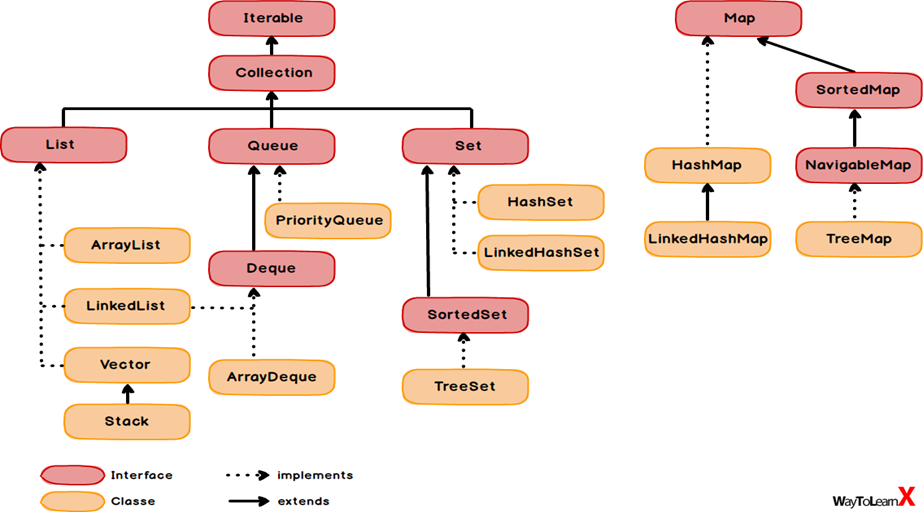
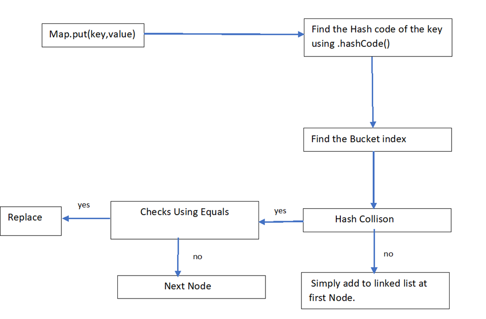

## Difference between Collection and Collections

- Collection is an interface whereas collections is an utility class
- If you want to represent a group of individual object as a single entity then use collection
- Collections class has methods that can be performed on the collection like collections.sort(), min(), max (), reverseOrder(), emptylist(), addAll().

## Collection Hierarchy 

## Linked Hash Set

- Child class of Hash Set
- It is used when duplicates are not allowed and insertion order should be preserved.
- Underlying data structure is Hash table and linked list.
- For Cache based applications

## What is the contract between hashCode() and equals() method

- Whenever it is invoked on the same object more than once during execution of Java application the hashCode method must consistently return the same hashCode value
- if 2 objects are equal according to equals method then hashCode method return the same hash code for the 2 objects
- if the hash code value is same for both the object that doesn't mean that both objects are equal.

**Why we should override hash code and equals method??**

hashcode -based on memory address

equals—based on references

contract b/w hash code and equals: if the hashcodes are same , then only equals method will be called.

1.if we don’t override hashcode

-  it generates the hashcode based on the memory address and as we using new keyword , the address will be different and the hashcodes are different . so equals method won’t be called and the same objects will be inserted which results in duplicates.

2. if we don’t override equals

-  if the hashcodes are same then equals method will be called , as we have not overridden equals method. Object class equal method compares the references and the references will be different , so it returns false , which results duplicates.

Why we should override and equals method?

Student s1=new Student(“Sai”,1);

Student s2=new Student(“Sai”,2);

Set<Studentset=new HashSet<();

set.add(s1);

set.add(s2);

- The hash code will be different
- The size of the set will be 2. Because we didn’t override equals and hash code in Student class and it will invoke objects class equals and that will consider these as distinct objects .
- Because the references are different and points to 2 separate objects in heap memory .This is a bad behaviour in an application and which is cause for few side effects like memory data redundancy etc.
- You overcome this issue it's always best practice to override equals and hashCode in custom classes.

## Cursors in Java

To retrieve elements one by one from collection.

There are 3 coursers in java

1.Enumeration

2.Iterator

3.List Iterator

Enumeration :

- It is used to get Objects one by one from the old Collection Objects like vector and it is introduced in 1.0 v.
- Enumeration e =v.elements();
- It defines the following two methods.
- public boolean hasMoreElements();
- public Objects nextElements();

Iterator:

1.We can apply Iterator concept for any Collection Object .Hence it is universal Cursor.

2. By Using Iterator we can both perform read and remove operations.

3.We can create iterator object by using iterator() method of Collection interface.

Iterator itr =C.iterator(); C is any collection object.

Methods:

1. public boolean hasNext();
2. public Object next();
3. public void remove();

Limitations of Iterator:

1.We can move only towards forward direction and cannot move to the backward direction. Hence these are single direction cursors.

2. By using iterator we can perform only read and remove operations and we can’t perform replacement of new Objects.

List Iterator:

1.By using List Iterator we can move either to the forward direction or the backward direction . Hence these are called as Bidirection cursor.

2.By using List Iterator we can perform replacement and addition of new Objects in addition read and remove operations.

Methods:

1.public boolean hasNext();

2. public Object next();

3. public

int nextIndex();

4. public boolean hasPrevious();

5.public Object previous();

6.public int previousIndex();

7.public void remove();

8. public void set(Object new);

9.public void add(Object new);

## Working of HashMap

                    Internal Working of Hash Map

Hash set underlying data structure is Hash table . Hash set works on principle of Hashing.

1.when we are added the values into Hash map we should add both key and value.

2. .hashCode() method calculates the hash code of the key

3. Using the Hash code , bucket index will be calculated

4. If there is no Hash Collison then it adds the key value pair into the first node of the bucket.

5. If there is hash collision , then it compare the content of value using Equals method

6.If both the values are not same ,then it adds in the next node.

7.If the values are same then it adds to the linked list by replacing the existing equal node.

**HashCode:**

Providing Memory Identification Number which is given by JVM without checking content

**Equals Method:**

Compares the content or value comparison.

Hash Collision:

Hash collision means getting the same bucket number.

**Java 8 Enhancement to HashMap:**

map.get(“EA”);

Step 1: calculates hash code

Step 2: gets the bucket index

Step 3: traverses through the nodes in the bucket

So it takes time to traverse through all the nodes. Performance Degradation

-  In java 8 , after reaching some threshold of nodes , linked list is converted to tree . the threshold is called Treefy thresholding

Uses Compare to for find the order.

