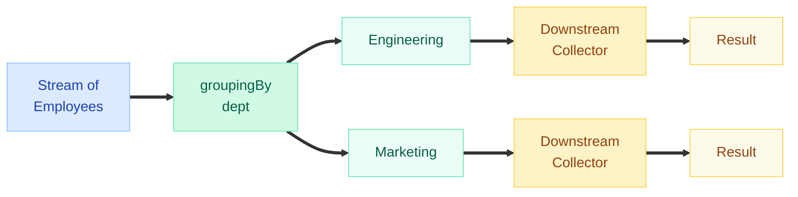
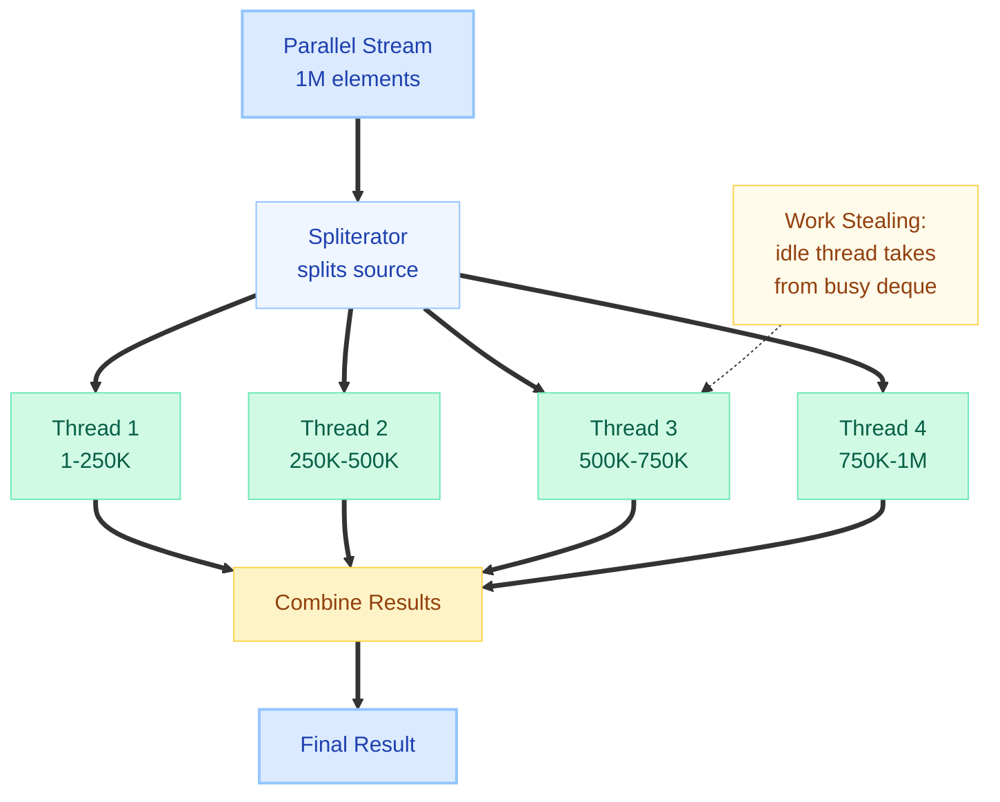
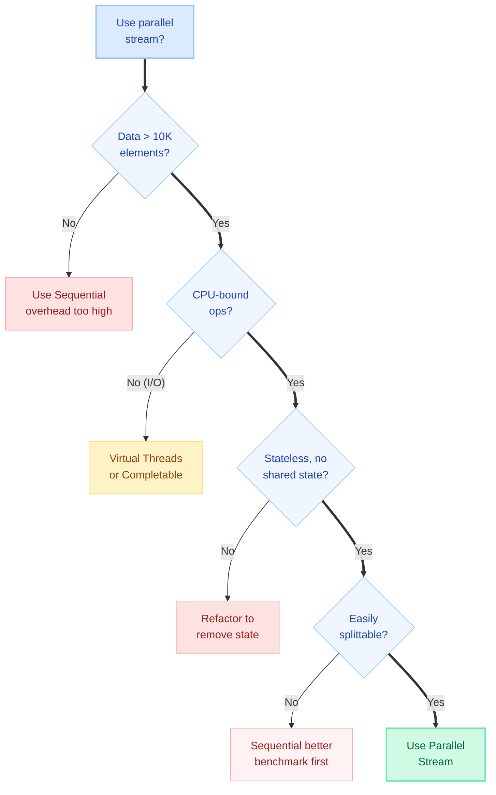
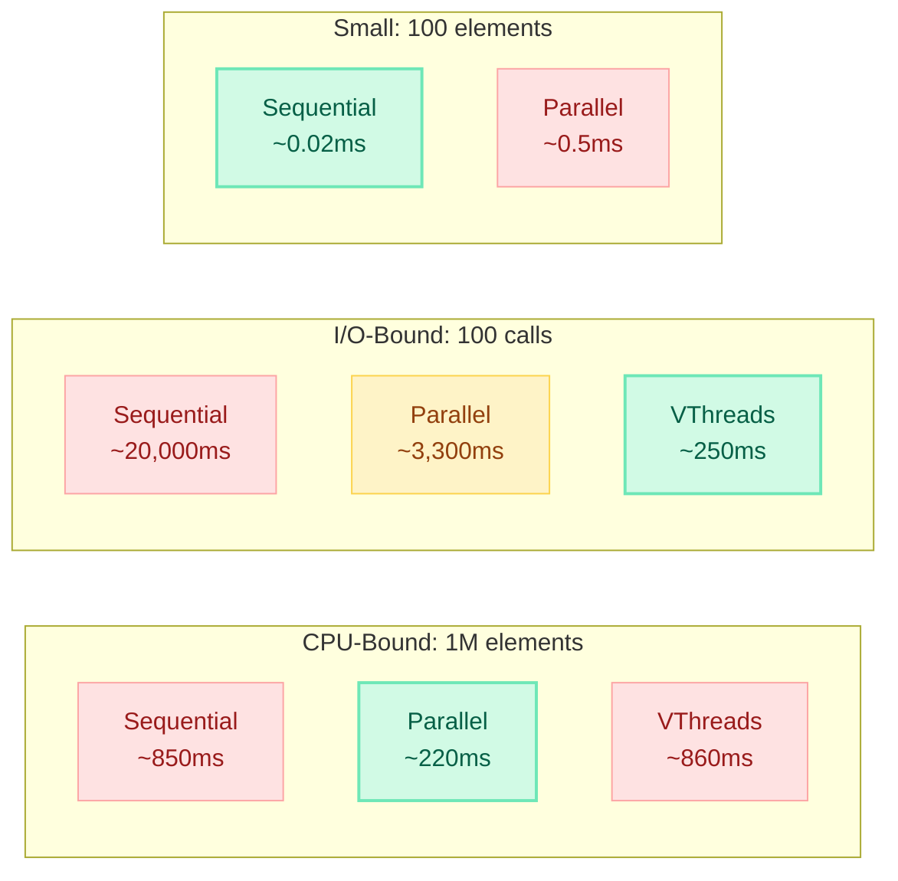

# Collectors & Parallel Streams

> "The Stream API is not just about filtering and mapping — **Collectors** shape data into the exact structure you need, and **parallel streams** unlock multi-core performance without manual threading. Mastering both separates senior engineers from juniors in FAANG interviews."

---

!!! danger "Production Incident: Parallel Stream + Common ForkJoinPool"
    A Spring Boot REST controller used `.parallelStream()` to process a batch of 500 payment records. The stream operations performed HTTP calls to a fraud-detection service (I/O-bound). Since parallel streams use `ForkJoinPool.commonPool()` by default (shared across the entire JVM), all common pool threads were blocked waiting on HTTP responses. This **starved** unrelated parallel operations across the application — health checks timed out, other endpoints became unresponsive, and the load balancer marked the instance as dead. **Fix:** Replaced with a custom `ForkJoinPool` for CPU-bound work, and switched I/O operations to virtual threads.

---

## Collectors Taxonomy

```mermaid
graph TD
    ROOT["Collectors<br/>java.util.stream"]
    
    ROOT --> CAT1["Collection"]
    ROOT --> CAT2["Grouping"]
    ROOT --> CAT3["Reducing"]
    ROOT --> CAT4["String"]
    ROOT --> CAT5["Transform"]
    
    CAT1 --> C1["toList()"]
    CAT1 --> C2["toSet()"]
    CAT1 --> C3["toUnmodifiable<br/>List()"]
    CAT1 --> C4["toCollection()"]
    CAT1 --> C5["toMap()"]
    CAT1 --> C6["toConcurrent<br/>Map()"]
    
    CAT2 --> C7["groupingBy()"]
    CAT2 --> C8["groupingBy<br/>Concurrent()"]
    CAT2 --> C9["partitioningBy()"]
    
    CAT3 --> C10["counting()"]
    CAT3 --> C11["summingInt/<br/>Long/Double()"]
    CAT3 --> C12["averagingInt/<br/>Long/Double()"]
    CAT3 --> C13["summarizing<br/>Int/Long/Double()"]
    CAT3 --> C14["reducing()"]
    CAT3 --> C15["minBy()/maxBy()"]
    
    CAT4 --> C16["joining()"]
    CAT4 --> C17["joining(delim)"]
    CAT4 --> C18["joining(d,pre,suf)"]
    
    CAT5 --> C19["collectingAnd<br/>Then()"]
    CAT5 --> C20["mapping()"]
    CAT5 --> C21["flatMapping()<br/>Java 9+"]
    CAT5 --> C22["filtering()<br/>Java 9+"]
    CAT5 --> C23["teeing()<br/>Java 12+"]
    
    style ROOT fill:#DBEAFE,stroke:#93C5FD,color:#1E40AF,stroke-width:2px
    style CAT1 fill:#DBEAFE,stroke:#93C5FD,color:#1E40AF
    style CAT2 fill:#D1FAE5,stroke:#6EE7B7,color:#065F46
    style CAT3 fill:#FEF3C7,stroke:#FCD34D,color:#92400E
    style CAT4 fill:#FEE2E2,stroke:#FCA5A5,color:#991B1B
    style CAT5 fill:#DBEAFE,stroke:#93C5FD,color:#1E40AF
    style C1 fill:#EFF6FF,stroke:#93C5FD,color:#1E40AF
    style C2 fill:#EFF6FF,stroke:#93C5FD,color:#1E40AF
    style C3 fill:#EFF6FF,stroke:#93C5FD,color:#1E40AF
    style C4 fill:#EFF6FF,stroke:#93C5FD,color:#1E40AF
    style C5 fill:#EFF6FF,stroke:#93C5FD,color:#1E40AF
    style C6 fill:#EFF6FF,stroke:#93C5FD,color:#1E40AF
    style C7 fill:#ECFDF5,stroke:#6EE7B7,color:#065F46
    style C8 fill:#ECFDF5,stroke:#6EE7B7,color:#065F46
    style C9 fill:#ECFDF5,stroke:#6EE7B7,color:#065F46
    style C10 fill:#FFFBEB,stroke:#FCD34D,color:#92400E
    style C11 fill:#FFFBEB,stroke:#FCD34D,color:#92400E
    style C12 fill:#FFFBEB,stroke:#FCD34D,color:#92400E
    style C13 fill:#FFFBEB,stroke:#FCD34D,color:#92400E
    style C14 fill:#FFFBEB,stroke:#FCD34D,color:#92400E
    style C15 fill:#FFFBEB,stroke:#FCD34D,color:#92400E
    style C16 fill:#FEF2F2,stroke:#FCA5A5,color:#991B1B
    style C17 fill:#FEF2F2,stroke:#FCA5A5,color:#991B1B
    style C18 fill:#FEF2F2,stroke:#FCA5A5,color:#991B1B
    style C19 fill:#EFF6FF,stroke:#93C5FD,color:#1E40AF
    style C20 fill:#EFF6FF,stroke:#93C5FD,color:#1E40AF
    style C21 fill:#EFF6FF,stroke:#93C5FD,color:#1E40AF
    style C22 fill:#EFF6FF,stroke:#93C5FD,color:#1E40AF
    style C23 fill:#EFF6FF,stroke:#93C5FD,color:#1E40AF
```



---

## Basic Collection Collectors

```java
import java.util.stream.Collectors;
import java.util.*;

List<String> names = List.of("Alice", "Bob", "Charlie", "Alice");

// toList() — mutable ArrayList (pre-Java 16)
List<String> list = names.stream()
    .collect(Collectors.toList());  // [Alice, Bob, Charlie, Alice]

// toList() — immutable (Java 16+)
List<String> immutable = names.stream().toList();

// toUnmodifiableList() — immutable, null-hostile (Java 10+)
List<String> unmod = names.stream()
    .collect(Collectors.toUnmodifiableList());

// toSet() — removes duplicates
Set<String> set = names.stream()
    .collect(Collectors.toSet());  // [Alice, Bob, Charlie]

// toUnmodifiableSet() — immutable set (Java 10+)
Set<String> unmodSet = names.stream()
    .collect(Collectors.toUnmodifiableSet());

// toCollection() — choose your own collection type
TreeSet<String> sorted = names.stream()
    .collect(Collectors.toCollection(TreeSet::new));
// [Alice, Bob, Charlie] — sorted + deduplicated

LinkedList<String> linked = names.stream()
    .collect(Collectors.toCollection(LinkedList::new));
```

---

## toMap() — Key/Value Extraction

```java
record Employee(int id, String name, String dept, int salary) {}

List<Employee> employees = List.of(
    new Employee(1, "Alice", "Engineering", 120000),
    new Employee(2, "Bob", "Engineering", 110000),
    new Employee(3, "Charlie", "Marketing", 95000)
);

// Basic toMap — key extractor + value extractor
Map<Integer, String> idToName = employees.stream()
    .collect(Collectors.toMap(
        Employee::id,       // key extractor
        Employee::name      // value extractor
    ));
// {1=Alice, 2=Bob, 3=Charlie}

// toMap with identity value
Map<Integer, Employee> idToEmployee = employees.stream()
    .collect(Collectors.toMap(Employee::id, Function.identity()));
```

### Handling Duplicate Keys (Critical Pitfall)

```java
// THIS THROWS IllegalStateException if duplicate keys exist!
Map<String, Integer> deptToSalary = employees.stream()
    .collect(Collectors.toMap(
        Employee::dept,     // "Engineering" appears twice!
        Employee::salary
    ));
// Exception: Duplicate key Engineering

// FIX: Provide merge function (third parameter)
Map<String, Integer> deptToMaxSalary = employees.stream()
    .collect(Collectors.toMap(
        Employee::dept,
        Employee::salary,
        Integer::max        // merge function: keep higher salary
    ));
// {Engineering=120000, Marketing=95000}

// With specific map type (fourth parameter)
TreeMap<String, Integer> sortedMap = employees.stream()
    .collect(Collectors.toMap(
        Employee::dept,
        Employee::salary,
        Integer::sum,           // merge: sum salaries
        TreeMap::new            // map supplier
    ));
```

!!! warning "Interview Pitfall: toMap Without Merge Function"
    **Q:** What happens if you use `Collectors.toMap()` and two elements map to the same key?  
    **A:** It throws `IllegalStateException` at runtime. Always provide a merge function when keys might collide. This is one of the most common bugs in production code using streams.

---

## groupingBy() — The Most Powerful Collector

### Single-Level Grouping

```java
// Group employees by department
Map<String, List<Employee>> byDept = employees.stream()
    .collect(Collectors.groupingBy(Employee::dept));
// {Engineering=[Alice, Bob], Marketing=[Charlie]}
```

### With Downstream Collectors



```java
// Count per group
Map<String, Long> countByDept = employees.stream()
    .collect(Collectors.groupingBy(Employee::dept, Collectors.counting()));
// {Engineering=2, Marketing=1}

// Sum salaries per department
Map<String, Integer> salaryByDept = employees.stream()
    .collect(Collectors.groupingBy(
        Employee::dept, 
        Collectors.summingInt(Employee::salary)
    ));
// {Engineering=230000, Marketing=95000}

// Average salary per department
Map<String, Double> avgByDept = employees.stream()
    .collect(Collectors.groupingBy(
        Employee::dept,
        Collectors.averagingInt(Employee::salary)
    ));

// Collect names per department
Map<String, List<String>> namesByDept = employees.stream()
    .collect(Collectors.groupingBy(
        Employee::dept,
        Collectors.mapping(Employee::name, Collectors.toList())
    ));
// {Engineering=[Alice, Bob], Marketing=[Charlie]}

// Join names per department
Map<String, String> joinedNames = employees.stream()
    .collect(Collectors.groupingBy(
        Employee::dept,
        Collectors.mapping(Employee::name, Collectors.joining(", "))
    ));
// {Engineering=Alice, Bob, Marketing=Charlie}

// Max salary employee per department
Map<String, Optional<Employee>> topEarner = employees.stream()
    .collect(Collectors.groupingBy(
        Employee::dept,
        Collectors.maxBy(Comparator.comparingInt(Employee::salary))
    ));
```

### Multi-Level Grouping (Nested groupingBy)

```java
record Employee(int id, String name, String dept, String city, int salary) {}

// Two levels: department → city → list of employees
Map<String, Map<String, List<Employee>>> nested = employees.stream()
    .collect(Collectors.groupingBy(
        Employee::dept,
        Collectors.groupingBy(Employee::city)
    ));

// Three levels: department → city → count
Map<String, Map<String, Long>> nestedCount = employees.stream()
    .collect(Collectors.groupingBy(
        Employee::dept,
        Collectors.groupingBy(Employee::city, Collectors.counting())
    ));
```

### groupingBy with Custom Map Type

```java
// Use TreeMap for sorted keys
TreeMap<String, List<Employee>> sorted = employees.stream()
    .collect(Collectors.groupingBy(
        Employee::dept,
        TreeMap::new,                    // map factory (second param)
        Collectors.toList()              // downstream (third param)
    ));
```

---

## partitioningBy() — Boolean Split

`partitioningBy()` is a special case of `groupingBy()` that always produces exactly two groups: `true` and `false`.

```java
// Partition into high earners vs others
Map<Boolean, List<Employee>> partitioned = employees.stream()
    .collect(Collectors.partitioningBy(e -> e.salary() > 100000));
// {true=[Alice, Bob], false=[Charlie]}

// With downstream collector
Map<Boolean, Long> countPartition = employees.stream()
    .collect(Collectors.partitioningBy(
        e -> e.salary() > 100000,
        Collectors.counting()
    ));
// {true=2, false=1}

// Partition + collect names
Map<Boolean, List<String>> namePartition = employees.stream()
    .collect(Collectors.partitioningBy(
        e -> e.salary() > 100000,
        Collectors.mapping(Employee::name, Collectors.toList())
    ));
// {true=[Alice, Bob], false=[Charlie]}
```

!!! tip "Interview Tip: groupingBy vs partitioningBy"
    Use `partitioningBy` when you need a boolean split — it guarantees both `true` and `false` keys exist (even if empty). `groupingBy` only includes keys that have at least one element.

---

## Reducing Collectors

```java
// reducing() — like Stream.reduce() but as a downstream collector
Optional<Employee> highestPaid = employees.stream()
    .collect(Collectors.reducing(
        BinaryOperator.maxBy(Comparator.comparingInt(Employee::salary))
    ));

// reducing with identity
int totalSalary = employees.stream()
    .collect(Collectors.reducing(0, Employee::salary, Integer::sum));

// summarizingInt — get count, sum, min, avg, max in one pass
IntSummaryStatistics stats = employees.stream()
    .collect(Collectors.summarizingInt(Employee::salary));
// count=3, sum=325000, min=95000, average=108333.33, max=120000

System.out.println(stats.getMax());     // 120000
System.out.println(stats.getAverage()); // 108333.33
System.out.println(stats.getCount());   // 3
```

---

## String Collectors — joining()

```java
List<String> items = List.of("Java", "Kotlin", "Scala");

// Simple concatenation
String joined = items.stream()
    .collect(Collectors.joining());
// "JavaKotlinScala"

// With delimiter
String csv = items.stream()
    .collect(Collectors.joining(", "));
// "Java, Kotlin, Scala"

// With delimiter, prefix, suffix
String json = items.stream()
    .collect(Collectors.joining("\", \"", "[\"", "\"]"));
// ["Java", "Kotlin", "Scala"]

// Common pattern: building SQL IN clause
String inClause = ids.stream()
    .map(String::valueOf)
    .collect(Collectors.joining(", ", "WHERE id IN (", ")"));
// WHERE id IN (1, 2, 3, 4)
```

---

## collectingAndThen() — Post-Processing

Applies a finishing transformation to the collected result.

```java
// Collect to list, then make unmodifiable
List<String> unmodifiable = employees.stream()
    .map(Employee::name)
    .collect(Collectors.collectingAndThen(
        Collectors.toList(),
        Collections::unmodifiableList
    ));

// Collect and get size
int size = employees.stream()
    .collect(Collectors.collectingAndThen(
        Collectors.toList(),
        List::size
    ));

// Collect to set, then check if singleton
boolean isSingleton = employees.stream()
    .map(Employee::dept)
    .collect(Collectors.collectingAndThen(
        Collectors.toSet(),
        set -> set.size() == 1
    ));

// GroupingBy + collectingAndThen for non-Optional maxBy
Map<String, Employee> topEarnerPerDept = employees.stream()
    .collect(Collectors.groupingBy(
        Employee::dept,
        Collectors.collectingAndThen(
            Collectors.maxBy(Comparator.comparingInt(Employee::salary)),
            Optional::orElseThrow
        )
    ));
```

---

## teeing() — Two Collectors, One Result (Java 12+)

Applies two collectors simultaneously and merges their results.

```java
// Find min and max in one pass
record Range(int min, int max) {}

Range salaryRange = employees.stream()
    .collect(Collectors.teeing(
        Collectors.minBy(Comparator.comparingInt(Employee::salary)),
        Collectors.maxBy(Comparator.comparingInt(Employee::salary)),
        (min, max) -> new Range(
            min.orElseThrow().salary(),
            max.orElseThrow().salary()
        )
    ));
// Range[min=95000, max=120000]

// Count and sum simultaneously
record CountAndSum(long count, int sum) {}

CountAndSum result = employees.stream()
    .collect(Collectors.teeing(
        Collectors.counting(),
        Collectors.summingInt(Employee::salary),
        CountAndSum::new
    ));
// CountAndSum[count=3, sum=325000]

// Partition into pass/fail with counts
record TestResult(long passed, long failed) {}

TestResult scores = students.stream()
    .collect(Collectors.teeing(
        Collectors.filtering(s -> s.score() >= 60, Collectors.counting()),
        Collectors.filtering(s -> s.score() < 60, Collectors.counting()),
        TestResult::new
    ));
```

---

## flatMapping() and filtering() (Java 9+)

These are **downstream collector** variants of `flatMap()` and `filter()`, useful inside `groupingBy()`.

```java
record Order(String customer, List<String> items) {}

List<Order> orders = List.of(
    new Order("Alice", List.of("Laptop", "Mouse")),
    new Order("Alice", List.of("Keyboard")),
    new Order("Bob", List.of("Monitor", "Laptop"))
);

// flatMapping — flatten nested collections per group
Map<String, Set<String>> itemsByCustomer = orders.stream()
    .collect(Collectors.groupingBy(
        Order::customer,
        Collectors.flatMapping(
            order -> order.items().stream(),
            Collectors.toSet()
        )
    ));
// {Alice=[Laptop, Mouse, Keyboard], Bob=[Monitor, Laptop]}

// filtering — filter within groups (not before grouping!)
Map<String, List<Employee>> highEarnersByDept = employees.stream()
    .collect(Collectors.groupingBy(
        Employee::dept,
        Collectors.filtering(
            e -> e.salary() > 100000,
            Collectors.toList()
        )
    ));
// Marketing key exists with empty list: {Engineering=[Alice, Bob], Marketing=[]}
// vs filter().groupingBy() which would OMIT the Marketing key entirely
```

!!! tip "filtering() vs filter() Before groupingBy"
    `Collectors.filtering()` preserves all group keys even if no elements pass the filter. Using `.filter().collect(groupingBy())` before grouping removes groups with no matching elements entirely. This distinction is a common interview question.

---

## Custom Collector — Implementing Collector Interface

```java
public interface Collector<T, A, R> {
    Supplier<A> supplier();          // Create accumulator container
    BiConsumer<A, T> accumulator();  // Add element to container
    BinaryOperator<A> combiner();   // Merge two containers (parallel)
    Function<A, R> finisher();       // Final transformation
    Set<Characteristics> characteristics(); // Optimization hints
}
```

### Example: Top N Elements Collector

```java
public class TopNCollector<T> implements Collector<T, PriorityQueue<T>, List<T>> {
    
    private final int n;
    private final Comparator<T> comparator;
    
    public TopNCollector(int n, Comparator<T> comparator) {
        this.n = n;
        this.comparator = comparator;
    }
    
    @Override
    public Supplier<PriorityQueue<T>> supplier() {
        return () -> new PriorityQueue<>(comparator);
    }
    
    @Override
    public BiConsumer<PriorityQueue<T>, T> accumulator() {
        return (queue, element) -> {
            queue.offer(element);
            if (queue.size() > n) {
                queue.poll();  // Remove lowest when over capacity
            }
        };
    }
    
    @Override
    public BinaryOperator<PriorityQueue<T>> combiner() {
        return (q1, q2) -> {
            q1.addAll(q2);
            while (q1.size() > n) q1.poll();
            return q1;
        };
    }
    
    @Override
    public Function<PriorityQueue<T>, List<T>> finisher() {
        return queue -> {
            List<T> result = new ArrayList<>(queue);
            result.sort(comparator.reversed());
            return Collections.unmodifiableList(result);
        };
    }
    
    @Override
    public Set<Characteristics> characteristics() {
        return Set.of();  // Not IDENTITY_FINISH, not UNORDERED
    }
    
    // Factory method for convenience
    public static <T> TopNCollector<T> topN(int n, Comparator<T> comparator) {
        return new TopNCollector<>(n, comparator);
    }
}

// Usage
List<Employee> top3Earners = employees.stream()
    .collect(TopNCollector.topN(3, Comparator.comparingInt(Employee::salary)));
```

### Collector Characteristics

| Characteristic | Meaning | Effect |
|---|---|---|
| `CONCURRENT` | Accumulator is thread-safe; can be called concurrently | Avoids splitting + merging in parallel |
| `UNORDERED` | Collection does not preserve encounter order | Enables optimizations for parallel |
| `IDENTITY_FINISH` | Finisher is identity function (`A == R`) | Skips finisher step |

```java
// Example: Characteristics in practice
@Override
public Set<Characteristics> characteristics() {
    return Set.of(
        Characteristics.UNORDERED,       // Result order doesn't matter
        Characteristics.IDENTITY_FINISH  // No finisher needed (A == R)
    );
}
```

---

## Parallel Streams — Multi-Core Processing

### How It Works: ForkJoinPool & Work Stealing



```java
// Creating parallel streams
List<Integer> numbers = IntStream.rangeClosed(1, 1_000_000)
    .boxed().toList();

// Method 1: parallelStream() from collection
long sum = numbers.parallelStream()
    .mapToLong(Integer::longValue)
    .sum();

// Method 2: .parallel() on existing stream
long sum2 = numbers.stream()
    .parallel()
    .mapToLong(Integer::longValue)
    .sum();

// Default parallelism level
int parallelism = ForkJoinPool.commonPool().getParallelism();
// Typically Runtime.getRuntime().availableProcessors() - 1
```

---

### When to Use Parallel Streams — Decision Flowchart



---

### Source Splittability

| Source | Splittability | Why |
|--------|:---:|-----|
| `ArrayList` | Excellent | Random access, splits at midpoint in O(1) |
| `Array` / `IntStream.range` | Excellent | Contiguous memory, trivial to split |
| `HashSet` | Good | Backed by array of buckets |
| `TreeSet` | Good | Balanced tree splits reasonably |
| `LinkedList` | **Poor** | No random access; must traverse to split |
| `Stream.iterate()` | **Terrible** | Sequential dependency; cannot split |
| `Stream.generate()` | **Poor** | Stateless but cannot predict size |
| `BufferedReader.lines()` | **Poor** | I/O-bound, sequential reading |

---

### Custom ForkJoinPool — Avoiding Common Pool Starvation

```java
// PROBLEM: parallel streams share ForkJoinPool.commonPool()
// If one stream blocks, ALL parallel streams in the JVM are affected

// SOLUTION: Submit to a custom ForkJoinPool
ForkJoinPool customPool = new ForkJoinPool(8);  // 8 threads

try {
    List<Result> results = customPool.submit(() ->
        largeList.parallelStream()
            .map(this::cpuIntensiveTransform)
            .collect(Collectors.toList())
    ).get();  // .get() blocks until complete
} finally {
    customPool.shutdown();
}

// Java 21+ with virtual threads for I/O-bound work:
try (var executor = Executors.newVirtualThreadPerTaskExecutor()) {
    List<Future<Result>> futures = items.stream()
        .map(item -> executor.submit(() -> fetchFromApi(item)))
        .toList();
    
    List<Result> results = futures.stream()
        .map(f -> { try { return f.get(); } catch (Exception e) { throw new RuntimeException(e); }})
        .toList();
}
```

!!! danger "Never Use Parallel Streams for I/O"
    Parallel streams are designed for **CPU-bound** work. For I/O-bound operations (HTTP calls, database queries, file reads), use `CompletableFuture` with a dedicated thread pool or **virtual threads** (Java 21+). Blocking I/O in `ForkJoinPool.commonPool()` causes thread starvation across the entire application.

---

### Thread Safety Pitfalls

#### Shared Mutable State — Data Corruption

```java
// WRONG: forEach with shared mutable collection
List<Integer> results = new ArrayList<>();  // NOT thread-safe!
IntStream.rangeClosed(1, 10000)
    .parallel()
    .forEach(results::add);  // Race condition! ArrayIndexOutOfBoundsException or lost elements
System.out.println(results.size());  // Often != 10000

// CORRECT: Use collect() — it handles thread-safety internally
List<Integer> results = IntStream.rangeClosed(1, 10000)
    .parallel()
    .boxed()
    .collect(Collectors.toList());  // Thread-safe accumulation
System.out.println(results.size());  // Always 10000
```

#### Non-Associative Reduce — Wrong Results

```java
// WRONG: subtraction is NOT associative
// (a - b) - c != a - (b - c)
int wrong = List.of(1, 2, 3, 4, 5).parallelStream()
    .reduce(0, (a, b) -> a - b);
// Sequential: ((((0-1)-2)-3)-4)-5 = -15
// Parallel: unpredictable results due to different split orderings!

// CORRECT: only use associative operations
int correct = List.of(1, 2, 3, 4, 5).parallelStream()
    .reduce(0, Integer::sum);  // Addition IS associative
```

#### Order Sensitivity

```java
// findFirst() on parallel — more expensive (must track order)
Optional<Integer> first = numbers.parallelStream()
    .filter(n -> n > 100)
    .findFirst();  // Must synchronize to guarantee order

// findAny() on parallel — faster (no ordering constraint)
Optional<Integer> any = numbers.parallelStream()
    .filter(n -> n > 100)
    .findAny();  // Returns whichever thread finds one first

// forEachOrdered() — preserves order but kills parallelism benefit
numbers.parallelStream()
    .map(this::transform)
    .forEachOrdered(System.out::println);  // Ordered, but sequential bottleneck
```

---

### Performance Comparison



---

## Stream.reduce() vs collect()

| Aspect | `reduce()` | `collect()` |
|--------|-----------|------------|
| **Purpose** | Combine elements into single immutable value | Accumulate into mutable container |
| **Identity** | Returns new object each combination | Mutates accumulator in-place |
| **Thread Safety** | Safe (immutable intermediate values) | Safe (combiner merges containers) |
| **Use When** | Summing, finding min/max, concatenating | Building List, Set, Map, StringBuilder |
| **Performance** | Creates intermediate objects (potential GC pressure) | Mutates in-place (more efficient for containers) |

```java
// reduce — creates new String each iteration (O(n^2) for strings!)
String concatenated = words.stream()
    .reduce("", (a, b) -> a + b);  // Slow! Creates n intermediate Strings

// collect — mutates StringBuilder in-place (O(n))
String concatenated = words.stream()
    .collect(StringBuilder::new, StringBuilder::append, StringBuilder::append)
    .toString();

// Or simply:
String concatenated = words.stream()
    .collect(Collectors.joining());
```

!!! tip "Interview Rule of Thumb"
    Use `reduce()` for **arithmetic** (sum, product, min, max) where the result is a primitive/immutable.  
    Use `collect()` for **building collections** (List, Map, Set, String) where mutation is efficient.

---

## Comprehensive Comparison Table

| Feature | `Collectors.toMap()` | `Collectors.groupingBy()` |
|---------|---------------------|--------------------------|
| **Result type** | `Map<K, V>` | `Map<K, List<T>>` (default) |
| **Values** | Single value per key | Collection per key |
| **Duplicate keys** | Throws without merge function | Naturally groups duplicates |
| **Downstream** | N/A (merge function instead) | Any collector |
| **Use case** | Lookup tables, key-value extraction | Aggregation, reporting |

| Feature | `groupingBy()` | `partitioningBy()` |
|---------|---------------|-------------------|
| **Key type** | Any type `K` | `Boolean` only |
| **Empty groups** | Missing from map | Always has `true` and `false` |
| **Use case** | N categories | Binary classification |

| Feature | Sequential Stream | Parallel Stream | Virtual Threads |
|---------|------------------|----------------|-----------------|
| **Best for** | Small data, simple ops | Large data, CPU-bound | I/O-bound (HTTP, DB) |
| **Thread pool** | Calling thread | ForkJoinPool.commonPool | Platform scheduler |
| **Overhead** | None | Splitting + merging | Minimal (fiber-based) |
| **Order** | Guaranteed | Must use forEachOrdered | Developer-managed |
| **Shared state** | Safe (single thread) | Dangerous (race conditions) | Requires synchronization |

---

## Common Pitfalls

| Pitfall | Problem | Solution |
|---------|---------|----------|
| `toMap()` without merge function | `IllegalStateException` on duplicate keys | Always provide merge function: `(a, b) -> a` |
| `groupingBy(null classifier)` | `NullPointerException` if classifier returns null | Filter nulls first or map to "UNKNOWN" |
| `parallelStream() + forEach + shared list` | Data corruption, `ArrayIndexOutOfBoundsException` | Use `.collect(Collectors.toList())` |
| Parallel stream for I/O | Common pool starvation | Use virtual threads or custom executor |
| `reduce` with non-associative op | Wrong results in parallel | Use only associative operations (sum, max, min) |
| `Collectors.toList()` assumed immutable | Returns mutable `ArrayList` | Use `.toList()` (Java 16+) or `toUnmodifiableList()` |
| `findFirst()` in parallel | Performance penalty (ordering constraint) | Use `findAny()` when order doesn't matter |
| Over-parallelizing small collections | Slower than sequential (thread overhead) | Benchmark: typically need >10K elements |
| Parallel + stateful lambda | Non-deterministic results | Keep lambdas pure and stateless |
| Parallel + `limit()` | Short-circuiting less effective in parallel | Acceptable but may process extra elements |

---

## Quick Recall Table

| When You Need... | Use This Collector |
|---|---|
| Elements in a List | `toList()` or `.toList()` (Java 16+) |
| Unique elements | `toSet()` |
| Key-value lookup | `toMap(keyFn, valueFn, mergeFn)` |
| Group by category | `groupingBy(classifier)` |
| Group + count | `groupingBy(classifier, counting())` |
| Group + sum | `groupingBy(classifier, summingInt(fn))` |
| True/false split | `partitioningBy(predicate)` |
| All stats at once | `summarizingInt(fn)` |
| Comma-separated string | `joining(", ")` |
| Two results at once | `teeing(c1, c2, merger)` |
| Transform final result | `collectingAndThen(collector, finisher)` |
| Filter within groups | `filtering(predicate, downstream)` |
| Flatten within groups | `flatMapping(mapper, downstream)` |
| Custom container | Implement `Collector<T, A, R>` |
| Parallel grouping | `groupingByConcurrent(classifier)` |

---

## Interview Answer Template

!!! example "Tell me about Collectors.groupingBy() and when you'd use a downstream collector."
    **Define:** `groupingBy()` groups stream elements into a `Map<K, List<T>>` by a classifier function. The downstream collector transforms each group's elements instead of collecting into a plain List.

    **Use case:** In an e-commerce system, I used `groupingBy(Order::status, counting())` to build a real-time dashboard showing order counts per status. Multi-level grouping with nested `groupingBy` created geographic breakdowns (region -> city -> revenue).

    **Key detail:** Downstream collectors compose — you can chain `groupingBy(dept, mapping(name, joining(", ")))` to get department-to-names-string in one pass. For thread-safe parallel collection, use `groupingByConcurrent()`.

    **Gotcha:** The classifier must not return `null` (throws NPE). Handle with a null-safe wrapper or pre-filter.

!!! example "When would you use a parallel stream vs sequential, and what can go wrong?"
    **Decision criteria:** Parallel streams benefit CPU-bound operations on large datasets (>10K elements) with easily splittable sources (ArrayList, arrays). They use `ForkJoinPool.commonPool()` shared JVM-wide.

    **What goes wrong:** (1) Using parallel for I/O starves the common pool, blocking all other parallel operations. (2) Shared mutable state in `forEach` causes data corruption. (3) Non-associative reduce operations give wrong results. (4) Small collections run slower due to split/merge overhead.

    **Production practice:** For I/O, use virtual threads (Java 21+) or `CompletableFuture` with a dedicated pool. For CPU-bound parallel work where you can't risk common pool interference, submit to a custom `ForkJoinPool`. Always benchmark before committing to parallel.

    **Safe pattern:** Replace `.forEach(sharedList::add)` with `.collect(Collectors.toList())` — the collector's combiner handles thread-safe merging.

---

## References

- [Collectors JavaDoc (Java 21)](https://docs.oracle.com/en/java/javase/21/docs/api/java.base/java/util/stream/Collectors.html)
- [Parallel Streams — Baeldung](https://www.baeldung.com/java-when-to-use-parallel-stream)
- [Custom Collectors — Oracle Tutorial](https://docs.oracle.com/javase/tutorial/collections/streams/reduction.html)
